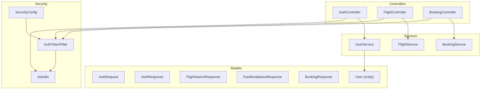
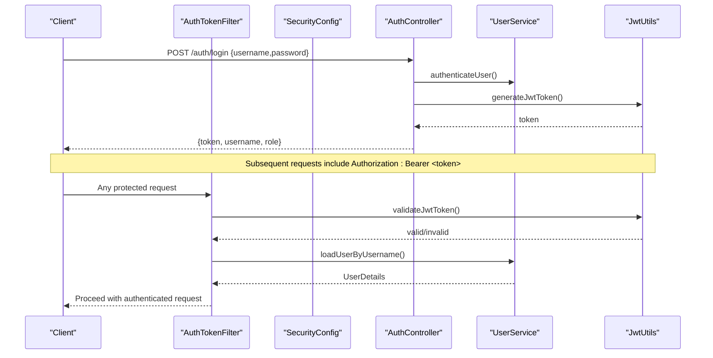
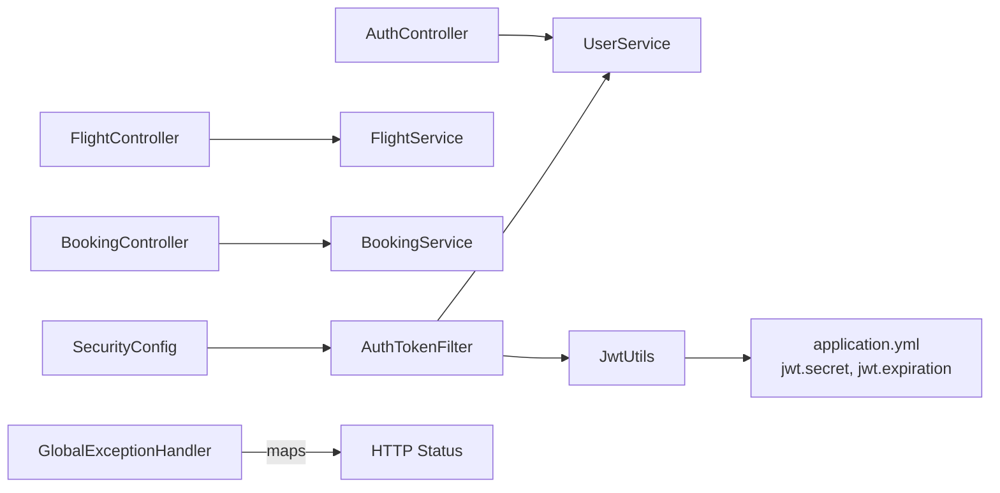

# API Reference

<cite>
**Referenced Files in This Document**
- [AuthController.java](file://backend-server/src/main/java/com/skyflow/controller/AuthController.java)
- [AuthRequest.java](file://backend-server/src/main/java/com/skyflow/model/dto/request/AuthRequest.java)
- [AuthResponse.java](file://backend-server/src/main/java/com/skyflow/model/dto/response/AuthResponse.java)
- [FlightController.java](file://backend-server/src/main/java/com/skyflow/controller/FlightController.java)
- [FlightSearchResponse.java](file://backend-server/src/main/java/com/skyflow/model/dto/response/FlightSearchResponse.java)
- [FareBreakdownResponse.java](file://backend-server/src/main/java/com/skyflow/model/dto/response/FareBreakdownResponse.java)
- [BookingController.java](file://backend-server/src/main/java/com/skyflow/controller/BookingController.java)
- [BookingResponse.java](file://backend-server/src/main/java/com/skyflow/model/dto/response/BookingResponse.java)
- [JwtUtils.java](file://backend-server/src/main/java/com/skyflow/security/JwtUtils.java)
- [AuthTokenFilter.java](file://backend-server/src/main/java/com/skyflow/security/AuthTokenFilter.java)
- [SecurityConfig.java](file://backend-server/src/main/java/com/skyflow/config/SecurityConfig.java)
- [UserService.java](file://backend-server/src/main/java/com/skyflow/service/UserService.java)
- [User.java](file://backend-server/src/main/java/com/skyflow/model/entity/User.java)
- [application.yml](file://backend-server/src/main/resources/application.yml)
- [GlobalExceptionHandler.java](file://backend-server/src/main/java/com/skyflow/exception/GlobalExceptionHandler.java)
- [ApiResponse.java](file://backend-server/src/main/java/com/skyflow/util/ApiResponse.java)
</cite>

## Table of Contents
1. [Introduction](#introduction)
2. [Project Structure](#project-structure)
3. [Core Components](#core-components)
4. [Architecture Overview](#architecture-overview)
5. [Detailed Component Analysis](#detailed-component-analysis)
6. [Dependency Analysis](#dependency-analysis)
7. [Performance Considerations](#performance-considerations)
8. [Troubleshooting Guide](#troubleshooting-guide)
9. [Conclusion](#conclusion)
10. [Appendices](#appendices)

## Introduction
This document provides comprehensive API documentation for the SkyFlow Pro backend REST endpoints. It covers authentication, flight search, booking management, and user management endpoints. For each endpoint, you will find HTTP methods, URL patterns, request/response schemas, authentication requirements, error responses, parameter descriptions, validation rules, and example requests/responses. JWT token usage, role-based access control, and security headers are documented, along with common integration patterns.

## Project Structure
The backend is a Spring Boot application with the following key areas:
- Controllers: expose REST endpoints for auth, flights, and bookings
- Services: encapsulate business logic
- Security: JWT-based authentication and CORS configuration
- Models: request/response DTOs and JPA entities
- Exceptions: centralized error handling
- Configuration: application settings and security filter chain

**Diagram sources**
- [AuthController.java:1-58](file://backend-server/src/main/java/com/skyflow/controller/AuthController.java#L1-L58)
- [FlightController.java:1-50](file://backend-server/src/main/java/com/skyflow/controller/FlightController.java#L1-L50)
- [BookingController.java:1-89](file://backend-server/src/main/java/com/skyflow/controller/BookingController.java#L1-L89)
- [UserService.java:1-42](file://backend-server/src/main/java/com/skyflow/service/UserService.java#L1-L42)
- [JwtUtils.java:1-53](file://backend-server/src/main/java/com/skyflow/security/JwtUtils.java#L1-L53)
- [AuthTokenFilter.java:1-62](file://backend-server/src/main/java/com/skyflow/security/AuthTokenFilter.java#L1-L62)
- [SecurityConfig.java:1-81](file://backend-server/src/main/java/com/skyflow/config/SecurityConfig.java#L1-L81)
- [AuthRequest.java:1-10](file://backend-server/src/main/java/com/skyflow/model/dto/request/AuthRequest.java#L1-L10)
- [AuthResponse.java:1-13](file://backend-server/src/main/java/com/skyflow/model/dto/response/AuthResponse.java#L1-L13)
- [FlightSearchResponse.java:1-34](file://backend-server/src/main/java/com/skyflow/model/dto/response/FlightSearchResponse.java#L1-L34)
- [FareBreakdownResponse.java:1-19](file://backend-server/src/main/java/com/skyflow/model/dto/response/FareBreakdownResponse.java#L1-L19)
- [BookingResponse.java:1-24](file://backend-server/src/main/java/com/skyflow/model/dto/response/BookingResponse.java#L1-L24)
- [User.java:1-31](file://backend-server/src/main/java/com/skyflow/model/entity/User.java#L1-L31)

**Section sources**
- [AuthController.java:1-58](file://backend-server/src/main/java/com/skyflow/controller/AuthController.java#L1-L58)
- [FlightController.java:1-50](file://backend-server/src/main/java/com/skyflow/controller/FlightController.java#L1-L50)
- [BookingController.java:1-89](file://backend-server/src/main/java/com/skyflow/controller/BookingController.java#L1-L89)
- [SecurityConfig.java:1-81](file://backend-server/src/main/java/com/skyflow/config/SecurityConfig.java#L1-L81)

## Core Components
- Authentication endpoints: login and registration
- Flight search endpoints: cities listing, flight search, fare breakdown
- Booking management endpoints: create booking, list my bookings, cancel booking
- Security: JWT token generation/validation, Authorization header parsing, CORS policy
- Error handling: centralized exceptions mapped to structured error responses

**Section sources**
- [AuthController.java:29-56](file://backend-server/src/main/java/com/skyflow/controller/AuthController.java#L29-L56)
- [FlightController.java:24-48](file://backend-server/src/main/java/com/skyflow/controller/FlightController.java#L24-L48)
- [BookingController.java:21-87](file://backend-server/src/main/java/com/skyflow/controller/BookingController.java#L21-L87)
- [JwtUtils.java:23-51](file://backend-server/src/main/java/com/skyflow/security/JwtUtils.java#L23-L51)
- [AuthTokenFilter.java:28-60](file://backend-server/src/main/java/com/skyflow/security/AuthTokenFilter.java#L28-L60)
- [GlobalExceptionHandler.java:20-42](file://backend-server/src/main/java/com/skyflow/exception/GlobalExceptionHandler.java#L20-L42)

## Architecture Overview
SkyFlow Pro uses Spring MVC with Spring Security. Requests pass through a JWT filter that validates tokens and sets authentication in the security context. Public endpoints (auth, flights, cities) are permitted without authentication, while other endpoints require a valid bearer token.

**Diagram sources**
- [AuthController.java:29-40](file://backend-server/src/main/java/com/skyflow/controller/AuthController.java#L29-L40)
- [UserService.java:19-27](file://backend-server/src/main/java/com/skyflow/service/UserService.java#L19-L27)
- [JwtUtils.java:23-41](file://backend-server/src/main/java/com/skyflow/security/JwtUtils.java#L23-L41)
- [AuthTokenFilter.java:28-44](file://backend-server/src/main/java/com/skyflow/security/AuthTokenFilter.java#L28-L44)
- [SecurityConfig.java:50-67](file://backend-server/src/main/java/com/skyflow/config/SecurityConfig.java#L50-L67)

## Detailed Component Analysis

### Authentication Endpoints
- Base path: /auth
- Content-Type: application/json

#### POST /auth/login
- Purpose: Authenticate a user and return a JWT token
- Authentication: None
- Request body: [AuthRequest:6-8](file://backend-server/src/main/java/com/skyflow/model/dto/request/AuthRequest.java#L6-L8)
  - username: string, required
  - password: string, required
- Response: [AuthResponse:8-11](file://backend-server/src/main/java/com/skyflow/model/dto/response/AuthResponse.java#L8-L11)
  - token: string
  - username: string
  - role: string
- Example request:
  - POST /auth/login
  - Body: {"username":"john","password":"pass"}
- Example response:
  - 200 OK
  - Body: {"token":"<JWT>","username":"john","role":"USER"}

Validation and errors:
- On invalid credentials, Spring Security handles the failure; typical responses are 401 Unauthorized via the security filter chain.
- On successful login, a signed JWT is issued with configured expiration.

Security headers:
- Authorization: Bearer <token> (for subsequent protected requests)

**Section sources**
- [AuthController.java:29-40](file://backend-server/src/main/java/com/skyflow/controller/AuthController.java#L29-L40)
- [AuthRequest.java:6-8](file://backend-server/src/main/java/com/skyflow/model/dto/request/AuthRequest.java#L6-L8)
- [AuthResponse.java:8-11](file://backend-server/src/main/java/com/skyflow/model/dto/response/AuthResponse.java#L8-L11)
- [JwtUtils.java:23-32](file://backend-server/src/main/java/com/skyflow/security/JwtUtils.java#L23-L32)
- [application.yml:26-29](file://backend-server/src/main/resources/application.yml#L26-L29)

#### POST /auth/register
- Purpose: Register a new user
- Authentication: None
- Request body: [AuthRequest:6-8](file://backend-server/src/main/java/com/skyflow/model/dto/request/AuthRequest.java#L6-L8)
  - username: string, unique
  - password: string, minimum recommended length enforced by backend
- Response: 200 OK with message on success; 400 Bad Request if username exists
- Example request:
  - POST /auth/register
  - Body: {"username":"alice","password":"securePass"}
- Example response:
  - 200 OK
  - Body: "User registered successfully!"

Validation and errors:
- Returns 400 if username already taken.

**Section sources**
- [AuthController.java:42-56](file://backend-server/src/main/java/com/skyflow/controller/AuthController.java#L42-L56)
- [UserService.java:34-36](file://backend-server/src/main/java/com/skyflow/service/UserService.java#L34-L36)

### Flight Search Endpoints
- Base path: /flights

#### GET /flights/search
- Purpose: Search flights by origin, destination, and date
- Authentication: None
- Query parameters:
  - from: string, required
  - to: string, required
  - date: date (ISO format), required
- Response: array of [FlightSearchResponse:9-32](file://backend-server/src/main/java/com/skyflow/model/dto/response/FlightSearchResponse.java#L9-L32)
  - id, flightNumber, airlineName, airlineCode, airlineLogo
  - origin, destination, departureTime, arrivalTime, durationMinutes, stops
  - classPrices, features
  - availableSeats, surgeActive, surgeMessage, baggagePolicy, refundPolicy, aircraft
- Example request:
  - GET /flights/search?from=JFK&to=LAX&date=2025-01-15
- Example response:
  - 200 OK
  - Body: [{"id":1,"flightNumber":"AA100", ...}, {...}]

Validation and errors:
- No explicit validation in controller; downstream services may throw runtime exceptions.

**Section sources**
- [FlightController.java:29-35](file://backend-server/src/main/java/com/skyflow/controller/FlightController.java#L29-L35)
- [FlightSearchResponse.java:9-32](file://backend-server/src/main/java/com/skyflow/model/dto/response/FlightSearchResponse.java#L9-L32)

#### GET /flights/{id}/fare-breakdown
- Purpose: Get fare breakdown for a flight given seat class and type
- Authentication: None
- Path variable:
  - id: number, required
- Query parameters:
  - class: string, default "Economy"
  - seatType: string, default "standard"
- Response: [FareBreakdownResponse:6-17](file://backend-server/src/main/java/com/skyflow/model/dto/response/FareBreakdownResponse.java#L6-L17)
  - baseFare, taxes, seatCharge, surgeCharge, total, currency
  - seatClass, seatType, seatsLeft, surgeActive, surgeMessage
- Example request:
  - GET /flights/1/fare-breakdown?class=Economy&seatType=standard
- Example response:
  - 200 OK
  - Body: {"baseFare":200.0,"taxes":40.0,...}
- Error:
  - 404 Not Found if flight not found

Validation and errors:
- Returns 404 Not Found when flight does not exist.

**Section sources**
- [FlightController.java:37-48](file://backend-server/src/main/java/com/skyflow/controller/FlightController.java#L37-L48)
- [FareBreakdownResponse.java:6-17](file://backend-server/src/main/java/com/skyflow/model/dto/response/FareBreakdownResponse.java#L6-L17)

#### GET /cities
- Purpose: Retrieve cities with optional tag filtering
- Authentication: None
- Query parameter:
  - tag: string, optional
- Response: array of City entities
- Example request:
  - GET /cities?tag=US
- Example response:
  - 200 OK
  - Body: [{"id":...,"name":"New York",...}, {...}]

Validation and errors:
- No validation performed in controller.

**Section sources**
- [FlightController.java:24-27](file://backend-server/src/main/java/com/skyflow/controller/FlightController.java#L24-L27)

### Booking Management Endpoints
- Base path: /bookings

#### POST /bookings
- Purpose: Create a booking for a logged-in user
- Authentication: Required (Authorization: Bearer <token>)
- Request body: JSON object with fields
  - flightId: number, required
  - seatNumber: string, required
  - seatClass: string, required
- Response: [BookingResponse:8-22](file://backend-server/src/main/java/com/skyflow/model/dto/response/BookingResponse.java#L8-L22)
  - id, bookingReference, pnr, status, bookingDate, totalAmount
  - passengerName, flightNumber, airlineName, origin, destination, departureTime
  - seatNumber, seatClass
- Example request:
  - POST /bookings
  - Headers: Authorization: Bearer <token>
  - Body: {"flightId":1,"seatNumber":"14B","seatClass":"Business"}
- Example response:
  - 200 OK
  - Body: {"id":101,"bookingReference":"REF123",...}
- Error responses:
  - 401 Unauthorized if not authenticated
  - 400 Bad Request if missing fields or invalid flightId
  - 400 Bad Request if flight or seat unavailable
  - 500 Internal Server Error for unexpected failures

Validation and errors:
- Validates presence and type of required fields
- Delegates to service; service may raise runtime exceptions for availability or lookup failures

**Section sources**
- [BookingController.java:21-70](file://backend-server/src/main/java/com/skyflow/controller/BookingController.java#L21-L70)
- [BookingResponse.java:8-22](file://backend-server/src/main/java/com/skyflow/model/dto/response/BookingResponse.java#L8-L22)

#### GET /bookings/my-bookings
- Purpose: List bookings for the authenticated user
- Authentication: Required (Authorization: Bearer <token>)
- Response: array of [BookingResponse:8-22](file://backend-server/src/main/java/com/skyflow/model/dto/response/BookingResponse.java#L8-L22)
- Example request:
  - GET /bookings/my-bookings
  - Headers: Authorization: Bearer <token>
- Example response:
  - 200 OK
  - Body: [{...}, {...}]
- Error responses:
  - 401 Unauthorized if not authenticated
  - Empty array if no bookings or service error

Validation and errors:
- Returns empty array if no bookings or runtime error occurs

**Section sources**
- [BookingController.java:72-82](file://backend-server/src/main/java/com/skyflow/controller/BookingController.java#L72-L82)

#### POST /bookings/cancel/{id}
- Purpose: Cancel a booking by ID for the authenticated user
- Authentication: Required (Authorization: Bearer <token>)
- Path variable:
  - id: number, required
- Response: 200 OK (no content)
- Example request:
  - POST /bookings/cancel/101
  - Headers: Authorization: Bearer <token>
- Example response:
  - 200 OK

Validation and errors:
- Delegates to service; ensure booking belongs to the authenticated user

**Section sources**
- [BookingController.java:84-87](file://backend-server/src/main/java/com/skyflow/controller/BookingController.java#L84-L87)

### User Management Endpoints
- Base path: /users (not present in current controllers)
- Current backend exposes user registration and login but does not define dedicated user management endpoints such as GET /users/{id} or PUT /users/{id}. Any user profile operations would need to be implemented in future iterations.

[No sources needed since this section doesn't analyze specific source files]

## Dependency Analysis
- Controllers depend on services for business logic
- Security filter depends on JwtUtils and UserService
- SecurityConfig defines permitAll for public endpoints and requires authentication for others
- GlobalExceptionHandler centralizes error responses

**Diagram sources**
- [AuthController.java:1-58](file://backend-server/src/main/java/com/skyflow/controller/AuthController.java#L1-L58)
- [FlightController.java:1-50](file://backend-server/src/main/java/com/skyflow/controller/FlightController.java#L1-L50)
- [BookingController.java:1-89](file://backend-server/src/main/java/com/skyflow/controller/BookingController.java#L1-L89)
- [UserService.java:1-42](file://backend-server/src/main/java/com/skyflow/service/UserService.java#L1-L42)
- [JwtUtils.java:1-53](file://backend-server/src/main/java/com/skyflow/security/JwtUtils.java#L1-L53)
- [AuthTokenFilter.java:1-62](file://backend-server/src/main/java/com/skyflow/security/AuthTokenFilter.java#L1-L62)
- [SecurityConfig.java:1-81](file://backend-server/src/main/java/com/skyflow/config/SecurityConfig.java#L1-L81)
- [GlobalExceptionHandler.java:1-55](file://backend-server/src/main/java/com/skyflow/exception/GlobalExceptionHandler.java#L1-L55)
- [application.yml:26-29](file://backend-server/src/main/resources/application.yml#L26-L29)

**Section sources**
- [SecurityConfig.java:50-67](file://backend-server/src/main/java/com/skyflow/config/SecurityConfig.java#L50-L67)
- [GlobalExceptionHandler.java:20-42](file://backend-server/src/main/java/com/skyflow/exception/GlobalExceptionHandler.java#L20-L42)

## Performance Considerations
- Stateless JWT: No server-side session storage improves scalability
- Token expiration: Configurable via application settings
- CORS: Enabled for development; adjust allowed origins for production
- Logging: Security logs are enabled; monitor for authentication failures

[No sources needed since this section provides general guidance]

## Troubleshooting Guide
Common issues and resolutions:
- 401 Unauthorized on protected endpoints
  - Cause: Missing or invalid Authorization header
  - Fix: Include Authorization: Bearer <valid-jwt-token>
- 400 Bad Request during booking
  - Causes: Missing fields, invalid flightId, seat unavailable
  - Fix: Ensure flightId is a positive number from search results, seatNumber and seatClass are non-empty
- 404 Not Found for fare breakdown
  - Cause: Flight not found
  - Fix: Verify flight ID exists
- 500 Internal Server Error
  - Cause: Unexpected backend error
  - Fix: Retry; check server logs

Error response format:
- Fields: timestamp, status, error, message, path
- Example:
  - 400 Bad Request
  - Body: {"timestamp":"...","status":400,"error":"Bad Request","message":"Invalid flight ID.","path":"/bookings"}

**Section sources**
- [GlobalExceptionHandler.java:44-52](file://backend-server/src/main/java/com/skyflow/exception/GlobalExceptionHandler.java#L44-L52)
- [BookingController.java:33-69](file://backend-server/src/main/java/com/skyflow/controller/BookingController.java#L33-L69)

## Conclusion
SkyFlow Pro provides a clean set of REST endpoints for authentication, flight search, and booking management. JWT-based authentication secures protected endpoints, while public endpoints remain accessible for discovery and search. The API responses are straightforward JSON structures, and centralized error handling ensures consistent error reporting. Extend endpoints as needed for user management and administrative features.

[No sources needed since this section summarizes without analyzing specific files]

## Appendices

### Authentication and Security Headers
- Authorization: Bearer <JWT>
- JWT claims: subject (username), issued at, expiration
- Secret and expiration configured in application settings

**Section sources**
- [JwtUtils.java:23-32](file://backend-server/src/main/java/com/skyflow/security/JwtUtils.java#L23-L32)
- [application.yml:26-29](file://backend-server/src/main/resources/application.yml#L26-L29)
- [AuthTokenFilter.java:52-59](file://backend-server/src/main/java/com/skyflow/security/AuthTokenFilter.java#L52-L59)

### Role-Based Access Control
- User entity includes a role field
- Current security configuration permits all endpoints except those explicitly restricted
- RBAC can be enforced at method level using Spring Security annotations

**Section sources**
- [User.java:25-26](file://backend-server/src/main/java/com/skyflow/model/entity/User.java#L25-L26)
- [SecurityConfig.java:55-61](file://backend-server/src/main/java/com/skyflow/config/SecurityConfig.java#L55-L61)

### Example Integration Patterns
- Login flow:
  - POST /auth/login with credentials
  - Store returned token securely
  - Include Authorization: Bearer <token> for all protected requests
- Booking flow:
  - Search flights: GET /flights/search
  - Get fare breakdown: GET /flights/{id}/fare-breakdown
  - Create booking: POST /bookings with {flightId, seatNumber, seatClass}
  - List bookings: GET /bookings/my-bookings
  - Cancel booking: POST /bookings/cancel/{id}

[No sources needed since this section provides general guidance]