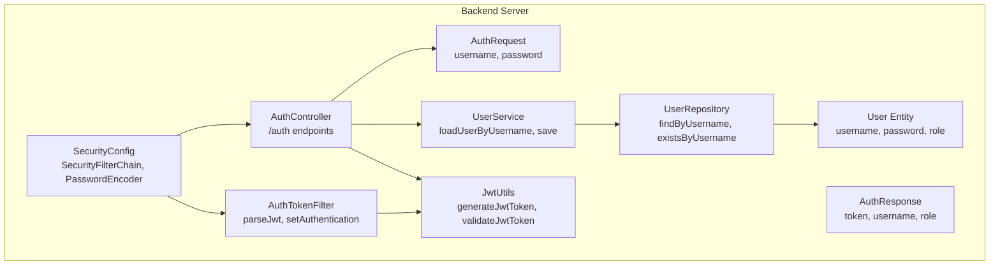
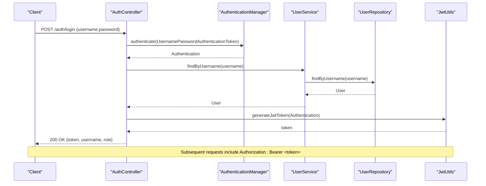
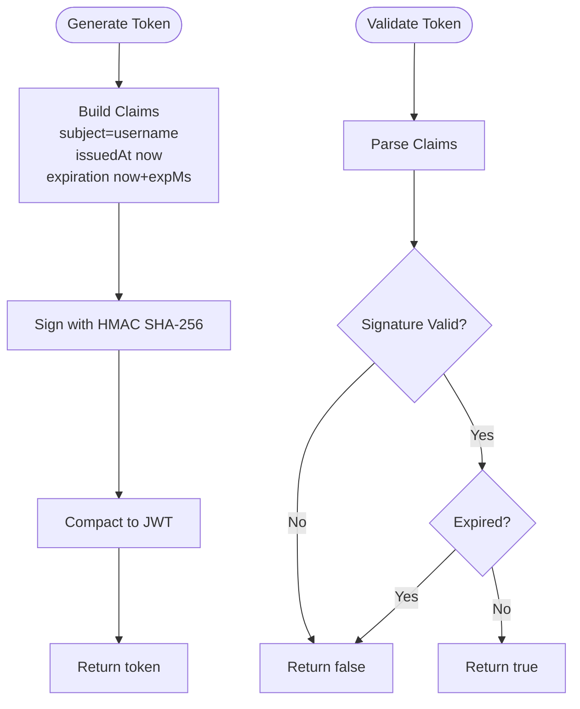
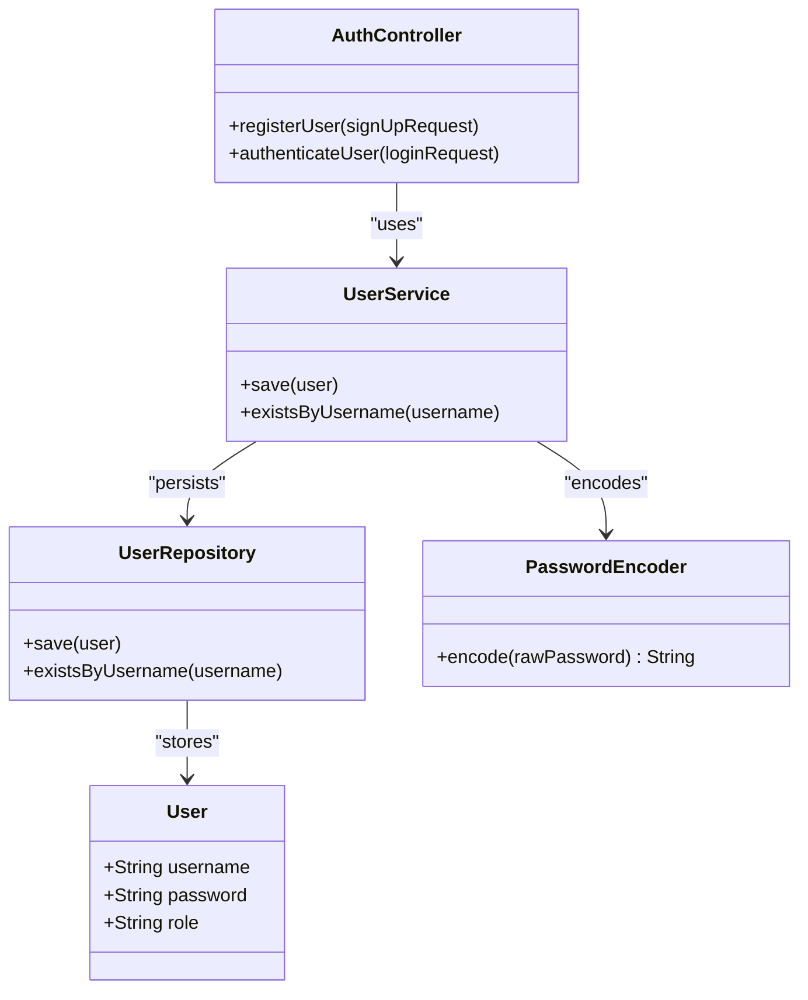
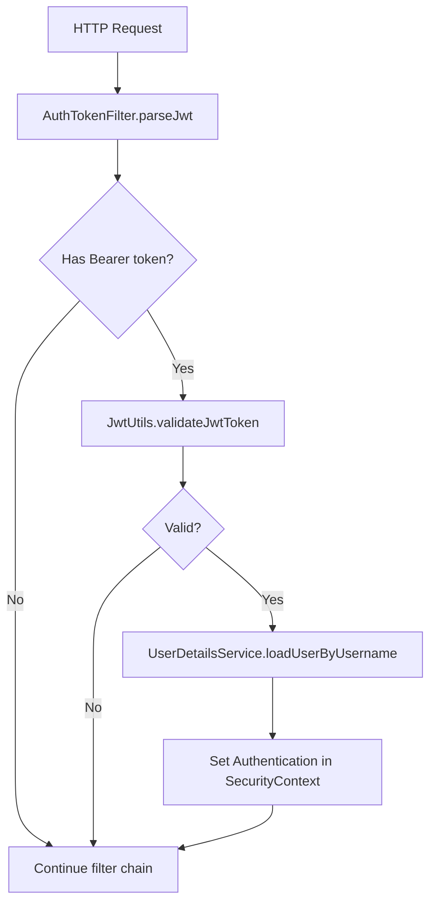
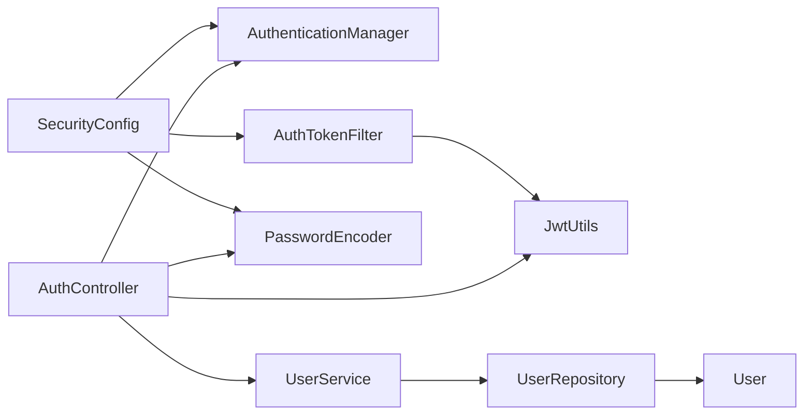

# Authentication Endpoints

<cite>
**Referenced Files in This Document**
- [AuthController.java](file://backend-server/src/main/java/com/skyflow/controller/AuthController.java)
- [AuthRequest.java](file://backend-server/src/main/java/com/skyflow/model/dto/request/AuthRequest.java)
- [AuthResponse.java](file://backend-server/src/main/java/com/skyflow/model/dto/response/AuthResponse.java)
- [JwtUtils.java](file://backend-server/src/main/java/com/skyflow/security/JwtUtils.java)
- [AuthTokenFilter.java](file://backend-server/src/main/java/com/skyflow/security/AuthTokenFilter.java)
- [UserService.java](file://backend-server/src/main/java/com/skyflow/service/UserService.java)
- [UserRepository.java](file://backend-server/src/main/java/com/skyflow/repository/UserRepository.java)
- [User.java](file://backend-server/src/main/java/com/skyflow/model/entity/User.java)
- [SecurityConfig.java](file://backend-server/src/main/java/com/skyflow/config/SecurityConfig.java)
- [application.yml](file://backend-server/src/main/resources/application.yml)
- [GlobalExceptionHandler.java](file://backend-server/src/main/java/com/skyflow/exception/GlobalExceptionHandler.java)
- [UnauthorizedException.java](file://backend-server/src/main/java/com/skyflow/exception/UnauthorizedException.java)
- [BadRequestException.java](file://backend-server/src/main/java/com/skyflow/exception/BadRequestException.java)
</cite>

## Table of Contents
1. [Introduction](#introduction)
2. [Project Structure](#project-structure)
3. [Core Components](#core-components)
4. [Architecture Overview](#architecture-overview)
5. [Detailed Component Analysis](#detailed-component-analysis)
6. [Dependency Analysis](#dependency-analysis)
7. [Performance Considerations](#performance-considerations)
8. [Troubleshooting Guide](#troubleshooting-guide)
9. [Conclusion](#conclusion)

## Introduction
This document provides comprehensive API documentation for the authentication endpoints exposed by the backend server. It covers:
- POST /auth/login for user authentication
- POST /auth/register for user registration
- JWT token generation and validation
- Password encoding requirements
- Error handling and security considerations
- Request/response examples and integration patterns

## Project Structure
The authentication functionality is implemented in the backend server module under the Java package com.skyflow. Key components include:
- Controller layer for HTTP endpoints
- Model DTOs for request/response payloads
- Security utilities for JWT handling and filters
- Service and repository layers for user management
- Spring Security configuration for authentication and authorization

**Diagram sources**
- [AuthController.java:17-57](file://backend-server/src/main/java/com/skyflow/controller/AuthController.java#L17-L57)
- [AuthRequest.java:5-9](file://backend-server/src/main/java/com/skyflow/model/dto/request/AuthRequest.java#L5-L9)
- [AuthResponse.java:6-12](file://backend-server/src/main/java/com/skyflow/model/dto/response/AuthResponse.java#L6-L12)
- [UserService.java:13-41](file://backend-server/src/main/java/com/skyflow/service/UserService.java#L13-L41)
- [UserRepository.java:7-11](file://backend-server/src/main/java/com/skyflow/repository/UserRepository.java#L7-L11)
- [User.java:9-30](file://backend-server/src/main/java/com/skyflow/model/entity/User.java#L9-L30)
- [SecurityConfig.java:20-80](file://backend-server/src/main/java/com/skyflow/config/SecurityConfig.java#L20-L80)
- [JwtUtils.java:14-52](file://backend-server/src/main/java/com/skyflow/security/JwtUtils.java#L14-L52)
- [AuthTokenFilter.java:19-61](file://backend-server/src/main/java/com/skyflow/security/AuthTokenFilter.java#L19-L61)

**Section sources**
- [AuthController.java:17-57](file://backend-server/src/main/java/com/skyflow/controller/AuthController.java#L17-L57)
- [SecurityConfig.java:20-80](file://backend-server/src/main/java/com/skyflow/config/SecurityConfig.java#L20-L80)

## Core Components
- AuthController: Exposes /auth endpoints and orchestrates authentication and registration flows.
- AuthRequest: Defines the request payload schema for login and registration.
- AuthResponse: Defines the response payload schema for successful authentication.
- JwtUtils: Implements JWT token generation, parsing, and validation.
- AuthTokenFilter: Extracts JWT from Authorization header and sets Spring Security context.
- UserService and UserRepository: Manage user persistence and retrieval.
- SecurityConfig: Configures Spring Security, password encoding, and CORS.

**Section sources**
- [AuthController.java:29-56](file://backend-server/src/main/java/com/skyflow/controller/AuthController.java#L29-L56)
- [AuthRequest.java:5-9](file://backend-server/src/main/java/com/skyflow/model/dto/request/AuthRequest.java#L5-L9)
- [AuthResponse.java:6-12](file://backend-server/src/main/java/com/skyflow/model/dto/response/AuthResponse.java#L6-L12)
- [JwtUtils.java:23-51](file://backend-server/src/main/java/com/skyflow/security/JwtUtils.java#L23-L51)
- [AuthTokenFilter.java:28-50](file://backend-server/src/main/java/com/skyflow/security/AuthTokenFilter.java#L28-L50)
- [UserService.java:19-40](file://backend-server/src/main/java/com/skyflow/service/UserService.java#L19-L40)
- [UserRepository.java:7-11](file://backend-server/src/main/java/com/skyflow/repository/UserRepository.java#L7-L11)
- [SecurityConfig.java:31-67](file://backend-server/src/main/java/com/skyflow/config/SecurityConfig.java#L31-L67)

## Architecture Overview
The authentication flow integrates Spring Security with JWT-based stateless authentication:
- Login validates credentials against stored BCrypt hashes.
- Registration encodes passwords and persists user records.
- JWT tokens are generated upon successful authentication and validated on subsequent requests.

**Diagram sources**
- [AuthController.java:29-40](file://backend-server/src/main/java/com/skyflow/controller/AuthController.java#L29-L40)
- [UserService.java:29-32](file://backend-server/src/main/java/com/skyflow/service/UserService.java#L29-L32)
- [UserRepository.java:8](file://backend-server/src/main/java/com/skyflow/repository/UserRepository.java#L8)
- [JwtUtils.java:23-32](file://backend-server/src/main/java/com/skyflow/security/JwtUtils.java#L23-L32)

## Detailed Component Analysis

### POST /auth/login
Purpose: Authenticate a user and issue a JWT token.

- Request Body Schema
  - username: string, required
  - password: string, required
- Successful Response (200 OK)
  - token: string (JWT)
  - username: string
  - role: string
- Error Responses
  - 401 Unauthorized: Invalid credentials or authentication failure
  - 500 Internal Server Error: Unexpected server error

Common Integration Pattern
- Send POST /auth/login with JSON body containing username and password.
- On success, store the returned token securely (e.g., HttpOnly cookie or secure storage).
- Include Authorization: Bearer <token> in subsequent authenticated requests.

Request Example
- POST /auth/login
- Headers: Content-Type: application/json
- Body: {"username":"john","password":"secret"}

Response Example (Success)
- Status: 200 OK
- Body: {"token":"<JWT>","username":"john","role":"USER"}

Response Example (Failure)
- Status: 401 Unauthorized
- Body: {"timestamp":"...","status":401,"error":"Unauthorized","message":"Invalid credentials","path":"/auth/login"}

Security Considerations
- Credentials are transmitted over HTTPS.
- Passwords are hashed using BCrypt on registration and verified by Spring Security.
- JWT secret and expiration are configured in application.yml.

**Section sources**
- [AuthController.java:29-40](file://backend-server/src/main/java/com/skyflow/controller/AuthController.java#L29-L40)
- [AuthRequest.java:5-9](file://backend-server/src/main/java/com/skyflow/model/dto/request/AuthRequest.java#L5-L9)
- [AuthResponse.java:6-12](file://backend-server/src/main/java/com/skyflow/model/dto/response/AuthResponse.java#L6-L12)
- [SecurityConfig.java:45-47](file://backend-server/src/main/java/com/skyflow/config/SecurityConfig.java#L45-L47)
- [application.yml:26-29](file://backend-server/src/main/resources/application.yml#L26-L29)

### POST /auth/register
Purpose: Register a new user account.

- Request Body Schema
  - username: string, required
  - password: string, required
- Successful Response (200 OK)
  - Message indicating successful registration
- Error Responses
  - 400 Bad Request: Username already taken
  - 500 Internal Server Error: Unexpected server error

Common Integration Pattern
- Send POST /auth/register with JSON body containing username and password.
- On success, the user can immediately log in to obtain a JWT.

Request Example
- POST /auth/register
- Headers: Content-Type: application/json
- Body: {"username":"alice","password":"securePass"}

Response Example (Success)
- Status: 200 OK
- Body: "User registered successfully!"

Response Example (Failure)
- Status: 400 Bad Request
- Body: "Error: Username is already taken!"

Security Considerations
- Passwords are encoded using BCrypt before persistence.
- Username uniqueness is enforced at the repository level.

**Section sources**
- [AuthController.java:42-56](file://backend-server/src/main/java/com/skyflow/controller/AuthController.java#L42-L56)
- [AuthRequest.java:5-9](file://backend-server/src/main/java/com/skyflow/model/dto/request/AuthRequest.java#L5-L9)
- [UserService.java:34-36](file://backend-server/src/main/java/com/skyflow/service/UserService.java#L34-L36)
- [UserRepository.java:10](file://backend-server/src/main/java/com/skyflow/repository/UserRepository.java#L10)
- [User.java:21-26](file://backend-server/src/main/java/com/skyflow/model/entity/User.java#L21-L26)

### JWT Token Generation and Validation
- Generation
  - Uses HS256 signing with a base64-encoded secret from application.yml.
  - Token includes issued-at and expiration timestamps.
- Validation
  - Validates signature and expiration.
  - Extracts username from token subject for principal loading.

**Diagram sources**
- [JwtUtils.java:23-32](file://backend-server/src/main/java/com/skyflow/security/JwtUtils.java#L23-L32)
- [JwtUtils.java:43-51](file://backend-server/src/main/java/com/skyflow/security/JwtUtils.java#L43-L51)

**Section sources**
- [JwtUtils.java:17-36](file://backend-server/src/main/java/com/skyflow/security/JwtUtils.java#L17-L36)
- [application.yml:26-29](file://backend-server/src/main/resources/application.yml#L26-L29)

### Password Encoding Requirements
- Encoding Algorithm: BCrypt
- Applied During:
  - Registration: password is encoded before saving.
  - Authentication: Spring Security compares provided password against stored hash.

**Diagram sources**
- [AuthController.java:42-56](file://backend-server/src/main/java/com/skyflow/controller/AuthController.java#L42-L56)
- [UserService.java:38-40](file://backend-server/src/main/java/com/skyflow/service/UserService.java#L38-L40)
- [UserRepository.java:10](file://backend-server/src/main/java/com/skyflow/repository/UserRepository.java#L10)
- [User.java:21-26](file://backend-server/src/main/java/com/skyflow/model/entity/User.java#L21-L26)
- [SecurityConfig.java:45-47](file://backend-server/src/main/java/com/skyflow/config/SecurityConfig.java#L45-L47)

**Section sources**
- [SecurityConfig.java:45-47](file://backend-server/src/main/java/com/skyflow/config/SecurityConfig.java#L45-L47)
- [AuthController.java:50](file://backend-server/src/main/java/com/skyflow/controller/AuthController.java#L50)
- [User.java:21-26](file://backend-server/src/main/java/com/skyflow/model/entity/User.java#L21-L26)

### Security Configuration and Filter Chain
- Stateless sessions: SessionCreationPolicy.STATELESS
- Public endpoints: /auth/** permitted without authentication
- JWT filter: AuthTokenFilter extracts Bearer token and sets SecurityContext
- CORS: Enabled with credentials allowed

**Diagram sources**
- [AuthTokenFilter.java:28-50](file://backend-server/src/main/java/com/skyflow/security/AuthTokenFilter.java#L28-L50)
- [JwtUtils.java:38-51](file://backend-server/src/main/java/com/skyflow/security/JwtUtils.java#L38-L51)
- [SecurityConfig.java:50-67](file://backend-server/src/main/java/com/skyflow/config/SecurityConfig.java#L50-L67)

**Section sources**
- [SecurityConfig.java:50-67](file://backend-server/src/main/java/com/skyflow/config/SecurityConfig.java#L50-L67)
- [AuthTokenFilter.java:52-60](file://backend-server/src/main/java/com/skyflow/security/AuthTokenFilter.java#L52-L60)

## Dependency Analysis
- AuthController depends on AuthenticationManager, UserService, PasswordEncoder, and JwtUtils.
- UserService depends on UserRepository and delegates to Spring’s UserDetailsService.
- JwtUtils depends on application.yml for jwt.secret and jwt.expiration.
- SecurityConfig wires PasswordEncoder, AuthenticationProvider, and AuthTokenFilter.

**Diagram sources**
- [AuthController.java:20-27](file://backend-server/src/main/java/com/skyflow/controller/AuthController.java#L20-L27)
- [UserService.java:16-17](file://backend-server/src/main/java/com/skyflow/service/UserService.java#L16-L17)
- [UserRepository.java:7-11](file://backend-server/src/main/java/com/skyflow/repository/UserRepository.java#L7-L11)
- [User.java:9-30](file://backend-server/src/main/java/com/skyflow/model/entity/User.java#L9-L30)
- [SecurityConfig.java:31-67](file://backend-server/src/main/java/com/skyflow/config/SecurityConfig.java#L31-L67)
- [JwtUtils.java:17-21](file://backend-server/src/main/java/com/skyflow/security/JwtUtils.java#L17-L21)
- [AuthTokenFilter.java:22-26](file://backend-server/src/main/java/com/skyflow/security/AuthTokenFilter.java#L22-L26)

**Section sources**
- [AuthController.java:20-27](file://backend-server/src/main/java/com/skyflow/controller/AuthController.java#L20-L27)
- [UserService.java:16-17](file://backend-server/src/main/java/com/skyflow/service/UserService.java#L16-L17)
- [UserRepository.java:7-11](file://backend-server/src/main/java/com/skyflow/repository/UserRepository.java#L7-L11)
- [SecurityConfig.java:31-67](file://backend-server/src/main/java/com/skyflow/config/SecurityConfig.java#L31-L67)
- [JwtUtils.java:17-21](file://backend-server/src/main/java/com/skyflow/security/JwtUtils.java#L17-L21)
- [AuthTokenFilter.java:22-26](file://backend-server/src/main/java/com/skyflow/security/AuthTokenFilter.java#L22-L26)

## Performance Considerations
- Stateless JWT eliminates server-side session storage overhead.
- BCrypt hashing is computationally intensive; ensure adequate CPU resources for registration and login.
- Configure jwt.expiration appropriately to balance security and client refresh frequency.
- Consider rate limiting for /auth endpoints to mitigate brute-force attacks.

## Troubleshooting Guide
Common Issues and Resolutions
- 401 Unauthorized on login
  - Verify username and password correctness.
  - Confirm JWT secret and expiration are correctly configured.
- 400 Bad Request on registration
  - Ensure username is unique; the endpoint returns a specific error when the username already exists.
- 403 Forbidden or missing Authorization
  - Include Authorization: Bearer <token> in requests requiring authentication.
- CORS errors
  - Confirm that the frontend origin is allowed by the CORS configuration.

Error Handling Behavior
- UnauthorizedException and BadRequestException are mapped to appropriate HTTP status codes via GlobalExceptionHandler.
- GlobalExceptionHandler returns standardized error payloads with timestamp, status, error, message, and path.

**Section sources**
- [AuthController.java:44-46](file://backend-server/src/main/java/com/skyflow/controller/AuthController.java#L44-L46)
- [GlobalExceptionHandler.java:20-42](file://backend-server/src/main/java/com/skyflow/exception/GlobalExceptionHandler.java#L20-L42)
- [UnauthorizedException.java:6-15](file://backend-server/src/main/java/com/skyflow/exception/UnauthorizedException.java#L6-L15)
- [BadRequestException.java:6-15](file://backend-server/src/main/java/com/skyflow/exception/BadRequestException.java#L6-L15)

## Conclusion
The authentication endpoints provide a secure, stateless mechanism for user login and registration using JWT and BCrypt. The design emphasizes simplicity, scalability, and adherence to Spring Security best practices. Integrators should follow the documented request/response schemas, include the Authorization header for protected endpoints, and handle error responses gracefully.