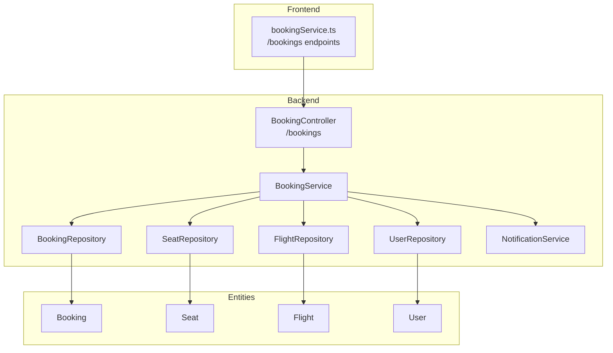
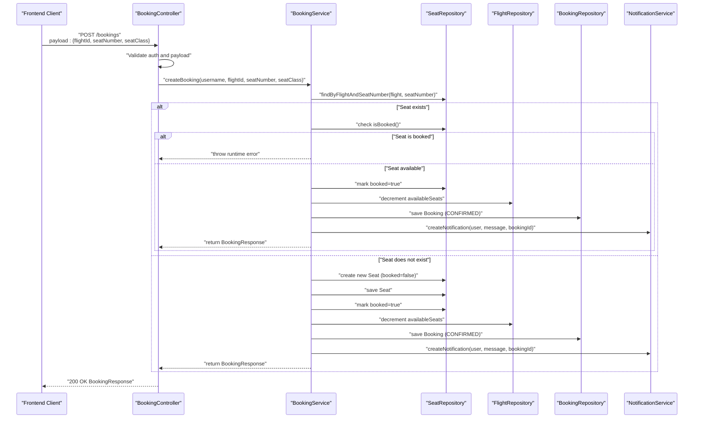
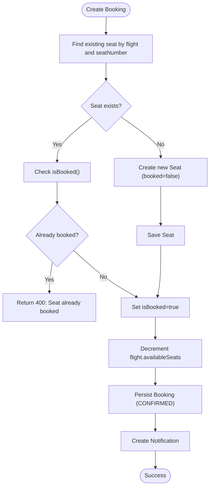
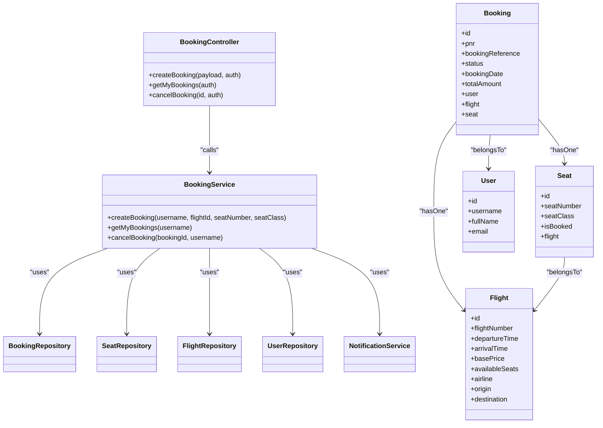

# Booking Management Endpoints

<cite>
**Referenced Files in This Document**
- [BookingController.java](file://backend-server/src/main/java/com/skyflow/controller/BookingController.java)
- [BookingService.java](file://backend-server/src/main/java/com/skyflow/service/BookingService.java)
- [Booking.java](file://backend-server/src/main/java/com/skyflow/model/entity/Booking.java)
- [BookingResponse.java](file://backend-server/src/main/java/com/skyflow/model/dto/response/BookingResponse.java)
- [Seat.java](file://backend-server/src/main/java/com/skyflow/model/entity/Seat.java)
- [Flight.java](file://backend-server/src/main/java/com/skyflow/model/entity/Flight.java)
- [User.java](file://backend-server/src/main/java/com/skyflow/model/entity/User.java)
- [BookingRepository.java](file://backend-server/src/main/java/com/skyflow/repository/BookingRepository.java)
- [NotificationService.java](file://backend-server/src/main/java/com/skyflow/service/NotificationService.java)
- [GlobalExceptionHandler.java](file://backend-server/src/main/java/com/skyflow/exception/GlobalExceptionHandler.java)
- [application.yml](file://backend-server/src/main/resources/application.yml)
- [bookingService.ts](file://skyflow-pro/src/services/bookings/bookingService.ts)
</cite>

## Table of Contents
1. [Introduction](#introduction)
2. [Project Structure](#project-structure)
3. [Core Components](#core-components)
4. [Architecture Overview](#architecture-overview)
5. [Detailed Component Analysis](#detailed-component-analysis)
6. [Dependency Analysis](#dependency-analysis)
7. [Performance Considerations](#performance-considerations)
8. [Troubleshooting Guide](#troubleshooting-guide)
9. [Conclusion](#conclusion)
10. [Appendices](#appendices)

## Introduction
This document provides comprehensive API documentation for the booking management endpoints in the airline reservation system. It covers the CRUD operations for bookings, including retrieving user bookings, creating new bookings, canceling bookings, and the underlying booking status management, seat allocation logic, and confirmation workflows. It also outlines request/response schemas, validation rules, error handling, and practical examples for common scenarios.

## Project Structure
The booking functionality spans the backend Spring Boot application and the frontend React client. The backend exposes REST endpoints under /bookings, while the frontend integrates with these endpoints via a dedicated service.

**Diagram sources**
- [BookingController.java:14-88](file://backend-server/src/main/java/com/skyflow/controller/BookingController.java#L14-L88)
- [BookingService.java:22-147](file://backend-server/src/main/java/com/skyflow/service/BookingService.java#L22-L147)
- [BookingRepository.java:9-13](file://backend-server/src/main/java/com/skyflow/repository/BookingRepository.java#L9-L13)
- [Seat.java:13-29](file://backend-server/src/main/java/com/skyflow/model/entity/Seat.java#L13-L29)
- [Flight.java:12-42](file://backend-server/src/main/java/com/skyflow/model/entity/Flight.java#L12-L42)
- [User.java:9-30](file://backend-server/src/main/java/com/skyflow/model/entity/User.java#L9-L30)
- [bookingService.ts:19-38](file://skyflow-pro/src/services/bookings/bookingService.ts#L19-L38)

**Section sources**
- [BookingController.java:14-88](file://backend-server/src/main/java/com/skyflow/controller/BookingController.java#L14-L88)
- [BookingService.java:22-147](file://backend-server/src/main/java/com/skyflow/service/BookingService.java#L22-L147)
- [bookingService.ts:19-38](file://skyflow-pro/src/services/bookings/bookingService.ts#L19-L38)

## Core Components
- BookingController: Exposes REST endpoints for booking operations and handles authentication checks and basic input validation.
- BookingService: Implements core business logic for booking creation, retrieval, cancellation, seat allocation, and price calculation.
- Entities: Booking, Seat, Flight, and User define the domain model and relationships.
- Repositories: JPA repositories manage persistence for bookings, seats, flights, and users.
- NotificationService: Handles user notifications for booking confirmations and cancellations.
- Frontend bookingService: Provides typed client-side integration for booking endpoints.

Key responsibilities:
- Authentication enforcement for protected endpoints.
- Seat availability validation and atomic updates.
- Price computation with seat class multipliers and taxes.
- Booking status transitions (CONFIRMED, CANCELLED).
- Notification generation upon booking events.

**Section sources**
- [BookingController.java:14-88](file://backend-server/src/main/java/com/skyflow/controller/BookingController.java#L14-L88)
- [BookingService.java:22-147](file://backend-server/src/main/java/com/skyflow/service/BookingService.java#L22-L147)
- [Booking.java:8-41](file://backend-server/src/main/java/com/skyflow/model/entity/Booking.java#L8-L41)
- [Seat.java:7-29](file://backend-server/src/main/java/com/skyflow/model/entity/Seat.java#L7-L29)
- [Flight.java:8-42](file://backend-server/src/main/java/com/skyflow/model/entity/Flight.java#L8-L42)
- [User.java:9-30](file://backend-server/src/main/java/com/skyflow/model/entity/User.java#L9-L30)
- [BookingRepository.java:9-13](file://backend-server/src/main/java/com/skyflow/repository/BookingRepository.java#L9-L13)
- [NotificationService.java:12-34](file://backend-server/src/main/java/com/skyflow/service/NotificationService.java#L12-L34)

## Architecture Overview
The booking workflow integrates frontend and backend components. The frontend collects passenger and seat preferences, then posts to the backend. The backend validates inputs, allocates seats atomically, updates flight availability, calculates pricing, persists the booking, and notifies the user.

**Diagram sources**
- [BookingController.java:21-70](file://backend-server/src/main/java/com/skyflow/controller/BookingController.java#L21-L70)
- [BookingService.java:43-98](file://backend-server/src/main/java/com/skyflow/service/BookingService.java#L43-L98)
- [Seat.java:13-29](file://backend-server/src/main/java/com/skyflow/model/entity/Seat.java#L13-L29)
- [Flight.java:12-42](file://backend-server/src/main/java/com/skyflow/model/entity/Flight.java#L12-L42)
- [Booking.java:12-41](file://backend-server/src/main/java/com/skyflow/model/entity/Booking.java#L12-L41)
- [NotificationService.java:27-33](file://backend-server/src/main/java/com/skyflow/service/NotificationService.java#L27-L33)

## Detailed Component Analysis

### Endpoint Definitions

#### GET /bookings/my-bookings
- Description: Retrieves all bookings associated with the authenticated user.
- Authentication: Required (via Spring Security).
- Response: Array of BookingResponse objects.
- Status Codes:
  - 200 OK: Successful retrieval.
  - 401 Unauthorized: No active session.
- Notes: Returns empty array if user has no bookings.

**Section sources**
- [BookingController.java:72-82](file://backend-server/src/main/java/com/skyflow/controller/BookingController.java#L72-L82)
- [BookingService.java:100-105](file://backend-server/src/main/java/com/skyflow/service/BookingService.java#L100-L105)

#### POST /bookings
- Description: Creates a new booking for the authenticated user.
- Authentication: Required.
- Request Body Schema:
  - flightId: number (required)
  - seatNumber: string (required)
  - seatClass: string (required)
- Response: BookingResponse.
- Validation Rules:
  - flightId must be a positive integer.
  - seatNumber and seatClass must be non-empty strings.
  - Seat must be available (not already booked).
  - Flight must exist.
- Error Responses:
  - 400 Bad Request: Missing fields, invalid flightId, seat not available.
  - 401 Unauthorized: No active session.
  - 500 Internal Server Error: Unexpected failure during booking.
- Notes: Seat class multipliers apply to base price with 12% tax included.

**Section sources**
- [BookingController.java:21-70](file://backend-server/src/main/java/com/skyflow/controller/BookingController.java#L21-L70)
- [BookingService.java:43-98](file://backend-server/src/main/java/com/skyflow/service/BookingService.java#L43-L98)

#### POST /bookings/cancel/{id}
- Description: Cancels a booking by ID if the current user owns it.
- Authentication: Required.
- Path Parameters:
  - id: number (booking ID)
- Response: No content (HTTP 204/200 depending on implementation).
- Validation Rules:
  - Booking must exist.
  - Current user must be the owner of the booking.
- Error Responses:
  - 401 Unauthorized: Not authorized to cancel.
  - 404 Not Found: Booking not found.
  - 500 Internal Server Error: Unexpected failure during cancellation.
- Notes: Updates seat availability and booking status to CANCELLED.

**Section sources**
- [BookingController.java:84-87](file://backend-server/src/main/java/com/skyflow/controller/BookingController.java#L84-L87)
- [BookingService.java:107-127](file://backend-server/src/main/java/com/skyflow/service/BookingService.java#L107-L127)

### Request/Response Schemas

#### Booking Creation Request (POST /bookings)
- Fields:
  - flightId: number (positive integer)
  - seatNumber: string (non-empty)
  - seatClass: string (Economy, Premium Economy, Business, First Class)

#### BookingResponse (Common)
- Fields:
  - id: number
  - bookingReference: string (unique identifier)
  - pnr: string (unique identifier)
  - status: string ("CONFIRMED", "CANCELLED")
  - bookingDate: datetime
  - totalAmount: number
  - passengerName: string
  - flightNumber: string
  - airlineName: string
  - origin: string (airport code)
  - destination: string (airport code)
  - departureTime: datetime
  - seatNumber: string
  - seatClass: string

**Section sources**
- [BookingController.java:29-53](file://backend-server/src/main/java/com/skyflow/controller/BookingController.java#L29-L53)
- [BookingResponse.java:8-23](file://backend-server/src/main/java/com/skyflow/model/dto/response/BookingResponse.java#L8-L23)
- [BookingService.java:129-146](file://backend-server/src/main/java/com/skyflow/service/BookingService.java#L129-L146)

### Booking Status Management
- CONFIRMED: Created after successful seat allocation and payment processing.
- CANCELLED: Set upon cancellation; seat availability restored.

**Section sources**
- [Booking.java:35-40](file://backend-server/src/main/java/com/skyflow/model/entity/Booking.java#L35-L40)
- [BookingService.java:75-115](file://backend-server/src/main/java/com/skyflow/service/BookingService.java#L75-L115)

### Seat Allocation Logic
- Seat lookup by flight and seat number; creates seat if missing.
- Enforces uniqueness constraint per flight-seat combination.
- Atomic update ensures no race condition for seat availability.
- Flight availableSeats decremented on successful booking; incremented on cancellation.

**Diagram sources**
- [BookingService.java:43-98](file://backend-server/src/main/java/com/skyflow/service/BookingService.java#L43-L98)
- [Seat.java:10-29](file://backend-server/src/main/java/com/skyflow/model/entity/Seat.java#L10-L29)
- [Flight.java:41-42](file://backend-server/src/main/java/com/skyflow/model/entity/Flight.java#L41-L42)

**Section sources**
- [BookingService.java:43-98](file://backend-server/src/main/java/com/skyflow/service/BookingService.java#L43-L98)
- [Seat.java:10-29](file://backend-server/src/main/java/com/skyflow/model/entity/Seat.java#L10-L29)
- [Flight.java:41-42](file://backend-server/src/main/java/com/skyflow/model/entity/Flight.java#L41-L42)

### Booking Confirmation Workflow
- After successful booking, a notification is created for the user.
- The response includes booking reference, PNR, and passenger/flight details.

**Section sources**
- [BookingService.java:93-95](file://backend-server/src/main/java/com/skyflow/service/BookingService.java#L93-L95)
- [NotificationService.java:27-33](file://backend-server/src/main/java/com/skyflow/service/NotificationService.java#L27-L33)

### Examples

#### Example 1: Creating a Booking
- Request:
  - Method: POST
  - URL: /bookings
  - Headers: Authorization: Bearer <token>
  - Body: { "flightId": 123, "seatNumber": "12A", "seatClass": "Business" }
- Expected Response:
  - Status: 200 OK
  - Body: BookingResponse with bookingReference, pnr, status=CONFIRMED, totalAmount, passengerName, flightNumber, origin, destination, departureTime, seatNumber, seatClass

**Section sources**
- [BookingController.java:21-70](file://backend-server/src/main/java/com/skyflow/controller/BookingController.java#L21-L70)
- [BookingService.java:43-98](file://backend-server/src/main/java/com/skyflow/service/BookingService.java#L43-L98)
- [BookingResponse.java:8-23](file://backend-server/src/main/java/com/skyflow/model/dto/response/BookingResponse.java#L8-L23)

#### Example 2: Retrieving User Bookings
- Request:
  - Method: GET
  - URL: /bookings/my-bookings
  - Headers: Authorization: Bearer <token>
- Expected Response:
  - Status: 200 OK
  - Body: Array of BookingResponse objects for the user

**Section sources**
- [BookingController.java:72-82](file://backend-server/src/main/java/com/skyflow/controller/BookingController.java#L72-L82)
- [BookingService.java:100-105](file://backend-server/src/main/java/com/skyflow/service/BookingService.java#L100-L105)

#### Example 3: Canceling a Booking
- Request:
  - Method: POST
  - URL: /bookings/cancel/{id}
  - Headers: Authorization: Bearer <token>
- Expected Response:
  - Status: 200 OK (or 204 No Content)
  - Side effect: Booking status becomes CANCELLED, seat availability restored, notification created

**Section sources**
- [BookingController.java:84-87](file://backend-server/src/main/java/com/skyflow/controller/BookingController.java#L84-L87)
- [BookingService.java:107-127](file://backend-server/src/main/java/com/skyflow/service/BookingService.java#L107-L127)

## Dependency Analysis
The booking module exhibits clear separation of concerns:
- Controller depends on Service for business logic.
- Service depends on Repositories for persistence and NotificationService for user notifications.
- Entities encapsulate domain data and relationships.

**Diagram sources**
- [BookingController.java:14-88](file://backend-server/src/main/java/com/skyflow/controller/BookingController.java#L14-L88)
- [BookingService.java:22-147](file://backend-server/src/main/java/com/skyflow/service/BookingService.java#L22-L147)
- [Booking.java:12-41](file://backend-server/src/main/java/com/skyflow/model/entity/Booking.java#L12-L41)
- [Seat.java:13-29](file://backend-server/src/main/java/com/skyflow/model/entity/Seat.java#L13-L29)
- [Flight.java:12-42](file://backend-server/src/main/java/com/skyflow/model/entity/Flight.java#L12-L42)
- [User.java:13-30](file://backend-server/src/main/java/com/skyflow/model/entity/User.java#L13-L30)

**Section sources**
- [BookingController.java:14-88](file://backend-server/src/main/java/com/skyflow/controller/BookingController.java#L14-L88)
- [BookingService.java:22-147](file://backend-server/src/main/java/com/skyflow/service/BookingService.java#L22-L147)
- [BookingRepository.java:9-13](file://backend-server/src/main/java/com/skyflow/repository/BookingRepository.java#L9-L13)

## Performance Considerations
- Transaction boundaries: All booking operations are transactional to ensure atomicity of seat allocation and flight availability updates.
- Concurrency: Seat availability is decremented atomically; however, consider optimistic locking or database-level constraints to prevent overselling under high concurrency.
- Indexing: Ensure unique constraints and indexes exist on seat combinations and booking identifiers for efficient lookups.
- Caching: Consider caching frequently accessed flight and seat data to reduce database load.
- Logging: The application enables SQL logging; monitor logs to identify slow queries and optimize accordingly.

[No sources needed since this section provides general guidance]

## Troubleshooting Guide
Common errors and resolutions:
- 400 Bad Request:
  - Missing required fields or invalid flightId.
  - Seat already booked.
  - Resolution: Validate frontend inputs and handle seat availability before submission.
- 401 Unauthorized:
  - Missing or invalid authentication token.
  - Resolution: Prompt user to log in and retry.
- 404 Not Found:
  - Booking not found or user not found.
  - Resolution: Verify booking ID and user context.
- 500 Internal Server Error:
  - Unexpected failures during booking or cancellation.
  - Resolution: Check server logs and retry; backend includes a global exception handler.

**Section sources**
- [BookingController.java:23-69](file://backend-server/src/main/java/com/skyflow/controller/BookingController.java#L23-L69)
- [BookingService.java:44-127](file://backend-server/src/main/java/com/skyflow/service/BookingService.java#L44-L127)
- [GlobalExceptionHandler.java:15-54](file://backend-server/src/main/java/com/skyflow/exception/GlobalExceptionHandler.java#L15-L54)

## Conclusion
The booking management endpoints provide a robust foundation for managing reservations, including seat allocation, pricing, and notifications. The backend enforces validation, maintains data integrity, and offers clear error responses. The frontend integrates seamlessly with these endpoints to deliver a smooth booking experience.

[No sources needed since this section summarizes without analyzing specific files]

## Appendices

### API Definition Summary
- GET /bookings/my-bookings
  - Authenticated user bookings
  - Response: Array of BookingResponse
- POST /bookings
  - Create booking with flightId, seatNumber, seatClass
  - Response: BookingResponse
- POST /bookings/cancel/{id}
  - Cancel booking by ID
  - Response: No content

**Section sources**
- [BookingController.java:72-87](file://backend-server/src/main/java/com/skyflow/controller/BookingController.java#L72-L87)
- [bookingService.ts:19-38](file://skyflow-pro/src/services/bookings/bookingService.ts#L19-L38)

### Environment Configuration
- Database: H2 in-memory by default; configurable via environment variables.
- Port: 8081.
- JWT: Secret and expiration configured for authentication.

**Section sources**
- [application.yml:1-30](file://backend-server/src/main/resources/application.yml#L1-L30)