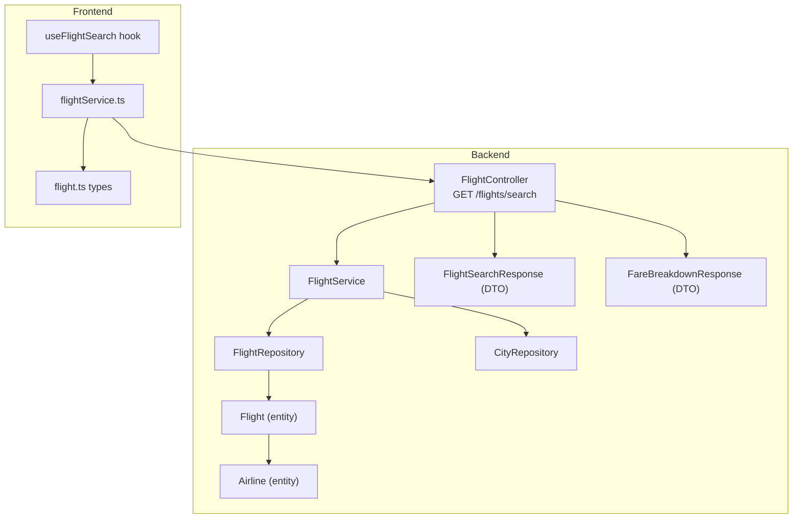
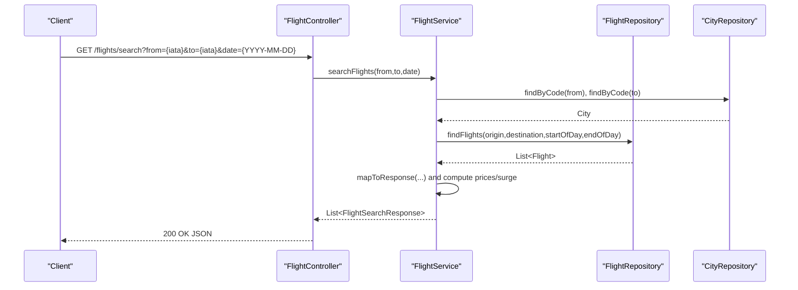
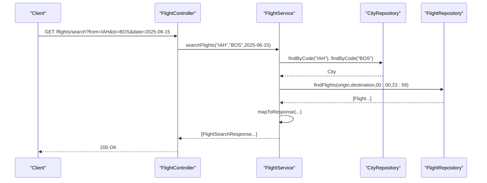
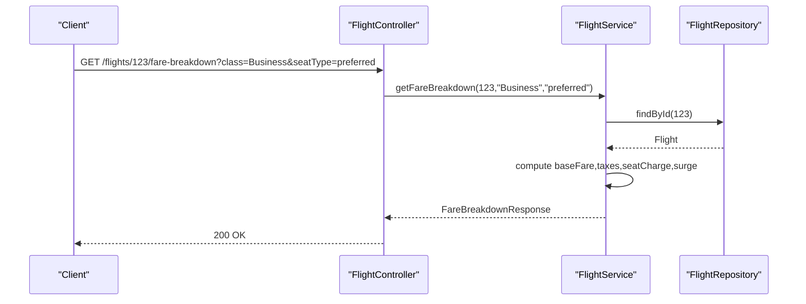
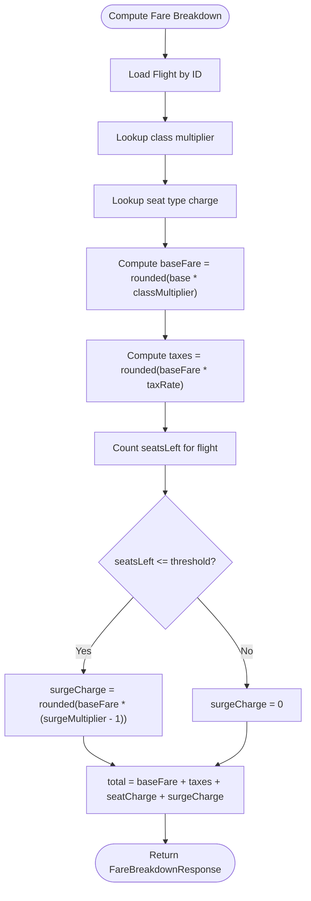
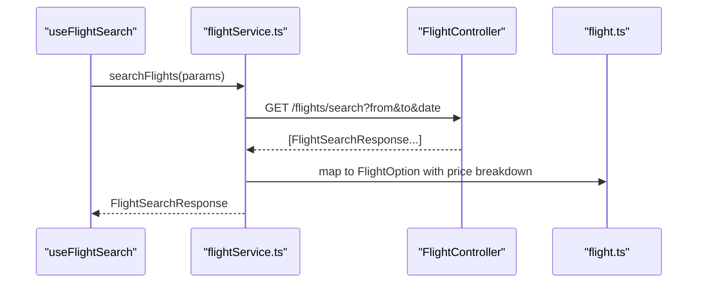
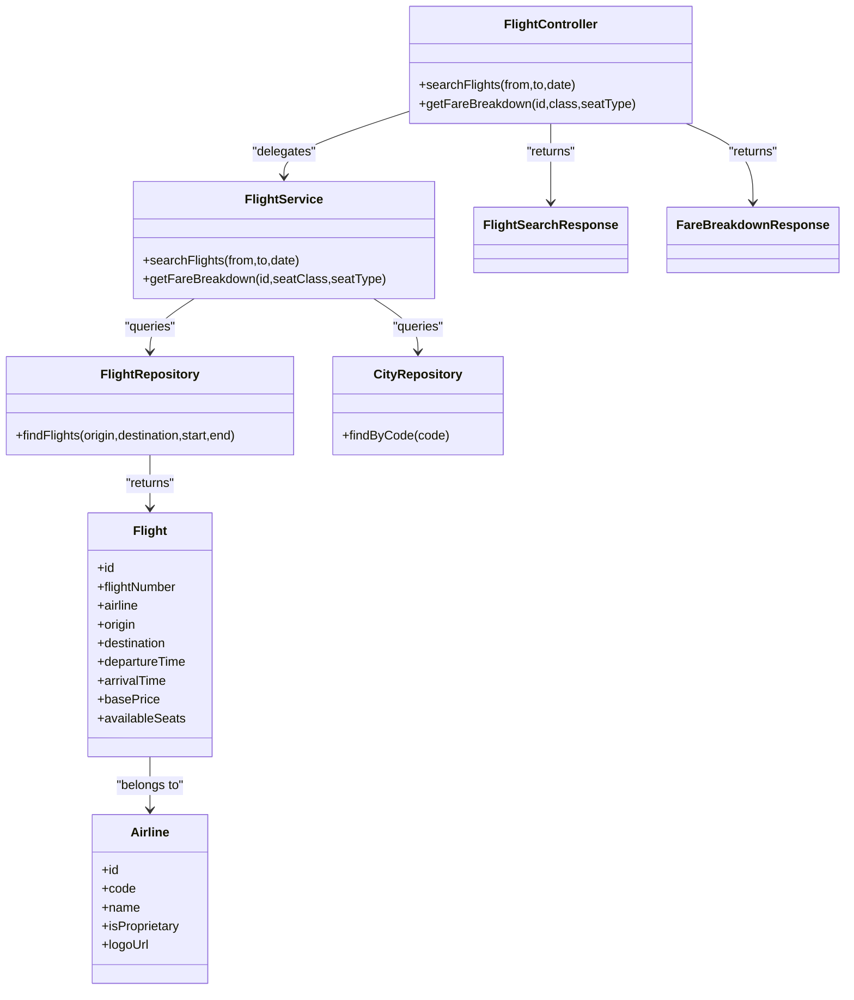

# Flight Search Endpoints

<cite>
**Referenced Files in This Document**
- [FlightController.java](file://backend-server/src/main/java/com/skyflow/controller/FlightController.java)
- [FlightService.java](file://backend-server/src/main/java/com/skyflow/service/FlightService.java)
- [FlightRepository.java](file://backend-server/src/main/java/com/skyflow/repository/FlightRepository.java)
- [CityRepository.java](file://backend-server/src/main/java/com/skyflow/repository/CityRepository.java)
- [Flight.java](file://backend-server/src/main/java/com/skyflow/model/entity/Flight.java)
- [Airline.java](file://backend-server/src/main/java/com/skyflow/model/entity/Airline.java)
- [FlightSearchResponse.java](file://backend-server/src/main/java/com/skyflow/model/dto/response/FlightSearchResponse.java)
- [FareBreakdownResponse.java](file://backend-server/src/main/java/com/skyflow/model/dto/response/FareBreakdownResponse.java)
- [application.yml](file://backend-server/src/main/resources/application.yml)
- [GlobalExceptionHandler.java](file://backend-server/src/main/java/com/skyflow/exception/GlobalExceptionHandler.java)
- [useFlightSearch.ts](file://skyflow-pro/src/hooks/useFlightSearch.ts)
- [flightService.ts](file://skyflow-pro/src/services/flights/flightService.ts)
- [flight.ts](file://skyflow-pro/src/types/flight.ts)
</cite>

## Table of Contents
1. [Introduction](#introduction)
2. [Project Structure](#project-structure)
3. [Core Components](#core-components)
4. [Architecture Overview](#architecture-overview)
5. [Detailed Component Analysis](#detailed-component-analysis)
6. [Dependency Analysis](#dependency-analysis)
7. [Performance Considerations](#performance-considerations)
8. [Troubleshooting Guide](#troubleshooting-guide)
9. [Conclusion](#conclusion)
10. [Appendices](#appendices)

## Introduction
This document provides comprehensive API documentation for flight search endpoints in the backend server. It covers endpoint definitions, query parameters, request/response schemas, real-time pricing and surge pricing mechanics, multi-airline support, examples, error handling, and performance considerations. The backend exposes REST endpoints for searching flights and retrieving fare breakdowns, while the frontend integrates with these endpoints via a typed service and React Query.

## Project Structure
The flight search functionality spans the backend REST controller, service layer, repositories, and domain models, plus frontend integration for consuming the API.

**Diagram sources**
- [FlightController.java:29-35](file://backend-server/src/main/java/com/skyflow/controller/FlightController.java#L29-L35)
- [FlightService.java:68-102](file://backend-server/src/main/java/com/skyflow/service/FlightService.java#L68-L102)
- [FlightRepository.java:14-18](file://backend-server/src/main/java/com/skyflow/repository/FlightRepository.java#L14-L18)
- [CityRepository.java:9](file://backend-server/src/main/java/com/skyflow/repository/CityRepository.java#L9)
- [Flight.java:12-42](file://backend-server/src/main/java/com/skyflow/model/entity/Flight.java#L12-L42)
- [Airline.java:11-28](file://backend-server/src/main/java/com/skyflow/model/entity/Airline.java#L11-L28)
- [FlightSearchResponse.java:9-33](file://backend-server/src/main/java/com/skyflow/model/dto/response/FlightSearchResponse.java#L9-L33)
- [FareBreakdownResponse.java:6-18](file://backend-server/src/main/java/com/skyflow/model/dto/response/FareBreakdownResponse.java#L6-L18)
- [useFlightSearch.ts:4-10](file://skyflow-pro/src/hooks/useFlightSearch.ts#L4-L10)
- [flightService.ts:32-125](file://skyflow-pro/src/services/flights/flightService.ts#L32-L125)
- [flight.ts:42-56](file://skyflow-pro/src/types/flight.ts#L42-L56)

**Section sources**
- [FlightController.java:29-35](file://backend-server/src/main/java/com/skyflow/controller/FlightController.java#L29-L35)
- [FlightService.java:68-102](file://backend-server/src/main/java/com/skyflow/service/FlightService.java#L68-L102)
- [FlightRepository.java:14-18](file://backend-server/src/main/java/com/skyflow/repository/FlightRepository.java#L14-L18)
- [CityRepository.java:9](file://backend-server/src/main/java/com/skyflow/repository/CityRepository.java#L9)
- [Flight.java:12-42](file://backend-server/src/main/java/com/skyflow/model/entity/Flight.java#L12-L42)
- [Airline.java:11-28](file://backend-server/src/main/java/com/skyflow/model/entity/Airline.java#L11-L28)
- [FlightSearchResponse.java:9-33](file://backend-server/src/main/java/com/skyflow/model/dto/response/FlightSearchResponse.java#L9-L33)
- [FareBreakdownResponse.java:6-18](file://backend-server/src/main/java/com/skyflow/model/dto/response/FareBreakdownResponse.java#L6-L18)
- [useFlightSearch.ts:4-10](file://skyflow-pro/src/hooks/useFlightSearch.ts#L4-L10)
- [flightService.ts:32-125](file://skyflow-pro/src/services/flights/flightService.ts#L32-L125)
- [flight.ts:42-56](file://skyflow-pro/src/types/flight.ts#L42-L56)

## Core Components
- FlightController: Exposes GET /flights/search for flight listings and GET /flights/{id}/fare-breakdown for pricing details.
- FlightService: Implements search logic, pricing calculation, surge detection, and response mapping.
- Repositories: FlightRepository and CityRepository provide data access for flights and cities.
- Entities: Flight and Airline define the persisted models.
- DTOs: FlightSearchResponse and FareBreakdownResponse define API response schemas.

**Section sources**
- [FlightController.java:29-48](file://backend-server/src/main/java/com/skyflow/controller/FlightController.java#L29-L48)
- [FlightService.java:68-204](file://backend-server/src/main/java/com/skyflow/service/FlightService.java#L68-L204)
- [FlightRepository.java:14-18](file://backend-server/src/main/java/com/skyflow/repository/FlightRepository.java#L14-L18)
- [CityRepository.java:9](file://backend-server/src/main/java/com/skyflow/repository/CityRepository.java#L9)
- [Flight.java:12-42](file://backend-server/src/main/java/com/skyflow/model/entity/Flight.java#L12-L42)
- [Airline.java:11-28](file://backend-server/src/main/java/com/skyflow/model/entity/Airline.java#L11-L28)
- [FlightSearchResponse.java:9-33](file://backend-server/src/main/java/com/skyflow/model/dto/response/FlightSearchResponse.java#L9-L33)
- [FareBreakdownResponse.java:6-18](file://backend-server/src/main/java/com/skyflow/model/dto/response/FareBreakdownResponse.java#L6-L18)

## Architecture Overview
The flight search follows a layered architecture:
- Presentation: FlightController handles HTTP requests and delegates to FlightService.
- Application: FlightService orchestrates repository access, computes pricing and surge, and maps to DTOs.
- Persistence: FlightRepository and CityRepository query the database for flights and cities.
- Frontend: React Query and flightService.ts consume the backend endpoints and normalize results.

**Diagram sources**
- [FlightController.java:29-35](file://backend-server/src/main/java/com/skyflow/controller/FlightController.java#L29-L35)
- [FlightService.java:68-102](file://backend-server/src/main/java/com/skyflow/service/FlightService.java#L68-L102)
- [FlightRepository.java:14-18](file://backend-server/src/main/java/com/skyflow/repository/FlightRepository.java#L14-L18)
- [CityRepository.java:9](file://backend-server/src/main/java/com/skyflow/repository/CityRepository.java#L9)

## Detailed Component Analysis

### Flight Search Endpoint
- Path: GET /flights/search
- Purpose: Retrieve available flights between two cities on a given date.
- Query parameters:
  - from: Origin city IATA code (required)
  - to: Destination city IATA code (required)
  - date: Departure date (ISO date, required)
- Response: Array of FlightSearchResponse objects.

**Diagram sources**
- [FlightController.java:29-35](file://backend-server/src/main/java/com/skyflow/controller/FlightController.java#L29-L35)
- [FlightService.java:68-102](file://backend-server/src/main/java/com/skyflow/service/FlightService.java#L68-L102)
- [FlightRepository.java:14-18](file://backend-server/src/main/java/com/skyflow/repository/FlightRepository.java#L14-L18)
- [CityRepository.java:9](file://backend-server/src/main/java/com/skyflow/repository/CityRepository.java#L9)

**Section sources**
- [FlightController.java:29-35](file://backend-server/src/main/java/com/skyflow/controller/FlightController.java#L29-L35)
- [FlightService.java:68-102](file://backend-server/src/main/java/com/skyflow/service/FlightService.java#L68-L102)
- [FlightRepository.java:14-18](file://backend-server/src/main/java/com/skyflow/repository/FlightRepository.java#L14-L18)
- [CityRepository.java:9](file://backend-server/src/main/java/com/skyflow/repository/CityRepository.java#L9)

### Fare Breakdown Endpoint
- Path: GET /flights/{id}/fare-breakdown
- Purpose: Compute and return fare breakdown for a specific flight.
- Path variable:
  - id: Flight identifier (required)
- Query parameters:
  - class: Cabin class (default: Economy)
  - seatType: Seat type (default: standard)
- Response: FareBreakdownResponse object.

**Diagram sources**
- [FlightController.java:37-48](file://backend-server/src/main/java/com/skyflow/controller/FlightController.java#L37-L48)
- [FlightService.java:104-144](file://backend-server/src/main/java/com/skyflow/service/FlightService.java#L104-L144)
- [FlightRepository.java:14-18](file://backend-server/src/main/java/com/skyflow/repository/FlightRepository.java#L14-L18)

**Section sources**
- [FlightController.java:37-48](file://backend-server/src/main/java/com/skyflow/controller/FlightController.java#L37-L48)
- [FlightService.java:104-144](file://backend-server/src/main/java/com/skyflow/service/FlightService.java#L104-L144)
- [FlightRepository.java:14-18](file://backend-server/src/main/java/com/skyflow/repository/FlightRepository.java#L14-L18)

### Real-time Pricing and Surge Pricing
- Base pricing is derived from Flight.basePrice and adjusted for proprietary airlines.
- Cabin class multipliers are applied to derive classPrices.
- Taxes are computed at a fixed rate.
- Seat type charges are added based on predefined mapping.
- Surge pricing activates when remaining seats are below a threshold, applying a multiplier to the base fare.

**Diagram sources**
- [FlightService.java:104-144](file://backend-server/src/main/java/com/skyflow/service/FlightService.java#L104-L144)

**Section sources**
- [FlightService.java:30-47](file://backend-server/src/main/java/com/skyflow/service/FlightService.java#L30-L47)
- [FlightService.java:104-144](file://backend-server/src/main/java/com/skyflow/service/FlightService.java#L104-L144)

### Multi-Airline Support
- Flight records are associated with an Airline entity.
- Proprietary airlines receive a base price discount.
- Features and policies are randomized per-flight but can reflect proprietary benefits.

**Section sources**
- [Flight.java:20-22](file://backend-server/src/main/java/com/skyflow/model/entity/Flight.java#L20-L22)
- [Airline.java:22](file://backend-server/src/main/java/com/skyflow/model/entity/Airline.java#L22)
- [FlightService.java:112-114](file://backend-server/src/main/java/com/skyflow/service/FlightService.java#L112-L114)
- [FlightService.java:186-189](file://backend-server/src/main/java/com/skyflow/service/FlightService.java#L186-L189)

### Request and Response Schemas

#### GET /flights/search
- Query parameters:
  - from: string (required)
  - to: string (required)
  - date: date (required)
- Response: array of FlightSearchResponse
  - Fields: id, flightNumber, airlineName, airlineCode, airlineLogo, isProprietary, origin, destination, departureTime, arrivalTime, durationMinutes, stops, classPrices, features, availableSeats, surgeActive, surgeMessage, baggagePolicy, refundPolicy, aircraft

**Section sources**
- [FlightController.java:29-35](file://backend-server/src/main/java/com/skyflow/controller/FlightController.java#L29-L35)
- [FlightSearchResponse.java:9-33](file://backend-server/src/main/java/com/skyflow/model/dto/response/FlightSearchResponse.java#L9-L33)

#### GET /flights/{id}/fare-breakdown
- Path parameters:
  - id: integer (required)
- Query parameters:
  - class: string (default: Economy)
  - seatType: string (default: standard)
- Response: FareBreakdownResponse
  - Fields: baseFare, taxes, seatCharge, surgeCharge, total, currency, seatClass, seatType, seatsLeft, surgeActive, surgeMessage

**Section sources**
- [FlightController.java:37-48](file://backend-server/src/main/java/com/skyflow/controller/FlightController.java#L37-L48)
- [FareBreakdownResponse.java:6-18](file://backend-server/src/main/java/com/skyflow/model/dto/response/FareBreakdownResponse.java#L6-L18)

### Frontend Integration
- The frontend uses a React Query hook to fetch search results and a service to call the backend.
- The service maps backend responses to a normalized frontend FlightOption type, including price breakdown and passenger counts.

**Diagram sources**
- [useFlightSearch.ts:4-10](file://skyflow-pro/src/hooks/useFlightSearch.ts#L4-L10)
- [flightService.ts:32-125](file://skyflow-pro/src/services/flights/flightService.ts#L32-L125)
- [flight.ts:42-56](file://skyflow-pro/src/types/flight.ts#L42-L56)

**Section sources**
- [useFlightSearch.ts:4-10](file://skyflow-pro/src/hooks/useFlightSearch.ts#L4-L10)
- [flightService.ts:32-125](file://skyflow-pro/src/services/flights/flightService.ts#L32-L125)
- [flight.ts:42-56](file://skyflow-pro/src/types/flight.ts#L42-L56)

## Dependency Analysis
The following diagram shows key dependencies among components involved in flight search.

**Diagram sources**
- [FlightController.java:29-48](file://backend-server/src/main/java/com/skyflow/controller/FlightController.java#L29-L48)
- [FlightService.java:68-144](file://backend-server/src/main/java/com/skyflow/service/FlightService.java#L68-L144)
- [FlightRepository.java:14-18](file://backend-server/src/main/java/com/skyflow/repository/FlightRepository.java#L14-L18)
- [CityRepository.java:9](file://backend-server/src/main/java/com/skyflow/repository/CityRepository.java#L9)
- [Flight.java:12-42](file://backend-server/src/main/java/com/skyflow/model/entity/Flight.java#L12-L42)
- [Airline.java:11-28](file://backend-server/src/main/java/com/skyflow/model/entity/Airline.java#L11-L28)
- [FlightSearchResponse.java:9-33](file://backend-server/src/main/java/com/skyflow/model/dto/response/FlightSearchResponse.java#L9-L33)
- [FareBreakdownResponse.java:6-18](file://backend-server/src/main/java/com/skyflow/model/dto/response/FareBreakdownResponse.java#L6-L18)

**Section sources**
- [FlightController.java:29-48](file://backend-server/src/main/java/com/skyflow/controller/FlightController.java#L29-L48)
- [FlightService.java:68-144](file://backend-server/src/main/java/com/skyflow/service/FlightService.java#L68-L144)
- [FlightRepository.java:14-18](file://backend-server/src/main/java/com/skyflow/repository/FlightRepository.java#L14-L18)
- [CityRepository.java:9](file://backend-server/src/main/java/com/skyflow/repository/CityRepository.java#L9)
- [Flight.java:12-42](file://backend-server/src/main/java/com/skyflow/model/entity/Flight.java#L12-L42)
- [Airline.java:11-28](file://backend-server/src/main/java/com/skyflow/model/entity/Airline.java#L11-L28)
- [FlightSearchResponse.java:9-33](file://backend-server/src/main/java/com/skyflow/model/dto/response/FlightSearchResponse.java#L9-L33)
- [FareBreakdownResponse.java:6-18](file://backend-server/src/main/java/com/skyflow/model/dto/response/FareBreakdownResponse.java#L6-L18)

## Performance Considerations
- Database query window: Searches match flights departing on the requested date by constraining departureTime to the start and end of the day.
- Surrogate response deduplication: When multiple proprietary flights are returned, only one proprietary option is kept to avoid redundancy.
- Caching strategies:
  - Frontend: React Query cache keys include the full set of query parameters, enabling automatic caching and reuse across components.
  - Backend: No explicit cache annotations or in-memory caches are present; consider adding Redis or in-memory caches for frequent searches and fare computations.
- Scalability:
  - FlightRepository query uses JPQL with equality filters and time range; ensure indexes exist on origin_id, destination_id, and departureTime.
  - Consider pagination for large result sets and precomputing classPrices to reduce runtime computation.

[No sources needed since this section provides general guidance]

## Troubleshooting Guide
- Invalid or missing parameters:
  - The controller expects from, to, and date. Missing any will cause binding errors.
- Origin/Destination not found:
  - If city codes are not found, a runtime exception is thrown. Ensure valid IATA codes.
- Flight not found for fare breakdown:
  - Returns a 404 Not Found when the flight ID does not exist.
- Global error handling:
  - Centralized handler returns standardized error responses with timestamp, status, error, message, and path.

**Section sources**
- [FlightController.java:29-35](file://backend-server/src/main/java/com/skyflow/controller/FlightController.java#L29-L35)
- [FlightService.java:69-71](file://backend-server/src/main/java/com/skyflow/service/FlightService.java#L69-L71)
- [FlightService.java:105](file://backend-server/src/main/java/com/skyflow/service/FlightService.java#L105)
- [GlobalExceptionHandler.java:20-42](file://backend-server/src/main/java/com/skyflow/exception/GlobalExceptionHandler.java#L20-L42)

## Conclusion
The flight search endpoints provide a clean REST interface for discovering flights and computing fares with surge pricing. The backend’s service layer encapsulates pricing logic, multi-airline support, and response mapping, while the frontend integrates seamlessly via typed services and React Query. Enhancements such as caching, pagination, and richer search parameters would further improve performance and user experience.

[No sources needed since this section summarizes without analyzing specific files]

## Appendices

### Example Queries and Responses
- Search flights:
  - Request: GET /flights/search?from=IAH&to=BOS&date=2025-06-15
  - Response: Array of FlightSearchResponse entries with classPrices and features.
- Fare breakdown:
  - Request: GET /flights/123/fare-breakdown?class=Business&seatType=preferred
  - Response: FareBreakdownResponse with baseFare, taxes, seatCharge, surgeCharge, total, and surgeMessage.

**Section sources**
- [FlightController.java:29-35](file://backend-server/src/main/java/com/skyflow/controller/FlightController.java#L29-L35)
- [FlightController.java:37-48](file://backend-server/src/main/java/com/skyflow/controller/FlightController.java#L37-L48)
- [FlightSearchResponse.java:9-33](file://backend-server/src/main/java/com/skyflow/model/dto/response/FlightSearchResponse.java#L9-L33)
- [FareBreakdownResponse.java:6-18](file://backend-server/src/main/java/com/skyflow/model/dto/response/FareBreakdownResponse.java#L6-L18)

### Environment and Server Configuration
- Server port and datasource are configured in application.yml.

**Section sources**
- [application.yml:19-20](file://backend-server/src/main/resources/application.yml#L19-L20)
- [application.yml:4-8](file://backend-server/src/main/resources/application.yml#L4-L8)