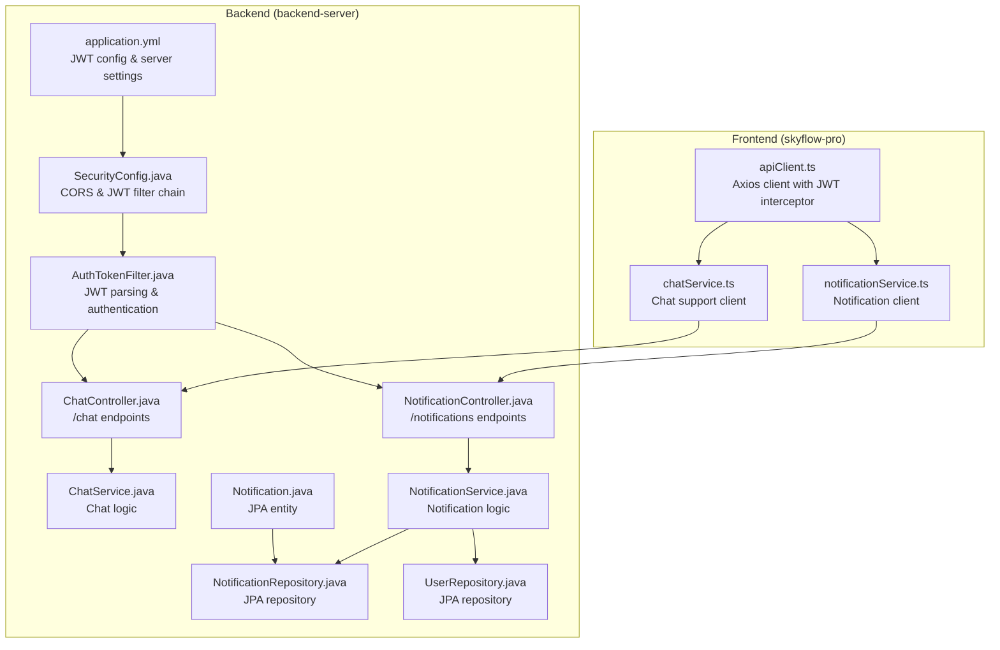
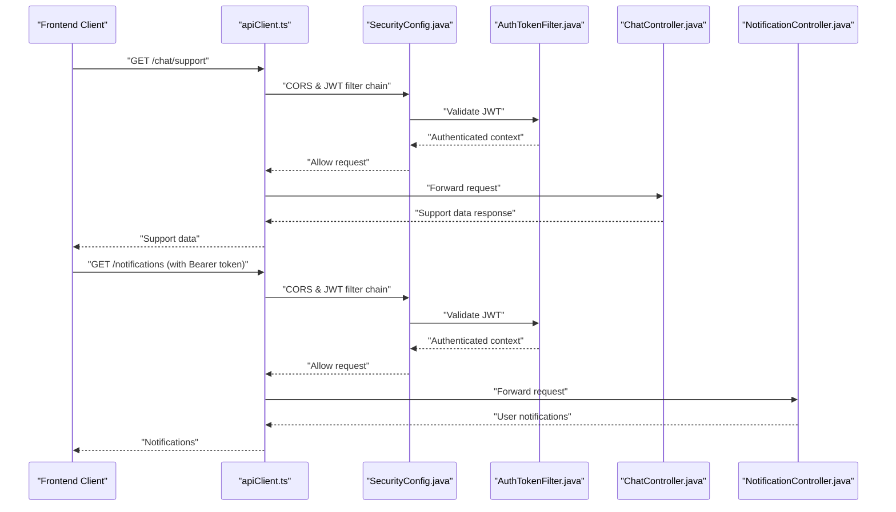
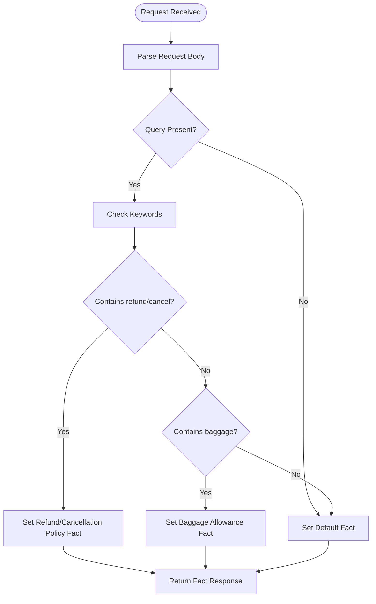
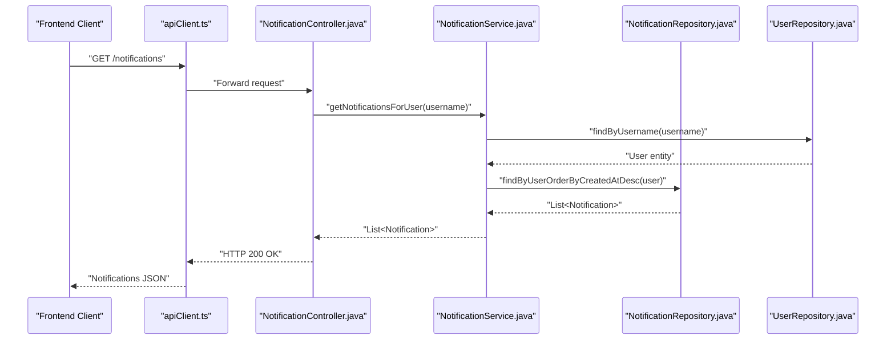
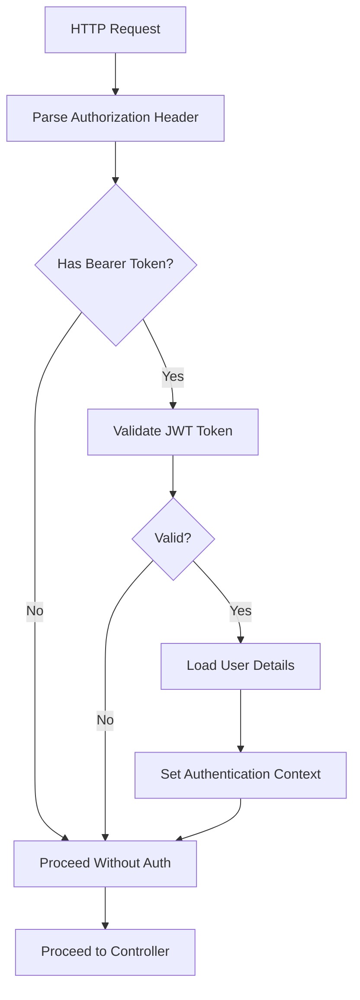
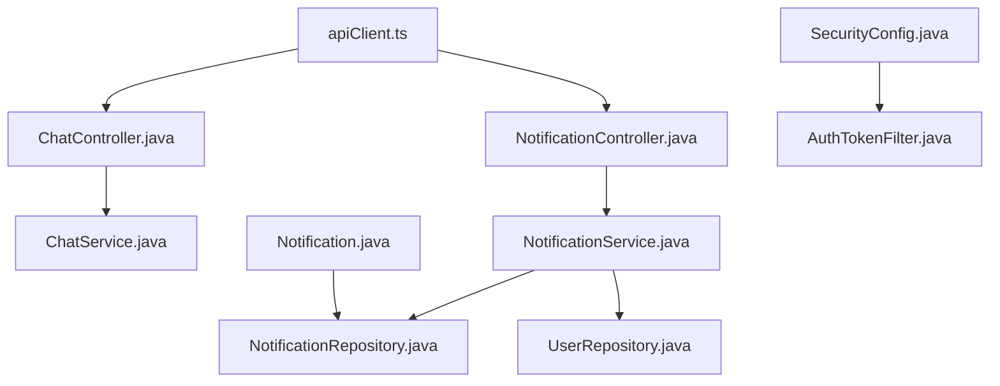

# Real-time Communication Endpoints

<cite>
**Referenced Files in This Document**
- [ChatController.java](file://backend-server/src/main/java/com/skyflow/controller/ChatController.java)
- [ChatService.java](file://backend-server/src/main/java/com/skyflow/service/ChatService.java)
- [NotificationController.java](file://backend-server/src/main/java/com/skyflow/controller/NotificationController.java)
- [NotificationService.java](file://backend-server/src/main/java/com/skyflow/service/NotificationService.java)
- [Notification.java](file://backend-server/src/main/java/com/skyflow/model/entity/Notification.java)
- [NotificationRepository.java](file://backend-server/src/main/java/com/skyflow/repository/NotificationRepository.java)
- [UserRepository.java](file://backend-server/src/main/java/com/skyflow/repository/UserRepository.java)
- [SecurityConfig.java](file://backend-server/src/main/java/com/skyflow/config/SecurityConfig.java)
- [AuthTokenFilter.java](file://backend-server/src/main/java/com/skyflow/security/AuthTokenFilter.java)
- [application.yml](file://backend-server/src/main/resources/application.yml)
- [chatService.ts](file://skyflow-pro/src/services/chat/chatService.ts)
- [notificationService.ts](file://skyflow-pro/src/services/notifications/notificationService.ts)
- [apiClient.ts](file://skyflow-pro/src/services/api/apiClient.ts)
</cite>

## Table of Contents
1. [Introduction](#introduction)
2. [Project Structure](#project-structure)
3. [Core Components](#core-components)
4. [Architecture Overview](#architecture-overview)
5. [Detailed Component Analysis](#detailed-component-analysis)
6. [Dependency Analysis](#dependency-analysis)
7. [Performance Considerations](#performance-considerations)
8. [Troubleshooting Guide](#troubleshooting-guide)
9. [Conclusion](#conclusion)

## Introduction
This document provides comprehensive API documentation for real-time communication endpoints in the Skyflow Airline Reservation System. It focuses on chat functionality and the notification system, detailing HTTP endpoints, message schemas, authentication mechanisms, and error handling patterns. The current implementation emphasizes REST APIs for chat support and user notifications, with JWT-based authentication and CORS configuration supporting cross-origin requests.

## Project Structure
The real-time communication features are implemented across backend Spring Boot controllers and services, and frontend TypeScript services that consume these endpoints. The backend exposes REST endpoints under `/chat` and `/notifications`, while the frontend integrates via Axios-based API clients with automatic JWT injection.

**Diagram sources**
- [apiClient.ts:1-38](file://skyflow-pro/src/services/api/apiClient.ts#L1-L38)
- [chatService.ts:1-21](file://skyflow-pro/src/services/chat/chatService.ts#L1-L21)
- [notificationService.ts:1-22](file://skyflow-pro/src/services/notifications/notificationService.ts#L1-L22)
- [SecurityConfig.java:1-81](file://backend-server/src/main/java/com/skyflow/config/SecurityConfig.java#L1-L81)
- [AuthTokenFilter.java:1-62](file://backend-server/src/main/java/com/skyflow/security/AuthTokenFilter.java#L1-L62)
- [ChatController.java:1-27](file://backend-server/src/main/java/com/skyflow/controller/ChatController.java#L1-L27)
- [NotificationController.java:1-24](file://backend-server/src/main/java/com/skyflow/controller/NotificationController.java#L1-L24)
- [ChatService.java:1-56](file://backend-server/src/main/java/com/skyflow/service/ChatService.java#L1-L56)
- [NotificationService.java:1-35](file://backend-server/src/main/java/com/skyflow/service/NotificationService.java#L1-L35)
- [Notification.java:1-31](file://backend-server/src/main/java/com/skyflow/model/entity/Notification.java#L1-L31)
- [NotificationRepository.java:1-11](file://backend-server/src/main/java/com/skyflow/repository/NotificationRepository.java#L1-L11)
- [UserRepository.java:1-12](file://backend-server/src/main/java/com/skyflow/repository/UserRepository.java#L1-L12)
- [application.yml:1-30](file://backend-server/src/main/resources/application.yml#L1-L30)

**Section sources**
- [ChatController.java:1-27](file://backend-server/src/main/java/com/skyflow/controller/ChatController.java#L1-L27)
- [NotificationController.java:1-24](file://backend-server/src/main/java/com/skyflow/controller/NotificationController.java#L1-L24)
- [SecurityConfig.java:1-81](file://backend-server/src/main/java/com/skyflow/config/SecurityConfig.java#L1-L81)
- [application.yml:1-30](file://backend-server/src/main/resources/application.yml#L1-L30)

## Core Components
This section documents the primary real-time communication endpoints and their schemas.

### Chat Endpoints
- GET /chat/support
  - Purpose: Retrieve support metadata and frequently asked questions (FAQs).
  - Authentication: Public endpoint (permitted by security configuration).
  - Response Schema:
    - faqs: array of FAQ items
      - question: string
      - answer: string
    - supportEmail: string
    - supportPhone: string
    - chatHours: string

- POST /chat/support
  - Purpose: Submit a chat query for AI-assisted processing.
  - Authentication: Public endpoint (permitted by security configuration).
  - Request Body:
    - query: string
  - Response Schema:
    - fact: string (AI-generated response based on query keywords)

Example usage patterns:
- Frontend fetches support data and displays FAQs.
- Frontend sends user queries and displays AI-generated facts.

**Section sources**
- [ChatController.java:17-25](file://backend-server/src/main/java/com/skyflow/controller/ChatController.java#L17-L25)
- [ChatService.java:13-47](file://backend-server/src/main/java/com/skyflow/service/ChatService.java#L13-L47)
- [SecurityConfig.java:60-61](file://backend-server/src/main/java/com/skyflow/config/SecurityConfig.java#L60-L61)

### Notification Endpoints
- GET /notifications
  - Purpose: Retrieve notifications for the authenticated user.
  - Authentication: Requires JWT Bearer token.
  - Response Schema: Array of notifications
    - id: number
    - message: string
    - isRead: boolean
    - createdAt: string (ISO datetime)
    - bookingId?: number (optional)

Example usage patterns:
- Frontend fetches notifications on user login or page load.
- Frontend displays unread notifications and allows marking as read (placeholder).

**Section sources**
- [NotificationController.java:19-22](file://backend-server/src/main/java/com/skyflow/controller/NotificationController.java#L19-L22)
- [NotificationService.java:21-25](file://backend-server/src/main/java/com/skyflow/service/NotificationService.java#L21-L25)
- [Notification.java:12-30](file://backend-server/src/main/java/com/skyflow/model/entity/Notification.java#L12-L30)

## Architecture Overview
The real-time communication architecture combines REST APIs with JWT-based authentication and CORS configuration. The frontend Axios client automatically injects the Authorization header with a Bearer token, enabling secure access to protected endpoints.

**Diagram sources**
- [apiClient.ts:11-23](file://skyflow-pro/src/services/api/apiClient.ts#L11-L23)
- [SecurityConfig.java:50-67](file://backend-server/src/main/java/com/skyflow/config/SecurityConfig.java#L50-L67)
- [AuthTokenFilter.java:28-50](file://backend-server/src/main/java/com/skyflow/security/AuthTokenFilter.java#L28-L50)
- [ChatController.java:17-20](file://backend-server/src/main/java/com/skyflow/controller/ChatController.java#L17-L20)
- [NotificationController.java:19-22](file://backend-server/src/main/java/com/skyflow/controller/NotificationController.java#L19-L22)

## Detailed Component Analysis

### Chat Endpoint Flow
The chat endpoint flow demonstrates request processing, query handling, and response generation.

**Diagram sources**
- [ChatService.java:30-47](file://backend-server/src/main/java/com/skyflow/service/ChatService.java#L30-L47)

**Section sources**
- [ChatController.java:22-25](file://backend-server/src/main/java/com/skyflow/controller/ChatController.java#L22-L25)
- [ChatService.java:30-47](file://backend-server/src/main/java/com/skyflow/service/ChatService.java#L30-L47)

### Notification Retrieval Flow
The notification retrieval flow shows user lookup, permission validation, and data fetching.

**Diagram sources**
- [NotificationController.java:19-22](file://backend-server/src/main/java/com/skyflow/controller/NotificationController.java#L19-L22)
- [NotificationService.java:21-25](file://backend-server/src/main/java/com/skyflow/service/NotificationService.java#L21-L25)
- [NotificationRepository.java:8-10](file://backend-server/src/main/java/com/skyflow/repository/NotificationRepository.java#L8-L10)
- [UserRepository.java:7-9](file://backend-server/src/main/java/com/skyflow/repository/UserRepository.java#L7-L9)

**Section sources**
- [NotificationController.java:19-22](file://backend-server/src/main/java/com/skyflow/controller/NotificationController.java#L19-L22)
- [NotificationService.java:21-25](file://backend-server/src/main/java/com/skyflow/service/NotificationService.java#L21-L25)
- [NotificationRepository.java:8-10](file://backend-server/src/main/java/com/skyflow/repository/NotificationRepository.java#L8-L10)
- [UserRepository.java:7-9](file://backend-server/src/main/java/com/skyflow/repository/UserRepository.java#L7-L9)

### Authentication and Security
JWT-based authentication is enforced via a custom filter that parses the Authorization header and validates tokens against configured secrets and expiration.

**Diagram sources**
- [AuthTokenFilter.java:28-50](file://backend-server/src/main/java/com/skyflow/security/AuthTokenFilter.java#L28-L50)
- [application.yml:26-30](file://backend-server/src/main/resources/application.yml#L26-L30)

**Section sources**
- [SecurityConfig.java:50-67](file://backend-server/src/main/java/com/skyflow/config/SecurityConfig.java#L50-L67)
- [AuthTokenFilter.java:28-50](file://backend-server/src/main/java/com/skyflow/security/AuthTokenFilter.java#L28-L50)
- [application.yml:26-30](file://backend-server/src/main/resources/application.yml#L26-L30)

## Dependency Analysis
The real-time communication components exhibit clear separation of concerns with controllers delegating to services, and services interacting with repositories for persistence.

**Diagram sources**
- [ChatController.java:14-15](file://backend-server/src/main/java/com/skyflow/controller/ChatController.java#L14-L15)
- [ChatService.java:10](file://backend-server/src/main/java/com/skyflow/service/ChatService.java#L10)
- [NotificationController.java:16-17](file://backend-server/src/main/java/com/skyflow/controller/NotificationController.java#L16-L17)
- [NotificationService.java:15-20](file://backend-server/src/main/java/com/skyflow/service/NotificationService.java#L15-L20)
- [NotificationRepository.java:8-10](file://backend-server/src/main/java/com/skyflow/repository/NotificationRepository.java#L8-L10)
- [UserRepository.java:7-11](file://backend-server/src/main/java/com/skyflow/repository/UserRepository.java#L7-L11)
- [Notification.java:12-30](file://backend-server/src/main/java/com/skyflow/model/entity/Notification.java#L12-L30)
- [SecurityConfig.java:28-29](file://backend-server/src/main/java/com/skyflow/config/SecurityConfig.java#L28-L29)
- [AuthTokenFilter.java:19-27](file://backend-server/src/main/java/com/skyflow/security/AuthTokenFilter.java#L19-L27)
- [apiClient.ts:1-38](file://skyflow-pro/src/services/api/apiClient.ts#L1-L38)

**Section sources**
- [ChatController.java:14-15](file://backend-server/src/main/java/com/skyflow/controller/ChatController.java#L14-L15)
- [NotificationController.java:16-17](file://backend-server/src/main/java/com/skyflow/controller/NotificationController.java#L16-L17)
- [NotificationService.java:15-20](file://backend-server/src/main/java/com/skyflow/service/NotificationService.java#L15-L20)
- [NotificationRepository.java:8-10](file://backend-server/src/main/java/com/skyflow/repository/NotificationRepository.java#L8-L10)
- [UserRepository.java:7-11](file://backend-server/src/main/java/com/skyflow/repository/UserRepository.java#L7-L11)
- [Notification.java:12-30](file://backend-server/src/main/java/com/skyflow/model/entity/Notification.java#L12-L30)
- [SecurityConfig.java:28-29](file://backend-server/src/main/java/com/skyflow/config/SecurityConfig.java#L28-L29)
- [AuthTokenFilter.java:19-27](file://backend-server/src/main/java/com/skyflow/security/AuthTokenFilter.java#L19-L27)
- [apiClient.ts:1-38](file://skyflow-pro/src/services/api/apiClient.ts#L1-L38)

## Performance Considerations
- Token Validation Overhead: JWT validation occurs per request; ensure efficient token parsing and avoid unnecessary re-authentication.
- CORS Configuration: Broad CORS settings enable cross-origin access but should be restricted in production environments.
- Database Queries: Notification retrieval sorts by creation time; consider indexing on user and creation timestamp for optimal performance.
- Frontend Caching: Implement caching for static support data to reduce server load.

## Troubleshooting Guide
Common issues and resolutions:
- 401 Unauthorized: Occurs when the Authorization header is missing or invalid. Verify the Bearer token is present and valid.
- CORS Errors: Ensure the frontend base URL matches the backend origin and credentials are allowed.
- User Not Found: Notification retrieval requires an existing user; confirm the username exists in the database.
- Chat Query Handling: Empty queries return default facts; validate client-side input before sending.

**Section sources**
- [apiClient.ts:25-35](file://skyflow-pro/src/services/api/apiClient.ts#L25-L35)
- [NotificationService.java:22-24](file://backend-server/src/main/java/com/skyflow/service/NotificationService.java#L22-L24)
- [ChatService.java:33-36](file://backend-server/src/main/java/com/skyflow/service/ChatService.java#L33-L36)

## Conclusion
The Skyflow system provides REST-based chat support and user notifications with JWT authentication and CORS configuration. While the current implementation focuses on HTTP endpoints, it establishes a solid foundation for future enhancements such as WebSocket-based real-time messaging and expanded notification channels. The documented schemas, flows, and troubleshooting steps facilitate integration and maintenance of real-time communication features.