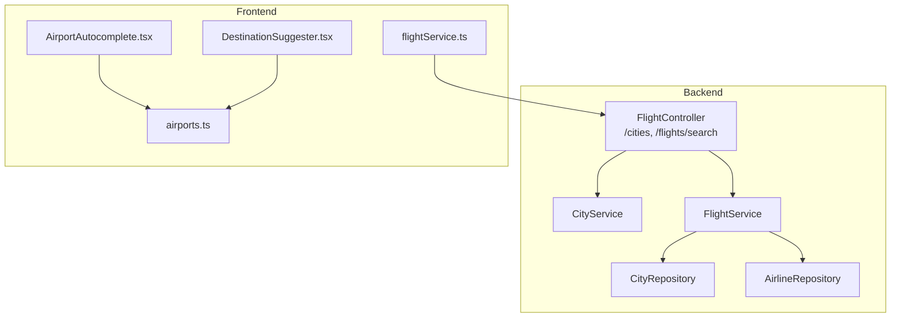
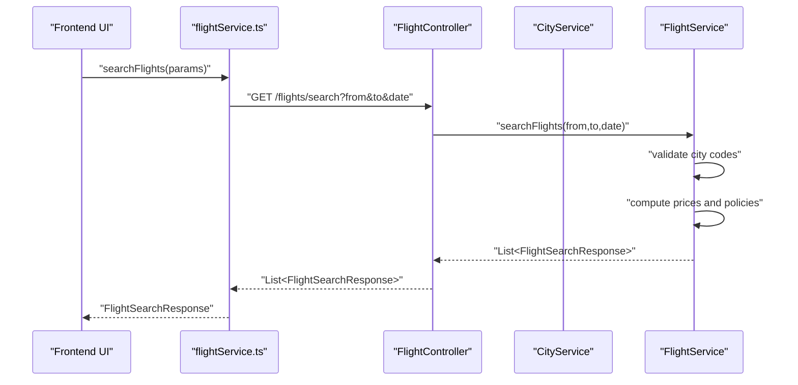
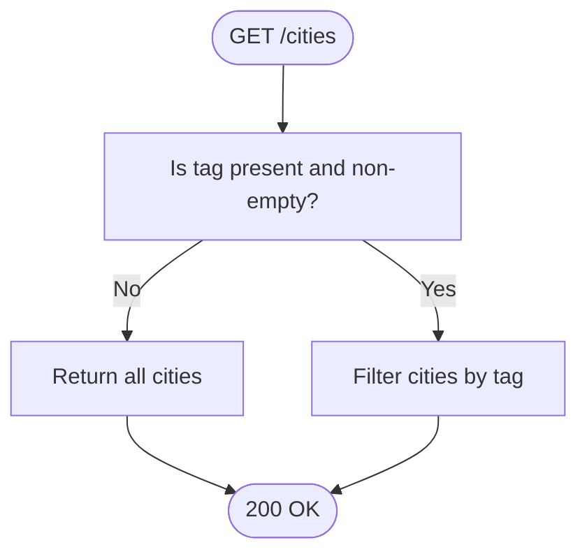
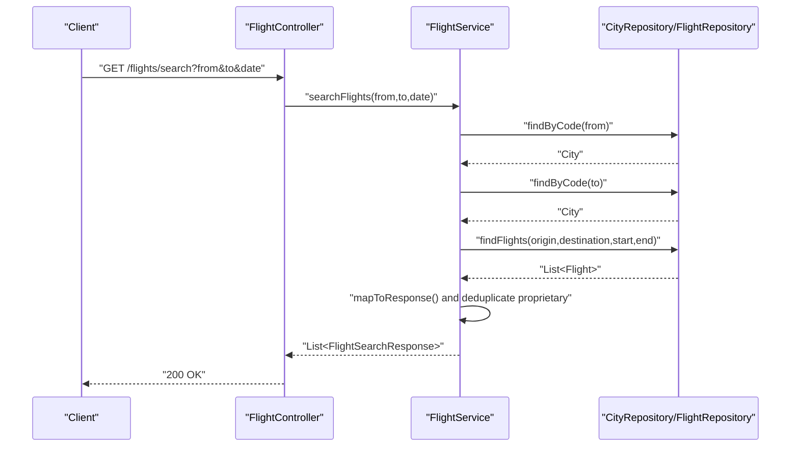
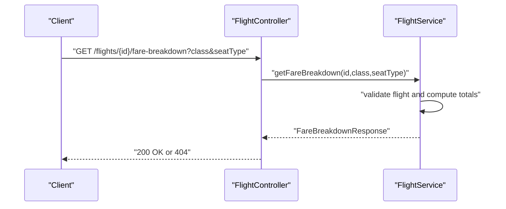
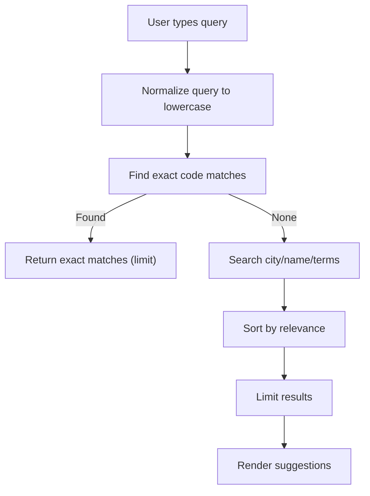
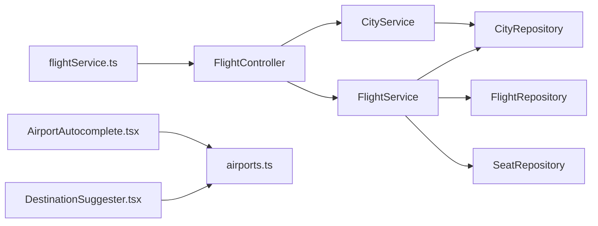

# System Data Endpoints

<cite>
**Referenced Files in This Document**
- [FlightController.java](file://backend-server/src/main/java/com/airline/controller/FlightController.java)
- [CityService.java](file://backend-server/src/main/java/com/airline/service/CityService.java)
- [CityRepository.java](file://backend-server/src/main/java/com/airline/repository/CityRepository.java)
- [City.java](file://backend-server/src/main/java/com/airline/model/entity/City.java)
- [Airline.java](file://backend-server/src/main/java/com/airline/model/entity/Airline.java)
- [AirlineRepository.java](file://backend-server/src/main/java/com/airline/repository/AirlineRepository.java)
- [FlightService.java](file://backend-server/src/main/java/com/airline/service/FlightService.java)
- [AirportAutocomplete.tsx](file://skyflow-pro/src/components/features/flights/search/AirportAutocomplete.tsx)
- [DestinationSuggester.tsx](file://skyflow-pro/src/components/features/flights/search/DestinationSuggester.tsx)
- [flightService.ts](file://skyflow-pro/src/services/flights/flightService.ts)
- [airports.ts](file://skyflow-pro/src/data/airports.ts)
</cite>

## Table of Contents
1. [Introduction](#introduction)
2. [Project Structure](#project-structure)
3. [Core Components](#core-components)
4. [Architecture Overview](#architecture-overview)
5. [Detailed Component Analysis](#detailed-component-analysis)
6. [Dependency Analysis](#dependency-analysis)
7. [Performance Considerations](#performance-considerations)
8. [Troubleshooting Guide](#troubleshooting-guide)
9. [Conclusion](#conclusion)
10. [Appendices](#appendices)

## Introduction
This document provides API documentation for system data endpoints that power location-based queries, airport autocomplete, and airline listings. It also covers data validation rules, caching strategies for frequently accessed data, performance optimization techniques, examples of city/airport search operations, data refresh mechanisms, and integration patterns with the flight search functionality.

## Project Structure
The system comprises:
- Backend REST API exposing endpoints for cities and flights
- Frontend components and services that integrate with the backend and provide autocomplete and suggestion features
- Local airport dataset used for client-side autocomplete

**Diagram sources**
- [FlightController.java:24-35](file://backend-server/src/main/java/com/airline/controller/FlightController.java#L24-L35)
- [CityService.java:20-25](file://backend-server/src/main/java/com/airline/service/CityService.java#L20-L25)
- [FlightService.java:68-102](file://backend-server/src/main/java/com/airline/service/FlightService.java#L68-L102)
- [AirportAutocomplete.tsx:37-46](file://skyflow-pro/src/components/features/flights/search/AirportAutocomplete.tsx#L37-L46)
- [DestinationSuggester.tsx:15-21](file://skyflow-pro/src/components/features/flights/search/DestinationSuggester.tsx#L15-L21)
- [flightService.ts:32-53](file://skyflow-pro/src/services/flights/flightService.ts#L32-L53)
- [airports.ts:72-129](file://skyflow-pro/src/data/airports.ts#L72-L129)

**Section sources**
- [FlightController.java:24-35](file://backend-server/src/main/java/com/airline/controller/FlightController.java#L24-L35)
- [AirportAutocomplete.tsx:37-46](file://skyflow-pro/src/components/features/flights/search/AirportAutocomplete.tsx#L37-L46)
- [flightService.ts:32-53](file://skyflow-pro/src/services/flights/flightService.ts#L32-L53)

## Core Components
- City endpoint: GET /cities with optional tag query parameter
- Flight search endpoint: GET /flights/search with from, to, and date parameters
- Fare breakdown endpoint: GET /flights/{id}/fare-breakdown with seat class and seat type parameters
- Frontend airport autocomplete: client-side searchAirports(query, limit) returning Airport[]
- Frontend destination suggester: client-side interest-driven suggestions

**Section sources**
- [FlightController.java:24-48](file://backend-server/src/main/java/com/airline/controller/FlightController.java#L24-L48)
- [CityService.java:20-25](file://backend-server/src/main/java/com/airline/service/CityService.java#L20-L25)
- [AirportAutocomplete.tsx:37-46](file://skyflow-pro/src/components/features/flights/search/AirportAutocomplete.tsx#L37-L46)
- [airports.ts:72-129](file://skyflow-pro/src/data/airports.ts#L72-L129)

## Architecture Overview
The backend exposes REST endpoints for city and flight data. The frontend integrates via a typed service that calls the backend and maps responses to UI components. The airport autocomplete leverages a local dataset for fast, offline-friendly suggestions.

**Diagram sources**
- [flightService.ts:32-125](file://skyflow-pro/src/services/flights/flightService.ts#L32-L125)
- [FlightController.java:29-35](file://backend-server/src/main/java/com/airline/controller/FlightController.java#L29-L35)
- [FlightService.java:68-102](file://backend-server/src/main/java/com/airline/service/FlightService.java#L68-L102)

## Detailed Component Analysis

### City Endpoint
- Path: GET /cities
- Query parameters:
  - tag: string (optional) filters cities by tag field
- Response: Array of City objects
- Validation:
  - tag must be a non-empty string when provided
- Behavior:
  - Returns all cities if tag is absent or empty
  - Filters by tag when present

**Diagram sources**
- [CityService.java:20-25](file://backend-server/src/main/java/com/airline/service/CityService.java#L20-L25)
- [CityRepository.java](file://backend-server/src/main/java/com/airline/repository/CityRepository.java#L11)

**Section sources**
- [FlightController.java:24-27](file://backend-server/src/main/java/com/airline/controller/FlightController.java#L24-L27)
- [CityService.java:20-25](file://backend-server/src/main/java/com/airline/service/CityService.java#L20-L25)
- [CityRepository.java](file://backend-server/src/main/java/com/airline/repository/CityRepository.java#L11)
- [City.java:16-24](file://backend-server/src/main/java/com/airline/model/entity/City.java#L16-L24)

### Flight Search Endpoint
- Path: GET /flights/search
- Query parameters:
  - from: string (required) origin city code
  - to: string (required) destination city code
  - date: date (required) ISO date
- Response: Array of FlightSearchResponse objects
- Validation:
  - from/to codes must match existing City records
  - date bounds are computed to start-of-day to end-of-day
- Business rules:
  - Removes duplicate proprietary airline entries when multiple exist
  - Computes class prices based on base price and class multipliers
  - Adds random features and policies for demonstration

**Diagram sources**
- [FlightController.java:29-35](file://backend-server/src/main/java/com/airline/controller/FlightController.java#L29-L35)
- [FlightService.java:68-102](file://backend-server/src/main/java/com/airline/service/FlightService.java#L68-L102)

**Section sources**
- [FlightController.java:29-35](file://backend-server/src/main/java/com/airline/controller/FlightController.java#L29-L35)
- [FlightService.java:68-102](file://backend-server/src/main/java/com/airline/service/FlightService.java#L68-L102)

### Fare Breakdown Endpoint
- Path: GET /flights/{id}/fare-breakdown
- Path parameter:
  - id: number (required) flight identifier
- Query parameters:
  - class: string (optional) defaults to Economy
  - seatType: string (optional) defaults to standard
- Response: FareBreakdownResponse object
- Validation:
  - id must reference an existing Flight
- Business rules:
  - Applies proprietary airline discount
  - Computes taxes, seat charges, and surge pricing based on remaining seats

**Diagram sources**
- [FlightController.java:37-48](file://backend-server/src/main/java/com/airline/controller/FlightController.java#L37-L48)
- [FlightService.java:104-144](file://backend-server/src/main/java/com/airline/service/FlightService.java#L104-L144)

**Section sources**
- [FlightController.java:37-48](file://backend-server/src/main/java/com/airline/controller/FlightController.java#L37-L48)
- [FlightService.java:104-144](file://backend-server/src/main/java/com/airline/service/FlightService.java#L104-L144)

### Airport Autocomplete
- Client-side function: searchAirports(query, limit)
- Features:
  - Exact match on airport code takes precedence
  - Fuzzy matching across city, name, and searchTerms
  - Sorting by relevance (code startswith > city startswith)
- Integration:
  - Used by AirportAutocomplete component for live suggestions
  - Returns Airport[] with code, city, country, name, and searchTerms

**Diagram sources**
- [AirportAutocomplete.tsx:37-46](file://skyflow-pro/src/components/features/flights/search/AirportAutocomplete.tsx#L37-L46)
- [airports.ts:72-129](file://skyflow-pro/src/data/airports.ts#L72-L129)

**Section sources**
- [AirportAutocomplete.tsx:37-46](file://skyflow-pro/src/components/features/flights/search/AirportAutocomplete.tsx#L37-L46)
- [airports.ts:72-129](file://skyflow-pro/src/data/airports.ts#L72-L129)

### Destination Suggester
- Client-side behavior:
  - Toggles visibility to show interest categories
  - Filters destinations by selected interest category
  - Selecting a destination triggers parent callback with city code
- Integration:
  - Uses INTEREST_CATEGORIES and getDestinationsByInterest from configuration

**Section sources**
- [DestinationSuggester.tsx:15-27](file://skyflow-pro/src/components/features/flights/search/DestinationSuggester.tsx#L15-L27)

### Data Models

#### City Model
- Fields: id, code (unique), name, country, tags
- Validation: code and name are required; code must be unique

#### Airline Model
- Fields: id, code (unique), name, isProprietary, logoUrl, policyDescription
- Validation: code and name are required; code must be unique

#### FlightSearchResponse (Backend)
- Fields: id, flightNumber, airlineName, airlineCode, airlineLogo, proprietary flag, origin, destination, departureTime, arrivalTime, durationMinutes, stops, classPrices, features, availableSeats, surgeActive, surgeMessage, aircraft, baggagePolicy, refundPolicy

#### FareBreakdownResponse (Backend)
- Fields: baseFare, taxes, seatCharge, surgeCharge, total, currency, seatClass, seatType, seatsLeft, surgeActive, surgeMessage

**Section sources**
- [City.java:16-24](file://backend-server/src/main/java/com/airline/model/entity/City.java#L16-L24)
- [Airline.java:16-27](file://backend-server/src/main/java/com/airline/model/entity/Airline.java#L16-L27)
- [FlightService.java:151-204](file://backend-server/src/main/java/com/airline/service/FlightService.java#L151-L204)
- [FlightService.java:104-144](file://backend-server/src/main/java/com/airline/service/FlightService.java#L104-L144)

## Dependency Analysis
- FlightController depends on CityService and FlightService
- CityService depends on CityRepository
- FlightService depends on FlightRepository, CityRepository, and SeatRepository
- Frontend flightService.ts depends on apiClient and maps backend responses
- AirportAutocomplete.tsx and DestinationSuggester.tsx depend on airports.ts and configuration

**Diagram sources**
- [FlightController.java:19-22](file://backend-server/src/main/java/com/airline/controller/FlightController.java#L19-L22)
- [CityService.java:13-14](file://backend-server/src/main/java/com/airline/service/CityService.java#L13-L14)
- [FlightService.java:23-28](file://backend-server/src/main/java/com/airline/service/FlightService.java#L23-L28)
- [AirportAutocomplete.tsx:37-46](file://skyflow-pro/src/components/features/flights/search/AirportAutocomplete.tsx#L37-L46)
- [DestinationSuggester.tsx:15-21](file://skyflow-pro/src/components/features/flights/search/DestinationSuggester.tsx#L15-L21)
- [flightService.ts:32-53](file://skyflow-pro/src/services/flights/flightService.ts#L32-L53)

**Section sources**
- [FlightController.java:19-22](file://backend-server/src/main/java/com/airline/controller/FlightController.java#L19-L22)
- [CityService.java:13-14](file://backend-server/src/main/java/com/airline/service/CityService.java#L13-L14)
- [FlightService.java:23-28](file://backend-server/src/main/java/com/airline/service/FlightService.java#L23-L28)
- [AirportAutocomplete.tsx:37-46](file://skyflow-pro/src/components/features/flights/search/AirportAutocomplete.tsx#L37-L46)
- [DestinationSuggester.tsx:15-21](file://skyflow-pro/src/components/features/flights/search/DestinationSuggester.tsx#L15-L21)
- [flightService.ts:32-53](file://skyflow-pro/src/services/flights/flightService.ts#L32-L53)

## Performance Considerations
- Caching strategies:
  - Client-side: airports.ts dataset cached in memory for autocomplete
  - Server-side: consider caching city lookups and popular flight queries
- Request/response optimization:
  - Use pagination for large datasets (not currently implemented)
  - Minimize payload size by avoiding redundant fields
- Network resilience:
  - flightService.ts includes a fallback to mock data when backend fails
- Data refresh:
  - Frontend: replace airports.ts periodically or fetch from backend
  - Backend: invalidate caches on data updates

[No sources needed since this section provides general guidance]

## Troubleshooting Guide
- City endpoint returns empty array:
  - Verify tag parameter is correct and cities exist
- Flight search returns 404 or empty:
  - Confirm from/to codes exist and date range is valid
- Fare breakdown returns 404:
  - Ensure flight id exists
- Autocomplete returns no suggestions:
  - Check query length and normalization logic
- Frontend falls back to mock:
  - Inspect VITE_USE_MOCKS environment variable and network errors

**Section sources**
- [FlightController.java:45-47](file://backend-server/src/main/java/com/airline/controller/FlightController.java#L45-L47)
- [flightService.ts:121-124](file://skyflow-pro/src/services/flights/flightService.ts#L121-L124)

## Conclusion
The system provides robust endpoints for city and flight data, complemented by a responsive frontend that offers intelligent airport autocomplete and destination suggestions. By implementing caching, validation, and resilient fallbacks, the system ensures reliable performance and a smooth user experience.

[No sources needed since this section summarizes without analyzing specific files]

## Appendices

### API Definitions

- GET /cities
  - Query: tag (string, optional)
  - Response: Array of City
  - Validation: tag must be non-empty when provided

- GET /flights/search
  - Query: from (string, required), to (string, required), date (date, required)
  - Response: Array of FlightSearchResponse
  - Validation: from/to codes must exist; date bounds computed automatically

- GET /flights/{id}/fare-breakdown
  - Path: id (number, required)
  - Query: class (string, default Economy), seatType (string, default standard)
  - Response: FareBreakdownResponse
  - Validation: id must reference an existing flight

**Section sources**
- [FlightController.java:24-48](file://backend-server/src/main/java/com/airline/controller/FlightController.java#L24-L48)
- [FlightService.java:68-144](file://backend-server/src/main/java/com/airline/service/FlightService.java#L68-L144)

### Examples

- City search by tag:
  - Request: GET /cities?tag=beach
  - Expected: Array of City with matching tags

- Airport autocomplete:
  - Client-side: searchAirports("new york", 8)
  - Expected: Array of Airport with NYC area airports

- Flight search:
  - Request: GET /flights/search?from=JFK&to=LAX&date=2025-12-25
  - Expected: Array of FlightSearchResponse with computed prices and policies

**Section sources**
- [CityService.java:20-25](file://backend-server/src/main/java/com/airline/service/CityService.java#L20-L25)
- [airports.ts:72-129](file://skyflow-pro/src/data/airports.ts#L72-L129)
- [flightService.ts:32-125](file://skyflow-pro/src/services/flights/flightService.ts#L32-L125)