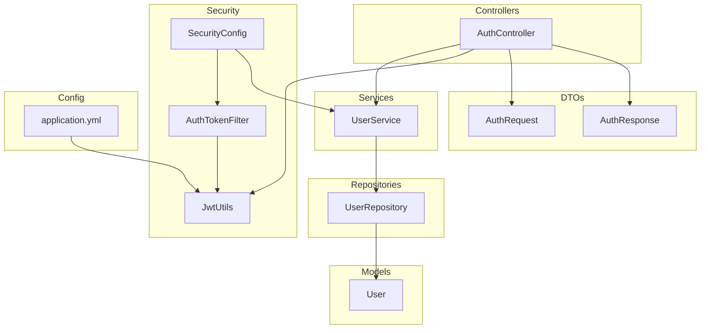
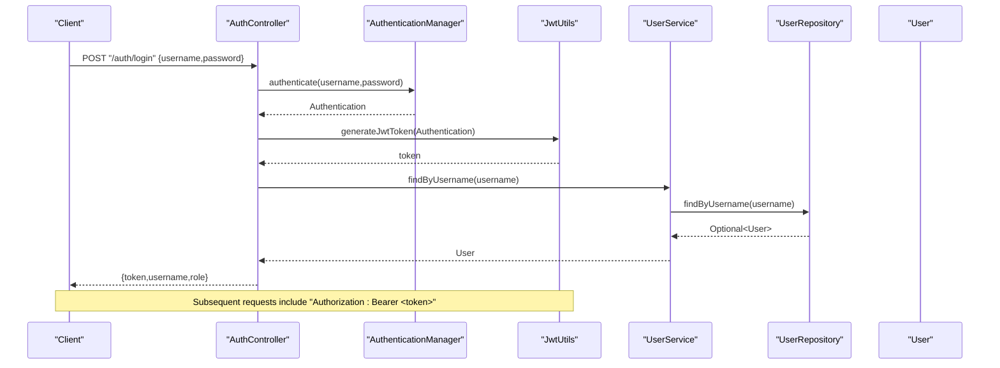
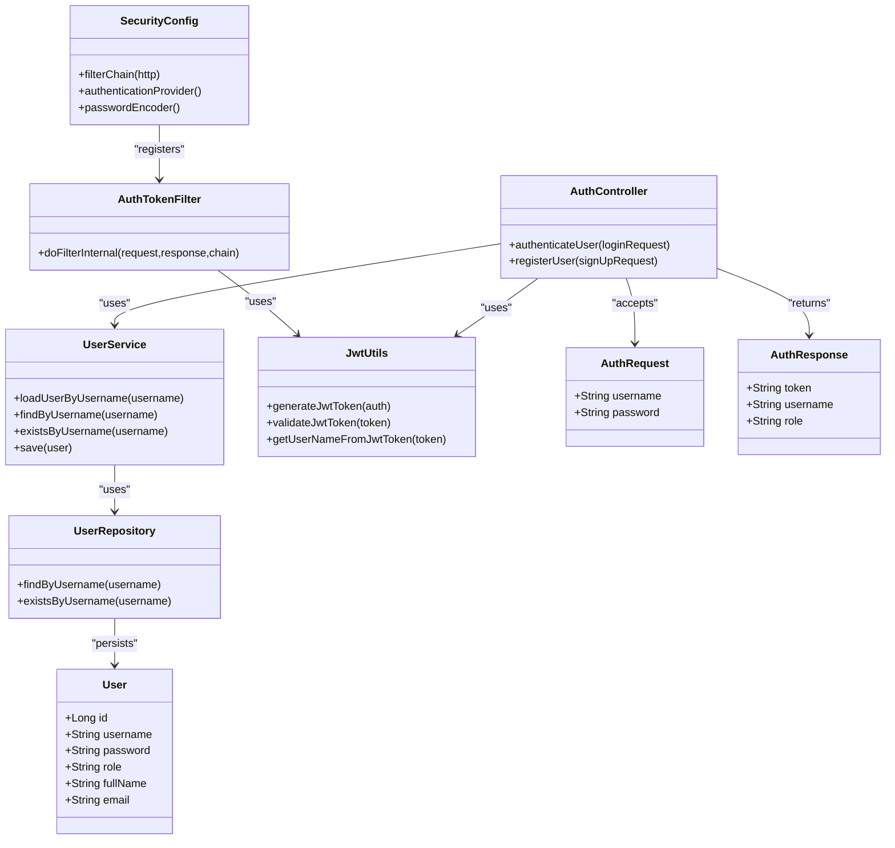

# User Management Endpoints

<cite>
**Referenced Files in This Document**
- [AuthController.java](file://backend-server/src/main/java/com/skyflow/controller/AuthController.java)
- [UserService.java](file://backend-server/src/main/java/com/skyflow/service/UserService.java)
- [UserRepository.java](file://backend-server/src/main/java/com/skyflow/repository/UserRepository.java)
- [User.java](file://backend-server/src/main/java/com/skyflow/model/entity/User.java)
- [AuthRequest.java](file://backend-server/src/main/java/com/skyflow/model/dto/request/AuthRequest.java)
- [AuthResponse.java](file://backend-server/src/main/java/com/skyflow/model/dto/response/AuthResponse.java)
- [SecurityConfig.java](file://backend-server/src/main/java/com/skyflow/config/SecurityConfig.java)
- [JwtUtils.java](file://backend-server/src/main/java/com/skyflow/security/JwtUtils.java)
- [AuthTokenFilter.java](file://backend-server/src/main/java/com/skyflow/security/AuthTokenFilter.java)
- [application.yml](file://backend-server/src/main/resources/application.yml)
- [GlobalExceptionHandler.java](file://backend-server/src/main/java/com/skyflow/exception/GlobalExceptionHandler.java)
- [BadRequestException.java](file://backend-server/src/main/java/com/skyflow/exception/BadRequestException.java)
- [ResourceNotFoundException.java](file://backend-server/src/main/java/com/skyflow/exception/ResourceNotFoundException.java)
- [UnauthorizedException.java](file://backend-server/src/main/java/com/skyflow/exception/UnauthorizedException.java)
- [ApiResponse.java](file://backend-server/src/main/java/com/skyflow/util/ApiResponse.java)
</cite>

## Table of Contents
1. [Introduction](#introduction)
2. [Project Structure](#project-structure)
3. [Core Components](#core-components)
4. [Architecture Overview](#architecture-overview)
5. [Detailed Component Analysis](#detailed-component-analysis)
6. [Dependency Analysis](#dependency-analysis)
7. [Performance Considerations](#performance-considerations)
8. [Troubleshooting Guide](#troubleshooting-guide)
9. [Conclusion](#conclusion)

## Introduction
This document describes the user management endpoints and supporting infrastructure for authentication and authorization. It focuses on:
- User registration and login
- Token-based authentication and authorization
- Role-based access control
- Request/response schemas for user-related operations
- Data validation rules
- Security considerations and data protection measures

Note: The current codebase exposes authentication endpoints under /auth but does not include dedicated user profile retrieval or update endpoints. The documentation below reflects the available implementation and highlights areas where user profile management could be extended.

## Project Structure
The user management functionality spans controllers, services, repositories, security filters, DTOs, and configuration.

**Diagram sources**
- [AuthController.java:17-58](file://backend-server/src/main/java/com/skyflow/controller/AuthController.java#L17-L58)
- [UserService.java:14-42](file://backend-server/src/main/java/com/skyflow/service/UserService.java#L14-L42)
- [UserRepository.java:7-11](file://backend-server/src/main/java/com/skyflow/repository/UserRepository.java#L7-L11)
- [User.java:13-30](file://backend-server/src/main/java/com/skyflow/model/entity/User.java#L13-L30)
- [SecurityConfig.java:23-81](file://backend-server/src/main/java/com/skyflow/config/SecurityConfig.java#L23-L81)
- [AuthTokenFilter.java:19-62](file://backend-server/src/main/java/com/skyflow/security/AuthTokenFilter.java#L19-L62)
- [JwtUtils.java:14-53](file://backend-server/src/main/java/com/skyflow/security/JwtUtils.java#L14-L53)
- [AuthRequest.java:5-9](file://backend-server/src/main/java/com/skyflow/model/dto/request/AuthRequest.java#L5-L9)
- [AuthResponse.java:8-12](file://backend-server/src/main/java/com/skyflow/model/dto/response/AuthResponse.java#L8-L12)
- [application.yml:26-29](file://backend-server/src/main/resources/application.yml#L26-L29)

**Section sources**
- [AuthController.java:17-58](file://backend-server/src/main/java/com/skyflow/controller/AuthController.java#L17-L58)
- [SecurityConfig.java:50-67](file://backend-server/src/main/java/com/skyflow/config/SecurityConfig.java#L50-L67)
- [application.yml:26-29](file://backend-server/src/main/resources/application.yml#L26-L29)

## Core Components
- Authentication controller: Provides endpoints for login and registration.
- User service: Loads user details and persists users.
- User repository: JPA repository for user persistence.
- User entity: Defines user schema including username, password, and role.
- Security configuration: Configures Spring Security, CORS, and method-level security.
- JWT utilities: Generate and validate tokens.
- Auth token filter: Extracts and validates JWTs from Authorization headers.
- DTOs: Request/response models for authentication.
- Exception handling: Centralized error responses.
- Utility wrapper: Standardized API response envelope.

**Section sources**
- [AuthController.java:29-56](file://backend-server/src/main/java/com/skyflow/controller/AuthController.java#L29-L56)
- [UserService.java:19-40](file://backend-server/src/main/java/com/skyflow/service/UserService.java#L19-L40)
- [UserRepository.java:7-11](file://backend-server/src/main/java/com/skyflow/repository/UserRepository.java#L7-L11)
- [User.java:18-29](file://backend-server/src/main/java/com/skyflow/model/entity/User.java#L18-L29)
- [SecurityConfig.java:50-67](file://backend-server/src/main/java/com/skyflow/config/SecurityConfig.java#L50-L67)
- [JwtUtils.java:23-51](file://backend-server/src/main/java/com/skyflow/security/JwtUtils.java#L23-L51)
- [AuthTokenFilter.java:28-50](file://backend-server/src/main/java/com/skyflow/security/AuthTokenFilter.java#L28-L50)
- [AuthRequest.java:6-8](file://backend-server/src/main/java/com/skyflow/model/dto/request/AuthRequest.java#L6-L8)
- [AuthResponse.java:9-11](file://backend-server/src/main/java/com/skyflow/model/dto/response/AuthResponse.java#L9-L11)
- [GlobalExceptionHandler.java:20-42](file://backend-server/src/main/java/com/skyflow/exception/GlobalExceptionHandler.java#L20-L42)
- [ApiResponse.java:19-42](file://backend-server/src/main/java/com/skyflow/util/ApiResponse.java#L19-L42)

## Architecture Overview
The authentication flow uses stateless JWT tokens. Requests are intercepted by a filter that validates the token and sets the authentication context. Controllers expose endpoints for login and registration.

**Diagram sources**
- [AuthController.java:29-40](file://backend-server/src/main/java/com/skyflow/controller/AuthController.java#L29-L40)
- [JwtUtils.java:23-32](file://backend-server/src/main/java/com/skyflow/security/JwtUtils.java#L23-L32)
- [UserService.java:29-32](file://backend-server/src/main/java/com/skyflow/service/UserService.java#L29-L32)
- [UserRepository.java:8-8](file://backend-server/src/main/java/com/skyflow/repository/UserRepository.java#L8-L8)

## Detailed Component Analysis

### Authentication Endpoints
- Endpoint: POST /auth/login
  - Purpose: Authenticate a user and issue a JWT.
  - Request body: [AuthRequest:6-8](file://backend-server/src/main/java/com/skyflow/model/dto/request/AuthRequest.java#L6-L8)
  - Response: [AuthResponse:9-11](file://backend-server/src/main/java/com/skyflow/model/dto/response/AuthResponse.java#L9-L11)
  - Validation:
    - Username and password must be present.
    - Credentials verified via AuthenticationManager.
  - Security:
    - Stateless JWT issued with configured secret and expiration.
    - Token included in Authorization header for subsequent requests.

- Endpoint: POST /auth/register
  - Purpose: Register a new user with default role.
  - Request body: [AuthRequest:6-8](file://backend-server/src/main/java/com/skyflow/model/dto/request/AuthRequest.java#L6-L8)
  - Response: Success message.
  - Validation:
    - Username uniqueness enforced by repository.
    - Password hashed using BCrypt before persisting.
  - Behavior:
    - Role defaults to "USER".
    - No profile fields (e.g., email, full name) are set during registration.

**Section sources**
- [AuthController.java:29-56](file://backend-server/src/main/java/com/skyflow/controller/AuthController.java#L29-L56)
- [AuthRequest.java:6-8](file://backend-server/src/main/java/com/skyflow/model/dto/request/AuthRequest.java#L6-L8)
- [AuthResponse.java:9-11](file://backend-server/src/main/java/com/skyflow/model/dto/response/AuthResponse.java#L9-L11)
- [UserService.java:34-36](file://backend-server/src/main/java/com/skyflow/service/UserService.java#L34-L36)
- [UserRepository.java:10-10](file://backend-server/src/main/java/com/skyflow/repository/UserRepository.java#L10-L10)
- [application.yml:26-29](file://backend-server/src/main/resources/application.yml#L26-L29)

### User Entity and Schemas
- User entity fields:
  - id: auto-generated identifier
  - username: unique, non-null
  - password: non-null, BCrypt-encoded
  - role: non-null, e.g., "USER", "ADMIN"
  - fullName: optional
  - email: optional

- Request/response schemas:
  - Login request: [AuthRequest:6-8](file://backend-server/src/main/java/com/skyflow/model/dto/request/AuthRequest.java#L6-L8)
  - Registration request: [AuthRequest:6-8](file://backend-server/src/main/java/com/skyflow/model/dto/request/AuthRequest.java#L6-L8)
  - Login response: [AuthResponse:9-11](file://backend-server/src/main/java/com/skyflow/model/dto/response/AuthResponse.java#L9-L11)

- Notes:
  - Password is excluded from JSON serialization via @JsonIgnore.
  - No explicit validation annotations are present in the entity or DTOs.

**Section sources**
- [User.java:18-29](file://backend-server/src/main/java/com/skyflow/model/entity/User.java#L18-L29)
- [AuthRequest.java:6-8](file://backend-server/src/main/java/com/skyflow/model/dto/request/AuthRequest.java#L6-L8)
- [AuthResponse.java:9-11](file://backend-server/src/main/java/com/skyflow/model/dto/response/AuthResponse.java#L9-L11)

### Security and Access Control
- Security configuration:
  - Stateless sessions.
  - Public access to /auth/** endpoints.
  - Method-level security enabled.
  - CORS allows credentials and common methods/headers.

- JWT lifecycle:
  - Generation: [JwtUtils.generateJwtToken:23-32](file://backend-server/src/main/java/com/skyflow/security/JwtUtils.java#L23-L32)
  - Validation: [JwtUtils.validateJwtToken:43-51](file://backend-server/src/main/java/com/skyflow/security/JwtUtils.java#L43-L51)
  - Token extraction: [AuthTokenFilter.parseJwt:52-59](file://backend-server/src/main/java/com/skyflow/security/AuthTokenFilter.java#L52-L59)

- Role-based access control:
  - Current implementation does not enforce role-based restrictions on any endpoint.
  - The User entity includes a role field; future endpoints should use method security annotations (e.g., @PreAuthorize) to restrict access.

**Section sources**
- [SecurityConfig.java:50-67](file://backend-server/src/main/java/com/skyflow/config/SecurityConfig.java#L50-L67)
- [JwtUtils.java:23-51](file://backend-server/src/main/java/com/skyflow/security/JwtUtils.java#L23-L51)
- [AuthTokenFilter.java:28-50](file://backend-server/src/main/java/com/skyflow/security/AuthTokenFilter.java#L28-L50)
- [User.java:25-26](file://backend-server/src/main/java/com/skyflow/model/entity/User.java#L25-L26)

### Data Validation Rules
- Username:
  - Unique constraint enforced at repository level.
  - Required for login and registration.
- Password:
  - Required for registration.
  - Stored as BCrypt hash; minimum length not enforced in code.
- Role:
  - Required; defaults to "USER" on registration.
- Additional profile fields:
  - fullName and email are optional in the entity; no validation rules are applied.

Recommendations:
- Add DTO validation annotations (e.g., @NotBlank, @Size) for username and password.
- Enforce password complexity and minimum length.
- Add email validation and uniqueness if profile updates include email.

**Section sources**
- [UserRepository.java:8-10](file://backend-server/src/main/java/com/skyflow/repository/UserRepository.java#L8-L10)
- [User.java:18-29](file://backend-server/src/main/java/com/skyflow/model/entity/User.java#L18-L29)
- [AuthController.java:44-51](file://backend-server/src/main/java/com/skyflow/controller/AuthController.java#L44-L51)

### Error Handling
- Centralized exception handling:
  - Returns standardized error responses with timestamp, status, error, message, and path.
- Specific exceptions:
  - BadRequestException, ResourceNotFoundException, UnauthorizedException.
- API envelope:
  - Success/error wrappers available via [ApiResponse:19-42](file://backend-server/src/main/java/com/skyflow/util/ApiResponse.java#L19-L42).

**Section sources**
- [GlobalExceptionHandler.java:20-42](file://backend-server/src/main/java/com/skyflow/exception/GlobalExceptionHandler.java#L20-L42)
- [BadRequestException.java:6-15](file://backend-server/src/main/java/com/skyflow/exception/BadRequestException.java#L6-L15)
- [ResourceNotFoundException.java:6-15](file://backend-server/src/main/java/com/skyflow/exception/ResourceNotFoundException.java#L6-L15)
- [UnauthorizedException.java:6-15](file://backend-server/src/main/java/com/skyflow/exception/UnauthorizedException.java#L6-L15)
- [ApiResponse.java:19-42](file://backend-server/src/main/java/com/skyflow/util/ApiResponse.java#L19-L42)

### JWT Configuration
- Secret and expiration are loaded from application.yml.
- Default expiration is 1 day.

**Section sources**
- [application.yml:26-29](file://backend-server/src/main/resources/application.yml#L26-L29)
- [JwtUtils.java:17-21](file://backend-server/src/main/java/com/skyflow/security/JwtUtils.java#L17-L21)

## Dependency Analysis

**Diagram sources**
- [AuthController.java:17-58](file://backend-server/src/main/java/com/skyflow/controller/AuthController.java#L17-L58)
- [UserService.java:14-42](file://backend-server/src/main/java/com/skyflow/service/UserService.java#L14-L42)
- [UserRepository.java:7-11](file://backend-server/src/main/java/com/skyflow/repository/UserRepository.java#L7-L11)
- [User.java:13-30](file://backend-server/src/main/java/com/skyflow/model/entity/User.java#L13-L30)
- [SecurityConfig.java:23-81](file://backend-server/src/main/java/com/skyflow/config/SecurityConfig.java#L23-L81)
- [AuthTokenFilter.java:19-62](file://backend-server/src/main/java/com/skyflow/security/AuthTokenFilter.java#L19-L62)
- [JwtUtils.java:14-53](file://backend-server/src/main/java/com/skyflow/security/JwtUtils.java#L14-L53)
- [AuthRequest.java:5-9](file://backend-server/src/main/java/com/skyflow/model/dto/request/AuthRequest.java#L5-L9)
- [AuthResponse.java:8-12](file://backend-server/src/main/java/com/skyflow/model/dto/response/AuthResponse.java#L8-L12)

**Section sources**
- [AuthController.java:17-58](file://backend-server/src/main/java/com/skyflow/controller/AuthController.java#L17-L58)
- [UserService.java:14-42](file://backend-server/src/main/java/com/skyflow/service/UserService.java#L14-L42)
- [UserRepository.java:7-11](file://backend-server/src/main/java/com/skyflow/repository/UserRepository.java#L7-L11)
- [User.java:13-30](file://backend-server/src/main/java/com/skyflow/model/entity/User.java#L13-L30)
- [SecurityConfig.java:23-81](file://backend-server/src/main/java/com/skyflow/config/SecurityConfig.java#L23-L81)
- [AuthTokenFilter.java:19-62](file://backend-server/src/main/java/com/skyflow/security/AuthTokenFilter.java#L19-L62)
- [JwtUtils.java:14-53](file://backend-server/src/main/java/com/skyflow/security/JwtUtils.java#L14-L53)
- [AuthRequest.java:5-9](file://backend-server/src/main/java/com/skyflow/model/dto/request/AuthRequest.java#L5-L9)
- [AuthResponse.java:8-12](file://backend-server/src/main/java/com/skyflow/model/dto/response/AuthResponse.java#L8-L12)

## Performance Considerations
- Token validation is lightweight; avoid validating tokens excessively.
- Use pagination and selective field projection for any future user queries.
- Ensure database indexes exist for username lookups.
- Keep JWT expiration short for sensitive environments; adjust via configuration.

## Troubleshooting Guide
- 401 Unauthorized:
  - Cause: Invalid or missing Bearer token.
  - Resolution: Re-authenticate and include a fresh token.
- 400 Bad Request:
  - Registration failures due to existing username.
  - Login failures due to invalid credentials.
- 404 Not Found:
  - Attempting to access protected resources without authentication.
- 500 Internal Server Error:
  - Unexpected errors; check centralized error handler logs.

**Section sources**
- [GlobalExceptionHandler.java:20-42](file://backend-server/src/main/java/com/skyflow/exception/GlobalExceptionHandler.java#L20-L42)
- [UnauthorizedException.java:6-15](file://backend-server/src/main/java/com/skyflow/exception/UnauthorizedException.java#L6-L15)
- [BadRequestException.java:6-15](file://backend-server/src/main/java/com/skyflow/exception/BadRequestException.java#L6-L15)
- [ResourceNotFoundException.java:6-15](file://backend-server/src/main/java/com/skyflow/exception/ResourceNotFoundException.java#L6-L15)

## Conclusion
The current implementation provides secure authentication via JWT and basic user registration. To support comprehensive user profile management, consider adding:
- Dedicated endpoints for retrieving and updating user profiles.
- Role-based access control annotations on endpoints.
- Enhanced validation for usernames, passwords, and optional profile fields.
- Password reset functionality and secure token handling.
- Data protection measures such as input sanitization and secure logging.