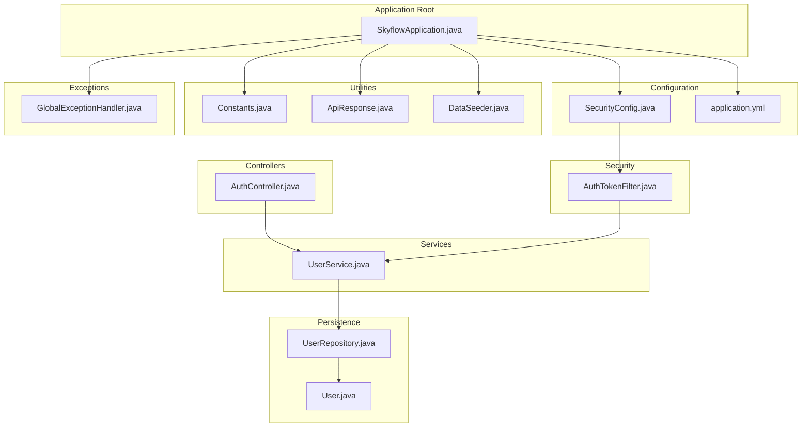
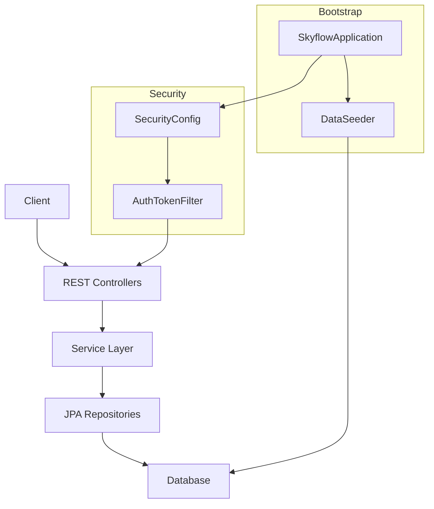
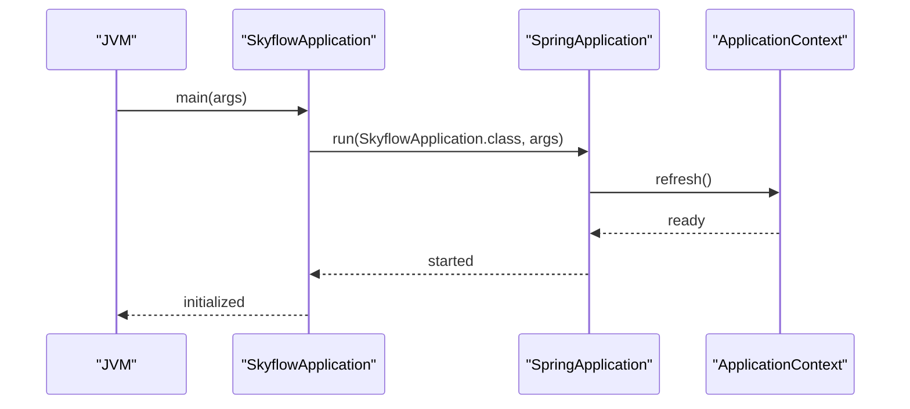
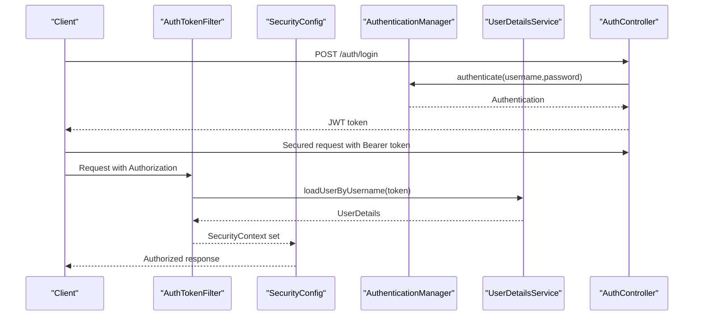
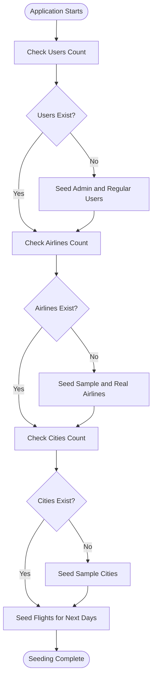
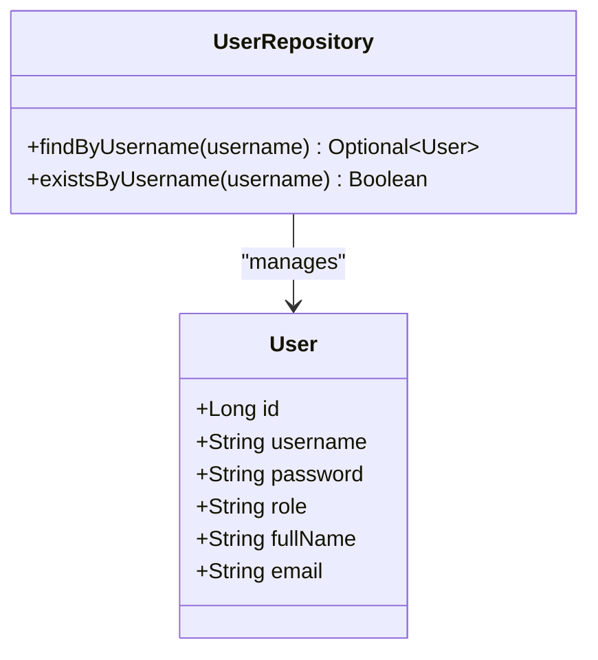
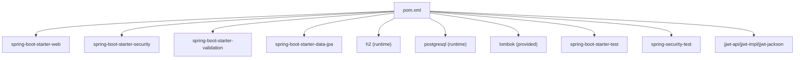

# Application Structure & Entry Point

<cite>
**Referenced Files in This Document**
- [SkyflowApplication.java](file://backend-server/src/main/java/com/skyflow/SkyflowApplication.java)
- [pom.xml](file://backend-server/pom.xml)
- [application.yml](file://backend-server/src/main/resources/application.yml)
- [DataSeeder.java](file://backend-server/src/main/java/com/skyflow/common/DataSeeder.java)
- [SecurityConfig.java](file://backend-server/src/main/java/com/skyflow/config/SecurityConfig.java)
- [AuthTokenFilter.java](file://backend-server/src/main/java/com/skyflow/security/AuthTokenFilter.java)
- [AuthController.java](file://backend-server/src/main/java/com/skyflow/controller/AuthController.java)
- [UserService.java](file://backend-server/src/main/java/com/skyflow/service/UserService.java)
- [User.java](file://backend-server/src/main/java/com/skyflow/model/entity/User.java)
- [UserRepository.java](file://backend-server/src/main/java/com/skyflow/repository/UserRepository.java)
- [Constants.java](file://backend-server/src/main/java/com/skyflow/util/Constants.java)
- [ApiResponse.java](file://backend-server/src/main/java/com/skyflow/util/ApiResponse.java)
- [GlobalExceptionHandler.java](file://backend-server/src/main/java/com/skyflow/exception/GlobalExceptionHandler.java)
- [Dockerfile](file://backend-server/Dockerfile)
- [docker-compose.yml](file://backend-server/docker-compose.yml)
</cite>

## Table of Contents
1. [Introduction](#introduction)
2. [Project Structure](#project-structure)
3. [Core Components](#core-components)
4. [Architecture Overview](#architecture-overview)
5. [Detailed Component Analysis](#detailed-component-analysis)
6. [Dependency Analysis](#dependency-analysis)
7. [Performance Considerations](#performance-considerations)
8. [Troubleshooting Guide](#troubleshooting-guide)
9. [Conclusion](#conclusion)
10. [Appendices](#appendices)

## Introduction
This document explains the Spring Boot application structure and entry point for the backend server. It focuses on the main application class SkyflowApplication, its initialization of the Spring context, and the surrounding configuration. It also documents the package organization, Maven build configuration, environment-specific settings via application.yml, and the DataSeeder utility that populates initial data. Finally, it outlines the application lifecycle and integration points for security, controllers, services, repositories, and utilities.

## Project Structure
The backend server follows a conventional Spring Boot layout under backend-server. The Java sources are organized by domain and responsibility into packages:
- com.skyflow.common: Application bootstrap utilities and initial data seeding
- com.skyflow.config: Spring Security configuration
- com.skyflow.controller: REST endpoints
- com.skyflow.exception: Global exception handling
- com.skyflow.model: JPA entities and DTOs
- com.skyflow.repository: Spring Data JPA repositories
- com.skyflow.security: JWT filter and utilities
- com.skyflow.service: Business logic services
- com.skyflow.util: Shared constants and response wrappers

**Diagram sources**
- [SkyflowApplication.java:1-14](file://backend-server/src/main/java/com/skyflow/SkyflowApplication.java#L1-L14)
- [SecurityConfig.java:1-81](file://backend-server/src/main/java/com/skyflow/config/SecurityConfig.java#L1-L81)
- [application.yml:1-30](file://backend-server/src/main/resources/application.yml#L1-L30)
- [AuthController.java:1-58](file://backend-server/src/main/java/com/skyflow/controller/AuthController.java#L1-L58)
- [UserService.java:1-42](file://backend-server/src/main/java/com/skyflow/service/UserService.java#L1-L42)
- [UserRepository.java:1-12](file://backend-server/src/main/java/com/skyflow/repository/UserRepository.java#L1-L12)
- [User.java:1-31](file://backend-server/src/main/java/com/skyflow/model/entity/User.java#L1-L31)
- [AuthTokenFilter.java:1-62](file://backend-server/src/main/java/com/skyflow/security/AuthTokenFilter.java#L1-L62)
- [Constants.java:1-17](file://backend-server/src/main/java/com/skyflow/util/Constants.java#L1-L17)
- [ApiResponse.java:1-44](file://backend-server/src/main/java/com/skyflow/util/ApiResponse.java#L1-L44)
- [DataSeeder.java:1-200](file://backend-server/src/main/java/com/skyflow/common/DataSeeder.java#L1-L200)
- [GlobalExceptionHandler.java:1-55](file://backend-server/src/main/java/com/skyflow/exception/GlobalExceptionHandler.java#L1-L55)

**Section sources**
- [SkyflowApplication.java:1-14](file://backend-server/src/main/java/com/skyflow/SkyflowApplication.java#L1-L14)
- [pom.xml:1-165](file://backend-server/pom.xml#L1-L165)
- [application.yml:1-30](file://backend-server/src/main/resources/application.yml#L1-L30)

## Core Components
- SkyflowApplication: The Spring Boot entry point annotated with @SpringBootApplication. It launches the embedded web server and initializes the application context.
- SecurityConfig: Defines Spring Security configuration including CORS, CSRF disablement, stateless sessions, method-level security, and a custom JWT filter chain.
- AuthController: Exposes authentication endpoints for login and registration, integrating with AuthenticationManager and JWT utilities.
- UserService: Implements UserDetailsService to load user details for authentication and exposes convenience methods for user operations.
- DataSeeder: A CommandLineRunner that seeds the database with initial users, airlines, cities, and flights during application startup.
- GlobalExceptionHandler: Centralized exception handling for resource not found, bad request, unauthorized, and generic server errors.

**Section sources**
- [SkyflowApplication.java:1-14](file://backend-server/src/main/java/com/skyflow/SkyflowApplication.java#L1-L14)
- [SecurityConfig.java:1-81](file://backend-server/src/main/java/com/skyflow/config/SecurityConfig.java#L1-L81)
- [AuthController.java:1-58](file://backend-server/src/main/java/com/skyflow/controller/AuthController.java#L1-L58)
- [UserService.java:1-42](file://backend-server/src/main/java/com/skyflow/service/UserService.java#L1-L42)
- [DataSeeder.java:1-200](file://backend-server/src/main/java/com/skyflow/common/DataSeeder.java#L1-L200)
- [GlobalExceptionHandler.java:1-55](file://backend-server/src/main/java/com/skyflow/exception/GlobalExceptionHandler.java#L1-L55)

## Architecture Overview
The backend uses Spring MVC for REST APIs, Spring Data JPA for persistence, Spring Security with JWT for authentication, and H2 in-memory database by default with optional PostgreSQL support. The application lifecycle starts at SkyflowApplication, which bootstraps the context, loads configuration, registers beans, and executes DataSeeder.

**Diagram sources**
- [SkyflowApplication.java:1-14](file://backend-server/src/main/java/com/skyflow/SkyflowApplication.java#L1-L14)
- [SecurityConfig.java:1-81](file://backend-server/src/main/java/com/skyflow/config/SecurityConfig.java#L1-L81)
- [AuthTokenFilter.java:1-62](file://backend-server/src/main/java/com/skyflow/security/AuthTokenFilter.java#L1-L62)
- [AuthController.java:1-58](file://backend-server/src/main/java/com/skyflow/controller/AuthController.java#L1-L58)
- [UserService.java:1-42](file://backend-server/src/main/java/com/skyflow/service/UserService.java#L1-L42)
- [UserRepository.java:1-12](file://backend-server/src/main/java/com/skyflow/repository/UserRepository.java#L1-L12)
- [DataSeeder.java:1-200](file://backend-server/src/main/java/com/skyflow/common/DataSeeder.java#L1-L200)

## Detailed Component Analysis

### Entry Point and Application Initialization
SkyflowApplication is the primary entry point. It delegates to SpringApplication.run to initialize the Spring context, scan for components, and start the embedded server. The @SpringBootApplication annotation enables component scanning and auto-configuration.

**Diagram sources**
- [SkyflowApplication.java:1-14](file://backend-server/src/main/java/com/skyflow/SkyflowApplication.java#L1-L14)

**Section sources**
- [SkyflowApplication.java:1-14](file://backend-server/src/main/java/com/skyflow/SkyflowApplication.java#L1-L14)

### Security Configuration and JWT Filter Chain
SecurityConfig configures:
- Stateless sessions
- Permissive endpoints for authentication, city, flight, H2 console, and chat
- A custom JWT filter that extracts tokens from Authorization headers and authenticates requests
- Password encoding with BCrypt
- CORS allowing credentials and common HTTP methods

**Diagram sources**
- [SecurityConfig.java:1-81](file://backend-server/src/main/java/com/skyflow/config/SecurityConfig.java#L1-L81)
- [AuthTokenFilter.java:1-62](file://backend-server/src/main/java/com/skyflow/security/AuthTokenFilter.java#L1-L62)
- [AuthController.java:1-58](file://backend-server/src/main/java/com/skyflow/controller/AuthController.java#L1-L58)
- [UserService.java:1-42](file://backend-server/src/main/java/com/skyflow/service/UserService.java#L1-L42)

**Section sources**
- [SecurityConfig.java:1-81](file://backend-server/src/main/java/com/skyflow/config/SecurityConfig.java#L1-L81)
- [AuthTokenFilter.java:1-62](file://backend-server/src/main/java/com/skyflow/security/AuthTokenFilter.java#L1-L62)

### Data Seeding Lifecycle
DataSeeder runs as a CommandLineRunner during application startup. It ensures initial data is present by checking repository counts and creating users, airlines, cities, and flights. It leverages PasswordEncoder for secure password storage and constructs realistic flight schedules for a limited number of days to keep startup fast.

**Diagram sources**
- [DataSeeder.java:1-200](file://backend-server/src/main/java/com/skyflow/common/DataSeeder.java#L1-L200)

**Section sources**
- [DataSeeder.java:1-200](file://backend-server/src/main/java/com/skyflow/common/DataSeeder.java#L1-L200)

### Persistence Model and Repositories
The persistence layer uses JPA entities and Spring Data repositories. The User entity defines the users table with username, password, role, full name, and email. The UserRepository interface extends JpaRepository to provide CRUD operations.

**Diagram sources**
- [User.java:1-31](file://backend-server/src/main/java/com/skyflow/model/entity/User.java#L1-L31)
- [UserRepository.java:1-12](file://backend-server/src/main/java/com/skyflow/repository/UserRepository.java#L1-L12)

**Section sources**
- [User.java:1-31](file://backend-server/src/main/java/com/skyflow/model/entity/User.java#L1-L31)
- [UserRepository.java:1-12](file://backend-server/src/main/java/com/skyflow/repository/UserRepository.java#L1-L12)

### Utilities and Constants
- Constants: Provides shared constants for API versioning, HTTP headers, and date/time formats.
- ApiResponse: A generic response wrapper for API responses with success flags, messages, data, and timestamps.

**Section sources**
- [Constants.java:1-17](file://backend-server/src/main/java/com/skyflow/util/Constants.java#L1-L17)
- [ApiResponse.java:1-44](file://backend-server/src/main/java/com/skyflow/util/ApiResponse.java#L1-L44)

### Exception Handling
GlobalExceptionHandler centralizes error responses for common exceptions, logging error details and returning structured JSON with timestamp, status, error phrase, message, and request path.

**Section sources**
- [GlobalExceptionHandler.java:1-55](file://backend-server/src/main/java/com/skyflow/exception/GlobalExceptionHandler.java#L1-L55)

## Dependency Analysis
The application uses Spring Boot starters for web, security, validation, and JPA, with H2 for development and PostgreSQL for production. JWT libraries are included for token handling. Dependency management pins versions for core Spring modules and Jackson.

**Diagram sources**
- [pom.xml:1-165](file://backend-server/pom.xml#L1-L165)

**Section sources**
- [pom.xml:1-165](file://backend-server/pom.xml#L1-L165)

## Performance Considerations
- Data seeding is restricted to a short time window to minimize startup latency.
- Stateless session policy reduces server-side session overhead.
- Using runtime-scoped databases allows switching between H2 and PostgreSQL without recompiling.
- Consider caching frequently accessed entities and optimizing flight generation for larger datasets.

[No sources needed since this section provides general guidance]

## Troubleshooting Guide
Common areas to check:
- Database connectivity: Verify datasource properties and environment variables for H2 or PostgreSQL.
- JWT configuration: Confirm secret and expiration values align with client expectations.
- Security filters: Ensure Authorization headers are properly formatted and that the JWT filter is registered.
- Exception handling: Review logs for handled exceptions and adjust logging levels as needed.

Environment-specific settings and property management are driven by application.yml and docker-compose environment overrides.

**Section sources**
- [application.yml:1-30](file://backend-server/src/main/resources/application.yml#L1-L30)
- [docker-compose.yml:1-36](file://backend-server/docker-compose.yml#L1-L36)

## Conclusion
The backend server is structured around a clear entry point, robust security configuration, modular controllers and services, and a pragmatic data seeding strategy. The Maven configuration supports both development and production environments, while the YAML configuration enables environment-specific overrides. Together, these components deliver a maintainable and extensible Spring Boot application.

[No sources needed since this section summarizes without analyzing specific files]

## Appendices

### Build and Containerization
- Maven build: Compiles with Java 17 and packages the application with spring-boot-maven-plugin, excluding Lombok.
- Docker: Multi-stage build using Maven and a minimal JRE base image; exposes the application jar as app.jar.
- Docker Compose: Orchestrates the backend and a PostgreSQL database, passing environment variables for datasource configuration.

**Section sources**
- [pom.xml:139-162](file://backend-server/pom.xml#L139-L162)
- [Dockerfile:1-11](file://backend-server/Dockerfile#L1-L11)
- [docker-compose.yml:1-36](file://backend-server/docker-compose.yml#L1-L36)