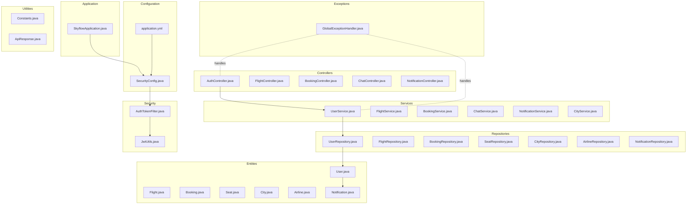
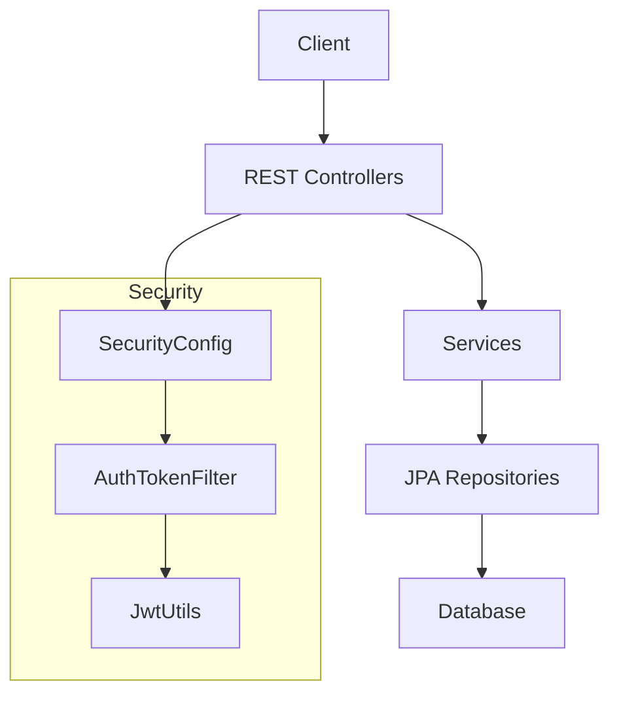
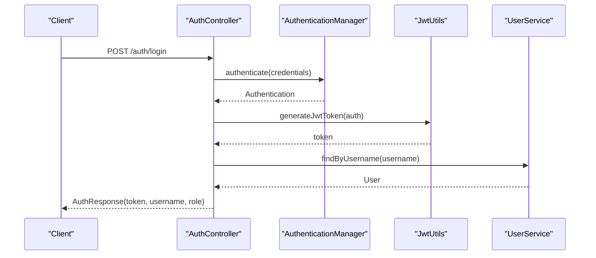
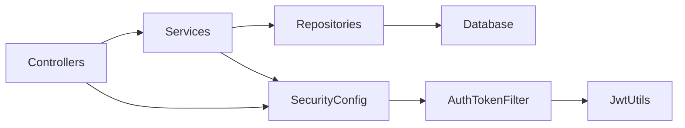

# Backend Architecture

<cite>
**Referenced Files in This Document**
- [SkyflowApplication.java](file://backend-server/src/main/java/com/skyflow/SkyflowApplication.java)
- [application.yml](file://backend-server/src/main/resources/application.yml)
- [pom.xml](file://backend-server/pom.xml)
- [SecurityConfig.java](file://backend-server/src/main/java/com/skyflow/config/SecurityConfig.java)
- [AuthTokenFilter.java](file://backend-server/src/main/java/com/skyflow/security/AuthTokenFilter.java)
- [JwtUtils.java](file://backend-server/src/main/java/com/skyflow/security/JwtUtils.java)
- [AuthController.java](file://backend-server/src/main/java/com/skyflow/controller/AuthController.java)
- [UserService.java](file://backend-server/src/main/java/com/skyflow/service/UserService.java)
- [UserRepository.java](file://backend-server/src/main/java/com/skyflow/repository/UserRepository.java)
- [User.java](file://backend-server/src/main/java/com/skyflow/model/entity/User.java)
- [GlobalExceptionHandler.java](file://backend-server/src/main/java/com/skyflow/exception/GlobalExceptionHandler.java)
- [Constants.java](file://backend-server/src/main/java/com/skyflow/util/Constants.java)
- [ApiResponse.java](file://backend-server/src/main/java/com/skyflow/util/ApiResponse.java)
- [docker-compose.yml](file://backend-server/docker-compose.yml)
- [Dockerfile](file://backend-server/Dockerfile)
</cite>

## Table of Contents
1. [Introduction](#introduction)
2. [Project Structure](#project-structure)
3. [Core Components](#core-components)
4. [Architecture Overview](#architecture-overview)
5. [Detailed Component Analysis](#detailed-component-analysis)
6. [Dependency Analysis](#dependency-analysis)
7. [Performance Considerations](#performance-considerations)
8. [Troubleshooting Guide](#troubleshooting-guide)
9. [Conclusion](#conclusion)
10. [Appendices](#appendices)

## Introduction
This document describes the backend architecture of the Spring Boot-based SkyFlow reservation system. It focuses on the layered architecture following Model-View-Controller (MVC), the service layer, and the repository pattern. It also documents the application entry point, security configuration with JWT authentication, CORS setup, project structure, package organization, naming conventions, Spring Boot configuration, database setup, environment properties, Maven build configuration, dependency management, development workflow, security considerations, error handling patterns, and application lifecycle management.

## Project Structure
The backend module follows a conventional Spring Boot layout with clear separation of concerns:
- Application entry point under the root package
- Configuration classes for security and web
- MVC controllers for REST endpoints
- Services implementing business logic
- Repositories for persistence
- Entities modeling domain data
- Utilities and constants
- Global exception handling
- Resources for configuration and environment-specific settings
- Packaging artifacts for containerization

**Diagram sources**
- [SkyflowApplication.java:1-14](file://backend-server/src/main/java/com/skyflow/SkyflowApplication.java#L1-L14)
- [SecurityConfig.java:1-81](file://backend-server/src/main/java/com/skyflow/config/SecurityConfig.java#L1-L81)
- [AuthTokenFilter.java:1-62](file://backend-server/src/main/java/com/skyflow/security/AuthTokenFilter.java#L1-L62)
- [JwtUtils.java:1-53](file://backend-server/src/main/java/com/skyflow/security/JwtUtils.java#L1-L53)
- [AuthController.java:1-58](file://backend-server/src/main/java/com/skyflow/controller/AuthController.java#L1-L58)
- [UserService.java:1-42](file://backend-server/src/main/java/com/skyflow/service/UserService.java#L1-L42)
- [UserRepository.java:1-12](file://backend-server/src/main/java/com/skyflow/repository/UserRepository.java#L1-L12)
- [User.java:1-31](file://backend-server/src/main/java/com/skyflow/model/entity/User.java#L1-L31)
- [GlobalExceptionHandler.java:1-55](file://backend-server/src/main/java/com/skyflow/exception/GlobalExceptionHandler.java#L1-L55)
- [Constants.java:1-17](file://backend-server/src/main/java/com/skyflow/util/Constants.java#L1-L17)
- [ApiResponse.java:1-44](file://backend-server/src/main/java/com/skyflow/util/ApiResponse.java#L1-L44)
- [application.yml:1-30](file://backend-server/src/main/resources/application.yml#L1-L30)

**Section sources**
- [SkyflowApplication.java:1-14](file://backend-server/src/main/java/com/skyflow/SkyflowApplication.java#L1-L14)
- [application.yml:1-30](file://backend-server/src/main/resources/application.yml#L1-L30)

## Core Components
- Application entry point: Declares the Spring Boot application class and starts the embedded server.
- Configuration: Security configuration enables stateless sessions, method security, and CORS; JWT utilities and filter integrate authentication.
- Controllers: Expose REST endpoints under versioned paths; coordinate DTOs and responses.
- Services: Encapsulate business logic and orchestrate repositories.
- Repositories: JPA repositories for persistence operations.
- Entities: JPA entities mapped to database tables.
- Exceptions: Centralized exception handling via a global advice controller.
- Utilities: Shared constants and generic response wrapper.

**Section sources**
- [SkyflowApplication.java:1-14](file://backend-server/src/main/java/com/skyflow/SkyflowApplication.java#L1-L14)
- [SecurityConfig.java:1-81](file://backend-server/src/main/java/com/skyflow/config/SecurityConfig.java#L1-L81)
- [AuthTokenFilter.java:1-62](file://backend-server/src/main/java/com/skyflow/security/AuthTokenFilter.java#L1-L62)
- [JwtUtils.java:1-53](file://backend-server/src/main/java/com/skyflow/security/JwtUtils.java#L1-L53)
- [AuthController.java:1-58](file://backend-server/src/main/java/com/skyflow/controller/AuthController.java#L1-L58)
- [UserService.java:1-42](file://backend-server/src/main/java/com/skyflow/service/UserService.java#L1-L42)
- [UserRepository.java:1-12](file://backend-server/src/main/java/com/skyflow/repository/UserRepository.java#L1-L12)
- [User.java:1-31](file://backend-server/src/main/java/com/skyflow/model/entity/User.java#L1-L31)
- [GlobalExceptionHandler.java:1-55](file://backend-server/src/main/java/com/skyflow/exception/GlobalExceptionHandler.java#L1-L55)
- [Constants.java:1-17](file://backend-server/src/main/java/com/skyflow/util/Constants.java#L1-L17)
- [ApiResponse.java:1-44](file://backend-server/src/main/java/com/skyflow/util/ApiResponse.java#L1-L44)

## Architecture Overview
The system follows a layered architecture:
- Presentation Layer: REST controllers expose endpoints.
- Application Layer: Services encapsulate business logic.
- Persistence Layer: JPA repositories abstract data access.
- Infrastructure: Security filters, JWT utilities, CORS configuration, and configuration properties.

**Diagram sources**
- [SecurityConfig.java:1-81](file://backend-server/src/main/java/com/skyflow/config/SecurityConfig.java#L1-L81)
- [AuthTokenFilter.java:1-62](file://backend-server/src/main/java/com/skyflow/security/AuthTokenFilter.java#L1-L62)
- [JwtUtils.java:1-53](file://backend-server/src/main/java/com/skyflow/security/JwtUtils.java#L1-L53)
- [AuthController.java:1-58](file://backend-server/src/main/java/com/skyflow/controller/AuthController.java#L1-L58)
- [UserService.java:1-42](file://backend-server/src/main/java/com/skyflow/service/UserService.java#L1-L42)
- [UserRepository.java:1-12](file://backend-server/src/main/java/com/skyflow/repository/UserRepository.java#L1-L12)

## Detailed Component Analysis

### Application Entry Point
- The application class is annotated as a Spring Boot application and launches the embedded server.
- Port and logging levels are configured via application properties.

**Section sources**
- [SkyflowApplication.java:1-14](file://backend-server/src/main/java/com/skyflow/SkyflowApplication.java#L1-L14)
- [application.yml:1-30](file://backend-server/src/main/resources/application.yml#L1-L30)

### Security Configuration and JWT Authentication
- Stateless session policy and method security are enabled.
- CORS allows credentials and broad methods/headers.
- Authentication provider uses a user details service and BCrypt encoder.
- An authentication filter parses Authorization headers, validates JWT tokens, and sets the security context.
- JWT utilities generate and validate tokens using a symmetric key derived from application properties.

**Diagram sources**
- [AuthController.java:1-58](file://backend-server/src/main/java/com/skyflow/controller/AuthController.java#L1-L58)
- [JwtUtils.java:1-53](file://backend-server/src/main/java/com/skyflow/security/JwtUtils.java#L1-L53)
- [UserService.java:1-42](file://backend-server/src/main/java/com/skyflow/service/UserService.java#L1-L42)

**Section sources**
- [SecurityConfig.java:1-81](file://backend-server/src/main/java/com/skyflow/config/SecurityConfig.java#L1-L81)
- [AuthTokenFilter.java:1-62](file://backend-server/src/main/java/com/skyflow/security/AuthTokenFilter.java#L1-L62)
- [JwtUtils.java:1-53](file://backend-server/src/main/java/com/skyflow/security/JwtUtils.java#L1-L53)
- [application.yml:26-30](file://backend-server/src/main/resources/application.yml#L26-L30)

### CORS Setup
- Global CORS configuration permits credentials, wildcard origins, and common HTTP methods and headers.
- Applied at the HttpSecurity level and exposed via a bean.

**Section sources**
- [SecurityConfig.java:69-80](file://backend-server/src/main/java/com/skyflow/config/SecurityConfig.java#L69-L80)

### MVC Pattern Implementation
- Controllers are annotated with @RestController and @RequestMapping to define endpoint namespaces.
- Controllers depend on services for business operations and return ResponseEntity or DTO wrappers.
- Example endpoints include authentication registration and login.

**Section sources**
- [AuthController.java:1-58](file://backend-server/src/main/java/com/skyflow/controller/AuthController.java#L1-L58)

### Service Layer
- Services are transactional and implement Spring Security’s UserDetailsService for authentication.
- They delegate persistence to repositories and transform domain entities to DTOs where applicable.

**Section sources**
- [UserService.java:1-42](file://backend-server/src/main/java/com/skyflow/service/UserService.java#L1-L42)

### Repository Pattern
- JPA repositories extend JpaRepository to inherit common CRUD operations.
- Custom finder methods are defined alongside standard ones.

**Section sources**
- [UserRepository.java:1-12](file://backend-server/src/main/java/com/skyflow/repository/UserRepository.java#L1-L12)

### Data Model
- Entities are mapped with JPA annotations and include identifiers, constraints, and JSON ignore rules.
- Example entity: User with username, password, role, and contact fields.

**Section sources**
- [User.java:1-31](file://backend-server/src/main/java/com/skyflow/model/entity/User.java#L1-L31)

### Error Handling Patterns
- A global exception handler centralizes error responses with standardized fields.
- Specific exceptions are mapped to appropriate HTTP statuses.

**Section sources**
- [GlobalExceptionHandler.java:1-55](file://backend-server/src/main/java/com/skyflow/exception/GlobalExceptionHandler.java#L1-L55)

### Utilities and Constants
- Constants define common prefixes, headers, and formatting patterns.
- ApiResponse provides a reusable envelope for API responses.

**Section sources**
- [Constants.java:1-17](file://backend-server/src/main/java/com/skyflow/util/Constants.java#L1-L17)
- [ApiResponse.java:1-44](file://backend-server/src/main/java/com/skyflow/util/ApiResponse.java#L1-L44)

### Configuration and Environment Properties
- Datasource and JPA/Hibernate settings are externalized via application.yml.
- JWT secret and expiration are configured centrally.
- Logging levels for Spring Security are set.

**Section sources**
- [application.yml:1-30](file://backend-server/src/main/resources/application.yml#L1-L30)

### Database Setup and Environment
- Development defaults to an in-memory H2 database with console enabled.
- Production uses PostgreSQL orchestrated via docker-compose with persistent volume.

**Section sources**
- [application.yml:4-17](file://backend-server/src/main/resources/application.yml#L4-L17)
- [docker-compose.yml:1-36](file://backend-server/docker-compose.yml#L1-L36)

### Maven Build Configuration and Dependency Management
- Parent starter version and Java 17 toolchain.
- Core starters: web, security, data JPA, validation.
- JWT dependencies via jjwt-api/impl/jackson.
- PostgreSQL and H2 runtime dependencies.
- Plugins: compiler (Java 17) and spring-boot-maven-plugin excluding Lombok.

**Section sources**
- [pom.xml:1-165](file://backend-server/pom.xml#L1-L165)

### Containerization and Lifecycle
- Multi-stage Docker build: Maven build stage, minimal JRE runtime stage.
- Exposes application jar and runs with java -jar.

**Section sources**
- [Dockerfile:1-11](file://backend-server/Dockerfile#L1-L11)

## Dependency Analysis
The system exhibits low coupling and high cohesion:
- Controllers depend on services, services on repositories, and repositories on JPA infrastructure.
- Security is centralized in configuration and filter classes.
- Utilities and constants are shared across layers.

**Diagram sources**
- [SecurityConfig.java:1-81](file://backend-server/src/main/java/com/skyflow/config/SecurityConfig.java#L1-L81)
- [AuthTokenFilter.java:1-62](file://backend-server/src/main/java/com/skyflow/security/AuthTokenFilter.java#L1-L62)
- [JwtUtils.java:1-53](file://backend-server/src/main/java/com/skyflow/security/JwtUtils.java#L1-L53)
- [AuthController.java:1-58](file://backend-server/src/main/java/com/skyflow/controller/AuthController.java#L1-L58)
- [UserService.java:1-42](file://backend-server/src/main/java/com/skyflow/service/UserService.java#L1-L42)
- [UserRepository.java:1-12](file://backend-server/src/main/java/com/skyflow/repository/UserRepository.java#L1-L12)

**Section sources**
- [pom.xml:74-137](file://backend-server/pom.xml#L74-L137)

## Performance Considerations
- Stateless JWT reduces server-side session overhead.
- JPA/Hibernate settings enable SQL logging for diagnostics; tune ddl-auto and caching for production.
- Consider pagination for list endpoints and lazy loading for large associations.
- Monitor CORS exposure in production environments.

[No sources needed since this section provides general guidance]

## Troubleshooting Guide
- Authentication failures: Verify Authorization header format and JWT validity; check security filter logs.
- Database connectivity: Confirm datasource properties and network reachability; validate PostgreSQL credentials and schema.
- CORS errors: Ensure client sends credentials and matches allowed headers/methods.
- Unexpected errors: Inspect global exception handler logs and error response payloads.

**Section sources**
- [GlobalExceptionHandler.java:1-55](file://backend-server/src/main/java/com/skyflow/exception/GlobalExceptionHandler.java#L1-L55)
- [application.yml:22-24](file://backend-server/src/main/resources/application.yml#L22-L24)

## Conclusion
The backend employs a clean layered architecture with explicit separation between presentation, application, and persistence concerns. Security is integrated via stateless JWT and centralized CORS configuration. The system is container-ready, testable, and configurable for both development and production environments.

[No sources needed since this section summarizes without analyzing specific files]

## Appendices

### Package Organization and Naming Conventions
- Root package com.skyflow contains the application entry point and nested packages for configuration, controllers, services, repositories, models, security, exception handling, utilities, and common helpers.
- Classes follow PascalCase; constants use UPPER_SNAKE_CASE; DTOs reside under model.dto with request/response subpackages.

**Section sources**
- [SkyflowApplication.java:1-14](file://backend-server/src/main/java/com/skyflow/SkyflowApplication.java#L1-L14)
- [AuthController.java:1-58](file://backend-server/src/main/java/com/skyflow/controller/AuthController.java#L1-L58)
- [UserService.java:1-42](file://backend-server/src/main/java/com/skyflow/service/UserService.java#L1-L42)
- [UserRepository.java:1-12](file://backend-server/src/main/java/com/skyflow/repository/UserRepository.java#L1-L12)
- [User.java:1-31](file://backend-server/src/main/java/com/skyflow/model/entity/User.java#L1-L31)
- [GlobalExceptionHandler.java:1-55](file://backend-server/src/main/java/com/skyflow/exception/GlobalExceptionHandler.java#L1-L55)
- [Constants.java:1-17](file://backend-server/src/main/java/com/skyflow/util/Constants.java#L1-L17)
- [ApiResponse.java:1-44](file://backend-server/src/main/java/com/skyflow/util/ApiResponse.java#L1-L44)

### Development Workflow
- Build with Maven; run tests; package with spring-boot-maven-plugin.
- Use docker-compose to provision PostgreSQL and run the backend container.
- Configure environment variables for datasource and Hibernate behavior.

**Section sources**
- [pom.xml:139-162](file://backend-server/pom.xml#L139-L162)
- [docker-compose.yml:1-36](file://backend-server/docker-compose.yml#L1-L36)