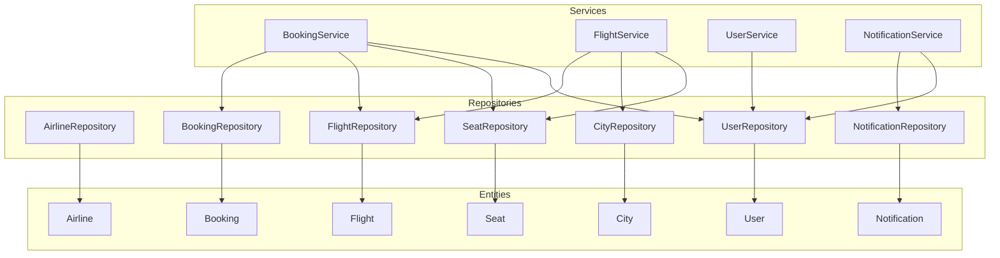
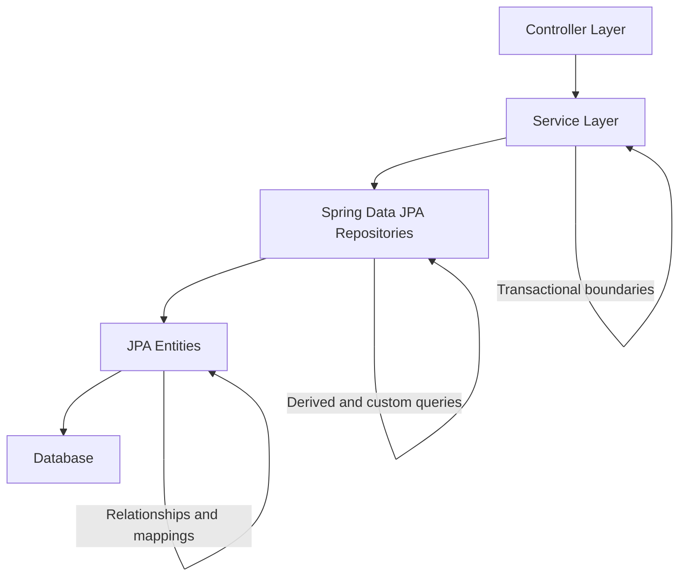
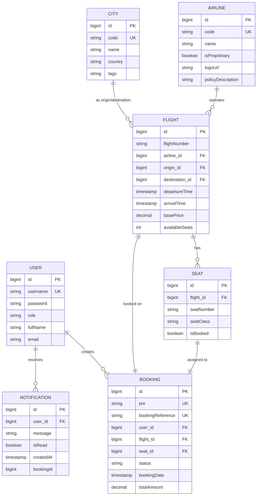
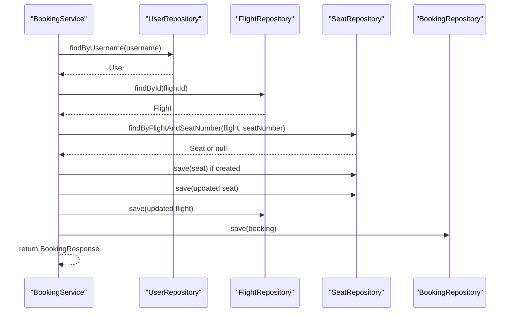
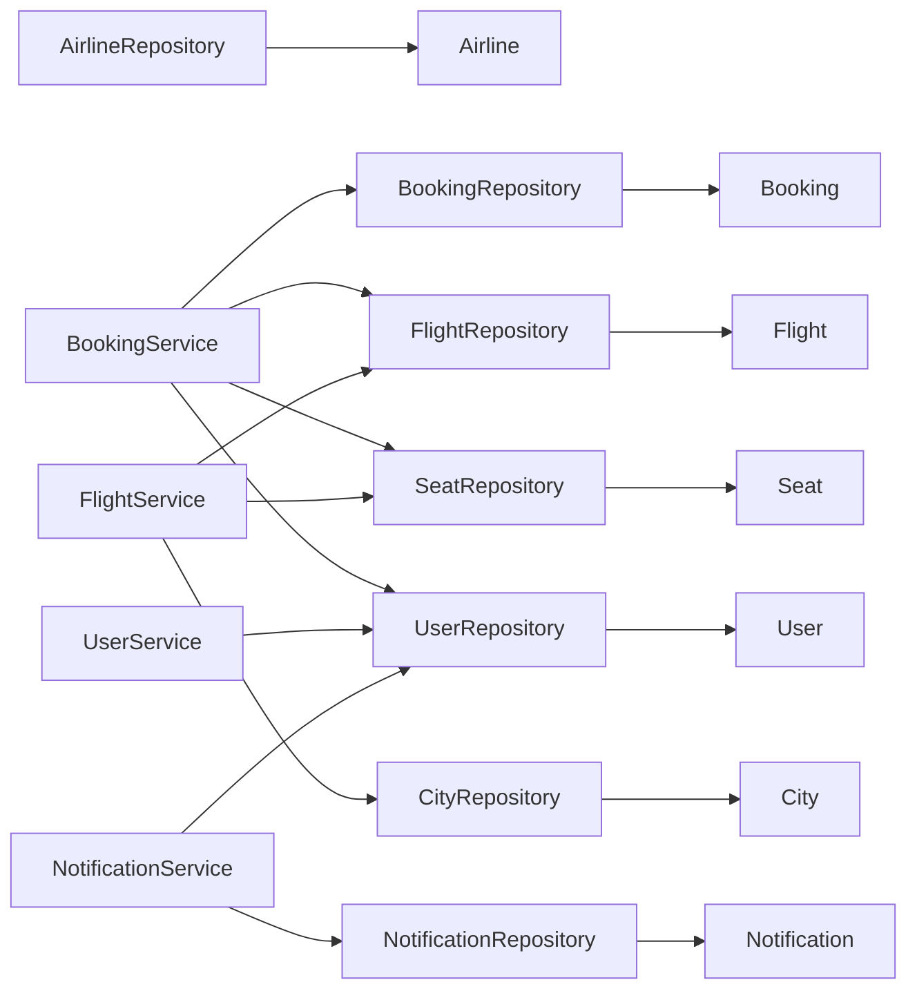

# Data Access Layer & Repositories

<cite>
**Referenced Files in This Document**
- [AirlineRepository.java](file://backend-server/src/main/java/com/skyflow/repository/AirlineRepository.java)
- [BookingRepository.java](file://backend-server/src/main/java/com/skyflow/repository/BookingRepository.java)
- [CityRepository.java](file://backend-server/src/main/java/com/skyflow/repository/CityRepository.java)
- [FlightRepository.java](file://backend-server/src/main/java/com/skyflow/repository/FlightRepository.java)
- [NotificationRepository.java](file://backend-server/src/main/java/com/skyflow/repository/NotificationRepository.java)
- [SeatRepository.java](file://backend-server/src/main/java/com/skyflow/repository/SeatRepository.java)
- [UserRepository.java](file://backend-server/src/main/java/com/skyflow/repository/UserRepository.java)
- [Airline.java](file://backend-server/src/main/java/com/skyflow/model/entity/Airline.java)
- [Booking.java](file://backend-server/src/main/java/com/skyflow/model/entity/Booking.java)
- [City.java](file://backend-server/src/main/java/com/skyflow/model/entity/City.java)
- [Flight.java](file://backend-server/src/main/java/com/skyflow/model/entity/Flight.java)
- [Notification.java](file://backend-server/src/main/java/com/skyflow/model/entity/Notification.java)
- [Seat.java](file://backend-server/src/main/java/com/skyflow/model/entity/Seat.java)
- [User.java](file://backend-server/src/main/java/com/skyflow/model/entity/User.java)
- [BookingService.java](file://backend-server/src/main/java/com/skyflow/service/BookingService.java)
- [FlightService.java](file://backend-server/src/main/java/com/skyflow/service/FlightService.java)
- [UserService.java](file://backend-server/src/main/java/com/skyflow/service/UserService.java)
- [NotificationService.java](file://backend-server/src/main/java/com/skyflow/service/NotificationService.java)
- [application.yml](file://backend-server/src/main/resources/application.yml)
</cite>

## Table of Contents
1. [Introduction](#introduction)
2. [Project Structure](#project-structure)
3. [Core Components](#core-components)
4. [Architecture Overview](#architecture-overview)
5. [Detailed Component Analysis](#detailed-component-analysis)
6. [Dependency Analysis](#dependency-analysis)
7. [Performance Considerations](#performance-considerations)
8. [Troubleshooting Guide](#troubleshooting-guide)
9. [Conclusion](#conclusion)
10. [Appendices](#appendices)

## Introduction
This document explains the data access layer and repository pattern implementation for the airline reservation system. It covers Spring Data JPA repositories for each domain entity, query method patterns, custom JPQL queries, and integration with JPA entities and their relationships. It also documents transaction management, connection pooling, performance optimization techniques, repository-to-service integration patterns, lazy-loading considerations, bulk operation strategies, and database migration approaches.

## Project Structure
The data access layer is organized around Spring Data JPA repositories under the package com.skyflow.repository and JPA entities under com.skyflow.model.entity. Services orchestrate repository usage and define transaction boundaries.

**Diagram sources**
- [AirlineRepository.java:1-10](file://backend-server/src/main/java/com/skyflow/repository/AirlineRepository.java#L1-L10)
- [BookingRepository.java:1-14](file://backend-server/src/main/java/com/skyflow/repository/BookingRepository.java#L1-L14)
- [CityRepository.java:1-13](file://backend-server/src/main/java/com/skyflow/repository/CityRepository.java#L1-L13)
- [FlightRepository.java:1-22](file://backend-server/src/main/java/com/skyflow/repository/FlightRepository.java#L1-L22)
- [NotificationRepository.java:1-11](file://backend-server/src/main/java/com/skyflow/repository/NotificationRepository.java#L1-L11)
- [SeatRepository.java:1-25](file://backend-server/src/main/java/com/skyflow/repository/SeatRepository.java#L1-L25)
- [UserRepository.java:1-12](file://backend-server/src/main/java/com/skyflow/repository/UserRepository.java#L1-L12)
- [Airline.java:1-29](file://backend-server/src/main/java/com/skyflow/model/entity/Airline.java#L1-L29)
- [Booking.java:1-42](file://backend-server/src/main/java/com/skyflow/model/entity/Booking.java#L1-L42)
- [City.java:1-26](file://backend-server/src/main/java/com/skyflow/model/entity/City.java#L1-L26)
- [Flight.java:1-43](file://backend-server/src/main/java/com/skyflow/model/entity/Flight.java#L1-L43)
- [Notification.java:1-31](file://backend-server/src/main/java/com/skyflow/model/entity/Notification.java#L1-L31)
- [Seat.java:1-30](file://backend-server/src/main/java/com/skyflow/model/entity/Seat.java#L1-L30)
- [User.java:1-31](file://backend-server/src/main/java/com/skyflow/model/entity/User.java#L1-L31)
- [BookingService.java:1-148](file://backend-server/src/main/java/com/skyflow/service/BookingService.java#L1-L148)
- [FlightService.java:1-206](file://backend-server/src/main/java/com/skyflow/service/FlightService.java#L1-L206)
- [UserService.java:1-42](file://backend-server/src/main/java/com/skyflow/service/UserService.java#L1-L42)
- [NotificationService.java:1-35](file://backend-server/src/main/java/com/skyflow/service/NotificationService.java#L1-L35)

**Section sources**
- [AirlineRepository.java:1-10](file://backend-server/src/main/java/com/skyflow/repository/AirlineRepository.java#L1-L10)
- [BookingRepository.java:1-14](file://backend-server/src/main/java/com/skyflow/repository/BookingRepository.java#L1-L14)
- [CityRepository.java:1-13](file://backend-server/src/main/java/com/skyflow/repository/CityRepository.java#L1-L13)
- [FlightRepository.java:1-22](file://backend-server/src/main/java/com/skyflow/repository/FlightRepository.java#L1-L22)
- [NotificationRepository.java:1-11](file://backend-server/src/main/java/com/skyflow/repository/NotificationRepository.java#L1-L11)
- [SeatRepository.java:1-25](file://backend-server/src/main/java/com/skyflow/repository/SeatRepository.java#L1-L25)
- [UserRepository.java:1-12](file://backend-server/src/main/java/com/skyflow/repository/UserRepository.java#L1-L12)
- [Airline.java:1-29](file://backend-server/src/main/java/com/skyflow/model/entity/Airline.java#L1-L29)
- [Booking.java:1-42](file://backend-server/src/main/java/com/skyflow/model/entity/Booking.java#L1-L42)
- [City.java:1-26](file://backend-server/src/main/java/com/skyflow/model/entity/City.java#L1-L26)
- [Flight.java:1-43](file://backend-server/src/main/java/com/skyflow/model/entity/Flight.java#L1-L43)
- [Notification.java:1-31](file://backend-server/src/main/java/com/skyflow/model/entity/Notification.java#L1-L31)
- [Seat.java:1-30](file://backend-server/src/main/java/com/skyflow/model/entity/Seat.java#L1-L30)
- [User.java:1-31](file://backend-server/src/main/java/com/skyflow/model/entity/User.java#L1-L31)
- [BookingService.java:1-148](file://backend-server/src/main/java/com/skyflow/service/BookingService.java#L1-L148)
- [FlightService.java:1-206](file://backend-server/src/main/java/com/skyflow/service/FlightService.java#L1-L206)
- [UserService.java:1-42](file://backend-server/src/main/java/com/skyflow/service/UserService.java#L1-L42)
- [NotificationService.java:1-35](file://backend-server/src/main/java/com/skyflow/service/NotificationService.java#L1-L35)

## Core Components
This section summarizes each repository interface and its primary query patterns, linking them to the corresponding JPA entities and service usage.

- AirlineRepository
  - Extends JpaRepository for Airline entity.
  - Declares a derived query to find an airline by its unique code.
  - Typical usage: lookup by code during flight creation or seat assignment.
  - Section sources
    - [AirlineRepository.java:1-10](file://backend-server/src/main/java/com/skyflow/repository/AirlineRepository.java#L1-L10)
    - [Airline.java:1-29](file://backend-server/src/main/java/com/skyflow/model/entity/Airline.java#L1-L29)

- BookingRepository
  - Extends JpaRepository for Booking entity.
  - Derived query to fetch bookings by a User entity.
  - Derived query to fetch a booking by its unique PNR.
  - Typical usage: retrieving user’s bookings and confirming bookings by PNR.
  - Section sources
    - [BookingRepository.java:1-14](file://backend-server/src/main/java/com/skyflow/repository/BookingRepository.java#L1-L14)
    - [Booking.java:1-42](file://backend-server/src/main/java/com/skyflow/model/entity/Booking.java#L1-L42)
    - [BookingService.java:100-105](file://backend-server/src/main/java/com/skyflow/service/BookingService.java#L100-L105)

- CityRepository
  - Extends JpaRepository for City entity.
  - Derived query to find a city by its unique code.
  - Derived query to filter cities by a tag contained in a comma-separated tags field.
  - Typical usage: origin/destination resolution and city tagging for search.
  - Section sources
    - [CityRepository.java:1-13](file://backend-server/src/main/java/com/skyflow/repository/CityRepository.java#L1-L13)
    - [City.java:1-26](file://backend-server/src/main/java/com/skyflow/model/entity/City.java#L1-L26)
    - [FlightService.java:68-102](file://backend-server/src/main/java/com/skyflow/service/FlightService.java#L68-L102)

- FlightRepository
  - Extends JpaRepository for Flight entity.
  - Custom JPQL query to find flights by origin, destination, and departure window.
  - Derived query to find flights by origin and destination City entities.
  - Typical usage: flight search and availability checks.
  - Section sources
    - [FlightRepository.java:1-22](file://backend-server/src/main/java/com/skyflow/repository/FlightRepository.java#L1-L22)
    - [Flight.java:1-43](file://backend-server/src/main/java/com/skyflow/model/entity/Flight.java#L1-L43)
    - [FlightService.java:68-102](file://backend-server/src/main/java/com/skyflow/service/FlightService.java#L68-L102)

- NotificationRepository
  - Extends JpaRepository for Notification entity.
  - Derived query to fetch notifications for a user ordered by creation time descending.
  - Typical usage: retrieving recent notifications per user.
  - Section sources
    - [NotificationRepository.java:1-11](file://backend-server/src/main/java/com/skyflow/repository/NotificationRepository.java#L1-L11)
    - [Notification.java:1-31](file://backend-server/src/main/java/com/skyflow/model/entity/Notification.java#L1-L31)
    - [NotificationService.java:21-25](file://backend-server/src/main/java/com/skyflow/service/NotificationService.java#L21-L25)

- SeatRepository
  - Extends JpaRepository for Seat entity.
  - Pessimistic write lock via @Lock on a custom JPQL query to select a seat by ID.
  - Derived query to find a seat by flight and seat number.
  - Custom JPQL to count booked seats by flight.
  - Derived query to list seats by flight and booked flag.
  - Typical usage: seat locking during booking, counting occupied seats, and seat availability checks.
  - Section sources
    - [SeatRepository.java:1-25](file://backend-server/src/main/java/com/skyflow/repository/SeatRepository.java#L1-L25)
    - [Seat.java:1-30](file://backend-server/src/main/java/com/skyflow/model/entity/Seat.java#L1-L30)
    - [BookingService.java:44-98](file://backend-server/src/main/java/com/skyflow/service/BookingService.java#L44-L98)
    - [FlightService.java:146-149](file://backend-server/src/main/java/com/skyflow/service/FlightService.java#L146-L149)

- UserRepository
  - Extends JpaRepository for User entity.
  - Derived queries to find a user by username and check username existence.
  - Typical usage: authentication, user lookup, and existence checks.
  - Section sources
    - [UserRepository.java:1-12](file://backend-server/src/main/java/com/skyflow/repository/UserRepository.java#L1-L12)
    - [User.java:1-31](file://backend-server/src/main/java/com/skyflow/model/entity/User.java#L1-L31)
    - [UserService.java:19-36](file://backend-server/src/main/java/com/skyflow/service/UserService.java#L19-L36)

## Architecture Overview
The data access layer follows the repository pattern with Spring Data JPA. Entities define JPA mappings and relationships. Services coordinate repository calls and define transactional boundaries. Controllers depend on services, not repositories directly.

[No sources needed since this diagram shows conceptual workflow, not actual code structure]

## Detailed Component Analysis

### Entity Relationship Model
The JPA entities model the core domain with clear relationships and constraints.

**Diagram sources**
- [User.java:1-31](file://backend-server/src/main/java/com/skyflow/model/entity/User.java#L1-L31)
- [Airline.java:1-29](file://backend-server/src/main/java/com/skyflow/model/entity/Airline.java#L1-L29)
- [City.java:1-26](file://backend-server/src/main/java/com/skyflow/model/entity/City.java#L1-L26)
- [Flight.java:1-43](file://backend-server/src/main/java/com/skyflow/model/entity/Flight.java#L1-L43)
- [Seat.java:1-30](file://backend-server/src/main/java/com/skyflow/model/entity/Seat.java#L1-L30)
- [Booking.java:1-42](file://backend-server/src/main/java/com/skyflow/model/entity/Booking.java#L1-L42)
- [Notification.java:1-31](file://backend-server/src/main/java/com/skyflow/model/entity/Notification.java#L1-L31)

**Section sources**
- [User.java:1-31](file://backend-server/src/main/java/com/skyflow/model/entity/User.java#L1-L31)
- [Airline.java:1-29](file://backend-server/src/main/java/com/skyflow/model/entity/Airline.java#L1-L29)
- [City.java:1-26](file://backend-server/src/main/java/com/skyflow/model/entity/City.java#L1-L26)
- [Flight.java:1-43](file://backend-server/src/main/java/com/skyflow/model/entity/Flight.java#L1-L43)
- [Seat.java:1-30](file://backend-server/src/main/java/com/skyflow/model/entity/Seat.java#L1-L30)
- [Booking.java:1-42](file://backend-server/src/main/java/com/skyflow/model/entity/Booking.java#L1-L42)
- [Notification.java:1-31](file://backend-server/src/main/java/com/skyflow/model/entity/Notification.java#L1-L31)

### Repository Patterns and Query Methods
- Derived Queries
  - findByX(...): Spring Data JPA generates SQL based on method names. Examples:
    - AirlineRepository: findByCode
    - BookingRepository: findByUser
    - CityRepository: findByCode, findByTagsContaining
    - FlightRepository: findByOriginAndDestination
    - NotificationRepository: findByUserOrderByCreatedAtDesc
    - SeatRepository: findByFlightAndSeatNumber, findByFlightAndIsBooked
    - UserRepository: findByUsername, existsByUsername
  - These methods leverage entity relationships and column annotations for efficient lookups.

- Custom JPQL Queries
  - FlightRepository.findFlights: custom query filters by origin, destination, and departure time range.
  - SeatRepository.findByIdWithLock: pessimistic write lock for safe concurrent updates.
  - SeatRepository.countBookedSeatsByFlight: aggregation query to compute occupancy.

- Query Method Semantics
  - Derived queries return single entities or collections; optional variants return Optional for safer null handling.
  - Custom queries use @Param for named parameters and are optimized for specific filtering and ordering needs.

**Section sources**
- [AirlineRepository.java:1-10](file://backend-server/src/main/java/com/skyflow/repository/AirlineRepository.java#L1-L10)
- [BookingRepository.java:1-14](file://backend-server/src/main/java/com/skyflow/repository/BookingRepository.java#L1-L14)
- [CityRepository.java:1-13](file://backend-server/src/main/java/com/skyflow/repository/CityRepository.java#L1-L13)
- [FlightRepository.java:1-22](file://backend-server/src/main/java/com/skyflow/repository/FlightRepository.java#L1-L22)
- [NotificationRepository.java:1-11](file://backend-server/src/main/java/com/skyflow/repository/NotificationRepository.java#L1-L11)
- [SeatRepository.java:1-25](file://backend-server/src/main/java/com/skyflow/repository/SeatRepository.java#L1-L25)
- [UserRepository.java:1-12](file://backend-server/src/main/java/com/skyflow/repository/UserRepository.java#L1-L12)

### Transaction Management and Service Integration
- Transactional Boundaries
  - BookingService.createBooking and BookingService.cancelBooking are annotated with @Transactional to ensure atomicity across seat updates, flight availability adjustments, booking persistence, and notifications.
  - UserService.loadUserByUsername is annotated with @Transactional to ensure consistent retrieval of user details for authentication.

- Repository-to-Service Integration Patterns
  - Services inject repositories and compose multiple repository calls to implement business logic.
  - Example patterns:
    - Lookup entities by derived queries, validate state, update entities, and persist changes atomically.
    - Use custom queries for performance-sensitive operations (e.g., counting booked seats).

**Diagram sources**
- [BookingService.java:44-98](file://backend-server/src/main/java/com/skyflow/service/BookingService.java#L44-L98)
- [UserRepository.java:1-12](file://backend-server/src/main/java/com/skyflow/repository/UserRepository.java#L1-L12)
- [FlightRepository.java:1-22](file://backend-server/src/main/java/com/skyflow/repository/FlightRepository.java#L1-L22)
- [SeatRepository.java:1-25](file://backend-server/src/main/java/com/skyflow/repository/SeatRepository.java#L1-L25)
- [BookingRepository.java:1-14](file://backend-server/src/main/java/com/skyflow/repository/BookingRepository.java#L1-L14)

**Section sources**
- [BookingService.java:43-98](file://backend-server/src/main/java/com/skyflow/service/BookingService.java#L43-L98)
- [UserService.java:19-27](file://backend-server/src/main/java/com/skyflow/service/UserService.java#L19-L27)

### Lazy Loading Considerations
- Entity relationships are mapped with JPA annotations (@ManyToOne, @OneToOne). Lazy loading is the default for associations, reducing initial fetch overhead.
- Services often traverse relationships (e.g., booking.user, booking.flight.airline) to construct DTOs. This can trigger N+1 or lazy initialization risks if not handled carefully.
- Recommendations:
  - Use DTO projections or JOIN FETCH in repositories for frequently accessed relationship data.
  - Avoid accessing lazy collections outside of service/transaction boundaries.
  - Consider @Transactional boundaries around data transfer to avoid lazy loading exceptions.

[No sources needed since this section provides general guidance]

### Bulk Operations and Performance Optimization
- Counting Booked Seats
  - SeatRepository.countBookedSeatsByFlight uses a JPQL aggregation to efficiently compute occupancy without loading rows.
- Seat Locking
  - SeatRepository.findByIdWithLock applies a pessimistic write lock to prevent race conditions during concurrent seat selection.
- Derived Queries
  - Using repository-derived methods reduces SQL boilerplate and leverages Spring Data optimizations.
- Indexing and Constraints
  - Unique constraints on (flight_id, seatNumber) and unique columns (code, username, pnr, bookingReference) improve lookup performance and enforce integrity.
- Query Planning
  - Prefer custom JPQL for complex filters (time windows, aggregations) and derived queries for straightforward lookups.

**Section sources**
- [SeatRepository.java:14-21](file://backend-server/src/main/java/com/skyflow/repository/SeatRepository.java#L14-L21)
- [Seat.java:10-12](file://backend-server/src/main/java/com/skyflow/model/entity/Seat.java#L10-L12)

### Database Transactions, Connection Pooling, and Schema Evolution
- Transactions
  - Services define transactional boundaries for operations spanning multiple entities (e.g., seat locking, flight availability, booking creation).
- Connection Pooling
  - Connection pool configuration is typically managed via application.yml. Ensure appropriate pool sizing, timeouts, and validation settings for production workloads.
- Schema Evolution
  - Flyway or Liquibase are commonly used for database migrations. Define baseline migrations for existing tables and incremental scripts for schema changes.
  - Keep migrations backward-compatible where possible and add indices for frequent query predicates.

**Section sources**
- [BookingService.java:43-98](file://backend-server/src/main/java/com/skyflow/service/BookingService.java#L43-L98)
- [application.yml](file://backend-server/src/main/resources/application.yml)

## Dependency Analysis
Repositories depend on entities and are consumed by services. Services encapsulate business logic and coordinate multiple repositories.

**Diagram sources**
- [AirlineRepository.java:1-10](file://backend-server/src/main/java/com/skyflow/repository/AirlineRepository.java#L1-L10)
- [BookingRepository.java:1-14](file://backend-server/src/main/java/com/skyflow/repository/BookingRepository.java#L1-L14)
- [CityRepository.java:1-13](file://backend-server/src/main/java/com/skyflow/repository/CityRepository.java#L1-L13)
- [FlightRepository.java:1-22](file://backend-server/src/main/java/com/skyflow/repository/FlightRepository.java#L1-L22)
- [NotificationRepository.java:1-11](file://backend-server/src/main/java/com/skyflow/repository/NotificationRepository.java#L1-L11)
- [SeatRepository.java:1-25](file://backend-server/src/main/java/com/skyflow/repository/SeatRepository.java#L1-L25)
- [UserRepository.java:1-12](file://backend-server/src/main/java/com/skyflow/repository/UserRepository.java#L1-L12)
- [BookingService.java:1-148](file://backend-server/src/main/java/com/skyflow/service/BookingService.java#L1-L148)
- [FlightService.java:1-206](file://backend-server/src/main/java/com/skyflow/service/FlightService.java#L1-L206)
- [UserService.java:1-42](file://backend-server/src/main/java/com/skyflow/service/UserService.java#L1-L42)
- [NotificationService.java:1-35](file://backend-server/src/main/java/com/skyflow/service/NotificationService.java#L1-L35)

**Section sources**
- [BookingService.java:25-34](file://backend-server/src/main/java/com/skyflow/service/BookingService.java#L25-L34)
- [FlightService.java:23-28](file://backend-server/src/main/java/com/skyflow/service/FlightService.java#L23-L28)
- [UserService.java:16-17](file://backend-server/src/main/java/com/skyflow/service/UserService.java#L16-L17)
- [NotificationService.java:15-19](file://backend-server/src/main/java/com/skyflow/service/NotificationService.java#L15-L19)

## Performance Considerations
- Minimize round trips by composing repository calls within a single transactional boundary.
- Use custom JPQL for complex filters and aggregations; prefer derived queries for simple lookups.
- Apply pessimistic locks only when necessary (e.g., seat selection) to reduce contention.
- Add database indexes on frequently filtered columns (e.g., username, code, pnr, bookingReference).
- Avoid N+1 selects by eager fetching or batch loading related entities when constructing DTOs.
- Monitor slow queries and consider query hints or materialized views for reporting-like operations.

[No sources needed since this section provides general guidance]

## Troubleshooting Guide
- Common Issues
  - LazyInitializationException: Occurs when accessing lazy-loaded collections outside a transaction. Wrap data access in @Transactional or use DTO projections.
  - Concurrency on seat selection: Use SeatRepository.findByIdWithLock to prevent race conditions.
  - Missing indices: Slow lookups on username/code/pnr. Add appropriate indexes or unique constraints.
  - Transaction rollback: Ensure business validations occur before repository saves to fail fast.

- Debugging Tips
  - Enable SQL logging and query plan analysis in application.yml.
  - Verify repository method signatures match entity relationships.
  - Confirm transaction propagation and rollback rules for multi-entity updates.

**Section sources**
- [SeatRepository.java:14-16](file://backend-server/src/main/java/com/skyflow/repository/SeatRepository.java#L14-L16)
- [BookingService.java:44-62](file://backend-server/src/main/java/com/skyflow/service/BookingService.java#L44-L62)

## Conclusion
The data access layer leverages Spring Data JPA repositories to provide clean, maintainable persistence code. Derived and custom queries, combined with service-layer transactions, enable robust business operations such as flight search, seat locking, booking creation, and user management. Proper indexing, DTO projections, and cautious use of lazy loading ensure scalability and reliability. Migrations should accompany schema changes to keep the system consistent and performant.

## Appendices
- Appendix A: Repository-to-Entity Mapping Summary
  - AirlineRepository ↔ Airline
  - BookingRepository ↔ Booking
  - CityRepository ↔ City
  - FlightRepository ↔ Flight
  - NotificationRepository ↔ Notification
  - SeatRepository ↔ Seat
  - UserRepository ↔ User

- Appendix B: Service Integration Highlights
  - BookingService orchestrates user, flight, seat, and booking repositories for booking lifecycle.
  - FlightService coordinates city, flight, and seat repositories for search and pricing.
  - UserService integrates UserRepository for authentication.
  - NotificationService uses NotificationRepository and UserRepository for notifications.

**Section sources**
- [BookingService.java:25-34](file://backend-server/src/main/java/com/skyflow/service/BookingService.java#L25-L34)
- [FlightService.java:23-28](file://backend-server/src/main/java/com/skyflow/service/FlightService.java#L23-L28)
- [UserService.java:16-17](file://backend-server/src/main/java/com/skyflow/service/UserService.java#L16-L17)
- [NotificationService.java:15-19](file://backend-server/src/main/java/com/skyflow/service/NotificationService.java#L15-L19)