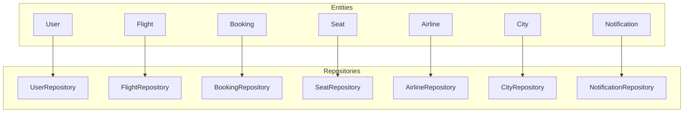
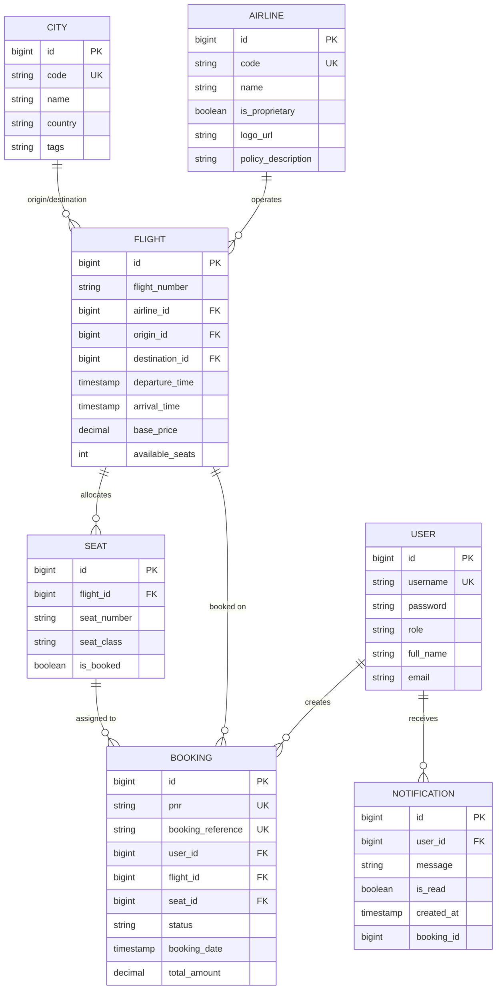
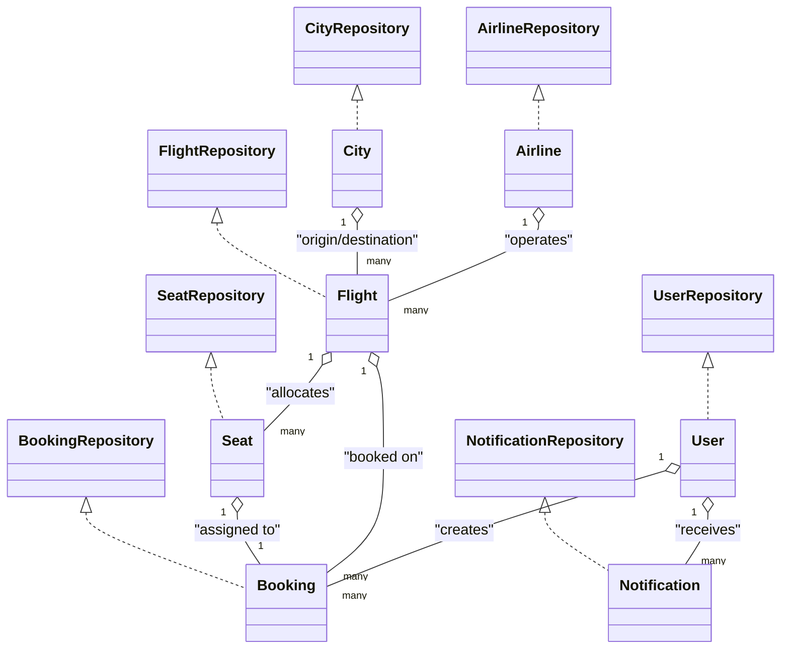

# Data Models & Entities

<cite>
**Referenced Files in This Document**
- [User.java](file://backend-server/src/main/java/com/skyflow/model/entity/User.java)
- [Flight.java](file://backend-server/src/main/java/com/skyflow/model/entity/Flight.java)
- [Booking.java](file://backend-server/src/main/java/com/skyflow/model/entity/Booking.java)
- [Seat.java](file://backend-server/src/main/java/com/skyflow/model/entity/Seat.java)
- [Airline.java](file://backend-server/src/main/java/com/skyflow/model/entity/Airline.java)
- [City.java](file://backend-server/src/main/java/com/skyflow/model/entity/City.java)
- [Notification.java](file://backend-server/src/main/java/com/skyflow/model/entity/Notification.java)
- [UserRepository.java](file://backend-server/src/main/java/com/skyflow/repository/UserRepository.java)
- [FlightRepository.java](file://backend-server/src/main/java/com/skyflow/repository/FlightRepository.java)
- [BookingRepository.java](file://backend-server/src/main/java/com/skyflow/repository/BookingRepository.java)
- [SeatRepository.java](file://backend-server/src/main/java/com/skyflow/repository/SeatRepository.java)
- [AirlineRepository.java](file://backend-server/src/main/java/com/skyflow/repository/AirlineRepository.java)
- [CityRepository.java](file://backend-server/src/main/java/com/skyflow/repository/CityRepository.java)
- [NotificationRepository.java](file://backend-server/src/main/java/com/skyflow/repository/NotificationRepository.java)
</cite>

## Table of Contents
1. [Introduction](#introduction)
2. [Project Structure](#project-structure)
3. [Core Components](#core-components)
4. [Architecture Overview](#architecture-overview)
5. [Detailed Component Analysis](#detailed-component-analysis)
6. [Dependency Analysis](#dependency-analysis)
7. [Performance Considerations](#performance-considerations)
8. [Troubleshooting Guide](#troubleshooting-guide)
9. [Conclusion](#conclusion)

## Introduction
This document provides comprehensive data model documentation for the JPA entities and database schema of the airline reservation system. It details each entity’s fields, JPA annotations, and relationships, and explains lifecycle, cascading operations, and bidirectional associations. It also covers database constraints, indexing strategies, performance considerations, validation and integrity rules, and audit trail implementation.

## Project Structure
The data model resides under the backend server module, with entities located in the entity package and repositories in the repository package. Repositories extend Spring Data JPA interfaces to provide CRUD and query capabilities.

**Diagram sources**
- [User.java:1-31](file://backend-server/src/main/java/com/skyflow/model/entity/User.java#L1-L31)
- [Flight.java:1-43](file://backend-server/src/main/java/com/skyflow/model/entity/Flight.java#L1-L43)
- [Booking.java:1-42](file://backend-server/src/main/java/com/skyflow/model/entity/Booking.java#L1-L42)
- [Seat.java:1-30](file://backend-server/src/main/java/com/skyflow/model/entity/Seat.java#L1-L30)
- [Airline.java:1-29](file://backend-server/src/main/java/com/skyflow/model/entity/Airline.java#L1-L29)
- [City.java:1-26](file://backend-server/src/main/java/com/skyflow/model/entity/City.java#L1-L26)
- [Notification.java:1-31](file://backend-server/src/main/java/com/skyflow/model/entity/Notification.java#L1-L31)
- [UserRepository.java:1-12](file://backend-server/src/main/java/com/skyflow/repository/UserRepository.java#L1-L12)
- [FlightRepository.java:1-22](file://backend-server/src/main/java/com/skyflow/repository/FlightRepository.java#L1-L22)
- [BookingRepository.java:1-14](file://backend-server/src/main/java/com/skyflow/repository/BookingRepository.java#L1-L14)
- [SeatRepository.java:1-25](file://backend-server/src/main/java/com/skyflow/repository/SeatRepository.java#L1-L25)
- [AirlineRepository.java:1-10](file://backend-server/src/main/java/com/skyflow/repository/AirlineRepository.java#L1-L10)
- [CityRepository.java:1-13](file://backend-server/src/main/java/com/skyflow/repository/CityRepository.java#L1-L13)
- [NotificationRepository.java:1-11](file://backend-server/src/main/java/com/skyflow/repository/NotificationRepository.java#L1-L11)

**Section sources**
- [User.java:1-31](file://backend-server/src/main/java/com/skyflow/model/entity/User.java#L1-L31)
- [Flight.java:1-43](file://backend-server/src/main/java/com/skyflow/model/entity/Flight.java#L1-L43)
- [Booking.java:1-42](file://backend-server/src/main/java/com/skyflow/model/entity/Booking.java#L1-L42)
- [Seat.java:1-30](file://backend-server/src/main/java/com/skyflow/model/entity/Seat.java#L1-L30)
- [Airline.java:1-29](file://backend-server/src/main/java/com/skyflow/model/entity/Airline.java#L1-L29)
- [City.java:1-26](file://backend-server/src/main/java/com/skyflow/model/entity/City.java#L1-L26)
- [Notification.java:1-31](file://backend-server/src/main/java/com/skyflow/model/entity/Notification.java#L1-L31)
- [UserRepository.java:1-12](file://backend-server/src/main/java/com/skyflow/repository/UserRepository.java#L1-L12)
- [FlightRepository.java:1-22](file://backend-server/src/main/java/com/skyflow/repository/FlightRepository.java#L1-L22)
- [BookingRepository.java:1-14](file://backend-server/src/main/java/com/skyflow/repository/BookingRepository.java#L1-L14)
- [SeatRepository.java:1-25](file://backend-server/src/main/java/com/skyflow/repository/SeatRepository.java#L1-L25)
- [AirlineRepository.java:1-10](file://backend-server/src/main/java/com/skyflow/repository/AirlineRepository.java#L1-L10)
- [CityRepository.java:1-13](file://backend-server/src/main/java/com/skyflow/repository/CityRepository.java#L1-L13)
- [NotificationRepository.java:1-11](file://backend-server/src/main/java/com/skyflow/repository/NotificationRepository.java#L1-L11)

## Core Components
This section summarizes each entity’s purpose, fields, and JPA annotations.

- User
  - Purpose: Authentication and profile storage for system users.
  - Key fields: identifier, username, password (BCrypt hashed), role, full name, email.
  - Annotations: @Entity, @Table, @Id, @GeneratedValue, @Column constraints.
  - Constraints: username uniqueness and non-nullability; role and password non-null; optional profile fields.

- Flight
  - Purpose: Stores flight metadata and scheduling.
  - Key fields: flight number, airline, origin city, destination city, departure/arrival timestamps, base price, available seats.
  - Annotations: @Entity, @Table, @Id, @GeneratedValue, @ManyToOne for airline and cities.
  - Constraints: origin, destination, departure/arrival, base price, and available seats non-null.

- Booking
  - Purpose: Manages reservations with passenger, flight, and seat linkage.
  - Key fields: PNR, booking reference, user, flight, seat, status, booking date, total amount.
  - Annotations: @Entity, @Table, @Id, @GeneratedValue, @ManyToOne to user and flight, @OneToOne to seat.
  - Constraints: PNR and booking reference unique; user, flight, seat, status, booking date non-null.

- Seat
  - Purpose: Tracks seat allocation per flight.
  - Key fields: seat number, seat class, booking flag, flight linkage.
  - Annotations: @Entity, @Table with unique constraint on (flight_id, seatNumber), @Id, @GeneratedValue, @ManyToOne.
  - Constraints: seatNumber and seatClass non-null; unique combination per flight; isBooked flag.

- Airline
  - Purpose: Stores airline metadata.
  - Key fields: code (unique), name, proprietary flag, logo URL, policy description.
  - Annotations: @Entity, @Table, @Id, @GeneratedValue, @Column constraints.
  - Constraints: code and name non-null; code unique; policy description length constrained.

- City
  - Purpose: Geographic location data.
  - Key fields: code (unique), name, country, tags.
  - Annotations: @Entity, @Table, @Id, @GeneratedValue, @Column constraints.
  - Constraints: code and name non-null; code unique; tags as comma-separated values.

- Notification
  - Purpose: Alert and communication management linked to users.
  - Key fields: user, message, read flag, creation timestamp, optional booking reference.
  - Annotations: @Entity, @Table, @Id, @GeneratedValue, @ManyToOne, @Column defaults.
  - Constraints: message non-null; default isRead=false and createdAt now; optional bookingId.

**Section sources**
- [User.java:1-31](file://backend-server/src/main/java/com/skyflow/model/entity/User.java#L1-L31)
- [Flight.java:1-43](file://backend-server/src/main/java/com/skyflow/model/entity/Flight.java#L1-L43)
- [Booking.java:1-42](file://backend-server/src/main/java/com/skyflow/model/entity/Booking.java#L1-L42)
- [Seat.java:1-30](file://backend-server/src/main/java/com/skyflow/model/entity/Seat.java#L1-L30)
- [Airline.java:1-29](file://backend-server/src/main/java/com/skyflow/model/entity/Airline.java#L1-L29)
- [City.java:1-26](file://backend-server/src/main/java/com/skyflow/model/entity/City.java#L1-L26)
- [Notification.java:1-31](file://backend-server/src/main/java/com/skyflow/model/entity/Notification.java#L1-L31)

## Architecture Overview
The entities form a normalized relational schema with foreign keys and referential integrity enforced via JPA annotations. Repositories provide typed queries and locking mechanisms for concurrency-sensitive operations.

**Diagram sources**
- [Airline.java:1-29](file://backend-server/src/main/java/com/skyflow/model/entity/Airline.java#L1-L29)
- [City.java:1-26](file://backend-server/src/main/java/com/skyflow/model/entity/City.java#L1-L26)
- [Flight.java:1-43](file://backend-server/src/main/java/com/skyflow/model/entity/Flight.java#L1-L43)
- [Seat.java:1-30](file://backend-server/src/main/java/com/skyflow/model/entity/Seat.java#L1-L30)
- [User.java:1-31](file://backend-server/src/main/java/com/skyflow/model/entity/User.java#L1-L31)
- [Booking.java:1-42](file://backend-server/src/main/java/com/skyflow/model/entity/Booking.java#L1-L42)
- [Notification.java:1-31](file://backend-server/src/main/java/com/skyflow/model/entity/Notification.java#L1-L31)

## Detailed Component Analysis

### User Entity
- Fields and annotations:
  - Identifier with auto-increment.
  - Username (unique, non-null), password (non-null), role (non-null), full name, email.
  - JSON ignore for sensitive field.
- Lifecycle and cascading:
  - No explicit cascade on owned collections; deletion requires prior cleanup of dependent records.
- Bidirectional relationships:
  - One-to-many with Booking and Notification via join columns.
- Integrity and validation:
  - Unique username enforced at DB level; role and password constraints enforced at persistence layer.
- Audit and timestamps:
  - No audit fields present; consider adding created/updated timestamps if needed.

**Section sources**
- [User.java:1-31](file://backend-server/src/main/java/com/skyflow/model/entity/User.java#L1-L31)
- [Booking.java:23-25](file://backend-server/src/main/java/com/skyflow/model/entity/Booking.java#L23-L25)
- [Notification.java:17-19](file://backend-server/src/main/java/com/skyflow/model/entity/Notification.java#L17-L19)

### Flight Entity
- Fields and annotations:
  - Identifier with auto-increment.
  - Flight number, airline, origin, destination, departure/arrival, base price, available seats.
  - Many-to-one relationships to Airline and City.
- Lifecycle and cascading:
  - No cascade; deleting an airline or city may require pre-cleanup to avoid referential integrity errors.
- Bidirectional relationships:
  - One-to-many with Seat and Booking via join columns.
- Integrity and validation:
  - Non-null constraints on scheduling and pricing; availability tracked at entity level.
- Audit and timestamps:
  - No audit fields present.

**Section sources**
- [Flight.java:1-43](file://backend-server/src/main/java/com/skyflow/model/entity/Flight.java#L1-L43)
- [Seat.java:18-20](file://backend-server/src/main/java/com/skyflow/model/entity/Seat.java#L18-L20)
- [Booking.java:27-29](file://backend-server/src/main/java/com/skyflow/model/entity/Booking.java#L27-L29)

### Booking Entity
- Fields and annotations:
  - Identifier with auto-increment.
  - PNR (unique, non-null), booking reference (unique), user, flight, seat, status, booking date, total amount.
  - Many-to-one to User and Flight; one-to-one to Seat.
- Lifecycle and cascading:
  - No cascade; seat unallocation and user/flight cleanup must be handled by application logic.
- Bidirectional relationships:
  - One-to-many with Notification via optional bookingId linkage.
- Integrity and validation:
  - Unique PNR and booking reference; status and booking date non-null; total amount stored for audit.
- Audit and timestamps:
  - Booking date recorded; consider adding created/updated timestamps.

**Section sources**
- [Booking.java:1-42](file://backend-server/src/main/java/com/skyflow/model/entity/Booking.java#L1-L42)
- [Notification.java:28-30](file://backend-server/src/main/java/com/skyflow/model/entity/Notification.java#L28-L30)

### Seat Entity
- Fields and annotations:
  - Identifier with auto-increment.
  - Flight, seat number, seat class, booking flag.
  - Unique constraint on (flight_id, seatNumber).
- Lifecycle and cascading:
  - No cascade; seat removal requires application-level deactivation of bookings.
- Bidirectional relationships:
  - Many-to-one with Flight; one-to-one with Booking.
- Integrity and validation:
  - Unique seat per flight enforced; seat class and number non-null; isBooked flag tracks allocation.
- Audit and timestamps:
  - No audit fields present.

**Section sources**
- [Seat.java:1-30](file://backend-server/src/main/java/com/skyflow/model/entity/Seat.java#L1-L30)
- [Booking.java:31-33](file://backend-server/src/main/java/com/skyflow/model/entity/Booking.java#L31-L33)

### Airline Entity
- Fields and annotations:
  - Identifier with auto-increment.
  - Code (unique, non-null), name (non-null), proprietary flag, logo URL, policy description (length-limited).
- Lifecycle and cascading:
  - No cascade; deletion requires pre-cleanup of dependent flights.
- Bidirectional relationships:
  - One-to-many with Flight.
- Integrity and validation:
  - Unique airline code; name non-null; policy description length constrained.
- Audit and timestamps:
  - No audit fields present.

**Section sources**
- [Airline.java:1-29](file://backend-server/src/main/java/com/skyflow/model/entity/Airline.java#L1-L29)
- [Flight.java:20-22](file://backend-server/src/main/java/com/skyflow/model/entity/Flight.java#L20-L22)

### City Entity
- Fields and annotations:
  - Identifier with auto-increment.
  - Code (unique, non-null), name (non-null), country, tags (comma-separated).
- Lifecycle and cascading:
  - No cascade; deletion requires pre-cleanup of dependent flights.
- Bidirectional relationships:
  - One-to-many with Flight for origin and destination.
- Integrity and validation:
  - Unique city code; name non-null; tags stored as delimited string.
- Audit and timestamps:
  - No audit fields present.

**Section sources**
- [City.java:1-26](file://backend-server/src/main/java/com/skyflow/model/entity/City.java#L1-L26)
- [Flight.java:24-30](file://backend-server/src/main/java/com/skyflow/model/entity/Flight.java#L24-L30)

### Notification Entity
- Fields and annotations:
  - Identifier with auto-increment.
  - User, message (non-null), read flag (default false), created timestamp (default now), optional bookingId.
  - Many-to-one to User.
- Lifecycle and cascading:
  - No cascade; deletion requires application-level cleanup if needed.
- Bidirectional relationships:
  - One-to-many with User via join column.
- Integrity and validation:
  - Message non-null; defaults applied for read and creation timestamp; optional booking linkage.
- Audit and timestamps:
  - Created timestamp recorded; consider adding updated timestamp.

**Section sources**
- [Notification.java:1-31](file://backend-server/src/main/java/com/skyflow/model/entity/Notification.java#L1-L31)
- [User.java:1-31](file://backend-server/src/main/java/com/skyflow/model/entity/User.java#L1-L31)

## Dependency Analysis
This section maps entity dependencies and repository interactions.

**Diagram sources**
- [User.java:1-31](file://backend-server/src/main/java/com/skyflow/model/entity/User.java#L1-L31)
- [Flight.java:1-43](file://backend-server/src/main/java/com/skyflow/model/entity/Flight.java#L1-L43)
- [Booking.java:1-42](file://backend-server/src/main/java/com/skyflow/model/entity/Booking.java#L1-L42)
- [Seat.java:1-30](file://backend-server/src/main/java/com/skyflow/model/entity/Seat.java#L1-L30)
- [Airline.java:1-29](file://backend-server/src/main/java/com/skyflow/model/entity/Airline.java#L1-L29)
- [City.java:1-26](file://backend-server/src/main/java/com/skyflow/model/entity/City.java#L1-L26)
- [Notification.java:1-31](file://backend-server/src/main/java/com/skyflow/model/entity/Notification.java#L1-L31)
- [UserRepository.java:1-12](file://backend-server/src/main/java/com/skyflow/repository/UserRepository.java#L1-L12)
- [FlightRepository.java:1-22](file://backend-server/src/main/java/com/skyflow/repository/FlightRepository.java#L1-L22)
- [BookingRepository.java:1-14](file://backend-server/src/main/java/com/skyflow/repository/BookingRepository.java#L1-L14)
- [SeatRepository.java:1-25](file://backend-server/src/main/java/com/skyflow/repository/SeatRepository.java#L1-L25)
- [AirlineRepository.java:1-10](file://backend-server/src/main/java/com/skyflow/repository/AirlineRepository.java#L1-L10)
- [CityRepository.java:1-13](file://backend-server/src/main/java/com/skyflow/repository/CityRepository.java#L1-L13)
- [NotificationRepository.java:1-11](file://backend-server/src/main/java/com/skyflow/repository/NotificationRepository.java#L1-L11)

**Section sources**
- [User.java:1-31](file://backend-server/src/main/java/com/skyflow/model/entity/User.java#L1-L31)
- [Flight.java:1-43](file://backend-server/src/main/java/com/skyflow/model/entity/Flight.java#L1-L43)
- [Booking.java:1-42](file://backend-server/src/main/java/com/skyflow/model/entity/Booking.java#L1-L42)
- [Seat.java:1-30](file://backend-server/src/main/java/com/skyflow/model/entity/Seat.java#L1-L30)
- [Airline.java:1-29](file://backend-server/src/main/java/com/skyflow/model/entity/Airline.java#L1-L29)
- [City.java:1-26](file://backend-server/src/main/java/com/skyflow/model/entity/City.java#L1-L26)
- [Notification.java:1-31](file://backend-server/src/main/java/com/skyflow/model/entity/Notification.java#L1-L31)
- [UserRepository.java:1-12](file://backend-server/src/main/java/com/skyflow/repository/UserRepository.java#L1-L12)
- [FlightRepository.java:1-22](file://backend-server/src/main/java/com/skyflow/repository/FlightRepository.java#L1-L22)
- [BookingRepository.java:1-14](file://backend-server/src/main/java/com/skyflow/repository/BookingRepository.java#L1-L14)
- [SeatRepository.java:1-25](file://backend-server/src/main/java/com/skyflow/repository/SeatRepository.java#L1-L25)
- [AirlineRepository.java:1-10](file://backend-server/src/main/java/com/skyflow/repository/AirlineRepository.java#L1-L10)
- [CityRepository.java:1-13](file://backend-server/src/main/java/com/skyflow/repository/CityRepository.java#L1-L13)
- [NotificationRepository.java:1-11](file://backend-server/src/main/java/com/skyflow/repository/NotificationRepository.java#L1-L11)

## Performance Considerations
- Indexing strategies:
  - Unique indexes on usernames, airline codes, and city codes are implied by unique constraints.
  - Consider adding composite indexes for frequent joins: (airline_id), (origin_id), (destination_id), (flight_id, seatNumber), (user_id), (bookingId).
- Concurrency control:
  - Seat selection uses pessimistic locking to prevent race conditions during booking; ensure transactions are short-lived.
- Query optimization:
  - FlightRepository provides targeted queries for origin/destination/time windows; ensure appropriate indexes on City and timestamp columns.
- Cascading and deletes:
  - No cascades are defined; batch deletion requires careful ordering to avoid foreign key violations.
- Audit and logging:
  - Add created/updated timestamps to entities to support efficient audits and time-based queries.

[No sources needed since this section provides general guidance]

## Troubleshooting Guide
- Unique constraint violations:
  - Symptoms: Persistence exceptions on insert/update for username, airline code, city code, PNR, or booking reference.
  - Resolution: Validate uniqueness before persisting; handle exceptions and return meaningful error messages.
- Foreign key constraint failures:
  - Symptoms: Exceptions when creating Flight, Booking, or Seat without valid related entities.
  - Resolution: Ensure parent entities exist; verify join column values match existing identifiers.
- Seat allocation conflicts:
  - Symptoms: Duplicate seat assignment attempts.
  - Resolution: Use SeatRepository lock method to serialize seat selection; wrap in transaction.
- Missing audit data:
  - Symptoms: Inability to track creation/modification times.
  - Resolution: Add created/updated timestamp fields to entities and set defaults in constructors or persistence callbacks.

**Section sources**
- [SeatRepository.java:14-16](file://backend-server/src/main/java/com/skyflow/repository/SeatRepository.java#L14-L16)
- [FlightRepository.java:14-18](file://backend-server/src/main/java/com/skyflow/repository/FlightRepository.java#L14-L18)
- [UserRepository.java:7-11](file://backend-server/src/main/java/com/skyflow/repository/UserRepository.java#L7-L11)
- [AirlineRepository.java:7-9](file://backend-server/src/main/java/com/skyflow/repository/AirlineRepository.java#L7-L9)
- [CityRepository.java:8-12](file://backend-server/src/main/java/com/skyflow/repository/CityRepository.java#L8-L12)
- [BookingRepository.java:9-13](file://backend-server/src/main/java/com/skyflow/repository/BookingRepository.java#L9-L13)
- [SeatRepository.java:18-24](file://backend-server/src/main/java/com/skyflow/repository/SeatRepository.java#L18-L24)

## Conclusion
The data model establishes a clear, normalized schema with strong referential integrity and targeted constraints. Entities are designed around core business concepts with explicit relationships and annotations. Performance can be further enhanced with strategic indexing and concurrency controls. Adding audit fields and cascading policies should be considered based on operational needs.