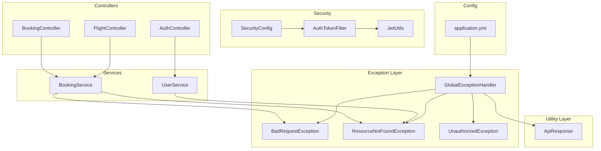
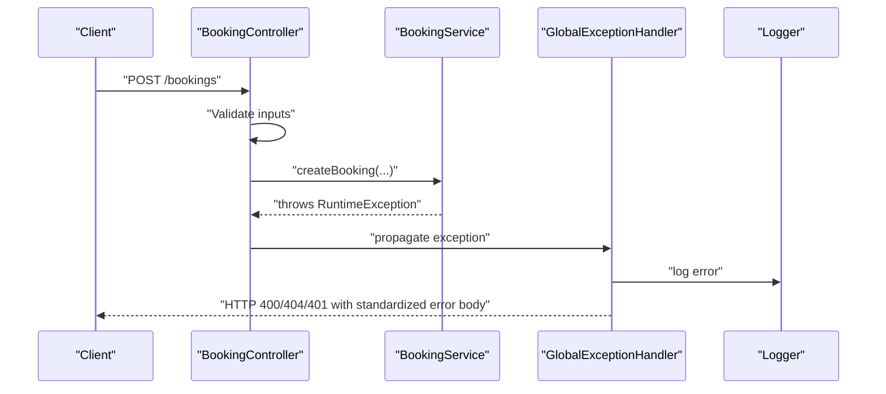
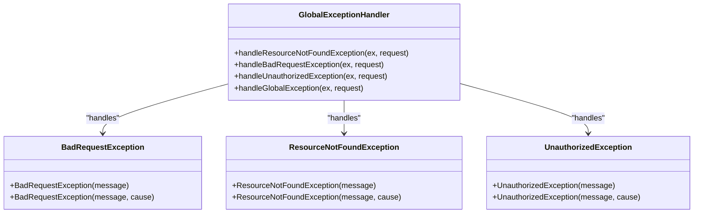
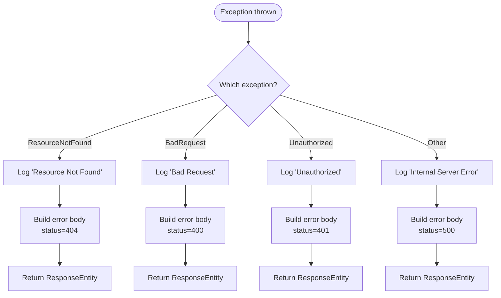
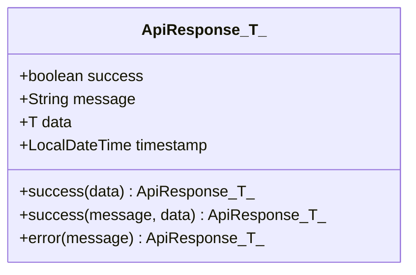
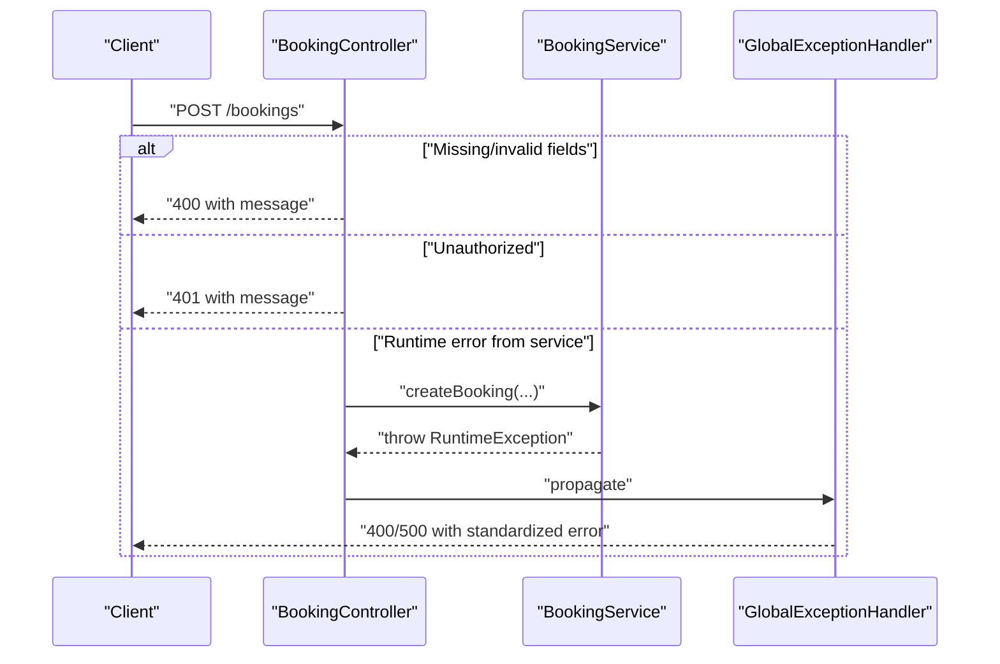
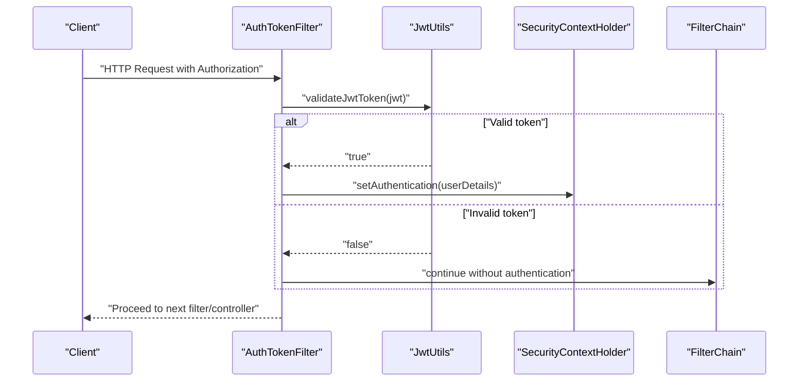
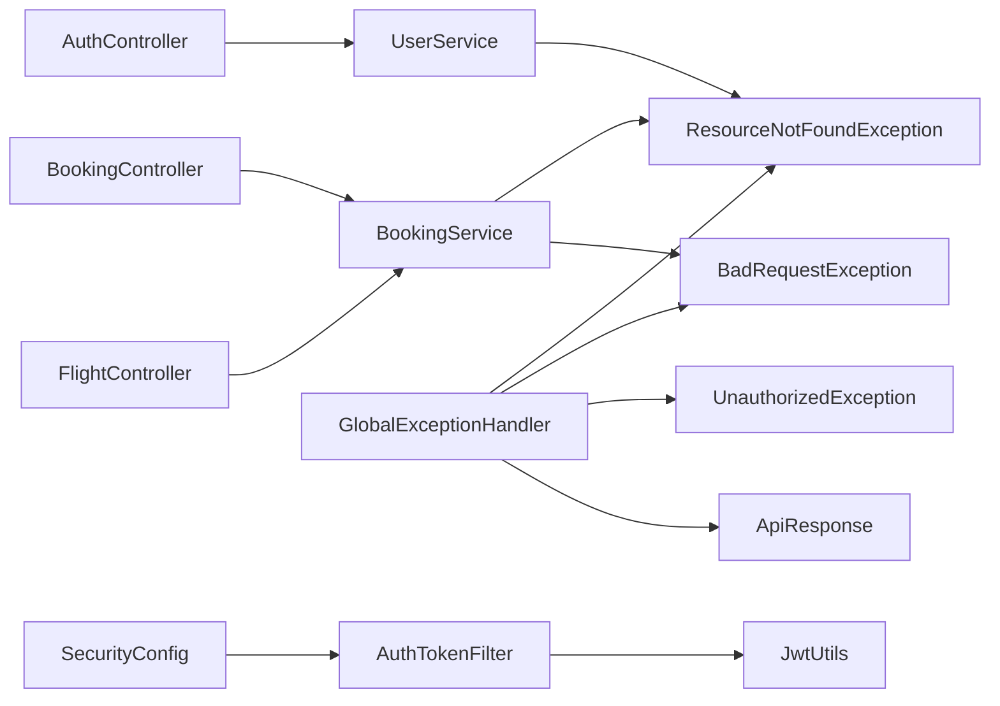

# Error Handling & Exception Management

<cite>
**Referenced Files in This Document**
- [BadRequestException.java](file://backend-server/src/main/java/com/skyflow/exception/BadRequestException.java)
- [ResourceNotFoundException.java](file://backend-server/src/main/java/com/skyflow/exception/ResourceNotFoundException.java)
- [UnauthorizedException.java](file://backend-server/src/main/java/com/skyflow/exception/UnauthorizedException.java)
- [GlobalExceptionHandler.java](file://backend-server/src/main/java/com/skyflow/exception/GlobalExceptionHandler.java)
- [ApiResponse.java](file://backend-server/src/main/java/com/skyflow/util/ApiResponse.java)
- [BookingService.java](file://backend-server/src/main/java/com/skyflow/service/BookingService.java)
- [UserService.java](file://backend-server/src/main/java/com/skyflow/service/UserService.java)
- [BookingController.java](file://backend-server/src/main/java/com/skyflow/controller/BookingController.java)
- [FlightController.java](file://backend-server/src/main/java/com/skyflow/controller/FlightController.java)
- [AuthController.java](file://backend-server/src/main/java/com/skyflow/controller/AuthController.java)
- [AuthTokenFilter.java](file://backend-server/src/main/java/com/skyflow/security/AuthTokenFilter.java)
- [JwtUtils.java](file://backend-server/src/main/java/com/skyflow/security/JwtUtils.java)
- [SecurityConfig.java](file://backend-server/src/main/java/com/skyflow/config/SecurityConfig.java)
- [application.yml](file://backend-server/src/main/resources/application.yml)
</cite>

## Table of Contents
1. [Introduction](#introduction)
2. [Project Structure](#project-structure)
3. [Core Components](#core-components)
4. [Architecture Overview](#architecture-overview)
5. [Detailed Component Analysis](#detailed-component-analysis)
6. [Dependency Analysis](#dependency-analysis)
7. [Performance Considerations](#performance-considerations)
8. [Troubleshooting Guide](#troubleshooting-guide)
9. [Conclusion](#conclusion)

## Introduction
This document explains the error handling and exception management strategy across the backend server. It covers custom exception classes for validation, resource-not-found, and unauthorized access, the centralized GlobalExceptionHandler for standardized HTTP responses, and the ApiResponse utility for consistent success/error payloads. It also documents exception propagation, logging, debugging approaches, integration with Spring’s exception handling mechanisms, and production monitoring considerations.

## Project Structure
The error handling system spans several packages:
- exception: custom exceptions and global exception handler
- util: shared response wrapper
- controller: endpoint handlers that may throw or return error responses
- service: business logic that throws runtime exceptions
- security: JWT parsing/filtering and security configuration
- resources: application configuration including logging levels

**Diagram sources**
- [GlobalExceptionHandler.java:1-55](file://backend-server/src/main/java/com/skyflow/exception/GlobalExceptionHandler.java#L1-L55)
- [BadRequestException.java:1-16](file://backend-server/src/main/java/com/skyflow/exception/BadRequestException.java#L1-L16)
- [ResourceNotFoundException.java:1-16](file://backend-server/src/main/java/com/skyflow/exception/ResourceNotFoundException.java#L1-L16)
- [UnauthorizedException.java:1-16](file://backend-server/src/main/java/com/skyflow/exception/UnauthorizedException.java#L1-L16)
- [ApiResponse.java:1-44](file://backend-server/src/main/java/com/skyflow/util/ApiResponse.java#L1-L44)
- [BookingController.java:1-89](file://backend-server/src/main/java/com/skyflow/controller/BookingController.java#L1-L89)
- [FlightController.java:1-50](file://backend-server/src/main/java/com/skyflow/controller/FlightController.java#L1-L50)
- [AuthController.java:1-58](file://backend-server/src/main/java/com/skyflow/controller/AuthController.java#L1-L58)
- [BookingService.java:1-148](file://backend-server/src/main/java/com/skyflow/service/BookingService.java#L1-L148)
- [UserService.java:1-42](file://backend-server/src/main/java/com/skyflow/service/UserService.java#L1-L42)
- [AuthTokenFilter.java:1-62](file://backend-server/src/main/java/com/skyflow/security/AuthTokenFilter.java#L1-L62)
- [JwtUtils.java:1-53](file://backend-server/src/main/java/com/skyflow/security/JwtUtils.java#L1-L53)
- [SecurityConfig.java:1-81](file://backend-server/src/main/java/com/skyflow/config/SecurityConfig.java#L1-L81)
- [application.yml:1-30](file://backend-server/src/main/resources/application.yml#L1-L30)

**Section sources**
- [GlobalExceptionHandler.java:1-55](file://backend-server/src/main/java/com/skyflow/exception/GlobalExceptionHandler.java#L1-L55)
- [application.yml:1-30](file://backend-server/src/main/resources/application.yml#L1-L30)

## Core Components
- Custom Exceptions
  - BadRequestException: marks invalid client requests; mapped to HTTP 400.
  - ResourceNotFoundException: marks missing resources; mapped to HTTP 404.
  - UnauthorizedException: marks authentication failures; mapped to HTTP 401.
- GlobalExceptionHandler: centralized exception handling with structured error responses and logging.
- ApiResponse: standardized success/error response envelope for successful endpoints.

These components work together to ensure consistent error semantics across the API and clear client-facing messages.

**Section sources**
- [BadRequestException.java:1-16](file://backend-server/src/main/java/com/skyflow/exception/BadRequestException.java#L1-L16)
- [ResourceNotFoundException.java:1-16](file://backend-server/src/main/java/com/skyflow/exception/ResourceNotFoundException.java#L1-L16)
- [UnauthorizedException.java:1-16](file://backend-server/src/main/java/com/skyflow/exception/UnauthorizedException.java#L1-L16)
- [GlobalExceptionHandler.java:1-55](file://backend-server/src/main/java/com/skyflow/exception/GlobalExceptionHandler.java#L1-L55)
- [ApiResponse.java:1-44](file://backend-server/src/main/java/com/skyflow/util/ApiResponse.java#L1-L44)

## Architecture Overview
The error handling architecture integrates Spring MVC exception handling with custom exceptions and a global advice. Controllers may throw runtime exceptions or return ResponseEntity bodies directly. Services throw runtime exceptions for business rule violations. GlobalExceptionHandler intercepts these exceptions and returns standardized JSON error responses. ApiResponse is used for success responses to maintain consistent envelopes.

**Diagram sources**
- [BookingController.java:21-70](file://backend-server/src/main/java/com/skyflow/controller/BookingController.java#L21-L70)
- [BookingService.java:44-98](file://backend-server/src/main/java/com/skyflow/service/BookingService.java#L44-L98)
- [GlobalExceptionHandler.java:20-42](file://backend-server/src/main/java/com/skyflow/exception/GlobalExceptionHandler.java#L20-L42)

**Section sources**
- [BookingController.java:21-70](file://backend-server/src/main/java/com/skyflow/controller/BookingController.java#L21-L70)
- [BookingService.java:44-98](file://backend-server/src/main/java/com/skyflow/service/BookingService.java#L44-L98)
- [GlobalExceptionHandler.java:20-42](file://backend-server/src/main/java/com/skyflow/exception/GlobalExceptionHandler.java#L20-L42)

## Detailed Component Analysis

### Custom Exception Classes
- BadRequestException
  - Purpose: Signal invalid request payloads or malformed parameters.
  - HTTP Mapping: 400 Bad Request via @ResponseStatus.
  - Usage: Controllers and services raise when input validation fails.
- ResourceNotFoundException
  - Purpose: Signal missing resources (e.g., user not found).
  - HTTP Mapping: 404 Not Found via @ResponseStatus.
  - Usage: Thrown when repositories do not find entities.
- UnauthorizedException
  - Purpose: Signal authentication failures or missing credentials.
  - HTTP Mapping: 401 Unauthorized via @ResponseStatus.
  - Usage: Intended for explicit unauthorized access scenarios.

**Diagram sources**
- [BadRequestException.java:6-14](file://backend-server/src/main/java/com/skyflow/exception/BadRequestException.java#L6-L14)
- [ResourceNotFoundException.java:6-14](file://backend-server/src/main/java/com/skyflow/exception/ResourceNotFoundException.java#L6-L14)
- [UnauthorizedException.java:6-14](file://backend-server/src/main/java/com/skyflow/exception/UnauthorizedException.java#L6-L14)
- [GlobalExceptionHandler.java:20-42](file://backend-server/src/main/java/com/skyflow/exception/GlobalExceptionHandler.java#L20-L42)

**Section sources**
- [BadRequestException.java:1-16](file://backend-server/src/main/java/com/skyflow/exception/BadRequestException.java#L1-L16)
- [ResourceNotFoundException.java:1-16](file://backend-server/src/main/java/com/skyflow/exception/ResourceNotFoundException.java#L1-L16)
- [UnauthorizedException.java:1-16](file://backend-server/src/main/java/com/skyflow/exception/UnauthorizedException.java#L1-L16)

### GlobalExceptionHandler
- Centralized handling:
  - Handles ResourceNotFoundException, BadRequestException, UnauthorizedException, and a catch-all Exception.
- Logging:
  - Uses SLF4J logger to record error messages and stack traces for diagnostics.
- Standardized error response:
  - Builds a JSON body containing timestamp, status, error phrase, message, and path.
  - Returns appropriate HTTP status codes aligned with exception types.

**Diagram sources**
- [GlobalExceptionHandler.java:20-53](file://backend-server/src/main/java/com/skyflow/exception/GlobalExceptionHandler.java#L20-L53)

**Section sources**
- [GlobalExceptionHandler.java:1-55](file://backend-server/src/main/java/com/skyflow/exception/GlobalExceptionHandler.java#L1-L55)

### ApiResponse Utility
- Purpose: Provide a consistent success/error envelope for API responses.
- Fields: success flag, message, generic data payload, timestamp.
- Methods:
  - success(data): builds a success envelope with data.
  - success(message, data): success with custom message.
  - error(message): builds an error envelope without data.
- Usage: Controllers and services can wrap successful outcomes in ApiResponse for uniformity.

**Diagram sources**
- [ApiResponse.java:9-43](file://backend-server/src/main/java/com/skyflow/util/ApiResponse.java#L9-L43)

**Section sources**
- [ApiResponse.java:1-44](file://backend-server/src/main/java/com/skyflow/util/ApiResponse.java#L1-L44)

### Exception Propagation and Controller-Level Handling
- BookingController:
  - Validates presence and format of required fields; returns 400 with a simple message when invalid.
  - Validates authentication; returns 401 with a message when absent.
  - Catches runtime exceptions from service and maps them to 400 or 500 with client-friendly messages.
- FlightController:
  - Catches runtime exceptions from service and returns 404 Not Found.
- AuthController:
  - Uses Spring Security’s AuthenticationManager; does not throw custom exceptions here but returns standard HTTP responses for registration conflicts.

**Diagram sources**
- [BookingController.java:21-70](file://backend-server/src/main/java/com/skyflow/controller/BookingController.java#L21-L70)
- [BookingService.java:44-98](file://backend-server/src/main/java/com/skyflow/service/BookingService.java#L44-L98)
- [GlobalExceptionHandler.java:20-42](file://backend-server/src/main/java/com/skyflow/exception/GlobalExceptionHandler.java#L20-L42)

**Section sources**
- [BookingController.java:21-70](file://backend-server/src/main/java/com/skyflow/controller/BookingController.java#L21-L70)
- [FlightController.java:42-47](file://backend-server/src/main/java/com/skyflow/controller/FlightController.java#L42-L47)
- [AuthController.java:29-56](file://backend-server/src/main/java/com/skyflow/controller/AuthController.java#L29-L56)

### Security Integration and Authentication Failures
- AuthTokenFilter parses Authorization headers and validates JWT tokens.
- JwtUtils validates tokens and extracts usernames; invalid tokens are logged and ignored.
- SecurityConfig configures stateless sessions and permits unauthenticated access to public endpoints while requiring authentication for others.

**Diagram sources**
- [AuthTokenFilter.java:28-50](file://backend-server/src/main/java/com/skyflow/security/AuthTokenFilter.java#L28-L50)
- [JwtUtils.java:43-51](file://backend-server/src/main/java/com/skyflow/security/JwtUtils.java#L43-L51)
- [SecurityConfig.java:50-67](file://backend-server/src/main/java/com/skyflow/config/SecurityConfig.java#L50-L67)

**Section sources**
- [AuthTokenFilter.java:1-62](file://backend-server/src/main/java/com/skyflow/security/AuthTokenFilter.java#L1-L62)
- [JwtUtils.java:1-53](file://backend-server/src/main/java/com/skyflow/security/JwtUtils.java#L1-L53)
- [SecurityConfig.java:1-81](file://backend-server/src/main/java/com/skyflow/config/SecurityConfig.java#L1-L81)

## Dependency Analysis
- Controllers depend on services for business logic; services throw runtime exceptions for business rule violations.
- GlobalExceptionHandler depends on custom exceptions and Spring’s WebRequest to construct standardized error responses.
- ApiResponse is independent and used by controllers/services to wrap success responses uniformly.
- Security components (AuthTokenFilter, JwtUtils, SecurityConfig) integrate with Spring Security to manage authentication state.

**Diagram sources**
- [BookingController.java:14-89](file://backend-server/src/main/java/com/skyflow/controller/BookingController.java#L14-L89)
- [FlightController.java:16-50](file://backend-server/src/main/java/com/skyflow/controller/FlightController.java#L16-L50)
- [AuthController.java:17-58](file://backend-server/src/main/java/com/skyflow/controller/AuthController.java#L17-L58)
- [BookingService.java:22-148](file://backend-server/src/main/java/com/skyflow/service/BookingService.java#L22-L148)
- [UserService.java:13-42](file://backend-server/src/main/java/com/skyflow/service/UserService.java#L13-L42)
- [GlobalExceptionHandler.java:15-55](file://backend-server/src/main/java/com/skyflow/exception/GlobalExceptionHandler.java#L15-L55)
- [ApiResponse.java:1-44](file://backend-server/src/main/java/com/skyflow/util/ApiResponse.java#L1-L44)
- [AuthTokenFilter.java:19-62](file://backend-server/src/main/java/com/skyflow/security/AuthTokenFilter.java#L19-L62)
- [JwtUtils.java:14-53](file://backend-server/src/main/java/com/skyflow/security/JwtUtils.java#L14-L53)
- [SecurityConfig.java:20-81](file://backend-server/src/main/java/com/skyflow/config/SecurityConfig.java#L20-L81)

**Section sources**
- [BookingController.java:14-89](file://backend-server/src/main/java/com/skyflow/controller/BookingController.java#L14-L89)
- [FlightController.java:16-50](file://backend-server/src/main/java/com/skyflow/controller/FlightController.java#L16-L50)
- [AuthController.java:17-58](file://backend-server/src/main/java/com/skyflow/controller/AuthController.java#L17-L58)
- [BookingService.java:22-148](file://backend-server/src/main/java/com/skyflow/service/BookingService.java#L22-L148)
- [UserService.java:13-42](file://backend-server/src/main/java/com/skyflow/service/UserService.java#L13-L42)
- [GlobalExceptionHandler.java:15-55](file://backend-server/src/main/java/com/skyflow/exception/GlobalExceptionHandler.java#L15-L55)
- [ApiResponse.java:1-44](file://backend-server/src/main/java/com/skyflow/util/ApiResponse.java#L1-L44)
- [AuthTokenFilter.java:19-62](file://backend-server/src/main/java/com/skyflow/security/AuthTokenFilter.java#L19-L62)
- [JwtUtils.java:14-53](file://backend-server/src/main/java/com/skyflow/security/JwtUtils.java#L14-L53)
- [SecurityConfig.java:20-81](file://backend-server/src/main/java/com/skyflow/config/SecurityConfig.java#L20-L81)

## Performance Considerations
- Centralized logging in GlobalExceptionHandler adds minimal overhead; ensure log levels are tuned for production.
- Avoid leaking sensitive data in error messages; keep messages generic and client-friendly.
- Prefer returning 400/404/401 for validation/auth failures rather than 500 to prevent unnecessary retries and load.
- Keep exception handling logic lightweight; avoid heavy computations inside exception handlers.

## Troubleshooting Guide
- Logging
  - GlobalExceptionHandler logs error messages and stack traces; adjust logging levels in application.yml to capture more details during development.
- Debugging
  - Add correlation IDs to requests and include them in logs for end-to-end tracing.
  - Use standardized error responses to quickly identify the type of failure (validation, not found, unauthorized).
- Common Scenarios
  - Validation failures: Expect 400 with a clear message; verify input sanitization and controller checks.
  - Resource not found: Expect 404; confirm repository queries and identifiers.
  - Unauthorized access: Expect 401; verify JWT presence and validity.
  - Internal errors: Expect 500 with a generic message; inspect logs for stack traces.

**Section sources**
- [GlobalExceptionHandler.java:18-42](file://backend-server/src/main/java/com/skyflow/exception/GlobalExceptionHandler.java#L18-L42)
- [application.yml:22-25](file://backend-server/src/main/resources/application.yml#L22-L25)

## Conclusion
The backend implements a robust, centralized error handling strategy using custom exceptions and a GlobalExceptionHandler that produces standardized error responses. Controllers and services propagate meaningful exceptions, while ApiResponse ensures consistent success payloads. Security integration handles authentication seamlessly, and logging supports effective debugging and monitoring. Together, these practices improve reliability, observability, and user experience across the API.