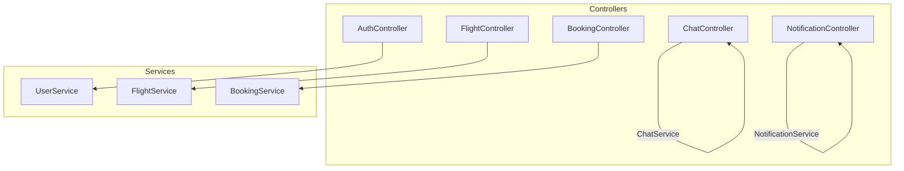
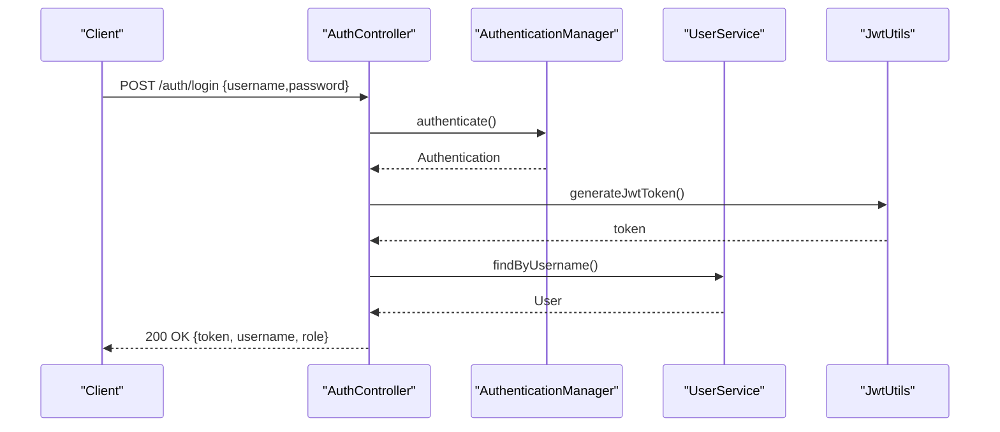
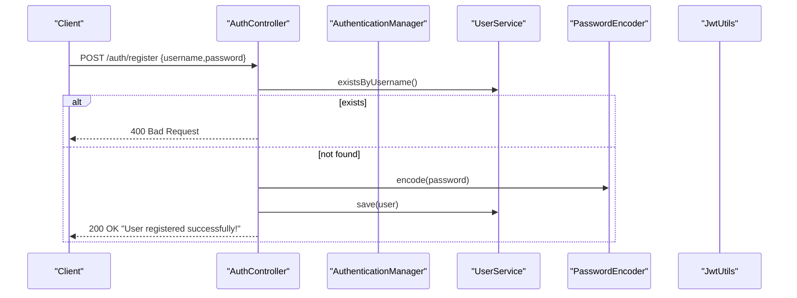
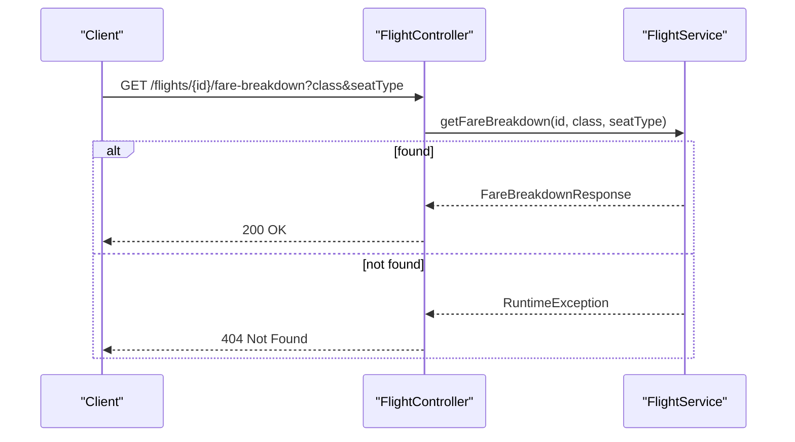
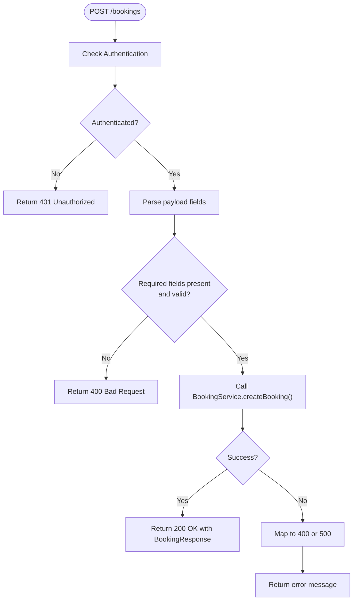

# REST API Design & Controllers

<cite>
**Referenced Files in This Document**
- [AuthController.java](file://backend-server/src/main/java/com/skyflow/controller/AuthController.java)
- [FlightController.java](file://backend-server/src/main/java/com/skyflow/controller/FlightController.java)
- [BookingController.java](file://backend-server/src/main/java/com/skyflow/controller/BookingController.java)
- [ChatController.java](file://backend-server/src/main/java/com/skyflow/controller/ChatController.java)
- [NotificationController.java](file://backend-server/src/main/java/com/skyflow/controller/NotificationController.java)
- [AuthRequest.java](file://backend-server/src/main/java/com/skyflow/model/dto/request/AuthRequest.java)
- [AuthResponse.java](file://backend-server/src/main/java/com/skyflow/model/dto/response/AuthResponse.java)
- [FlightSearchResponse.java](file://backend-server/src/main/java/com/skyflow/model/dto/response/FlightSearchResponse.java)
- [FareBreakdownResponse.java](file://backend-server/src/main/java/com/skyflow/model/dto/response/FareBreakdownResponse.java)
- [BookingResponse.java](file://backend-server/src/main/java/com/skyflow/model/dto/response/BookingResponse.java)
- [UserService.java](file://backend-server/src/main/java/com/skyflow/service/UserService.java)
- [FlightService.java](file://backend-server/src/main/java/com/skyflow/service/FlightService.java)
- [BookingService.java](file://backend-server/src/main/java/com/skyflow/service/BookingService.java)
- [GlobalExceptionHandler.java](file://backend-server/src/main/java/com/skyflow/exception/GlobalExceptionHandler.java)
- [ApiResponse.java](file://backend-server/src/main/java/com/skyflow/util/ApiResponse.java)
</cite>

## Table of Contents
1. [Introduction](#introduction)
2. [Project Structure](#project-structure)
3. [Core Components](#core-components)
4. [Architecture Overview](#architecture-overview)
5. [Detailed Component Analysis](#detailed-component-analysis)
6. [Dependency Analysis](#dependency-analysis)
7. [Performance Considerations](#performance-considerations)
8. [Troubleshooting Guide](#troubleshooting-guide)
9. [Conclusion](#conclusion)

## Introduction
This document explains the REST API design and controller layer implementation for the Airline Reservation System. It focuses on the Model-View-Controller (MVC) pattern with Spring MVC controllers handling HTTP requests, delegating business logic to service layer components, and returning structured responses. It documents the responsibilities of each controller, request/response DTO patterns, parameter validation, error handling strategies, HTTP status codes, response formatting, and transaction management integration with the service layer.

## Project Structure
Controllers reside under the controller package and expose REST endpoints grouped by domain:
- Authentication: handles login and registration
- Flight search and availability: city lookup, flight search, and fare breakdown
- Booking management: create, list, and cancel bookings
- Real-time chat: support data retrieval and chat query processing
- Notifications: fetch user-specific notifications



**Diagram sources**
- [AuthController.java:17-57](file://backend-server/src/main/java/com/skyflow/controller/AuthController.java#L17-L57)
- [FlightController.java:16-49](file://backend-server/src/main/java/com/skyflow/controller/FlightController.java#L16-L49)
- [BookingController.java:14-88](file://backend-server/src/main/java/com/skyflow/controller/BookingController.java#L14-L88)
- [ChatController.java:9-26](file://backend-server/src/main/java/com/skyflow/controller/ChatController.java#L9-L26)
- [NotificationController.java:11-23](file://backend-server/src/main/java/com/skyflow/controller/NotificationController.java#L11-L23)
- [UserService.java:13-41](file://backend-server/src/main/java/com/skyflow/service/UserService.java#L13-L41)
- [FlightService.java:20-205](file://backend-server/src/main/java/com/skyflow/service/FlightService.java#L20-L205)
- [BookingService.java:22-147](file://backend-server/src/main/java/com/skyflow/service/BookingService.java#L22-L147)

**Section sources**
- [AuthController.java:17-57](file://backend-server/src/main/java/com/skyflow/controller/AuthController.java#L17-L57)
- [FlightController.java:16-49](file://backend-server/src/main/java/com/skyflow/controller/FlightController.java#L16-L49)
- [BookingController.java:14-88](file://backend-server/src/main/java/com/skyflow/controller/BookingController.java#L14-L88)
- [ChatController.java:9-26](file://backend-server/src/main/java/com/skyflow/controller/ChatController.java#L9-L26)
- [NotificationController.java:11-23](file://backend-server/src/main/java/com/skyflow/controller/NotificationController.java#L11-L23)

## Core Components
- AuthController: Implements authentication and registration endpoints, integrates with AuthenticationManager, UserService, PasswordEncoder, and JwtUtils to produce JWT-based AuthResponse.
- FlightController: Exposes endpoints for city listing, flight search, and fare breakdown; delegates to FlightService and CityService.
- BookingController: Manages booking creation, retrieval, and cancellation; validates inputs and handles authorization via Spring Security’s Authentication.
- ChatController: Provides support data and chat query processing endpoints; integrates with ChatService.
- NotificationController: Returns notifications for the authenticated user via NotificationService.

Request/Response DTOs:
- AuthRequest: carries username and password for login/register.
- AuthResponse: returns token, username, and role after successful authentication.
- FlightSearchResponse: comprehensive flight details and pricing per cabin class.
- FareBreakdownResponse: detailed cost computation including taxes, seat charge, surge pricing, and remaining seats.
- BookingResponse: standardized booking confirmation details including PNR, booking reference, and passenger/fare info.

**Section sources**
- [AuthRequest.java:1-10](file://backend-server/src/main/java/com/skyflow/model/dto/request/AuthRequest.java#L1-L10)
- [AuthResponse.java:1-13](file://backend-server/src/main/java/com/skyflow/model/dto/response/AuthResponse.java#L1-L13)
- [FlightSearchResponse.java:1-34](file://backend-server/src/main/java/com/skyflow/model/dto/response/FlightSearchResponse.java#L1-L34)
- [FareBreakdownResponse.java:1-19](file://backend-server/src/main/java/com/skyflow/model/dto/response/FareBreakdownResponse.java#L1-L19)
- [BookingResponse.java:1-24](file://backend-server/src/main/java/com/skyflow/model/dto/response/BookingResponse.java#L1-L24)

## Architecture Overview
The controllers form the REST boundary, invoking service-layer methods annotated with transactional semantics where needed. Services encapsulate business logic and coordinate repositories. Global exception handling ensures consistent error responses across the API.



**Diagram sources**
- [AuthController.java:29-40](file://backend-server/src/main/java/com/skyflow/controller/AuthController.java#L29-L40)
- [UserService.java:29-32](file://backend-server/src/main/java/com/skyflow/service/UserService.java#L29-L32)

**Section sources**
- [AuthController.java:29-40](file://backend-server/src/main/java/com/skyflow/controller/AuthController.java#L29-L40)
- [UserService.java:19-32](file://backend-server/src/main/java/com/skyflow/service/UserService.java#L19-L32)

## Detailed Component Analysis

### AuthController
Responsibilities:
- Login endpoint validates credentials and issues JWT.
- Registration endpoint checks uniqueness, encodes password, assigns default role, and persists user.

Validation and error handling:
- Duplicate username triggers a 400 Bad Request with a descriptive message.
- Successful operations return 200 OK; registration returns a success message.

Response formatting:
- Uses AuthResponse DTO for login; raw message for registration.



**Diagram sources**
- [AuthController.java:42-56](file://backend-server/src/main/java/com/skyflow/controller/AuthController.java#L42-L56)
- [UserService.java:34-40](file://backend-server/src/main/java/com/skyflow/service/UserService.java#L34-L40)

**Section sources**
- [AuthController.java:29-56](file://backend-server/src/main/java/com/skyflow/controller/AuthController.java#L29-L56)
- [AuthRequest.java:1-10](file://backend-server/src/main/java/com/skyflow/model/dto/request/AuthRequest.java#L1-L10)
- [AuthResponse.java:1-13](file://backend-server/src/main/java/com/skyflow/model/dto/response/AuthResponse.java#L1-L13)

### FlightController
Responsibilities:
- GET /cities lists cities optionally filtered by tag.
- GET /flights/search performs flight search by origin, destination, and date.
- GET /flights/{id}/fare-breakdown computes fare breakdown with seat class and seat type.

Validation and error handling:
- Exceptions thrown by service propagate as runtime exceptions; the controller catches them and returns 404 Not Found for missing flights.

Response formatting:
- Returns lists of FlightSearchResponse for search and single FareBreakdownResponse for fare details.



**Diagram sources**
- [FlightController.java:37-48](file://backend-server/src/main/java/com/skyflow/controller/FlightController.java#L37-L48)
- [FlightService.java:104-144](file://backend-server/src/main/java/com/skyflow/service/FlightService.java#L104-L144)

**Section sources**
- [FlightController.java:24-48](file://backend-server/src/main/java/com/skyflow/controller/FlightController.java#L24-L48)
- [FlightSearchResponse.java:1-34](file://backend-server/src/main/java/com/skyflow/model/dto/response/FlightSearchResponse.java#L1-L34)
- [FareBreakdownResponse.java:1-19](file://backend-server/src/main/java/com/skyflow/model/dto/response/FareBreakdownResponse.java#L1-L19)

### BookingController
Responsibilities:
- POST /bookings creates a booking for the authenticated user.
- GET /bookings/my-bookings retrieves the current user’s bookings.
- POST /bookings/cancel/{id} cancels a booking owned by the user.

Validation and error handling:
- Requires Authentication; otherwise returns 401 Unauthorized.
- Validates presence and format of required fields; returns 400 Bad Request with messages for invalid inputs.
- Delegates to BookingService; maps runtime exceptions to 400 or 500 with user-friendly messages.

Response formatting:
- Returns BookingResponse for successful creation and list for retrieval; cancellation endpoint returns void.



**Diagram sources**
- [BookingController.java:21-70](file://backend-server/src/main/java/com/skyflow/controller/BookingController.java#L21-L70)
- [BookingService.java:43-98](file://backend-server/src/main/java/com/skyflow/service/BookingService.java#L43-L98)

**Section sources**
- [BookingController.java:21-87](file://backend-server/src/main/java/com/skyflow/controller/BookingController.java#L21-L87)
- [BookingResponse.java:1-24](file://backend-server/src/main/java/com/skyflow/model/dto/response/BookingResponse.java#L1-L24)

### ChatController
Responsibilities:
- GET /chat/support returns support metadata.
- POST /chat/support processes a user query and returns a response.

Integration:
- Delegates to ChatService for both operations.

**Section sources**
- [ChatController.java:17-25](file://backend-server/src/main/java/com/skyflow/controller/ChatController.java#L17-L25)

### NotificationController
Responsibilities:
- GET /notifications returns notifications for the authenticated user.

Integration:
- Delegates to NotificationService.

**Section sources**
- [NotificationController.java:19-22](file://backend-server/src/main/java/com/skyflow/controller/NotificationController.java#L19-L22)

## Dependency Analysis
Controllers depend on service-layer components. Services encapsulate business logic and coordinate repositories. Transactional boundaries are declared at the service level for operations requiring atomicity (e.g., booking creation and cancellation).

```mermaid
classDiagram
class AuthController
class FlightController
class BookingController
class ChatController
class NotificationController
class UserService
class FlightService
class BookingService
AuthController --> UserService : "uses"
FlightController --> FlightService : "uses"
BookingController --> BookingService : "uses"
ChatController -->|"ChatService"| ChatController : "uses"
NotificationController -->|"NotificationService"| NotificationController : "uses"
```

**Diagram sources**
- [AuthController.java:20-27](file://backend-server/src/main/java/com/skyflow/controller/AuthController.java#L20-L27)
- [FlightController.java:19-22](file://backend-server/src/main/java/com/skyflow/controller/FlightController.java#L19-L22)
- [BookingController.java:18-19](file://backend-server/src/main/java/com/skyflow/controller/BookingController.java#L18-L19)
- [ChatController.java:14-15](file://backend-server/src/main/java/com/skyflow/controller/ChatController.java#L14-L15)
- [NotificationController.java:16-17](file://backend-server/src/main/java/com/skyflow/controller/NotificationController.java#L16-L17)
- [UserService.java:13-41](file://backend-server/src/main/java/com/skyflow/service/UserService.java#L13-L41)
- [FlightService.java:20-205](file://backend-server/src/main/java/com/skyflow/service/FlightService.java#L20-L205)
- [BookingService.java:22-147](file://backend-server/src/main/java/com/skyflow/service/BookingService.java#L22-L147)

**Section sources**
- [BookingService.java:43-127](file://backend-server/src/main/java/com/skyflow/service/BookingService.java#L43-L127)

## Performance Considerations
- DTO mapping: Controllers return lightweight DTOs to avoid exposing entity graphs and reduce serialization overhead.
- Validation early exit: Controllers validate inputs and return 400 before hitting services to minimize unnecessary work.
- Transaction boundaries: Services use @Transactional to ensure consistency for booking operations; keep transactions short and focused.
- Caching opportunities: Consider caching city lists and frequently accessed flight metadata to reduce database load.
- Asynchronous notifications: Offload notification creation after booking to improve response latency.

## Troubleshooting Guide
Common issues and resolutions:
- Authentication failures: Ensure correct username/password; verify user exists and password is encoded.
- Registration conflicts: Duplicate usernames trigger 400; choose a unique username.
- Booking errors: Validate flightId format and positive integer; confirm seat availability; check user authentication.
- Not found scenarios: Fare breakdown for invalid flightId returns 404; ensure flight identifiers match search results.
- Global error handling: Unexpected exceptions return a standardized error envelope with timestamp, status, error phrase, message, and path.

HTTP status codes:
- 200 OK: Successful responses (login, registration success, booking creation, retrieval).
- 400 Bad Request: Validation failures and business rule violations (missing fields, invalid inputs, seat already booked).
- 401 Unauthorized: Missing or invalid authentication for protected endpoints.
- 404 Not Found: Resource not found (e.g., flight for fare breakdown).
- 500 Internal Server Error: Unhandled server errors; mapped via GlobalExceptionHandler.

Response formatting:
- Consistent error envelope via GlobalExceptionHandler.
- Structured success payloads via ApiResponse utility for uniform success/error shapes when applicable.

**Section sources**
- [GlobalExceptionHandler.java:15-54](file://backend-server/src/main/java/com/skyflow/exception/GlobalExceptionHandler.java#L15-L54)
- [ApiResponse.java:13-43](file://backend-server/src/main/java/com/skyflow/util/ApiResponse.java#L13-L43)
- [BookingController.java:23-69](file://backend-server/src/main/java/com/skyflow/controller/BookingController.java#L23-L69)
- [FlightController.java:45-47](file://backend-server/src/main/java/com/skyflow/controller/FlightController.java#L45-L47)

## Conclusion
The REST API follows a clean MVC separation with controllers handling HTTP concerns, services encapsulating business logic, and DTOs standardizing request/response contracts. Robust validation, explicit error handling, and transactional service methods ensure predictable behavior. Extending the API involves adding new controllers, DTOs, and services while maintaining consistent error envelopes and status codes.