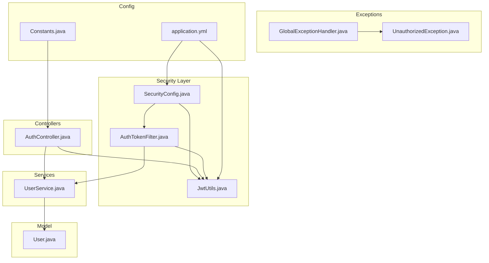
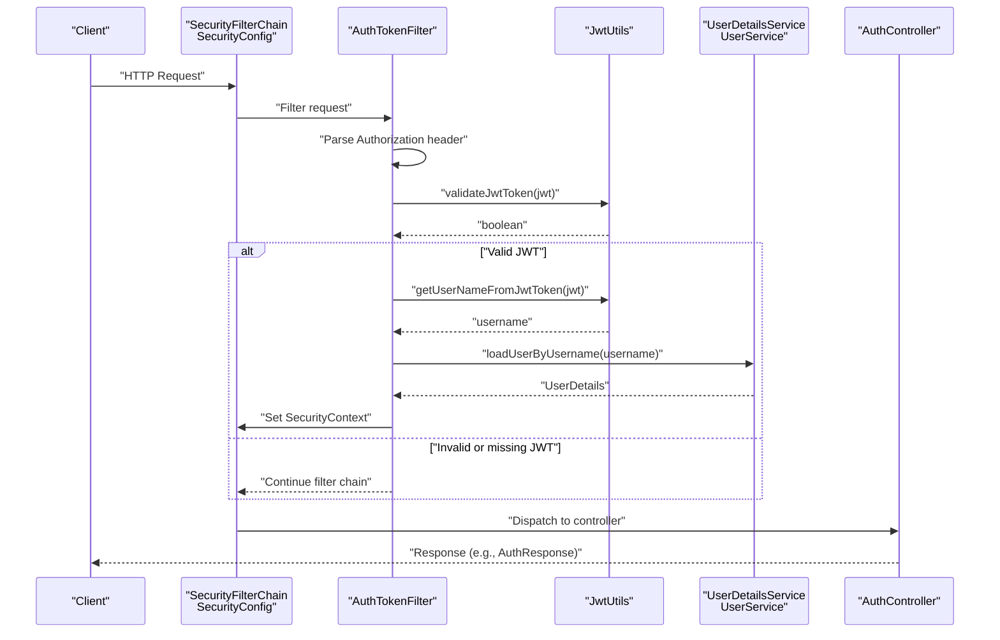
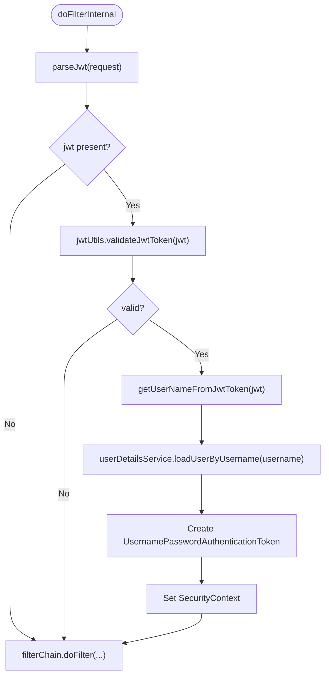
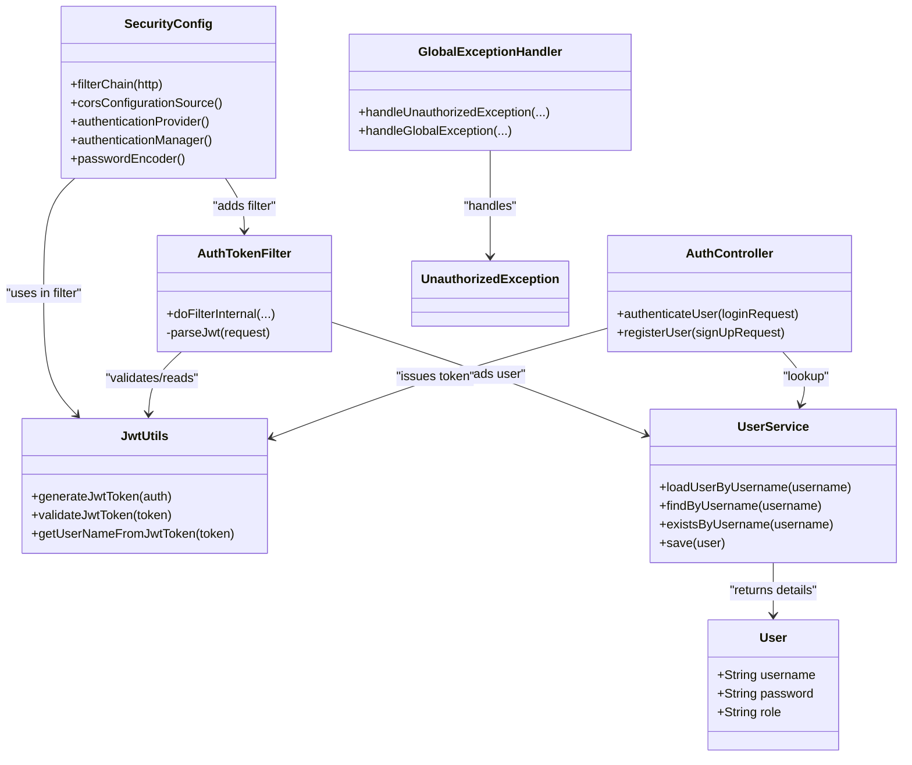

# Security & Authentication

<cite>
**Referenced Files in This Document**
- [SecurityConfig.java](file://backend-server/src/main/java/com/skyflow/config/SecurityConfig.java)
- [AuthTokenFilter.java](file://backend-server/src/main/java/com/skyflow/security/AuthTokenFilter.java)
- [JwtUtils.java](file://backend-server/src/main/java/com/skyflow/security/JwtUtils.java)
- [GlobalExceptionHandler.java](file://backend-server/src/main/java/com/skyflow/exception/GlobalExceptionHandler.java)
- [UnauthorizedException.java](file://backend-server/src/main/java/com/skyflow/exception/UnauthorizedException.java)
- [AuthController.java](file://backend-server/src/main/java/com/skyflow/controller/AuthController.java)
- [UserService.java](file://backend-server/src/main/java/com/skyflow/service/UserService.java)
- [User.java](file://backend-server/src/main/java/com/skyflow/model/entity/User.java)
- [application.yml](file://backend-server/src/main/resources/application.yml)
- [Constants.java](file://backend-server/src/main/java/com/skyflow/util/Constants.java)
</cite>

## Table of Contents
1. [Introduction](#introduction)
2. [Project Structure](#project-structure)
3. [Core Components](#core-components)
4. [Architecture Overview](#architecture-overview)
5. [Detailed Component Analysis](#detailed-component-analysis)
6. [Dependency Analysis](#dependency-analysis)
7. [Performance Considerations](#performance-considerations)
8. [Troubleshooting Guide](#troubleshooting-guide)
9. [Conclusion](#conclusion)
10. [Appendices](#appendices)

## Introduction
This document explains the security and authentication system of the backend server. It covers the Spring Security configuration, JWT-based authentication filter chain, CORS policy, HTTP security rules, JWT utilities, and exception handling for unauthorized access. It also outlines best practices for production deployment, including CSRF protection, secure headers, token refresh mechanisms, and role-based authorization patterns.

## Project Structure
The security subsystem is organized under the config, security, controller, exception, service, model, and resources packages. The primary configuration is in SecurityConfig, JWT utilities in JwtUtils, the JWT filter in AuthTokenFilter, and centralized exception handling in GlobalExceptionHandler. Application-level JWT configuration is provided via application.yml.

**Diagram sources**
- [SecurityConfig.java:1-81](file://backend-server/src/main/java/com/skyflow/config/SecurityConfig.java#L1-L81)
- [AuthTokenFilter.java:1-62](file://backend-server/src/main/java/com/skyflow/security/AuthTokenFilter.java#L1-L62)
- [JwtUtils.java:1-53](file://backend-server/src/main/java/com/skyflow/security/JwtUtils.java#L1-L53)
- [AuthController.java:1-58](file://backend-server/src/main/java/com/skyflow/controller/AuthController.java#L1-L58)
- [UserService.java:1-42](file://backend-server/src/main/java/com/skyflow/service/UserService.java#L1-L42)
- [User.java:1-31](file://backend-server/src/main/java/com/skyflow/model/entity/User.java#L1-L31)
- [GlobalExceptionHandler.java:1-55](file://backend-server/src/main/java/com/skyflow/exception/GlobalExceptionHandler.java#L1-L55)
- [UnauthorizedException.java:1-16](file://backend-server/src/main/java/com/skyflow/exception/UnauthorizedException.java#L1-L16)
- [application.yml:1-30](file://backend-server/src/main/resources/application.yml#L1-L30)
- [Constants.java:1-17](file://backend-server/src/main/java/com/skyflow/util/Constants.java#L1-L17)

**Section sources**
- [SecurityConfig.java:1-81](file://backend-server/src/main/java/com/skyflow/config/SecurityConfig.java#L1-L81)
- [application.yml:1-30](file://backend-server/src/main/resources/application.yml#L1-L30)

## Core Components
- SecurityConfig: Defines Spring Security filter chain, CORS, CSRF, headers, session management, and HTTP security rules. Integrates the JWT filter and authentication provider.
- AuthTokenFilter: Extracts Authorization Bearer tokens, validates JWTs, loads user details, and establishes an authenticated SecurityContext.
- JwtUtils: Generates, validates, and extracts claims from JWTs using HMAC-SHA signing.
- AuthController: Handles login and registration; issues JWT upon successful authentication.
- UserService: Implements UserDetailsService and provides user lookup for authentication.
- GlobalExceptionHandler: Centralized exception handling including UnauthorizedException mapping to HTTP 401.
- application.yml: Provides JWT secret and expiration configuration.

**Section sources**
- [SecurityConfig.java:20-81](file://backend-server/src/main/java/com/skyflow/config/SecurityConfig.java#L20-L81)
- [AuthTokenFilter.java:19-62](file://backend-server/src/main/java/com/skyflow/security/AuthTokenFilter.java#L19-L62)
- [JwtUtils.java:14-53](file://backend-server/src/main/java/com/skyflow/security/JwtUtils.java#L14-L53)
- [AuthController.java:17-58](file://backend-server/src/main/java/com/skyflow/controller/AuthController.java#L17-L58)
- [UserService.java:13-42](file://backend-server/src/main/java/com/skyflow/service/UserService.java#L13-L42)
- [GlobalExceptionHandler.java:15-55](file://backend-server/src/main/java/com/skyflow/exception/GlobalExceptionHandler.java#L15-L55)
- [application.yml:26-30](file://backend-server/src/main/resources/application.yml#L26-L30)

## Architecture Overview
The authentication flow is request-driven. Requests pass through the JWT filter chain, which validates tokens and sets the SecurityContext. Protected endpoints require authentication, while public endpoints (auth, flights, cities, chat, H2 console) are permitted without authentication.

**Diagram sources**
- [SecurityConfig.java:49-67](file://backend-server/src/main/java/com/skyflow/config/SecurityConfig.java#L49-L67)
- [AuthTokenFilter.java:28-50](file://backend-server/src/main/java/com/skyflow/security/AuthTokenFilter.java#L28-L50)
- [JwtUtils.java:38-51](file://backend-server/src/main/java/com/skyflow/security/JwtUtils.java#L38-L51)
- [UserService.java:19-27](file://backend-server/src/main/java/com/skyflow/service/UserService.java#L19-L27)
- [AuthController.java:29-40](file://backend-server/src/main/java/com/skyflow/controller/AuthController.java#L29-L40)

## Detailed Component Analysis

### SecurityConfig
- CORS: Allows credentials, permissive methods and headers, and registers a configuration for all paths.
- CSRF: Disabled, suitable for stateless APIs using JWT.
- Headers: Disables frame options for H2 console access.
- Session Management: Stateless session policy.
- HTTP Security Rules:
  - Public endpoints: /auth/**, /cities/**, /flights/**, /h2-console/**, /chat/**
  - All other requests require authentication.
- Authentication Provider: DAO-based with BCrypt password encoder and UserDetailsService.
- Filter Chain Integration: Adds AuthTokenFilter before the default UsernamePassword filter.

Best practices considerations:
- CSRF disabled is acceptable for token-based APIs; ensure clients store tokens securely and avoid browser auto-fill risks.
- Stateless sessions prevent server-side session storage, reducing scalability overhead.

**Section sources**
- [SecurityConfig.java:49-81](file://backend-server/src/main/java/com/skyflow/config/SecurityConfig.java#L49-L81)

### AuthTokenFilter
Responsibilities:
- Parse Authorization header for Bearer token.
- Validate token via JwtUtils.
- Load user details and construct an authentication token.
- Set SecurityContext for the current request.

Behavioral notes:
- Uses OncePerRequestFilter to avoid repeated filtering.
- On validation failure, continues filter chain without throwing; exceptions are caught and suppressed.

**Diagram sources**
- [AuthTokenFilter.java:28-50](file://backend-server/src/main/java/com/skyflow/security/AuthTokenFilter.java#L28-L50)
- [JwtUtils.java:38-51](file://backend-server/src/main/java/com/skyflow/security/JwtUtils.java#L38-L51)
- [UserService.java:19-27](file://backend-server/src/main/java/com/skyflow/service/UserService.java#L19-L27)

**Section sources**
- [AuthTokenFilter.java:19-62](file://backend-server/src/main/java/com/skyflow/security/AuthTokenFilter.java#L19-L62)

### JwtUtils
Capabilities:
- Generate JWT with subject, issued-at, expiration, and HS256 signature.
- Validate JWT by parsing claims.
- Extract username from token.

Configuration:
- Secret and expiration are loaded from application.yml.

Security considerations:
- Secret must be strong and rotated periodically.
- Expiration should be short-lived for reduced risk.
- Consider adding issuer, audience, and unique ID claims for stronger validation.

**Section sources**
- [JwtUtils.java:14-53](file://backend-server/src/main/java/com/skyflow/security/JwtUtils.java#L14-L53)
- [application.yml:26-30](file://backend-server/src/main/resources/application.yml#L26-L30)

### AuthController
Responsibilities:
- Authenticate users via AuthenticationManager.
- Issue JWT upon successful authentication.
- Register new users with encoded passwords and default role.

Notes:
- Returns an AuthResponse containing token, username, and role.
- Registration enforces unique usernames.

**Section sources**
- [AuthController.java:17-58](file://backend-server/src/main/java/com/skyflow/controller/AuthController.java#L17-L58)
- [User.java:18-27](file://backend-server/src/main/java/com/skyflow/model/entity/User.java#L18-L27)

### UserService
Responsibilities:
- Implement UserDetailsService to load user details by username.
- Provide user lookup, existence checks, and persistence.

Behavioral note:
- Authorities collection is currently empty; roles are not populated.

**Section sources**
- [UserService.java:13-42](file://backend-server/src/main/java/com/skyflow/service/UserService.java#L13-L42)

### GlobalExceptionHandler and UnauthorizedException
- UnauthorizedException is mapped to HTTP 401 with a structured error response.
- GlobalExceptionHandler centralizes logging and response formatting.

**Section sources**
- [GlobalExceptionHandler.java:15-55](file://backend-server/src/main/java/com/skyflow/exception/GlobalExceptionHandler.java#L15-L55)
- [UnauthorizedException.java:1-16](file://backend-server/src/main/java/com/skyflow/exception/UnauthorizedException.java#L1-16)

## Dependency Analysis
The following diagram shows key dependencies among security components and supporting services.

**Diagram sources**
- [SecurityConfig.java:20-81](file://backend-server/src/main/java/com/skyflow/config/SecurityConfig.java#L20-L81)
- [AuthTokenFilter.java:19-62](file://backend-server/src/main/java/com/skyflow/security/AuthTokenFilter.java#L19-L62)
- [JwtUtils.java:14-53](file://backend-server/src/main/java/com/skyflow/security/JwtUtils.java#L14-L53)
- [AuthController.java:17-58](file://backend-server/src/main/java/com/skyflow/controller/AuthController.java#L17-L58)
- [UserService.java:13-42](file://backend-server/src/main/java/com/skyflow/service/UserService.java#L13-L42)
- [User.java:18-27](file://backend-server/src/main/java/com/skyflow/model/entity/User.java#L18-L27)
- [GlobalExceptionHandler.java:15-55](file://backend-server/src/main/java/com/skyflow/exception/GlobalExceptionHandler.java#L15-L55)
- [UnauthorizedException.java:1-16](file://backend-server/src/main/java/com/skyflow/exception/UnauthorizedException.java#L1-L16)

**Section sources**
- [SecurityConfig.java:20-81](file://backend-server/src/main/java/com/skyflow/config/SecurityConfig.java#L20-L81)
- [AuthTokenFilter.java:19-62](file://backend-server/src/main/java/com/skyflow/security/AuthTokenFilter.java#L19-L62)
- [JwtUtils.java:14-53](file://backend-server/src/main/java/com/skyflow/security/JwtUtils.java#L14-L53)
- [AuthController.java:17-58](file://backend-server/src/main/java/com/skyflow/controller/AuthController.java#L17-L58)
- [UserService.java:13-42](file://backend-server/src/main/java/com/skyflow/service/UserService.java#L13-L42)
- [User.java:18-27](file://backend-server/src/main/java/com/skyflow/model/entity/User.java#L18-L27)
- [GlobalExceptionHandler.java:15-55](file://backend-server/src/main/java/com/skyflow/exception/GlobalExceptionHandler.java#L15-L55)
- [UnauthorizedException.java:1-16](file://backend-server/src/main/java/com/skyflow/exception/UnauthorizedException.java#L1-L16)

## Performance Considerations
- Stateless design eliminates server-side session storage, improving horizontal scalability.
- JWT validation is CPU-bound; keep secrets strong and consider rotating keys with careful rollout.
- Token expiration should be short to minimize exposure; implement refresh mechanisms for long sessions.
- Avoid excessive logging of sensitive data in filters and handlers.

[No sources needed since this section provides general guidance]

## Troubleshooting Guide
Common issues and resolutions:
- 401 Unauthorized on protected endpoints:
  - Verify Authorization header format and presence.
  - Confirm token validity and expiration.
  - Ensure UserService returns authorities if role-based checks are added later.
- CORS errors:
  - Confirm allowed origins, methods, headers, and credentials alignment with client configuration.
- H2 Console access blocked:
  - Frame options are disabled for H2 console; ensure endpoint is permitted by HTTP rules.

**Section sources**
- [GlobalExceptionHandler.java:32-36](file://backend-server/src/main/java/com/skyflow/exception/GlobalExceptionHandler.java#L32-L36)
- [SecurityConfig.java:69-79](file://backend-server/src/main/java/com/skyflow/config/SecurityConfig.java#L69-L79)
- [application.yml:14-17](file://backend-server/src/main/resources/application.yml#L14-L17)

## Conclusion
The system employs a robust, stateless JWT-based authentication mechanism integrated with Spring Security. The filter chain enforces CORS, disables CSRF for token-based APIs, and applies strict HTTP rules. JWT utilities encapsulate token lifecycle operations, while centralized exception handling ensures consistent unauthorized responses. For production, consider implementing token refresh, CSRF protection for embedded forms, secure headers, and role-based authorization with proper authorities.

[No sources needed since this section summarizes without analyzing specific files]

## Appendices

### Production Best Practices
- Token Refresh Mechanism:
  - Issue short-lived access tokens and long-lived refresh tokens.
  - Validate refresh tokens against secure storage and rotate them.
  - Invalidate tokens on logout and on sensitive actions.
- Role-Based Authorization:
  - Populate user authorities in UserService and enforce @PreAuthorize/@PostAuthorize annotations.
  - Use method-level security alongside HTTP security rules.
- CSRF Protection:
  - Keep CSRF enabled for browser-rendered applications; disable only for pure APIs.
  - Use SameSite cookies and Content-Security-Policy headers.
- Secure Headers:
  - Add Strict-Transport-Security, X-Content-Type-Options, X-Frame-Options, Referrer-Policy, Permissions-Policy.
- Secrets Management:
  - Store JWT secret in environment variables or a secrets manager; rotate regularly.
- Logging and Monitoring:
  - Log failed authentication attempts; monitor for brute-force patterns.

[No sources needed since this section provides general guidance]