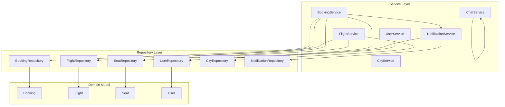
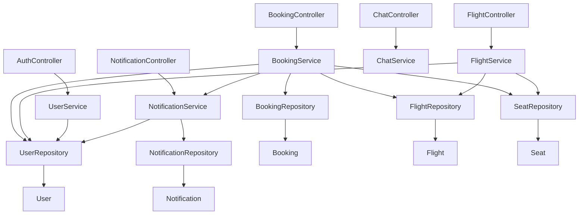
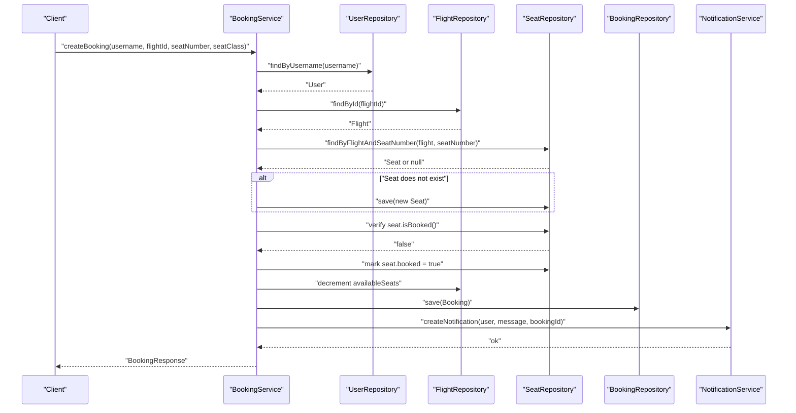
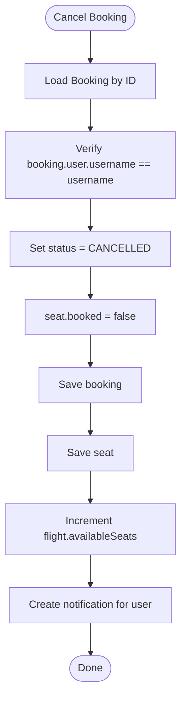
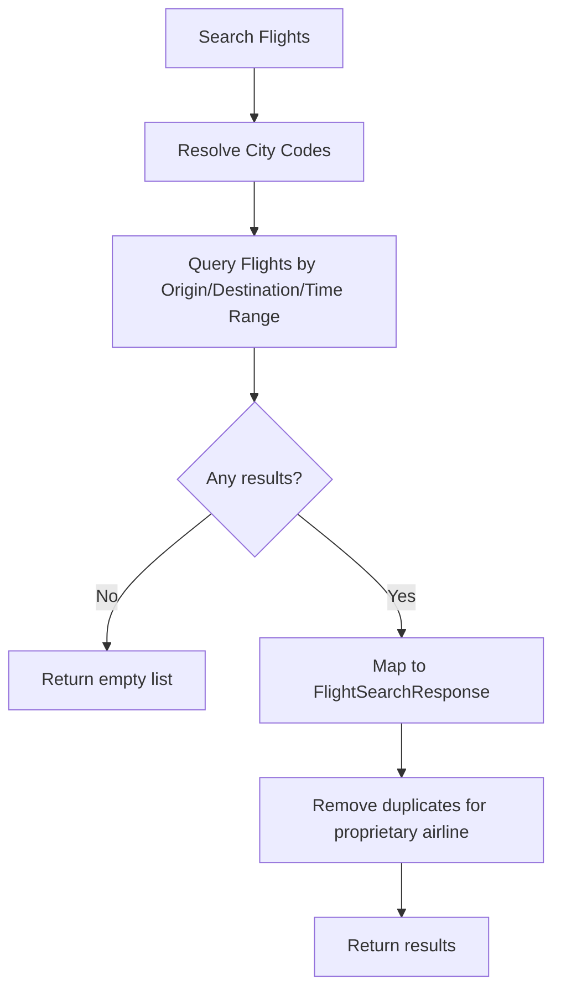
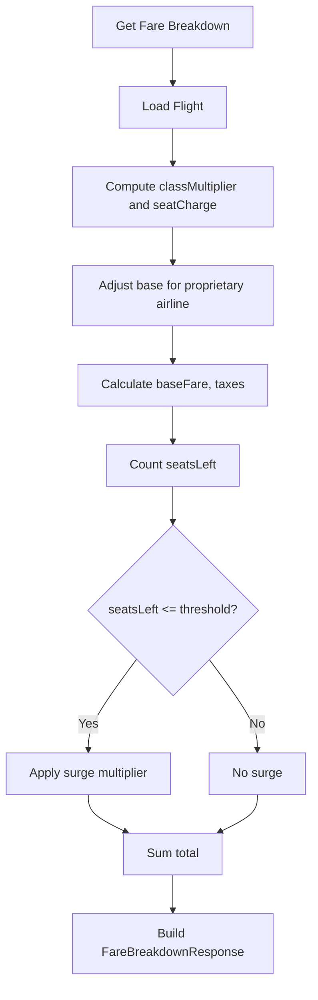
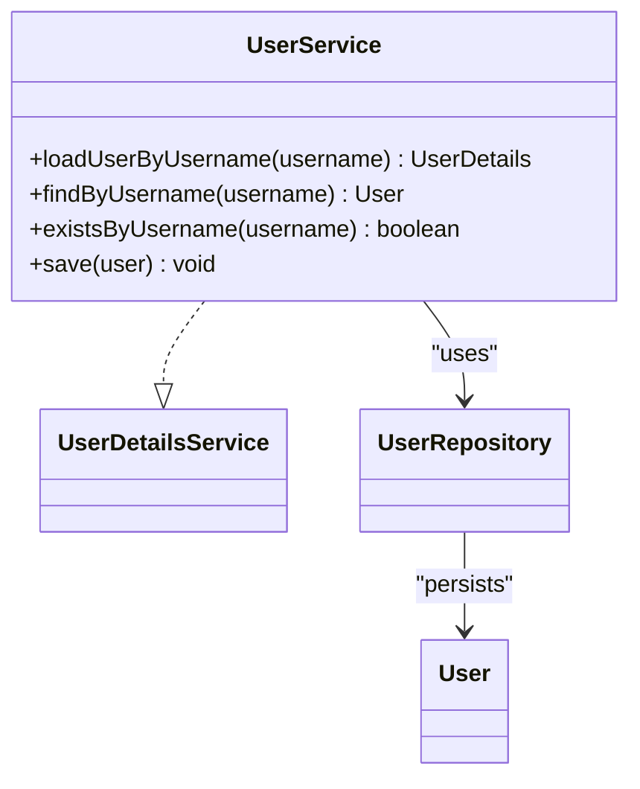
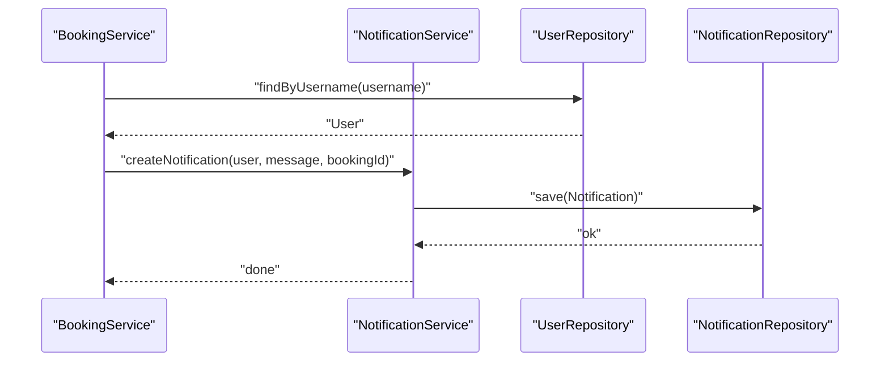
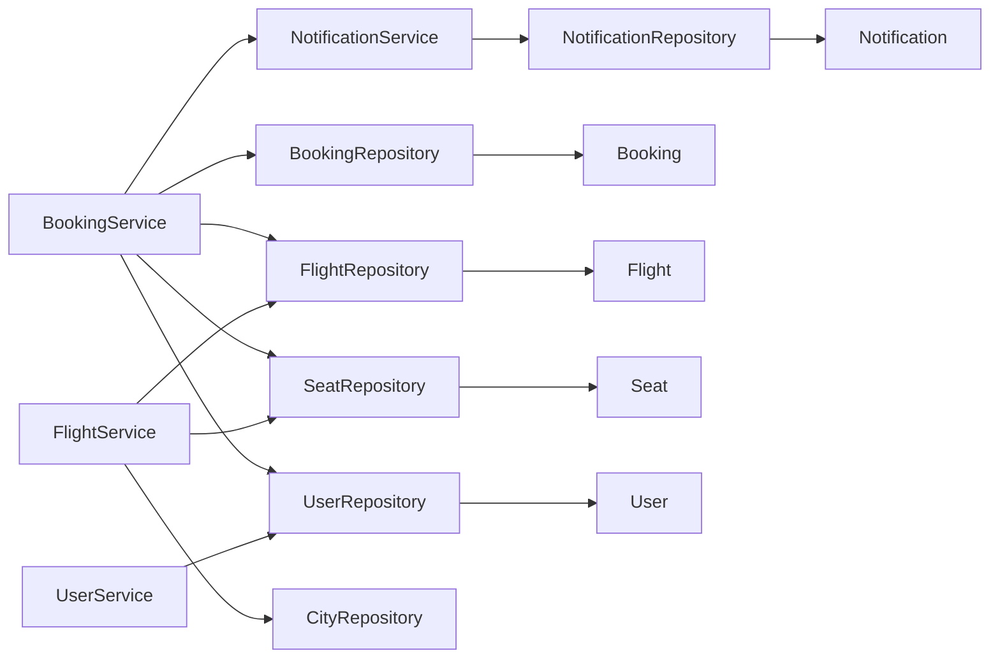

# Service Layer & Business Logic

<cite>
**Referenced Files in This Document**
- [BookingService.java](file://backend-server/src/main/java/com/skyflow/service/BookingService.java)
- [ChatService.java](file://backend-server/src/main/java/com/skyflow/service/ChatService.java)
- [CityService.java](file://backend-server/src/main/java/com/skyflow/service/CityService.java)
- [FlightService.java](file://backend-server/src/main/java/com/skyflow/service/FlightService.java)
- [NotificationService.java](file://backend-server/src/main/java/com/skyflow/service/NotificationService.java)
- [UserService.java](file://backend-server/src/main/java/com/skyflow/service/UserService.java)
- [BookingRepository.java](file://backend-server/src/main/java/com/skyflow/repository/BookingRepository.java)
- [FlightRepository.java](file://backend-server/src/main/java/com/skyflow/repository/FlightRepository.java)
- [SeatRepository.java](file://backend-server/src/main/java/com/skyflow/repository/SeatRepository.java)
- [UserRepository.java](file://backend-server/src/main/java/com/skyflow/repository/UserRepository.java)
- [CityRepository.java](file://backend-server/src/main/java/com/skyflow/repository/CityRepository.java)
- [NotificationRepository.java](file://backend-server/src/main/java/com/skyflow/repository/NotificationRepository.java)
- [Booking.java](file://backend-server/src/main/java/com/skyflow/model/entity/Booking.java)
- [Flight.java](file://backend-server/src/main/java/com/skyflow/model/entity/Flight.java)
- [Seat.java](file://backend-server/src/main/java/com/skyflow/model/entity/Seat.java)
- [User.java](file://backend-server/src/main/java/com/skyflow/model/entity/User.java)
- [BookingResponse.java](file://backend-server/src/main/java/com/skyflow/model/dto/response/BookingResponse.java)
- [FlightSearchResponse.java](file://backend-server/src/main/java/com/skyflow/model/dto/response/FlightSearchResponse.java)
</cite>

## Table of Contents
1. [Introduction](#introduction)
2. [Project Structure](#project-structure)
3. [Core Components](#core-components)
4. [Architecture Overview](#architecture-overview)
5. [Detailed Component Analysis](#detailed-component-analysis)
6. [Dependency Analysis](#dependency-analysis)
7. [Performance Considerations](#performance-considerations)
8. [Troubleshooting Guide](#troubleshooting-guide)
9. [Conclusion](#conclusion)

## Introduction
This document explains the service layer and business logic of the airline reservation system. It focuses on how services encapsulate domain-specific operations, enforce business rules, coordinate with repositories, and integrate with external systems. The covered services include:
- BookingService: seat allocation, booking lifecycle, pricing calculations, and notifications
- ChatService: FAQ and policy-driven chat responses
- CityService: city lookup and filtering
- FlightService: flight search, pricing engine, surge pricing, and feature generation
- NotificationService: user-centric alert management
- UserService: user authentication and authorization via Spring Security

The document also covers the service-to-repository pattern, transaction management, integration points, caching strategies, performance optimizations, testing approaches, mocking strategies, and dependency injection patterns.

## Project Structure
The backend service layer resides under backend-server/src/main/java/com/skyflow. Services depend on repositories, which in turn use JPA to access the database. Entities define the persistence model, and DTOs represent cross-service and controller-facing responses.

**Diagram sources**
- [BookingService.java:22-34](file://backend-server/src/main/java/com/skyflow/service/BookingService.java#L22-L34)
- [ChatService.java:10-10](file://backend-server/src/main/java/com/skyflow/service/ChatService.java#L10-L10)
- [CityService.java:10-14](file://backend-server/src/main/java/com/skyflow/service/CityService.java#L10-L14)
- [FlightService.java:20-28](file://backend-server/src/main/java/com/skyflow/service/FlightService.java#L20-L28)
- [NotificationService.java:12-19](file://backend-server/src/main/java/com/skyflow/service/NotificationService.java#L12-L19)
- [UserService.java:13-17](file://backend-server/src/main/java/com/skyflow/service/UserService.java#L13-L17)
- [BookingRepository.java:9-13](file://backend-server/src/main/java/com/skyflow/repository/BookingRepository.java#L9-L13)
- [FlightRepository.java:12-21](file://backend-server/src/main/java/com/skyflow/repository/FlightRepository.java#L12-L21)
- [SeatRepository.java:13-24](file://backend-server/src/main/java/com/skyflow/repository/SeatRepository.java#L13-L24)
- [UserRepository.java:7-11](file://backend-server/src/main/java/com/skyflow/repository/UserRepository.java#L7-L11)
- [CityRepository.java:8-12](file://backend-server/src/main/java/com/skyflow/repository/CityRepository.java#L8-L12)
- [NotificationRepository.java:8-10](file://backend-server/src/main/java/com/skyflow/repository/NotificationRepository.java#L8-L10)
- [Booking.java:8-41](file://backend-server/src/main/java/com/skyflow/model/entity/Booking.java#L8-L41)
- [Flight.java:8-42](file://backend-server/src/main/java/com/skyflow/model/entity/Flight.java#L8-L42)
- [Seat.java:7-29](file://backend-server/src/main/java/com/skyflow/model/entity/Seat.java#L7-L29)
- [User.java:9-30](file://backend-server/src/main/java/com/skyflow/model/entity/User.java#L9-L30)

**Section sources**
- [BookingService.java:1-148](file://backend-server/src/main/java/com/skyflow/service/BookingService.java#L1-L148)
- [ChatService.java:1-56](file://backend-server/src/main/java/com/skyflow/service/ChatService.java#L1-L56)
- [CityService.java:1-27](file://backend-server/src/main/java/com/skyflow/service/CityService.java#L1-L27)
- [FlightService.java:1-206](file://backend-server/src/main/java/com/skyflow/service/FlightService.java#L1-L206)
- [NotificationService.java:1-35](file://backend-server/src/main/java/com/skyflow/service/NotificationService.java#L1-L35)
- [UserService.java:1-42](file://backend-server/src/main/java/com/skyflow/service/UserService.java#L1-L42)

## Core Components
This section outlines each service’s responsibilities, business rules, and integration points.

- BookingService
  - Seat allocation and booking creation with seat uniqueness and availability checks
  - Pricing calculation including class multipliers and taxes
  - Booking lifecycle: confirm and cancel with seat restoration and refund notifications
  - Transactional boundaries around atomic operations
  - References: [BookingService.java:43-98](file://backend-server/src/main/java/com/skyflow/service/BookingService.java#L43-L98), [BookingService.java:107-127](file://backend-server/src/main/java/com/skyflow/service/BookingService.java#L107-L127)

- ChatService
  - Static support metadata and FAQ
  - Policy-driven chat responses based on keyword matching
  - References: [ChatService.java:13-28](file://backend-server/src/main/java/com/skyflow/service/ChatService.java#L13-L28), [ChatService.java:30-47](file://backend-server/src/main/java/com/skyflow/service/ChatService.java#L30-L47)

- CityService
  - Retrieve all cities and filtered by tag
  - References: [CityService.java:16-25](file://backend-server/src/main/java/com/skyflow/service/CityService.java#L16-L25)

- FlightService
  - Flight search with origin/destination/date range
  - Pricing engine with class multipliers, seat type charges, taxes, and surge pricing
  - Feature sets per cabin class and policy messages
  - References: [FlightService.java:68-102](file://backend-server/src/main/java/com/skyflow/service/FlightService.java#L68-L102), [FlightService.java:104-144](file://backend-server/src/main/java/com/skyflow/service/FlightService.java#L104-L144), [FlightService.java:146-204](file://backend-server/src/main/java/com/skyflow/service/FlightService.java#L146-L204)

- NotificationService
  - Fetch user notifications and create new notifications
  - References: [NotificationService.java:21-33](file://backend-server/src/main/java/com/skyflow/service/NotificationService.java#L21-L33)

- UserService
  - Spring Security UserDetailsService implementation for authentication
  - User existence checks and persistence
  - References: [UserService.java:19-27](file://backend-server/src/main/java/com/skyflow/service/UserService.java#L19-L27), [UserService.java:29-40](file://backend-server/src/main/java/com/skyflow/service/UserService.java#L29-L40)

**Section sources**
- [BookingService.java:1-148](file://backend-server/src/main/java/com/skyflow/service/BookingService.java#L1-L148)
- [ChatService.java:1-56](file://backend-server/src/main/java/com/skyflow/service/ChatService.java#L1-L56)
- [CityService.java:1-27](file://backend-server/src/main/java/com/skyflow/service/CityService.java#L1-L27)
- [FlightService.java:1-206](file://backend-server/src/main/java/com/skyflow/service/FlightService.java#L1-L206)
- [NotificationService.java:1-35](file://backend-server/src/main/java/com/skyflow/service/NotificationService.java#L1-L35)
- [UserService.java:1-42](file://backend-server/src/main/java/com/skyflow/service/UserService.java#L1-L42)

## Architecture Overview
The service layer follows a classic layered architecture:
- Controllers orchestrate requests and delegate to services
- Services encapsulate business logic and coordinate repositories
- Repositories abstract persistence using Spring Data JPA
- Entities define the domain model; DTOs decouple responses from persistence

**Diagram sources**
- [BookingService.java:22-34](file://backend-server/src/main/java/com/skyflow/service/BookingService.java#L22-L34)
- [FlightService.java:20-28](file://backend-server/src/main/java/com/skyflow/service/FlightService.java#L20-L28)
- [UserService.java:13-17](file://backend-server/src/main/java/com/skyflow/service/UserService.java#L13-L17)
- [NotificationService.java:12-19](file://backend-server/src/main/java/com/skyflow/service/NotificationService.java#L12-L19)
- [BookingRepository.java:9-13](file://backend-server/src/main/java/com/skyflow/repository/BookingRepository.java#L9-L13)
- [FlightRepository.java:12-21](file://backend-server/src/main/java/com/skyflow/repository/FlightRepository.java#L12-L21)
- [SeatRepository.java:13-24](file://backend-server/src/main/java/com/skyflow/repository/SeatRepository.java#L13-L24)
- [UserRepository.java:7-11](file://backend-server/src/main/java/com/skyflow/repository/UserRepository.java#L7-L11)
- [NotificationRepository.java:8-10](file://backend-server/src/main/java/com/skyflow/repository/NotificationRepository.java#L8-L10)
- [Booking.java:8-41](file://backend-server/src/main/java/com/skyflow/model/entity/Booking.java#L8-L41)
- [Flight.java:8-42](file://backend-server/src/main/java/com/skyflow/model/entity/Flight.java#L8-L42)
- [Seat.java:7-29](file://backend-server/src/main/java/com/skyflow/model/entity/Seat.java#L7-L29)
- [User.java:9-30](file://backend-server/src/main/java/com/skyflow/model/entity/User.java#L9-L30)
- [Notification.java](file://backend-server/src/main/java/com/skyflow/model/entity/Notification.java)

## Detailed Component Analysis

### BookingService Analysis
BookingService manages seat allocation, booking creation, cancellation, and pricing. It ensures:
- Seat uniqueness per flight
- Seat availability and non-duplication
- Atomic transactional updates across seat, flight, and booking entities
- Notification creation upon booking and cancellation

**Diagram sources**
- [BookingService.java:43-98](file://backend-server/src/main/java/com/skyflow/service/BookingService.java#L43-L98)
- [BookingRepository.java:9-13](file://backend-server/src/main/java/com/skyflow/repository/BookingRepository.java#L9-L13)
- [FlightRepository.java:12-21](file://backend-server/src/main/java/com/skyflow/repository/FlightRepository.java#L12-L21)
- [SeatRepository.java:13-24](file://backend-server/src/main/java/com/skyflow/repository/SeatRepository.java#L13-L24)
- [UserRepository.java:7-11](file://backend-server/src/main/java/com/skyflow/repository/UserRepository.java#L7-L11)
- [NotificationService.java:27-33](file://backend-server/src/main/java/com/skyflow/service/NotificationService.java#L27-L33)

**Diagram sources**
- [BookingService.java:107-127](file://backend-server/src/main/java/com/skyflow/service/BookingService.java#L107-L127)
- [BookingRepository.java:9-13](file://backend-server/src/main/java/com/skyflow/repository/BookingRepository.java#L9-L13)
- [SeatRepository.java:13-24](file://backend-server/src/main/java/com/skyflow/repository/SeatRepository.java#L13-L24)
- [FlightRepository.java:12-21](file://backend-server/src/main/java/com/skyflow/repository/FlightRepository.java#L12-L21)
- [NotificationService.java:27-33](file://backend-server/src/main/java/com/skyflow/service/NotificationService.java#L27-L33)

Key business rules enforced:
- Seat uniqueness constraint per flight
- Seat availability and non-duplication
- Tax inclusion and class-based pricing multipliers
- PNR and booking reference generation
- Cancellation restores seat and available seats

Integration points:
- NotificationService for user alerts
- Repositories for persistence and queries

**Section sources**
- [BookingService.java:1-148](file://backend-server/src/main/java/com/skyflow/service/BookingService.java#L1-L148)
- [BookingResponse.java:1-24](file://backend-server/src/main/java/com/skyflow/model/dto/response/BookingResponse.java#L1-L24)

### FlightService Analysis
FlightService implements the pricing engine and search:
- Search by origin, destination, and date window
- Pricing breakdown with class multipliers, seat type charges, taxes, and optional surge pricing
- Surge detection when seats remaining fall below a threshold
- Feature sets and policy messages per cabin class
- Proprietary airline discounts applied to base price

**Diagram sources**
- [FlightService.java:68-102](file://backend-server/src/main/java/com/skyflow/service/FlightService.java#L68-L102)
- [FlightRepository.java:12-21](file://backend-server/src/main/java/com/skyflow/repository/FlightRepository.java#L12-L21)
- [CityRepository.java:8-12](file://backend-server/src/main/java/com/skyflow/repository/CityRepository.java#L8-L12)

**Diagram sources**
- [FlightService.java:104-144](file://backend-server/src/main/java/com/skyflow/service/FlightService.java#L104-L144)
- [SeatRepository.java:20-21](file://backend-server/src/main/java/com/skyflow/repository/SeatRepository.java#L20-L21)

Pricing constants and policies:
- TAX_RATE, SURGE_THRESHOLD, SURGE_MULTIPLIER
- CLASS_MULTIPLIERS and SEAT_TYPE_CHARGES
- Randomized baggage and refund policies

**Section sources**
- [FlightService.java:1-206](file://backend-server/src/main/java/com/skyflow/service/FlightService.java#L1-L206)
- [FlightSearchResponse.java:1-34](file://backend-server/src/main/java/com/skyflow/model/dto/response/FlightSearchResponse.java#L1-L34)

### UserService Analysis
UserService integrates with Spring Security by implementing UserDetailsService. It loads user credentials for authentication and exposes convenience methods for user existence and persistence.

**Diagram sources**
- [UserService.java:14-40](file://backend-server/src/main/java/com/skyflow/service/UserService.java#L14-L40)
- [UserRepository.java:7-11](file://backend-server/src/main/java/com/skyflow/repository/UserRepository.java#L7-L11)
- [User.java:9-30](file://backend-server/src/main/java/com/skyflow/model/entity/User.java#L9-L30)

**Section sources**
- [UserService.java:1-42](file://backend-server/src/main/java/com/skyflow/service/UserService.java#L1-L42)

### NotificationService Analysis
NotificationService manages user-specific notifications, fetching recent alerts and creating new ones linked to bookings.

**Diagram sources**
- [BookingService.java:93-95](file://backend-server/src/main/java/com/skyflow/service/BookingService.java#L93-L95)
- [NotificationService.java:27-33](file://backend-server/src/main/java/com/skyflow/service/NotificationService.java#L27-L33)
- [NotificationRepository.java:8-10](file://backend-server/src/main/java/com/skyflow/repository/NotificationRepository.java#L8-L10)
- [UserRepository.java:7-11](file://backend-server/src/main/java/com/skyflow/repository/UserRepository.java#L7-L11)

**Section sources**
- [NotificationService.java:1-35](file://backend-server/src/main/java/com/skyflow/service/NotificationService.java#L1-L35)

### CityService Analysis
CityService retrieves all cities or filters by tag, delegating to CityRepository.

**Section sources**
- [CityService.java:1-27](file://backend-server/src/main/java/com/skyflow/service/CityService.java#L1-L27)
- [CityRepository.java:8-12](file://backend-server/src/main/java/com/skyflow/repository/CityRepository.java#L8-L12)

### ChatService Analysis
ChatService provides static support data and generates contextual answers based on keywords. It is stateless and suitable for lightweight AI-assisted responses.

**Section sources**
- [ChatService.java:1-56](file://backend-server/src/main/java/com/skyflow/service/ChatService.java#L1-L56)

## Dependency Analysis
The service layer exhibits clean separation of concerns:
- Each service depends on one or more repositories
- Services are annotated with @Service and use constructor or field injection
- Repositories extend JpaRepository and define custom queries
- Entities define relationships and constraints

**Diagram sources**
- [BookingService.java:22-34](file://backend-server/src/main/java/com/skyflow/service/BookingService.java#L22-L34)
- [FlightService.java:20-28](file://backend-server/src/main/java/com/skyflow/service/FlightService.java#L20-L28)
- [UserService.java:13-17](file://backend-server/src/main/java/com/skyflow/service/UserService.java#L13-L17)
- [NotificationService.java:12-19](file://backend-server/src/main/java/com/skyflow/service/NotificationService.java#L12-L19)
- [BookingRepository.java:9-13](file://backend-server/src/main/java/com/skyflow/repository/BookingRepository.java#L9-L13)
- [FlightRepository.java:12-21](file://backend-server/src/main/java/com/skyflow/repository/FlightRepository.java#L12-L21)
- [SeatRepository.java:13-24](file://backend-server/src/main/java/com/skyflow/repository/SeatRepository.java#L13-L24)
- [UserRepository.java:7-11](file://backend-server/src/main/java/com/skyflow/repository/UserRepository.java#L7-L11)
- [CityRepository.java:8-12](file://backend-server/src/main/java/com/skyflow/repository/CityRepository.java#L8-L12)
- [NotificationRepository.java:8-10](file://backend-server/src/main/java/com/skyflow/repository/NotificationRepository.java#L8-L10)
- [Booking.java:8-41](file://backend-server/src/main/java/com/skyflow/model/entity/Booking.java#L8-L41)
- [Flight.java:8-42](file://backend-server/src/main/java/com/skyflow/model/entity/Flight.java#L8-L42)
- [Seat.java:7-29](file://backend-server/src/main/java/com/skyflow/model/entity/Seat.java#L7-L29)
- [User.java:9-30](file://backend-server/src/main/java/com/skyflow/model/entity/User.java#L9-L30)
- [Notification.java](file://backend-server/src/main/java/com/skyflow/model/entity/Notification.java)

**Section sources**
- [BookingService.java:1-148](file://backend-server/src/main/java/com/skyflow/service/BookingService.java#L1-L148)
- [FlightService.java:1-206](file://backend-server/src/main/java/com/skyflow/service/FlightService.java#L1-L206)
- [UserService.java:1-42](file://backend-server/src/main/java/com/skyflow/service/UserService.java#L1-L42)
- [NotificationService.java:1-35](file://backend-server/src/main/java/com/skyflow/service/NotificationService.java#L1-L35)
- [CityService.java:1-27](file://backend-server/src/main/java/com/skyflow/service/CityService.java#L1-L27)
- [ChatService.java:1-56](file://backend-server/src/main/java/com/skyflow/service/ChatService.java#L1-L56)

## Performance Considerations
- Transaction boundaries: Use @Transactional on service methods to ensure atomicity for multi-entity updates (e.g., seat and flight availability).
- Locking: SeatRepository uses pessimistic write locking for seat retrieval to prevent race conditions during concurrent booking.
- Query efficiency: Repositories define targeted JPQL queries to minimize data transfer and improve response times.
- Caching strategies: Introduce application-level caches for frequently accessed entities (e.g., Flight, City) and DTOs (e.g., FlightSearchResponse) to reduce database load. Consider Redis for distributed caching and cache invalidation on data changes.
- Asynchronous notifications: Offload notification creation to async tasks to avoid blocking request threads.
- Bulk operations: Batch seat availability computations and notifications where feasible.
- Circuit breakers: Wrap external integrations (e.g., payment providers) with circuit breakers to prevent cascading failures.

[No sources needed since this section provides general guidance]

## Troubleshooting Guide
Common issues and resolutions:
- Seat allocation conflicts: Ensure @Transactional boundaries and seat locking are in place. Validate seat uniqueness constraints and handle duplicate booking attempts gracefully.
- Pricing discrepancies: Verify class multipliers, taxes, and surge thresholds. Confirm proprietary airline adjustments and seat type charges.
- User not found errors: Confirm username correctness and repository queries. Ensure UserService.loadUserByUsername is invoked for authentication.
- Notification delivery failures: Add retry mechanisms and dead-letter queues for notification persistence.

**Section sources**
- [BookingService.java:43-98](file://backend-server/src/main/java/com/skyflow/service/BookingService.java#L43-L98)
- [FlightService.java:104-144](file://backend-server/src/main/java/com/skyflow/service/FlightService.java#L104-L144)
- [UserService.java:19-27](file://backend-server/src/main/java/com/skyflow/service/UserService.java#L19-L27)
- [NotificationService.java:21-33](file://backend-server/src/main/java/com/skyflow/service/NotificationService.java#L21-L33)

## Conclusion
The service layer cleanly separates business logic from persistence and controllers. Each service enforces domain-specific rules, coordinates with repositories, and integrates with notifications and security. By leveraging transactions, locking, and strategic caching, the system achieves reliability and performance. Extending the layer with asynchronous processing and circuit breakers further enhances resilience and scalability.