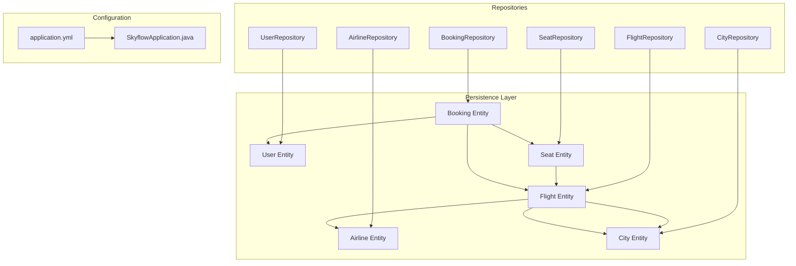
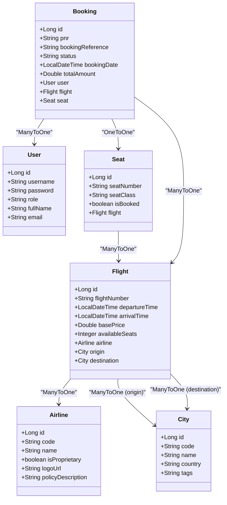
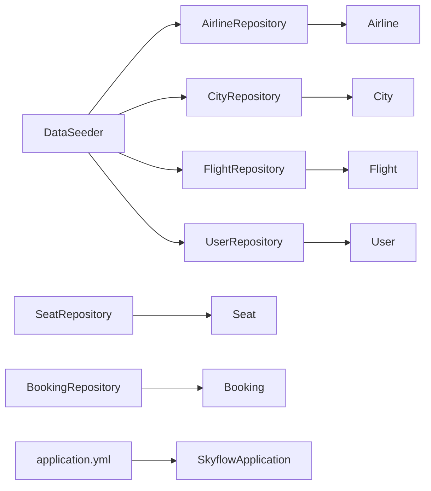

# Data Models & Database Design

<cite>
**Referenced Files in This Document**
- [User.java](file://backend-server/src/main/java/com/skyflow/model/entity/User.java)
- [Flight.java](file://backend-server/src/main/java/com/skyflow/model/entity/Flight.java)
- [Booking.java](file://backend-server/src/main/java/com/skyflow/model/entity/Booking.java)
- [Seat.java](file://backend-server/src/main/java/com/skyflow/model/entity/Seat.java)
- [Airline.java](file://backend-server/src/main/java/com/skyflow/model/entity/Airline.java)
- [City.java](file://backend-server/src/main/java/com/skyflow/model/entity/City.java)
- [UserRepository.java](file://backend-server/src/main/java/com/skyflow/repository/UserRepository.java)
- [FlightRepository.java](file://backend-server/src/main/java/com/skyflow/repository/FlightRepository.java)
- [BookingRepository.java](file://backend-server/src/main/java/com/skyflow/repository/BookingRepository.java)
- [SeatRepository.java](file://backend-server/src/main/java/com/skyflow/repository/SeatRepository.java)
- [AirlineRepository.java](file://backend-server/src/main/java/com/skyflow/repository/AirlineRepository.java)
- [CityRepository.java](file://backend-server/src/main/java/com/skyflow/repository/CityRepository.java)
- [DataSeeder.java](file://backend-server/src/main/java/com/skyflow/common/DataSeeder.java)
- [application.yml](file://backend-server/src/main/resources/application.yml)
- [SkyflowApplication.java](file://backend-server/src/main/java/com/skyflow/SkyflowApplication.java)
</cite>

## Table of Contents
1. [Introduction](#introduction)
2. [Project Structure](#project-structure)
3. [Core Components](#core-components)
4. [Architecture Overview](#architecture-overview)
5. [Detailed Component Analysis](#detailed-component-analysis)
6. [Dependency Analysis](#dependency-analysis)
7. [Performance Considerations](#performance-considerations)
8. [Troubleshooting Guide](#troubleshooting-guide)
9. [Conclusion](#conclusion)
10. [Appendices](#appendices)

## Introduction
This document describes the SkyFlow Pro database schema and its JPA entity model. It covers all entities (User, Flight, Booking, Seat, Airline, City), their fields, data types, primary and foreign keys, indexes, and constraints. It explains JPA annotations, entity mappings, repository patterns, and how the application initializes and seeds data. It also documents validation rules, business constraints, referential integrity, and performance considerations for the in-memory H2 database.

## Project Structure
The backend server implements the persistence layer with JPA/Hibernate and Spring Data JPA repositories. Entities are mapped to relational tables, and repositories expose typed query methods. Application configuration defines an in-memory H2 database with SQL logging and H2 Console access.



**Diagram sources**
- [application.yml:1-30](file://backend-server/src/main/resources/application.yml#L1-L30)
- [SkyflowApplication.java:1-14](file://backend-server/src/main/java/com/skyflow/SkyflowApplication.java#L1-L14)

**Section sources**
- [application.yml:1-30](file://backend-server/src/main/resources/application.yml#L1-L30)
- [SkyflowApplication.java:1-14](file://backend-server/src/main/java/com/skyflow/SkyflowApplication.java#L1-L14)

## Core Components
This section documents each entity’s fields, data types, constraints, and relationships. It also outlines repository interfaces and their method contracts.

- User
  - Fields: id (Long), username (String), password (String), role (String), fullName (String), email (String)
  - Constraints: username is unique and not null; password is not null; role is not null
  - JPA: @Entity, @Table(name="users"), @Id, @GeneratedValue, @Column with constraints
  - Repository: UserRepository extends JpaRepository<User, Long>; custom methods: findByUsername, existsByUsername

- Airline
  - Fields: id (Long), code (String), name (String), isProprietary (boolean), logoUrl (String), policyDescription (String)
  - Constraints: code is unique and not null; name is not null; policyDescription length up to 1000
  - JPA: @Entity, @Table(name="airlines"), @Id, @GeneratedValue, @Column with unique and length constraints
  - Repository: AirlineRepository extends JpaRepository<Airline, Long>; custom method: findByCode

- City
  - Fields: id (Long), code (String), name (String), country (String), tags (String)
  - Constraints: code is unique and not null; name is not null
  - JPA: @Entity, @Table(name="cities"), @Id, @GeneratedValue, @Column with unique constraint
  - Repository: CityRepository extends JpaRepository<City, Long>; custom methods: findByCode, findByTagsContaining

- Flight
  - Fields: id (Long), flightNumber (String), departureTime (LocalDateTime), arrivalTime (LocalDateTime), basePrice (Double), availableSeats (Integer), airline (Airline), origin (City), destination (City)
  - Constraints: flightNumber not null; departureTime not null; arrivalTime not null; basePrice not null; availableSeats not null
  - Relationships: ManyToOne to Airline, City (origin), City (destination)
  - JPA: @Entity, @Table(name="flights"), @Id, @GeneratedValue, @ManyToOne with @JoinColumn
  - Repository: FlightRepository extends JpaRepository<Flight, Long>; custom methods: findFlights (by origin/destination/time range), findByOriginAndDestination

- Seat
  - Fields: id (Long), seatNumber (String), seatClass (String), isBooked (boolean), flight (Flight)
  - Constraints: seatNumber not null; seatClass not null; unique constraint on (flight_id, seatNumber)
  - Relationships: ManyToOne to Flight
  - JPA: @Entity, @Table(name="seats"), @Id, @GeneratedValue, @ManyToOne with @JoinColumn, @UniqueConstraint
  - Repository: SeatRepository extends JpaRepository<Seat, Long>; custom methods: findByIdWithLock (pessimistic write lock), findByFlightAndSeatNumber, countBookedSeatsByFlight, findByFlightAndIsBooked

- Booking
  - Fields: id (Long), pnr (String), bookingReference (String), status (String), bookingDate (LocalDateTime), totalAmount (Double), user (User), flight (Flight), seat (Seat)
  - Constraints: pnr is unique and not null; bookingReference is unique; status not null
  - Relationships: ManyToOne to User, Flight; OneToOne to Seat
  - JPA: @Entity, @Table(name="bookings"), @Id, @GeneratedValue, @ManyToOne/@OneToOne with @JoinColumn
  - Repository: BookingRepository extends JpaRepository<Booking, Long>; custom methods: findByUser, findByPnr

**Section sources**
- [User.java:1-31](file://backend-server/src/main/java/com/skyflow/model/entity/User.java#L1-L31)
- [Airline.java:1-29](file://backend-server/src/main/java/com/skyflow/model/entity/Airline.java#L1-L29)
- [City.java:1-26](file://backend-server/src/main/java/com/skyflow/model/entity/City.java#L1-L26)
- [Flight.java:1-43](file://backend-server/src/main/java/com/skyflow/model/entity/Flight.java#L1-L43)
- [Seat.java:1-30](file://backend-server/src/main/java/com/skyflow/model/entity/Seat.java#L1-L30)
- [Booking.java:1-42](file://backend-server/src/main/java/com/skyflow/model/entity/Booking.java#L1-L42)
- [UserRepository.java:1-12](file://backend-server/src/main/java/com/skyflow/repository/UserRepository.java#L1-L12)
- [AirlineRepository.java:1-10](file://backend-server/src/main/java/com/skyflow/repository/AirlineRepository.java#L1-L10)
- [CityRepository.java:1-13](file://backend-server/src/main/java/com/skyflow/repository/CityRepository.java#L1-L13)
- [FlightRepository.java:1-22](file://backend-server/src/main/java/com/skyflow/repository/FlightRepository.java#L1-L22)
- [SeatRepository.java:1-25](file://backend-server/src/main/java/com/skyflow/repository/SeatRepository.java#L1-L25)
- [BookingRepository.java:1-14](file://backend-server/src/main/java/com/skyflow/repository/BookingRepository.java#L1-L14)

## Architecture Overview
The persistence layer follows a classic JPA/Hibernate pattern with Spring Data JPA repositories. Entities encapsulate domain data and relationships; repositories provide CRUD and derived queries. The application uses an in-memory H2 database configured via application.yml.



**Diagram sources**
- [User.java:1-31](file://backend-server/src/main/java/com/skyflow/model/entity/User.java#L1-L31)
- [Airline.java:1-29](file://backend-server/src/main/java/com/skyflow/model/entity/Airline.java#L1-L29)
- [City.java:1-26](file://backend-server/src/main/java/com/skyflow/model/entity/City.java#L1-L26)
- [Flight.java:1-43](file://backend-server/src/main/java/com/skyflow/model/entity/Flight.java#L1-L43)
- [Seat.java:1-30](file://backend-server/src/main/java/com/skyflow/model/entity/Seat.java#L1-L30)
- [Booking.java:1-42](file://backend-server/src/main/java/com/skyflow/model/entity/Booking.java#L1-L42)

## Detailed Component Analysis

### Entity Relationship Model
This ER view highlights primary keys, foreign keys, unique constraints, and indexes implied by the JPA mappings.

```mermaid
erDiagram
USERS {
BIGINT id PK
VARCHAR username UK
VARCHAR password
VARCHAR role
VARCHAR fullName
VARCHAR email
}
AIRLINES {
BIGINT id PK
VARCHAR code UK
VARCHAR name
BOOLEAN isProprietary
VARCHAR logoUrl
VARCHAR policyDescription
}
CITIES {
BIGINT id PK
VARCHAR code UK
VARCHAR name
VARCHAR country
VARCHAR tags
}
FLIGHTS {
BIGINT id PK
VARCHAR flightNumber
BIGINT airline_id FK
BIGINT origin_id FK
BIGINT destination_id FK
TIMESTAMP departureTime
TIMESTAMP arrivalTime
DECIMAL basePrice
INTEGER availableSeats
}
SEATS {
BIGINT id PK
BIGINT flight_id FK
VARCHAR seatNumber
VARCHAR seatClass
BOOLEAN isBooked
UNIQUE KEY (flight_id, seatNumber)
}
BOOKINGS {
BIGINT id PK
VARCHAR pnr UK
VARCHAR bookingReference UK
BIGINT user_id FK
BIGINT flight_id FK
BIGINT seat_id FK
VARCHAR status
TIMESTAMP bookingDate
DECIMAL totalAmount
}
USERS ||--o{ BOOKINGS : "has"
AIRLINES ||--o{ FLIGHTS : "operates"
CITIES ||--o{ FLIGHTS : "origin"
CITIES ||--o{ FLIGHTS : "destination"
FLIGHTS ||--o{ SEATS : "has"
FLIGHTS ||--o{ BOOKINGS : "booked on"
SEATS ||--|| BOOKINGS : "assigned to"
```

**Diagram sources**
- [User.java:14-29](file://backend-server/src/main/java/com/skyflow/model/entity/User.java#L14-L29)
- [Airline.java:12-27](file://backend-server/src/main/java/com/skyflow/model/entity/Airline.java#L12-L27)
- [City.java:12-24](file://backend-server/src/main/java/com/skyflow/model/entity/City.java#L12-L24)
- [Flight.java:13-41](file://backend-server/src/main/java/com/skyflow/model/entity/Flight.java#L13-L41)
- [Seat.java:14-28](file://backend-server/src/main/java/com/skyflow/model/entity/Seat.java#L14-L28)
- [Booking.java:13-40](file://backend-server/src/main/java/com/skyflow/model/entity/Booking.java#L13-L40)

### Data Validation Rules and Business Constraints
- Identity and uniqueness
  - username (User): unique and not null
  - code (Airline): unique and not null
  - code (City): unique and not null
  - pnr (Booking): unique and not null
  - bookingReference (Booking): unique
  - Seat.(flight_id, seatNumber): unique composite
- Required fields
  - password (User): not null
  - role (User): not null
  - flightNumber (Flight): not null
  - departureTime (Flight): not null
  - arrivalTime (Flight): not null
  - basePrice (Flight): not null
  - availableSeats (Flight): not null
  - seatNumber (Seat): not null
  - seatClass (Seat): not null
  - status (Booking): not null
- Referential integrity
  - Flight.airline_id references AIRLINES.id
  - Flight.origin_id references CITIES.id
  - Flight.destination_id references CITIES.id
  - Seat.flight_id references FLIGHTS.id
  - Booking.user_id references USERS.id
  - Booking.flight_id references FLIGHTS.id
  - Booking.seat_id references SEATS.id
- Additional constraints
  - Airline.policyDescription length up to 1000
  - Seat.isBooked flag indicates availability state

**Section sources**
- [User.java:18-26](file://backend-server/src/main/java/com/skyflow/model/entity/User.java#L18-L26)
- [Airline.java:16-27](file://backend-server/src/main/java/com/skyflow/model/entity/Airline.java#L16-L27)
- [City.java:16-24](file://backend-server/src/main/java/com/skyflow/model/entity/City.java#L16-L24)
- [Flight.java:17-41](file://backend-server/src/main/java/com/skyflow/model/entity/Flight.java#L17-L41)
- [Seat.java:10-12](file://backend-server/src/main/java/com/skyflow/model/entity/Seat.java#L10-L12)
- [Seat.java:22-28](file://backend-server/src/main/java/com/skyflow/model/entity/Seat.java#L22-L28)
- [Booking.java:17-40](file://backend-server/src/main/java/com/skyflow/model/entity/Booking.java#L17-L40)

### Repository Patterns and Method Contracts
- UserRepository
  - Methods: findByUsername(String), existsByUsername(String)
- AirlineRepository
  - Methods: findByCode(String)
- CityRepository
  - Methods: findByCode(String), findByTagsContaining(String)
- FlightRepository
  - Methods: findFlights(@Param("origin"), @Param("destination"), @Param("startTime"), @Param("endTime")), findByOriginAndDestination(City, City)
- SeatRepository
  - Methods: findByIdWithLock(Long) with PESSIMISTIC_WRITE, findByFlightAndSeatNumber(Flight, String), countBookedSeatsByFlight(Flight), findByFlightAndIsBooked(Flight, boolean)
- BookingRepository
  - Methods: findByUser(User), findByPnr(String)

These methods enable search, lookup, and transaction-safe seat selection.

**Section sources**
- [UserRepository.java:7-11](file://backend-server/src/main/java/com/skyflow/repository/UserRepository.java#L7-L11)
- [AirlineRepository.java:7-9](file://backend-server/src/main/java/com/skyflow/repository/AirlineRepository.java#L7-L9)
- [CityRepository.java:8-12](file://backend-server/src/main/java/com/skyflow/repository/CityRepository.java#L8-L12)
- [FlightRepository.java:12-21](file://backend-server/src/main/java/com/skyflow/repository/FlightRepository.java#L12-L21)
- [SeatRepository.java:13-24](file://backend-server/src/main/java/com/skyflow/repository/SeatRepository.java#L13-L24)
- [BookingRepository.java:9-13](file://backend-server/src/main/java/com/skyflow/repository/BookingRepository.java#L9-L13)

### Sample Data Structures
Below are representative row structures for each table. These illustrate typical values after seeding.

- Users
  - Columns: id, username, password, role, fullName, email
  - Example rows: user account with role USER, admin account with role ADMIN

- Airlines
  - Columns: id, code, name, isProprietary, logoUrl, policyDescription
  - Example rows: Patro Airlines (code PT, proprietary), partner carriers (codes UA, DL, AA, BA, LH, EK)

- Cities
  - Columns: id, code, name, country, tags
  - Example rows: major hubs (JFK, LHR, DXB, LAX, ORD, BLR), leisure destinations (MIA, GOI, SYD, DEN, ZRH, BKK, VNS)

- Flights
  - Columns: id, flightNumber, airline_id, origin_id, destination_id, departureTime, arrivalTime, basePrice, availableSeats
  - Example rows: multiple flights per route per day, with randomized departure times and durations

- Seats
  - Columns: id, flight_id, seatNumber, seatClass, isBooked
  - Example rows: seats per flight with unique seatNumber per flight

- Bookings
  - Columns: id, pnr, bookingReference, user_id, flight_id, seat_id, status, bookingDate, totalAmount
  - Example rows: confirmed bookings with associated user, flight, and seat

**Section sources**
- [DataSeeder.java:37-111](file://backend-server/src/main/java/com/skyflow/common/DataSeeder.java#L37-L111)
- [DataSeeder.java:113-198](file://backend-server/src/main/java/com/skyflow/common/DataSeeder.java#L113-L198)

## Dependency Analysis
Repositories depend on entities and are used by services. The DataSeeder depends on repositories to initialize data. The application configuration binds JPA/Hibernate to H2.



**Diagram sources**
- [DataSeeder.java:18-27](file://backend-server/src/main/java/com/skyflow/common/DataSeeder.java#L18-L27)
- [application.yml:1-30](file://backend-server/src/main/resources/application.yml#L1-L30)
- [SkyflowApplication.java:1-14](file://backend-server/src/main/java/com/skyflow/SkyflowApplication.java#L1-L14)

**Section sources**
- [DataSeeder.java:18-27](file://backend-server/src/main/java/com/skyflow/common/DataSeeder.java#L18-L27)
- [application.yml:1-30](file://backend-server/src/main/resources/application.yml#L1-L30)
- [SkyflowApplication.java:1-14](file://backend-server/src/main/java/com/skyflow/SkyflowApplication.java#L1-L14)

## Performance Considerations
- In-memory H2 database
  - Benefits: fast startup, low overhead, suitable for development/testing
  - Limitations: no persistence across restarts, concurrency limits compared to external databases
- Indexes and constraints
  - Unique indexes on username (Users), code (Airlines, Cities), pnr and bookingReference (Bookings), and (flight_id, seatNumber) (Seats) improve lookup performance and enforce uniqueness
- Query patterns
  - FlightRepository exposes time-range filtering and origin/destination matching; consider adding indexes on Flight(origin_id, destination_id, departureTime) for frequent searches
  - SeatRepository supports pessimistic locking for safe concurrent seat selection; ensure transactions are short-lived
- Logging and diagnostics
  - SQL logging is enabled; monitor for N+1 selects and optimize projections
- Caching
  - No explicit cache configuration is present; for read-heavy workloads, consider adding Spring Cache or a second-level cache (e.g., Ehcache) for immutable reference data (Airlines, Cities)

[No sources needed since this section provides general guidance]

## Troubleshooting Guide
- Duplicate key violations
  - Symptoms: unique constraint errors on username, code, pnr, bookingReference, or (flight_id, seatNumber)
  - Causes: attempting to insert duplicates
  - Resolution: ensure uniqueness checks before save; use repository.existsBy* methods
- Foreign key constraint failures
  - Symptoms: integrity errors when linking entities
  - Causes: missing or invalid foreign keys
  - Resolution: verify related entities exist before association; confirm join columns match referenced ids
- Seat selection race conditions
  - Symptoms: duplicate seat assignments under load
  - Causes: lack of locking during selection
  - Resolution: use SeatRepository.findByIdWithLock to acquire a PESSIMISTIC_WRITE lock before update
- H2 console access
  - Enablement: H2 console is enabled in configuration; access via /h2-console when running the app
- Slow initial seeding
  - Cause: generating flights for multiple routes/days
  - Mitigation: DataSeeder currently seeds a limited window for performance; adjust as needed for testing

**Section sources**
- [SeatRepository.java:14-16](file://backend-server/src/main/java/com/skyflow/repository/SeatRepository.java#L14-L16)
- [application.yml:14-17](file://backend-server/src/main/resources/application.yml#L14-L17)
- [DataSeeder.java:113-198](file://backend-server/src/main/java/com/skyflow/common/DataSeeder.java#L113-L198)

## Conclusion
The SkyFlow Pro data model centers on six core entities with clear relationships and constraints. JPA/Hibernate and Spring Data JPA provide a robust foundation for persistence, while the in-memory H2 database simplifies development and testing. The DataSeeder populates realistic reference and operational data. By leveraging repository-derived queries, enforcing uniqueness constraints, and applying pessimistic locking for seat selection, the system maintains correctness and performance for its use cases.

[No sources needed since this section summarizes without analyzing specific files]

## Appendices

### Database Initialization and Seed Strategy
- Initialization
  - Spring Boot auto-configures JPA/Hibernate and H2 based on application.yml
  - DDL mode is set to update; tables and constraints are created/updated accordingly
- Seed data
  - DataSeeder runs at startup and inserts Users, Airlines, Cities, and Flights
  - Seeding is skipped if tables are not empty, preventing duplication
  - Flights are generated for a limited future window to keep startup fast

**Section sources**
- [application.yml:4-17](file://backend-server/src/main/resources/application.yml#L4-L17)
- [DataSeeder.java:29-35](file://backend-server/src/main/java/com/skyflow/common/DataSeeder.java#L29-L35)
- [DataSeeder.java:37-111](file://backend-server/src/main/java/com/skyflow/common/DataSeeder.java#L37-L111)
- [DataSeeder.java:113-198](file://backend-server/src/main/java/com/skyflow/common/DataSeeder.java#L113-L198)