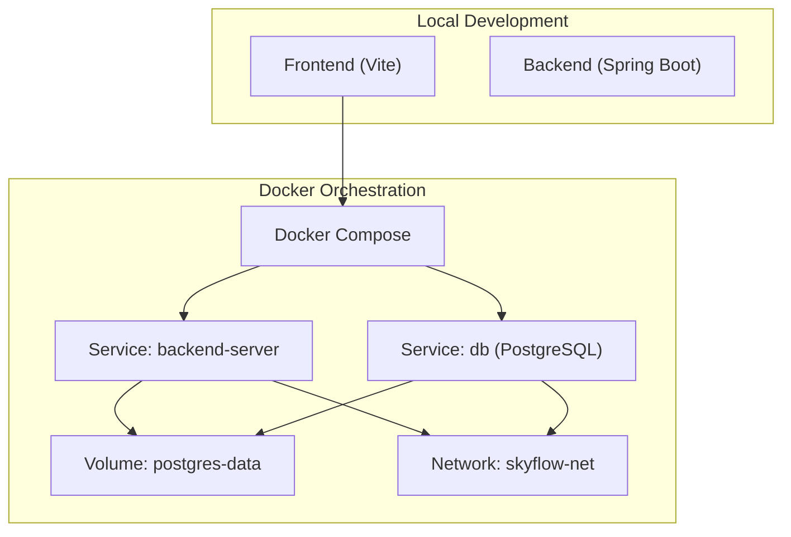
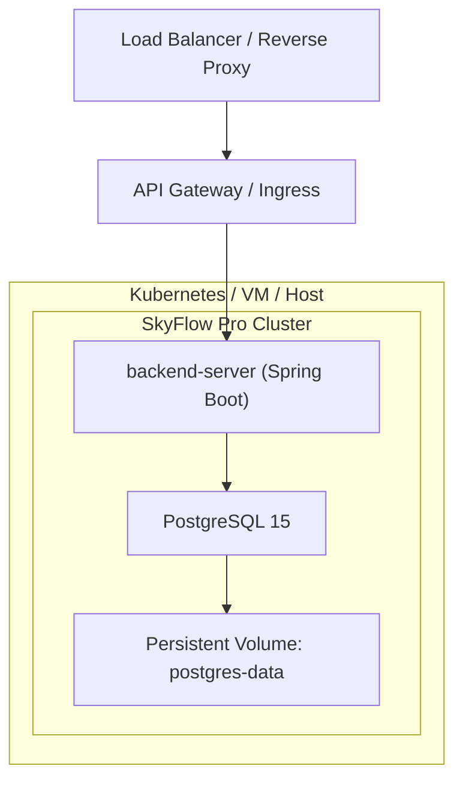
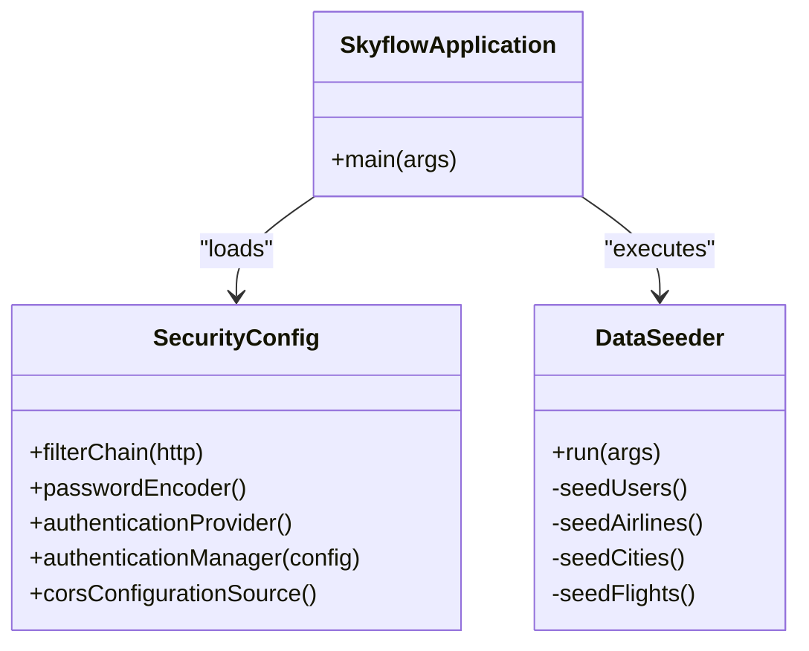
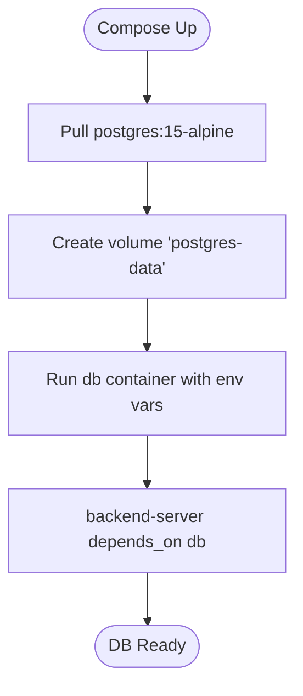
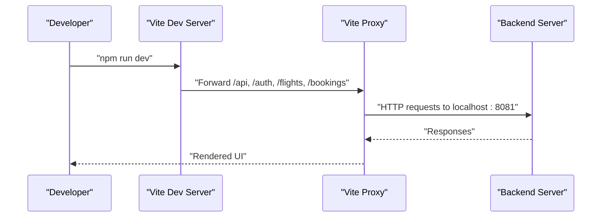
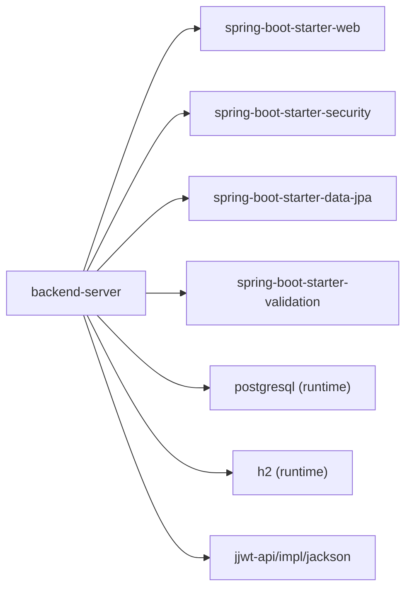

# Deployment & Operations

<cite>
**Referenced Files in This Document**
- [Dockerfile](file://backend-server/Dockerfile)
- [docker-compose.yml](file://backend-server/docker-compose.yml)
- [pom.xml](file://backend-server/pom.xml)
- [application.yml](file://backend-server/src/main/resources/application.yml)
- [README.md](file://backend-server/README.md)
- [SecurityConfig.java](file://backend-server/src/main/java/com/skyflow/config/SecurityConfig.java)
- [SkyflowApplication.java](file://backend-server/src/main/java/com/skyflow/SkyflowApplication.java)
- [DataSeeder.java](file://backend-server/src/main/java/com/skyflow/common/DataSeeder.java)
- [package.json](file://skyflow-pro/package.json)
- [vite.config.ts](file://skyflow-pro/vite.config.ts)
- [CONNECTION-GUIDE.md](file://CONNECTION-GUIDE.md)
- [run-all.bat](file://run-all.bat)
- [run-backend.bat](file://backend-server/run-backend.bat)
- [run_log.txt](file://backend-server/run_log.txt)
</cite>

## Table of Contents
1. [Introduction](#introduction)
2. [Project Structure](#project-structure)
3. [Core Components](#core-components)
4. [Architecture Overview](#architecture-overview)
5. [Detailed Component Analysis](#detailed-component-analysis)
6. [Dependency Analysis](#dependency-analysis)
7. [Performance Considerations](#performance-considerations)
8. [Troubleshooting Guide](#troubleshooting-guide)
9. [Conclusion](#conclusion)
10. [Appendices](#appendices)

## Introduction
This document provides comprehensive deployment and operations guidance for SkyFlow Pro. It covers containerization with Docker, Docker Compose orchestration, environment configuration, database migration and seeding, scaling considerations, monitoring and logging, performance optimization, backup and disaster recovery, security hardening, SSL/TLS configuration, and operational troubleshooting. The content is grounded in the repository’s backend server, frontend, and supporting configuration files.

## Project Structure
SkyFlow Pro consists of:
- A Spring Boot backend service (Java 17, Maven, PostgreSQL runtime)
- A React-based frontend (TypeScript, Vite) with development-time proxy to the backend
- Containerization and orchestration via Docker and Docker Compose
- Runtime configuration via Spring profiles and environment variables

**Diagram sources**
- [docker-compose.yml:1-36](file://backend-server/docker-compose.yml#L1-L36)
- [vite.config.ts:1-53](file://skyflow-pro/vite.config.ts#L1-L53)

**Section sources**
- [README.md:1-78](file://backend-server/README.md#L1-L78)
- [docker-compose.yml:1-36](file://backend-server/docker-compose.yml#L1-L36)
- [pom.xml:1-165](file://backend-server/pom.xml#L1-L165)

## Core Components
- Backend service
  - Built with Spring Boot 3.2.1, Java 17, and packaged as a self-contained JAR.
  - Exposes REST endpoints for authentication, flights, bookings, notifications, and chat.
  - Uses Spring Data JPA with Hibernate and supports PostgreSQL via JDBC.
  - Includes a JWT-based security filter chain and H2 console for development.
- Database
  - PostgreSQL 15 is used in production via Docker Compose; H2 in-memory is used by default for local development.
  - Automatic schema generation/update is enabled via Hibernate DDL auto property.
- Frontend
  - React application built with Vite, TypeScript, TailwindCSS, and React Router.
  - Development proxy forwards API requests to the backend on port 8081.
- Containerization
  - Multi-stage Docker build: Maven build stage followed by a minimal JRE Alpine runtime stage.
  - Docker Compose defines two services: backend-server and db, with a named volume for persistent data.

**Section sources**
- [SkyflowApplication.java:1-14](file://backend-server/src/main/java/com/skyflow/SkyflowApplication.java#L1-L14)
- [application.yml:1-30](file://backend-server/src/main/resources/application.yml#L1-L30)
- [pom.xml:74-137](file://backend-server/pom.xml#L74-L137)
- [Dockerfile:1-11](file://backend-server/Dockerfile#L1-L11)
- [docker-compose.yml:1-36](file://backend-server/docker-compose.yml#L1-L36)
- [vite.config.ts:14-47](file://skyflow-pro/vite.config.ts#L14-L47)

## Architecture Overview
The production-grade architecture relies on Docker Compose to run the backend and database as separate containers, connected via an internal network and a persistent volume for PostgreSQL data.

**Diagram sources**
- [docker-compose.yml:18-29](file://backend-server/docker-compose.yml#L18-L29)
- [docker-compose.yml:26-27](file://backend-server/docker-compose.yml#L26-L27)

## Detailed Component Analysis

### Backend Service (Spring Boot)
- Build and packaging
  - Multi-stage Docker build: Maven build stage produces a JAR; runtime stage copies the JAR into a lightweight JRE Alpine image.
- Runtime configuration
  - Default H2 in-memory database for development; PostgreSQL URL, credentials, and dialect are configurable via environment variables.
  - Logging level for Spring Security is set; server port defaults to 8081 in YAML but runs on 8080 in Compose.
- Security
  - Stateless session policy, JWT filter chain, permissive CORS configuration for development, and explicit public endpoints.
- Data seeding
  - On first startup, the application seeds airlines, cities, and flights, and creates default users.

**Diagram sources**
- [SkyflowApplication.java:1-14](file://backend-server/src/main/java/com/skyflow/SkyflowApplication.java#L1-L14)
- [SecurityConfig.java:1-81](file://backend-server/src/main/java/com/skyflow/config/SecurityConfig.java#L1-L81)
- [DataSeeder.java:1-136](file://backend-server/src/main/java/com/skyflow/common/DataSeeder.java#L1-L136)

**Section sources**
- [Dockerfile:1-11](file://backend-server/Dockerfile#L1-L11)
- [application.yml:1-30](file://backend-server/src/main/resources/application.yml#L1-L30)
- [SecurityConfig.java:50-67](file://backend-server/src/main/java/com/skyflow/config/SecurityConfig.java#L50-L67)
- [DataSeeder.java:29-35](file://backend-server/src/main/java/com/skyflow/common/DataSeeder.java#L29-L35)

### Database Service (PostgreSQL)
- Compose configuration provisions PostgreSQL 15 with a named volume for durability.
- Environment variables define database name, user, and password.
- Backend connects using the PostgreSQL JDBC driver.

**Diagram sources**
- [docker-compose.yml:18-29](file://backend-server/docker-compose.yml#L18-L29)

**Section sources**
- [docker-compose.yml:18-29](file://backend-server/docker-compose.yml#L18-L29)
- [pom.xml:97-102](file://backend-server/pom.xml#L97-L102)

### Frontend (React/Vite)
- Development proxy forwards API routes to the backend on port 8081.
- Scripts include dev, build, lint, test, and coverage.

**Diagram sources**
- [vite.config.ts:14-47](file://skyflow-pro/vite.config.ts#L14-L47)

**Section sources**
- [vite.config.ts:14-47](file://skyflow-pro/vite.config.ts#L14-L47)
- [package.json:6-14](file://skyflow-pro/package.json#L6-L14)

## Dependency Analysis
Runtime dependencies relevant to deployment and operations:
- Spring Boot starters for web, security, validation, and data JPA
- PostgreSQL JDBC driver and H2 runtime
- JWT libraries for token handling
- Tomcat embedded core and Jackson for JSON processing

**Diagram sources**
- [pom.xml:74-137](file://backend-server/pom.xml#L74-L137)

**Section sources**
- [pom.xml:74-137](file://backend-server/pom.xml#L74-L137)

## Performance Considerations
- JVM and container sizing
  - Use a JRE Alpine runtime image for reduced footprint; allocate sufficient CPU/memory in production environments.
- Database connection pooling
  - HikariCP is included; tune pool size and timeouts via Spring properties in production.
- Caching and retries
  - Consider adding client-side caching and retry/backoff for upstream services.
- Logging overhead
  - Keep log levels at INFO or WARN in production; avoid excessive DEBUG traces.
- Health checks
  - Expose readiness/liveness probes in Kubernetes or platform-specific health endpoints.

[No sources needed since this section provides general guidance]

## Troubleshooting Guide

### Port Conflicts
- Symptom: Backend fails to start with a port binding error.
- Cause: Port 8081 already in use.
- Resolution: Stop the conflicting process or change the server port in configuration.

**Section sources**
- [run_log.txt:72-76](file://backend-server/run_log.txt#L72-L76)

### Database Connectivity
- Symptom: Database connection failures in Compose.
- Cause: Local PostgreSQL instance occupying port 5432 or incorrect credentials.
- Resolution: Stop local instances, adjust Compose port mapping, or update environment variables.

**Section sources**
- [README.md:63-67](file://backend-server/README.md#L63-L67)
- [docker-compose.yml:24-25](file://backend-server/docker-compose.yml#L24-L25)
- [docker-compose.yml:20-23](file://backend-server/docker-compose.yml#L20-L23)

### CORS and Authentication
- Symptom: Cross-origin errors or unauthorized access.
- Cause: Permissive CORS configuration and JWT token requirements.
- Resolution: Configure allowed origins and enforce tokens for protected endpoints.

**Section sources**
- [SecurityConfig.java:69-79](file://backend-server/src/main/java/com/skyflow/config/SecurityConfig.java#L69-L79)
- [SecurityConfig.java:50-61](file://backend-server/src/main/java/com/skyflow/config/SecurityConfig.java#L50-L61)

### Development vs Production Ports
- Observation: YAML sets server.port to 8081, but Compose exposes 8080.
- Impact: Ensure clients and proxies align with published port 8080.

**Section sources**
- [application.yml:19-20](file://backend-server/src/main/resources/application.yml#L19-L20)
- [docker-compose.yml:6-7](file://backend-server/docker-compose.yml#L6-L7)
- [CONNECTION-GUIDE.md:50-54](file://CONNECTION-GUIDE.md#L50-L54)

### Running Locally
- Backend only: Use the provided batch script to launch Spring Boot on port 8081.
- Full stack: Use the combined batch script to start backend and frontend.

**Section sources**
- [run-backend.bat:1-3](file://backend-server/run-backend.bat#L1-L3)
- [run-all.bat:7-15](file://run-all.bat#L7-L15)

## Conclusion
SkyFlow Pro is designed for straightforward containerized deployment with Docker and Docker Compose. The backend is production-ready with PostgreSQL, while the frontend integrates seamlessly with a development proxy. For production, focus on environment-driven configuration, persistent storage, health checks, and security hardening aligned with your platform’s standards.

[No sources needed since this section summarizes without analyzing specific files]

## Appendices

### A. Environment Configuration
- Backend environment variables
  - SPRING_DATASOURCE_URL: JDBC URL for PostgreSQL
  - SPRING_DATASOURCE_USERNAME: Database user
  - SPRING_DATASOURCE_PASSWORD: Database password
  - SPRING_JPA_HIBERNATE_DDL_AUTO: Schema management mode
- Frontend development proxy
  - Targets backend on port 8081 during local development

**Section sources**
- [docker-compose.yml:8-12](file://backend-server/docker-compose.yml#L8-L12)
- [application.yml:4-11](file://backend-server/src/main/resources/application.yml#L4-L11)
- [vite.config.ts:14-47](file://skyflow-pro/vite.config.ts#L14-L47)

### B. Database Migration and Seeding
- Migration strategy
  - Hibernate DDL auto is configured; in production, prefer explicit migrations via a migration tool.
- Seeding
  - DataSeeder creates initial data on first startup.

**Section sources**
- [application.yml:10-11](file://backend-server/src/main/resources/application.yml#L10-L11)
- [DataSeeder.java:29-35](file://backend-server/src/main/java/com/skyflow/common/DataSeeder.java#L29-L35)

### C. Scaling Considerations
- Horizontal scaling
  - Stateless backend allows multiple replicas behind a load balancer.
- Database scaling
  - Use managed PostgreSQL with read replicas or connection pooling tuned for concurrency.
- Caching
  - Introduce Redis for session/stateless caching.

[No sources needed since this section provides general guidance]

### D. Monitoring and Logging
- Health endpoints
  - Expose readiness/liveness endpoints and integrate with platform health checks.
- Logs
  - Stream application logs and correlate with database logs.

[No sources needed since this section provides general guidance]

### E. Backup and Disaster Recovery
- PostgreSQL backups
  - Schedule regular logical backups using pg_dump and retain rotated snapshots.
- Volume durability
  - Persistent volume ensures data survives container restarts.

**Section sources**
- [docker-compose.yml:26-27](file://backend-server/docker-compose.yml#L26-L27)

### F. Security Hardening and TLS
- CORS
  - Restrict allowed origins in production.
- Secrets
  - Store database credentials and JWT secrets in a secrets manager.
- TLS
  - Terminate TLS at the reverse proxy or ingress; enable HTTPS and strong ciphers.

[No sources needed since this section provides general guidance]

### G. Production Best Practices
- Immutable artifacts
  - Build and push images to a registry; deploy via declarative manifests.
- Network policies
  - Limit backend-to-database connectivity to internal network.
- Secrets management
  - Inject secrets via environment variables or mounted files.

[No sources needed since this section provides general guidance]