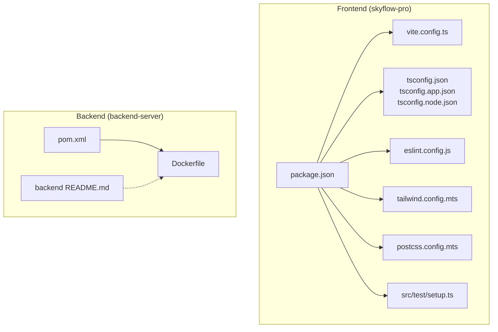
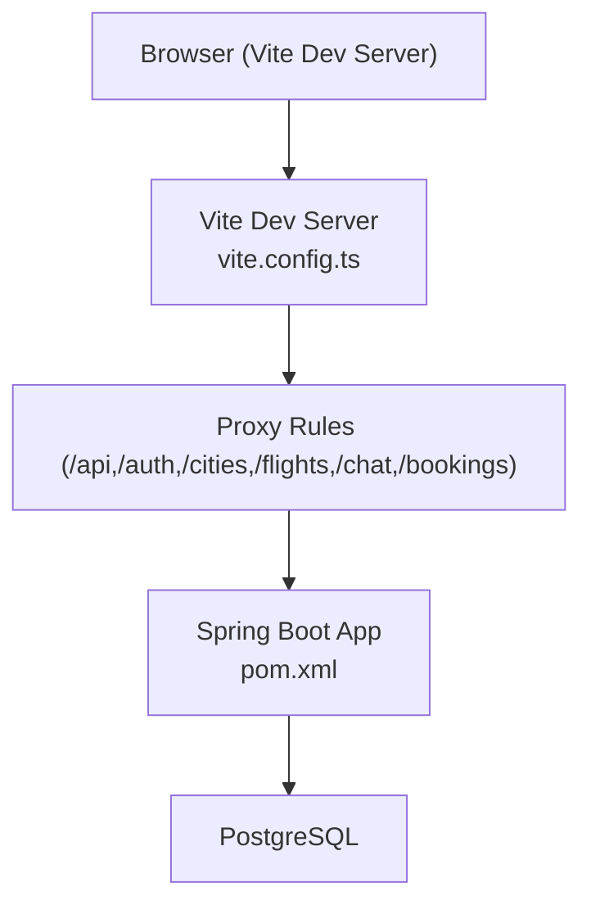
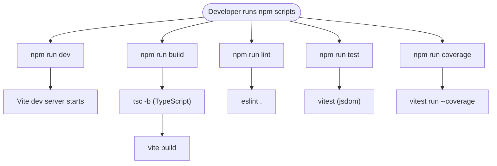
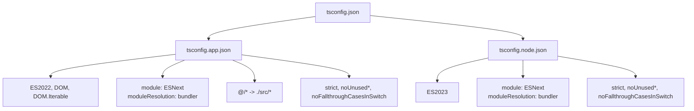
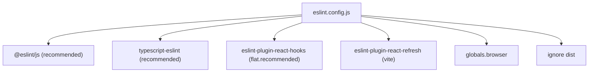
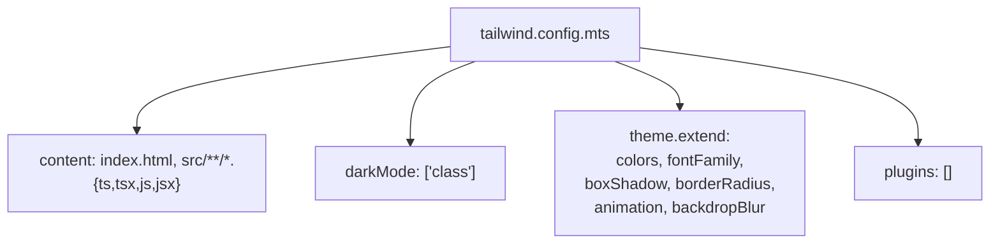
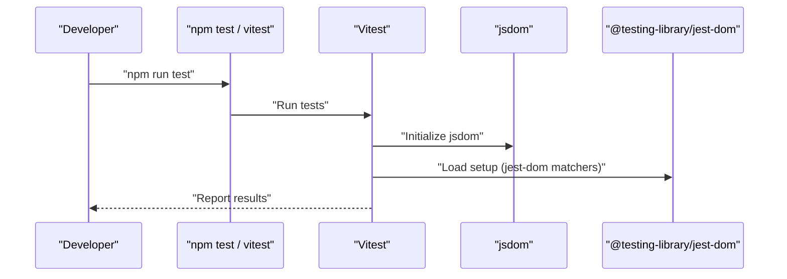
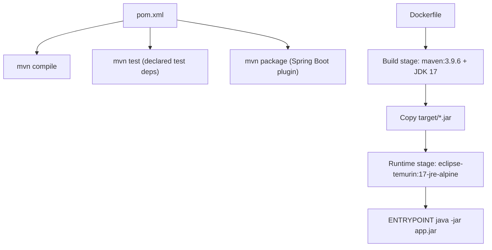
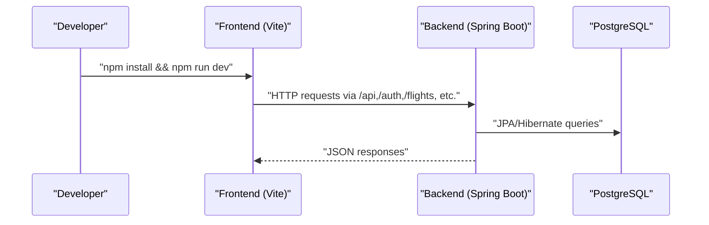
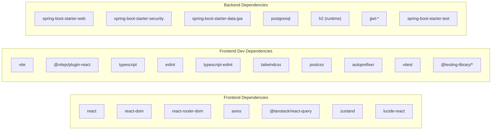

# Development Workflow

<cite>
**Referenced Files in This Document**
- [package.json](file://skyflow-pro/package.json)
- [vite.config.ts](file://skyflow-pro/vite.config.ts)
- [tsconfig.json](file://skyflow-pro/tsconfig.json)
- [tsconfig.app.json](file://skyflow-pro/tsconfig.app.json)
- [tsconfig.node.json](file://skyflow-pro/tsconfig.node.json)
- [eslint.config.js](file://skyflow-pro/eslint.config.js)
- [tailwind.config.mts](file://skyflow-pro/tailwind.config.mts)
- [postcss.config.mts](file://skyflow-pro/postcss.config.mts)
- [skyflow-pro README.md](file://skyflow-pro/README.md)
- [QUICK_START.md](file://skyflow-pro/QUICK_START.md)
- [setup.ts](file://skyflow-pro/src/test/setup.ts)
- [backend pom.xml](file://backend-server/pom.xml)
- [backend Dockerfile](file://backend-server/Dockerfile)
- [backend README.md](file://backend-server/README.md)
</cite>

## Table of Contents
1. [Introduction](#introduction)
2. [Project Structure](#project-structure)
3. [Core Components](#core-components)
4. [Architecture Overview](#architecture-overview)
5. [Detailed Component Analysis](#detailed-component-analysis)
6. [Dependency Analysis](#dependency-analysis)
7. [Performance Considerations](#performance-considerations)
8. [Troubleshooting Guide](#troubleshooting-guide)
9. [Conclusion](#conclusion)
10. [Appendices](#appendices)

## Introduction
This document describes the complete development workflow for SkyFlow Pro, covering frontend and backend environments, build and test processes, configuration, and deployment strategies. It explains TypeScript and ESLint setup, Tailwind CSS configuration, testing with Vitest, continuous integration readiness, dependency management, and development best practices. Guidance is grounded in the repository’s actual configuration and documentation.

## Project Structure
SkyFlow Pro consists of:
- Frontend (React + TypeScript + Vite + Tailwind) under skyflow-pro
- Backend (Spring Boot + PostgreSQL) under backend-server
- Enhanced frontend artifacts under skyflow-pro-enhanced
- Supporting documentation and quick-start guides

**Diagram sources**
- [package.json:1-46](file://skyflow-pro/package.json#L1-L46)
- [vite.config.ts:1-53](file://skyflow-pro/vite.config.ts#L1-L53)
- [tsconfig.json:1-8](file://skyflow-pro/tsconfig.json#L1-L8)
- [tsconfig.app.json:1-41](file://skyflow-pro/tsconfig.app.json#L1-L41)
- [tsconfig.node.json:1-27](file://skyflow-pro/tsconfig.node.json#L1-L27)
- [eslint.config.js:1-24](file://skyflow-pro/eslint.config.js#L1-L24)
- [tailwind.config.mts:1-124](file://skyflow-pro/tailwind.config.mts#L1-L124)
- [postcss.config.mts:1-8](file://skyflow-pro/postcss.config.mts#L1-L8)
- [setup.ts:1-3](file://skyflow-pro/src/test/setup.ts#L1-L3)
- [backend pom.xml:1-165](file://backend-server/pom.xml#L1-L165)
- [backend Dockerfile:1-11](file://backend-server/Dockerfile#L1-L11)
- [backend README.md:1-78](file://backend-server/README.md#L1-L78)

**Section sources**
- [package.json:1-46](file://skyflow-pro/package.json#L1-L46)
- [backend pom.xml:1-165](file://backend-server/pom.xml#L1-L165)

## Core Components
- Frontend build and dev toolchain powered by Vite, TypeScript, ESLint, and Tailwind CSS
- Testing with Vitest using jsdom environment and a setup file
- Backend managed with Maven, packaged as a Spring Boot executable JAR, and containerized with Docker
- Shared proxy configuration for local API development

Key capabilities:
- Development server with hot module replacement and API proxying
- Strict TypeScript compilation with separate app and node configs
- Comprehensive ESLint flat config with recommended rulesets
- Tailwind CSS with custom design tokens and animations
- Unit/integration testing with Vitest and Testing Library matchers

**Section sources**
- [package.json:6-14](file://skyflow-pro/package.json#L6-L14)
- [vite.config.ts:7-52](file://skyflow-pro/vite.config.ts#L7-L52)
- [tsconfig.app.json:24-36](file://skyflow-pro/tsconfig.app.json#L24-L36)
- [eslint.config.js:8-23](file://skyflow-pro/eslint.config.js#L8-L23)
- [tailwind.config.mts:3-121](file://skyflow-pro/tailwind.config.mts#L3-L121)
- [setup.ts:1-3](file://skyflow-pro/src/test/setup.ts#L1-L3)
- [backend pom.xml:139-162](file://backend-server/pom.xml#L139-L162)
- [backend Dockerfile:1-11](file://backend-server/Dockerfile#L1-L11)

## Architecture Overview
The frontend and backend communicate over HTTP. The frontend runs on Vite and proxies API requests to the backend running on localhost. The backend is a Spring Boot application packaged as a JAR and optionally containerized.

**Diagram sources**
- [vite.config.ts:14-47](file://skyflow-pro/vite.config.ts#L14-L47)
- [backend pom.xml:74-137](file://backend-server/pom.xml#L74-L137)

## Detailed Component Analysis

### Frontend Build and Tooling
- Scripts: dev, build, lint, preview, test, test:ui, coverage
- Plugins: @vitejs/plugin-react
- Path alias: @ resolves to src
- Server proxy: routes prefixed with /api, /auth, /cities, /flights, /chat, /bookings forwarded to http://localhost:8081
- Test environment: jsdom with setup file

**Diagram sources**
- [package.json:6-14](file://skyflow-pro/package.json#L6-L14)
- [vite.config.ts:7-52](file://skyflow-pro/vite.config.ts#L7-L52)

**Section sources**
- [package.json:6-14](file://skyflow-pro/package.json#L6-L14)
- [vite.config.ts:7-52](file://skyflow-pro/vite.config.ts#L7-L52)

### TypeScript Configuration
- Root tsconfig.json references app and node configs
- App config targets ES2022, JSX with react-jsx, strict flags, bundler module resolution, path alias @/*
- Node config targets ES2023, strict flags, bundler module resolution, included vite config

**Diagram sources**
- [tsconfig.json:1-8](file://skyflow-pro/tsconfig.json#L1-L8)
- [tsconfig.app.json:1-41](file://skyflow-pro/tsconfig.app.json#L1-L41)
- [tsconfig.node.json:1-27](file://skyflow-pro/tsconfig.node.json#L1-L27)

**Section sources**
- [tsconfig.json:1-8](file://skyflow-pro/tsconfig.json#L1-L8)
- [tsconfig.app.json:1-41](file://skyflow-pro/tsconfig.app.json#L1-L41)
- [tsconfig.node.json:1-27](file://skyflow-pro/tsconfig.node.json#L1-L27)

### ESLint Configuration
- Flat config extends recommended rules for JS, TS, React Hooks, and React Refresh
- Targets TS/TSX files, sets browser globals, ignores dist

**Diagram sources**
- [eslint.config.js:1-24](file://skyflow-pro/eslint.config.js#L1-L24)

**Section sources**
- [eslint.config.js:8-23](file://skyflow-pro/eslint.config.js#L8-L23)

### Tailwind CSS Setup
- Content scanning includes index.html and all TS/TSX/JS/JSX under src
- Dark mode using class strategy
- Custom color palette (navy, sky, slate, emerald, amber, purple, pink)
- Typography, shadows, border radius, animations, backdrop blur
- Plugins array empty (ready for future plugin additions)

**Diagram sources**
- [tailwind.config.mts:3-121](file://skyflow-pro/tailwind.config.mts#L3-L121)

**Section sources**
- [tailwind.config.mts:3-121](file://skyflow-pro/tailwind.config.mts#L3-L121)
- [postcss.config.mts:1-8](file://skyflow-pro/postcss.config.mts#L1-L8)

### Testing Strategy (Vitest)
- Environment: jsdom
- Setup file registers @testing-library/jest-dom
- Scripts: test, test:ui, coverage
- Example test file present under src/pages/FlightResults/ResultsPage.test.tsx

**Diagram sources**
- [package.json:11-13](file://skyflow-pro/package.json#L11-L13)
- [vite.config.ts:48-51](file://skyflow-pro/vite.config.ts#L48-L51)
- [setup.ts:1-3](file://skyflow-pro/src/test/setup.ts#L1-L3)

**Section sources**
- [package.json:11-13](file://skyflow-pro/package.json#L11-L13)
- [vite.config.ts:48-51](file://skyflow-pro/vite.config.ts#L48-L51)
- [setup.ts:1-3](file://skyflow-pro/src/test/setup.ts#L1-L3)

### Backend Build and Deployment
- Maven build with Java 17, Spring Boot plugins, and test dependencies
- Dockerfile builds with Maven, copies JAR to Alpine JRE image, runs java -jar app.jar
- Backend README documents prerequisites, Docker startup, API endpoints, and testing with curl

**Diagram sources**
- [backend pom.xml:139-162](file://backend-server/pom.xml#L139-L162)
- [backend Dockerfile:1-11](file://backend-server/Dockerfile#L1-L11)

**Section sources**
- [backend pom.xml:139-162](file://backend-server/pom.xml#L139-L162)
- [backend Dockerfile:1-11](file://backend-server/Dockerfile#L1-L11)
- [backend README.md:1-78](file://backend-server/README.md#L1-L78)

### Local Development Workflow
- Frontend: Install dependencies, run dev server; proxy routes to backend on 8081
- Backend: Use Docker Compose to start database and server, or run locally with Java 17 and Maven
- Environment variables: VITE_API_BASE_URL and VITE_USE_MOCKS control API behavior

**Diagram sources**
- [skyflow-pro README.md:5-38](file://skyflow-pro/README.md#L5-L38)
- [vite.config.ts:14-47](file://skyflow-pro/vite.config.ts#L14-L47)
- [backend README.md:11-27](file://backend-server/README.md#L11-L27)

**Section sources**
- [skyflow-pro README.md:5-38](file://skyflow-pro/README.md#L5-L38)
- [backend README.md:11-27](file://backend-server/README.md#L11-L27)

## Dependency Analysis
- Frontend dependencies include React, React Router, Axios, TanStack React Query, Zustand, and Lucide icons
- Dev dependencies include Vite, React plugin, TypeScript, ESLint, Tailwind CSS, PostCSS, Vitest, and Testing Library
- Backend dependencies include Spring Boot starters, Spring Security, PostgreSQL driver, H2 for runtime, Lombok, JWT libraries, and test frameworks

**Diagram sources**
- [package.json:15-44](file://skyflow-pro/package.json#L15-L44)
- [backend pom.xml:74-137](file://backend-server/pom.xml#L74-L137)

**Section sources**
- [package.json:15-44](file://skyflow-pro/package.json#L15-L44)
- [backend pom.xml:74-137](file://backend-server/pom.xml#L74-L137)

## Performance Considerations
- Prefer bundler module resolution and verbatim module syntax for faster builds
- Keep strict TypeScript flags enabled to catch issues early
- Use jsdom for frontend tests to avoid heavy browser automation
- Containerize backend for consistent local and CI environments
- Leverage Tailwind’s purgeable content globs to minimize CSS size

[No sources needed since this section provides general guidance]

## Troubleshooting Guide
- Frontend
  - If API calls fail, verify proxy targets and backend availability on 8081
  - If tests fail, ensure jsdom setup is loaded and environment matches
  - If Tailwind utilities are missing, confirm content globs include the relevant files
- Backend
  - If Docker build fails, ensure Docker has internet access and ports are free
  - If database connection fails, adjust docker-compose port bindings or stop conflicting services

**Section sources**
- [vite.config.ts:14-47](file://skyflow-pro/vite.config.ts#L14-L47)
- [setup.ts:1-3](file://skyflow-pro/src/test/setup.ts#L1-L3)
- [tailwind.config.mts:5-5](file://skyflow-pro/tailwind.config.mts#L5-L5)
- [backend README.md:63-67](file://backend-server/README.md#L63-L67)

## Conclusion
SkyFlow Pro’s development workflow combines a modern frontend toolchain (Vite, React, TypeScript, Tailwind, Vitest) with a robust backend (Spring Boot, Maven, Docker). The configuration emphasizes developer productivity, code quality, and maintainability. Following the documented setup, testing, and deployment steps ensures a smooth development lifecycle.

[No sources needed since this section summarizes without analyzing specific files]

## Appendices

### A. Development Environment Setup
- Frontend
  - Install dependencies and run dev server
  - Configure environment variables for API base URL and mock usage
- Backend
  - Use Docker Compose for local database and server
  - Alternatively run with Java 17 and Maven

**Section sources**
- [skyflow-pro README.md:5-38](file://skyflow-pro/README.md#L5-L38)
- [backend README.md:11-27](file://backend-server/README.md#L11-L27)

### B. Build and Test Commands
- Frontend
  - Development: npm run dev
  - Production build: npm run build
  - Lint: npm run lint
  - Preview: npm run preview
  - Unit tests: npm run test
  - UI tests: npm run test:ui
  - Coverage: npm run coverage
- Backend
  - Build: mvn package
  - Run: java -jar target/*.jar
  - Docker: docker build -t skyflow-backend .

**Section sources**
- [package.json:6-14](file://skyflow-pro/package.json#L6-L14)
- [backend pom.xml:139-162](file://backend-server/pom.xml#L139-L162)
- [backend Dockerfile:1-11](file://backend-server/Dockerfile#L1-L11)

### C. Continuous Integration Notes
- Frontend: Configure CI to run npm ci, npm run build, npm run lint, npm run test, and npm run coverage
- Backend: Configure CI to run mvn clean test, build Docker image, and push to registry

[No sources needed since this section provides general guidance]

### D. Version Control Practices
- Commit messages: Follow conventional commits
- Branching: Feature branches merged via pull requests with review
- Secrets: Never commit credentials; use environment variables or secrets managers

[No sources needed since this section provides general guidance]

### E. Debugging and Profiling
- Frontend
  - Use React DevTools and Redux DevTools (via Zustand devtools if applicable)
  - Inspect network tab for API calls proxied by Vite
- Backend
  - Enable debug logging in application.yml
  - Use Docker logs to inspect startup and runtime behavior

[No sources needed since this section provides general guidance]

### F. Code Quality Standards
- Enforce ESLint rules and TypeScript strictness
- Maintain Tailwind utility usage and avoid unused CSS
- Write unit tests with Vitest and Testing Library assertions
- Keep dependencies updated and audit for vulnerabilities

**Section sources**
- [eslint.config.js:8-23](file://skyflow-pro/eslint.config.js#L8-L23)
- [tsconfig.app.json:24-29](file://skyflow-pro/tsconfig.app.json#L24-L29)
- [tailwind.config.mts:5-5](file://skyflow-pro/tailwind.config.mts#L5-L5)
- [package.json:24-44](file://skyflow-pro/package.json#L24-L44)