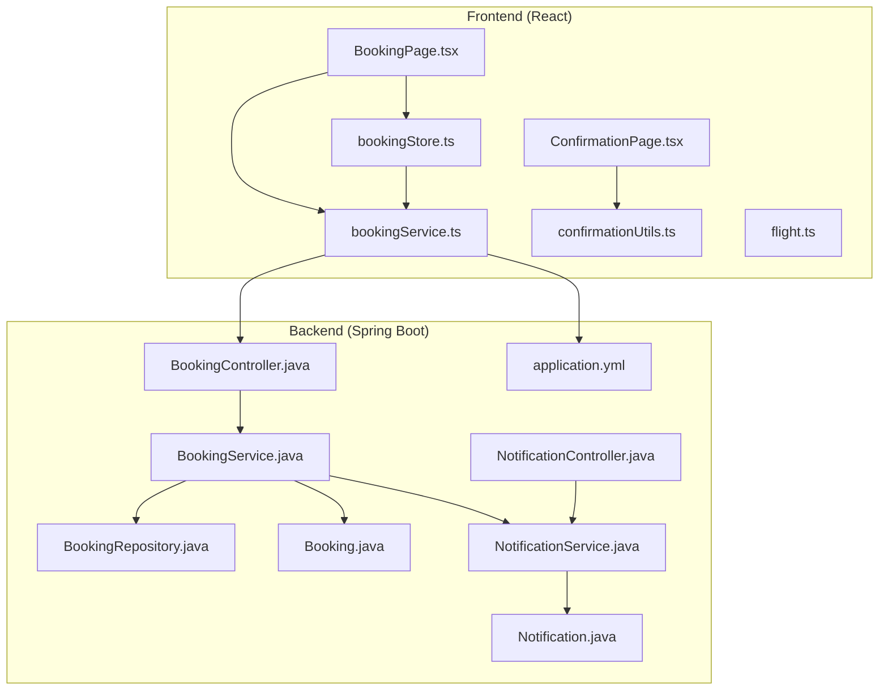
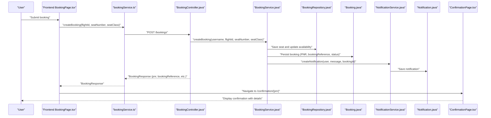
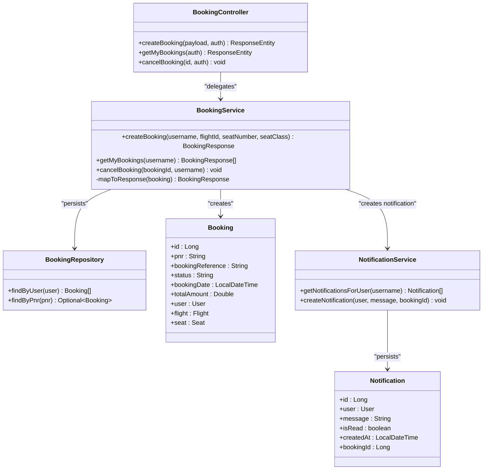
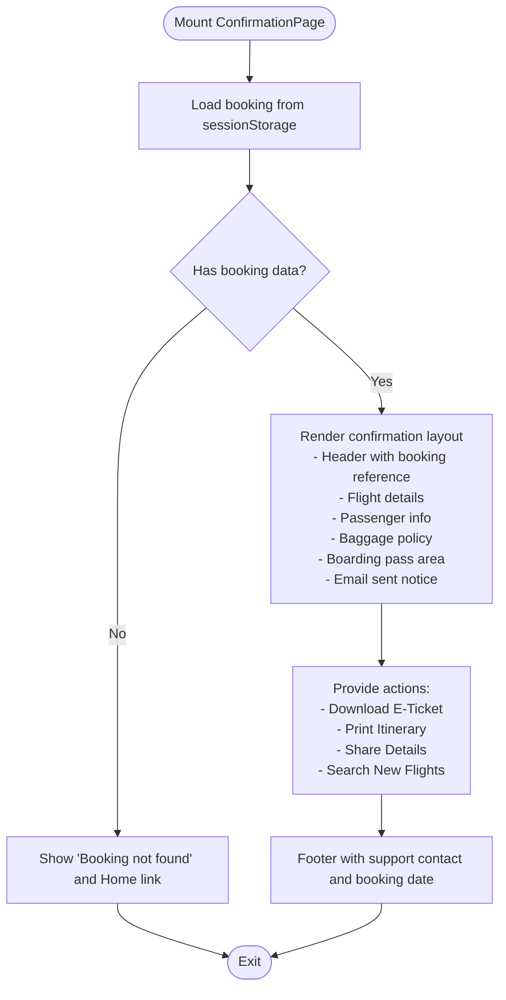
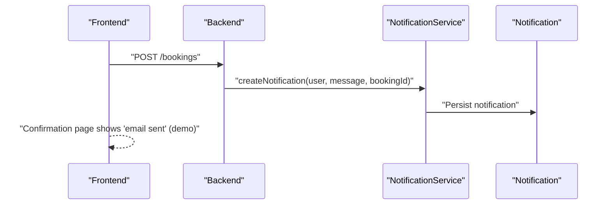
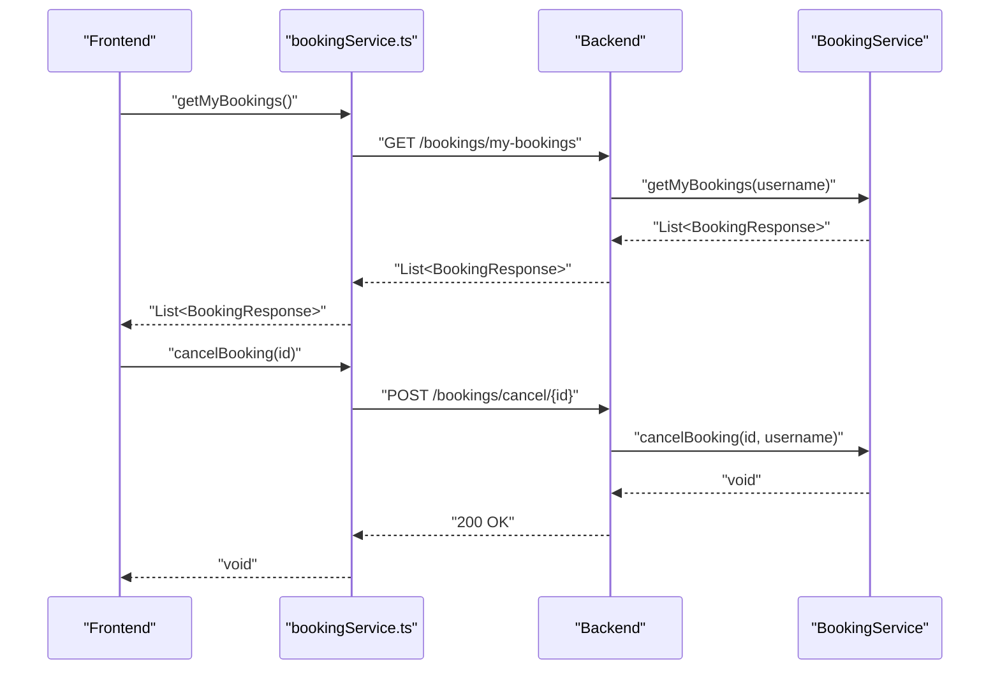
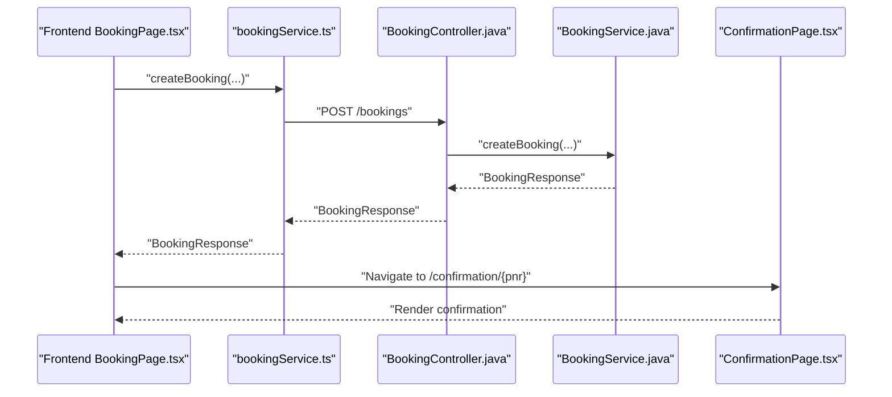
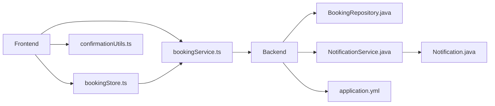

# Booking Confirmation System

<cite>
**Referenced Files in This Document**
- [BookingController.java](file://backend-server/src/main/java/com/skyflow/controller/BookingController.java)
- [BookingService.java](file://backend-server/src/main/java/com/skyflow/service/BookingService.java)
- [Booking.java](file://backend-server/src/main/java/com/skyflow/model/entity/Booking.java)
- [BookingRepository.java](file://backend-server/src/main/java/com/skyflow/repository/BookingRepository.java)
- [NotificationService.java](file://backend-server/src/main/java/com/skyflow/service/NotificationService.java)
- [Notification.java](file://backend-server/src/main/java/com/skyflow/model/entity/Notification.java)
- [NotificationController.java](file://backend-server/src/main/java/com/skyflow/controller/NotificationController.java)
- [application.yml](file://backend-server/src/main/resources/application.yml)
- [ConfirmationPage.tsx](file://skyflow-pro/src/pages/BookingConfirmation/ConfirmationPage.tsx)
- [bookingService.ts](file://skyflow-pro/src/services/bookings/bookingService.ts)
- [bookingStore.ts](file://skyflow-pro/src/stores/bookingStore.ts)
- [confirmationUtils.ts](file://skyflow-pro/src/utils/confirmationUtils.ts)
- [BookingPage.tsx](file://skyflow-pro/src/pages/Booking/BookingPage.tsx)
- [flight.ts](file://skyflow-pro/src/types/flight.ts)
</cite>

## Table of Contents
1. [Introduction](#introduction)
2. [Project Structure](#project-structure)
3. [Core Components](#core-components)
4. [Architecture Overview](#architecture-overview)
5. [Detailed Component Analysis](#detailed-component-analysis)
6. [Dependency Analysis](#dependency-analysis)
7. [Performance Considerations](#performance-considerations)
8. [Troubleshooting Guide](#troubleshooting-guide)
9. [Conclusion](#conclusion)

## Introduction
This document describes the booking confirmation system end-to-end. It covers how a booking is created, persisted, and confirmed; how the confirmation page displays booking details; how PNR and booking reference numbers are generated; how notifications are produced; and how users can retrieve and act on their confirmation (download e-ticket, print itinerary, share booking). It also documents the fallback mechanism for offline scenarios, error handling, and support options.

## Project Structure
The booking confirmation system spans both the backend Spring Boot server and the frontend React application:
- Backend: REST endpoints for booking creation and retrieval, transactional persistence, and notifications.
- Frontend: Booking form, confirmation page, booking store, and utilities for e-ticket generation and sharing.

**Diagram sources**
- [BookingPage.tsx](file://skyflow-pro/src/pages/Booking/BookingPage.tsx)
- [ConfirmationPage.tsx](file://skyflow-pro/src/pages/BookingConfirmation/ConfirmationPage.tsx)
- [bookingService.ts](file://skyflow-pro/src/services/bookings/bookingService.ts)
- [bookingStore.ts](file://skyflow-pro/src/stores/bookingStore.ts)
- [confirmationUtils.ts](file://skyflow-pro/src/utils/confirmationUtils.ts)
- [flight.ts](file://skyflow-pro/src/types/flight.ts)
- [BookingController.java](file://backend-server/src/main/java/com/skyflow/controller/BookingController.java)
- [BookingService.java](file://backend-server/src/main/java/com/skyflow/service/BookingService.java)
- [BookingRepository.java](file://backend-server/src/main/java/com/skyflow/repository/BookingRepository.java)
- [Booking.java](file://backend-server/src/main/java/com/skyflow/model/entity/Booking.java)
- [NotificationService.java](file://backend-server/src/main/java/com/skyflow/service/NotificationService.java)
- [Notification.java](file://backend-server/src/main/java/com/skyflow/model/entity/Notification.java)
- [NotificationController.java](file://backend-server/src/main/java/com/skyflow/controller/NotificationController.java)
- [application.yml](file://backend-server/src/main/resources/application.yml)

**Section sources**
- [BookingController.java](file://backend-server/src/main/java/com/skyflow/controller/BookingController.java)
- [BookingService.java](file://backend-server/src/main/java/com/skyflow/service/BookingService.java)
- [Booking.java](file://backend-server/src/main/java/com/skyflow/model/entity/Booking.java)
- [BookingRepository.java](file://backend-server/src/main/java/com/skyflow/repository/BookingRepository.java)
- [NotificationService.java](file://backend-server/src/main/java/com/skyflow/service/NotificationService.java)
- [Notification.java](file://backend-server/src/main/java/com/skyflow/model/entity/Notification.java)
- [NotificationController.java](file://backend-server/src/main/java/com/skyflow/controller/NotificationController.java)
- [application.yml](file://backend-server/src/main/resources/application.yml)
- [ConfirmationPage.tsx](file://skyflow-pro/src/pages/BookingConfirmation/ConfirmationPage.tsx)
- [bookingService.ts](file://skyflow-pro/src/services/bookings/bookingService.ts)
- [bookingStore.ts](file://skyflow-pro/src/stores/bookingStore.ts)
- [confirmationUtils.ts](file://skyflow-pro/src/utils/confirmationUtils.ts)
- [BookingPage.tsx](file://skyflow-pro/src/pages/Booking/BookingPage.tsx)
- [flight.ts](file://skyflow-pro/src/types/flight.ts)

## Core Components
- Backend booking creation endpoint validates inputs, reserves seats, persists booking, generates PNR and booking reference, calculates price with tax, and creates a notification.
- Frontend booking page collects passenger/payment info, submits the booking, and navigates to the confirmation page while storing booking details in session storage.
- Confirmation page renders booking details, PNR, booking reference, and actions (download e-ticket, print, share).
- Utilities generate e-ticket text files and trigger browser share/print APIs.
- Store manages local booking state and provides a demo mode fallback when backend is unavailable.

**Section sources**
- [BookingController.java](file://backend-server/src/main/java/com/skyflow/controller/BookingController.java)
- [BookingService.java](file://backend-server/src/main/java/com/skyflow/service/BookingService.java)
- [ConfirmationPage.tsx](file://skyflow-pro/src/pages/BookingConfirmation/ConfirmationPage.tsx)
- [bookingService.ts](file://skyflow-pro/src/services/bookings/bookingService.ts)
- [bookingStore.ts](file://skyflow-pro/src/stores/bookingStore.ts)
- [confirmationUtils.ts](file://skyflow-pro/src/utils/confirmationUtils.ts)
- [BookingPage.tsx](file://skyflow-pro/src/pages/Booking/BookingPage.tsx)

## Architecture Overview
The confirmation flow integrates frontend and backend components. The frontend captures booking intent, posts to the backend, receives a confirmation response, and renders the confirmation page. Notifications are created server-side and can be retrieved via a dedicated endpoint.

**Diagram sources**
- [BookingPage.tsx](file://skyflow-pro/src/pages/Booking/BookingPage.tsx)
- [bookingService.ts](file://skyflow-pro/src/services/bookings/bookingService.ts)
- [BookingController.java](file://backend-server/src/main/java/com/skyflow/controller/BookingController.java)
- [BookingService.java](file://backend-server/src/main/java/com/skyflow/service/BookingService.java)
- [BookingRepository.java](file://backend-server/src/main/java/com/skyflow/repository/BookingRepository.java)
- [Booking.java](file://backend-server/src/main/java/com/skyflow/model/entity/Booking.java)
- [NotificationService.java](file://backend-server/src/main/java/com/skyflow/service/NotificationService.java)
- [Notification.java](file://backend-server/src/main/java/com/skyflow/model/entity/Notification.java)
- [ConfirmationPage.tsx](file://skyflow-pro/src/pages/BookingConfirmation/ConfirmationPage.tsx)

## Detailed Component Analysis

### Backend Booking Creation and Persistence
- Endpoint validation ensures required fields are present and flightId is valid.
- Service coordinates seat reservation, availability update, booking creation, PNR and booking reference generation, and notification creation.
- Price calculation considers seat class multiplier and adds tax.
- Persistence uses JPA repositories and entities.

**Diagram sources**
- [BookingController.java](file://backend-server/src/main/java/com/skyflow/controller/BookingController.java)
- [BookingService.java](file://backend-server/src/main/java/com/skyflow/service/BookingService.java)
- [BookingRepository.java](file://backend-server/src/main/java/com/skyflow/repository/BookingRepository.java)
- [Booking.java](file://backend-server/src/main/java/com/skyflow/model/entity/Booking.java)
- [NotificationService.java](file://backend-server/src/main/java/com/skyflow/service/NotificationService.java)
- [Notification.java](file://backend-server/src/main/java/com/skyflow/model/entity/Notification.java)

**Section sources**
- [BookingController.java](file://backend-server/src/main/java/com/skyflow/controller/BookingController.java)
- [BookingService.java](file://backend-server/src/main/java/com/skyflow/service/BookingService.java)
- [BookingRepository.java](file://backend-server/src/main/java/com/skyflow/repository/BookingRepository.java)
- [Booking.java](file://backend-server/src/main/java/com/skyflow/model/entity/Booking.java)
- [NotificationService.java](file://backend-server/src/main/java/com/skyflow/service/NotificationService.java)
- [Notification.java](file://backend-server/src/main/java/com/skyflow/model/entity/Notification.java)

### Confirmation Page Implementation
- Loads booking details from session storage and renders:
  - Confirmation header with booking reference.
  - Flight route and pricing.
  - Passenger details.
  - Baggage policy.
  - QR-style boarding pass area.
  - Notification that confirmation email was sent (demo note).
- Provides actions: download e-ticket, print itinerary, share booking, and return to search.

**Diagram sources**
- [ConfirmationPage.tsx](file://skyflow-pro/src/pages/BookingConfirmation/ConfirmationPage.tsx)

**Section sources**
- [ConfirmationPage.tsx](file://skyflow-pro/src/pages/BookingConfirmation/ConfirmationPage.tsx)

### Confirmation Email Integration
- On successful booking, the backend creates a notification containing booking reference and PNR.
- The frontend confirmation page indicates that a confirmation email was sent (note: the current implementation is a demo and does not send real emails).
- Users can still download an e-ticket via the confirmation page.

**Diagram sources**
- [BookingService.java](file://backend-server/src/main/java/com/skyflow/service/BookingService.java)
- [NotificationService.java](file://backend-server/src/main/java/com/skyflow/service/NotificationService.java)
- [Notification.java](file://backend-server/src/main/java/com/skyflow/model/entity/Notification.java)
- [ConfirmationPage.tsx](file://skyflow-pro/src/pages/BookingConfirmation/ConfirmationPage.tsx)

**Section sources**
- [BookingService.java](file://backend-server/src/main/java/com/skyflow/service/BookingService.java)
- [NotificationService.java](file://backend-server/src/main/java/com/skyflow/service/NotificationService.java)
- [Notification.java](file://backend-server/src/main/java/com/skyflow/model/entity/Notification.java)
- [ConfirmationPage.tsx](file://skyflow-pro/src/pages/BookingConfirmation/ConfirmationPage.tsx)

### Booking Status Updates and Retrieval
- Backend supports retrieving a user’s bookings and canceling a booking, updating status and seat availability.
- Frontend store exposes methods to fetch bookings and cancel them, updating local state.

**Diagram sources**
- [bookingService.ts](file://skyflow-pro/src/services/bookings/bookingService.ts)
- [BookingController.java](file://backend-server/src/main/java/com/skyflow/controller/BookingController.java)
- [BookingService.java](file://backend-server/src/main/java/com/skyflow/service/BookingService.java)

**Section sources**
- [BookingController.java](file://backend-server/src/main/java/com/skyflow/controller/BookingController.java)
- [BookingService.java](file://backend-server/src/main/java/com/skyflow/service/BookingService.java)
- [bookingService.ts](file://skyflow-pro/src/services/bookings/bookingService.ts)

### Booking History Display and Formatting
- Frontend booking store fetches bookings and maintains a list with status and metadata.
- The confirmation page formats dates, prices, and passenger information for readability.

**Section sources**
- [bookingStore.ts](file://skyflow-pro/src/stores/bookingStore.ts)
- [ConfirmationPage.tsx](file://skyflow-pro/src/pages/BookingConfirmation/ConfirmationPage.tsx)

### Confirmation PDF Generation
- The system does not implement a PDF generator. Instead, it provides an e-ticket text file download and a print itinerary option.

**Section sources**
- [confirmationUtils.ts](file://skyflow-pro/src/utils/confirmationUtils.ts)
- [ConfirmationPage.tsx](file://skyflow-pro/src/pages/BookingConfirmation/ConfirmationPage.tsx)

### PNR and Booking Reference Generation
- PNR: Randomized short identifier generated during booking persistence.
- Booking reference: Auto-incremented numeric counter prefixed with a brand code.

**Section sources**
- [BookingService.java](file://backend-server/src/main/java/com/skyflow/service/BookingService.java)
- [Booking.java](file://backend-server/src/main/java/com/skyflow/model/entity/Booking.java)

### Data Flow from Backend Booking Creation to Frontend Confirmation
- Frontend collects passenger and payment details, submits to backend.
- Backend validates, reserves seat, persists booking, and creates a notification.
- Frontend stores booking details in session storage and navigates to the confirmation page.

**Diagram sources**
- [BookingPage.tsx](file://skyflow-pro/src/pages/Booking/BookingPage.tsx)
- [bookingService.ts](file://skyflow-pro/src/services/bookings/bookingService.ts)
- [BookingController.java](file://backend-server/src/main/java/com/skyflow/controller/BookingController.java)
- [BookingService.java](file://backend-server/src/main/java/com/skyflow/service/BookingService.java)
- [ConfirmationPage.tsx](file://skyflow-pro/src/pages/BookingConfirmation/ConfirmationPage.tsx)

## Dependency Analysis
- Frontend depends on:
  - bookingService for HTTP communication with backend.
  - bookingStore for state management and demo fallback.
  - confirmationUtils for e-ticket generation and sharing.
- Backend depends on:
  - JPA repositories and entities for persistence.
  - NotificationService for creating notifications.
  - application.yml for configuration (database, logging, JWT).

**Diagram sources**
- [bookingService.ts](file://skyflow-pro/src/services/bookings/bookingService.ts)
- [bookingStore.ts](file://skyflow-pro/src/stores/bookingStore.ts)
- [confirmationUtils.ts](file://skyflow-pro/src/utils/confirmationUtils.ts)
- [BookingController.java](file://backend-server/src/main/java/com/skyflow/controller/BookingController.java)
- [BookingService.java](file://backend-server/src/main/java/com/skyflow/service/BookingService.java)
- [BookingRepository.java](file://backend-server/src/main/java/com/skyflow/repository/BookingRepository.java)
- [NotificationService.java](file://backend-server/src/main/java/com/skyflow/service/NotificationService.java)
- [Notification.java](file://backend-server/src/main/java/com/skyflow/model/entity/Notification.java)
- [application.yml](file://backend-server/src/main/resources/application.yml)

**Section sources**
- [bookingService.ts](file://skyflow-pro/src/services/bookings/bookingService.ts)
- [bookingStore.ts](file://skyflow-pro/src/stores/bookingStore.ts)
- [confirmationUtils.ts](file://skyflow-pro/src/utils/confirmationUtils.ts)
- [BookingController.java](file://backend-server/src/main/java/com/skyflow/controller/BookingController.java)
- [BookingService.java](file://backend-server/src/main/java/com/skyflow/service/BookingService.java)
- [BookingRepository.java](file://backend-server/src/main/java/com/skyflow/repository/BookingRepository.java)
- [NotificationService.java](file://backend-server/src/main/java/com/skyflow/service/NotificationService.java)
- [Notification.java](file://backend-server/src/main/java/com/skyflow/model/entity/Notification.java)
- [application.yml](file://backend-server/src/main/resources/application.yml)

## Performance Considerations
- Transaction boundaries ensure atomic seat reservation and booking persistence.
- Price calculation and tax addition occur server-side to prevent client-side manipulation.
- Frontend uses session storage for immediate confirmation rendering, reducing latency.
- Demo fallback avoids blocking users when backend is unavailable.

[No sources needed since this section provides general guidance]

## Troubleshooting Guide
Common issues and resolutions:
- Booking fails with missing fields or invalid flight ID:
  - Ensure required fields are present and flightId is valid.
  - See validation in the booking endpoint.
- Seat already booked:
  - Choose another seat or flight.
- Backend unreachable or network errors:
  - Frontend falls back to demo booking mode, generating a demo PNR and navigating to confirmation.
- Cannot retrieve confirmation:
  - Use the “Search New Flights” link on the confirmation page or re-check session storage.
- Need assistance:
  - Contact 24/7 customer support as indicated on the confirmation page footer.

**Section sources**
- [BookingController.java](file://backend-server/src/main/java/com/skyflow/controller/BookingController.java)
- [BookingPage.tsx](file://skyflow-pro/src/pages/Booking/BookingPage.tsx)
- [ConfirmationPage.tsx](file://skyflow-pro/src/pages/BookingConfirmation/ConfirmationPage.tsx)

## Conclusion
The booking confirmation system integrates a robust backend with a responsive frontend. It ensures reliable booking creation, accurate seat management, and clear confirmation delivery. While email sending is currently a demo, the system provides strong alternatives (e-ticket downloads, printing, sharing) and resilient fallback behavior for offline scenarios. The architecture supports future enhancements such as PDF generation and production-grade email integration.