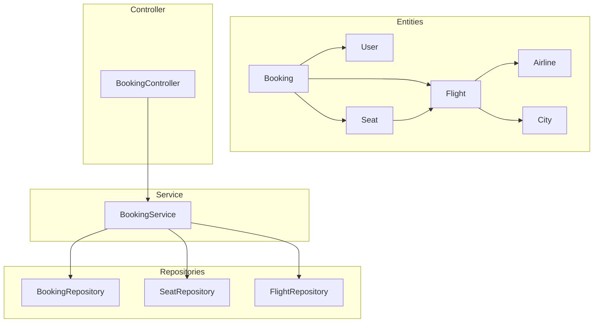
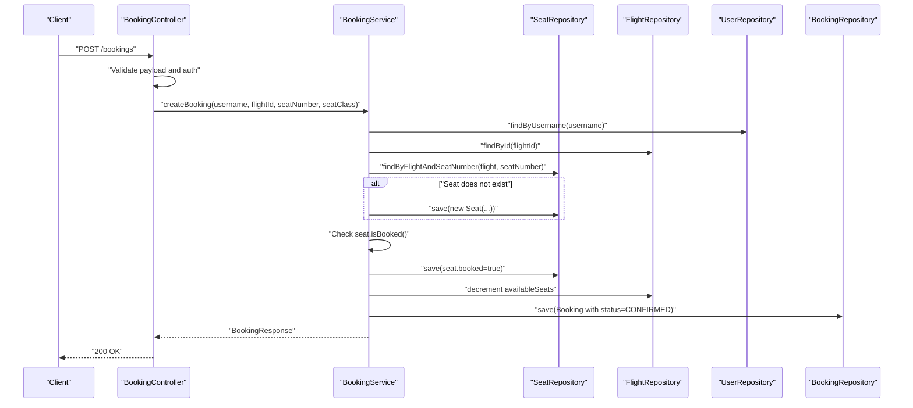
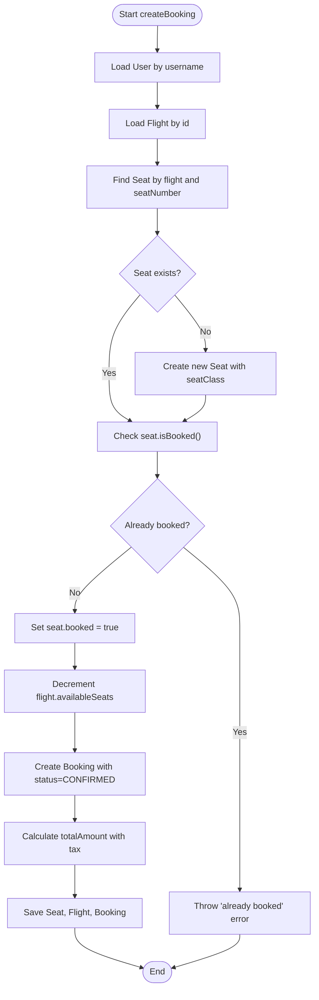
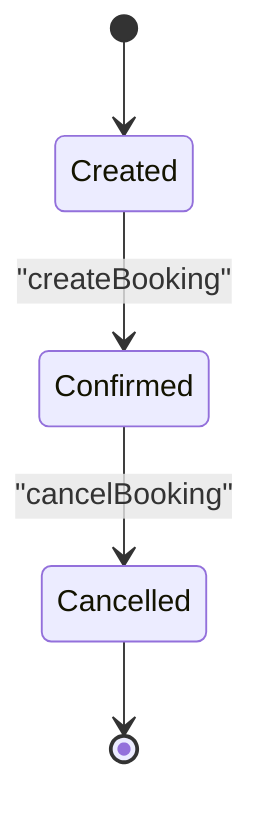
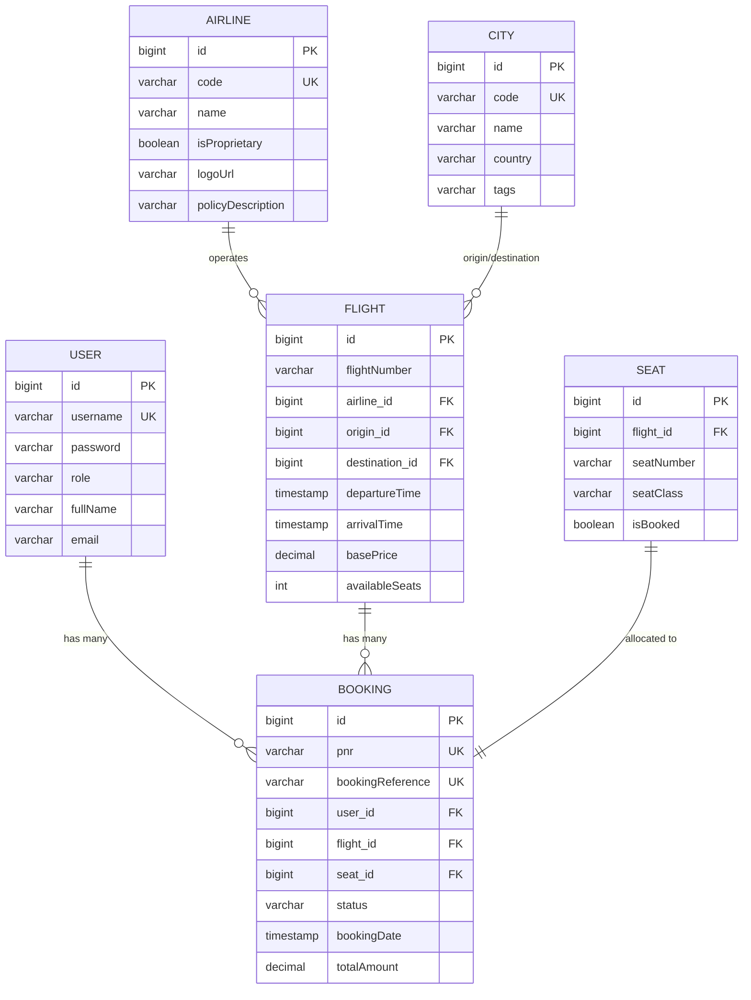

# Booking Data Models and Persistence

<cite>
**Referenced Files in This Document**
- [Booking.java](file://backend-server/src/main/java/com/skyflow/model/entity/Booking.java)
- [Seat.java](file://backend-server/src/main/java/com/skyflow/model/entity/Seat.java)
- [Flight.java](file://backend-server/src/main/java/com/skyflow/model/entity/Flight.java)
- [User.java](file://backend-server/src/main/java/com/skyflow/model/entity/User.java)
- [Airline.java](file://backend-server/src/main/java/com/skyflow/model/entity/Airline.java)
- [City.java](file://backend-server/src/main/java/com/skyflow/model/entity/City.java)
- [BookingRepository.java](file://backend-server/src/main/java/com/skyflow/repository/BookingRepository.java)
- [SeatRepository.java](file://backend-server/src/main/java/com/skyflow/repository/SeatRepository.java)
- [FlightRepository.java](file://backend-server/src/main/java/com/skyflow/repository/FlightRepository.java)
- [BookingService.java](file://backend-server/src/main/java/com/skyflow/service/BookingService.java)
- [BookingController.java](file://backend-server/src/main/java/com/skyflow/controller/BookingController.java)
- [BookingResponse.java](file://backend-server/src/main/java/com/skyflow/model/dto/response/BookingResponse.java)
- [application.yml](file://backend-server/src/main/resources/application.yml)
</cite>

## Table of Contents
1. [Introduction](#introduction)
2. [Project Structure](#project-structure)
3. [Core Components](#core-components)
4. [Architecture Overview](#architecture-overview)
5. [Detailed Component Analysis](#detailed-component-analysis)
6. [Dependency Analysis](#dependency-analysis)
7. [Performance Considerations](#performance-considerations)
8. [Troubleshooting Guide](#troubleshooting-guide)
9. [Conclusion](#conclusion)

## Introduction
This document provides comprehensive data model documentation for booking-related entities in the airline reservation system. It details the structure of the Booking, Seat, Flight, and User entities, their relationships, constraints, and JPA annotations. It also explains the booking lifecycle, seat allocation algorithms, validation rules, and the persistence layer with query optimization strategies used by the booking service.

## Project Structure
The booking domain spans entity definitions, repositories, services, and controllers. Entities are annotated with JPA annotations and mapped to database tables. Repositories expose typed CRUD and custom queries. Services orchestrate transactions and business logic. Controllers handle HTTP requests and enforce authentication.

**Diagram sources**
- [Booking.java:12-41](file://backend-server/src/main/java/com/skyflow/model/entity/Booking.java#L12-L41)
- [Seat.java:13-29](file://backend-server/src/main/java/com/skyflow/model/entity/Seat.java#L13-L29)
- [Flight.java:12-42](file://backend-server/src/main/java/com/skyflow/model/entity/Flight.java#L12-L42)
- [User.java:13-30](file://backend-server/src/main/java/com/skyflow/model/entity/User.java#L13-L30)
- [Airline.java:11-28](file://backend-server/src/main/java/com/skyflow/model/entity/Airline.java#L11-L28)
- [City.java:12-25](file://backend-server/src/main/java/com/skyflow/model/entity/City.java#L12-L25)
- [BookingRepository.java:9-13](file://backend-server/src/main/java/com/skyflow/repository/BookingRepository.java#L9-L13)
- [SeatRepository.java:13-24](file://backend-server/src/main/java/com/skyflow/repository/SeatRepository.java#L13-L24)
- [FlightRepository.java:12-21](file://backend-server/src/main/java/com/skyflow/repository/FlightRepository.java#L12-L21)
- [BookingService.java:23-34](file://backend-server/src/main/java/com/skyflow/service/BookingService.java#L23-L34)
- [BookingController.java:14-19](file://backend-server/src/main/java/com/skyflow/controller/BookingController.java#L14-L19)

**Section sources**
- [application.yml:1-30](file://backend-server/src/main/resources/application.yml#L1-L30)

## Core Components
This section documents the primary entities and their attributes, constraints, and relationships.

- Booking
  - Identity: auto-generated Long id
  - Unique identifiers: pnr (unique, non-null), bookingReference (unique)
  - Associations: Many-to-one to User (user_id), Many-to-one to Flight (flight_id), One-to-one to Seat (seat_id)
  - Status: String status (CONFIRMED, CANCELLED)
  - Timestamps and amounts: bookingDate, totalAmount
  - Annotations: Entity, Table(name="bookings"), Column constraints, JoinColumn mappings

- Seat
  - Identity: auto-generated Long id
  - Composite uniqueness: unique constraint on (flight_id, seatNumber)
  - Associations: Many-to-one to Flight (flight_id)
  - Attributes: seatNumber, seatClass, isBooked
  - Annotations: Entity, Table(name="seats"), UniqueConstraint, JoinColumn

- Flight
  - Identity: auto-generated Long id
  - Attributes: flightNumber, departureTime, arrivalTime, basePrice, availableSeats
  - Associations: Many-to-one to Airline (airline_id), City (origin_id, destination_id)
  - Annotations: Entity, Table(name="flights"), JoinColumns

- User
  - Identity: auto-generated Long id
  - Uniqueness: username (unique, non-null)
  - Attributes: password (encoded), role, fullName, email
  - Annotations: Entity, Table(name="users"), Column constraints

- Airline and City
  - Airline: code (unique, non-null), name, isProprietary, logoUrl, policyDescription
  - City: code (unique, non-null), name, country, tags
  - Annotations: Entity, Table, Unique constraints

**Section sources**
- [Booking.java:8-41](file://backend-server/src/main/java/com/skyflow/model/entity/Booking.java#L8-L41)
- [Seat.java:7-29](file://backend-server/src/main/java/com/skyflow/model/entity/Seat.java#L7-L29)
- [Flight.java:8-42](file://backend-server/src/main/java/com/skyflow/model/entity/Flight.java#L8-L42)
- [User.java:9-30](file://backend-server/src/main/java/com/skyflow/model/entity/User.java#L9-L30)
- [Airline.java:7-28](file://backend-server/src/main/java/com/skyflow/model/entity/Airline.java#L7-L28)
- [City.java:7-25](file://backend-server/src/main/java/com/skyflow/model/entity/City.java#L7-L25)

## Architecture Overview
The booking lifecycle is orchestrated by the controller, service, and repositories. The service manages transaction boundaries, enforces business rules, and coordinates updates to related entities.

**Diagram sources**
- [BookingController.java:21-70](file://backend-server/src/main/java/com/skyflow/controller/BookingController.java#L21-L70)
- [BookingService.java:43-98](file://backend-server/src/main/java/com/skyflow/service/BookingService.java#L43-L98)
- [SeatRepository.java:18-18](file://backend-server/src/main/java/com/skyflow/repository/SeatRepository.java#L18-L18)
- [FlightRepository.java:20-20](file://backend-server/src/main/java/com/skyflow/repository/FlightRepository.java#L20-L20)
- [BookingRepository.java:10-10](file://backend-server/src/main/java/com/skyflow/repository/BookingRepository.java#L10-L10)

## Detailed Component Analysis

### Booking Entity
- Purpose: Represents a confirmed booking with associated passenger, flight, and seat.
- Key attributes:
  - pnr: Unique booking reference identifier
  - bookingReference: Auto-generated reference in "SKYXXXX" format
  - status: CONFIRMED or CANCELLED
  - bookingDate: Timestamp of booking creation
  - totalAmount: Calculated amount including taxes
- Associations:
  - user: Many-to-one via user_id
  - flight: Many-to-one via flight_id
  - seat: One-to-one via seat_id
- Constraints:
  - pnr and bookingReference are unique
  - user_id and flight_id are non-null
  - seat_id is non-null

**Section sources**
- [Booking.java:12-41](file://backend-server/src/main/java/com/skyflow/model/entity/Booking.java#L12-L41)

### Seat Entity
- Purpose: Tracks seat allocation per flight with seat type classification.
- Key attributes:
  - seatNumber: Alphanumeric seat identifier (e.g., 1A)
  - seatClass: Classification (economy, premium economy, business, first)
  - isBooked: Boolean flag indicating allocation status
- Uniqueness:
  - Composite unique constraint on (flight_id, seatNumber)
- Associations:
  - flight: Many-to-one via flight_id

**Section sources**
- [Seat.java:13-29](file://backend-server/src/main/java/com/skyflow/model/entity/Seat.java#L13-L29)

### Flight Entity
- Purpose: Represents flight metadata and capacity.
- Key attributes:
  - flightNumber: Unique flight identifier
  - departureTime, arrivalTime: Scheduled timestamps
  - basePrice: Economy base fare
  - availableSeats: Remaining seat inventory
- Associations:
  - airline: Many-to-one via airline_id
  - origin, destination: Many-to-one via origin_id, destination_id

**Section sources**
- [Flight.java:12-42](file://backend-server/src/main/java/com/skyflow/model/entity/Flight.java#L12-L42)

### User Entity
- Purpose: Stores passenger identity and credentials.
- Key attributes:
  - username: Unique, non-null
  - password: Non-null, encoded
  - role: USER or ADMIN
  - fullName, email: Optional contact info

**Section sources**
- [User.java:13-30](file://backend-server/src/main/java/com/skyflow/model/entity/User.java#L13-L30)

### Seat Allocation Algorithm
The service implements optimistic seat allocation with transactional safeguards:
- Locate or create seat for the given flight and seat number
- Verify seat is not already booked
- Mark seat as booked within the same transaction
- Decrement flight.availableSeats atomically
- Create booking with status CONFIRMED and calculated total amount

**Diagram sources**
- [BookingService.java:44-98](file://backend-server/src/main/java/com/skyflow/service/BookingService.java#L44-L98)
- [SeatRepository.java:18-18](file://backend-server/src/main/java/com/skyflow/repository/SeatRepository.java#L18-L18)
- [FlightRepository.java:20-20](file://backend-server/src/main/java/com/skyflow/repository/FlightRepository.java#L20-L20)
- [BookingRepository.java:10-10](file://backend-server/src/main/java/com/skyflow/repository/BookingRepository.java#L10-L10)

**Section sources**
- [BookingService.java:43-98](file://backend-server/src/main/java/com/skyflow/service/BookingService.java#L43-L98)

### Booking Lifecycle States
- Creation:
  - Status initialized to CONFIRMED
  - PNR and bookingReference generated
  - Payment amount computed and persisted
- Cancellation:
  - Status changed to CANCELLED
  - Seat unmarked as booked
  - Flight availableSeats restored
  - Notifications triggered

**Diagram sources**
- [BookingService.java:107-127](file://backend-server/src/main/java/com/skyflow/service/BookingService.java#L107-L127)
- [Booking.java:36-36](file://backend-server/src/main/java/com/skyflow/model/entity/Booking.java#L36-L36)

**Section sources**
- [BookingService.java:107-127](file://backend-server/src/main/java/com/skyflow/service/BookingService.java#L107-L127)

### Data Validation Rules
- Controller-level validation:
  - Requires authentication; rejects anonymous requests
  - Validates presence and format of flightId, seatNumber, seatClass
  - Returns appropriate HTTP responses for missing or invalid fields
- Service-level validation:
  - Throws errors for not found entities or already booked seats
  - Enforces positive numeric flightId

**Section sources**
- [BookingController.java:22-70](file://backend-server/src/main/java/com/skyflow/controller/BookingController.java#L22-L70)
- [BookingService.java:44-62](file://backend-server/src/main/java/com/skyflow/service/BookingService.java#L44-L62)

### Persistence Layer and Query Optimization
- Repositories:
  - BookingRepository: findByUser(User), findByPnr(String)
  - SeatRepository: findByIdWithLock(LockModeType.PESSIMISTIC_WRITE), findByFlightAndSeatNumber(Flight, String), countBookedSeatsByFlight(Flight), findByFlightAndIsBooked(Flight, boolean)
  - FlightRepository: custom JPQL query for flight search by origin, destination, and time window
- Optimizations:
  - Pessimistic locking on seat retrieval prevents race conditions during allocation
  - Composite unique constraint on (flight_id, seatNumber) ensures uniqueness and supports efficient lookups
  - Count query for booked seats enables quick availability checks
  - Centralized booking reference generation avoids collisions

**Section sources**
- [BookingRepository.java:9-13](file://backend-server/src/main/java/com/skyflow/repository/BookingRepository.java#L9-L13)
- [SeatRepository.java:13-24](file://backend-server/src/main/java/com/skyflow/repository/SeatRepository.java#L13-L24)
- [FlightRepository.java:12-21](file://backend-server/src/main/java/com/skyflow/repository/FlightRepository.java#L12-L21)

### Data Access Patterns
- Read-heavy queries:
  - Fetch user bookings by user association
  - Retrieve seat by composite key (flight + seatNumber)
- Write-heavy transactions:
  - Atomic update of seat, flight, and booking during creation
  - Atomic revert during cancellation
- DTO mapping:
  - Service maps Booking to BookingResponse for controlled serialization

**Section sources**
- [BookingService.java:100-105](file://backend-server/src/main/java/com/skyflow/service/BookingService.java#L100-L105)
- [BookingService.java:129-146](file://backend-server/src/main/java/com/skyflow/service/BookingService.java#L129-L146)
- [BookingResponse.java:8-23](file://backend-server/src/main/java/com/skyflow/model/dto/response/BookingResponse.java#L8-L23)

## Dependency Analysis
The following diagram shows entity relationships and foreign keys inferred from JPA annotations.

**Diagram sources**
- [Booking.java:23-33](file://backend-server/src/main/java/com/skyflow/model/entity/Booking.java#L23-L33)
- [Seat.java:18-20](file://backend-server/src/main/java/com/skyflow/model/entity/Seat.java#L18-L20)
- [Flight.java:20-30](file://backend-server/src/main/java/com/skyflow/model/entity/Flight.java#L20-L30)
- [User.java:18-18](file://backend-server/src/main/java/com/skyflow/model/entity/User.java#L18-L18)
- [Airline.java:16-16](file://backend-server/src/main/java/com/skyflow/model/entity/Airline.java#L16-L16)
- [City.java:16-16](file://backend-server/src/main/java/com/skyflow/model/entity/City.java#L16-L16)

**Section sources**
- [Booking.java:8-41](file://backend-server/src/main/java/com/skyflow/model/entity/Booking.java#L8-L41)
- [Seat.java:7-29](file://backend-server/src/main/java/com/skyflow/model/entity/Seat.java#L7-L29)
- [Flight.java:8-42](file://backend-server/src/main/java/com/skyflow/model/entity/Flight.java#L8-L42)
- [User.java:9-30](file://backend-server/src/main/java/com/skyflow/model/entity/User.java#L9-L30)
- [Airline.java:7-28](file://backend-server/src/main/java/com/skyflow/model/entity/Airline.java#L7-L28)
- [City.java:7-25](file://backend-server/src/main/java/com/skyflow/model/entity/City.java#L7-L25)

## Performance Considerations
- Concurrency control:
  - Use pessimistic locking when retrieving seats to prevent race conditions during allocation
- Indexing and constraints:
  - Composite unique constraint on (flight_id, seatNumber) supports fast lookups and uniqueness enforcement
  - Unique constraints on usernames and booking identifiers reduce duplicate writes
- Transaction boundaries:
  - Group seat, flight, and booking updates in a single transaction to maintain consistency
- Query efficiency:
  - Prefer findByIdWithLock for allocation to avoid stale reads
  - Use countBookedSeatsByFlight to quickly assess availability before attempting allocation

[No sources needed since this section provides general guidance]

## Troubleshooting Guide
- Common errors and causes:
  - "User not found": Username invalid or account deleted
  - "Flight not found": Invalid flightId or expired search results
  - "Seat already booked": Race condition or concurrent booking
  - "Missing required fields": Missing flightId, seatNumber, or seatClass in payload
  - "Invalid flight ID": Non-numeric or non-positive value
- Controller behavior:
  - Returns UNAUTHORIZED for anonymous requests
  - Returns BAD_REQUEST for malformed payloads
  - Returns INTERNAL_SERVER_ERROR for unexpected failures
- Service behavior:
  - Throws runtime exceptions for unauthorized cancellations or invalid states
  - Restores inventory and updates status atomically during cancellation

**Section sources**
- [BookingController.java:22-70](file://backend-server/src/main/java/com/skyflow/controller/BookingController.java#L22-L70)
- [BookingService.java:107-127](file://backend-server/src/main/java/com/skyflow/service/BookingService.java#L107-L127)

## Conclusion
The booking data model integrates Booking, Seat, Flight, and User entities with clear JPA mappings and constraints. The service layer enforces a robust booking lifecycle, implements seat allocation with concurrency control, and exposes optimized repository queries. Together, these components provide a scalable and maintainable foundation for the booking domain.