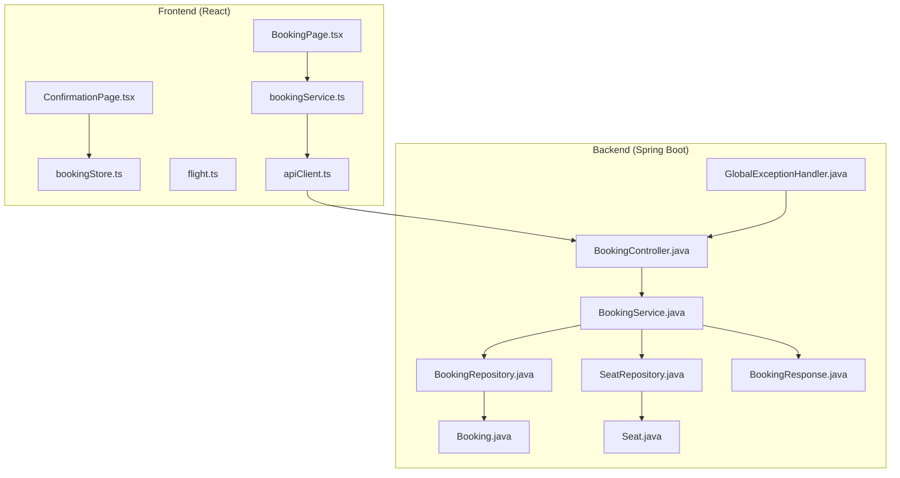
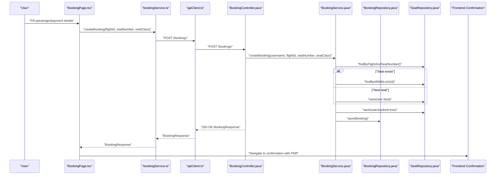
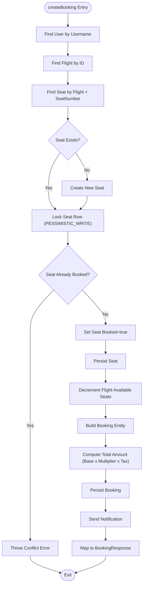
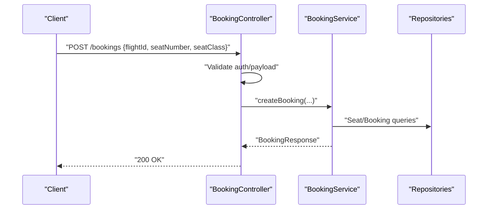
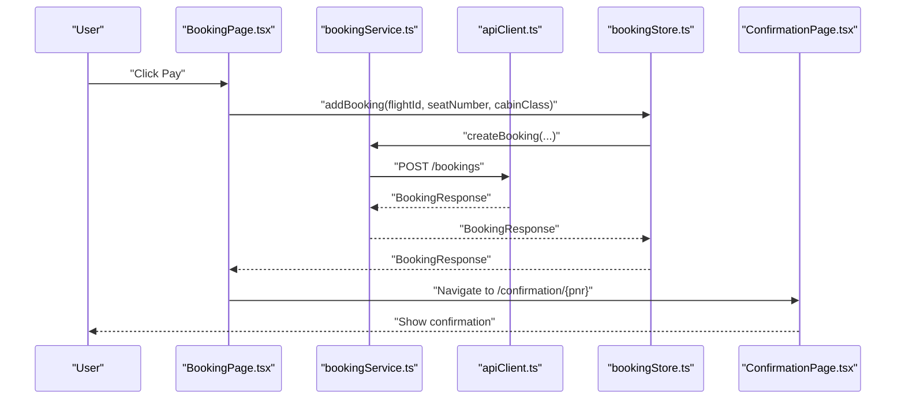
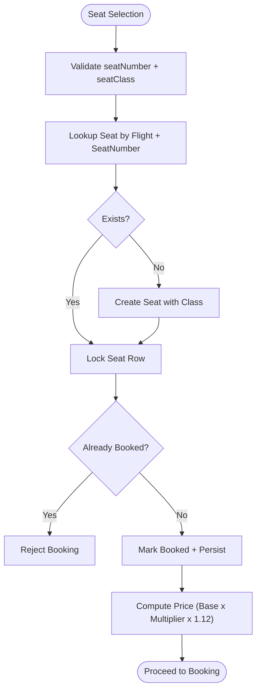
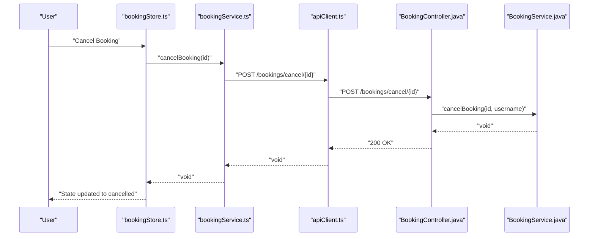
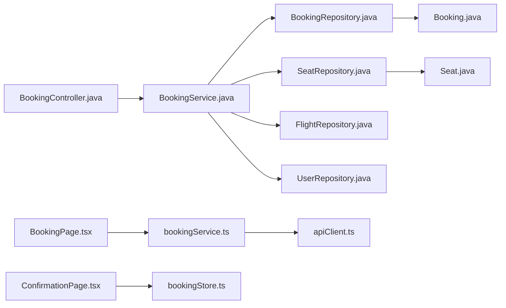
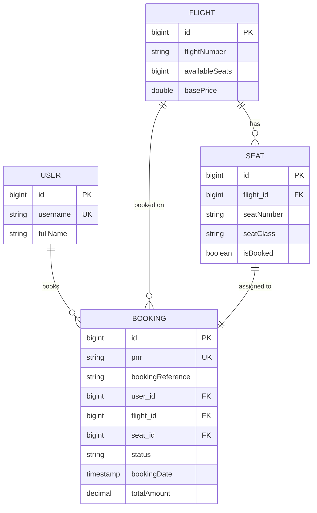

# Booking Management System

<cite>
**Referenced Files in This Document**
- [BookingController.java](file://backend-server/src/main/java/com/skyflow/controller/BookingController.java)
- [BookingService.java](file://backend-server/src/main/java/com/skyflow/service/BookingService.java)
- [Booking.java](file://backend-server/src/main/java/com/skyflow/model/entity/Booking.java)
- [Seat.java](file://backend-server/src/main/java/com/skyflow/model/entity/Seat.java)
- [BookingRepository.java](file://backend-server/src/main/java/com/skyflow/repository/BookingRepository.java)
- [SeatRepository.java](file://backend-server/src/main/java/com/skyflow/repository/SeatRepository.java)
- [BookingResponse.java](file://backend-server/src/main/java/com/skyflow/model/dto/response/BookingResponse.java)
- [GlobalExceptionHandler.java](file://backend-server/src/main/java/com/skyflow/exception/GlobalExceptionHandler.java)
- [BookingPage.tsx](file://skyflow-pro/src/pages/Booking/BookingPage.tsx)
- [ConfirmationPage.tsx](file://skyflow-pro/src/pages/BookingConfirmation/ConfirmationPage.tsx)
- [bookingService.ts](file://skyflow-pro/src/services/bookings/bookingService.ts)
- [bookingStore.ts](file://skyflow-pro/src/stores/bookingStore.ts)
- [flight.ts](file://skyflow-pro/src/types/flight.ts)
- [FlightCard.tsx](file://skyflow-pro/src/components/FlightCard/FlightCard.tsx)
- [apiClient.ts](file://skyflow-pro/src/services/api/apiClient.ts)
</cite>

## Table of Contents
1. [Introduction](#introduction)
2. [Project Structure](#project-structure)
3. [Core Components](#core-components)
4. [Architecture Overview](#architecture-overview)
5. [Detailed Component Analysis](#detailed-component-analysis)
6. [Dependency Analysis](#dependency-analysis)
7. [Performance Considerations](#performance-considerations)
8. [Troubleshooting Guide](#troubleshooting-guide)
9. [Conclusion](#conclusion)
10. [Appendices](#appendices)

## Introduction
This document describes the booking management system covering seat selection, booking workflow, booking history, backend service implementation, frontend components, and integration patterns. It explains seat allocation algorithms, booking persistence, transaction handling, passenger information forms, payment processing integration, confirmation displays, modification and cancellation procedures, error handling, and validation logic.

## Project Structure
The system comprises:
- Backend REST API (Spring Boot) exposing booking endpoints, managing seat allocation, and persisting bookings.
- Frontend React application (Vite/TanStack Router) implementing the booking flow, payment form, and confirmation display.
- Shared data types and services bridging frontend and backend.

**Diagram sources**
- [BookingPage.tsx:1-559](file://skyflow-pro/src/pages/Booking/BookingPage.tsx#L1-L559)
- [ConfirmationPage.tsx:1-277](file://skyflow-pro/src/pages/BookingConfirmation/ConfirmationPage.tsx#L1-L277)
- [bookingService.ts:1-39](file://skyflow-pro/src/services/bookings/bookingService.ts#L1-L39)
- [bookingStore.ts:1-115](file://skyflow-pro/src/stores/bookingStore.ts#L1-L115)
- [flight.ts:1-58](file://skyflow-pro/src/types/flight.ts#L1-L58)
- [apiClient.ts:1-38](file://skyflow-pro/src/services/api/apiClient.ts#L1-L38)
- [BookingController.java:1-89](file://backend-server/src/main/java/com/skyflow/controller/BookingController.java#L1-L89)
- [BookingService.java:1-148](file://backend-server/src/main/java/com/skyflow/service/BookingService.java#L1-L148)
- [BookingRepository.java:1-14](file://backend-server/src/main/java/com/skyflow/repository/BookingRepository.java#L1-L14)
- [SeatRepository.java:1-25](file://backend-server/src/main/java/com/skyflow/repository/SeatRepository.java#L1-L25)
- [Booking.java:1-42](file://backend-server/src/main/java/com/skyflow/model/entity/Booking.java#L1-L42)
- [Seat.java:1-30](file://backend-server/src/main/java/com/skyflow/model/entity/Seat.java#L1-L30)
- [BookingResponse.java:1-24](file://backend-server/src/main/java/com/skyflow/model/dto/response/BookingResponse.java#L1-L24)
- [GlobalExceptionHandler.java:1-55](file://backend-server/src/main/java/com/skyflow/exception/GlobalExceptionHandler.java#L1-L55)

**Section sources**
- [BookingController.java:1-89](file://backend-server/src/main/java/com/skyflow/controller/BookingController.java#L1-L89)
- [BookingService.java:1-148](file://backend-server/src/main/java/com/skyflow/service/BookingService.java#L1-L148)
- [BookingPage.tsx:1-559](file://skyflow-pro/src/pages/Booking/BookingPage.tsx#L1-L559)
- [ConfirmationPage.tsx:1-277](file://skyflow-pro/src/pages/BookingConfirmation/ConfirmationPage.tsx#L1-L277)
- [bookingService.ts:1-39](file://skyflow-pro/src/services/bookings/bookingService.ts#L1-L39)
- [bookingStore.ts:1-115](file://skyflow-pro/src/stores/bookingStore.ts#L1-L115)
- [flight.ts:1-58](file://skyflow-pro/src/types/flight.ts#L1-L58)
- [apiClient.ts:1-38](file://skyflow-pro/src/services/api/apiClient.ts#L1-L38)

## Core Components
- Backend Booking Controller: Exposes endpoints for creating bookings, retrieving user bookings, and cancelling bookings. Validates authentication and request payload, delegates to service, and handles exceptions.
- Backend Booking Service: Orchestrates seat allocation, booking creation, price calculation, and persistence within a transaction boundary. Manages notifications and updates flight availability.
- Frontend Booking Page: Implements a 3-step wizard for passenger details, payment, and review/confirmation. Integrates with booking store and service to submit requests and handle responses.
- Frontend Confirmation Page: Renders booking confirmation, e-ticket actions, and booking metadata from session storage.
- Booking Store: Centralized state for bookings with local fallback when backend is unavailable.
- Shared Types: Define flight and cabin classes used across frontend and backend mapping.

**Section sources**
- [BookingController.java:21-87](file://backend-server/src/main/java/com/skyflow/controller/BookingController.java#L21-L87)
- [BookingService.java:43-127](file://backend-server/src/main/java/com/skyflow/service/BookingService.java#L43-L127)
- [BookingPage.tsx:31-154](file://skyflow-pro/src/pages/Booking/BookingPage.tsx#L31-L154)
- [ConfirmationPage.tsx:27-65](file://skyflow-pro/src/pages/BookingConfirmation/ConfirmationPage.tsx#L27-L65)
- [bookingStore.ts:43-114](file://skyflow-pro/src/stores/bookingStore.ts#L43-L114)
- [flight.ts:1-58](file://skyflow-pro/src/types/flight.ts#L1-L58)

## Architecture Overview
The booking workflow spans frontend and backend:
- Frontend captures passenger and payment details, submits a booking request to the backend.
- Backend validates authentication and payload, allocates the seat atomically, persists the booking, updates flight availability, and notifies the user.
- Frontend receives the booking response and displays a confirmation page.

**Diagram sources**
- [BookingPage.tsx:98-154](file://skyflow-pro/src/pages/Booking/BookingPage.tsx#L98-L154)
- [bookingService.ts:20-28](file://skyflow-pro/src/services/bookings/bookingService.ts#L20-L28)
- [apiClient.ts:4-9](file://skyflow-pro/src/services/api/apiClient.ts#L4-L9)
- [BookingController.java:21-70](file://backend-server/src/main/java/com/skyflow/controller/BookingController.java#L21-L70)
- [BookingService.java:43-98](file://backend-server/src/main/java/com/skyflow/service/BookingService.java#L43-L98)
- [SeatRepository.java:14-16](file://backend-server/src/main/java/com/skyflow/repository/SeatRepository.java#L14-L16)
- [BookingRepository.java:9-10](file://backend-server/src/main/java/com/skyflow/repository/BookingRepository.java#L9-L10)
- [ConfirmationPage.tsx:27-65](file://skyflow-pro/src/pages/BookingConfirmation/ConfirmationPage.tsx#L27-L65)

## Detailed Component Analysis

### Backend Booking Service Implementation
- Seat allocation algorithm:
  - Lookup seat by flight and seat number; if missing, create a new seat with class and unbooked flag.
  - Acquire a pessimistic write lock on the seat row to prevent race conditions.
  - If seat is already booked, throw an error; otherwise mark as booked and persist.
  - Decrement flight available seats atomically.
- Booking creation:
  - Build booking record linking user, flight, and seat; set status, timestamps, and PNR/reference.
  - Compute total amount using base price and class multiplier with tax inclusion.
  - Persist booking and send a notification.
- Transaction handling:
  - Entire booking operation runs inside a single transaction to maintain consistency.
- Persistence:
  - JPA repositories manage CRUD operations for bookings and seats.
- Error handling:
  - Controller maps runtime exceptions to appropriate HTTP responses; global exception handler centralizes error responses.

**Diagram sources**
- [BookingService.java:43-98](file://backend-server/src/main/java/com/skyflow/service/BookingService.java#L43-L98)
- [SeatRepository.java:14-16](file://backend-server/src/main/java/com/skyflow/repository/SeatRepository.java#L14-L16)
- [BookingRepository.java:9-10](file://backend-server/src/main/java/com/skyflow/repository/BookingRepository.java#L9-L10)
- [Booking.java:1-42](file://backend-server/src/main/java/com/skyflow/model/entity/Booking.java#L1-L42)
- [Seat.java:1-30](file://backend-server/src/main/java/com/skyflow/model/entity/Seat.java#L1-L30)
- [BookingResponse.java:1-24](file://backend-server/src/main/java/com/skyflow/model/dto/response/BookingResponse.java#L1-L24)

**Section sources**
- [BookingService.java:43-127](file://backend-server/src/main/java/com/skyflow/service/BookingService.java#L43-L127)
- [SeatRepository.java:14-23](file://backend-server/src/main/java/com/skyflow/repository/SeatRepository.java#L14-L23)
- [BookingRepository.java:9-12](file://backend-server/src/main/java/com/skyflow/repository/BookingRepository.java#L9-L12)
- [Booking.java:12-41](file://backend-server/src/main/java/com/skyflow/model/entity/Booking.java#L12-L41)
- [Seat.java:13-29](file://backend-server/src/main/java/com/skyflow/model/entity/Seat.java#L13-L29)
- [BookingResponse.java:8-23](file://backend-server/src/main/java/com/skyflow/model/dto/response/BookingResponse.java#L8-L23)

### Backend Booking Controller
- Endpoint: POST /bookings
  - Validates authentication and required fields (flightId, seatNumber, seatClass).
  - Delegates to service; maps runtime exceptions to 400/500 responses.
- Endpoint: GET /bookings/my-bookings
  - Returns user’s bookings; returns empty list on error.
- Endpoint: POST /bookings/cancel/{id}
  - Cancels a booking after verifying ownership.

**Diagram sources**
- [BookingController.java:21-70](file://backend-server/src/main/java/com/skyflow/controller/BookingController.java#L21-L70)
- [BookingService.java:43-98](file://backend-server/src/main/java/com/skyflow/service/BookingService.java#L43-L98)

**Section sources**
- [BookingController.java:21-87](file://backend-server/src/main/java/com/skyflow/controller/BookingController.java#L21-L87)

### Frontend Booking Components
- BookingPage (3-step wizard):
  - Step 1: Passenger details form with validation.
  - Step 2: Payment details with formatting and validation.
  - Step 3: Review and confirm with terms agreement and processing state.
  - Integration: Uses booking store and service to submit booking; falls back to demo mode if backend is unreachable.
- ConfirmationPage:
  - Displays booking summary, passenger info, and actions (download/print/share).
  - Reads confirmation data from session storage.

**Diagram sources**
- [BookingPage.tsx:98-154](file://skyflow-pro/src/pages/Booking/BookingPage.tsx#L98-L154)
- [bookingService.ts:20-28](file://skyflow-pro/src/services/bookings/bookingService.ts#L20-L28)
- [apiClient.ts:4-9](file://skyflow-pro/src/services/api/apiClient.ts#L4-L9)
- [bookingStore.ts:62-75](file://skyflow-pro/src/stores/bookingStore.ts#L62-L75)
- [ConfirmationPage.tsx:27-65](file://skyflow-pro/src/pages/BookingConfirmation/ConfirmationPage.tsx#L27-L65)

**Section sources**
- [BookingPage.tsx:31-154](file://skyflow-pro/src/pages/Booking/BookingPage.tsx#L31-L154)
- [ConfirmationPage.tsx:27-65](file://skyflow-pro/src/pages/BookingConfirmation/ConfirmationPage.tsx#L27-L65)
- [bookingService.ts:19-38](file://skyflow-pro/src/services/bookings/bookingService.ts#L19-L38)
- [bookingStore.ts:43-114](file://skyflow-pro/src/stores/bookingStore.ts#L43-L114)
- [apiClient.ts:11-35](file://skyflow-pro/src/services/api/apiClient.ts#L11-L35)

### Seat Selection and Pricing
- Seat selection:
  - Frontend passes seatNumber and cabinClass to backend.
  - Backend ensures seat uniqueness per flight and prevents double booking via locking and atomic update.
- Pricing:
  - Base price multiplied by class multiplier (Economy 1.0, Premium Economy 1.5, Business 3.0, First Class 5.0) then applies 12% tax.

**Diagram sources**
- [BookingService.java:48-89](file://backend-server/src/main/java/com/skyflow/service/BookingService.java#L48-L89)
- [SeatRepository.java:18-21](file://backend-server/src/main/java/com/skyflow/repository/SeatRepository.java#L18-L21)
- [Seat.java:22-28](file://backend-server/src/main/java/com/skyflow/model/entity/Seat.java#L22-L28)

**Section sources**
- [BookingService.java:80-89](file://backend-server/src/main/java/com/skyflow/service/BookingService.java#L80-L89)

### Booking History Management
- Backend:
  - GET /bookings/my-bookings returns all bookings for the authenticated user.
- Frontend:
  - bookingStore.fetchBookings retrieves and stores user bookings.
  - ConfirmationPage reads booking confirmation from session storage.

**Section sources**
- [BookingController.java:72-82](file://backend-server/src/main/java/com/skyflow/controller/BookingController.java#L72-L82)
- [BookingService.java:100-105](file://backend-server/src/main/java/com/skyflow/service/BookingService.java#L100-L105)
- [bookingStore.ts:50-60](file://skyflow-pro/src/stores/bookingStore.ts#L50-L60)
- [ConfirmationPage.tsx:32-41](file://skyflow-pro/src/pages/BookingConfirmation/ConfirmationPage.tsx#L32-L41)

### Modification and Cancellation Procedures
- Backend:
  - POST /bookings/cancel/{id} marks booking as CANCELLED, unsets seat booked flag, restores flight availability, and sends a notification.
- Frontend:
  - bookingStore.cancelBooking invokes backend and updates local state to cancelled.

**Diagram sources**
- [bookingStore.ts:92-106](file://skyflow-pro/src/stores/bookingStore.ts#L92-L106)
- [bookingService.ts:35-37](file://skyflow-pro/src/services/bookings/bookingService.ts#L35-L37)
- [apiClient.ts:4-9](file://skyflow-pro/src/services/api/apiClient.ts#L4-L9)
- [BookingController.java:84-87](file://backend-server/src/main/java/com/skyflow/controller/BookingController.java#L84-L87)
- [BookingService.java:107-127](file://backend-server/src/main/java/com/skyflow/service/BookingService.java#L107-L127)

**Section sources**
- [BookingController.java:84-87](file://backend-server/src/main/java/com/skyflow/controller/BookingController.java#L84-L87)
- [BookingService.java:107-127](file://backend-server/src/main/java/com/skyflow/service/BookingService.java#L107-L127)
- [bookingStore.ts:92-106](file://skyflow-pro/src/stores/bookingStore.ts#L92-L106)

### Error Handling and Validation Logic
- Backend:
  - Controller validates presence and format of inputs; maps exceptions to 400/500 responses.
  - GlobalExceptionHandler centralizes error responses with timestamp, status, error, message, and path.
- Frontend:
  - BookingPage handles network errors and backend errors; falls back to demo booking to show confirmation.
  - apiClient interceptors inject Authorization header and auto-logout on 401.

**Section sources**
- [BookingController.java:21-70](file://backend-server/src/main/java/com/skyflow/controller/BookingController.java#L21-L70)
- [GlobalExceptionHandler.java:20-53](file://backend-server/src/main/java/com/skyflow/exception/GlobalExceptionHandler.java#L20-L53)
- [BookingPage.tsx:119-150](file://skyflow-pro/src/pages/Booking/BookingPage.tsx#L119-L150)
- [apiClient.ts:11-35](file://skyflow-pro/src/services/api/apiClient.ts#L11-L35)

## Dependency Analysis
- Backend:
  - BookingController depends on BookingService.
  - BookingService depends on BookingRepository, SeatRepository, FlightRepository, UserRepository, and NotificationService.
  - Entities define relationships among Booking, Flight, Seat, and User.
- Frontend:
  - BookingPage depends on bookingStore and bookingService.
  - bookingService depends on apiClient.
  - ConfirmationPage reads from session storage.

**Diagram sources**
- [BookingController.java:18-19](file://backend-server/src/main/java/com/skyflow/controller/BookingController.java#L18-L19)
- [BookingService.java:25-34](file://backend-server/src/main/java/com/skyflow/service/BookingService.java#L25-L34)
- [BookingRepository.java:9-12](file://backend-server/src/main/java/com/skyflow/repository/BookingRepository.java#L9-L12)
- [SeatRepository.java:13-23](file://backend-server/src/main/java/com/skyflow/repository/SeatRepository.java#L13-L23)
- [Booking.java:23-33](file://backend-server/src/main/java/com/skyflow/model/entity/Booking.java#L23-L33)
- [Seat.java:18-20](file://backend-server/src/main/java/com/skyflow/model/entity/Seat.java#L18-L20)
- [BookingPage.tsx:94-96](file://skyflow-pro/src/pages/Booking/BookingPage.tsx#L94-L96)
- [bookingService.ts:1-39](file://skyflow-pro/src/services/bookings/bookingService.ts#L1-L39)
- [apiClient.ts:4-9](file://skyflow-pro/src/services/api/apiClient.ts#L4-L9)
- [ConfirmationPage.tsx:32-41](file://skyflow-pro/src/pages/BookingConfirmation/ConfirmationPage.tsx#L32-L41)
- [bookingStore.ts:43-44](file://skyflow-pro/src/stores/bookingStore.ts#L43-L44)

**Section sources**
- [BookingController.java:18-19](file://backend-server/src/main/java/com/skyflow/controller/BookingController.java#L18-L19)
- [BookingService.java:25-34](file://backend-server/src/main/java/com/skyflow/service/BookingService.java#L25-L34)
- [BookingPage.tsx:94-96](file://skyflow-pro/src/pages/Booking/BookingPage.tsx#L94-L96)
- [bookingService.ts:1-39](file://skyflow-pro/src/services/bookings/bookingService.ts#L1-L39)
- [apiClient.ts:4-9](file://skyflow-pro/src/services/api/apiClient.ts#L4-L9)
- [ConfirmationPage.tsx:32-41](file://skyflow-pro/src/pages/BookingConfirmation/ConfirmationPage.tsx#L32-L41)
- [bookingStore.ts:43-44](file://skyflow-pro/src/stores/bookingStore.ts#L43-L44)

## Performance Considerations
- Use pessimistic locking on seat rows during booking to avoid race conditions.
- Keep booking and seat updates within a single transaction to ensure atomicity.
- Minimize round-trips by batching dependent operations (seat lock, update, flight availability).
- Cache frequently accessed flight and seat data at the application level if needed.
- On the frontend, avoid unnecessary re-renders by using stable references and memoization where applicable.

## Troubleshooting Guide
- Backend errors:
  - 400 Bad Request indicates invalid input or business rule violation (e.g., seat already booked).
  - 500 Internal Server Error indicates unexpected failures; check logs and stack traces.
  - GlobalExceptionHandler provides standardized error payloads.
- Frontend errors:
  - Network errors or 5xx responses trigger demo fallback to simulate successful booking confirmation.
  - 401 Unauthorized automatically logs out the user via the API client interceptor.
- Seat allocation issues:
  - Verify seat uniqueness constraints and that the seat is locked before update.
  - Ensure flight availability is decremented atomically with seat booking.

**Section sources**
- [BookingController.java:33-69](file://backend-server/src/main/java/com/skyflow/controller/BookingController.java#L33-L69)
- [GlobalExceptionHandler.java:20-53](file://backend-server/src/main/java/com/skyflow/exception/GlobalExceptionHandler.java#L20-L53)
- [BookingPage.tsx:119-150](file://skyflow-pro/src/pages/Booking/BookingPage.tsx#L119-L150)
- [apiClient.ts:25-35](file://skyflow-pro/src/services/api/apiClient.ts#L25-L35)

## Conclusion
The booking management system integrates a robust backend service with a responsive frontend to deliver a seamless booking experience. The backend enforces seat allocation correctness and transactional integrity, while the frontend provides a guided booking flow, secure payment handling, and confirmation management. Clear error handling and fallback mechanisms ensure resilience under various failure modes.

## Appendices
- Data Model Overview

**Diagram sources**
- [Booking.java:12-41](file://backend-server/src/main/java/com/skyflow/model/entity/Booking.java#L12-L41)
- [Seat.java:13-29](file://backend-server/src/main/java/com/skyflow/model/entity/Seat.java#L13-L29)
- [BookingRepository.java:9-12](file://backend-server/src/main/java/com/skyflow/repository/BookingRepository.java#L9-L12)
- [SeatRepository.java:13-23](file://backend-server/src/main/java/com/skyflow/repository/SeatRepository.java#L13-L23)