# Booking Workflow Process

<cite>
**Referenced Files in This Document**
- [BookingPage.tsx](file://skyflow-pro/src/pages/Booking/BookingPage.tsx)
- [bookingService.ts](file://skyflow-pro/src/services/bookings/bookingService.ts)
- [bookingStore.ts](file://skyflow-pro/src/stores/bookingStore.ts)
- [ConfirmationPage.tsx](file://skyflow-pro/src/pages/BookingConfirmation/ConfirmationPage.tsx)
- [apiClient.ts](file://skyflow-pro/src/services/api/apiClient.ts)
- [circuitBreaker.ts](file://skyflow-pro/src/services/api/circuitBreaker.ts)
- [authStore.ts](file://skyflow-pro/src/stores/authStore.ts)
- [flight.ts](file://skyflow-pro/src/types/flight.ts)
- [BookingController.java](file://backend-server/src/main/java/com/skyflow/controller/BookingController.java)
- [BookingService.java](file://backend-server/src/main/java/com/skyflow/service/BookingService.java)
- [Booking.java](file://backend-server/src/main/java/com/skyflow/model/entity/Booking.java)
- [BookingResponse.java](file://backend-server/src/main/java/com/skyflow/model/dto/response/BookingResponse.java)
</cite>

## Table of Contents
1. [Introduction](#introduction)
2. [Project Structure](#project-structure)
3. [Core Components](#core-components)
4. [Architecture Overview](#architecture-overview)
5. [Detailed Component Analysis](#detailed-component-analysis)
6. [Dependency Analysis](#dependency-analysis)
7. [Performance Considerations](#performance-considerations)
8. [Troubleshooting Guide](#troubleshooting-guide)
9. [Conclusion](#conclusion)

## Introduction
This document provides comprehensive documentation for the complete booking workflow process in the Airline Reservation System. The system implements a three-step booking flow: passenger details collection, payment processing, and booking review/confirmation. It covers both frontend implementation with React and TypeScript, and backend services built with Spring Boot Java. The documentation explains form validation, step navigation, user progress tracking, backend booking creation and validation, transaction handling, frontend-backend integration, error handling, retry mechanisms, fallback to demo mode, and complete journey from flight selection to booking confirmation.

## Project Structure
The booking workflow spans two main areas:
- Frontend (React + TypeScript): Booking page, confirmation page, booking store, API client, and authentication store
- Backend (Spring Boot Java): Booking controller, service, and entity models

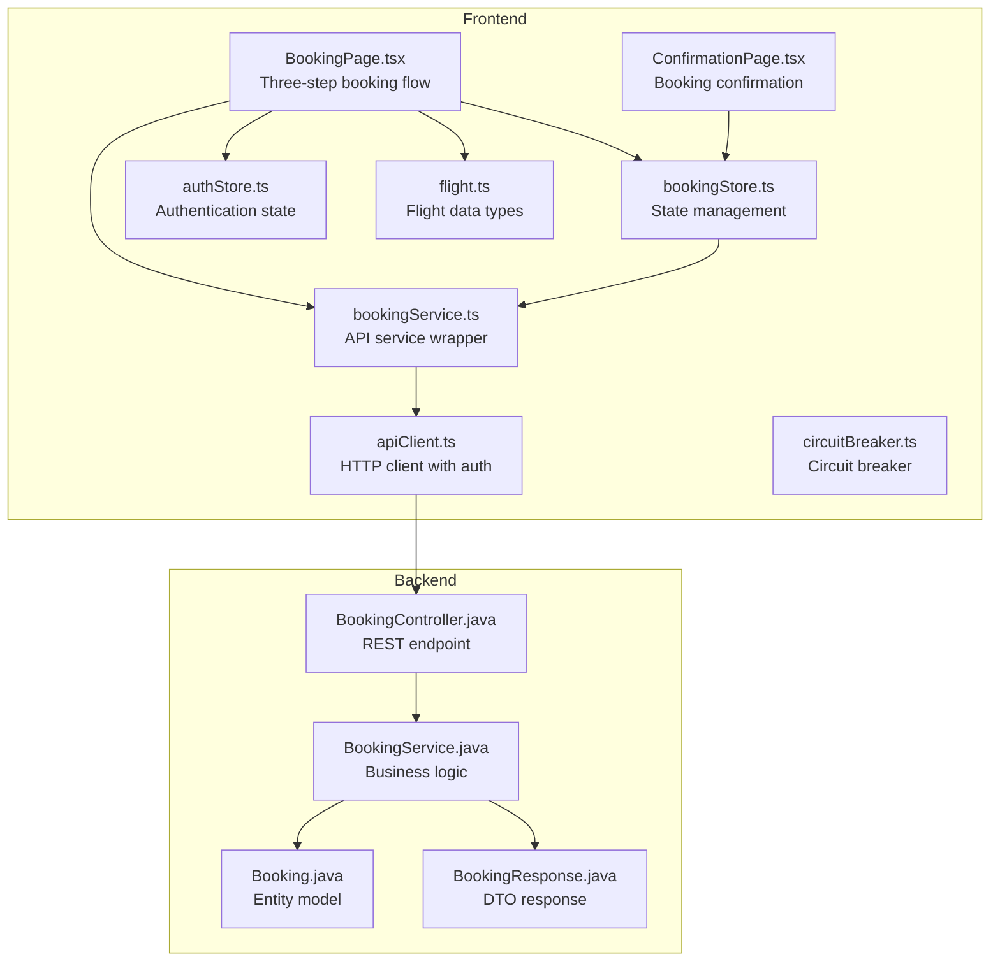

**Diagram sources**
- [BookingPage.tsx:1-559](file://skyflow-pro/src/pages/Booking/BookingPage.tsx#L1-L559)
- [bookingStore.ts:1-115](file://skyflow-pro/src/stores/bookingStore.ts#L1-L115)
- [bookingService.ts:1-39](file://skyflow-pro/src/services/bookings/bookingService.ts#L1-L39)
- [apiClient.ts:1-38](file://skyflow-pro/src/services/api/apiClient.ts#L1-L38)
- [circuitBreaker.ts:1-62](file://skyflow-pro/src/services/api/circuitBreaker.ts#L1-L62)
- [authStore.ts:1-123](file://skyflow-pro/src/stores/authStore.ts#L1-L123)
- [flight.ts:1-58](file://skyflow-pro/src/types/flight.ts#L1-L58)
- [BookingController.java:1-89](file://backend-server/src/main/java/com/skyflow/controller/BookingController.java#L1-L89)
- [BookingService.java:1-148](file://backend-server/src/main/java/com/skyflow/service/BookingService.java#L1-L148)
- [Booking.java:1-42](file://backend-server/src/main/java/com/skyflow/model/entity/Booking.java#L1-L42)
- [BookingResponse.java:1-24](file://backend-server/src/main/java/com/skyflow/model/dto/response/BookingResponse.java#L1-L24)

**Section sources**
- [BookingPage.tsx:1-559](file://skyflow-pro/src/pages/Booking/BookingPage.tsx#L1-L559)
- [bookingStore.ts:1-115](file://skyflow-pro/src/stores/bookingStore.ts#L1-L115)
- [bookingService.ts:1-39](file://skyflow-pro/src/services/bookings/bookingService.ts#L1-L39)
- [apiClient.ts:1-38](file://skyflow-pro/src/services/api/apiClient.ts#L1-L38)
- [circuitBreaker.ts:1-62](file://skyflow-pro/src/services/api/circuitBreaker.ts#L1-L62)
- [authStore.ts:1-123](file://skyflow-pro/src/stores/authStore.ts#L1-L123)
- [flight.ts:1-58](file://skyflow-pro/src/types/flight.ts#L1-L58)
- [BookingController.java:1-89](file://backend-server/src/main/java/com/skyflow/controller/BookingController.java#L1-L89)
- [BookingService.java:1-148](file://backend-server/src/main/java/com/skyflow/service/BookingService.java#L1-L148)
- [Booking.java:1-42](file://backend-server/src/main/java/com/skyflow/model/entity/Booking.java#L1-L42)
- [BookingResponse.java:1-24](file://backend-server/src/main/java/com/skyflow/model/dto/response/BookingResponse.java#L1-L24)

## Core Components
The booking workflow consists of several interconnected components:

### Frontend Components
- **BookingPage**: Implements the three-step booking flow with form validation and step navigation
- **ConfirmationPage**: Displays booking confirmation with e-ticket and actions
- **bookingStore**: Manages booking state, handles API calls, and provides demo mode fallback
- **bookingService**: Wraps API calls for booking operations
- **apiClient**: HTTP client with authentication and error handling
- **authStore**: Manages user authentication state and JWT tokens

### Backend Components
- **BookingController**: REST endpoint for booking creation with validation
- **BookingService**: Business logic for booking creation, seat management, and pricing
- **Booking Entity**: Database model for booking records
- **BookingResponse DTO**: Response structure for booking data

**Section sources**
- [BookingPage.tsx:31-559](file://skyflow-pro/src/pages/Booking/BookingPage.tsx#L31-L559)
- [ConfirmationPage.tsx:27-277](file://skyflow-pro/src/pages/BookingConfirmation/ConfirmationPage.tsx#L27-L277)
- [bookingStore.ts:31-115](file://skyflow-pro/src/stores/bookingStore.ts#L31-L115)
- [bookingService.ts:19-38](file://skyflow-pro/src/services/bookings/bookingService.ts#L19-L38)
- [apiClient.ts:4-38](file://skyflow-pro/src/services/api/apiClient.ts#L4-L38)
- [authStore.ts:30-90](file://skyflow-pro/src/stores/authStore.ts#L30-L90)
- [BookingController.java:14-89](file://backend-server/src/main/java/com/skyflow/controller/BookingController.java#L14-L89)
- [BookingService.java:22-148](file://backend-server/src/main/java/com/skyflow/service/BookingService.java#L22-L148)
- [Booking.java:8-42](file://backend-server/src/main/java/com/skyflow/model/entity/Booking.java#L8-L42)
- [BookingResponse.java:7-24](file://backend-server/src/main/java/com/skyflow/model/dto/response/BookingResponse.java#L7-L24)

## Architecture Overview
The booking workflow follows a client-server architecture with clear separation of concerns:

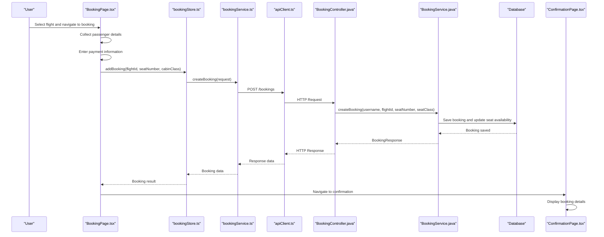

**Diagram sources**
- [BookingPage.tsx:98-154](file://skyflow-pro/src/pages/Booking/BookingPage.tsx#L98-L154)
- [bookingStore.ts:62-75](file://skyflow-pro/src/stores/bookingStore.ts#L62-L75)
- [bookingService.ts:20-28](file://skyflow-pro/src/services/bookings/bookingService.ts#L20-L28)
- [apiClient.ts:4-38](file://skyflow-pro/src/services/api/apiClient.ts#L4-L38)
- [BookingController.java:21-70](file://backend-server/src/main/java/com/skyflow/controller/BookingController.java#L21-L70)
- [BookingService.java:43-98](file://backend-server/src/main/java/com/skyflow/service/BookingService.java#L43-L98)
- [ConfirmationPage.tsx:27-65](file://skyflow-pro/src/pages/BookingConfirmation/ConfirmationPage.tsx#L27-L65)

## Detailed Component Analysis

### Three-Step Booking Flow Implementation

#### Step 1: Passenger Details Collection
The frontend implements a comprehensive passenger information form with validation:

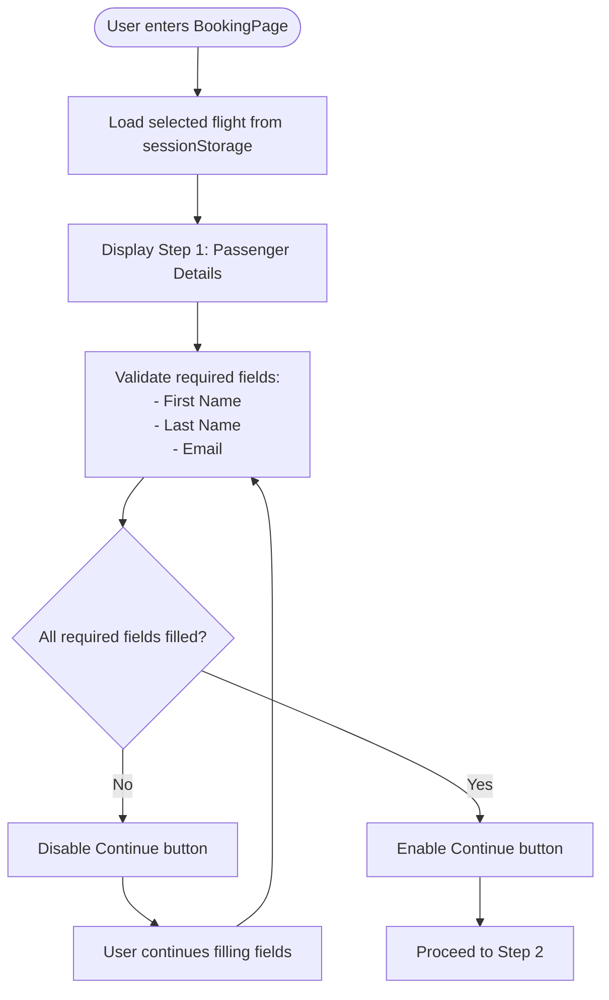

**Diagram sources**
- [BookingPage.tsx:176-177](file://skyflow-pro/src/pages/Booking/BookingPage.tsx#L176-L177)
- [BookingPage.tsx:244-328](file://skyflow-pro/src/pages/Booking/BookingPage.tsx#L244-L328)

Key validation rules implemented:
- Required fields: First Name, Last Name, Email
- Optional fields: Phone, Date of Birth, Passport Number
- Real-time field updates with controlled state management
- Formatted input for passport numbers (uppercase conversion)

#### Step 2: Payment Processing
The payment form includes comprehensive validation and security features:

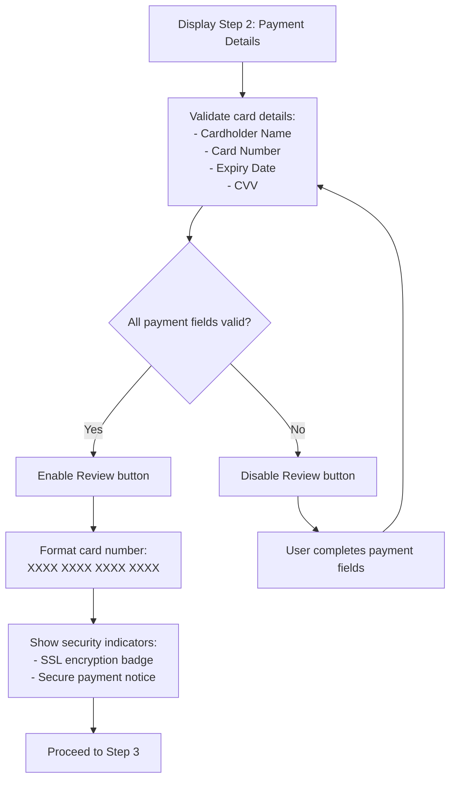

**Diagram sources**
- [BookingPage.tsx:330-409](file://skyflow-pro/src/pages/Booking/BookingPage.tsx#L330-L409)
- [BookingPage.tsx:71-80](file://skyflow-pro/src/pages/Booking/BookingPage.tsx#L71-L80)

Payment security features:
- Real-time card number formatting (4-digit groups)
- Password masking for CVV input
- SSL encryption indicators
- Network security badges

#### Step 3: Review and Confirmation
The final step requires terms agreement and handles booking submission:

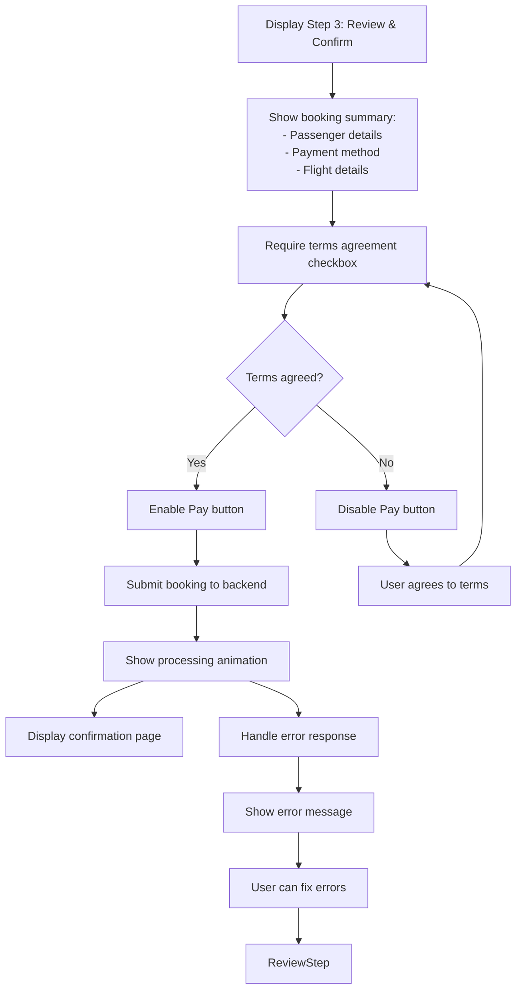

**Diagram sources**
- [BookingPage.tsx:411-479](file://skyflow-pro/src/pages/Booking/BookingPage.tsx#L411-L479)
- [BookingPage.tsx:98-154](file://skyflow-pro/src/pages/Booking/BookingPage.tsx#L98-L154)

**Section sources**
- [BookingPage.tsx:31-559](file://skyflow-pro/src/pages/Booking/BookingPage.tsx#L31-L559)

### Backend Booking Service Logic

#### Booking Creation Process
The backend implements robust booking creation with comprehensive validation:

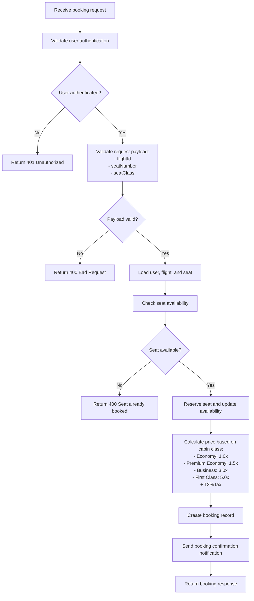

**Diagram sources**
- [BookingController.java:21-70](file://backend-server/src/main/java/com/skyflow/controller/BookingController.java#L21-L70)
- [BookingService.java:43-98](file://backend-server/src/main/java/com/skyflow/service/BookingService.java#L43-L98)

#### Transaction Handling
The backend ensures data consistency through transactional operations:

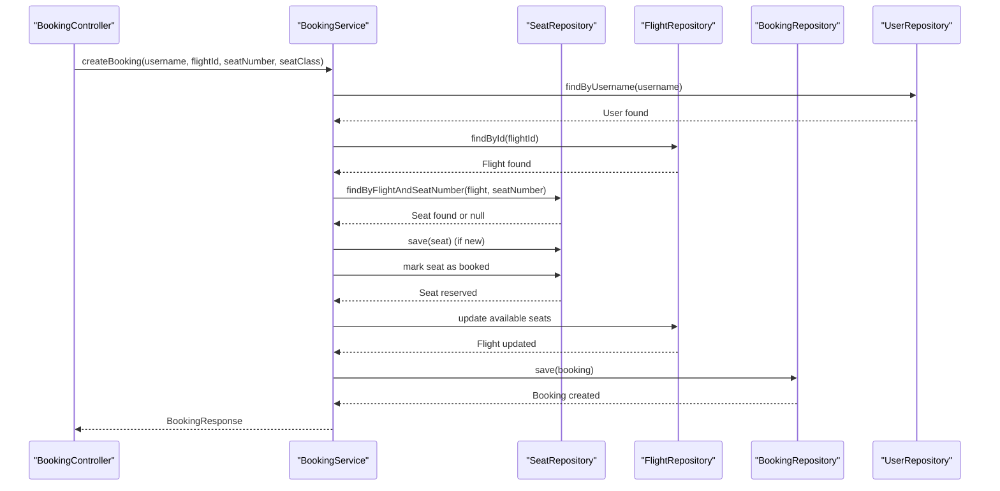

**Diagram sources**
- [BookingService.java:43-98](file://backend-server/src/main/java/com/skyflow/service/BookingService.java#L43-L98)
- [Booking.java:12-42](file://backend-server/src/main/java/com/skyflow/model/entity/Booking.java#L12-L42)

**Section sources**
- [BookingController.java:14-89](file://backend-server/src/main/java/com/skyflow/controller/BookingController.java#L14-L89)
- [BookingService.java:22-148](file://backend-server/src/main/java/com/skyflow/service/BookingService.java#L22-L148)
- [Booking.java:8-42](file://backend-server/src/main/java/com/skyflow/model/entity/Booking.java#L8-L42)

### Frontend-Backend Integration

#### API Communication Layer
The frontend uses a centralized API client with authentication:

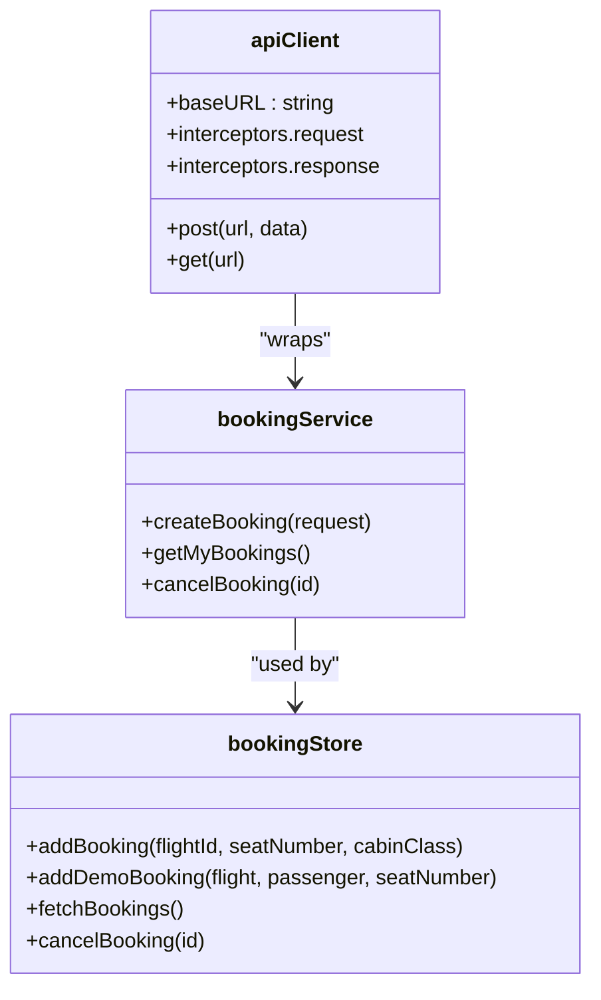

**Diagram sources**
- [apiClient.ts:4-38](file://skyflow-pro/src/services/api/apiClient.ts#L4-L38)
- [bookingService.ts:19-38](file://skyflow-pro/src/services/bookings/bookingService.ts#L19-L38)
- [bookingStore.ts:43-115](file://skyflow-pro/src/stores/bookingStore.ts#L43-L115)

#### Error Handling and Retry Mechanisms
The system implements comprehensive error handling:

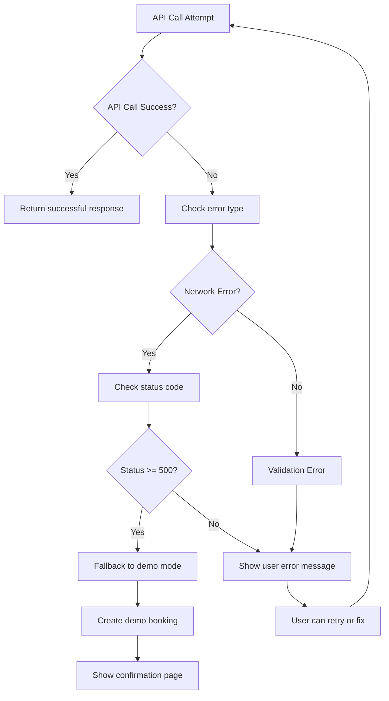

**Diagram sources**
- [BookingPage.tsx:106-154](file://skyflow-pro/src/pages/Booking/BookingPage.tsx#L106-L154)
- [bookingStore.ts:77-90](file://skyflow-pro/src/stores/bookingStore.ts#L77-L90)

**Section sources**
- [apiClient.ts:11-35](file://skyflow-pro/src/services/api/apiClient.ts#L11-L35)
- [bookingService.ts:19-38](file://skyflow-pro/src/services/bookings/bookingService.ts#L19-L38)
- [bookingStore.ts:62-90](file://skyflow-pro/src/stores/bookingStore.ts#L62-L90)
- [BookingPage.tsx:98-154](file://skyflow-pro/src/pages/Booking/BookingPage.tsx#L98-L154)

### State Management and Session Storage

#### Booking State Management
The frontend uses Zustand for state management with persistence:

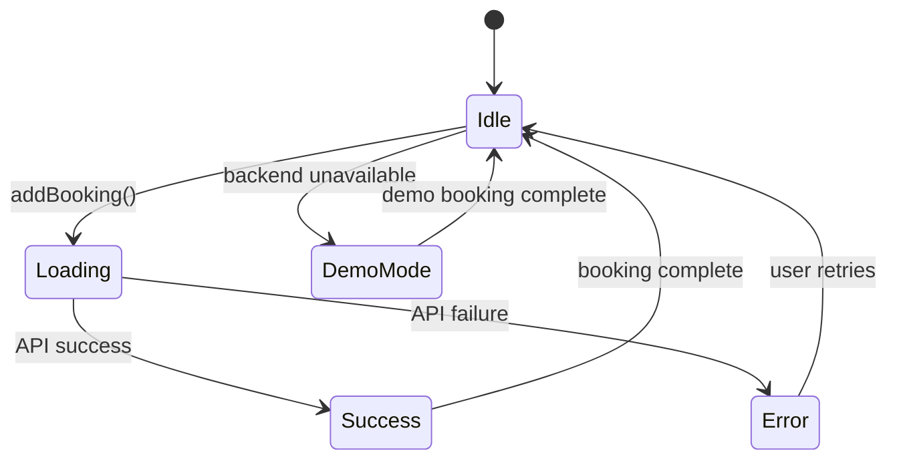

**Diagram sources**
- [bookingStore.ts:43-115](file://skyflow-pro/src/stores/bookingStore.ts#L43-L115)
- [bookingStore.ts:77-90](file://skyflow-pro/src/stores/bookingStore.ts#L77-L90)

#### Session Storage Usage
The system uses sessionStorage for flight data persistence:

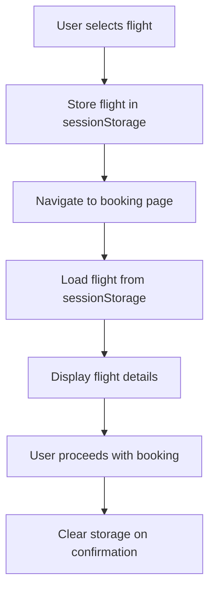

**Diagram sources**
- [BookingPage.tsx:55-61](file://skyflow-pro/src/pages/Booking/BookingPage.tsx#L55-L61)
- [ConfirmationPage.tsx:32-41](file://skyflow-pro/src/pages/BookingConfirmation/ConfirmationPage.tsx#L32-L41)

**Section sources**
- [bookingStore.ts:43-115](file://skyflow-pro/src/stores/bookingStore.ts#L43-L115)
- [BookingPage.tsx:55-61](file://skyflow-pro/src/pages/Booking/BookingPage.tsx#L55-L61)
- [ConfirmationPage.tsx:32-41](file://skyflow-pro/src/pages/BookingConfirmation/ConfirmationPage.tsx#L32-L41)

## Dependency Analysis

### Frontend Dependencies
The booking workflow components have the following dependencies:

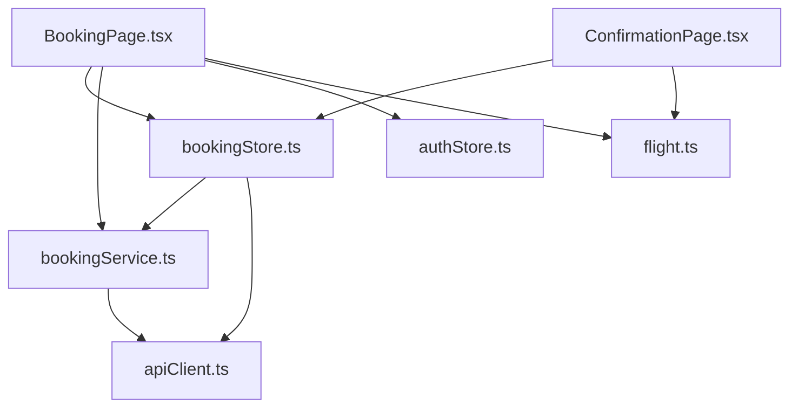

**Diagram sources**
- [BookingPage.tsx:1-559](file://skyflow-pro/src/pages/Booking/BookingPage.tsx#L1-L559)
- [bookingStore.ts:1-115](file://skyflow-pro/src/stores/bookingStore.ts#L1-L115)
- [bookingService.ts:1-39](file://skyflow-pro/src/services/bookings/bookingService.ts#L1-L39)
- [apiClient.ts:1-38](file://skyflow-pro/src/services/api/apiClient.ts#L1-L38)
- [ConfirmationPage.tsx:1-277](file://skyflow-pro/src/pages/BookingConfirmation/ConfirmationPage.tsx#L1-L277)
- [flight.ts:1-58](file://skyflow-pro/src/types/flight.ts#L1-L58)

### Backend Dependencies
The backend components demonstrate clean separation of concerns:

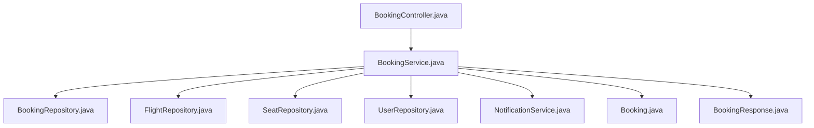

**Diagram sources**
- [BookingController.java:14-89](file://backend-server/src/main/java/com/skyflow/controller/BookingController.java#L14-L89)
- [BookingService.java:22-148](file://backend-server/src/main/java/com/skyflow/service/BookingService.java#L22-L148)
- [Booking.java:8-42](file://backend-server/src/main/java/com/skyflow/model/entity/Booking.java#L8-L42)
- [BookingResponse.java:7-24](file://backend-server/src/main/java/com/skyflow/model/dto/response/BookingResponse.java#L7-L24)

**Section sources**
- [BookingPage.tsx:1-559](file://skyflow-pro/src/pages/Booking/BookingPage.tsx#L1-L559)
- [bookingStore.ts:1-115](file://skyflow-pro/src/stores/bookingStore.ts#L1-L115)
- [BookingController.java:14-89](file://backend-server/src/main/java/com/skyflow/controller/BookingController.java#L14-L89)
- [BookingService.java:22-148](file://backend-server/src/main/java/com/skyflow/service/BookingService.java#L22-L148)

## Performance Considerations
The booking system implements several performance optimization strategies:

### Frontend Optimizations
- **State Persistence**: Uses localStorage with Zustand middleware to persist booking state
- **Session Storage**: Stores flight data to avoid re-fetching during booking process
- **Lazy Loading**: Components load only when needed
- **Form Validation**: Client-side validation reduces unnecessary API calls

### Backend Optimizations
- **Transaction Management**: Ensures atomic operations for booking creation
- **Entity Relationships**: Proper JPA relationships minimize database queries
- **Price Calculation**: Efficient calculation logic with caching potential
- **Repository Pattern**: Clean separation reduces query complexity

## Troubleshooting Guide

### Common Issues and Solutions

#### Authentication Issues
- **Problem**: Users cannot proceed to booking without authentication
- **Solution**: The system automatically opens the profile modal for unauthenticated users
- **Prevention**: Ensure JWT tokens are properly stored and refreshed

#### Backend Unavailable
- **Problem**: Backend server down or unreachable
- **Solution**: Automatic fallback to demo mode creates a booking with demo PNR
- **Indicator**: Demo bookings have "DEMO-" prefix in PNR

#### Payment Validation Errors
- **Problem**: Payment form validation fails
- **Solution**: Real-time validation prevents invalid submissions
- **Common Issues**: 
  - Card number format (must be 16 digits with spaces)
  - Expiry date format (MM/YY)
  - CVV length (3-4 digits)

#### Seat Availability Issues
- **Problem**: Selected seat already booked
- **Solution**: Backend returns 400 error with "Seat already booked"
- **User Experience**: System displays appropriate error message

#### Session Storage Issues
- **Problem**: Flight data lost between pages
- **Solution**: Flight data is stored in sessionStorage during selection
- **Recovery**: Booking page attempts to reload flight data from storage

**Section sources**
- [BookingPage.tsx:101-154](file://skyflow-pro/src/pages/Booking/BookingPage.tsx#L101-L154)
- [bookingStore.ts:77-90](file://skyflow-pro/src/stores/bookingStore.ts#L77-L90)
- [BookingController.java:60-69](file://backend-server/src/main/java/com/skyflow/controller/BookingController.java#L60-L69)

## Conclusion
The Airline Reservation System implements a robust and user-friendly booking workflow that seamlessly integrates frontend and backend components. The three-step booking process provides clear user guidance with comprehensive validation and error handling. The system's architecture ensures data consistency through transactional operations while maintaining excellent user experience through real-time validation, progress tracking, and fallback mechanisms. The combination of React state management, Spring Boot backend services, and comprehensive error handling creates a reliable booking system suitable for production deployment.

The implementation demonstrates best practices in:
- Clean separation of concerns between frontend and backend
- Comprehensive form validation and user feedback
- Robust error handling with graceful degradation
- Persistent state management for improved user experience
- Transactional database operations for data integrity
- Security considerations in payment processing

This documentation provides the foundation for understanding, maintaining, and extending the booking workflow system.