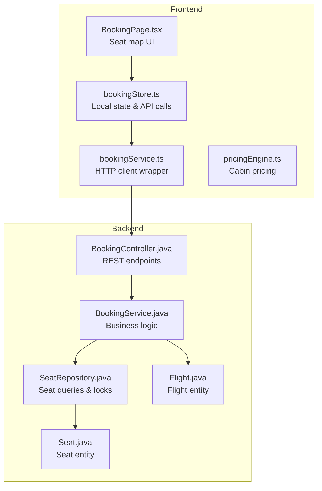
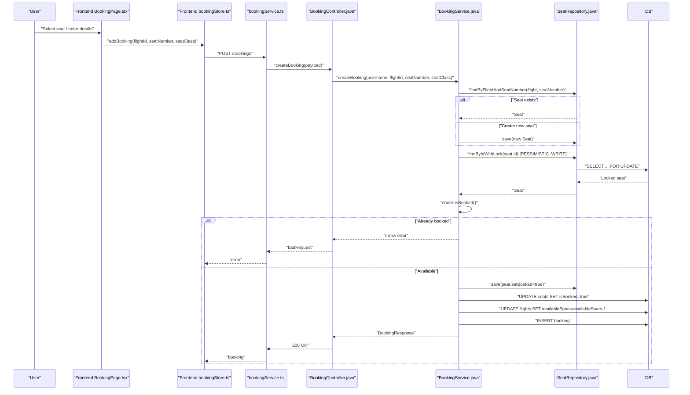
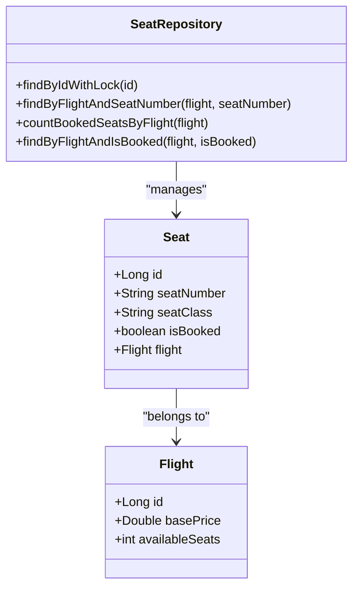
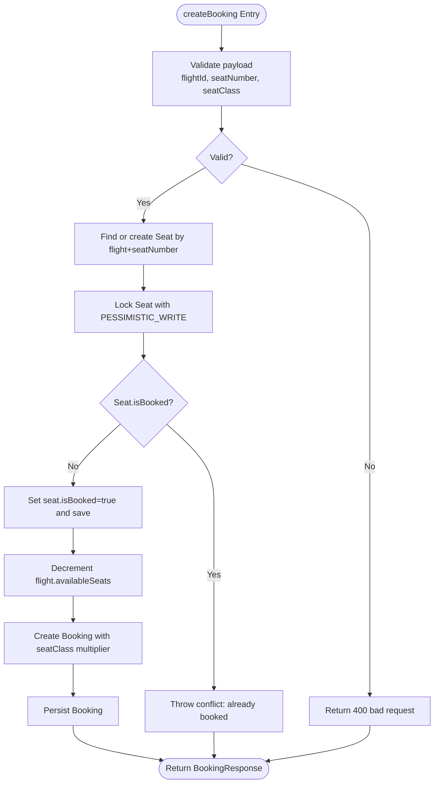
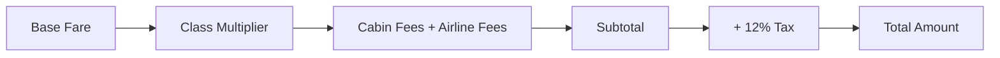
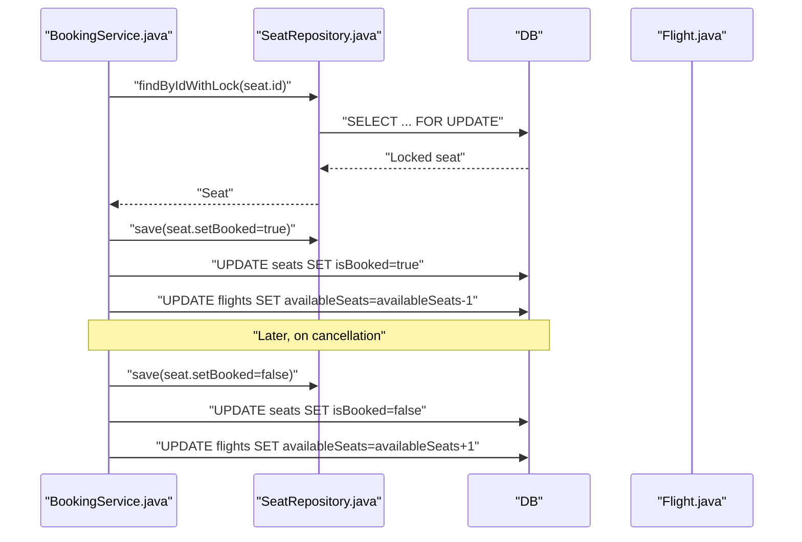
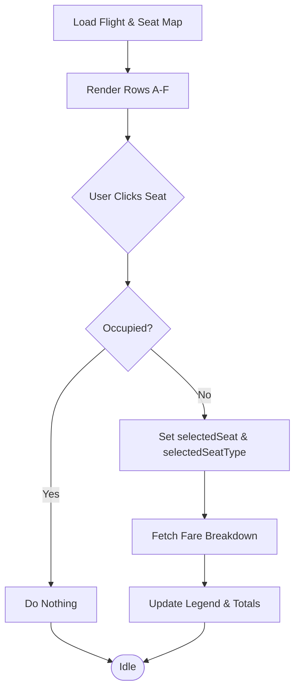
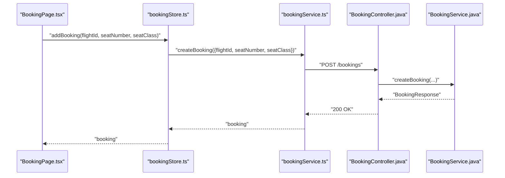
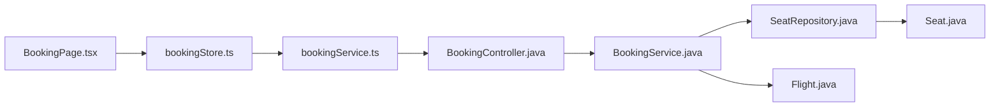

# Seat Selection and Allocation

<cite>
**Referenced Files in This Document**
- [Seat.java](file://backend-server/src/main/java/com/skyflow/model/entity/Seat.java)
- [Flight.java](file://backend-server/src/main/java/com/skyflow/model/entity/Flight.java)
- [SeatRepository.java](file://backend-server/src/main/java/com/skyflow/repository/SeatRepository.java)
- [BookingService.java](file://backend-server/src/main/java/com/skyflow/service/BookingService.java)
- [BookingController.java](file://backend-server/src/main/java/com/skyflow/controller/BookingController.java)
- [BookingResponse.java](file://backend-server/src/main/java/com/skyflow/model/dto/response/BookingResponse.java)
- [BookingPage.tsx](file://skyflow-pro-enhanced/src/pages/BookingPage.tsx)
- [bookingStore.ts](file://skyflow-pro/src/stores/bookingStore.ts)
- [bookingService.ts](file://skyflow-pro/src/services/bookings/bookingService.ts)
- [pricingEngine.ts](file://skyflow-pro/src/config/pricingEngine.ts)
</cite>

## Table of Contents
1. [Introduction](#introduction)
2. [Project Structure](#project-structure)
3. [Core Components](#core-components)
4. [Architecture Overview](#architecture-overview)
5. [Detailed Component Analysis](#detailed-component-analysis)
6. [Dependency Analysis](#dependency-analysis)
7. [Performance Considerations](#performance-considerations)
8. [Troubleshooting Guide](#troubleshooting-guide)
9. [Conclusion](#conclusion)

## Introduction
This document explains the seat selection and allocation system across the frontend and backend. It covers the seat visualization and selection UX, seat availability and validation, seat assignment to bookings, seat types and pricing tiers, cabin class configurations, seat blocking and release mechanics, concurrency handling, and the integration between the React frontend and Spring Boot backend services.

## Project Structure
The seat selection and allocation spans three primary areas:
- Backend Java (Spring Boot): seat persistence, flight availability, booking creation, cancellation, and seat locking.
- Frontend React (skyflow-pro-enhanced): seat map visualization, seat selection UX, and real-time fare breakdown updates.
- Frontend React (skyflow-pro): booking store and service integration for API communication.

**Diagram sources**
- [BookingPage.tsx:60-722](file://skyflow-pro-enhanced/src/pages/BookingPage.tsx#L60-L722)
- [bookingStore.ts:43-115](file://skyflow-pro/src/stores/bookingStore.ts#L43-L115)
- [bookingService.ts:19-39](file://skyflow-pro/src/services/bookings/bookingService.ts#L19-L39)
- [BookingController.java:14-89](file://backend-server/src/main/java/com/skyflow/controller/BookingController.java#L14-L89)
- [BookingService.java:22-148](file://backend-server/src/main/java/com/skyflow/service/BookingService.java#L22-L148)
- [SeatRepository.java:13-24](file://backend-server/src/main/java/com/skyflow/repository/SeatRepository.java#L13-L24)
- [Seat.java:13-29](file://backend-server/src/main/java/com/skyflow/model/entity/Seat.java#L13-L29)
- [Flight.java:12-42](file://backend-server/src/main/java/com/skyflow/model/entity/Flight.java#L12-L42)

**Section sources**
- [BookingPage.tsx:60-722](file://skyflow-pro-enhanced/src/pages/BookingPage.tsx#L60-L722)
- [bookingStore.ts:43-115](file://skyflow-pro/src/stores/bookingStore.ts#L43-L115)
- [bookingService.ts:19-39](file://skyflow-pro/src/services/bookings/bookingService.ts#L19-L39)
- [BookingController.java:14-89](file://backend-server/src/main/java/com/skyflow/controller/BookingController.java#L14-L89)
- [BookingService.java:22-148](file://backend-server/src/main/java/com/skyflow/service/BookingService.java#L22-L148)
- [SeatRepository.java:13-24](file://backend-server/src/main/java/com/skyflow/repository/SeatRepository.java#L13-L24)
- [Seat.java:13-29](file://backend-server/src/main/java/com/skyflow/model/entity/Seat.java#L13-L29)
- [Flight.java:12-42](file://backend-server/src/main/java/com/skyflow/model/entity/Flight.java#L12-L42)

## Core Components
- Seat entity and repository: define seat attributes, uniqueness constraint (flight + seatNumber), and locking for concurrency.
- Flight entity: tracks base price and availableSeats.
- Booking service: validates seat availability, marks seats as booked, updates flight availability, computes pricing by cabin class, and manages cancellations.
- Booking controller: validates request payload, authenticates requests, and delegates to the service.
- Frontend seat map: renders seat rows and columns, legend for seat types, selection UX, and dynamic fare breakdown.
- Frontend booking store and service: orchestrate API calls and local fallback behavior.

**Section sources**
- [Seat.java:13-29](file://backend-server/src/main/java/com/skyflow/model/entity/Seat.java#L13-L29)
- [SeatRepository.java:13-24](file://backend-server/src/main/java/com/skyflow/repository/SeatRepository.java#L13-L24)
- [Flight.java:12-42](file://backend-server/src/main/java/com/skyflow/model/entity/Flight.java#L12-L42)
- [BookingService.java:43-98](file://backend-server/src/main/java/com/skyflow/service/BookingService.java#L43-L98)
- [BookingController.java:21-70](file://backend-server/src/main/java/com/skyflow/controller/BookingController.java#L21-L70)
- [BookingPage.tsx:284-373](file://skyflow-pro-enhanced/src/pages/BookingPage.tsx#L284-L373)
- [bookingStore.ts:62-75](file://skyflow-pro/src/stores/bookingStore.ts#L62-L75)
- [bookingService.ts:19-39](file://skyflow-pro/src/services/bookings/bookingService.ts#L19-L39)

## Architecture Overview
The seat allocation follows a transactional flow:
- Frontend collects passenger info, optionally selects a seat, and submits a booking request.
- Backend validates the request, locates or creates the seat record, checks availability, and performs a pessimistic write lock to prevent race conditions.
- If available, the seat is marked as booked, flight availableSeats decremented, and a booking is created with calculated total amount based on cabin class.
- On cancellation, the seat is released, and availableSeats is restored.

**Diagram sources**
- [BookingPage.tsx:139-157](file://skyflow-pro-enhanced/src/pages/BookingPage.tsx#L139-L157)
- [bookingStore.ts:62-75](file://skyflow-pro/src/stores/bookingStore.ts#L62-L75)
- [bookingService.ts:20-28](file://skyflow-pro/src/services/bookings/bookingService.ts#L20-L28)
- [BookingController.java:21-70](file://backend-server/src/main/java/com/skyflow/controller/BookingController.java#L21-L70)
- [BookingService.java:43-98](file://backend-server/src/main/java/com/skyflow/service/BookingService.java#L43-L98)
- [SeatRepository.java:14-16](file://backend-server/src/main/java/com/skyflow/repository/SeatRepository.java#L14-L16)

## Detailed Component Analysis

### Seat Entity and Availability
- Seat entity enforces uniqueness on (flight_id, seatNumber) and tracks seatClass and isBooked flag.
- SeatRepository exposes:
  - findByIdWithLock using PESSIMISTIC_WRITE to serialize access.
  - findByFlightAndSeatNumber to locate existing seats.
  - countBookedSeatsByFlight and findByFlightAndIsBooked for reporting and seat map generation.

**Diagram sources**
- [Seat.java:13-29](file://backend-server/src/main/java/com/skyflow/model/entity/Seat.java#L13-L29)
- [Flight.java:12-42](file://backend-server/src/main/java/com/skyflow/model/entity/Flight.java#L12-L42)
- [SeatRepository.java:13-24](file://backend-server/src/main/java/com/skyflow/repository/SeatRepository.java#L13-L24)

**Section sources**
- [Seat.java:13-29](file://backend-server/src/main/java/com/skyflow/model/entity/Seat.java#L13-L29)
- [SeatRepository.java:13-24](file://backend-server/src/main/java/com/skyflow/repository/SeatRepository.java#L13-L24)
- [Flight.java:12-42](file://backend-server/src/main/java/com/skyflow/model/entity/Flight.java#L12-L42)

### Backend Seat Allocation Algorithm
- Request validation: controller checks presence and validity of flightId, seatNumber, and seatClass.
- Seat lookup or creation: service finds an existing seat for the flight/seatNumber or creates a new seat with the requested class.
- Availability check and locking: service retrieves the seat with a pessimistic write lock to prevent race conditions.
- Conflict resolution: if seat.isBooked is true, a conflict is raised; otherwise, the seat is marked booked and persisted.
- Flight availability update: availableSeats decremented atomically.
- Booking creation: booking saved with computed total amount based on seatClass multiplier and taxes.
- Response mapping: BookingResponse DTO populated with booking metadata and seat details.

**Diagram sources**
- [BookingController.java:21-70](file://backend-server/src/main/java/com/skyflow/controller/BookingController.java#L21-L70)
- [BookingService.java:43-98](file://backend-server/src/main/java/com/skyflow/service/BookingService.java#L43-L98)
- [SeatRepository.java:14-16](file://backend-server/src/main/java/com/skyflow/repository/SeatRepository.java#L14-L16)

**Section sources**
- [BookingController.java:21-70](file://backend-server/src/main/java/com/skyflow/controller/BookingController.java#L21-L70)
- [BookingService.java:43-98](file://backend-server/src/main/java/com/skyflow/service/BookingService.java#L43-L98)
- [SeatRepository.java:14-16](file://backend-server/src/main/java/com/skyflow/repository/SeatRepository.java#L14-L16)

### Seat Types, Pricing Tiers, and Cabin Classes
- Backend pricing multiplier:
  - Premium Economy: multiplier 1.5
  - Business: multiplier 3.0
  - First Class: multiplier 5.0
  - Default (Economy): multiplier 1.0
  - Total amount includes 12% tax on base × multiplier.
- Frontend pricing engine (skyflow-pro):
  - Provides cabin class multipliers and fees for pricing comparisons.
  - Seat selection fee per cabin class can be configured per airline.
- Frontend seat map:
  - Seat types mapped to visual styles and seatCharge values.
  - Fare breakdown updates dynamically when seat type changes.

**Diagram sources**
- [BookingService.java:80-89](file://backend-server/src/main/java/com/skyflow/service/BookingService.java#L80-L89)
- [pricingEngine.ts:94-145](file://skyflow-pro/src/config/pricingEngine.ts#L94-L145)
- [BookingPage.tsx:95-104](file://skyflow-pro-enhanced/src/pages/BookingPage.tsx#L95-L104)

**Section sources**
- [BookingService.java:80-89](file://backend-server/src/main/java/com/skyflow/service/BookingService.java#L80-L89)
- [pricingEngine.ts:94-145](file://skyflow-pro/src/config/pricingEngine.ts#L94-L145)
- [BookingPage.tsx:95-104](file://skyflow-pro-enhanced/src/pages/BookingPage.tsx#L95-L104)

### Seat Blocking and Release Mechanisms
- Blocking during booking:
  - SeatRepository uses PESSIMISTIC_WRITE lock on seat retrieval to serialize concurrent attempts.
- Release on cancellation:
  - BookingService cancels a booking by setting status to CANCELLED, marking seat.isBooked=false, saving the seat, and incrementing flight.availableSeats.

**Diagram sources**
- [SeatRepository.java:14-16](file://backend-server/src/main/java/com/skyflow/repository/SeatRepository.java#L14-L16)
- [BookingService.java:107-127](file://backend-server/src/main/java/com/skyflow/service/BookingService.java#L107-L127)

**Section sources**
- [SeatRepository.java:14-16](file://backend-server/src/main/java/com/skyflow/repository/SeatRepository.java#L14-L16)
- [BookingService.java:107-127](file://backend-server/src/main/java/com/skyflow/service/BookingService.java#L107-L127)

### Frontend Seat Selection UX and Seat Map Rendering
- Seat map layout:
  - Rows labeled 1–6, columns A–F with aisle separators.
  - Seat IDs constructed as row + column (e.g., 1A).
- Seat types and pricing:
  - Row-based seatType mapping: premium (rows 1–2), extra_legroom (rows 3–4), preferred (rows 5–6), standard otherwise.
  - Visual legend shows label, price, and color-coded seat classes.
- Occupancy and selection:
  - Predefined occupiedSeats set prevents selection.
  - onClick handler sets selectedSeat and selectedSeatType.
- Fare breakdown:
  - useEffect triggers FlightService.getFareBreakdown when seatType changes, updating the UI with seatCharge and surge pricing.

**Diagram sources**
- [BookingPage.tsx:35-58](file://skyflow-pro-enhanced/src/pages/BookingPage.tsx#L35-L58)
- [BookingPage.tsx:125-129](file://skyflow-pro-enhanced/src/pages/BookingPage.tsx#L125-L129)
- [BookingPage.tsx:95-104](file://skyflow-pro-enhanced/src/pages/BookingPage.tsx#L95-L104)

**Section sources**
- [BookingPage.tsx:284-373](file://skyflow-pro-enhanced/src/pages/BookingPage.tsx#L284-L373)
- [BookingPage.tsx:307-359](file://skyflow-pro-enhanced/src/pages/BookingPage.tsx#L307-L359)
- [BookingPage.tsx:125-129](file://skyflow-pro-enhanced/src/pages/BookingPage.tsx#L125-L129)
- [BookingPage.tsx:95-104](file://skyflow-pro-enhanced/src/pages/BookingPage.tsx#L95-L104)

### Backend Seat Availability Checking Logic
- Seat existence:
  - SeatRepository.findByFlightAndSeatNumber locates the seat for the given flight and seatNumber.
- Counting occupied seats:
  - SeatRepository.countBookedSeatsByFlight provides a quick count for reporting or seat map generation.
- Listing occupied seats:
  - SeatRepository.findByFlightAndIsBooked(flight, true) returns all booked seats for a flight.

**Section sources**
- [SeatRepository.java:18-23](file://backend-server/src/main/java/com/skyflow/repository/SeatRepository.java#L18-L23)

### Frontend Integration Between Seat Selection and Backend Services
- Frontend booking store:
  - addBooking invokes bookingService.createBooking with flightId, seatNumber, and seatClass.
  - addDemoBooking provides a local fallback when the backend is unavailable.
- Frontend service:
  - bookingService wraps HTTP calls to /bookings, /bookings/my-bookings, and /bookings/cancel/{id}.
- Controller and service:
  - BookingController validates authentication and payload, then delegates to BookingService.
  - BookingService orchestrates seat locking, availability checks, and booking persistence.

**Diagram sources**
- [BookingPage.tsx:139-157](file://skyflow-pro-enhanced/src/pages/BookingPage.tsx#L139-L157)
- [bookingStore.ts:62-75](file://skyflow-pro/src/stores/bookingStore.ts#L62-L75)
- [bookingService.ts:20-28](file://skyflow-pro/src/services/bookings/bookingService.ts#L20-L28)
- [BookingController.java:21-70](file://backend-server/src/main/java/com/skyflow/controller/BookingController.java#L21-L70)
- [BookingService.java:43-98](file://backend-server/src/main/java/com/skyflow/service/BookingService.java#L43-L98)

**Section sources**
- [bookingStore.ts:62-75](file://skyflow-pro/src/stores/bookingStore.ts#L62-L75)
- [bookingService.ts:19-39](file://skyflow-pro/src/services/bookings/bookingService.ts#L19-L39)
- [BookingController.java:21-70](file://backend-server/src/main/java/com/skyflow/controller/BookingController.java#L21-L70)
- [BookingService.java:43-98](file://backend-server/src/main/java/com/skyflow/service/BookingService.java#L43-L98)

## Dependency Analysis
- Backend dependencies:
  - BookingController depends on BookingService.
  - BookingService depends on SeatRepository, FlightRepository, BookingRepository, UserRepository, and NotificationService.
  - SeatRepository extends JPA repositories and defines JPQL queries with locking.
- Frontend dependencies:
  - BookingPage.tsx depends on FlightService for fare breakdown and uses seatTypeConfig and seatRows.
  - bookingStore.ts integrates with bookingService.ts for API calls.
  - pricingEngine.ts provides pricing logic independent of UI.

**Diagram sources**
- [BookingPage.tsx:60-722](file://skyflow-pro-enhanced/src/pages/BookingPage.tsx#L60-L722)
- [bookingStore.ts:43-115](file://skyflow-pro/src/stores/bookingStore.ts#L43-L115)
- [bookingService.ts:19-39](file://skyflow-pro/src/services/bookings/bookingService.ts#L19-L39)
- [BookingController.java:14-89](file://backend-server/src/main/java/com/skyflow/controller/BookingController.java#L14-L89)
- [BookingService.java:22-148](file://backend-server/src/main/java/com/skyflow/service/BookingService.java#L22-L148)
- [SeatRepository.java:13-24](file://backend-server/src/main/java/com/skyflow/repository/SeatRepository.java#L13-L24)
- [Seat.java:13-29](file://backend-server/src/main/java/com/skyflow/model/entity/Seat.java#L13-L29)
- [Flight.java:12-42](file://backend-server/src/main/java/com/skyflow/model/entity/Flight.java#L12-L42)

**Section sources**
- [BookingController.java:14-89](file://backend-server/src/main/java/com/skyflow/controller/BookingController.java#L14-L89)
- [BookingService.java:22-148](file://backend-server/src/main/java/com/skyflow/service/BookingService.java#L22-L148)
- [SeatRepository.java:13-24](file://backend-server/src/main/java/com/skyflow/repository/SeatRepository.java#L13-L24)
- [Seat.java:13-29](file://backend-server/src/main/java/com/skyflow/model/entity/Seat.java#L13-L29)
- [Flight.java:12-42](file://backend-server/src/main/java/com/skyflow/model/entity/Flight.java#L12-L42)
- [BookingPage.tsx:60-722](file://skyflow-pro-enhanced/src/pages/BookingPage.tsx#L60-L722)
- [bookingStore.ts:43-115](file://skyflow-pro/src/stores/bookingStore.ts#L43-L115)
- [bookingService.ts:19-39](file://skyflow-pro/src/services/bookings/bookingService.ts#L19-L39)

## Performance Considerations
- Concurrency control:
  - PESSIMISTIC_WRITE lock ensures only one thread can modify a seat at a time, preventing race conditions.
- Database efficiency:
  - Unique constraint on (flight_id, seatNumber) supports fast lookups.
  - countBookedSeatsByFlight enables efficient seat occupancy reporting.
- Frontend responsiveness:
  - Debounce or throttle fare breakdown fetches when seatType changes.
  - Local demo fallback avoids blocking UI on backend unavailability.

[No sources needed since this section provides general guidance]

## Troubleshooting Guide
- Common backend errors:
  - Missing or invalid payload fields result in 400 responses.
  - Seat already booked raises a conflict; adjust selection or retry later.
  - Seat not found triggers a controlled error path; verify flightId and seatNumber.
- Frontend handling:
  - Demo mode fallback allows users to continue even if backend is unreachable.
  - Validation messages guide users to correct input (e.g., missing passenger/payment details).
- Cancellation:
  - Ensure the correct user context; unauthorized cancellations are rejected.
  - After cancellation, seat becomes available again and flight.availableSeats increments.

**Section sources**
- [BookingController.java:33-69](file://backend-server/src/main/java/com/skyflow/controller/BookingController.java#L33-L69)
- [BookingService.java:107-127](file://backend-server/src/main/java/com/skyflow/service/BookingService.java#L107-L127)
- [BookingPage.tsx:139-157](file://skyflow-pro-enhanced/src/pages/BookingPage.tsx#L139-L157)
- [bookingStore.ts:77-90](file://skyflow-pro/src/stores/bookingStore.ts#L77-L90)

## Conclusion
The seat selection and allocation system combines a robust backend with a responsive frontend:
- Backend: strict concurrency control via pessimistic locking, seat and flight availability management, and class-based pricing.
- Frontend: intuitive seat map with dynamic pricing, seamless booking flow, and graceful fallback behavior.
Together, they deliver a reliable, scalable, and user-friendly seat booking experience.