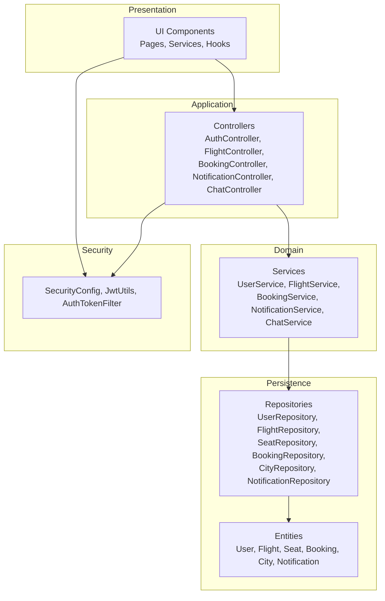
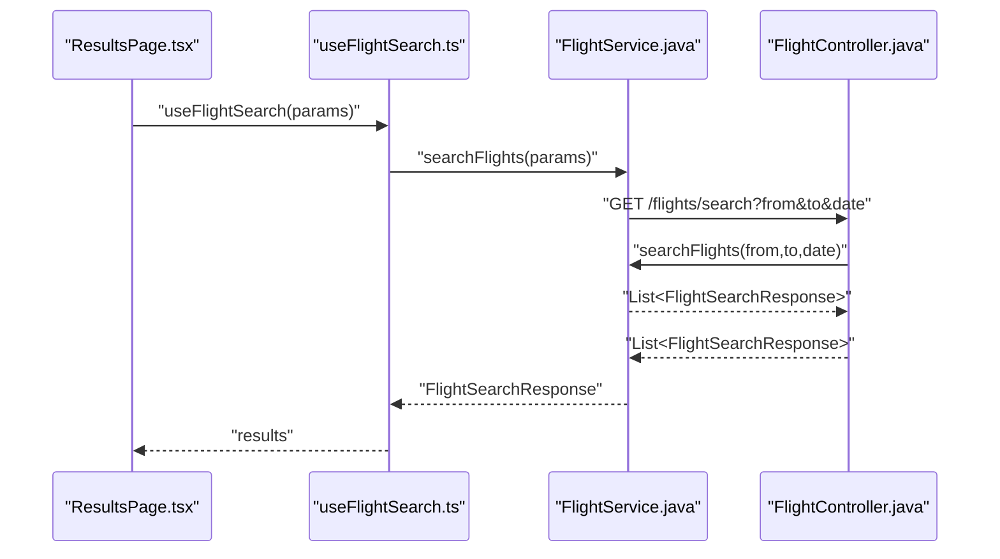
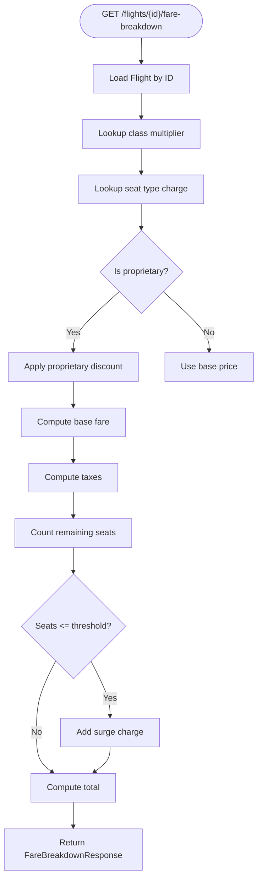
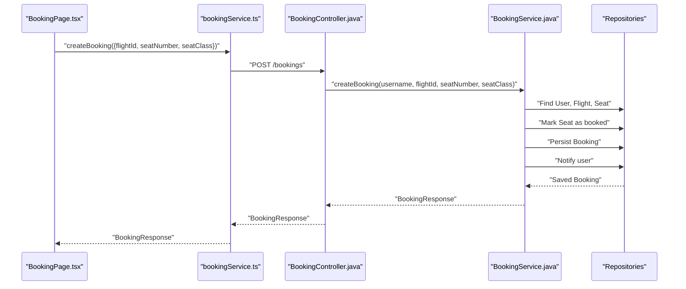
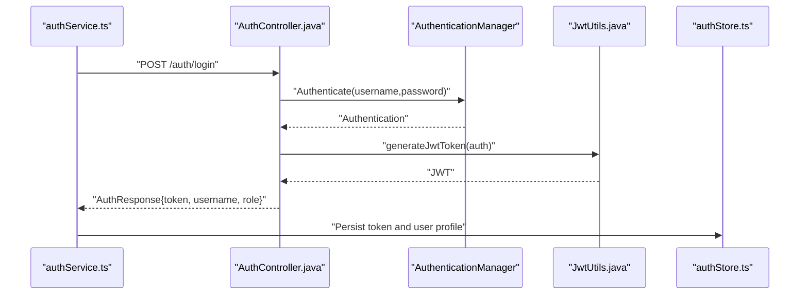
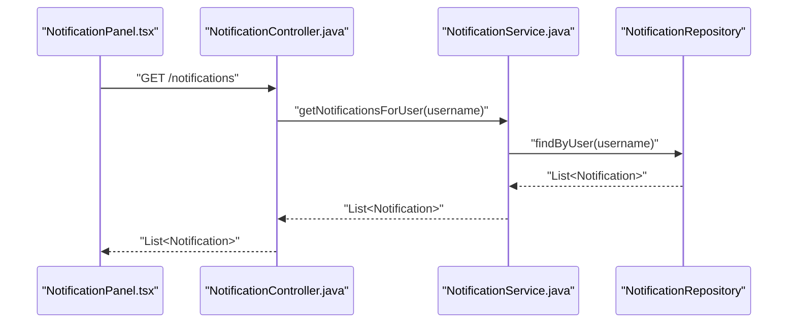
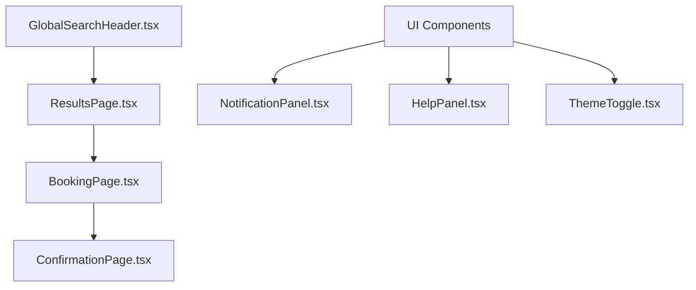
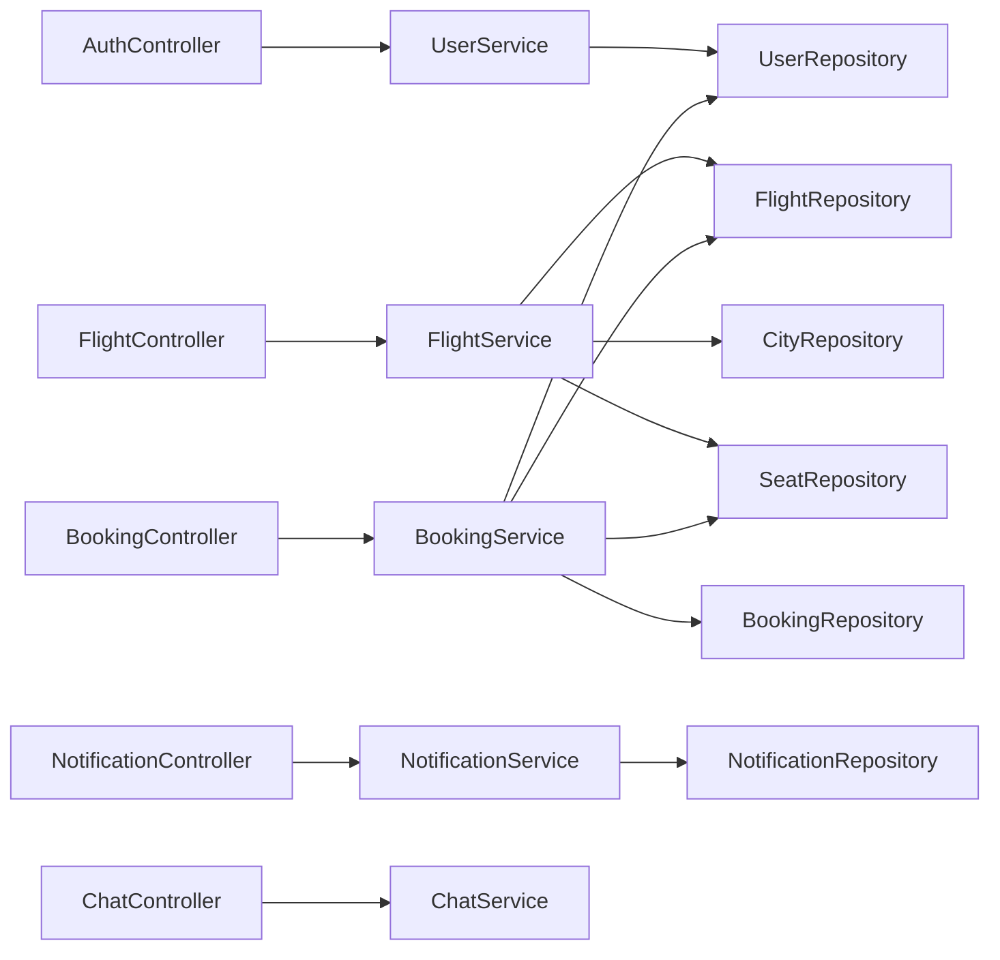

# Features Implementation

<cite>
**Referenced Files in This Document**
- [SkyflowApplication.java](file://backend-server/src/main/java/com/skyflow/SkyflowApplication.java)
- [SecurityConfig.java](file://backend-server/src/main/java/com/skyflow/config/SecurityConfig.java)
- [AuthTokenFilter.java](file://backend-server/src/main/java/com/skyflow/security/AuthTokenFilter.java)
- [JwtUtils.java](file://backend-server/src/main/java/com/skyflow/security/JwtUtils.java)
- [AuthController.java](file://backend-server/src/main/java/com/skyflow/controller/AuthController.java)
- [UserController.java](file://backend-server/src/main/java/com/skyflow/controller/UserController.java)
- [FlightController.java](file://backend-server/src/main/java/com/skyflow/controller/FlightController.java)
- [BookingController.java](file://backend-server/src/main/java/com/skyflow/controller/BookingController.java)
- [NotificationController.java](file://backend-server/src/main/java/com/skyflow/controller/NotificationController.java)
- [ChatController.java](file://backend-server/src/main/java/com/skyflow/controller/ChatController.java)
- [UserService.java](file://backend-server/src/main/java/com/skyflow/service/UserService.java)
- [FlightService.java](file://backend-server/src/main/java/com/skyflow/service/FlightService.java)
- [BookingService.java](file://backend-server/src/main/java/com/skyflow/service/BookingService.java)
- [NotificationService.java](file://backend-server/src/main/java/com/skyflow/service/NotificationService.java)
- [ChatService.java](file://backend-server/src/main/java/com/skyflow/service/ChatService.java)
- [User.java](file://backend-server/src/main/java/com/skyflow/model/entity/User.java)
- [Booking.java](file://backend-server/src/main/java/com/skyflow/model/entity/Booking.java)
- [Flight.java](file://backend-server/src/main/java/com/skyflow/model/entity/Flight.java)
- [Seat.java](file://backend-server/src/main/java/com/skyflow/model/entity/Seat.java)
- [Notification.java](file://backend-server/src/main/java/com/skyflow/model/entity/Notification.java)
- [BookingResponse.java](file://backend-server/src/main/java/com/skyflow/model/dto/response/BookingResponse.java)
- [FlightSearchResponse.java](file://backend-server/src/main/java/com/skyflow/model/dto/response/FlightSearchResponse.java)
- [FareBreakdownResponse.java](file://backend-server/src/main/java/com/skyflow/model/dto/response/FareBreakdownResponse.java)
- [application.yml](file://backend-server/src/main/resources/application.yml)
- [authService.ts](file://skyflow-pro/src/services/auth/authService.ts)
- [flightService.ts](file://skyflow-pro/src/services/flights/flightService.ts)
- [bookingService.ts](file://skyflow-pro/src/services/bookings/bookingService.ts)
- [useFlightSearch.ts](file://skyflow-pro/src/hooks/useFlightSearch.ts)
- [GlobalSearchHeader.tsx](file://skyflow-pro/src/components/features/flights/search/GlobalSearchHeader.tsx)
- [ResultsPage.tsx](file://skyflow-pro/src/pages/FlightResults/ResultsPage.tsx)
- [BookingPage.tsx](file://skyflow-pro/src/pages/Booking/BookingPage.tsx)
- [ConfirmationPage.tsx](file://skyflow-pro/src/pages/BookingConfirmation/ConfirmationPage.tsx)
- [NotificationPanel.tsx](file://skyflow-pro/src/components/features/notifications/NotificationPanel.tsx)
- [HelpPanel.tsx](file://skyflow-pro/src/components/features/help/HelpPanel.tsx)
- [ThemeToggle.tsx](file://skyflow-pro/src/components/features/theme/ThemeToggle.tsx)
</cite>

## Table of Contents
1. [Introduction](#introduction)
2. [Project Structure](#project-structure)
3. [Core Components](#core-components)
4. [Architecture Overview](#architecture-overview)
5. [Detailed Component Analysis](#detailed-component-analysis)
6. [Dependency Analysis](#dependency-analysis)
7. [Performance Considerations](#performance-considerations)
8. [Troubleshooting Guide](#troubleshooting-guide)
9. [Conclusion](#conclusion)
10. [Appendices](#appendices)

## Introduction
This document explains the core features of SkyFlow Pro with a focus on flight search, real-time pricing and availability, booking management, user authentication and session management, role-based access control, notifications, chat, and user interface components. It also covers integration patterns between the frontend React application and the Spring Boot backend, configuration options, customization points, and extension opportunities.

## Project Structure
SkyFlow Pro consists of:
- A Spring Boot backend providing REST APIs for authentication, flight search, pricing, booking, notifications, and chat.
- A React-based frontend that integrates with the backend via typed services and React Query for caching and optimistic updates.

```mermaid
graph TB
subgraph "Backend (Spring Boot)"
BA["SkyflowApplication.java"]
CFG["SecurityConfig.java"]
AC["AuthController.java"]
FC["FlightController.java"]
BC["BookingController.java"]
NC["NotificationController.java"]
CC["ChatController.java"]
US["UserService.java"]
FS["FlightService.java"]
BS["BookingService.java"]
NS["NotificationService.java"]
CS["ChatService.java"]
JWT["JwtUtils.java"]
AF["AuthTokenFilter.java"]
end
subgraph "Frontend (React)"
AS["authService.ts"]
FSvc["flightService.ts"]
Bsvc["bookingService.ts"]
UFS["useFlightSearch.ts"]
GSH["GlobalSearchHeader.tsx"]
RP["ResultsPage.tsx"]
BP["BookingPage.tsx"]
CP["ConfirmationPage.tsx"]
NP["NotificationPanel.tsx"]
HP["HelpPanel.tsx"]
TT["ThemeToggle.tsx"]
end
AS --> AC
FSvc --> FC
Bsvc --> BC
UFS --> FSvc
GSH --> FSvc
RP --> FSvc
BP --> Bsvc
CP --> Bsvc
NP --> NC
AF --> JWT
CFG --> AF
```

**Diagram sources**
- [SkyflowApplication.java:1-14](file://backend-server/src/main/java/com/skyflow/SkyflowApplication.java#L1-L14)
- [SecurityConfig.java](file://backend-server/src/main/java/com/skyflow/config/SecurityConfig.java)
- [AuthController.java:1-58](file://backend-server/src/main/java/com/skyflow/controller/AuthController.java#L1-L58)
- [FlightController.java:1-50](file://backend-server/src/main/java/com/skyflow/controller/FlightController.java#L1-L50)
- [BookingController.java:1-89](file://backend-server/src/main/java/com/skyflow/controller/BookingController.java#L1-L89)
- [NotificationController.java:1-24](file://backend-server/src/main/java/com/skyflow/controller/NotificationController.java#L1-L24)
- [ChatController.java:1-27](file://backend-server/src/main/java/com/skyflow/controller/ChatController.java#L1-L27)
- [JwtUtils.java:1-53](file://backend-server/src/main/java/com/skyflow/security/JwtUtils.java#L1-L53)
- [AuthTokenFilter.java](file://backend-server/src/main/java/com/skyflow/security/AuthTokenFilter.java)
- [authService.ts:1-38](file://skyflow-pro/src/services/auth/authService.ts#L1-L38)
- [flightService.ts:1-128](file://skyflow-pro/src/services/flights/flightService.ts#L1-L128)
- [bookingService.ts:1-39](file://skyflow-pro/src/services/bookings/bookingService.ts#L1-L39)
- [useFlightSearch.ts:1-12](file://skyflow-pro/src/hooks/useFlightSearch.ts#L1-L12)
- [GlobalSearchHeader.tsx](file://skyflow-pro/src/components/features/flights/search/GlobalSearchHeader.tsx)
- [ResultsPage.tsx](file://skyflow-pro/src/pages/FlightResults/ResultsPage.tsx)
- [BookingPage.tsx](file://skyflow-pro/src/pages/Booking/BookingPage.tsx)
- [ConfirmationPage.tsx](file://skyflow-pro/src/pages/BookingConfirmation/ConfirmationPage.tsx)
- [NotificationPanel.tsx](file://skyflow-pro/src/components/features/notifications/NotificationPanel.tsx)

**Section sources**
- [SkyflowApplication.java:1-14](file://backend-server/src/main/java/com/skyflow/SkyflowApplication.java#L1-L14)
- [application.yml](file://backend-server/src/main/resources/application.yml)

## Core Components
- Authentication and Authorization: JWT-based login/register, token filter, and role field on User.
- Flight Search and Pricing: City lookup, flight search, and dynamic fare breakdown with surge pricing.
- Booking Management: Seat selection, booking creation, cancellation, and booking history.
- Notifications and Chat: Retrieval of user notifications and support chat queries.
- Frontend Services: Typed API clients for authentication, flights, and bookings; React Query integration for caching.

**Section sources**
- [AuthController.java:1-58](file://backend-server/src/main/java/com/skyflow/controller/AuthController.java#L1-L58)
- [UserService.java](file://backend-server/src/main/java/com/skyflow/service/UserService.java)
- [JwtUtils.java:1-53](file://backend-server/src/main/java/com/skyflow/security/JwtUtils.java#L1-L53)
- [AuthTokenFilter.java](file://backend-server/src/main/java/com/skyflow/security/AuthTokenFilter.java)
- [FlightController.java:1-50](file://backend-server/src/main/java/com/skyflow/controller/FlightController.java#L1-L50)
- [FlightService.java:1-206](file://backend-server/src/main/java/com/skyflow/service/FlightService.java#L1-L206)
- [BookingController.java:1-89](file://backend-server/src/main/java/com/skyflow/controller/BookingController.java#L1-L89)
- [BookingService.java:1-148](file://backend-server/src/main/java/com/skyflow/service/BookingService.java#L1-L148)
- [NotificationController.java:1-24](file://backend-server/src/main/java/com/skyflow/controller/NotificationController.java#L1-L24)
- [ChatController.java:1-27](file://backend-server/src/main/java/com/skyflow/controller/ChatController.java#L1-L27)
- [authService.ts:1-38](file://skyflow-pro/src/services/auth/authService.ts#L1-L38)
- [flightService.ts:1-128](file://skyflow-pro/src/services/flights/flightService.ts#L1-L128)
- [bookingService.ts:1-39](file://skyflow-pro/src/services/bookings/bookingService.ts#L1-L39)
- [useFlightSearch.ts:1-12](file://skyflow-pro/src/hooks/useFlightSearch.ts#L1-L12)

## Architecture Overview
SkyFlow Pro follows a layered architecture:
- Presentation Layer (React): UI components, pages, services, and hooks.
- Application Layer (Spring Controllers): REST endpoints exposing domain operations.
- Domain Layer (Services): Business logic for authentication, flights, bookings, notifications, and chat.
- Persistence Layer (Repositories): Data access for entities.
- Security Layer: JWT utilities and filters.

**Diagram sources**
- [AuthController.java:1-58](file://backend-server/src/main/java/com/skyflow/controller/AuthController.java#L1-L58)
- [FlightController.java:1-50](file://backend-server/src/main/java/com/skyflow/controller/FlightController.java#L1-L50)
- [BookingController.java:1-89](file://backend-server/src/main/java/com/skyflow/controller/BookingController.java#L1-L89)
- [NotificationController.java:1-24](file://backend-server/src/main/java/com/skyflow/controller/NotificationController.java#L1-L24)
- [ChatController.java:1-27](file://backend-server/src/main/java/com/skyflow/controller/ChatController.java#L1-L27)
- [UserService.java](file://backend-server/src/main/java/com/skyflow/service/UserService.java)
- [FlightService.java:1-206](file://backend-server/src/main/java/com/skyflow/service/FlightService.java#L1-L206)
- [BookingService.java:1-148](file://backend-server/src/main/java/com/skyflow/service/BookingService.java#L1-L148)
- [NotificationService.java](file://backend-server/src/main/java/com/skyflow/service/NotificationService.java)
- [ChatService.java](file://backend-server/src/main/java/com/skyflow/service/ChatService.java)
- [User.java:1-31](file://backend-server/src/main/java/com/skyflow/model/entity/User.java#L1-L31)
- [Flight.java](file://backend-server/src/main/java/com/skyflow/model/entity/Flight.java)
- [Seat.java](file://backend-server/src/main/java/com/skyflow/model/entity/Seat.java)
- [Booking.java](file://backend-server/src/main/java/com/skyflow/model/entity/Booking.java)
- [Notification.java](file://backend-server/src/main/java/com/skyflow/model/entity/Notification.java)
- [SecurityConfig.java](file://backend-server/src/main/java/com/skyflow/config/SecurityConfig.java)
- [JwtUtils.java:1-53](file://backend-server/src/main/java/com/skyflow/security/JwtUtils.java#L1-L53)
- [AuthTokenFilter.java](file://backend-server/src/main/java/com/skyflow/security/AuthTokenFilter.java)

## Detailed Component Analysis

### Flight Search and Availability
SkyFlow Pro supports single-origin searches and fare breakdowns with surge pricing. The backend exposes:
- GET /cities with optional tag filtering
- GET /flights/search with from, to, and date parameters
- GET /flights/{id}/fare-breakdown with seatClass and seatType parameters

The frontend integrates via a typed service that:
- Queries the backend flight search endpoint
- Falls back to mock data when backend is unavailable
- Maps backend responses to a normalized frontend type
- Supports round-trip searches by issuing two requests

**Diagram sources**
- [ResultsPage.tsx](file://skyflow-pro/src/pages/FlightResults/ResultsPage.tsx)
- [useFlightSearch.ts:1-12](file://skyflow-pro/src/hooks/useFlightSearch.ts#L1-L12)
- [flightService.ts:1-128](file://skyflow-pro/src/services/flights/flightService.ts#L1-L128)
- [FlightController.java:1-50](file://backend-server/src/main/java/com/skyflow/controller/FlightController.java#L1-L50)
- [FlightService.java:1-206](file://backend-server/src/main/java/com/skyflow/service/FlightService.java#L1-L206)

Implementation highlights:
- Surge pricing activates when seats remaining are below a threshold.
- Proprietary airline logic applies discounts and special features.
- Seat availability is computed by subtracting booked seats from total available seats.

**Section sources**
- [FlightController.java:1-50](file://backend-server/src/main/java/com/skyflow/controller/FlightController.java#L1-L50)
- [FlightService.java:1-206](file://backend-server/src/main/java/com/skyflow/service/FlightService.java#L1-L206)
- [flightService.ts:1-128](file://skyflow-pro/src/services/flights/flightService.ts#L1-L128)
- [useFlightSearch.ts:1-12](file://skyflow-pro/src/hooks/useFlightSearch.ts#L1-L12)

### Real-Time Pricing and Fare Breakdown
The fare breakdown endpoint computes:
- Base fare by class multiplier
- Taxes (fixed rate)
- Seat type surcharge
- Surge charge when seats remaining are low

**Diagram sources**
- [FlightController.java:37-48](file://backend-server/src/main/java/com/skyflow/controller/FlightController.java#L37-L48)
- [FlightService.java:104-144](file://backend-server/src/main/java/com/skyflow/service/FlightService.java#L104-L144)

**Section sources**
- [FlightController.java:37-48](file://backend-server/src/main/java/com/skyflow/controller/FlightController.java#L37-L48)
- [FlightService.java:30-66](file://backend-server/src/main/java/com/skyflow/service/FlightService.java#L30-L66)
- [FlightService.java:104-144](file://backend-server/src/main/java/com/skyflow/service/FlightService.java#L104-L144)

### Booking Management
The booking workflow includes:
- Seat selection and booking creation
- Booking retrieval for the authenticated user
- Booking cancellation with seat restoration

**Diagram sources**
- [BookingPage.tsx](file://skyflow-pro/src/pages/Booking/BookingPage.tsx)
- [bookingService.ts:1-39](file://skyflow-pro/src/services/bookings/bookingService.ts#L1-L39)
- [BookingController.java:21-70](file://backend-server/src/main/java/com/skyflow/controller/BookingController.java#L21-L70)
- [BookingService.java:43-98](file://backend-server/src/main/java/com/skyflow/service/BookingService.java#L43-L98)

Additional flows:
- Retrieving booking history for the current user.
- Canceling a booking and restoring seat availability.

**Section sources**
- [BookingController.java:72-87](file://backend-server/src/main/java/com/skyflow/controller/BookingController.java#L72-L87)
- [BookingService.java:100-127](file://backend-server/src/main/java/com/skyflow/service/BookingService.java#L100-L127)
- [BookingResponse.java:1-24](file://backend-server/src/main/java/com/skyflow/model/dto/response/BookingResponse.java#L1-L24)

### User Authentication and Session Management
SkyFlow Pro uses JWT-based authentication:
- Login endpoint validates credentials and issues a signed JWT.
- Token filter extracts the token from Authorization header and validates it.
- JWT utilities manage signing key, expiration, and claims extraction.
- User entity includes role for RBAC.

**Diagram sources**
- [authService.ts:1-38](file://skyflow-pro/src/services/auth/authService.ts#L1-L38)
- [AuthController.java:29-40](file://backend-server/src/main/java/com/skyflow/controller/AuthController.java#L29-L40)
- [JwtUtils.java:23-32](file://backend-server/src/main/java/com/skyflow/security/JwtUtils.java#L23-L32)
- [User.java:1-31](file://backend-server/src/main/java/com/skyflow/model/entity/User.java#L1-L31)

Role-based access control:
- User entity has a role field; controllers enforce access where needed (e.g., admin endpoints would require ADMIN role).
- Current controllers primarily check for authenticated user presence.

**Section sources**
- [AuthController.java:1-58](file://backend-server/src/main/java/com/skyflow/controller/AuthController.java#L1-L58)
- [JwtUtils.java:1-53](file://backend-server/src/main/java/com/skyflow/security/JwtUtils.java#L1-L53)
- [User.java:1-31](file://backend-server/src/main/java/com/skyflow/model/entity/User.java#L1-L31)

### Notifications and Chat
- Notifications: Retrieve user-specific notifications via GET /notifications.
- Chat: Support data retrieval and query processing via GET /chat/support and POST /chat/support.

**Diagram sources**
- [NotificationPanel.tsx](file://skyflow-pro/src/components/features/notifications/NotificationPanel.tsx)
- [NotificationController.java:1-24](file://backend-server/src/main/java/com/skyflow/controller/NotificationController.java#L1-L24)
- [NotificationService.java](file://backend-server/src/main/java/com/skyflow/service/NotificationService.java)
- [Notification.java](file://backend-server/src/main/java/com/skyflow/model/entity/Notification.java)

**Section sources**
- [NotificationController.java:1-24](file://backend-server/src/main/java/com/skyflow/controller/NotificationController.java#L1-L24)
- [ChatController.java:1-27](file://backend-server/src/main/java/com/skyflow/controller/ChatController.java#L1-L27)

### User Interface Components
Key UI components and pages:
- Global search header for entering trip details.
- Flight results page displaying options and pricing.
- Booking page for seat selection and confirmation.
- Confirmation page after successful booking.
- Notification panel for user alerts.
- Help panel and theme toggle for UX enhancements.

**Diagram sources**
- [GlobalSearchHeader.tsx](file://skyflow-pro/src/components/features/flights/search/GlobalSearchHeader.tsx)
- [ResultsPage.tsx](file://skyflow-pro/src/pages/FlightResults/ResultsPage.tsx)
- [BookingPage.tsx](file://skyflow-pro/src/pages/Booking/BookingPage.tsx)
- [ConfirmationPage.tsx](file://skyflow-pro/src/pages/BookingConfirmation/ConfirmationPage.tsx)
- [NotificationPanel.tsx](file://skyflow-pro/src/components/features/notifications/NotificationPanel.tsx)
- [HelpPanel.tsx](file://skyflow-pro/src/components/features/help/HelpPanel.tsx)
- [ThemeToggle.tsx](file://skyflow-pro/src/components/features/theme/ThemeToggle.tsx)

## Dependency Analysis
The backend exhibits clean separation of concerns:
- Controllers depend on Services
- Services depend on Repositories
- Entities encapsulate persistence metadata
- Security utilities and filters are centralized

**Diagram sources**
- [AuthController.java:1-58](file://backend-server/src/main/java/com/skyflow/controller/AuthController.java#L1-L58)
- [FlightController.java:1-50](file://backend-server/src/main/java/com/skyflow/controller/FlightController.java#L1-L50)
- [BookingController.java:1-89](file://backend-server/src/main/java/com/skyflow/controller/BookingController.java#L1-L89)
- [NotificationController.java:1-24](file://backend-server/src/main/java/com/skyflow/controller/NotificationController.java#L1-L24)
- [ChatController.java:1-27](file://backend-server/src/main/java/com/skyflow/controller/ChatController.java#L1-L27)
- [UserService.java](file://backend-server/src/main/java/com/skyflow/service/UserService.java)
- [FlightService.java:1-206](file://backend-server/src/main/java/com/skyflow/service/FlightService.java#L1-L206)
- [BookingService.java:1-148](file://backend-server/src/main/java/com/skyflow/service/BookingService.java#L1-L148)
- [NotificationService.java](file://backend-server/src/main/java/com/skyflow/service/NotificationService.java)
- [ChatService.java](file://backend-server/src/main/java/com/skyflow/service/ChatService.java)

**Section sources**
- [FlightService.java:1-206](file://backend-server/src/main/java/com/skyflow/service/FlightService.java#L1-L206)
- [BookingService.java:1-148](file://backend-server/src/main/java/com/skyflow/service/BookingService.java#L1-L148)

## Performance Considerations
- Caching: React Query caches search results; configure stale times and background refetch policies to balance freshness and performance.
- Backend: FlightService computes seats remaining per flight; consider indexing seat availability and caching frequently accessed flights.
- Surge pricing: Keep thresholds tuned to avoid excessive recomputation; cache fare breakdowns when inputs are unchanged.
- API resilience: The frontend falls back to mock data when backend calls fail; ensure robust error boundaries and user feedback.

[No sources needed since this section provides general guidance]

## Troubleshooting Guide
Common issues and resolutions:
- Authentication failures: Verify JWT secret and expiration settings; ensure client stores tokens securely and sends Authorization header.
- Booking errors: Validate seat availability before submission; handle race conditions by re-querying after failure.
- Flight search timeouts: Enable retry and caching; monitor backend database performance and indexes.
- Notification/chat failures: Confirm endpoints are reachable and CORS is configured; verify user identity propagation.

**Section sources**
- [application.yml](file://backend-server/src/main/resources/application.yml)
- [BookingController.java:55-69](file://backend-server/src/main/java/com/skyflow/controller/BookingController.java#L55-L69)
- [flightService.ts:121-125](file://skyflow-pro/src/services/flights/flightService.ts#L121-L125)

## Conclusion
SkyFlow Pro delivers a cohesive reservation experience with robust backend APIs and a responsive frontend. Flight search, real-time pricing, and booking management are tightly integrated, while authentication, notifications, and chat provide essential user support. The modular architecture allows for easy extension and customization.

[No sources needed since this section summarizes without analyzing specific files]

## Appendices

### Feature-Specific Configurations and Customization
- JWT configuration: Secret and expiration are managed via environment properties.
- Surge pricing: Threshold and multiplier are configurable constants in the pricing engine.
- Seat types and cabin classes: Extend mappings in the pricing engine and align with frontend cabinClass values.
- Mock fallback: Toggle VITE_USE_MOCKS to bypass backend during development.

**Section sources**
- [application.yml](file://backend-server/src/main/resources/application.yml)
- [FlightService.java:30-47](file://backend-server/src/main/java/com/skyflow/service/FlightService.java#L30-L47)
- [flightService.ts:33-44](file://skyflow-pro/src/services/flights/flightService.ts#L33-L44)

### Extension Points
- New cabin classes: Add mappings in both backend pricing engine and frontend cabin-to-backend class translation.
- Additional seat features: Extend seat type charges and frontend UI to reflect new attributes.
- Role-based endpoints: Add ADMIN checks in controllers and repositories as needed.
- Notification channels: Integrate external providers via NotificationService extension.

[No sources needed since this section provides general guidance]