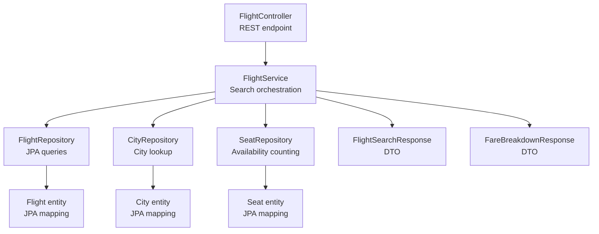
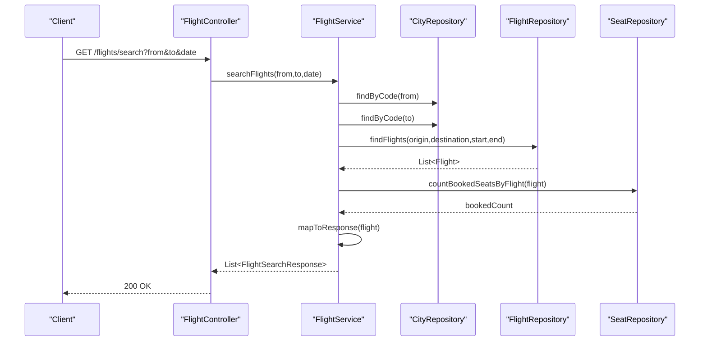
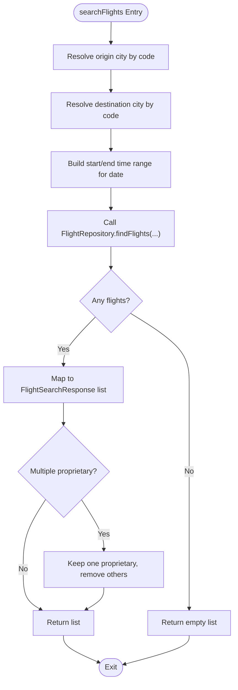
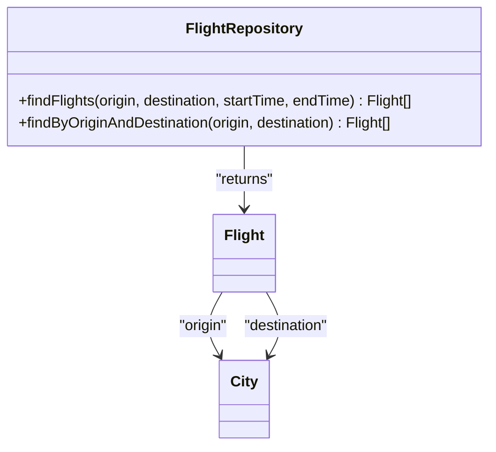
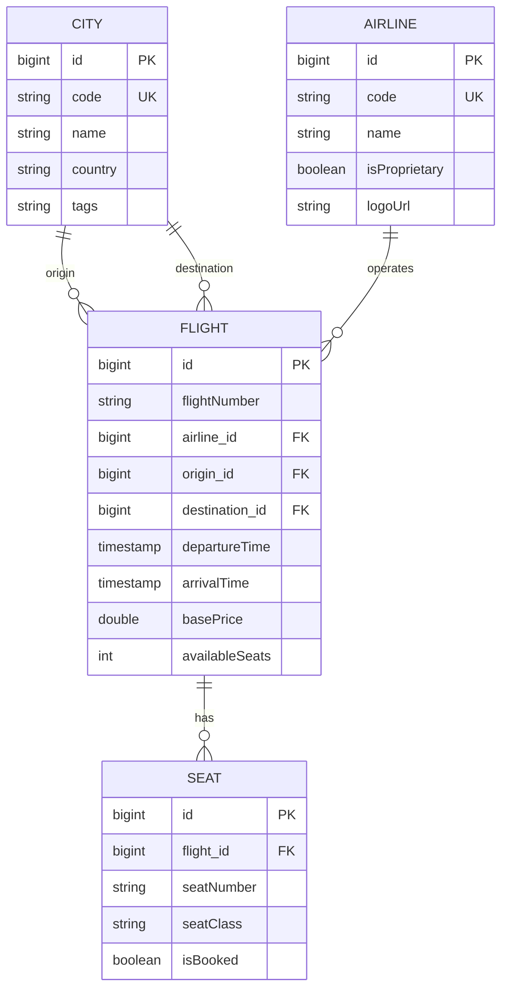
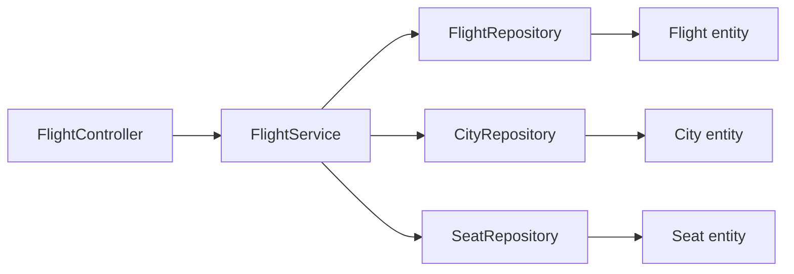

# Backend Search Logic

<cite>
**Referenced Files in This Document**
- [FlightController.java](file://backend-server/src/main/java/com/skyflow/controller/FlightController.java)
- [FlightService.java](file://backend-server/src/main/java/com/skyflow/service/FlightService.java)
- [FlightRepository.java](file://backend-server/src/main/java/com/skyflow/repository/FlightRepository.java)
- [CityRepository.java](file://backend-server/src/main/java/com/skyflow/repository/CityRepository.java)
- [SeatRepository.java](file://backend-server/src/main/java/com/skyflow/repository/SeatRepository.java)
- [CityService.java](file://backend-server/src/main/java/com/skyflow/service/CityService.java)
- [Flight.java](file://backend-server/src/main/java/com/skyflow/model/entity/Flight.java)
- [City.java](file://backend-server/src/main/java/com/skyflow/model/entity/City.java)
- [Airline.java](file://backend-server/src/main/java/com/skyflow/model/entity/Airline.java)
- [Seat.java](file://backend-server/src/main/java/com/skyflow/model/entity/Seat.java)
- [FlightSearchResponse.java](file://backend-server/src/main/java/com/skyflow/model/dto/response/FlightSearchResponse.java)
- [FareBreakdownResponse.java](file://backend-server/src/main/java/com/skyflow/model/dto/response/FareBreakdownResponse.java)
- [application.yml](file://backend-server/src/main/resources/application.yml)
- [pom.xml](file://backend-server/pom.xml)
</cite>

## Table of Contents
1. [Introduction](#introduction)
2. [Project Structure](#project-structure)
3. [Core Components](#core-components)
4. [Architecture Overview](#architecture-overview)
5. [Detailed Component Analysis](#detailed-component-analysis)
6. [Dependency Analysis](#dependency-analysis)
7. [Performance Considerations](#performance-considerations)
8. [Troubleshooting Guide](#troubleshooting-guide)
9. [Conclusion](#conclusion)

## Introduction
This document explains the backend flight search logic implemented in the Spring Boot application. It covers the REST endpoint for searching flights, request validation and parameter processing, service-layer search algorithm, repository query implementations, JPA entity model and relationships, response DTOs, and performance considerations including database queries and caching strategies.

## Project Structure
The backend module organizes flight search logic across controller, service, repository, and model layers. The primary search endpoint is exposed via a REST controller and delegated to a service that orchestrates repository queries and response mapping.

**Diagram sources**
- [FlightController.java:29-35](file://backend-server/src/main/java/com/skyflow/controller/FlightController.java#L29-L35)
- [FlightService.java:68-102](file://backend-server/src/main/java/com/skyflow/service/FlightService.java#L68-L102)
- [FlightRepository.java:14-18](file://backend-server/src/main/java/com/skyflow/repository/FlightRepository.java#L14-L18)
- [CityRepository.java:8-12](file://backend-server/src/main/java/com/skyflow/repository/CityRepository.java#L8-L12)
- [SeatRepository.java:20-21](file://backend-server/src/main/java/com/skyflow/repository/SeatRepository.java#L20-L21)
- [FlightSearchResponse.java:8-33](file://backend-server/src/main/java/com/skyflow/model/dto/response/FlightSearchResponse.java#L8-L33)
- [FareBreakdownResponse.java:6-18](file://backend-server/src/main/java/com/skyflow/model/dto/response/FareBreakdownResponse.java#L6-L18)
- [Flight.java:8-42](file://backend-server/src/main/java/com/skyflow/model/entity/Flight.java#L8-L42)
- [City.java:7-25](file://backend-server/src/main/java/com/skyflow/model/entity/City.java#L7-L25)
- [Seat.java:7-29](file://backend-server/src/main/java/com/skyflow/model/entity/Seat.java#L7-L29)

**Section sources**
- [FlightController.java:16-49](file://backend-server/src/main/java/com/skyflow/controller/FlightController.java#L16-L49)
- [FlightService.java:20-206](file://backend-server/src/main/java/com/skyflow/service/FlightService.java#L20-L206)
- [FlightRepository.java:12-21](file://backend-server/src/main/java/com/skyflow/repository/FlightRepository.java#L12-L21)
- [CityRepository.java:8-12](file://backend-server/src/main/java/com/skyflow/repository/CityRepository.java#L8-L12)
- [SeatRepository.java:13-24](file://backend-server/src/main/java/com/skyflow/repository/SeatRepository.java#L13-L24)
- [FlightSearchResponse.java:8-33](file://backend-server/src/main/java/com/skyflow/model/dto/response/FlightSearchResponse.java#L8-L33)
- [FareBreakdownResponse.java:6-18](file://backend-server/src/main/java/com/skyflow/model/dto/response/FareBreakdownResponse.java#L6-L18)
- [Flight.java:8-42](file://backend-server/src/main/java/com/skyflow/model/entity/Flight.java#L8-L42)
- [City.java:7-25](file://backend-server/src/main/java/com/skyflow/model/entity/City.java#L7-L25)
- [Seat.java:7-29](file://backend-server/src/main/java/com/skyflow/model/entity/Seat.java#L7-L29)

## Core Components
- FlightController: Exposes GET /flights/search with from, to, and date parameters. Delegates to FlightService and returns a list of FlightSearchResponse.
- FlightService: Implements searchFlights and getFareBreakdown. Handles city resolution, time window construction, repository queries, response mapping, and pricing logic including surge pricing.
- FlightRepository: Provides custom JPQL query for flights filtered by origin, destination, and departure time range, plus a derived finder.
- CityRepository: Resolves city by IATA code and supports tag-based city discovery.
- SeatRepository: Counts booked seats per flight for availability calculation.
- Flight entity: JPA-mapped Flight with relationships to Airline and City.
- City entity: JPA-mapped City with unique IATA code and optional tags.
- Seat entity: JPA-mapped Seat with uniqueness constraint on (flight_id, seatNumber).
- Responses: FlightSearchResponse and FareBreakdownResponse DTOs for structured output.

**Section sources**
- [FlightController.java:29-35](file://backend-server/src/main/java/com/skyflow/controller/FlightController.java#L29-L35)
- [FlightService.java:68-102](file://backend-server/src/main/java/com/skyflow/service/FlightService.java#L68-L102)
- [FlightRepository.java:14-18](file://backend-server/src/main/java/com/skyflow/repository/FlightRepository.java#L14-L18)
- [CityRepository.java:8-12](file://backend-server/src/main/java/com/skyflow/repository/CityRepository.java#L8-L12)
- [SeatRepository.java:20-21](file://backend-server/src/main/java/com/skyflow/repository/SeatRepository.java#L20-L21)
- [Flight.java:8-42](file://backend-server/src/main/java/com/skyflow/model/entity/Flight.java#L8-L42)
- [City.java:7-25](file://backend-server/src/main/java/com/skyflow/model/entity/City.java#L7-L25)
- [Seat.java:7-29](file://backend-server/src/main/java/com/skyflow/model/entity/Seat.java#L7-L29)
- [FlightSearchResponse.java:8-33](file://backend-server/src/main/java/com/skyflow/model/dto/response/FlightSearchResponse.java#L8-L33)
- [FareBreakdownResponse.java:6-18](file://backend-server/src/main/java/com/skyflow/model/dto/response/FareBreakdownResponse.java#L6-L18)

## Architecture Overview
The search flow begins at the controller, proceeds to the service layer for validation and orchestration, and leverages repositories for persistence. The service computes derived attributes and pricing, then maps to response DTOs.

**Diagram sources**
- [FlightController.java:29-35](file://backend-server/src/main/java/com/skyflow/controller/FlightController.java#L29-L35)
- [FlightService.java:68-102](file://backend-server/src/main/java/com/skyflow/service/FlightService.java#L68-L102)
- [CityRepository.java:8-12](file://backend-server/src/main/java/com/skyflow/repository/CityRepository.java#L8-L12)
- [FlightRepository.java:14-18](file://backend-server/src/main/java/com/skyflow/repository/FlightRepository.java#L14-L18)
- [SeatRepository.java:20-21](file://backend-server/src/main/java/com/skyflow/repository/SeatRepository.java#L20-L21)

## Detailed Component Analysis

### FlightController: Search Endpoint
- Path: GET /flights/search
- Parameters:
  - from: String, required, IATA city code
  - to: String, required, IATA city code
  - date: LocalDate, required, ISO date
- Validation:
  - Uses Spring’s @RequestParam defaults; missing parameters cause binding errors.
  - Date parsing uses @DateTimeFormat with ISO DATE pattern.
- Processing:
  - Delegates to FlightService.searchFlights(from, to, date).
- Response:
  - Returns List<FlightSearchResponse>.
- Error Handling:
  - No explicit try/catch in controller; exceptions propagate to global handler.

**Section sources**
- [FlightController.java:29-35](file://backend-server/src/main/java/com/skyflow/controller/FlightController.java#L29-L35)

### FlightService: Search Algorithm and Pricing
- searchFlights:
  - Resolves origin and destination cities by IATA code; throws runtime error if not found.
  - Builds start/end LocalDateTime range for the given date.
  - Queries flights via FlightRepository.findFlights with time window.
  - Maps each Flight to FlightSearchResponse, computing duration, class prices, features, and availability.
  - Removes duplicate proprietary airline entries if multiple exist.
- getFareBreakdown:
  - Computes base fare, taxes, seat charge, and surge pricing.
  - Calculates seats remaining using SeatRepository and applies surge threshold.
  - Returns FareBreakdownResponse with currency and messaging.
- Pricing constants:
  - TAX_RATE, SURGE_THRESHOLD, SURGE_MULTIPLIER define pricing behavior.
  - CLASS_MULTIPLIERS and SEAT_TYPE_CHARGES define class and seat type pricing.
- Availability:
  - calculateSeatsLeft subtracts booked seats from total availableSeats.

**Diagram sources**
- [FlightService.java:68-102](file://backend-server/src/main/java/com/skyflow/service/FlightService.java#L68-L102)

**Section sources**
- [FlightService.java:68-102](file://backend-server/src/main/java/com/skyflow/service/FlightService.java#L68-L102)
- [FlightService.java:104-144](file://backend-server/src/main/java/com/skyflow/service/FlightService.java#L104-L144)
- [FlightService.java:146-149](file://backend-server/src/main/java/com/skyflow/service/FlightService.java#L146-L149)
- [FlightService.java:151-204](file://backend-server/src/main/java/com/skyflow/service/FlightService.java#L151-L204)

### FlightRepository: Query Implementations
- findFlights:
  - JPQL query filters by origin, destination, and departureTime within start/end bounds.
  - Parameters: origin City, destination City, startTime LocalDateTime, endTime LocalDateTime.
- findByOriginAndDestination:
  - Derived finder method for equality match on origin and destination.

**Diagram sources**
- [FlightRepository.java:14-18](file://backend-server/src/main/java/com/skyflow/repository/FlightRepository.java#L14-L18)
- [FlightRepository.java:20](file://backend-server/src/main/java/com/skyflow/repository/FlightRepository.java#L20)
- [Flight.java:20-30](file://backend-server/src/main/java/com/skyflow/model/entity/Flight.java#L20-L30)
- [City.java:16-17](file://backend-server/src/main/java/com/skyflow/model/entity/City.java#L16-L17)

**Section sources**
- [FlightRepository.java:14-18](file://backend-server/src/main/java/com/skyflow/repository/FlightRepository.java#L14-L18)
- [FlightRepository.java:20](file://backend-server/src/main/java/com/skyflow/repository/FlightRepository.java#L20)

### CityRepository and CityService: City Resolution
- CityRepository:
  - findByCode: resolves city by unique IATA code.
  - findByTagsContaining: supports tag-based city discovery.
- CityService:
  - getCitiesByTag: returns all cities when tag is absent or empty.

**Section sources**
- [CityRepository.java:8-12](file://backend-server/src/main/java/com/skyflow/repository/CityRepository.java#L8-L12)
- [CityService.java:20-25](file://backend-server/src/main/java/com/skyflow/service/CityService.java#L20-L25)

### SeatRepository: Availability Counting
- countBookedSeatsByFlight:
  - Aggregates booked seats per flight for availability computation.
- Other helpers:
  - findByIdWithLock for pessimistic write locking.
  - findByFlightAndSeatNumber for seat lookup.

**Section sources**
- [SeatRepository.java:20-21](file://backend-server/src/main/java/com/skyflow/repository/SeatRepository.java#L20-L21)
- [SeatRepository.java:14-16](file://backend-server/src/main/java/com/skyflow/repository/SeatRepository.java#L14-L16)
- [SeatRepository.java:18](file://backend-server/src/main/java/com/skyflow/repository/SeatRepository.java#L18)

### Entity Model and JPA Annotations
- Flight:
  - Identity: Long id, auto-increment.
  - Relationships: ManyToOne to Airline and City (origin/destination).
  - Timestamps: departureTime and arrivalTime.
  - Pricing: basePrice and availableSeats.
- City:
  - Identity: Long id, auto-increment.
  - Unique code (IATA), name, optional country, tags.
- Airline:
  - Identity: Long id, unique code, name, isProprietary flag, logoUrl.
- Seat:
  - Identity: Long id, unique constraint on (flight_id, seatNumber).
  - Attributes: seatNumber, seatClass, isBooked.

**Diagram sources**
- [Flight.java:13-42](file://backend-server/src/main/java/com/skyflow/model/entity/Flight.java#L13-L42)
- [City.java:12-25](file://backend-server/src/main/java/com/skyflow/model/entity/City.java#L12-L25)
- [Airline.java:12-28](file://backend-server/src/main/java/com/skyflow/model/entity/Airline.java#L12-L28)
- [Seat.java:14-29](file://backend-server/src/main/java/com/skyflow/model/entity/Seat.java#L14-L29)

**Section sources**
- [Flight.java:8-42](file://backend-server/src/main/java/com/skyflow/model/entity/Flight.java#L8-L42)
- [City.java:7-25](file://backend-server/src/main/java/com/skyflow/model/entity/City.java#L7-L25)
- [Airline.java:7-28](file://backend-server/src/main/java/com/skyflow/model/entity/Airline.java#L7-L28)
- [Seat.java:7-29](file://backend-server/src/main/java/com/skyflow/model/entity/Seat.java#L7-L29)

### Response DTOs
- FlightSearchResponse:
  - Identifiers: id, flightNumber, airline metadata, origin/destination codes.
  - Timing: departureTime, arrivalTime, durationMinutes, stops.
  - Pricing: classPrices map per cabin class.
  - Features: per-class amenity lists.
  - Availability: availableSeats, surgeActive, surgeMessage.
  - Additional: baggagePolicy, refundPolicy, aircraft.
- FareBreakdownResponse:
  - Monetary components: baseFare, taxes, seatCharge, surgeCharge, total.
  - Metadata: currency, seatClass, seatType, seatsLeft, surgeActive, surgeMessage.

**Section sources**
- [FlightSearchResponse.java:8-33](file://backend-server/src/main/java/com/skyflow/model/dto/response/FlightSearchResponse.java#L8-L33)
- [FareBreakdownResponse.java:6-18](file://backend-server/src/main/java/com/skyflow/model/dto/response/FareBreakdownResponse.java#L6-L18)

## Dependency Analysis
The service layer depends on repositories for persistence and mapping. The controller delegates to the service. Entities define relationships that inform query design.

**Diagram sources**
- [FlightController.java:19-22](file://backend-server/src/main/java/com/skyflow/controller/FlightController.java#L19-L22)
- [FlightService.java:23-28](file://backend-server/src/main/java/com/skyflow/service/FlightService.java#L23-L28)
- [FlightRepository.java:12](file://backend-server/src/main/java/com/skyflow/repository/FlightRepository.java#L12)
- [CityRepository.java:8](file://backend-server/src/main/java/com/skyflow/repository/CityRepository.java#L8)
- [SeatRepository.java:13](file://backend-server/src/main/java/com/skyflow/repository/SeatRepository.java#L13)
- [Flight.java:8-42](file://backend-server/src/main/java/com/skyflow/model/entity/Flight.java#L8-L42)
- [City.java:7-25](file://backend-server/src/main/java/com/skyflow/model/entity/City.java#L7-L25)
- [Seat.java:7-29](file://backend-server/src/main/java/com/skyflow/model/entity/Seat.java#L7-L29)

**Section sources**
- [FlightController.java:19-22](file://backend-server/src/main/java/com/skyflow/controller/FlightController.java#L19-L22)
- [FlightService.java:23-28](file://backend-server/src/main/java/com/skyflow/service/FlightService.java#L23-L28)
- [FlightRepository.java:12](file://backend-server/src/main/java/com/skyflow/repository/FlightRepository.java#L12)
- [CityRepository.java:8](file://backend-server/src/main/java/com/skyflow/repository/CityRepository.java#L8)
- [SeatRepository.java:13](file://backend-server/src/main/java/com/skyflow/repository/SeatRepository.java#L13)

## Performance Considerations
- Database Schema and Indexing
  - Flight.departureTime: Recommended index to accelerate time-range filtering in findFlights.
  - City.code: Already unique; ensure index exists for fast lookup.
  - Seat(flight_id, seatNumber): Unique constraint prevents duplicates; consider composite index if not automatically indexed.
  - Flight(origin_id, destination_id): Consider composite index to optimize equality filtering.
- Query Optimization
  - Use native SQL or hints if JPQL performance is insufficient; ensure proper use of bound parameters.
  - Minimize SELECT *; project only required fields if building lightweight DTOs.
- Caching Strategies
  - City metadata and airline info can be cached to reduce repeated lookups.
  - Frequently searched origin-destination pairs could benefit from result caching with TTL.
  - Surge thresholds and pricing multipliers can be cached as static configuration.
- Concurrency and Isolation
  - SeatRepository provides a pessimistic lock for individual seat updates; apply similar patterns for seat selection workflows.
- Configuration
  - application.yml uses H2 in-memory database for development; adjust DDL and dialect for production databases (e.g., PostgreSQL).
  - Enable SQL logging judiciously for profiling; disable in production.

**Section sources**
- [FlightRepository.java:14-18](file://backend-server/src/main/java/com/skyflow/repository/FlightRepository.java#L14-L18)
- [CityRepository.java:8-12](file://backend-server/src/main/java/com/skyflow/repository/CityRepository.java#L8-L12)
- [SeatRepository.java:14-16](file://backend-server/src/main/java/com/skyflow/repository/SeatRepository.java#L14-L16)
- [application.yml:4-17](file://backend-server/src/main/resources/application.yml#L4-L17)

## Troubleshooting Guide
- 400/422 Binding Errors
  - Occur when required parameters from, to, or date are missing or malformed.
  - Verify client sends ISO date format and valid IATA codes.
- 404 Not Found
  - Thrown when origin/destination city not found or flight not found for fare breakdown.
  - Confirm city codes exist and flights are seeded.
- Empty Results
  - No flights returned if none match the origin/destination/time window.
  - Adjust date range or verify Flight records.
- Unexpected Proprietary Deduplication
  - Service keeps only one proprietary airline entry; verify dataset if expecting multiple.
- Performance Issues
  - Add indexes on Flight.departureTime, City.code, and composite keys.
  - Review SQL logs and consider query rewriting or caching.

**Section sources**
- [FlightController.java:42-48](file://backend-server/src/main/java/com/skyflow/controller/FlightController.java#L42-L48)
- [FlightService.java:69-71](file://backend-server/src/main/java/com/skyflow/service/FlightService.java#L69-L71)
- [FlightService.java:105](file://backend-server/src/main/java/com/skyflow/service/FlightService.java#L105)
- [FlightService.java:87-99](file://backend-server/src/main/java/com/skyflow/service/FlightService.java#L87-L99)

## Conclusion
The backend implements a clean separation of concerns for flight search: a concise controller endpoint, a robust service layer with validation and pricing logic, and JPA repositories with targeted queries. The entity model supports efficient joins and relationships. Performance can be improved with strategic indexing, caching, and query tuning, while maintaining correctness and scalability.