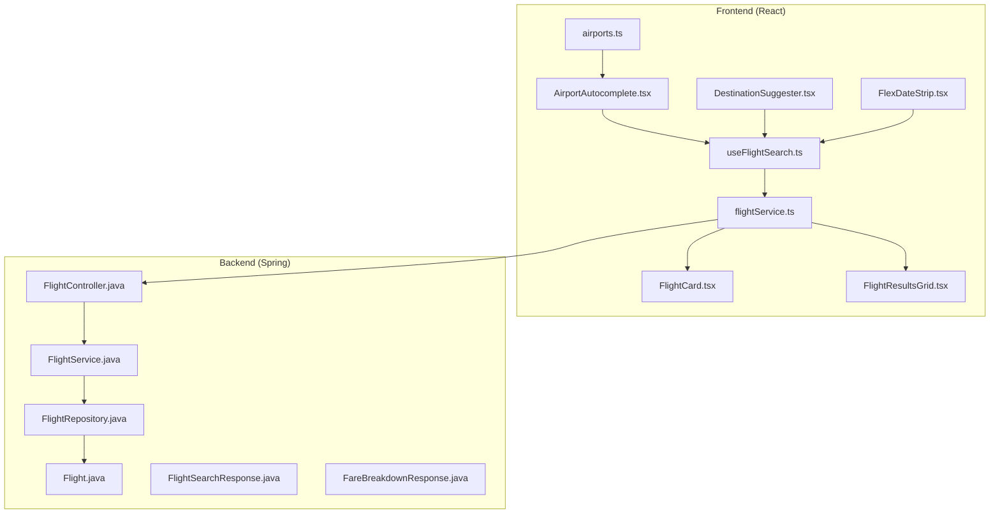
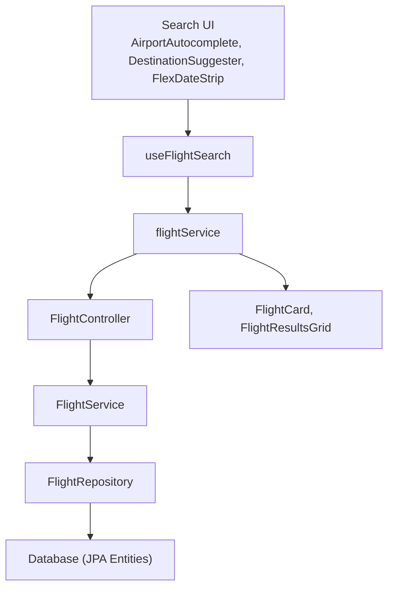
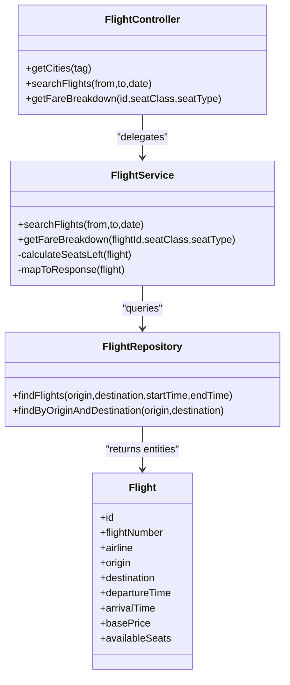
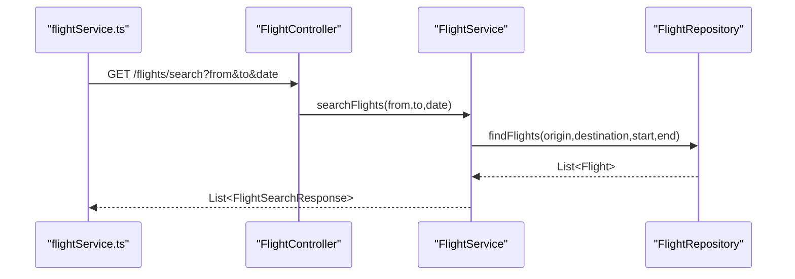
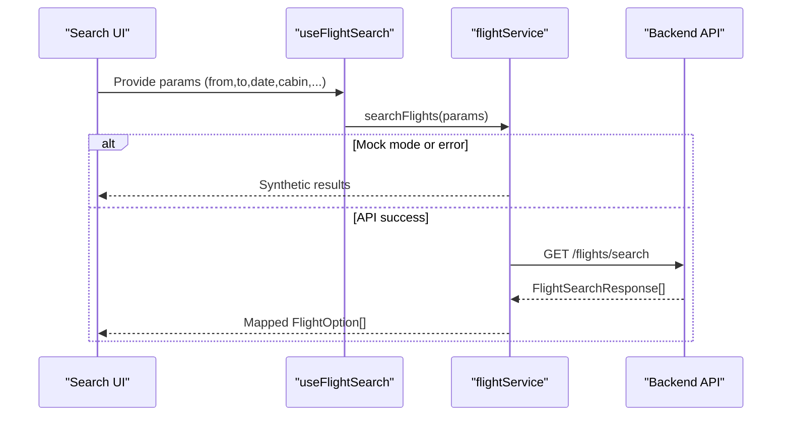
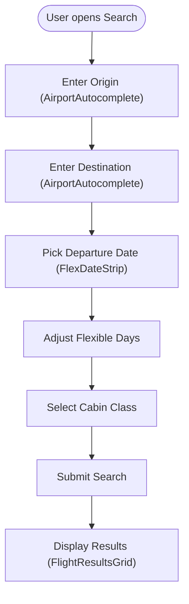
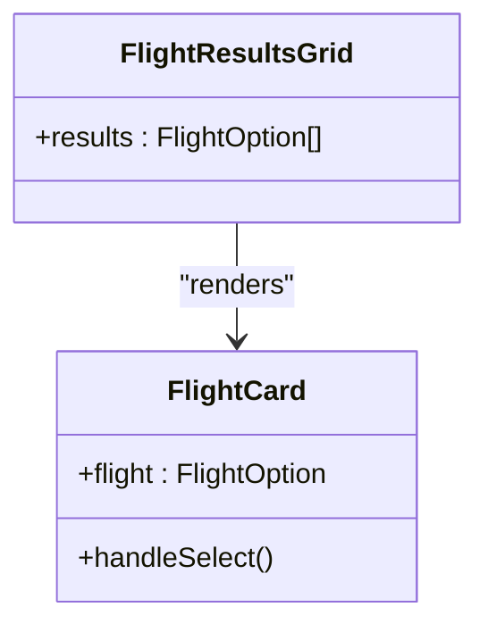
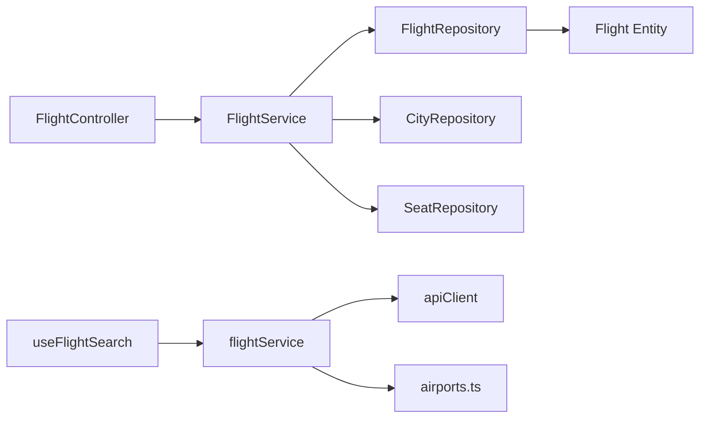

# Flight Search & Discovery

<cite>
**Referenced Files in This Document**
- [FlightController.java](file://backend-server/src/main/java/com/skyflow/controller/FlightController.java)
- [FlightService.java](file://backend-server/src/main/java/com/skyflow/service/FlightService.java)
- [FlightRepository.java](file://backend-server/src/main/java/com/skyflow/repository/FlightRepository.java)
- [Flight.java](file://backend-server/src/main/java/com/skyflow/model/entity/Flight.java)
- [FlightSearchResponse.java](file://backend-server/src/main/java/com/skyflow/model/dto/response/FlightSearchResponse.java)
- [FareBreakdownResponse.java](file://backend-server/src/main/java/com/skyflow/model/dto/response/FareBreakdownResponse.java)
- [useFlightSearch.ts](file://skyflow-pro/src/hooks/useFlightSearch.ts)
- [flightService.ts](file://skyflow-pro/src/services/flights/flightService.ts)
- [AirportAutocomplete.tsx](file://skyflow-pro/src/components/features/flights/search/AirportAutocomplete.tsx)
- [DestinationSuggester.tsx](file://skyflow-pro/src/components/features/flights/search/DestinationSuggester.tsx)
- [FlexDateStrip.tsx](file://skyflow-pro/src/components/features/flights/calendar/FlexDateStrip.tsx)
- [FlightCard.tsx](file://skyflow-pro/src/components/FlightCard/FlightCard.tsx)
- [FlightResultsGrid.tsx](file://skyflow-pro/src/components/FlightCard/FlightResultsGrid.tsx)
- [airports.ts](file://skyflow-pro/src/data/airports.ts)
</cite>

## Table of Contents
1. [Introduction](#introduction)
2. [Project Structure](#project-structure)
3. [Core Components](#core-components)
4. [Architecture Overview](#architecture-overview)
5. [Detailed Component Analysis](#detailed-component-analysis)
6. [Dependency Analysis](#dependency-analysis)
7. [Performance Considerations](#performance-considerations)
8. [Troubleshooting Guide](#troubleshooting-guide)
9. [Conclusion](#conclusion)
10. [Appendices](#appendices)

## Introduction
This document describes the flight search and discovery system, covering multi-city search capabilities, a real-time pricing engine, and availability checking. It documents the search interface components (airport autocomplete, destination suggester, and flexible date selection), the backend flight search service (database queries, filtering logic, and performance optimizations), and the results display system (flight cards, pricing breakdowns, and airline information). It also outlines user workflows from initiating a search to selecting a result, and highlights configuration options and customization possibilities.

## Project Structure
The system comprises:
- A Spring Boot backend exposing REST endpoints for flight search and fare breakdown.
- A PostgreSQL-backed JPA domain model for flights, airlines, and cities.
- A React-based frontend with TypeScript that integrates with the backend via an HTTP client and React Query for caching and fetching.

**Diagram sources**
- [AirportAutocomplete.tsx:1-206](file://skyflow-pro/src/components/features/flights/search/AirportAutocomplete.tsx#L1-L206)
- [DestinationSuggester.tsx:1-113](file://skyflow-pro/src/components/features/flights/search/DestinationSuggester.tsx#L1-L113)
- [FlexDateStrip.tsx:1-148](file://skyflow-pro/src/components/features/flights/calendar/FlexDateStrip.tsx#L1-L148)
- [useFlightSearch.ts:1-12](file://skyflow-pro/src/hooks/useFlightSearch.ts#L1-L12)
- [flightService.ts:1-128](file://skyflow-pro/src/services/flights/flightService.ts#L1-L128)
- [FlightController.java:1-50](file://backend-server/src/main/java/com/skyflow/controller/FlightController.java#L1-L50)
- [FlightService.java:1-206](file://backend-server/src/main/java/com/skyflow/service/FlightService.java#L1-L206)
- [FlightRepository.java:1-22](file://backend-server/src/main/java/com/skyflow/repository/FlightRepository.java#L1-L22)
- [Flight.java:1-43](file://backend-server/src/main/java/com/skyflow/model/entity/Flight.java#L1-L43)
- [FlightSearchResponse.java:1-34](file://backend-server/src/main/java/com/skyflow/model/dto/response/FlightSearchResponse.java#L1-L34)
- [FareBreakdownResponse.java:1-19](file://backend-server/src/main/java/com/skyflow/model/dto/response/FareBreakdownResponse.java#L1-L19)
- [airports.ts:1-151](file://skyflow-pro/src/data/airports.ts#L1-L151)

**Section sources**
- [FlightController.java:1-50](file://backend-server/src/main/java/com/skyflow/controller/FlightController.java#L1-L50)
- [FlightService.java:1-206](file://backend-server/src/main/java/com/skyflow/service/FlightService.java#L1-L206)
- [FlightRepository.java:1-22](file://backend-server/src/main/java/com/skyflow/repository/FlightRepository.java#L1-L22)
- [Flight.java:1-43](file://backend-server/src/main/java/com/skyflow/model/entity/Flight.java#L1-L43)
- [FlightSearchResponse.java:1-34](file://backend-server/src/main/java/com/skyflow/model/dto/response/FlightSearchResponse.java#L1-L34)
- [FareBreakdownResponse.java:1-19](file://backend-server/src/main/java/com/skyflow/model/dto/response/FareBreakdownResponse.java#L1-L19)
- [useFlightSearch.ts:1-12](file://skyflow-pro/src/hooks/useFlightSearch.ts#L1-L12)
- [flightService.ts:1-128](file://skyflow-pro/src/services/flights/flightService.ts#L1-L128)
- [AirportAutocomplete.tsx:1-206](file://skyflow-pro/src/components/features/flights/search/AirportAutocomplete.tsx#L1-L206)
- [DestinationSuggester.tsx:1-113](file://skyflow-pro/src/components/features/flights/search/DestinationSuggester.tsx#L1-L113)
- [FlexDateStrip.tsx:1-148](file://skyflow-pro/src/components/features/flights/calendar/FlexDateStrip.tsx#L1-L148)
- [FlightCard.tsx:1-263](file://skyflow-pro/src/components/FlightCard/FlightCard.tsx#L1-L263)
- [FlightResultsGrid.tsx:1-110](file://skyflow-pro/src/components/FlightCard/FlightResultsGrid.tsx#L1-L110)
- [airports.ts:1-151](file://skyflow-pro/src/data/airports.ts#L1-L151)

## Core Components
- Backend REST endpoints:
  - GET /flights/search: Returns flights matching origin, destination, and date range.
  - GET /flights/{id}/fare-breakdown: Returns pricing breakdown for a given flight and cabin/seat type.
- Backend service:
  - Implements search filtering, proprietary airline adjustments, seat availability calculation, surge pricing, and response mapping.
- Frontend search hooks and services:
  - useFlightSearch: React Query hook that caches and fetches search results.
  - flightService: Orchestrates backend requests, maps backend responses to frontend FlightOption, and supports round-trip and cabin class mapping.
- UI components:
  - AirportAutocomplete: Intelligent airport/city code autocomplete with keyboard navigation and accessibility.
  - DestinationSuggester: Interest-based destination suggestions with animated toggles.
  - FlexDateStrip: Flexible date picker with demo pricing and “cheapest day” highlighting.
  - FlightCard: Interactive flight card with pricing breakdown, refundability, baggage, and expandable details.
  - FlightResultsGrid: Results summary and curated highlights (best price/fastest).

**Section sources**
- [FlightController.java:24-48](file://backend-server/src/main/java/com/skyflow/controller/FlightController.java#L24-L48)
- [FlightService.java:68-102](file://backend-server/src/main/java/com/skyflow/service/FlightService.java#L68-L102)
- [useFlightSearch.ts:4-10](file://skyflow-pro/src/hooks/useFlightSearch.ts#L4-L10)
- [flightService.ts:32-125](file://skyflow-pro/src/services/flights/flightService.ts#L32-L125)
- [AirportAutocomplete.tsx:21-205](file://skyflow-pro/src/components/features/flights/search/AirportAutocomplete.tsx#L21-L205)
- [DestinationSuggester.tsx:10-112](file://skyflow-pro/src/components/features/flights/search/DestinationSuggester.tsx#L10-L112)
- [FlexDateStrip.tsx:30-147](file://skyflow-pro/src/components/features/flights/calendar/FlexDateStrip.tsx#L30-L147)
- [FlightCard.tsx:30-262](file://skyflow-pro/src/components/FlightCard/FlightCard.tsx#L30-L262)
- [FlightResultsGrid.tsx:9-109](file://skyflow-pro/src/components/FlightCard/FlightResultsGrid.tsx#L9-L109)

## Architecture Overview
The system follows a layered architecture:
- Presentation layer: React components and services.
- Application layer: React Query and service orchestration.
- API layer: Spring REST endpoints.
- Domain and persistence: JPA entities and repositories.

**Diagram sources**
- [AirportAutocomplete.tsx:1-206](file://skyflow-pro/src/components/features/flights/search/AirportAutocomplete.tsx#L1-L206)
- [DestinationSuggester.tsx:1-113](file://skyflow-pro/src/components/features/flights/search/DestinationSuggester.tsx#L1-L113)
- [FlexDateStrip.tsx:1-148](file://skyflow-pro/src/components/features/flights/calendar/FlexDateStrip.tsx#L1-L148)
- [useFlightSearch.ts:1-12](file://skyflow-pro/src/hooks/useFlightSearch.ts#L1-L12)
- [flightService.ts:1-128](file://skyflow-pro/src/services/flights/flightService.ts#L1-L128)
- [FlightController.java:1-50](file://backend-server/src/main/java/com/skyflow/controller/FlightController.java#L1-L50)
- [FlightService.java:1-206](file://backend-server/src/main/java/com/skyflow/service/FlightService.java#L1-L206)
- [FlightRepository.java:1-22](file://backend-server/src/main/java/com/skyflow/repository/FlightRepository.java#L1-L22)
- [Flight.java:1-43](file://backend-server/src/main/java/com/skyflow/model/entity/Flight.java#L1-L43)
- [FlightCard.tsx:1-263](file://skyflow-pro/src/components/FlightCard/FlightCard.tsx#L1-L263)
- [FlightResultsGrid.tsx:1-110](file://skyflow-pro/src/components/FlightCard/FlightResultsGrid.tsx#L1-L110)

## Detailed Component Analysis

### Backend Flight Search Service
The backend service coordinates search, pricing, and availability:
- Search logic:
  - Resolves origin/destination city codes to City entities.
  - Queries flights within the requested date’s start-of-day to end-of-day window.
  - Removes duplicate proprietary flights, keeping one if multiple are present.
- Pricing and availability:
  - Calculates seats remaining per flight and applies surge pricing when seats fall below a threshold.
  - Applies class multipliers and seat type charges; proprietary airline discounts apply to base price.
  - Generates per-cabin class prices and random features/baggages/refunds for display.
- Response mapping:
  - Maps Flight entities to FlightSearchResponse DTOs, including duration, stops, and randomized attributes.

**Diagram sources**
- [FlightController.java:1-50](file://backend-server/src/main/java/com/skyflow/controller/FlightController.java#L1-L50)
- [FlightService.java:68-204](file://backend-server/src/main/java/com/skyflow/service/FlightService.java#L68-L204)
- [FlightRepository.java:14-21](file://backend-server/src/main/java/com/skyflow/repository/FlightRepository.java#L14-L21)
- [Flight.java:1-43](file://backend-server/src/main/java/com/skyflow/model/entity/Flight.java#L1-L43)

**Section sources**
- [FlightService.java:68-102](file://backend-server/src/main/java/com/skyflow/service/FlightService.java#L68-L102)
- [FlightService.java:104-144](file://backend-server/src/main/java/com/skyflow/service/FlightService.java#L104-L144)
- [FlightService.java:146-204](file://backend-server/src/main/java/com/skyflow/service/FlightService.java#L146-L204)
- [FlightRepository.java:14-18](file://backend-server/src/main/java/com/skyflow/repository/FlightRepository.java#L14-L18)
- [FlightSearchResponse.java:8-33](file://backend-server/src/main/java/com/skyflow/model/dto/response/FlightSearchResponse.java#L8-L33)

### Backend REST Endpoints
- GET /flights/search
  - Path parameters: from, to, date (ISO date).
  - Returns a list of FlightSearchResponse objects.
- GET /flights/{id}/fare-breakdown
  - Path parameter: id.
  - Query parameters: class (default Economy), seatType (default standard).
  - Returns FareBreakdownResponse with base fare, taxes, seat charge, surge charge, and total.

**Diagram sources**
- [flightService.ts:53-105](file://skyflow-pro/src/services/flights/flightService.ts#L53-L105)
- [FlightController.java:29-35](file://backend-server/src/main/java/com/skyflow/controller/FlightController.java#L29-L35)
- [FlightService.java:68-102](file://backend-server/src/main/java/com/skyflow/service/FlightService.java#L68-L102)
- [FlightRepository.java:14-18](file://backend-server/src/main/java/com/skyflow/repository/FlightRepository.java#L14-L18)

**Section sources**
- [FlightController.java:29-48](file://backend-server/src/main/java/com/skyflow/controller/FlightController.java#L29-L48)
- [flightService.ts:53-125](file://skyflow-pro/src/services/flights/flightService.ts#L53-L125)

### Frontend Search Workflow
- Search initiation:
  - Users enter origin/destination and select a date; optional flexible days and cabin class.
  - useFlightSearch enables only when required fields are present.
- Fetching and mapping:
  - flightService builds query parameters and calls the backend endpoint.
  - Maps backend classPrices to frontend FlightOption with per-passenger totals and breakdowns.
  - Supports round-trip by issuing a second request for return flights.
- Mock fallback:
  - If VITE_USE_MOCKS is enabled or backend fails, generates synthetic results.

**Diagram sources**
- [useFlightSearch.ts:4-10](file://skyflow-pro/src/hooks/useFlightSearch.ts#L4-L10)
- [flightService.ts:32-125](file://skyflow-pro/src/services/flights/flightService.ts#L32-L125)

**Section sources**
- [useFlightSearch.ts:1-12](file://skyflow-pro/src/hooks/useFlightSearch.ts#L1-L12)
- [flightService.ts:31-125](file://skyflow-pro/src/services/flights/flightService.ts#L31-L125)

### Search Interface Components
- AirportAutocomplete
  - Implements fuzzy search over airport/city data, supports keyboard navigation, and selects airport codes.
- DestinationSuggester
  - Presents interest-based categories and suggested destinations; closes after selection.
- FlexDateStrip
  - Renders a strip of dates around the selected departure date with demo pricing and highlights the cheapest day.

**Diagram sources**
- [AirportAutocomplete.tsx:36-46](file://skyflow-pro/src/components/features/flights/search/AirportAutocomplete.tsx#L36-L46)
- [DestinationSuggester.tsx:15-21](file://skyflow-pro/src/components/features/flights/search/DestinationSuggester.tsx#L15-L21)
- [FlexDateStrip.tsx:30-65](file://skyflow-pro/src/components/features/flights/calendar/FlexDateStrip.tsx#L30-L65)

**Section sources**
- [AirportAutocomplete.tsx:21-205](file://skyflow-pro/src/components/features/flights/search/AirportAutocomplete.tsx#L21-L205)
- [DestinationSuggester.tsx:10-112](file://skyflow-pro/src/components/features/flights/search/DestinationSuggester.tsx#L10-L112)
- [FlexDateStrip.tsx:30-147](file://skyflow-pro/src/components/features/flights/calendar/FlexDateStrip.tsx#L30-L147)
- [airports.ts:72-129](file://skyflow-pro/src/data/airports.ts#L72-L129)

### Results Display System
- FlightResultsGrid
  - Shows “best price” and “fastest” highlights, and renders FlightCard instances.
- FlightCard
  - Displays flight details, pricing breakdown, refundability, baggage, carbon estimate, and last-updated freshness.
  - Expands to show detailed fee breakdown and fare rules.

**Diagram sources**
- [FlightResultsGrid.tsx:9-109](file://skyflow-pro/src/components/FlightCard/FlightResultsGrid.tsx#L9-L109)
- [FlightCard.tsx:30-262](file://skyflow-pro/src/components/FlightCard/FlightCard.tsx#L30-L262)

**Section sources**
- [FlightResultsGrid.tsx:9-109](file://skyflow-pro/src/components/FlightCard/FlightResultsGrid.tsx#L9-L109)
- [FlightCard.tsx:30-262](file://skyflow-pro/src/components/FlightCard/FlightCard.tsx#L30-L262)

## Dependency Analysis
- Backend dependencies:
  - FlightController depends on FlightService and CityService.
  - FlightService depends on FlightRepository, CityRepository, and SeatRepository.
  - FlightRepository defines JPQL queries for date-range flight retrieval.
- Frontend dependencies:
  - useFlightSearch depends on React Query and flightService.
  - flightService depends on apiClient and airport data.

**Diagram sources**
- [FlightController.java:1-50](file://backend-server/src/main/java/com/skyflow/controller/FlightController.java#L1-L50)
- [FlightService.java:23-28](file://backend-server/src/main/java/com/skyflow/service/FlightService.java#L23-L28)
- [FlightRepository.java:1-22](file://backend-server/src/main/java/com/skyflow/repository/FlightRepository.java#L1-L22)
- [Flight.java:1-43](file://backend-server/src/main/java/com/skyflow/model/entity/Flight.java#L1-L43)
- [useFlightSearch.ts:1-12](file://skyflow-pro/src/hooks/useFlightSearch.ts#L1-L12)
- [flightService.ts:1-5](file://skyflow-pro/src/services/flights/flightService.ts#L1-L5)
- [airports.ts:1-151](file://skyflow-pro/src/data/airports.ts#L1-L151)

**Section sources**
- [FlightController.java:1-50](file://backend-server/src/main/java/com/skyflow/controller/FlightController.java#L1-L50)
- [FlightService.java:23-28](file://backend-server/src/main/java/com/skyflow/service/FlightService.java#L23-L28)
- [FlightRepository.java:1-22](file://backend-server/src/main/java/com/skyflow/repository/FlightRepository.java#L1-L22)

## Performance Considerations
- Backend:
  - Date-range query bounds reduce scan volume by constraining to start/end of the selected day.
  - Proprietary airline deduplication prevents redundant listings.
  - Surge pricing and seat count checks occur per-flight; consider caching seat counts or precomputing availability for hot routes.
- Frontend:
  - React Query caching avoids repeated network calls for identical parameters.
  - Synthetic fallback ensures resilience during backend outages.
  - Consider debouncing autocomplete input and limiting suggestion count to improve responsiveness.

[No sources needed since this section provides general guidance]

## Troubleshooting Guide
- Backend exceptions:
  - Missing origin/destination city codes throw runtime errors; ensure valid airport codes are provided.
  - Missing flight ID for fare breakdown returns 404.
- Frontend fallback:
  - If backend API fails or VITE_USE_MOCKS is enabled, synthetic results are returned; verify environment configuration.
- Accessibility and UX:
  - Autocomplete supports keyboard navigation and ARIA roles; ensure screen readers announce selected items.
  - Clear button resets input and suggestions.

**Section sources**
- [FlightService.java:69-71](file://backend-server/src/main/java/com/skyflow/service/FlightService.java#L69-L71)
- [FlightController.java:42-48](file://backend-server/src/main/java/com/skyflow/controller/FlightController.java#L42-L48)
- [flightService.ts:121-124](file://skyflow-pro/src/services/flights/flightService.ts#L121-L124)
- [AirportAutocomplete.tsx:144-147](file://skyflow-pro/src/components/features/flights/search/AirportAutocomplete.tsx#L144-L147)

## Conclusion
The flight search and discovery system integrates a robust backend search and pricing engine with a responsive frontend search interface and results display. The backend efficiently filters flights by date and location, computes dynamic pricing with surge detection, and exposes a clean API for clients. The frontend provides an accessible, interactive experience with autocomplete, destination suggestions, flexible dates, and detailed flight cards. Together, these components deliver a scalable and user-friendly flight discovery solution.

[No sources needed since this section summarizes without analyzing specific files]

## Appendices

### API Definitions
- GET /flights/search
  - Query parameters: from (string), to (string), date (ISO date).
  - Response: array of FlightSearchResponse.
- GET /flights/{id}/fare-breakdown
  - Path parameter: id (long).
  - Query parameters: class (string, default Economy), seatType (string, default standard).
  - Response: FareBreakdownResponse.

**Section sources**
- [FlightController.java:29-48](file://backend-server/src/main/java/com/skyflow/controller/FlightController.java#L29-L48)
- [FlightSearchResponse.java:8-33](file://backend-server/src/main/java/com/skyflow/model/dto/response/FlightSearchResponse.java#L8-L33)
- [FareBreakdownResponse.java:6-18](file://backend-server/src/main/java/com/skyflow/model/dto/response/FareBreakdownResponse.java#L6-L18)

### Configuration Options and Customization
- Environment:
  - VITE_USE_MOCKS: Enables synthetic results when true.
- Cabin mapping:
  - flightService maps frontend cabin keys to backend class names.
- Autocomplete:
  - airports.ts provides searchable airport data; adjust searchTerms and limit suggestions as needed.
- Pricing engine:
  - Multipliers, seat charges, surge thresholds, and policies are defined in the backend service; modify constants to align with business rules.

**Section sources**
- [flightService.ts:23-29](file://skyflow-pro/src/services/flights/flightService.ts#L23-L29)
- [flightService.ts:33-44](file://skyflow-pro/src/services/flights/flightService.ts#L33-L44)
- [airports.ts:72-129](file://skyflow-pro/src/data/airports.ts#L72-L129)
- [FlightService.java:30-66](file://backend-server/src/main/java/com/skyflow/service/FlightService.java#L30-L66)