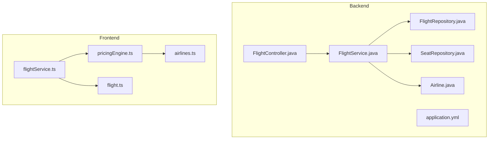
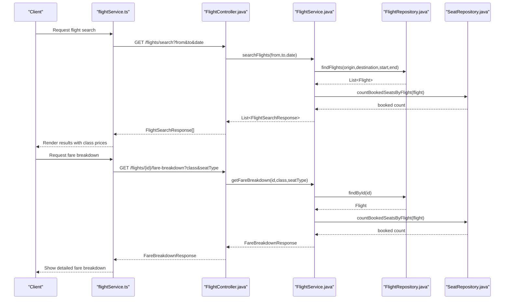
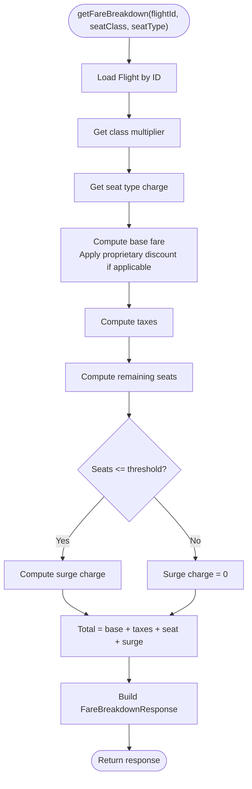
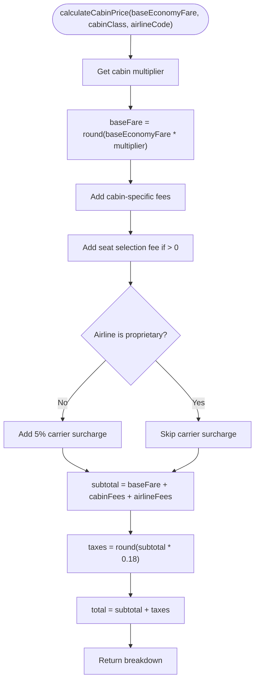
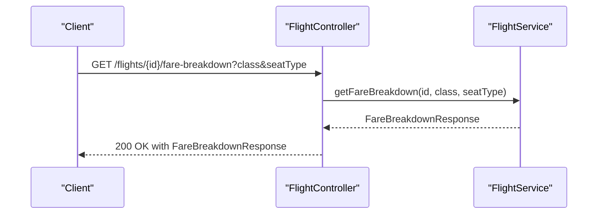
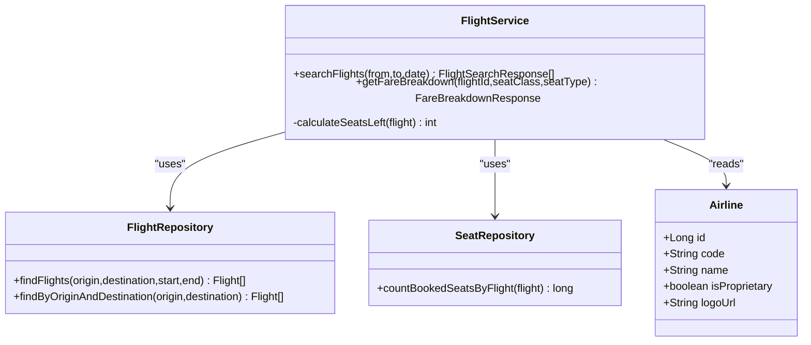
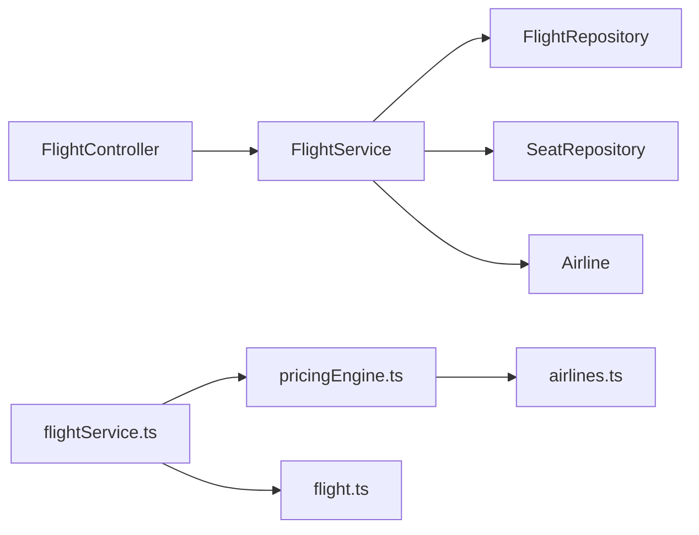

# Real-Time Pricing Engine

<cite>
**Referenced Files in This Document**
- [FlightService.java](file://backend-server/src/main/java/com/skyflow/service/FlightService.java)
- [FareBreakdownResponse.java](file://backend-server/src/main/java/com/skyflow/model/dto/response/FareBreakdownResponse.java)
- [FlightController.java](file://backend-server/src/main/java/com/skyflow/controller/FlightController.java)
- [FlightRepository.java](file://backend-server/src/main/java/com/skyflow/repository/FlightRepository.java)
- [SeatRepository.java](file://backend-server/src/main/java/com/skyflow/repository/SeatRepository.java)
- [Airline.java](file://backend-server/src/main/java/com/skyflow/model/entity/Airline.java)
- [application.yml](file://backend-server/src/main/resources/application.yml)
- [pricingEngine.ts](file://skyflow-pro/src/config/pricingEngine.ts)
- [airlines.ts](file://skyflow-pro/src/config/airlines.ts)
- [flightService.ts](file://skyflow-pro/src/services/flights/flightService.ts)
- [flight.ts](file://skyflow-pro/src/types/flight.ts)
- [README.md (Backend)](file://backend-server/README.md)
- [README.md (Frontend)](file://skyflow-pro/README.md)
</cite>

## Table of Contents
1. [Introduction](#introduction)
2. [Project Structure](#project-structure)
3. [Core Components](#core-components)
4. [Architecture Overview](#architecture-overview)
5. [Detailed Component Analysis](#detailed-component-analysis)
6. [Dependency Analysis](#dependency-analysis)
7. [Performance Considerations](#performance-considerations)
8. [Troubleshooting Guide](#troubleshooting-guide)
9. [Conclusion](#conclusion)
10. [Appendices](#appendices)

## Introduction
This document describes the real-time pricing engine for the Airline Reservation System. It covers the backend FlightService implementation, including pricing calculation algorithms, surge pricing detection, and dynamic fare adjustments. It documents the fare breakdown response structure, the frontend pricing engine configuration with configurable pricing factors and discount calculations, and the pricing algorithm logic including base fare calculation, demand-based pricing, and competitive pricing strategies. It also outlines performance optimizations for real-time price updates, caching strategies, and database query efficiency, along with pricing rule configurations, airline-specific pricing models, and integration with external pricing sources.

## Project Structure
The pricing engine spans both backend and frontend:
- Backend (Spring Boot): Flight search, fare breakdown calculation, and seat availability.
- Frontend (React + TypeScript): Pricing engine configuration, cabin class pricing, and UI integration.

**Diagram sources**
- [FlightService.java:1-206](file://backend-server/src/main/java/com/skyflow/service/FlightService.java#L1-L206)
- [FlightController.java:1-50](file://backend-server/src/main/java/com/skyflow/controller/FlightController.java#L1-L50)
- [FlightRepository.java:1-22](file://backend-server/src/main/java/com/skyflow/repository/FlightRepository.java#L1-L22)
- [SeatRepository.java:1-25](file://backend-server/src/main/java/com/skyflow/repository/SeatRepository.java#L1-L25)
- [Airline.java:1-29](file://backend-server/src/main/java/com/skyflow/model/entity/Airline.java#L1-L29)
- [application.yml:1-30](file://backend-server/src/main/resources/application.yml#L1-L30)
- [pricingEngine.ts:1-187](file://skyflow-pro/src/config/pricingEngine.ts#L1-L187)
- [airlines.ts:1-303](file://skyflow-pro/src/config/airlines.ts#L1-L303)
- [flightService.ts:1-128](file://skyflow-pro/src/services/flights/flightService.ts#L1-L128)
- [flight.ts:1-58](file://skyflow-pro/src/types/flight.ts#L1-L58)

**Section sources**
- [README.md (Backend):29-58](file://backend-server/README.md#L29-L58)
- [README.md (Frontend):16-38](file://skyflow-pro/README.md#L16-L38)

## Core Components
- Backend FlightService: Implements search and fare breakdown calculation, including seat-based pricing, taxes, and surge pricing.
- FareBreakdownResponse: DTO representing the fare breakdown with base fare, taxes, seat charge, surge charge, total, and metadata.
- Frontend pricingEngine: Provides cabin-class pricing calculations, airline-specific fees, and tax computation.
- Airline configuration: Defines seat selection fees, transparency, and other policies per airline.

Key responsibilities:
- Real-time pricing: Calculates base fare, taxes, seat charges, and surge pricing based on inventory.
- Demand-based pricing: Surge detection when remaining seats fall below a threshold.
- Competitive pricing: Supports airline-specific policies and transparency rules.

**Section sources**
- [FlightService.java:30-144](file://backend-server/src/main/java/com/skyflow/service/FlightService.java#L30-L144)
- [FareBreakdownResponse.java:1-19](file://backend-server/src/main/java/com/skyflow/model/dto/response/FareBreakdownResponse.java#L1-L19)
- [pricingEngine.ts:94-145](file://skyflow-pro/src/config/pricingEngine.ts#L94-L145)
- [airlines.ts:13-41](file://skyflow-pro/src/config/airlines.ts#L13-L41)

## Architecture Overview
The pricing engine integrates backend and frontend:
- Backend exposes REST endpoints for flight search and fare breakdown.
- Frontend consumes these endpoints and augments with its own pricing engine for cabin comparisons and transparency.

**Diagram sources**
- [FlightController.java:29-48](file://backend-server/src/main/java/com/skyflow/controller/FlightController.java#L29-L48)
- [FlightService.java:68-102](file://backend-server/src/main/java/com/skyflow/service/FlightService.java#L68-L102)
- [FlightService.java:104-144](file://backend-server/src/main/java/com/skyflow/service/FlightService.java#L104-L144)
- [FlightRepository.java:14-18](file://backend-server/src/main/java/com/skyflow/repository/FlightRepository.java#L14-L18)
- [SeatRepository.java:20-21](file://backend-server/src/main/java/com/skyflow/repository/SeatRepository.java#L20-L21)
- [flightService.ts:32-125](file://skyflow-pro/src/services/flights/flightService.ts#L32-L125)

## Detailed Component Analysis

### Backend FlightService
Implements:
- Flight search with origin/destination/date filtering.
- Fare breakdown calculation including base fare, taxes, seat charges, and surge pricing.
- Surge pricing detection based on remaining seats.
- Proprietary airline discount logic.

**Diagram sources**
- [FlightService.java:104-144](file://backend-server/src/main/java/com/skyflow/service/FlightService.java#L104-L144)

Key constants and mappings:
- Class multipliers and seat type charges are defined as static maps.
- Tax rate and surge threshold/multiplier are configured as constants.
- Proprietary airline receives a base price adjustment.

Surge pricing:
- Active when remaining seats are less than or equal to the threshold and greater than zero.
- Surge charge equals a fixed multiplier of the base fare.

Seat availability:
- Remaining seats computed by subtracting booked seats from total available seats.

**Section sources**
- [FlightService.java:30-47](file://backend-server/src/main/java/com/skyflow/service/FlightService.java#L30-L47)
- [FlightService.java:104-144](file://backend-server/src/main/java/com/skyflow/service/FlightService.java#L104-L144)
- [FlightService.java:146-149](file://backend-server/src/main/java/com/skyflow/service/FlightService.java#L146-L149)

### Fare Breakdown Response Structure
The backend response includes:
- baseFare, taxes, seatCharge, surgeCharge, total
- currency, seatClass, seatType
- seatsLeft, surgeActive flag, surgeMessage

This structure enables clients to render transparent pricing and highlight surge conditions.

**Section sources**
- [FareBreakdownResponse.java:1-19](file://backend-server/src/main/java/com/skyflow/model/dto/response/FareBreakdownResponse.java#L1-L19)
- [FlightService.java:128-143](file://backend-server/src/main/java/com/skyflow/service/FlightService.java#L128-L143)

### Frontend Pricing Engine Configuration
The frontend pricing engine:
- Defines cabin class multipliers and fees.
- Applies airline-specific seat selection fees and optional carrier surcharges.
- Computes taxes as a percentage of subtotal.
- Provides comparison across cabin classes.

**Diagram sources**
- [pricingEngine.ts:94-145](file://skyflow-pro/src/config/pricingEngine.ts#L94-L145)

Airline-specific policies:
- Seat selection fees per cabin class.
- Transparent pricing toggle affects hidden fees.
- Baggage allowances and change/cancellation policies.

**Section sources**
- [pricingEngine.ts:16-43](file://skyflow-pro/src/config/pricingEngine.ts#L16-L43)
- [pricingEngine.ts:94-145](file://skyflow-pro/src/config/pricingEngine.ts#L94-L145)
- [airlines.ts:13-41](file://skyflow-pro/src/config/airlines.ts#L13-L41)
- [airlines.ts:97-274](file://skyflow-pro/src/config/airlines.ts#L97-L274)

### API Endpoints and Controllers
- GET /flights/search: Returns flight options with class prices and surge indicators.
- GET /flights/{id}/fare-breakdown: Returns detailed fare breakdown for a given flight and seat configuration.

**Diagram sources**
- [FlightController.java:37-48](file://backend-server/src/main/java/com/skyflow/controller/FlightController.java#L37-L48)
- [FlightService.java:104-144](file://backend-server/src/main/java/com/skyflow/service/FlightService.java#L104-L144)

**Section sources**
- [FlightController.java:29-48](file://backend-server/src/main/java/com/skyflow/controller/FlightController.java#L29-L48)

### Data Models and Repositories
- FlightRepository: Finds flights by origin/destination and time window.
- SeatRepository: Counts booked seats per flight for surge detection.
- Airline: Stores airline metadata including proprietary flag.

**Diagram sources**
- [FlightService.java:21-28](file://backend-server/src/main/java/com/skyflow/service/FlightService.java#L21-L28)
- [FlightRepository.java:12-21](file://backend-server/src/main/java/com/skyflow/repository/FlightRepository.java#L12-L21)
- [SeatRepository.java:13-24](file://backend-server/src/main/java/com/skyflow/repository/SeatRepository.java#L13-L24)
- [Airline.java:11-28](file://backend-server/src/main/java/com/skyflow/model/entity/Airline.java#L11-L28)

**Section sources**
- [FlightRepository.java:14-18](file://backend-server/src/main/java/com/skyflow/repository/FlightRepository.java#L14-L18)
- [SeatRepository.java:20-21](file://backend-server/src/main/java/com/skyflow/repository/SeatRepository.java#L20-L21)
- [Airline.java:16-22](file://backend-server/src/main/java/com/skyflow/model/entity/Airline.java#L16-L22)

## Dependency Analysis
- FlightService depends on repositories for flight and seat data.
- FlightController delegates to FlightService.
- Frontend pricingEngine depends on airlines configuration.
- Frontend flightService consumes backend endpoints and augments with UI-specific price breakdowns.

**Diagram sources**
- [FlightController.java:19-22](file://backend-server/src/main/java/com/skyflow/controller/FlightController.java#L19-L22)
- [FlightService.java:23-28](file://backend-server/src/main/java/com/skyflow/service/FlightService.java#L23-L28)
- [FlightRepository.java:12-21](file://backend-server/src/main/java/com/skyflow/repository/FlightRepository.java#L12-L21)
- [SeatRepository.java:13-24](file://backend-server/src/main/java/com/skyflow/repository/SeatRepository.java#L13-L24)
- [flightService.ts:31-125](file://skyflow-pro/src/services/flights/flightService.ts#L31-L125)
- [pricingEngine.ts:9-10](file://skyflow-pro/src/config/pricingEngine.ts#L9-L10)
- [airlines.ts:279-281](file://skyflow-pro/src/config/airlines.ts#L279-L281)

**Section sources**
- [FlightController.java:19-22](file://backend-server/src/main/java/com/skyflow/controller/FlightController.java#L19-L22)
- [flightService.ts:31-125](file://skyflow-pro/src/services/flights/flightService.ts#L31-L125)

## Performance Considerations
- Database query efficiency:
  - FlightRepository uses a single JPQL query to filter by origin, destination, and time window.
  - SeatRepository counts booked seats efficiently via JPQL aggregation.
- Real-time price updates:
  - Surge pricing recalculated on each request using current inventory.
  - Consider caching seat counts per flight window to reduce repeated queries.
- Caching strategies:
  - Cache class prices per flight for short TTL to minimize recomputation.
  - Cache airline policy configurations with TTL and invalidation on change.
- Frontend optimizations:
  - Memoize pricing calculations per cabin class and airline.
  - Debounce user interactions for search and filters.
- External pricing sources:
  - Integrate via circuit breaker and retry policies.
  - Store external rates with timestamps and freshness thresholds.

[No sources needed since this section provides general guidance]

## Troubleshooting Guide
Common issues and resolutions:
- Flight not found:
  - Backend throws runtime exception; controller returns 404 Not Found.
- Invalid seat class or seat type:
  - Defaults are applied in backend; ensure frontend sends valid values.
- Surge messaging:
  - Surge message is populated only when seats are low; verify inventory and thresholds.
- Proprietary airline behavior:
  - Base price adjusted and carrier surcharges skipped; verify airline code and policy.

**Section sources**
- [FlightController.java:42-47](file://backend-server/src/main/java/com/skyflow/controller/FlightController.java#L42-L47)
- [FlightService.java:105-106](file://backend-server/src/main/java/com/skyflow/service/FlightService.java#L105-L106)
- [FlightService.java:112-114](file://backend-server/src/main/java/com/skyflow/service/FlightService.java#L112-L114)
- [airlines.ts:68-92](file://skyflow-pro/src/config/airlines.ts#L68-L92)

## Conclusion
The real-time pricing engine combines backend-driven fare calculations with frontend configuration to deliver transparent, competitive pricing. The backend provides accurate, demand-responsive pricing with surge detection, while the frontend offers configurable cabin pricing and airline-specific policies. Together, they support scalable, maintainable pricing logic with clear separation of concerns and room for future enhancements such as caching, external pricing integrations, and advanced demand modeling.

[No sources needed since this section summarizes without analyzing specific files]

## Appendices

### API Definitions
- GET /flights/search
  - Query parameters: from (required), to (required), date (ISO date)
  - Response: Array of FlightSearchResponse with class prices and surge indicators
- GET /flights/{id}/fare-breakdown
  - Path parameter: id (flight id)
  - Query parameters: class (default Economy), seatType (default standard)
  - Response: FareBreakdownResponse

**Section sources**
- [FlightController.java:29-48](file://backend-server/src/main/java/com/skyflow/controller/FlightController.java#L29-L48)

### Pricing Rule Configuration Examples
- Cabin class multipliers and fees:
  - Defined in frontend pricingEngine configuration.
- Airline-specific seat selection fees and transparency:
  - Defined in airlines configuration.
- Backend seat type charges and class multipliers:
  - Defined in backend FlightService.

**Section sources**
- [pricingEngine.ts:16-43](file://skyflow-pro/src/config/pricingEngine.ts#L16-L43)
- [airlines.ts:97-274](file://skyflow-pro/src/config/airlines.ts#L97-L274)
- [FlightService.java:34-47](file://backend-server/src/main/java/com/skyflow/service/FlightService.java#L34-L47)