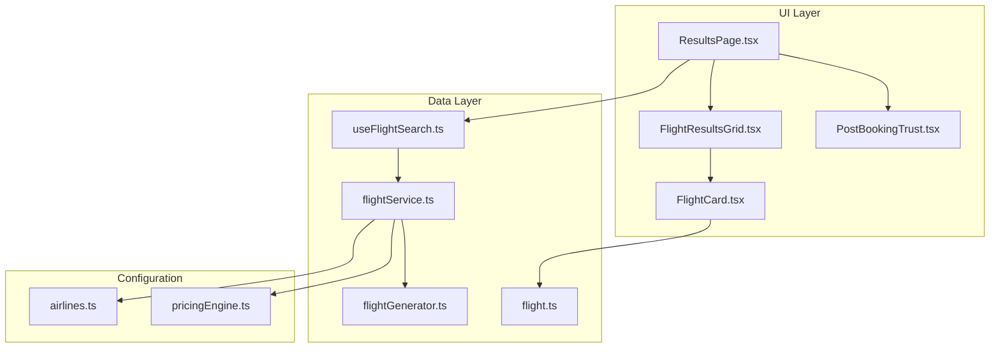
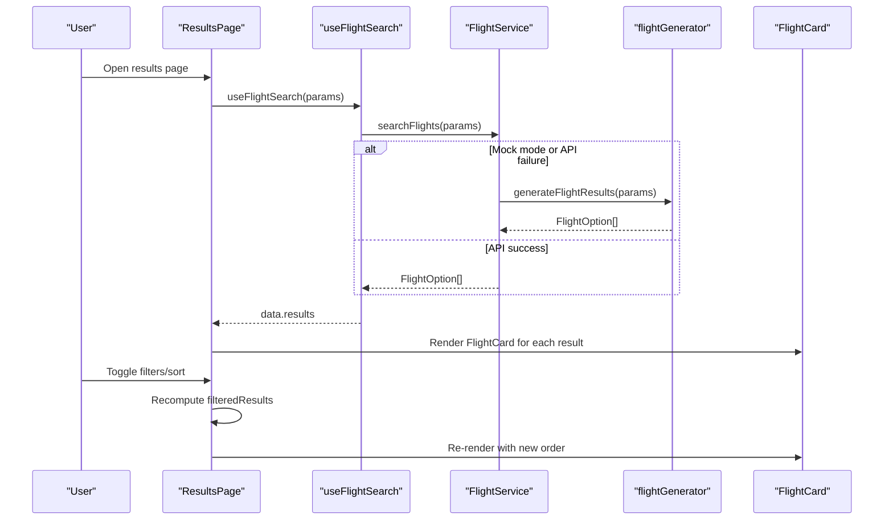
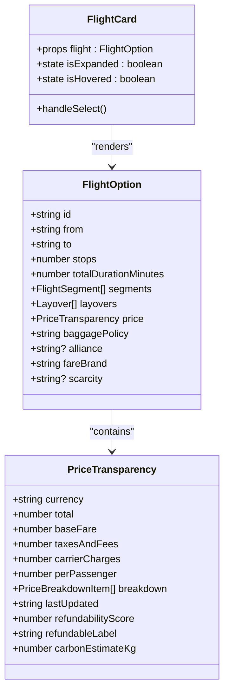
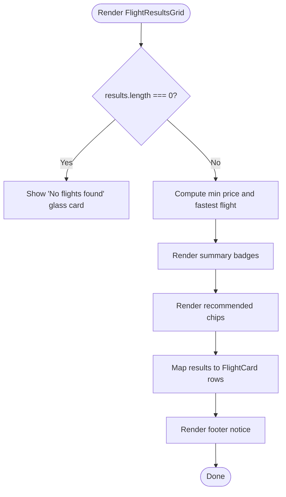
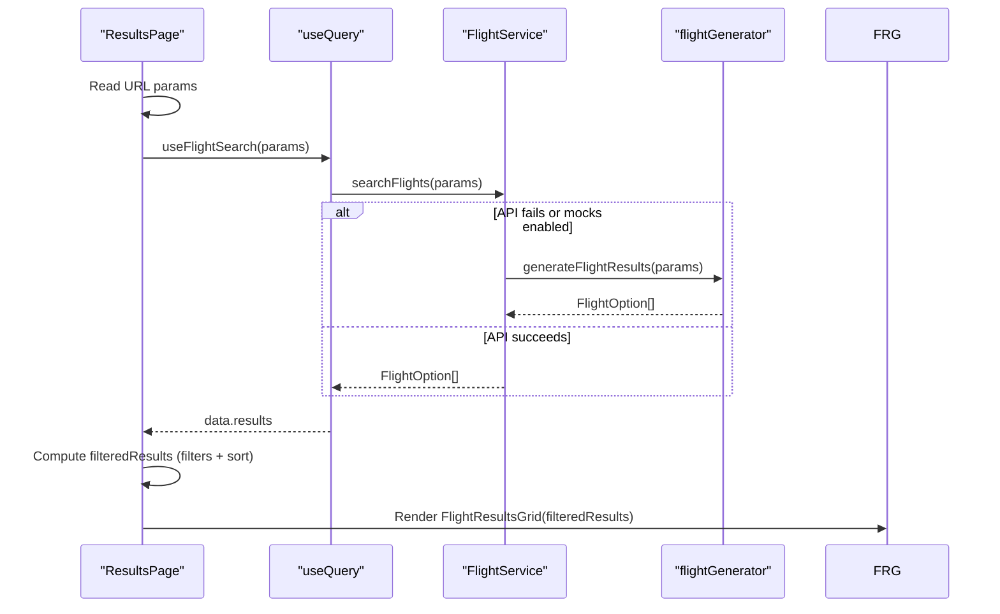
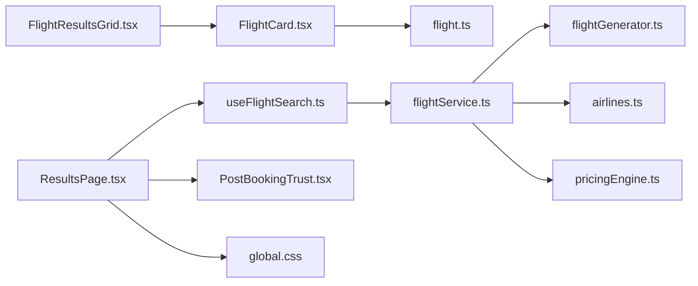

# Results Display System

<cite>
**Referenced Files in This Document**
- [FlightCard.tsx](file://skyflow-pro/src/components/FlightCard/FlightCard.tsx)
- [FlightResultsGrid.tsx](file://skyflow-pro/src/components/FlightCard/FlightResultsGrid.tsx)
- [ResultsPage.tsx](file://skyflow-pro/src/pages/FlightResults/ResultsPage.tsx)
- [flight.ts](file://skyflow-pro/src/types/flight.ts)
- [useFlightSearch.ts](file://skyflow-pro/src/hooks/useFlightSearch.ts)
- [flightService.ts](file://skyflow-pro/src/services/flights/flightService.ts)
- [flightGenerator.ts](file://skyflow-pro/src/services/flights/flightGenerator.ts)
- [airlines.ts](file://skyflow-pro/src/config/airlines.ts)
- [pricingEngine.ts](file://skyflow-pro/src/config/pricingEngine.ts)
- [PostBookingTrust.tsx](file://skyflow-pro/src/components/features/flights/results/PostBookingTrust.tsx)
- [global.css](file://skyflow-pro/src/styles/global.css)
</cite>

## Table of Contents
1. [Introduction](#introduction)
2. [Project Structure](#project-structure)
3. [Core Components](#core-components)
4. [Architecture Overview](#architecture-overview)
5. [Detailed Component Analysis](#detailed-component-analysis)
6. [Dependency Analysis](#dependency-analysis)
7. [Performance Considerations](#performance-considerations)
8. [Troubleshooting Guide](#troubleshooting-guide)
9. [Conclusion](#conclusion)
10. [Appendices](#appendices)

## Introduction
This document describes the flight results display system used in the frontend. It covers how flight information is presented in individual cards, how the grid layout organizes results, how the page orchestrates data fetching and user interactions, and the underlying data structures and configuration that power the display. It also documents customization options for airline branding, user preferences, and performance strategies for large result sets.

## Project Structure
The results display system centers around three primary areas:
- Types define the shape of flight data and pricing.
- Services and generators produce realistic flight data.
- UI components render results and enable user interactions.



**Diagram sources**
- [ResultsPage.tsx:1-366](file://skyflow-pro/src/pages/FlightResults/ResultsPage.tsx#L1-L366)
- [FlightResultsGrid.tsx:1-110](file://skyflow-pro/src/components/FlightCard/FlightResultsGrid.tsx#L1-L110)
- [FlightCard.tsx:1-263](file://skyflow-pro/src/components/FlightCard/FlightCard.tsx#L1-L263)
- [useFlightSearch.ts:1-12](file://skyflow-pro/src/hooks/useFlightSearch.ts#L1-L12)
- [flightService.ts:1-128](file://skyflow-pro/src/services/flights/flightService.ts#L1-L128)
- [flightGenerator.ts:1-325](file://skyflow-pro/src/services/flights/flightGenerator.ts#L1-L325)
- [flight.ts:1-58](file://skyflow-pro/src/types/flight.ts#L1-L58)
- [airlines.ts:1-303](file://skyflow-pro/src/config/airlines.ts#L1-L303)
- [pricingEngine.ts:1-187](file://skyflow-pro/src/config/pricingEngine.ts#L1-L187)
- [PostBookingTrust.tsx:1-49](file://skyflow-pro/src/components/features/flights/results/PostBookingTrust.tsx#L1-L49)

**Section sources**
- [ResultsPage.tsx:1-366](file://skyflow-pro/src/pages/FlightResults/ResultsPage.tsx#L1-L366)
- [FlightResultsGrid.tsx:1-110](file://skyflow-pro/src/components/FlightCard/FlightResultsGrid.tsx#L1-L110)
- [FlightCard.tsx:1-263](file://skyflow-pro/src/components/FlightCard/FlightCard.tsx#L1-L263)
- [flight.ts:1-58](file://skyflow-pro/src/types/flight.ts#L1-L58)
- [useFlightSearch.ts:1-12](file://skyflow-pro/src/hooks/useFlightSearch.ts#L1-L12)
- [flightService.ts:1-128](file://skyflow-pro/src/services/flights/flightService.ts#L1-L128)
- [flightGenerator.ts:1-325](file://skyflow-pro/src/services/flights/flightGenerator.ts#L1-L325)
- [airlines.ts:1-303](file://skyflow-pro/src/config/airlines.ts#L1-L303)
- [pricingEngine.ts:1-187](file://skyflow-pro/src/config/pricingEngine.ts#L1-L187)
- [PostBookingTrust.tsx:1-49](file://skyflow-pro/src/components/features/flights/results/PostBookingTrust.tsx#L1-L49)

## Core Components
- FlightCard: Renders a single flight option with pricing, duration, stops, and expandable details. Supports selection navigation and hover effects.
- FlightResultsGrid: Presents a collection of FlightCard instances, highlights best price/fastest flight, and shows summary badges.
- ResultsPage: Orchestrates data fetching, filters, sorting, loading/error states, and renders the grid with optional sidebar content.

Key responsibilities:
- FlightCard: Formatting, currency display, refundability scoring, carbon footprint, stale price detection, expand/collapse details, and selection routing.
- FlightResultsGrid: Best-option badges, summary statistics, and list rendering.
- ResultsPage: Query orchestration, filter/sort state, pending vs active filters, and UI states (loading, error, empty).

**Section sources**
- [FlightCard.tsx:1-263](file://skyflow-pro/src/components/FlightCard/FlightCard.tsx#L1-L263)
- [FlightResultsGrid.tsx:1-110](file://skyflow-pro/src/components/FlightCard/FlightResultsGrid.tsx#L1-L110)
- [ResultsPage.tsx:1-366](file://skyflow-pro/src/pages/FlightResults/ResultsPage.tsx#L1-L366)

## Architecture Overview
The system follows a unidirectional data flow:
- ResultsPage reads URL parameters and invokes useFlightSearch to fetch results.
- flightService decides between live API calls and mock generation.
- flightGenerator produces realistic flight data with pricing and airline policies.
- UI components render the results and expose user controls for filters and sorting.



**Diagram sources**
- [ResultsPage.tsx:1-366](file://skyflow-pro/src/pages/FlightResults/ResultsPage.tsx#L1-L366)
- [useFlightSearch.ts:1-12](file://skyflow-pro/src/hooks/useFlightSearch.ts#L1-L12)
- [flightService.ts:1-128](file://skyflow-pro/src/services/flights/flightService.ts#L1-L128)
- [flightGenerator.ts:1-325](file://skyflow-pro/src/services/flights/flightGenerator.ts#L1-L325)
- [FlightCard.tsx:1-263](file://skyflow-pro/src/components/FlightCard/FlightCard.tsx#L1-L263)

## Detailed Component Analysis

### FlightCard Component
Purpose:
- Present a single flight’s essential info and pricing.
- Allow expanding to reveal price breakdown, fee details, and fare rules.
- Enable selection to proceed to booking.

Highlights:
- Pricing display uses a fixed-format currency with whole-dollar rounding.
- Duration formatting converts minutes to “Xh Ym”.
- Time formatting uses locale-aware 12-hour time.
- Stale price detection compares lastUpdated to current time.
- Branding visuals:
  - Airline logo placeholder uses marketingCarrierCode.
  - Color scheme varies by marketingCarrierCode for visual distinction.
  - Refundability badge reflects score thresholds.
  - Carbon footprint shown as CO₂ estimate.
- Interactive elements:
  - Expandable details panel with fee breakdown and rules.
  - Select button navigates to booking route and persists selection in session storage.



**Diagram sources**
- [FlightCard.tsx:1-263](file://skyflow-pro/src/components/FlightCard/FlightCard.tsx#L1-L263)
- [flight.ts:1-58](file://skyflow-pro/src/types/flight.ts#L1-L58)

**Section sources**
- [FlightCard.tsx:1-263](file://skyflow-pro/src/components/FlightCard/FlightCard.tsx#L1-L263)
- [flight.ts:1-58](file://skyflow-pro/src/types/flight.ts#L1-L58)

### FlightResultsGrid Layout System
Purpose:
- Display a list of FlightCard entries with contextual summaries and recommended badges.

Highlights:
- Empty-state handling with friendly messaging.
- Best price and fastest flight badges computed from results.
- Recommended chips highlight cheapest/fastest options visually.
- Animated staggered entry for list items.
- Footer note indicating live polling and potential price changes.



**Diagram sources**
- [FlightResultsGrid.tsx:1-110](file://skyflow-pro/src/components/FlightCard/FlightResultsGrid.tsx#L1-L110)

**Section sources**
- [FlightResultsGrid.tsx:1-110](file://skyflow-pro/src/components/FlightCard/FlightResultsGrid.tsx#L1-L110)

### ResultsPage Orchestration
Purpose:
- Fetch, filter, sort, and render flight results.
- Manage user preferences for filters and sorting.
- Handle loading, error, and empty states.

Highlights:
- Reads URL parameters and passes them to useFlightSearch.
- Maintains two filter sets:
  - activeFilters: applied filters.
  - pendingFilters: edits while filter panel is open.
- Computes filteredResults via memoized filtering and sorting.
- Sorting options: price, duration, departure, arrival.
- Filtering options: stops, airline, departure time window, price range.
- Loading, error, and empty states with appropriate UI.
- Sticky sidebar with trust promise component.



**Diagram sources**
- [ResultsPage.tsx:1-366](file://skyflow-pro/src/pages/FlightResults/ResultsPage.tsx#L1-L366)
- [useFlightSearch.ts:1-12](file://skyflow-pro/src/hooks/useFlightSearch.ts#L1-L12)
- [flightService.ts:1-128](file://skyflow-pro/src/services/flights/flightService.ts#L1-L128)
- [flightGenerator.ts:1-325](file://skyflow-pro/src/services/flights/flightGenerator.ts#L1-L325)

**Section sources**
- [ResultsPage.tsx:1-366](file://skyflow-pro/src/pages/FlightResults/ResultsPage.tsx#L1-L366)
- [useFlightSearch.ts:1-12](file://skyflow-pro/src/hooks/useFlightSearch.ts#L1-L12)
- [flightService.ts:1-128](file://skyflow-pro/src/services/flights/flightService.ts#L1-L128)
- [flightGenerator.ts:1-325](file://skyflow-pro/src/services/flights/flightGenerator.ts#L1-L325)

### Flight Type Definitions and Data Structures
Core types:
- CabinClass: enumeration of cabin classes.
- PriceBreakdownItem: labeled fee items.
- PriceTransparency: complete pricing breakdown and metadata.
- FlightSegment: single-leg segment with carrier and timing.
- Layover: stopover details.
- FlightOption: complete flight with segments, layovers, pricing, and metadata.

These types unify how data flows from services to UI components and ensure consistent rendering across cards and grids.

**Section sources**
- [flight.ts:1-58](file://skyflow-pro/src/types/flight.ts#L1-L58)

### Customization Options and Branding Integration
- Airline branding:
  - Carrier code displayed as a visual badge.
  - Color accents vary by carrier code for brand differentiation.
  - Alliance information shown when present.
- Fare brand and refundability:
  - Fare brand displayed as a small badge.
  - Refundability score and label influence badge styling and copy.
- Pricing transparency:
  - Detailed breakdown and fee items are shown in expanded view.
  - Carbon estimate displayed alongside pricing.
- Configuration-driven policies:
  - Airlines’ policies (baggage, seat selection, refund %) are configured centrally and influence pricing and messaging.

**Section sources**
- [FlightCard.tsx:1-263](file://skyflow-pro/src/components/FlightCard/FlightCard.tsx#L1-L263)
- [airlines.ts:1-303](file://skyflow-pro/src/config/airlines.ts#L1-L303)
- [pricingEngine.ts:1-187](file://skyflow-pro/src/config/pricingEngine.ts#L1-L187)

### User Preference Handling
- Sorting:
  - Users can select among price, duration, departure, and arrival sorting.
- Filtering:
  - Stops, airline, departure time window, and price range filters.
  - Pending filters allow editing without applying until the user clicks Apply.
- Preferences persistence:
  - Selected flight is persisted in session storage for seamless booking navigation.

**Section sources**
- [ResultsPage.tsx:1-366](file://skyflow-pro/src/pages/FlightResults/ResultsPage.tsx#L1-L366)
- [FlightCard.tsx:1-263](file://skyflow-pro/src/components/FlightCard/FlightCard.tsx#L1-L263)

## Dependency Analysis
Relationships:
- ResultsPage depends on useFlightSearch, which encapsulates data fetching.
- FlightService chooses between live API and mock generation.
- flightGenerator creates realistic data and integrates pricingEngine and airlines configuration.
- FlightCard consumes FlightOption and displays pricing and metadata.
- Styles are centralized in global.css with glassmorphism and animations.



**Diagram sources**
- [ResultsPage.tsx:1-366](file://skyflow-pro/src/pages/FlightResults/ResultsPage.tsx#L1-L366)
- [useFlightSearch.ts:1-12](file://skyflow-pro/src/hooks/useFlightSearch.ts#L1-L12)
- [flightService.ts:1-128](file://skyflow-pro/src/services/flights/flightService.ts#L1-L128)
- [flightGenerator.ts:1-325](file://skyflow-pro/src/services/flights/flightGenerator.ts#L1-L325)
- [airlines.ts:1-303](file://skyflow-pro/src/config/airlines.ts#L1-L303)
- [pricingEngine.ts:1-187](file://skyflow-pro/src/config/pricingEngine.ts#L1-L187)
- [FlightResultsGrid.tsx:1-110](file://skyflow-pro/src/components/FlightCard/FlightResultsGrid.tsx#L1-L110)
- [FlightCard.tsx:1-263](file://skyflow-pro/src/components/FlightCard/FlightCard.tsx#L1-L263)
- [flight.ts:1-58](file://skyflow-pro/src/types/flight.ts#L1-L58)
- [PostBookingTrust.tsx:1-49](file://skyflow-pro/src/components/features/flights/results/PostBookingTrust.tsx#L1-L49)
- [global.css:1-291](file://skyflow-pro/src/styles/global.css#L1-L291)

**Section sources**
- [ResultsPage.tsx:1-366](file://skyflow-pro/src/pages/FlightResults/ResultsPage.tsx#L1-L366)
- [flightService.ts:1-128](file://skyflow-pro/src/services/flights/flightService.ts#L1-L128)
- [flightGenerator.ts:1-325](file://skyflow-pro/src/services/flights/flightGenerator.ts#L1-L325)
- [airlines.ts:1-303](file://skyflow-pro/src/config/airlines.ts#L1-L303)
- [pricingEngine.ts:1-187](file://skyflow-pro/src/config/pricingEngine.ts#L1-L187)
- [FlightResultsGrid.tsx:1-110](file://skyflow-pro/src/components/FlightCard/FlightResultsGrid.tsx#L1-L110)
- [FlightCard.tsx:1-263](file://skyflow-pro/src/components/FlightCard/FlightCard.tsx#L1-L263)
- [flight.ts:1-58](file://skyflow-pro/src/types/flight.ts#L1-L58)
- [PostBookingTrust.tsx:1-49](file://skyflow-pro/src/components/features/flights/results/PostBookingTrust.tsx#L1-L49)
- [global.css:1-291](file://skyflow-pro/src/styles/global.css#L1-L291)

## Performance Considerations
Current implementation characteristics:
- Virtual scrolling: Not implemented.
- Lazy loading: Not implemented.
- Large result sets: Rendering N FlightCard components sequentially without virtualization may degrade performance for very large lists.
- Animations: Fade-ins and staggered animations are present and may add overhead for large lists.
- Memoization: Filtering and sorting are memoized to avoid unnecessary recomputation.

Recommendations:
- Virtualize the results list to render only visible items plus a small buffer.
- Defer heavy computations (e.g., carbon estimates, refundability labels) to background threads or precompute where feasible.
- Split rendering into chunks to keep the UI responsive during initial load.
- Consider pagination or “load more” for extremely large datasets.

[No sources needed since this section provides general guidance]

## Troubleshooting Guide
Common scenarios:
- No results:
  - The page shows an empty state with guidance to adjust filters.
  - Clear filters action resets both active and pending filters.
- API errors:
  - Error state presents a friendly message and a retry button.
  - The system falls back to mock data generation when enabled or on failure.
- Loading state:
  - Progress bar and shimmer animations indicate ongoing search.
- Stale pricing:
  - Cards display a freshness indicator when price lastUpdated is older than a threshold.

Actions:
- Retry search using the refresh button.
- Adjust filters to broaden the search.
- Verify URL parameters and network connectivity.

**Section sources**
- [ResultsPage.tsx:288-361](file://skyflow-pro/src/pages/FlightResults/ResultsPage.tsx#L288-L361)
- [flightService.ts:32-125](file://skyflow-pro/src/services/flights/flightService.ts#L32-L125)
- [FlightCard.tsx:38-47](file://skyflow-pro/src/components/FlightCard/FlightCard.tsx#L38-L47)

## Conclusion
The results display system combines robust data generation, clear UI components, and user-centric controls to present flight options effectively. FlightCard focuses on concise yet transparent presentation, FlightResultsGrid provides contextual summaries, and ResultsPage coordinates data fetching, filtering, and sorting. With configuration-driven airline policies and pricing logic, the system supports branding and customization while maintaining a consistent user experience. For large datasets, adopting virtual scrolling and lazy loading would further improve responsiveness.

[No sources needed since this section summarizes without analyzing specific files]

## Appendices

### Data Model Overview
```mermaid
erDiagram
FLIGHT_OPTION {
string id PK
string from
string to
enum cabin
int stops
int totalDurationMinutes
text baggagePolicy
string? alliance
string fareBrand
string? scarcity
}
FLIGHT_SEGMENT {
string id PK
string marketingCarrier
string marketingCarrierCode
string operatingCarrierCode
string flightNumber
string from
string to
datetime departureTime
datetime arrivalTime
int durationMinutes
string aircraft
}
LAYOVER {
string id PK
string airport
int durationMinutes
}
PRICE_TRANSPARENCY {
string currency
number total
number baseFare
number taxesAndFees
number carrierCharges
number perPassenger
json breakdown
datetime lastUpdated
int refundabilityScore
string refundableLabel
int carbonEstimateKg
}
FLIGHT_OPTION ||--o{ FLIGHT_SEGMENT : "segments"
FLIGHT_OPTION ||--o{ LAYOVER : "layovers"
FLIGHT_OPTION }o--|| PRICE_TRANSPARENCY : "price"
```

**Diagram sources**
- [flight.ts:1-58](file://skyflow-pro/src/types/flight.ts#L1-L58)