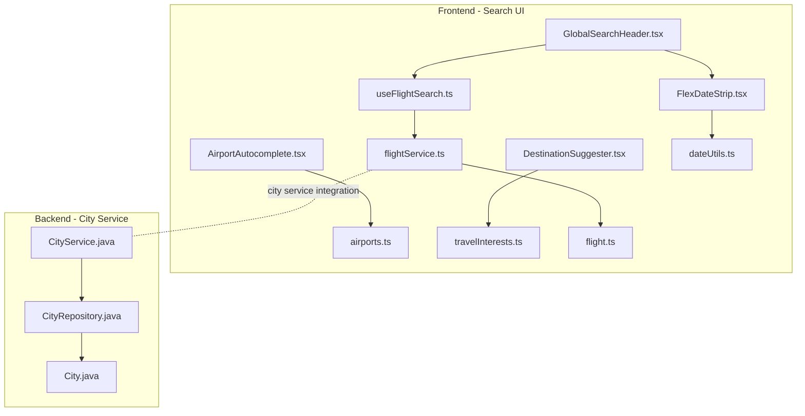
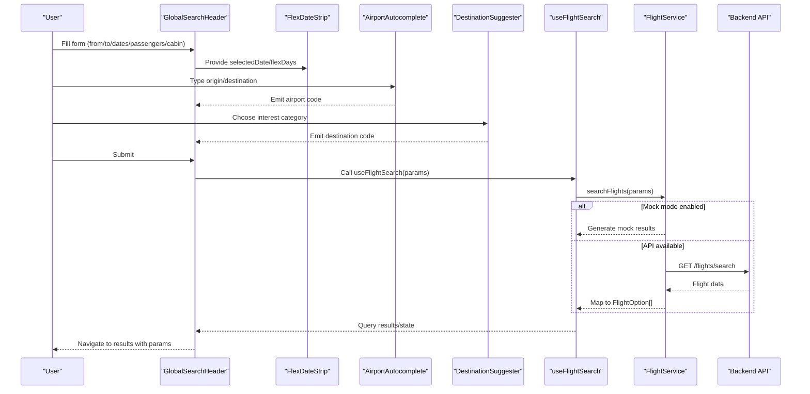
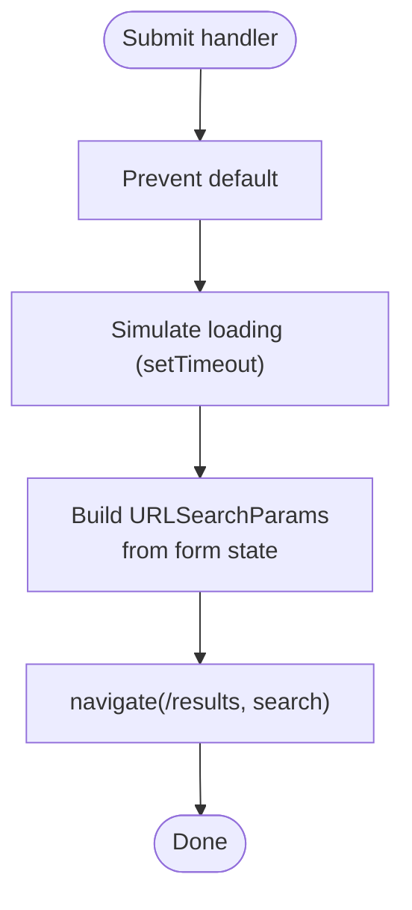
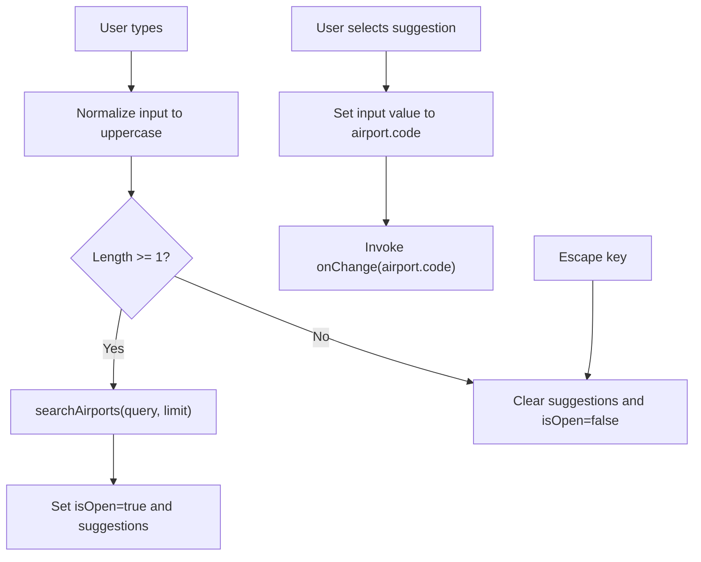
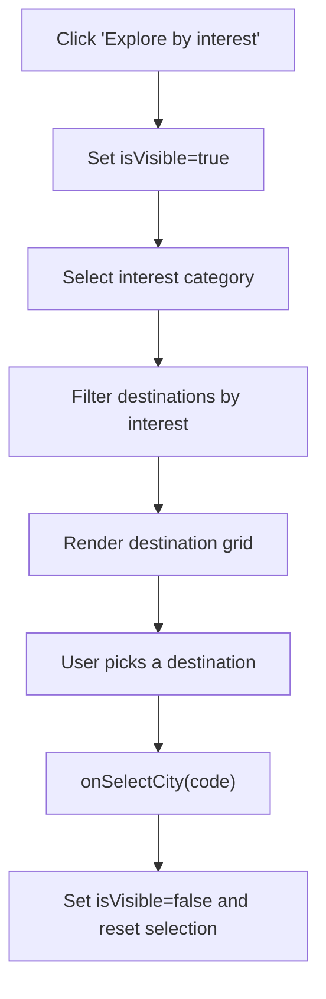
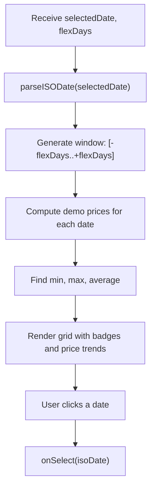
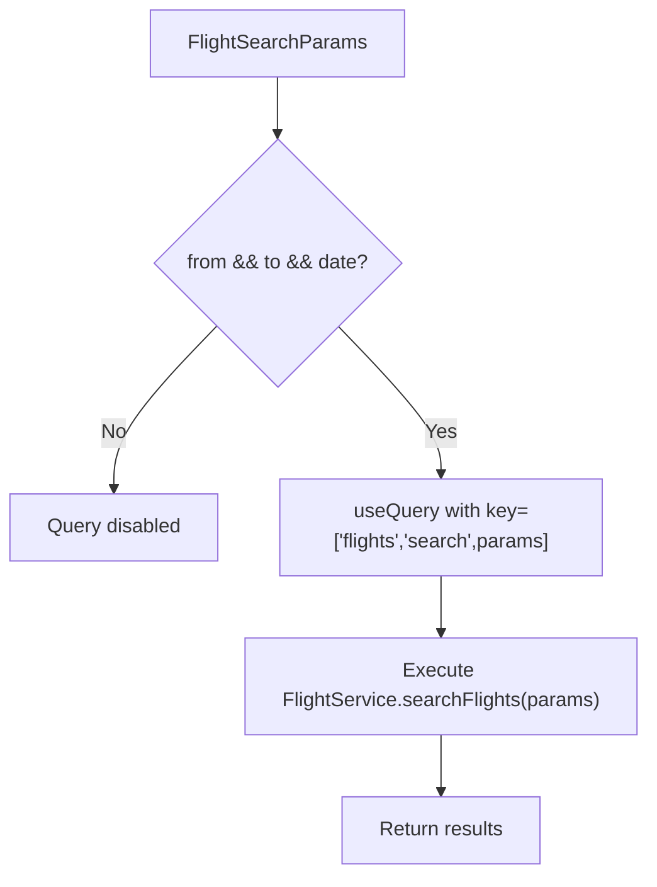
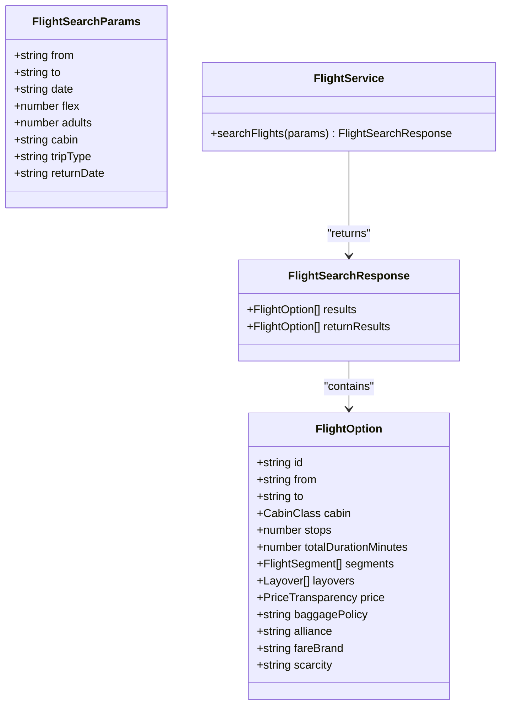
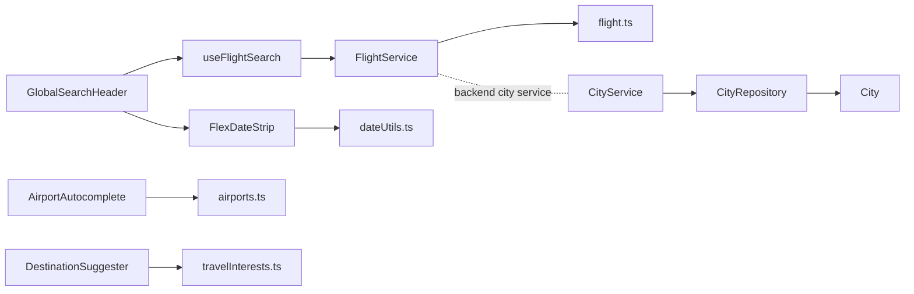

# Search Interface Components

<cite>
**Referenced Files in This Document**
- [GlobalSearchHeader.tsx](file://skyflow-pro/src/components/features/flights/search/GlobalSearchHeader.tsx)
- [AirportAutocomplete.tsx](file://skyflow-pro/src/components/features/flights/search/AirportAutocomplete.tsx)
- [DestinationSuggester.tsx](file://skyflow-pro/src/components/features/flights/search/DestinationSuggester.tsx)
- [FlexDateStrip.tsx](file://skyflow-pro/src/components/features\flights\calendar\FlexDateStrip.tsx)
- [useFlightSearch.ts](file://skyflow-pro/src/hooks/useFlightSearch.ts)
- [flightService.ts](file://skyflow-pro/src/services/flights/flightService.ts)
- [airports.ts](file://skyflow-pro/src/data/airports.ts)
- [travelInterests.ts](file://skyflow-pro/src/config/travelInterests.ts)
- [dateUtils.ts](file://skyflow-pro/src/utils/dateUtils.ts)
- [flight.ts](file://skyflow-pro/src/types/flight.ts)
- [CityService.java](file://backend-server/src/main/java/com/skyflow/service/CityService.java)
- [CityRepository.java](file://backend-server/src/main/java/com/skyflow/repository/CityRepository.java)
- [City.java](file://backend-server/src/main/java/com/skyflow/model/entity/City.java)
</cite>

## Table of Contents
1. [Introduction](#introduction)
2. [Project Structure](#project-structure)
3. [Core Components](#core-components)
4. [Architecture Overview](#architecture-overview)
5. [Detailed Component Analysis](#detailed-component-analysis)
6. [Dependency Analysis](#dependency-analysis)
7. [Performance Considerations](#performance-considerations)
8. [Troubleshooting Guide](#troubleshooting-guide)
9. [Conclusion](#conclusion)

## Introduction
This document provides a comprehensive guide to the flight search interface components, focusing on:
- GlobalSearchHeader: form validation, input handling, and user experience enhancements
- AirportAutocomplete: auto-suggestion logic, airport code resolution, and integration patterns
- DestinationSuggester: popular destination recommendations and user preference tracking
- Flexible date selection via FlexDateStrip integrated with calendar logic
- useFlightSearch hook for state management and API communication
It also documents component props, event handlers, and integration patterns within the overall search workflow.

## Project Structure
The search interface is implemented in the frontend under skyflow-pro/src/components/features/flights/search and skyflow-pro/src/components/features/flights/calendar. Supporting data and configuration live under skyflow-pro/src/data, skyflow-pro/src/config, and skyflow-pro/src/utils. The backend CityService and related repositories are located under backend-server/src/main/java/com/skyflow.

**Diagram sources**
- [GlobalSearchHeader.tsx:1-278](file://skyflow-pro/src/components/features/flights/search/GlobalSearchHeader.tsx#L1-L278)
- [AirportAutocomplete.tsx:1-206](file://skyflow-pro/src/components/features/flights/search/AirportAutocomplete.tsx#L1-L206)
- [DestinationSuggester.tsx:1-113](file://skyflow-pro/src/components/features/flights/search/DestinationSuggester.tsx#L1-L113)
- [FlexDateStrip.tsx:1-148](file://skyflow-pro/src/components/features/flights/calendar/FlexDateStrip.tsx#L1-L148)
- [useFlightSearch.ts:1-12](file://skyflow-pro/src/hooks/useFlightSearch.ts#L1-L12)
- [flightService.ts:1-128](file://skyflow-pro/src/services/flights/flightService.ts#L1-L128)
- [airports.ts:1-151](file://skyflow-pro/src/data/airports.ts#L1-L151)
- [travelInterests.ts:1-70](file://skyflow-pro/src/config/travelInterests.ts#L1-L70)
- [dateUtils.ts:1-41](file://skyflow-pro/src/utils/dateUtils.ts#L1-L41)
- [flight.ts:1-58](file://skyflow-pro/src/types/flight.ts#L1-L58)
- [CityService.java:1-27](file://backend-server/src/main/java/com/skyflow/service/CityService.java#L1-L27)
- [CityRepository.java:1-13](file://backend-server/src/main/java/com/skyflow/repository/CityRepository.java#L1-L13)
- [City.java:1-26](file://backend-server/src/main/java/com/skyflow/model/entity/City.java#L1-L26)

**Section sources**
- [GlobalSearchHeader.tsx:1-278](file://skyflow-pro/src/components/features/flights/search/GlobalSearchHeader.tsx#L1-L278)
- [AirportAutocomplete.tsx:1-206](file://skyflow-pro/src/components/features/flights/search/AirportAutocomplete.tsx#L1-L206)
- [DestinationSuggester.tsx:1-113](file://skyflow-pro/src/components/features/flights/search/DestinationSuggester.tsx#L1-L113)
- [FlexDateStrip.tsx:1-148](file://skyflow-pro/src/components/features/flights/calendar/FlexDateStrip.tsx#L1-L148)
- [useFlightSearch.ts:1-12](file://skyflow-pro/src/hooks/useFlightSearch.ts#L1-L12)
- [flightService.ts:1-128](file://skyflow-pro/src/services/flights/flightService.ts#L1-L128)
- [airports.ts:1-151](file://skyflow-pro/src/data/airports.ts#L1-L151)
- [travelInterests.ts:1-70](file://skyflow-pro/src/config/travelInterests.ts#L1-L70)
- [dateUtils.ts:1-41](file://skyflow-pro/src/utils/dateUtils.ts#L1-L41)
- [flight.ts:1-58](file://skyflow-pro/src/types/flight.ts#L1-L58)
- [CityService.java:1-27](file://backend-server/src/main/java/com/skyflow/service/CityService.java#L1-L27)
- [CityRepository.java:1-13](file://backend-server/src/main/java/com/skyflow/repository/CityRepository.java#L1-L13)
- [City.java:1-26](file://backend-server/src/main/java/com/skyflow/model/entity/City.java#L1-L26)

## Core Components
- GlobalSearchHeader: Central search form with trip type toggles, origin/destination inputs, flexible date strip, passenger count, cabin class, and submission routing to results page.
- AirportAutocomplete: Intelligent input with keyboard navigation, suggestions dropdown, and airport code resolution.
- DestinationSuggester: Interest-driven destination recommendations with category selection and quick pick.
- FlexDateStrip: Interactive flexible date selector with price visualization and selection callback.
- useFlightSearch: TanStack Query hook orchestrating search queries and enabling conditions.
- flightService: Frontend service wrapping API client and mock fallback, mapping backend responses to typed results.

**Section sources**
- [GlobalSearchHeader.tsx:27-278](file://skyflow-pro/src/components/features/flights/search/GlobalSearchHeader.tsx#L27-L278)
- [AirportAutocomplete.tsx:21-206](file://skyflow-pro/src/components/features/flights/search/AirportAutocomplete.tsx#L21-L206)
- [DestinationSuggester.tsx:10-113](file://skyflow-pro/src/components/features/flights/search/DestinationSuggester.tsx#L10-L113)
- [FlexDateStrip.tsx:30-148](file://skyflow-pro/src/components/features/flights/calendar/FlexDateStrip.tsx#L30-L148)
- [useFlightSearch.ts:4-10](file://skyflow-pro/src/hooks/useFlightSearch.ts#L4-L10)
- [flightService.ts:31-128](file://skyflow-pro/src/services/flights/flightService.ts#L31-L128)

## Architecture Overview
The search workflow integrates UI components with typed services and utilities:
- GlobalSearchHeader collects form state and navigates to results with query parameters.
- AirportAutocomplete resolves user input to airport codes using local data.
- DestinationSuggester provides curated suggestions based on interests.
- FlexDateStrip computes and displays flexible dates with price indicators.
- useFlightSearch triggers search via FlightService, which communicates with backend or falls back to mock generation.
- Backend CityService supports city-related operations (e.g., city tagging) complementing the frontend airport dataset.

**Diagram sources**
- [GlobalSearchHeader.tsx:52-72](file://skyflow-pro/src/components/features/flights/search/GlobalSearchHeader.tsx#L52-L72)
- [FlexDateStrip.tsx:30-148](file://skyflow-pro/src/components/features/flights/calendar/FlexDateStrip.tsx#L30-L148)
- [AirportAutocomplete.tsx:65-77](file://skyflow-pro/src/components/features/flights/search/AirportAutocomplete.tsx#L65-L77)
- [DestinationSuggester.tsx:23-27](file://skyflow-pro/src/components/features/flights/search/DestinationSuggester.tsx#L23-L27)
- [useFlightSearch.ts:4-10](file://skyflow-pro/src/hooks/useFlightSearch.ts#L4-L10)
- [flightService.ts:32-125](file://skyflow-pro/src/services/flights/flightService.ts#L32-L125)

## Detailed Component Analysis

### GlobalSearchHeader
- Purpose: Unified flight search form with validation, user experience enhancements, and navigation to results.
- Form state management:
  - Tracks from, to, departureDate, returnDate, tripType, passengers, cabin, flexDays.
  - Two-way binding via handleChange with generic key-value updates.
- Validation and UX:
  - Required fields enforced at input level.
  - Swap locations button toggles origin/destination.
  - Submission prevents default, simulates minimal delay, builds URLSearchParams, and navigates to /results.
  - Conditional rendering of return date input for roundtrip.
  - Flexible date strip renders only when a departure date is selected.
- Props and events:
  - No incoming props; manages internal state and emits navigation.
  - Event handlers: handleChange, swapLocations, handleSubmit.
- Accessibility:
  - Proper labels, roles, and aria attributes for interactive elements.

**Diagram sources**
- [GlobalSearchHeader.tsx:52-72](file://skyflow-pro/src/components/features/flights/search/GlobalSearchHeader.tsx#L52-L72)

**Section sources**
- [GlobalSearchHeader.tsx:27-278](file://skyflow-pro/src/components/features/flights/search/GlobalSearchHeader.tsx#L27-L278)

### AirportAutocomplete
- Purpose: Intelligent airport/city input with auto-suggestions and keyboard navigation.
- Auto-suggestion logic:
  - Debounced searchAirports(query, limit) invoked on input change.
  - Exact airport code match prioritized; otherwise fuzzy match across code, city, name, and searchTerms.
  - Sorting favors exact code starts, then city starts.
- Selection and resolution:
  - Selecting a suggestion sets the input to airport code and invokes onChange.
  - Clear button resets input and suggestions.
- Keyboard accessibility:
  - Arrow keys navigate suggestions; Enter selects; Escape closes.
  - Focus and ARIA attributes for combobox/listbox pattern.
- Integration:
  - Uses local airports.ts dataset; backend CityService supports city tagging and discovery.

**Diagram sources**
- [AirportAutocomplete.tsx:36-77](file://skyflow-pro/src/components/features/flights/search/AirportAutocomplete.tsx#L36-L77)
- [airports.ts:72-129](file://skyflow-pro/src/data/airports.ts#L72-L129)

**Section sources**
- [AirportAutocomplete.tsx:21-206](file://skyflow-pro/src/components/features/flights/search/AirportAutocomplete.tsx#L21-L206)
- [airports.ts:1-151](file://skyflow-pro/src/data/airports.ts#L1-L151)
- [CityService.java:16-25](file://backend-server/src/main/java/com/skyflow/service/CityService.java#L16-L25)
- [CityRepository.java:8-12](file://backend-server/src/main/java/com/skyflow/repository/CityRepository.java#L8-L12)
- [City.java:16-24](file://backend-server/src/main/java/com/skyflow/model/entity/City.java#L16-L24)

### DestinationSuggester
- Purpose: Interest-based destination recommendations to assist undecided travelers.
- Behavior:
  - Toggles visibility to reveal categories and suggestions.
  - On category selection, filters suggested destinations by interest.
  - On destination click, invokes onSelectCity and collapses panel.
- Data:
  - INTEREST_CATEGORIES defines selectable interests.
  - SUGGESTED_DESTINATIONS lists destinations with associated interests and metadata.
- UX:
  - Animated transitions and clear close affordance.

**Diagram sources**
- [DestinationSuggester.tsx:10-113](file://skyflow-pro/src/components/features/flights/search/DestinationSuggester.tsx#L10-L113)
- [travelInterests.ts:21-69](file://skyflow-pro/src/config/travelInterests.ts#L21-L69)

**Section sources**
- [DestinationSuggester.tsx:10-113](file://skyflow-pro/src/components/features/flights/search/DestinationSuggester.tsx#L10-L113)
- [travelInterests.ts:1-70](file://skyflow-pro/src/config/travelInterests.ts#L1-L70)

### Flexible Date Selection (FlexDateStrip)
- Purpose: Visualize flexible dates around a selected departure date with price indicators.
- Inputs:
  - selectedDate (YYYY-MM-DD), flexDays, onSelect callback.
- Logic:
  - Generates a symmetric window of dates centered on selectedDate.
  - Computes demo prices per date and highlights the cheapest day(s).
  - Uses dateUtils for parsing, formatting, and arithmetic.
- Interaction:
  - Each date button triggers onSelect with ISO date string.
  - Selected date receives distinct styling and a small indicator.
- Accessibility:
  - Proper ARIA attributes and keyboard operability.

**Diagram sources**
- [FlexDateStrip.tsx:30-148](file://skyflow-pro/src/components/features/flights/calendar/FlexDateStrip.tsx#L30-L148)
- [dateUtils.ts:1-41](file://skyflow-pro/src/utils/dateUtils.ts#L1-L41)

**Section sources**
- [FlexDateStrip.tsx:30-148](file://skyflow-pro/src/components/features/flights/calendar/FlexDateStrip.tsx#L30-L148)
- [dateUtils.ts:1-41](file://skyflow-pro/src/utils/dateUtils.ts#L1-L41)

### useFlightSearch Hook
- Purpose: Encapsulate search query state and enablement using TanStack Query.
- Behavior:
  - Returns useQuery with a stable queryKey derived from params.
  - Calls FlightService.searchFlights(params) as queryFn.
  - Enabled only when required fields (from, to, date) are truthy.
- Integration:
  - Drives results page and downstream components requiring search data.

**Diagram sources**
- [useFlightSearch.ts:4-10](file://skyflow-pro/src/hooks/useFlightSearch.ts#L4-L10)
- [flightService.ts:32-42](file://skyflow-pro/src/services/flights/flightService.ts#L32-L42)

**Section sources**
- [useFlightSearch.ts:1-12](file://skyflow-pro/src/hooks/useFlightSearch.ts#L1-L12)
- [flightService.ts:1-128](file://skyflow-pro/src/services/flights/flightService.ts#L1-L128)

### FlightService and Types
- FlightSearchParams: shape of search parameters consumed by the service.
- FlightSearchResponse: normalized response structure for single and round-trip results.
- Mapping and fallback:
  - Supports mock mode via environment flag; otherwise calls backend API.
  - Maps backend class names to UI labels and constructs typed FlightOption results.
  - Round-trip requests fetch outbound and return separately.
- Types:
  - flight.ts defines CabinClass, PriceTransparency, FlightSegment, Layover, and FlightOption.

**Diagram sources**
- [flightService.ts:7-21](file://skyflow-pro/src/services/flights/flightService.ts#L7-L21)
- [flight.ts:1-58](file://skyflow-pro/src/types/flight.ts#L1-L58)

**Section sources**
- [flightService.ts:31-128](file://skyflow-pro/src/services/flights/flightService.ts#L31-L128)
- [flight.ts:1-58](file://skyflow-pro/src/types/flight.ts#L1-L58)

## Dependency Analysis
- Component coupling:
  - GlobalSearchHeader depends on FlexDateStrip and useFlightSearch.
  - AirportAutocomplete depends on airports.ts and emits airport codes to parent forms.
  - DestinationSuggester depends on travelInterests.ts and emits destination codes.
  - FlexDateStrip depends on dateUtils.ts for date manipulation and formatting.
- External integrations:
  - FlightService consumes apiClient and optionally falls back to mock generators.
  - Backend CityService and CityRepository provide city data and tagging support.

**Diagram sources**
- [GlobalSearchHeader.tsx:1-278](file://skyflow-pro/src/components/features/flights/search/GlobalSearchHeader.tsx#L1-L278)
- [FlexDateStrip.tsx:1-148](file://skyflow-pro/src/components/features/flights/calendar/FlexDateStrip.tsx#L1-L148)
- [useFlightSearch.ts:1-12](file://skyflow-pro/src/hooks/useFlightSearch.ts#L1-L12)
- [flightService.ts:1-128](file://skyflow-pro/src/services/flights/flightService.ts#L1-L128)
- [flight.ts:1-58](file://skyflow-pro/src/types/flight.ts#L1-L58)
- [AirportAutocomplete.tsx:1-206](file://skyflow-pro/src/components/features/flights/search/AirportAutocomplete.tsx#L1-L206)
- [airports.ts:1-151](file://skyflow-pro/src/data/airports.ts#L1-L151)
- [DestinationSuggester.tsx:1-113](file://skyflow-pro/src/components/features/flights/search/DestinationSuggester.tsx#L1-L113)
- [travelInterests.ts:1-70](file://skyflow-pro/src/config/travelInterests.ts#L1-L70)
- [dateUtils.ts:1-41](file://skyflow-pro/src/utils/dateUtils.ts#L1-L41)
- [CityService.java:1-27](file://backend-server/src/main/java/com/skyflow/service/CityService.java#L1-L27)
- [CityRepository.java:1-13](file://backend-server/src/main/java/com/skyflow/repository/CityRepository.java#L1-L13)
- [City.java:1-26](file://backend-server/src/main/java/com/skyflow/model/entity/City.java#L1-L26)

**Section sources**
- [GlobalSearchHeader.tsx:1-278](file://skyflow-pro/src/components/features/flights/search/GlobalSearchHeader.tsx#L1-L278)
- [AirportAutocomplete.tsx:1-206](file://skyflow-pro/src/components/features/flights/search/AirportAutocomplete.tsx#L1-L206)
- [DestinationSuggester.tsx:1-113](file://skyflow-pro/src/components/features/flights/search/DestinationSuggester.tsx#L1-L113)
- [FlexDateStrip.tsx:1-148](file://skyflow-pro/src/components/features/flights/calendar/FlexDateStrip.tsx#L1-L148)
- [useFlightSearch.ts:1-12](file://skyflow-pro/src/hooks/useFlightSearch.ts#L1-L12)
- [flightService.ts:1-128](file://skyflow-pro/src/services/flights/flightService.ts#L1-L128)
- [airports.ts:1-151](file://skyflow-pro/src/data/airports.ts#L1-L151)
- [travelInterests.ts:1-70](file://skyflow-pro/src/config/travelInterests.ts#L1-L70)
- [dateUtils.ts:1-41](file://skyflow-pro/src/utils/dateUtils.ts#L1-L41)
- [flight.ts:1-58](file://skyflow-pro/src/types/flight.ts#L1-L58)
- [CityService.java:1-27](file://backend-server/src/main/java/com/skyflow/service/CityService.java#L1-L27)
- [CityRepository.java:1-13](file://backend-server/src/main/java/com/skyflow/repository/CityRepository.java#L1-L13)
- [City.java:1-26](file://backend-server/src/main/java/com/skyflow/model/entity/City.java#L1-L26)

## Performance Considerations
- Debounce and limit suggestions: AirportAutocomplete limits results and filters on minimal input to reduce computation.
- Local dataset: airports.ts avoids network calls for suggestions; consider pagination or caching for larger datasets.
- Mock fallback: useFlightSearch enables immediate feedback during development; production relies on backend for real-time pricing.
- Date computations: FlexDateStrip precomputes prices and renders a fixed window; keep window sizes reasonable to avoid heavy DOM.

## Troubleshooting Guide
- AirportAutocomplete does not show suggestions:
  - Ensure input length meets minimum threshold and query normalization is applied.
  - Verify searchAirports returns results for the query.
- Selected airport code not reflected:
  - Confirm onChange handler updates parent state and input value is set to airport code.
- DestinationSuggester shows empty grid:
  - Check that the selected interest has matching destinations in SUGGESTED_DESTINATIONS.
- FlexDateStrip not rendering:
  - Ensure selectedDate is a valid ISO date string and flexDays is a positive integer.
- Search yields no results:
  - Confirm useFlightSearch is enabled (from, to, date present).
  - Check FlightService fallback behavior and backend availability.

**Section sources**
- [AirportAutocomplete.tsx:36-77](file://skyflow-pro/src/components/features/flights/search/AirportAutocomplete.tsx#L36-L77)
- [airports.ts:72-129](file://skyflow-pro/src/data/airports.ts#L72-L129)
- [DestinationSuggester.tsx:15-21](file://skyflow-pro/src/components/features/flights/search/DestinationSuggester.tsx#L15-L21)
- [travelInterests.ts:67-69](file://skyflow-pro/src/config/travelInterests.ts#L67-L69)
- [FlexDateStrip.tsx:30-38](file://skyflow-pro/src/components/features/flights/calendar/FlexDateStrip.tsx#L30-L38)
- [useFlightSearch.ts:8-9](file://skyflow-pro/src/hooks/useFlightSearch.ts#L8-L9)
- [flightService.ts:32-42](file://skyflow-pro/src/services/flights/flightService.ts#L32-L42)

## Conclusion
The search interface components provide a cohesive, accessible, and extensible foundation for flight search:
- GlobalSearchHeader centralizes form state and navigation.
- AirportAutocomplete delivers precise airport code resolution with robust UX.
- DestinationSuggester enhances discovery through interest-based curation.
- FlexDateStrip improves flexibility with visual price insights.
- useFlightSearch and FlightService integrate cleanly with backend APIs and offer reliable fallbacks.
These components can be extended with backend-backed city services and enhanced with additional validation and internationalization as needed.