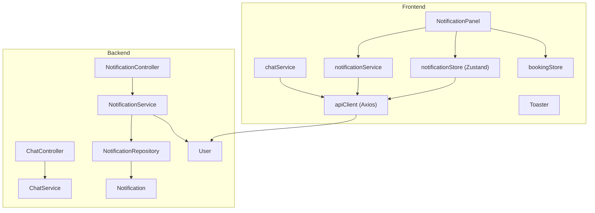
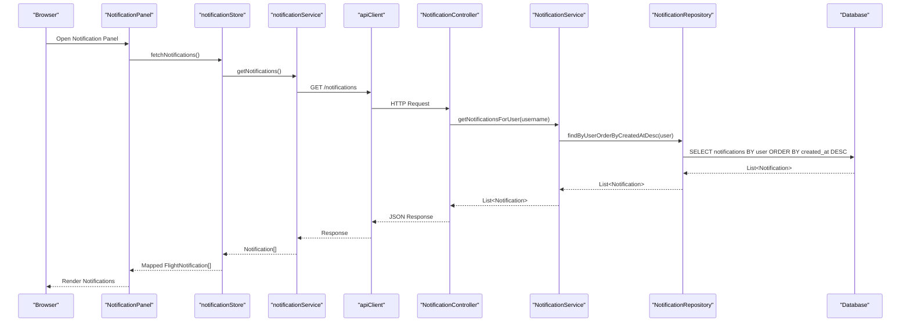
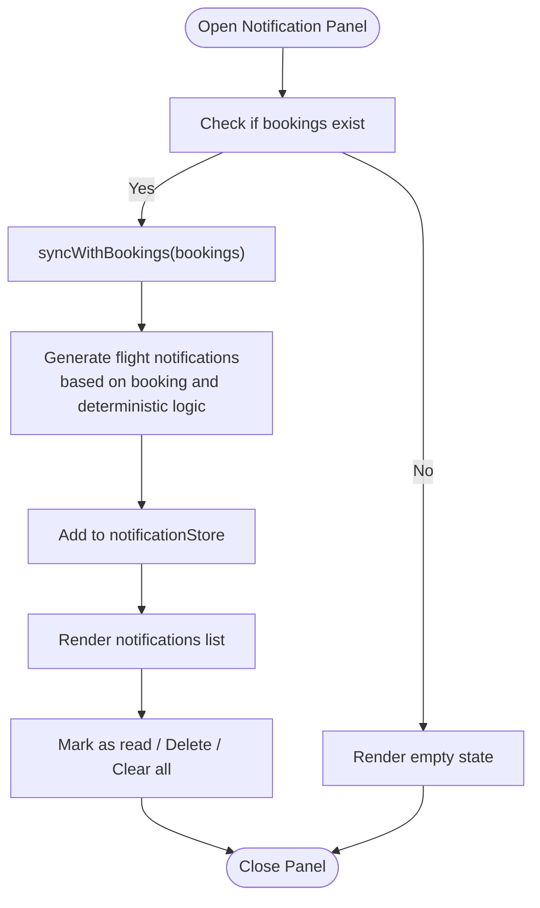
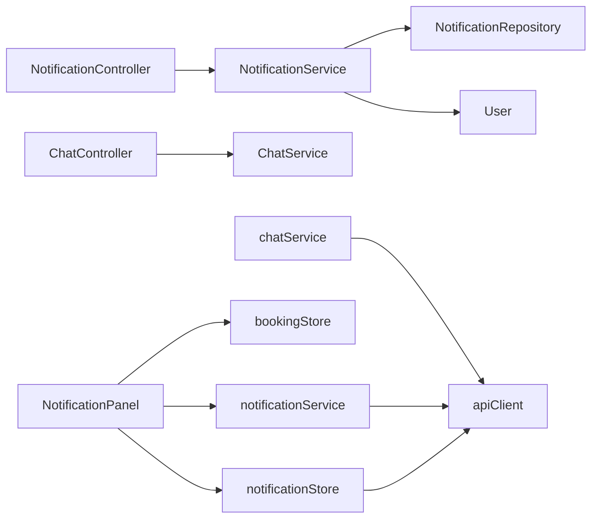

# Notifications & Chat System

<cite>
**Referenced Files in This Document**
- [NotificationController.java](file://backend-server/src/main/java/com/airline/controller/NotificationController.java)
- [ChatController.java](file://backend-server/src/main/java/com/airline/controller/ChatController.java)
- [NotificationService.java](file://backend-server/src/main/java/com/airline/service/NotificationService.java)
- [ChatService.java](file://backend-server/src/main/java/com/airline/service/ChatService.java)
- [Notification.java](file://backend-server/src/main/java/com/airline/model/entity/Notification.java)
- [User.java](file://backend-server/src/main/java/com/airline/model/entity/User.java)
- [NotificationRepository.java](file://backend-server/src/main/java/com/airline/repository/NotificationRepository.java)
- [application.yml](file://backend-server/src/main/resources/application.yml)
- [NotificationPanel.tsx](file://skyflow-pro/src/components/features/notifications/NotificationPanel.tsx)
- [notificationService.ts](file://skyflow-pro/src/services/notifications/notificationService.ts)
- [notificationStore.ts](file://skyflow-pro/src/stores/notificationStore.ts)
- [chatService.ts](file://skyflow-pro/src/services/chat/chatService.ts)
- [apiClient.ts](file://skyflow-pro/src/services/api/apiClient.ts)
- [bookingStore.ts](file://skyflow-pro/src/stores/bookingStore.ts)
- [index.tsx](file://skyflow-pro/src/components/common/Toaster/index.tsx)
</cite>

## Table of Contents
1. [Introduction](#introduction)
2. [Project Structure](#project-structure)
3. [Core Components](#core-components)
4. [Architecture Overview](#architecture-overview)
5. [Detailed Component Analysis](#detailed-component-analysis)
6. [Dependency Analysis](#dependency-analysis)
7. [Performance Considerations](#performance-considerations)
8. [Troubleshooting Guide](#troubleshooting-guide)
9. [Conclusion](#conclusion)

## Introduction
This document provides comprehensive documentation for the notifications and chat system in the Airline Reservation System. It covers the backend notification and chat controllers, services, and data models, alongside the frontend notification panel, Zustand store, and supporting services. The system supports user-specific notifications persisted in the database, real-time-like flight updates via a local Zustand store, and a simple AI-assisted chat support feature.

## Project Structure
The notifications and chat system spans both backend and frontend layers:
- Backend: Spring Boot REST controllers expose endpoints for retrieving user notifications and chat support data. Services encapsulate business logic, and JPA repositories manage persistence.
- Frontend: React components render the notification panel, Zustand manages notification state, and Axios-based API client handles HTTP requests with JWT authentication.

**Diagram sources**
- [NotificationController.java:1-24](file://backend-server/src/main/java/com/airline/controller/NotificationController.java#L1-L24)
- [ChatController.java:1-27](file://backend-server/src/main/java/com/airline/controller/ChatController.java#L1-L27)
- [NotificationService.java:1-35](file://backend-server/src/main/java/com/airline/service/NotificationService.java#L1-L35)
- [ChatService.java:1-56](file://backend-server/src/main/java/com/airline/service/ChatService.java#L1-L56)
- [NotificationRepository.java:1-11](file://backend-server/src/main/java/com/airline/repository/NotificationRepository.java#L1-L11)
- [Notification.java:1-31](file://backend-server/src/main/java/com/airline/model/entity/Notification.java#L1-L31)
- [User.java:1-31](file://backend-server/src/main/java/com/airline/model/entity/User.java#L1-L31)
- [NotificationPanel.tsx:1-228](file://skyflow-pro/src/components/features/notifications/NotificationPanel.tsx#L1-L228)
- [notificationService.ts:1-22](file://skyflow-pro/src/services/notifications/notificationService.ts#L1-L22)
- [notificationStore.ts:1-233](file://skyflow-pro/src/stores/notificationStore.ts#L1-L233)
- [chatService.ts:1-21](file://skyflow-pro/src/services/chat/chatService.ts#L1-L21)
- [apiClient.ts:1-38](file://skyflow-pro/src/services/api/apiClient.ts#L1-L38)
- [bookingStore.ts:1-115](file://skyflow-pro/src/stores/bookingStore.ts#L1-L115)

**Section sources**
- [NotificationController.java:1-24](file://backend-server/src/main/java/com/airline/controller/NotificationController.java#L1-L24)
- [ChatController.java:1-27](file://backend-server/src/main/java/com/airline/controller/ChatController.java#L1-L27)
- [NotificationService.java:1-35](file://backend-server/src/main/java/com/airline/service/NotificationService.java#L1-L35)
- [ChatService.java:1-56](file://backend-server/src/main/java/com/airline/service/ChatService.java#L1-L56)
- [NotificationRepository.java:1-11](file://backend-server/src/main/java/com/airline/repository/NotificationRepository.java#L1-L11)
- [Notification.java:1-31](file://backend-server/src/main/java/com/airline/model/entity/Notification.java#L1-L31)
- [User.java:1-31](file://backend-server/src/main/java/com/airline/model/entity/User.java#L1-L31)
- [NotificationPanel.tsx:1-228](file://skyflow-pro/src/components/features/notifications/NotificationPanel.tsx#L1-L228)
- [notificationService.ts:1-22](file://skyflow-pro/src/services/notifications/notificationService.ts#L1-L22)
- [notificationStore.ts:1-233](file://skyflow-pro/src/stores/notificationStore.ts#L1-L233)
- [chatService.ts:1-21](file://skyflow-pro/src/services/chat/chatService.ts#L1-L21)
- [apiClient.ts:1-38](file://skyflow-pro/src/services/api/apiClient.ts#L1-L38)
- [bookingStore.ts:1-115](file://skyflow-pro/src/stores/bookingStore.ts#L1-L115)

## Core Components
- Backend notification stack:
  - Controller: Exposes GET /notifications to fetch user-specific notifications.
  - Service: Loads user by username and retrieves notifications ordered by creation time.
  - Model: Notification entity with user relationship, message, read flag, timestamps, and optional booking linkage.
  - Repository: JPA repository with a finder method to sort notifications by user.
- Backend chat stack:
  - Controller: Provides GET /chat/support and POST /chat/support for chat support data and simple query processing.
  - Service: Returns FAQs, contact info, and chat hours; processes queries with keyword matching.
- Frontend notification stack:
  - Store: Zustand store managing flight notifications, CRUD operations, unread counts, and synchronization with bookings.
  - Service: Fetches backend notifications and maps them to the frontend notification model.
  - Component: NotificationPanel renders a sliding panel with filtering, actions, and time formatting.
- Frontend chat stack:
  - Service: Fetches support data from the backend.
- Authentication and HTTP:
  - API client: Injects JWT token into Authorization header and handles 401 auto-logout.

**Section sources**
- [NotificationController.java:1-24](file://backend-server/src/main/java/com/airline/controller/NotificationController.java#L1-L24)
- [NotificationService.java:1-35](file://backend-server/src/main/java/com/airline/service/NotificationService.java#L1-L35)
- [Notification.java:1-31](file://backend-server/src/main/java/com/airline/model/entity/Notification.java#L1-L31)
- [NotificationRepository.java:1-11](file://backend-server/src/main/java/com/airline/repository/NotificationRepository.java#L1-L11)
- [ChatController.java:1-27](file://backend-server/src/main/java/com/airline/controller/ChatController.java#L1-L27)
- [ChatService.java:1-56](file://backend-server/src/main/java/com/airline/service/ChatService.java#L1-L56)
- [notificationStore.ts:1-233](file://skyflow-pro/src/stores/notificationStore.ts#L1-L233)
- [notificationService.ts:1-22](file://skyflow-pro/src/services/notifications/notificationService.ts#L1-L22)
- [NotificationPanel.tsx:1-228](file://skyflow-pro/src/components/features/notifications/NotificationPanel.tsx#L1-L228)
- [chatService.ts:1-21](file://skyflow-pro/src/services/chat/chatService.ts#L1-L21)
- [apiClient.ts:1-38](file://skyflow-pro/src/services/api/apiClient.ts#L1-L38)

## Architecture Overview
The system follows a layered architecture:
- Controllers handle HTTP requests and delegate to services.
- Services encapsulate business logic and coordinate repositories.
- Entities and repositories manage persistence.
- Frontend components consume services and state stores to render UI and manage user interactions.

**Diagram sources**
- [NotificationPanel.tsx:1-228](file://skyflow-pro/src/components/features/notifications/NotificationPanel.tsx#L1-L228)
- [notificationStore.ts:1-233](file://skyflow-pro/src/stores/notificationStore.ts#L1-L233)
- [notificationService.ts:1-22](file://skyflow-pro/src/services/notifications/notificationService.ts#L1-L22)
- [apiClient.ts:1-38](file://skyflow-pro/src/services/api/apiClient.ts#L1-L38)
- [NotificationController.java:1-24](file://backend-server/src/main/java/com/airline/controller/NotificationController.java#L1-L24)
- [NotificationService.java:1-35](file://backend-server/src/main/java/com/airline/service/NotificationService.java#L1-L35)
- [NotificationRepository.java:1-11](file://backend-server/src/main/java/com/airline/repository/NotificationRepository.java#L1-L11)

## Detailed Component Analysis

### Backend Notification Controller
- Responsibilities:
  - Expose GET /notifications endpoint.
  - Authenticate user via Spring Security and pass username to service.
- Behavior:
  - Retrieves notifications for the authenticated user and returns them as JSON.

**Section sources**
- [NotificationController.java:1-24](file://backend-server/src/main/java/com/airline/controller/NotificationController.java#L1-L24)

### Backend Notification Service
- Responsibilities:
  - Load user by username.
  - Retrieve notifications sorted by creation time descending.
  - Provide a method to create notifications linked to a user and optional booking.
- Persistence:
  - Uses NotificationRepository to query notifications by user.

**Section sources**
- [NotificationService.java:1-35](file://backend-server/src/main/java/com/airline/service/NotificationService.java#L1-L35)
- [NotificationRepository.java:1-11](file://backend-server/src/main/java/com/airline/repository/NotificationRepository.java#L1-L11)
- [User.java:1-31](file://backend-server/src/main/java/com/airline/model/entity/User.java#L1-L31)

### Backend Chat Controller
- Responsibilities:
  - Provide GET /chat/support returning support metadata (FAQs, contact info, chat hours).
  - Provide POST /chat/support accepting a query payload and returning a processed fact.
- Behavior:
  - Delegates to ChatService for data and query processing.

**Section sources**
- [ChatController.java:1-27](file://backend-server/src/main/java/com/airline/controller/ChatController.java#L1-L27)

### Backend Chat Service
- Responsibilities:
  - Build support data structure with FAQs, email, phone, and chat hours.
  - Process user queries with keyword-based responses.
- Data:
  - Static FAQs and dynamic responses based on query keywords.

**Section sources**
- [ChatService.java:1-56](file://backend-server/src/main/java/com/airline/service/ChatService.java#L1-L56)

### Frontend Notification Panel
- Responsibilities:
  - Display a sliding panel of notifications with unread indicators and actions.
  - Sync notifications with user bookings and generate synthetic updates.
  - Format timestamps and apply priority-based styling.
- Interactions:
  - Mark individual notifications as read.
  - Delete or clear notifications.
  - Close panel.

**Diagram sources**
- [NotificationPanel.tsx:1-228](file://skyflow-pro/src/components/features/notifications/NotificationPanel.tsx#L1-L228)
- [notificationStore.ts:1-233](file://skyflow-pro/src/stores/notificationStore.ts#L1-L233)
- [bookingStore.ts:1-115](file://skyflow-pro/src/stores/bookingStore.ts#L1-L115)

**Section sources**
- [NotificationPanel.tsx:1-228](file://skyflow-pro/src/components/features/notifications/NotificationPanel.tsx#L1-L228)
- [notificationStore.ts:1-233](file://skyflow-pro/src/stores/notificationStore.ts#L1-L233)
- [bookingStore.ts:1-115](file://skyflow-pro/src/stores/bookingStore.ts#L1-L115)

### Frontend Notification Store (Zustand)
- Responsibilities:
  - Manage a list of FlightNotification entries.
  - Fetch backend notifications and map them to the frontend model.
  - Provide CRUD operations, unread count calculation, and bulk actions.
  - Persist state to localStorage via Zustand middleware.
- Helpers:
  - Functions to create specific notification types (delay, preponement, gate_change, info).
  - Synchronization function to generate realistic updates based on bookings.

**Section sources**
- [notificationStore.ts:1-233](file://skyflow-pro/src/stores/notificationStore.ts#L1-L233)

### Frontend Notification Service
- Responsibilities:
  - Fetch notifications from /notifications endpoint.
  - Placeholder for marking as read (endpoint not implemented in backend yet).

**Section sources**
- [notificationService.ts:1-22](file://skyflow-pro/src/services/notifications/notificationService.ts#L1-L22)

### Frontend Chat Service
- Responsibilities:
  - Fetch support data from /chat/support endpoint.
  - No chat history persistence in frontend; relies on backend responses.

**Section sources**
- [chatService.ts:1-21](file://skyflow-pro/src/services/chat/chatService.ts#L1-L21)

### Frontend API Client
- Responsibilities:
  - Configure base URL and interceptors.
  - Inject Authorization: Bearer token from auth store.
  - Auto-logout on 401 Unauthorized.

**Section sources**
- [apiClient.ts:1-38](file://skyflow-pro/src/services/api/apiClient.ts#L1-L38)

### Backend Data Model: Notification
- Fields:
  - Identifier, user relationship, message, read flag, creation timestamp, optional booking identifier.
- Relationships:
  - Many-to-one with User.

**Section sources**
- [Notification.java:1-31](file://backend-server/src/main/java/com/airline/model/entity/Notification.java#L1-L31)
- [User.java:1-31](file://backend-server/src/main/java/com/airline/model/entity/User.java#L1-L31)

### Frontend Toaster Utility
- Responsibilities:
  - Provide a global toast notification system with configurable types and auto-dismissal.
  - Used for general UI feedback; not specific to notifications.

**Section sources**
- [index.tsx:1-126](file://skyflow-pro/src/components/common/Toaster/index.tsx#L1-L126)

## Dependency Analysis
- Backend dependencies:
  - NotificationController depends on NotificationService.
  - NotificationService depends on NotificationRepository and UserRepository.
  - NotificationRepository depends on Notification entity.
  - ChatController depends on ChatService.
- Frontend dependencies:
  - NotificationPanel depends on notificationStore, bookingStore, and notificationService.
  - notificationStore depends on notificationService and apiClient.
  - chatService depends on apiClient.
  - apiClient depends on auth store for JWT token.

**Diagram sources**
- [NotificationController.java:1-24](file://backend-server/src/main/java/com/airline/controller/NotificationController.java#L1-L24)
- [NotificationService.java:1-35](file://backend-server/src/main/java/com/airline/service/NotificationService.java#L1-L35)
- [NotificationRepository.java:1-11](file://backend-server/src/main/java/com/airline/repository/NotificationRepository.java#L1-L11)
- [User.java:1-31](file://backend-server/src/main/java/com/airline/model/entity/User.java#L1-L31)
- [ChatController.java:1-27](file://backend-server/src/main/java/com/airline/controller/ChatController.java#L1-L27)
- [ChatService.java:1-56](file://backend-server/src/main/java/com/airline/service/ChatService.java#L1-L56)
- [NotificationPanel.tsx:1-228](file://skyflow-pro/src/components/features/notifications/NotificationPanel.tsx#L1-L228)
- [notificationStore.ts:1-233](file://skyflow-pro/src/stores/notificationStore.ts#L1-L233)
- [notificationService.ts:1-22](file://skyflow-pro/src/services/notifications/notificationService.ts#L1-L22)
- [chatService.ts:1-21](file://skyflow-pro/src/services/chat/chatService.ts#L1-L21)
- [apiClient.ts:1-38](file://skyflow-pro/src/services/api/apiClient.ts#L1-L38)

**Section sources**
- [NotificationController.java:1-24](file://backend-server/src/main/java/com/airline/controller/NotificationController.java#L1-L24)
- [NotificationService.java:1-35](file://backend-server/src/main/java/com/airline/service/NotificationService.java#L1-L35)
- [NotificationRepository.java:1-11](file://backend-server/src/main/java/com/airline/repository/NotificationRepository.java#L1-L11)
- [User.java:1-31](file://backend-server/src/main/java/com/airline/model/entity/User.java#L1-L31)
- [ChatController.java:1-27](file://backend-server/src/main/java/com/airline/controller/ChatController.java#L1-L27)
- [ChatService.java:1-56](file://backend-server/src/main/java/com/airline/service/ChatService.java#L1-L56)
- [NotificationPanel.tsx:1-228](file://skyflow-pro/src/components/features/notifications/NotificationPanel.tsx#L1-L228)
- [notificationStore.ts:1-233](file://skyflow-pro/src/stores/notificationStore.ts#L1-L233)
- [notificationService.ts:1-22](file://skyflow-pro/src/services/notifications/notificationService.ts#L1-L22)
- [chatService.ts:1-21](file://skyflow-pro/src/services/chat/chatService.ts#L1-L21)
- [apiClient.ts:1-38](file://skyflow-pro/src/services/api/apiClient.ts#L1-L38)

## Performance Considerations
- Backend:
  - Sorting notifications by creation time descending is efficient with proper indexing on user and created_at columns.
  - Consider pagination for large notification histories to reduce payload size.
- Frontend:
  - Limit the number of stored notifications (already capped at 50 in the store) to maintain UI responsiveness.
  - Debounce or throttle syncWithBookings to avoid frequent re-renders during rapid booking changes.
- Network:
  - Centralize JWT injection in apiClient to avoid redundant header handling.
  - Implement retry/backoff strategies for transient failures.

## Troubleshooting Guide
- Authentication failures:
  - 401 Unauthorized triggers automatic logout in apiClient; ensure the auth store token is present and valid.
- Missing notifications:
  - Verify the user is authenticated and the backend endpoint returns notifications for the current username.
- Chat support issues:
  - Confirm /chat/support endpoints are reachable and that the backend service returns structured support data.
- State persistence:
  - If notifications disappear after refresh, confirm Zustand persistence is configured and localStorage is writable.

**Section sources**
- [apiClient.ts:1-38](file://skyflow-pro/src/services/api/apiClient.ts#L1-L38)
- [NotificationController.java:1-24](file://backend-server/src/main/java/com/airline/controller/NotificationController.java#L1-L24)
- [ChatController.java:1-27](file://backend-server/src/main/java/com/airline/controller/ChatController.java#L1-L27)
- [notificationStore.ts:1-233](file://skyflow-pro/src/stores/notificationStore.ts#L1-L233)

## Conclusion
The notifications and chat system integrates backend REST endpoints with a robust frontend Zustand store and React components. Notifications are user-scoped and persisted, while the notification panel provides a rich, interactive experience with booking-driven updates. The chat feature offers immediate support metadata and simple query responses. Future enhancements could include real-time messaging, per-user notification preferences, and expanded chat capabilities.