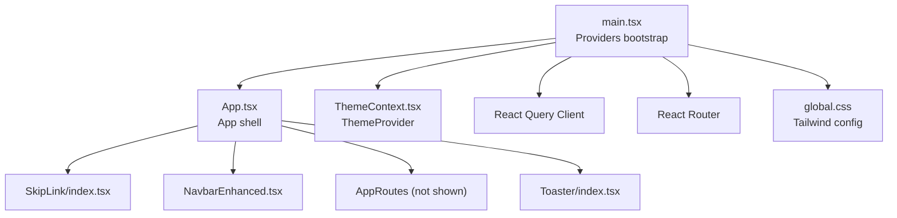
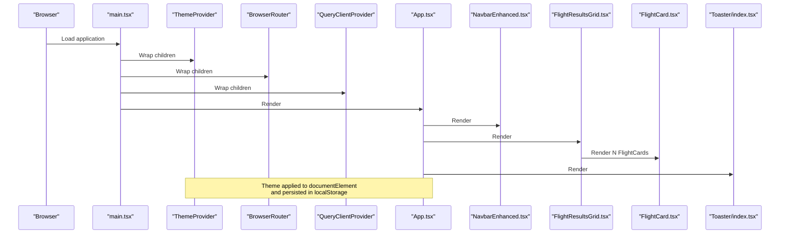
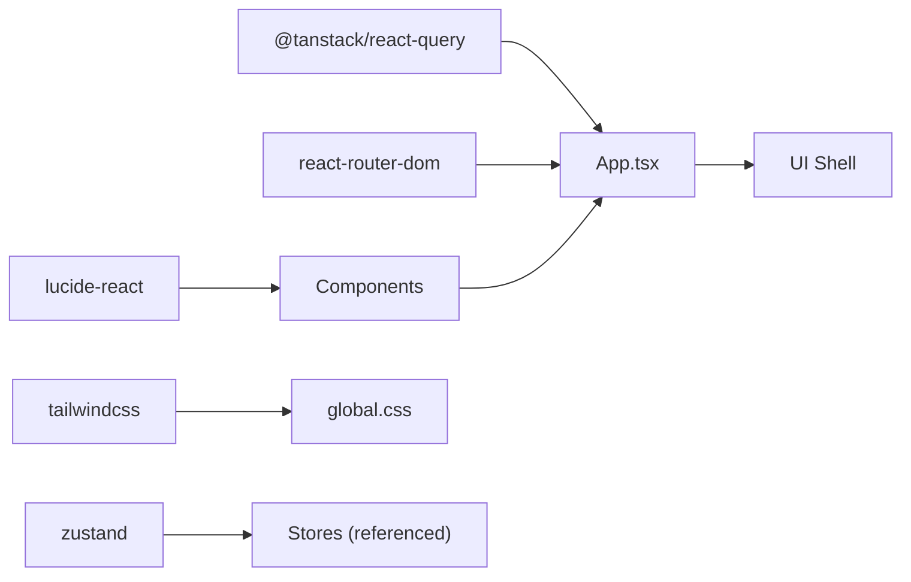

# UI Components & Design System

<cite>
**Referenced Files in This Document**
- [App.tsx](file://skyflow-pro/src/App.tsx)
- [main.tsx](file://skyflow-pro/src/main.tsx)
- [tailwind.config.mts](file://skyflow-pro/tailwind.config.mts)
- [global.css](file://skyflow-pro/src/styles/global.css)
- [FlightCard.tsx](file://skyflow-pro/src/components/FlightCard/FlightCard.tsx)
- [FlightResultsGrid.tsx](file://skyflow-pro/src/components/FlightCard/FlightResultsGrid.tsx)
- [NavbarEnhanced.tsx](file://skyflow-pro/src/components/Header/NavbarEnhanced.tsx)
- [SimpleNavbar.tsx](file://skyflow-pro/src/components/Header/SimpleNavbar.tsx)
- [index.tsx](file://skyflow-pro/src/components/common/Toaster/index.tsx)
- [ThemeContext.tsx](file://skyflow-pro/src/context/ThemeContext.tsx)
- [ThemeToggle.tsx](file://skyflow-pro/src/components/features/theme/ThemeToggle.tsx)
- [SkipLink/index.tsx](file://skyflow-pro/src/components/common/SkipLink/index.tsx)
- [flight.ts](file://skyflow-pro/src/types/flight.ts)
- [package.json](file://skyflow-pro/package.json)
</cite>

## Table of Contents
1. [Introduction](#introduction)
2. [Project Structure](#project-structure)
3. [Core Components](#core-components)
4. [Architecture Overview](#architecture-overview)
5. [Detailed Component Analysis](#detailed-component-analysis)
6. [Dependency Analysis](#dependency-analysis)
7. [Performance Considerations](#performance-considerations)
8. [Accessibility Features](#accessibility-features)
9. [Integration Guidelines](#integration-guidelines)
10. [Usage Examples and Customization](#usage-examples-and-customization)
11. [Testing Strategies](#testing-strategies)
12. [Troubleshooting Guide](#troubleshooting-guide)
13. [Conclusion](#conclusion)

## Introduction
This document describes the UI components library and design system for the SkyFlow Pro frontend. It covers reusable components such as flight cards, navigation bars, toasts, and layout helpers, along with the theme system, dark/light mode switching, responsive design, accessibility, and integration guidelines. The design system leverages Tailwind CSS for styling, with a custom theme configuration and global styles that support dark and light modes, glassmorphism effects, and rich animations.

## Project Structure
The SkyFlow Pro frontend is organized around feature-based components and shared utilities. The main application bootstraps providers for routing, theming, toasts, and React Query, and renders the app shell with a skip link, navigation bar, page routes, and a global toast container.

**Diagram sources**
- [main.tsx:1-33](file://skyflow-pro/src/main.tsx#L1-L33)
- [App.tsx:1-18](file://skyflow-pro/src/App.tsx#L1-L18)
- [SkipLink/index.tsx:1-12](file://skyflow-pro/src/components/common/SkipLink/index.tsx#L1-L12)
- [NavbarEnhanced.tsx:1-120](file://skyflow-pro/src/components/Header/NavbarEnhanced.tsx#L1-L120)
- [index.tsx:1-126](file://skyflow-pro/src/components/common/Toaster/index.tsx#L1-L126)
- [ThemeContext.tsx:1-89](file://skyflow-pro/src/context/ThemeContext.tsx#L1-L89)
- [global.css:1-291](file://skyflow-pro/src/styles/global.css#L1-L291)

**Section sources**
- [main.tsx:1-33](file://skyflow-pro/src/main.tsx#L1-L33)
- [App.tsx:1-18](file://skyflow-pro/src/App.tsx#L1-L18)

## Core Components
- FlightCard: Renders a single flight option with pricing, duration, stops, refundability, and expandable details.
- FlightResultsGrid: Displays a collection of FlightCard instances, highlights best options, and provides summary badges.
- NavbarEnhanced: Full-featured header with navigation links, theme toggle, notifications, help panel, profile modal, and settings panel.
- SimpleNavbar: Minimal header variant for lightweight pages.
- Toaster: Global toast notification system with context provider and animated toasts.
- ThemeToggle: Interactive theme selector (light/dark/system).
- ThemeContext: Theme state management with persistence and system preference detection.
- SkipLink: Accessible “skip to main content” link for keyboard navigation.

**Section sources**
- [FlightCard.tsx:1-263](file://skyflow-pro/src/components/FlightCard/FlightCard.tsx#L1-L263)
- [FlightResultsGrid.tsx:1-110](file://skyflow-pro/src/components/FlightCard/FlightResultsGrid.tsx#L1-L110)
- [NavbarEnhanced.tsx:1-120](file://skyflow-pro/src/components/Header/NavbarEnhanced.tsx#L1-L120)
- [SimpleNavbar.tsx:1-81](file://skyflow-pro/src/components/Header/SimpleNavbar.tsx#L1-L81)
- [index.tsx:1-126](file://skyflow-pro/src/components/common/Toaster/index.tsx#L1-L126)
- [ThemeToggle.tsx:1-39](file://skyflow-pro/src/components/features/theme/ThemeToggle.tsx#L1-L39)
- [ThemeContext.tsx:1-89](file://skyflow-pro/src/context/ThemeContext.tsx#L1-L89)
- [SkipLink/index.tsx:1-12](file://skyflow-pro/src/components/common/SkipLink/index.tsx#L1-L12)

## Architecture Overview
The UI architecture centers on a provider-first initialization that wires routing, theming, and global state. Components consume context and stores to render dynamic content and manage user interactions.

**Diagram sources**
- [main.tsx:1-33](file://skyflow-pro/src/main.tsx#L1-L33)
- [App.tsx:1-18](file://skyflow-pro/src/App.tsx#L1-L18)
- [NavbarEnhanced.tsx:1-120](file://skyflow-pro/src/components/Header/NavbarEnhanced.tsx#L1-L120)
- [FlightResultsGrid.tsx:1-110](file://skyflow-pro/src/components/FlightCard/FlightResultsGrid.tsx#L1-L110)
- [FlightCard.tsx:1-263](file://skyflow-pro/src/components/FlightCard/FlightCard.tsx#L1-L263)
- [index.tsx:1-126](file://skyflow-pro/src/components/common/Toaster/index.tsx#L1-L126)
- [ThemeContext.tsx:1-89](file://skyflow-pro/src/context/ThemeContext.tsx#L1-L89)

## Detailed Component Analysis

### FlightCard
Purpose: Display a single flight option with pricing, duration, stops, refundability, and optional expandable details.

Key behaviors:
- Hover and selection states with subtle animations and glow effects.
- Expand/collapse details panel showing price breakdown, fee details, and fare rules.
- Dynamic badges for refundability and carbon footprint.
- Navigation to booking on selection.

Prop interface:
- flight: FlightOption (see types)

Styling patterns:
- Gradient backgrounds, glass-like borders, and soft shadows.
- Responsive layout using flex and grid with Tailwind utilities.
- Conditional classes based on state and props.

Accessibility:
- Uses semantic headings and labels within the expanded details.
- Keyboard operable buttons with clear focus styles.

Performance:
- Uses memoized formatters and minimal re-renders via local state.
- Animated transitions are hardware-accelerated via Tailwind utilities.

**Section sources**
- [FlightCard.tsx:1-263](file://skyflow-pro/src/components/FlightCard/FlightCard.tsx#L1-L263)
- [flight.ts:1-58](file://skyflow-pro/src/types/flight.ts#L1-L58)

### FlightResultsGrid
Purpose: Render a list of FlightCard components with summary highlights and recommended badges.

Key behaviors:
- Computes minimum price and fastest flight for summary badges.
- Highlights up to three recommended options differently.
- Animates cards with staggered delays for a polished entrance.

Prop interface:
- results: FlightOption[]

Styling patterns:
- Glass containers with rounded corners and subtle borders.
- Badge highlights for best price and fastest flight.

Accessibility:
- Announces “Flight search results” via aria-label.

**Section sources**
- [FlightResultsGrid.tsx:1-110](file://skyflow-pro/src/components/FlightCard/FlightResultsGrid.tsx#L1-L110)
- [flight.ts:1-58](file://skyflow-pro/src/types/flight.ts#L1-L58)

### NavbarEnhanced
Purpose: Full-featured application header with navigation, theme toggle, notifications, help, profile, and settings.

Key behaviors:
- Mobile-friendly collapsible menu.
- Active link highlighting based on current route.
- Unread notifications badge.
- Opens contextual panels (notifications, help, profile, settings).

Styling patterns:
- Glass effect with backdrop blur and borders.
- Gradient accents and consistent spacing.

Accessibility:
- Proper aria labels and roles for interactive elements.
- Focus management within open panels.

**Section sources**
- [NavbarEnhanced.tsx:1-120](file://skyflow-pro/src/components/Header/NavbarEnhanced.tsx#L1-L120)

### SimpleNavbar
Purpose: Lightweight header variant without advanced features.

Key behaviors:
- Minimalist design with bell, settings, and user placeholder.
- Mobile menu toggling.

Styling patterns:
- Consistent glass and gradient styling.

**Section sources**
- [SimpleNavbar.tsx:1-81](file://skyflow-pro/src/components/Header/SimpleNavbar.tsx#L1-L81)

### Toaster
Purpose: Global toast notification system with context-managed queue and auto-dismiss.

Key behaviors:
- Context exposes addToast/removeToast.
- Auto-dismiss after a fixed interval.
- Color-coded toasts by type (success, error, info, warning).
- Animated entrance and exit.

Prop interface:
- No props for Toaster; consumes context.

Styling patterns:
- Backdrop blur, rounded corners, and soft borders.
- Type-specific color tokens.

**Section sources**
- [index.tsx:1-126](file://skyflow-pro/src/components/common/Toaster/index.tsx#L1-L126)

### ThemeToggle
Purpose: Allow users to switch between light, dark, and system themes.

Key behaviors:
- Updates theme via ThemeContext.
- Persists selection in localStorage.
- Reflects current selection with visual emphasis.

**Section sources**
- [ThemeToggle.tsx:1-39](file://skyflow-pro/src/components/features/theme/ThemeToggle.tsx#L1-L39)
- [ThemeContext.tsx:1-89](file://skyflow-pro/src/context/ThemeContext.tsx#L1-L89)

### ThemeContext
Purpose: Centralized theme state with persistence and system preference detection.

Key behaviors:
- Reads/writes theme to localStorage.
- Applies resolved theme to documentElement and meta theme-color.
- Subscribes to system preference changes when in system mode.

**Section sources**
- [ThemeContext.tsx:1-89](file://skyflow-pro/src/context/ThemeContext.tsx#L1-L89)

### SkipLink
Purpose: Provide keyboard-accessible navigation to main content.

Key behaviors:
- Hidden by default, visible on focus.
- Links to an element with id="main".

**Section sources**
- [SkipLink/index.tsx:1-12](file://skyflow-pro/src/components/common/SkipLink/index.tsx#L1-L12)

## Dependency Analysis
External libraries and integrations:
- React and React Router for UI and routing.
- React Query for caching and background updates.
- Lucide React for icons.
- Tailwind CSS for styling and animations.
- Zustand for lightweight stores (used by higher-level components).

**Diagram sources**
- [package.json:15-44](file://skyflow-pro/package.json#L15-L44)
- [main.tsx:1-33](file://skyflow-pro/src/main.tsx#L1-L33)
- [global.css:1-291](file://skyflow-pro/src/styles/global.css#L1-L291)

**Section sources**
- [package.json:15-44](file://skyflow-pro/package.json#L15-L44)

## Performance Considerations
- Prefer CSS transitions and transforms for animations (already used via Tailwind utilities).
- Keep components pure and minimize heavy computations inside render; memoize where appropriate.
- Use lazy loading for non-critical routes and images.
- Limit DOM depth in dense lists (e.g., FlightResultsGrid) and leverage virtualization for very large datasets.
- Avoid unnecessary re-renders by passing stable callbacks and using shallow equality checks in downstream components.
- Leverage browser caching and asset optimization via Vite build pipeline.

## Accessibility Features
- SkipLink ensures keyboard users can bypass repeated navigation.
- ARIA labels and roles on interactive elements (buttons, menus, panels).
- Focus-visible outlines and clear focus rings for keyboard navigation.
- Sufficient color contrast using the custom palette.
- Semantic HTML and proper heading hierarchy within components.

**Section sources**
- [SkipLink/index.tsx:1-12](file://skyflow-pro/src/components/common/SkipLink/index.tsx#L1-L12)
- [NavbarEnhanced.tsx:1-120](file://skyflow-pro/src/components/Header/NavbarEnhanced.tsx#L1-L120)
- [FlightCard.tsx:1-263](file://skyflow-pro/src/components/FlightCard/FlightCard.tsx#L1-L263)

## Integration Guidelines
- Wrap your application with the provider stack in main.tsx to ensure all components have access to theme, routing, and toasts.
- Use ThemeProvider near the root to enable theme switching across the app.
- Import and render NavbarEnhanced or SimpleNavbar depending on page needs.
- Use ToasterProvider to enable global notifications.
- For flight-related pages, pass FlightOption arrays to FlightResultsGrid and then to FlightCard.

**Section sources**
- [main.tsx:1-33](file://skyflow-pro/src/main.tsx#L1-L33)
- [App.tsx:1-18](file://skyflow-pro/src/App.tsx#L1-L18)
- [NavbarEnhanced.tsx:1-120](file://skyflow-pro/src/components/Header/NavbarEnhanced.tsx#L1-L120)
- [FlightResultsGrid.tsx:1-110](file://skyflow-pro/src/components/FlightCard/FlightResultsGrid.tsx#L1-L110)
- [index.tsx:1-126](file://skyflow-pro/src/components/common/Toaster/index.tsx#L1-L126)

## Usage Examples and Customization
- FlightCard
  - Props: flight (FlightOption)
  - Customization: Adjust color tokens, badges, and layout via Tailwind modifiers; override animations using utility classes.
  - Example path: [FlightCard.tsx:1-263](file://skyflow-pro/src/components/FlightCard/FlightCard.tsx#L1-L263)
- FlightResultsGrid
  - Props: results (FlightOption[])
  - Customization: Modify summary badges, adjust animation delays, or replace recommendation logic.
  - Example path: [FlightResultsGrid.tsx:1-110](file://skyflow-pro/src/components/FlightCard/FlightResultsGrid.tsx#L1-L110)
- NavbarEnhanced
  - Props: None (uses context and router)
  - Customization: Add/remove nav links, integrate additional panels, or modify mobile layout.
  - Example path: [NavbarEnhanced.tsx:1-120](file://skyflow-pro/src/components/Header/NavbarEnhanced.tsx#L1-L120)
- SimpleNavbar
  - Props: None
  - Customization: Swap out icons and actions as needed.
  - Example path: [SimpleNavbar.tsx:1-81](file://skyflow-pro/src/components/Header/SimpleNavbar.tsx#L1-L81)
- Toaster
  - Props: None (consumes context)
  - Customization: Extend toast types and colors, adjust dismissal timing, or add persistent toasts.
  - Example path: [index.tsx:1-126](file://skyflow-pro/src/components/common/Toaster/index.tsx#L1-L126)
- ThemeToggle
  - Props: None (uses ThemeContext)
  - Customization: Change icons, labels, or add additional theme modes.
  - Example path: [ThemeToggle.tsx:1-39](file://skyflow-pro/src/components/features/theme/ThemeToggle.tsx#L1-L39)
- ThemeContext
  - Props: children
  - Customization: Add new theme variants or persist additional preferences.
  - Example path: [ThemeContext.tsx:1-89](file://skyflow-pro/src/context/ThemeContext.tsx#L1-L89)

## Testing Strategies
- Unit tests: Use Vitest and React Testing Library to test component rendering, prop-driven behavior, and state changes.
- Example targets:
  - FlightCard: Verify price formatting, refundability badges, and expand/collapse behavior.
  - FlightResultsGrid: Verify summary computation and recommended badges.
  - ThemeToggle: Verify theme switching and persistence.
  - Toaster: Verify toast creation, removal, and auto-dismiss.
- Integration tests: Validate provider wiring and routing behavior.
- Accessibility tests: Use axe-core or similar tools to check color contrast, ARIA attributes, and keyboard navigation.

**Section sources**
- [package.json:11-13](file://skyflow-pro/package.json#L11-L13)

## Troubleshooting Guide
- Theme not applying:
  - Ensure ThemeProvider wraps the app and that documentElement receives the “dark” class when applicable.
  - Confirm localStorage key matches the expected storage key and meta theme-color updates.
- Notifications not visible:
  - Verify ToasterProvider is rendered and that the Toaster component is present in the app shell.
- Navigation links not active:
  - Confirm useLocation is used correctly and that navLink classes are applied conditionally.
- Flight prices not updating:
  - Check that FlightOption.price.lastUpdated is recent and that downstream components handle staleness appropriately.

**Section sources**
- [ThemeContext.tsx:1-89](file://skyflow-pro/src/context/ThemeContext.tsx#L1-L89)
- [index.tsx:1-126](file://skyflow-pro/src/components/common/Toaster/index.tsx#L1-L126)
- [NavbarEnhanced.tsx:1-120](file://skyflow-pro/src/components/Header/NavbarEnhanced.tsx#L1-L120)
- [FlightCard.tsx:1-263](file://skyflow-pro/src/components/FlightCard/FlightCard.tsx#L1-L263)

## Conclusion
The SkyFlow Pro UI components library provides a cohesive, accessible, and visually rich foundation for the application. With a robust theme system, responsive design, and modular components, teams can efficiently build and extend features while maintaining consistency. Following the integration guidelines, customization options, and best practices outlined here will help ensure scalable development and strong user experiences.