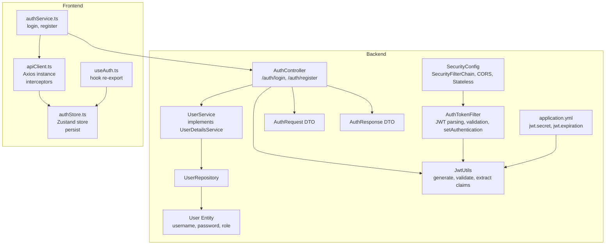
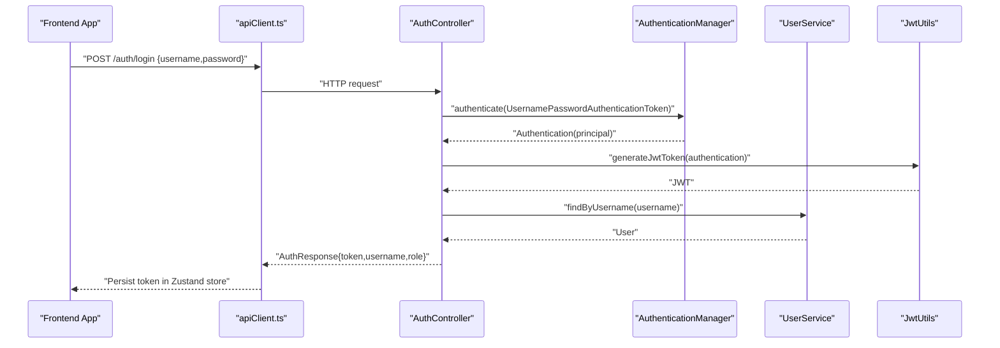
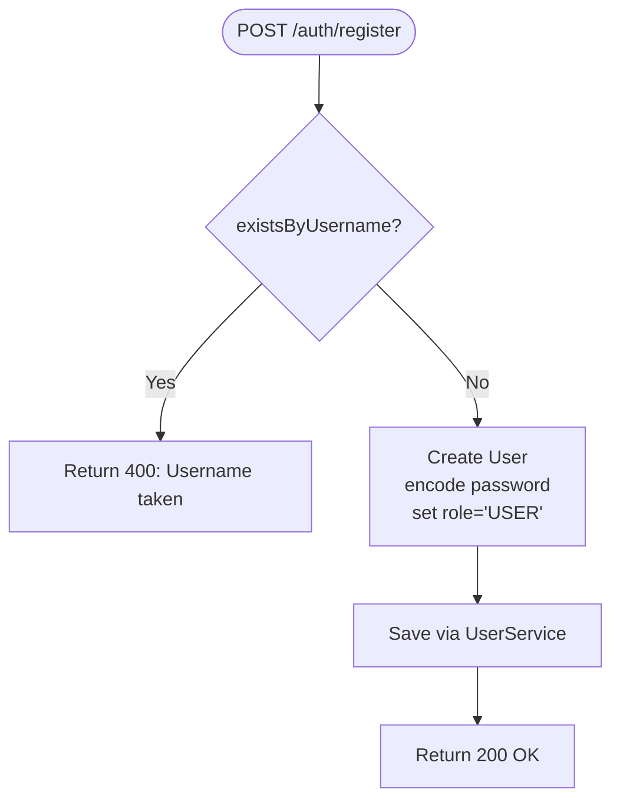
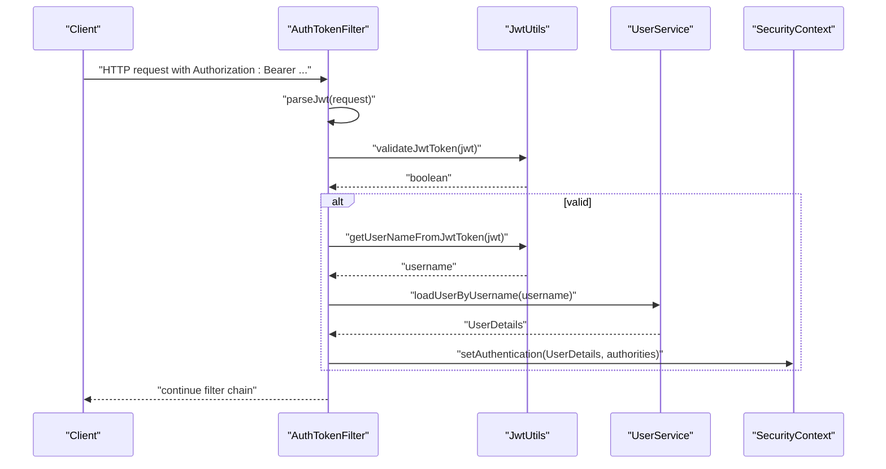
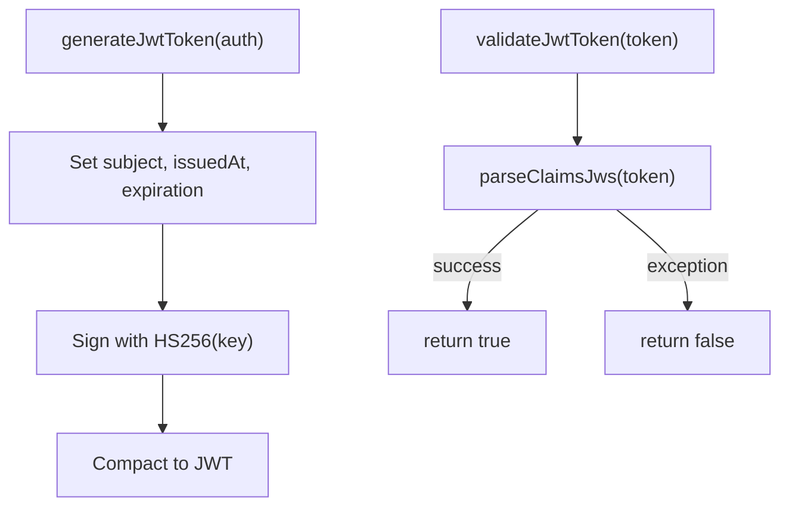
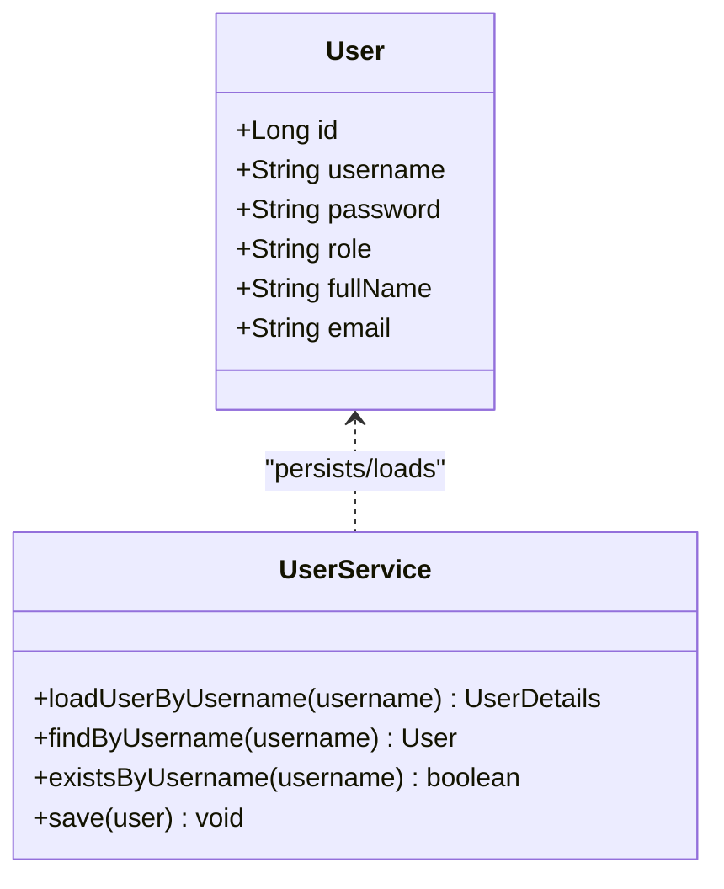
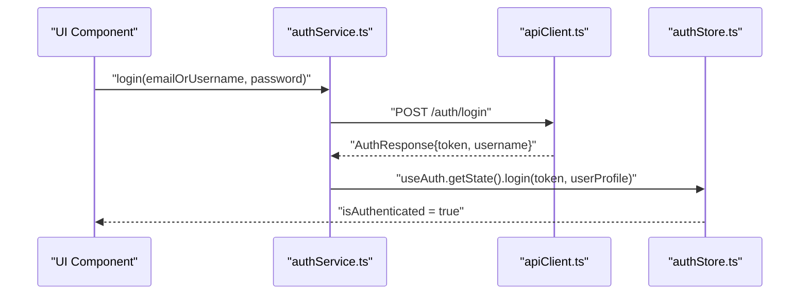
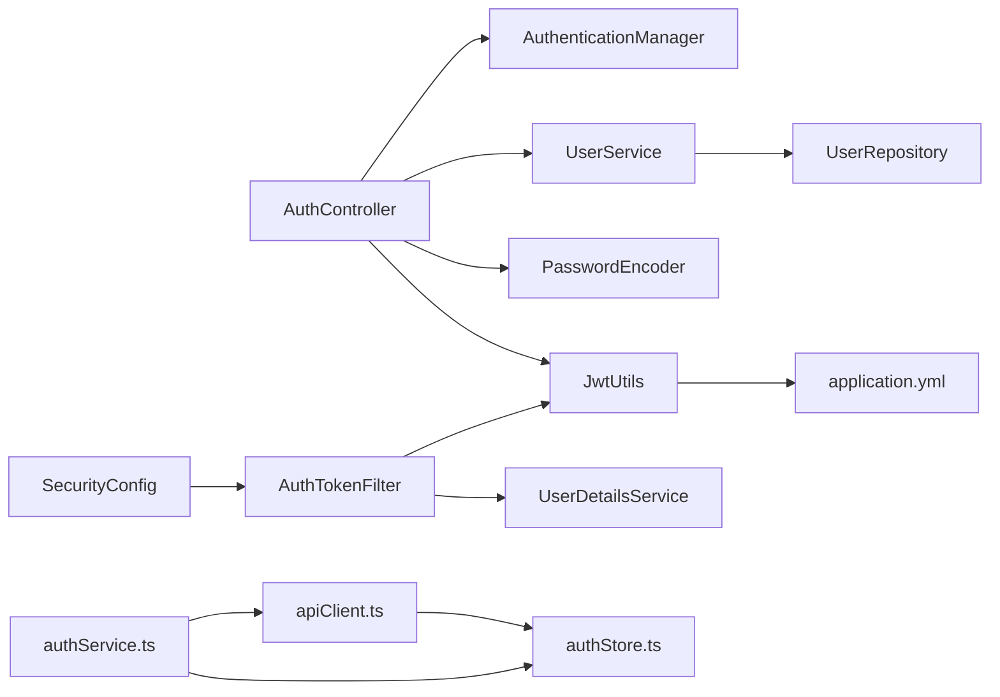

# User Authentication & Authorization

<cite>
**Referenced Files in This Document**
- [AuthController.java](file://backend-server/src/main/java/com/skyflow/controller/AuthController.java)
- [UserService.java](file://backend-server/src/main/java/com/skyflow/service/UserService.java)
- [SecurityConfig.java](file://backend-server/src/main/java/com/skyflow/config/SecurityConfig.java)
- [AuthTokenFilter.java](file://backend-server/src/main/java/com/skyflow/security/AuthTokenFilter.java)
- [JwtUtils.java](file://backend-server/src/main/java/com/skyflow/security/JwtUtils.java)
- [User.java](file://backend-server/src/main/java/com/skyflow/model/entity/User.java)
- [AuthRequest.java](file://backend-server/src/main/java/com/skyflow/model/dto/request/AuthRequest.java)
- [AuthResponse.java](file://backend-server/src/main/java/com/skyflow/model/dto/response/AuthResponse.java)
- [UserRepository.java](file://backend-server/src/main/java/com/skyflow/repository/UserRepository.java)
- [application.yml](file://backend-server/src/main/resources/application.yml)
- [UnauthorizedException.java](file://backend-server/src/main/java/com/skyflow/exception/UnauthorizedException.java)
- [Constants.java](file://backend-server/src/main/java/com/skyflow/util/Constants.java)
- [authService.ts](file://skyflow-pro/src/services/auth/authService.ts)
- [apiClient.ts](file://skyflow-pro/src/services/api/apiClient.ts)
- [authStore.ts](file://skyflow-pro/src/stores/authStore.ts)
- [useAuth.ts](file://skyflow-pro/src/hooks/useAuth.ts)
</cite>

## Table of Contents
1. [Introduction](#introduction)
2. [Project Structure](#project-structure)
3. [Core Components](#core-components)
4. [Architecture Overview](#architecture-overview)
5. [Detailed Component Analysis](#detailed-component-analysis)
6. [Dependency Analysis](#dependency-analysis)
7. [Performance Considerations](#performance-considerations)
8. [Troubleshooting Guide](#troubleshooting-guide)
9. [Conclusion](#conclusion)

## Introduction
This document explains the user authentication and authorization system implemented in the backend server and integrated frontend components. It covers the JWT-based authentication flow, user registration and login processes, session management, and security filter chain. It also documents the frontend authentication service, React hooks for authentication state, and the Zustand store for managing user sessions. Additional topics include user roles and permissions, password hashing, security best practices, integration patterns between frontend and backend, error handling, and token refresh mechanisms.

## Project Structure
The authentication system spans two primary areas:
- Backend (Spring Boot):
  - Controllers, services, repositories, security filters, JWT utilities, and configuration.
- Frontend (React + TypeScript):
  - Authentication service, API client with interceptors, Zustand store, and a re-exported hook.

**Diagram sources**
- [AuthController.java:17-57](file://backend-server/src/main/java/com/skyflow/controller/AuthController.java#L17-L57)
- [UserService.java:13-41](file://backend-server/src/main/java/com/skyflow/service/UserService.java#L13-L41)
- [UserRepository.java:7-11](file://backend-server/src/main/java/com/skyflow/repository/UserRepository.java#L7-L11)
- [SecurityConfig.java:20-80](file://backend-server/src/main/java/com/skyflow/config/SecurityConfig.java#L20-L80)
- [AuthTokenFilter.java:19-61](file://backend-server/src/main/java/com/skyflow/security/AuthTokenFilter.java#L19-L61)
- [JwtUtils.java:14-52](file://backend-server/src/main/java/com/skyflow/security/JwtUtils.java#L14-L52)
- [User.java:9-30](file://backend-server/src/main/java/com/skyflow/model/entity/User.java#L9-L30)
- [AuthRequest.java:5-9](file://backend-server/src/main/java/com/skyflow/model/dto/request/AuthRequest.java#L5-L9)
- [AuthResponse.java:6-12](file://backend-server/src/main/java/com/skyflow/model/dto/response/AuthResponse.java#L6-L12)
- [application.yml:26-29](file://backend-server/src/main/resources/application.yml#L26-L29)
- [authService.ts:12-37](file://skyflow-pro/src/services/auth/authService.ts#L12-L37)
- [apiClient.ts:4-37](file://skyflow-pro/src/services/api/apiClient.ts#L4-L37)
- [authStore.ts:45-89](file://skyflow-pro/src/stores/authStore.ts#L45-L89)
- [useAuth.ts:6-6](file://skyflow-pro/src/hooks/useAuth.ts#L6-L6)

**Section sources**
- [AuthController.java:17-57](file://backend-server/src/main/java/com/skyflow/controller/AuthController.java#L17-L57)
- [SecurityConfig.java:50-67](file://backend-server/src/main/java/com/skyflow/config/SecurityConfig.java#L50-L67)
- [apiClient.ts:4-37](file://skyflow-pro/src/services/api/apiClient.ts#L4-L37)
- [authStore.ts:45-89](file://skyflow-pro/src/stores/authStore.ts#L45-L89)

## Core Components
- Backend
  - AuthController: Exposes /auth/login and /auth/register endpoints. Authenticates via AuthenticationManager, generates JWT via JwtUtils, and returns AuthResponse.
  - UserService: Implements UserDetailsService for Spring Security, loads user by username, and persists users.
  - SecurityConfig: Defines stateless session policy, permits unauthenticated access to selected endpoints, registers AuthTokenFilter, and configures DAO provider with BCrypt.
  - AuthTokenFilter: Extracts Bearer token from Authorization header, validates JWT, loads UserDetails, and sets Authentication in SecurityContext.
  - JwtUtils: Generates signed JWT with HS256, validates tokens, and extracts subject (username).
  - User entity and repository: Persist username, password (BCrypt), role, and provide lookup by username.
  - application.yml: Provides JWT secret and expiration.
- Frontend
  - authService.ts: Calls backend /auth/login and /auth/register, then updates Zustand store with token and user profile.
  - apiClient.ts: Axios instance with request interceptor injecting Authorization: Bearer token and response interceptor auto-logout on 401.
  - authStore.ts: Zustand store with persistence to localStorage, tracks token, user profile, and authentication state.
  - useAuth.ts: Hook re-export for consistent API.

**Section sources**
- [AuthController.java:29-56](file://backend-server/src/main/java/com/skyflow/controller/AuthController.java#L29-L56)
- [UserService.java:19-40](file://backend-server/src/main/java/com/skyflow/service/UserService.java#L19-L40)
- [SecurityConfig.java:31-67](file://backend-server/src/main/java/com/skyflow/config/SecurityConfig.java#L31-L67)
- [AuthTokenFilter.java:28-50](file://backend-server/src/main/java/com/skyflow/security/AuthTokenFilter.java#L28-L50)
- [JwtUtils.java:23-51](file://backend-server/src/main/java/com/skyflow/security/JwtUtils.java#L23-L51)
- [User.java:18-26](file://backend-server/src/main/java/com/skyflow/model/entity/User.java#L18-L26)
- [application.yml:26-29](file://backend-server/src/main/resources/application.yml#L26-L29)
- [authService.ts:12-37](file://skyflow-pro/src/services/auth/authService.ts#L12-L37)
- [apiClient.ts:11-35](file://skyflow-pro/src/services/api/apiClient.ts#L11-L35)
- [authStore.ts:30-89](file://skyflow-pro/src/stores/authStore.ts#L30-L89)
- [useAuth.ts:6-6](file://skyflow-pro/src/hooks/useAuth.ts#L6-L6)

## Architecture Overview
The system enforces stateless JWT authentication:
- Clients send credentials to /auth/login, receive a signed JWT.
- Subsequent requests include Authorization: Bearer <token>.
- AuthTokenFilter validates the token and sets SecurityContext.
- Backend enforces method-level security and permits-list for public endpoints.

**Diagram sources**
- [AuthController.java:29-40](file://backend-server/src/main/java/com/skyflow/controller/AuthController.java#L29-L40)
- [JwtUtils.java:23-32](file://backend-server/src/main/java/com/skyflow/security/JwtUtils.java#L23-L32)
- [UserService.java:29-32](file://backend-server/src/main/java/com/skyflow/service/UserService.java#L29-L32)
- [apiClient.ts:11-23](file://skyflow-pro/src/services/api/apiClient.ts#L11-L23)
- [authService.ts:13-28](file://skyflow-pro/src/services/auth/authService.ts#L13-L28)

## Detailed Component Analysis

### Backend Authentication Controller
- Responsibilities:
  - Validate credentials against AuthenticationManager.
  - Generate JWT and return AuthResponse.
  - Register new users with encoded passwords and default role.
- Key behaviors:
  - /auth/login: Authenticate, set SecurityContext, generate JWT, fetch user, return token and role.
  - /auth/register: Check uniqueness, encode password, set default role, save user.

**Diagram sources**
- [AuthController.java:42-56](file://backend-server/src/main/java/com/skyflow/controller/AuthController.java#L42-L56)
- [UserService.java:34-40](file://backend-server/src/main/java/com/skyflow/service/UserService.java#L34-L40)

**Section sources**
- [AuthController.java:29-56](file://backend-server/src/main/java/com/skyflow/controller/AuthController.java#L29-L56)
- [AuthRequest.java:5-9](file://backend-server/src/main/java/com/skyflow/model/dto/request/AuthRequest.java#L5-L9)
- [AuthResponse.java:6-12](file://backend-server/src/main/java/com/skyflow/model/dto/response/AuthResponse.java#L6-L12)

### Backend Security Filter Chain and Token Validation
- Stateless session policy ensures no server-side session storage.
- AuthTokenFilter:
  - Parses Authorization header for Bearer token.
  - Validates JWT via JwtUtils.
  - Loads UserDetails via UserService and sets Authentication in SecurityContext.
- SecurityConfig:
  - Permits unauthenticated access to /auth/**, /cities/**, /flights/**, /h2-console/**, /chat/**.
  - Registers AuthTokenFilter before UsernamePasswordAuthenticationFilter.
  - Configures DAO provider with BCrypt.

**Diagram sources**
- [AuthTokenFilter.java:28-50](file://backend-server/src/main/java/com/skyflow/security/AuthTokenFilter.java#L28-L50)
- [JwtUtils.java:38-51](file://backend-server/src/main/java/com/skyflow/security/JwtUtils.java#L38-L51)
- [UserService.java:19-27](file://backend-server/src/main/java/com/skyflow/service/UserService.java#L19-L27)
- [SecurityConfig.java:50-67](file://backend-server/src/main/java/com/skyflow/config/SecurityConfig.java#L50-L67)

**Section sources**
- [SecurityConfig.java:50-67](file://backend-server/src/main/java/com/skyflow/config/SecurityConfig.java#L50-L67)
- [AuthTokenFilter.java:28-50](file://backend-server/src/main/java/com/skyflow/security/AuthTokenFilter.java#L28-L50)
- [JwtUtils.java:23-51](file://backend-server/src/main/java/com/skyflow/security/JwtUtils.java#L23-L51)
- [UserService.java:19-27](file://backend-server/src/main/java/com/skyflow/service/UserService.java#L19-L27)

### JWT Utilities and Token Lifecycle
- Generation:
  - Subject: username.
  - Issued at: current time.
  - Expiration: configured duration.
  - Signing: HS256 with base64-decoded secret from application.yml.
- Validation:
  - Parse and verify signature.
  - Extract subject (username) for downstream use.
- Configuration:
  - jwt.secret and jwt.expiration in application.yml.

**Diagram sources**
- [JwtUtils.java:23-51](file://backend-server/src/main/java/com/skyflow/security/JwtUtils.java#L23-L51)
- [application.yml:26-29](file://backend-server/src/main/resources/application.yml#L26-L29)

**Section sources**
- [JwtUtils.java:14-52](file://backend-server/src/main/java/com/skyflow/security/JwtUtils.java#L14-L52)
- [application.yml:26-29](file://backend-server/src/main/resources/application.yml#L26-L29)

### User Roles and Permissions
- Role field in User entity supports USER and ADMIN roles.
- Current UserService returns empty authorities collection for simplified setup.
- SecurityConfig enables method-level security; roles can be enforced with annotations on services/controllers.

**Diagram sources**
- [User.java:9-30](file://backend-server/src/main/java/com/skyflow/model/entity/User.java#L9-L30)
- [UserService.java:13-41](file://backend-server/src/main/java/com/skyflow/service/UserService.java#L13-L41)

**Section sources**
- [User.java:18-26](file://backend-server/src/main/java/com/skyflow/model/entity/User.java#L18-L26)
- [UserService.java:19-27](file://backend-server/src/main/java/com/skyflow/service/UserService.java#L19-L27)
- [SecurityConfig.java:22-22](file://backend-server/src/main/java/com/skyflow/config/SecurityConfig.java#L22-L22)

### Password Hashing
- Backend uses BCryptPasswordEncoder for encoding passwords during registration.
- PasswordEncoder bean is configured in SecurityConfig.
- Stored passwords are hashed; authentication compares provided plaintext against encoded stored value.

**Section sources**
- [SecurityConfig.java:44-47](file://backend-server/src/main/java/com/skyflow/config/SecurityConfig.java#L44-L47)
- [AuthController.java:49-50](file://backend-server/src/main/java/com/skyflow/controller/AuthController.java#L49-L50)
- [User.java:21-23](file://backend-server/src/main/java/com/skyflow/model/entity/User.java#L21-L23)

### Frontend Authentication Service and State Management
- authService.ts:
  - login: posts credentials to /auth/login, constructs a minimal UserProfile, and invokes Zustand store login.
  - register: posts to /auth/register.
- apiClient.ts:
  - Request interceptor: adds Authorization: Bearer <token> when present.
  - Response interceptor: auto-logout on 401 Unauthorized.
- authStore.ts (Zustand):
  - Tracks token, user profile, isAuthenticated, and booking history.
  - Persists state to localStorage under name "skyflow-auth".
- useAuth.ts: Re-exports the Zustand store hook for consistent consumption.

**Diagram sources**
- [authService.ts:13-28](file://skyflow-pro/src/services/auth/authService.ts#L13-L28)
- [apiClient.ts:11-23](file://skyflow-pro/src/services/api/apiClient.ts#L11-L23)
- [authStore.ts:53-59](file://skyflow-pro/src/stores/authStore.ts#L53-L59)

**Section sources**
- [authService.ts:12-37](file://skyflow-pro/src/services/auth/authService.ts#L12-L37)
- [apiClient.ts:11-35](file://skyflow-pro/src/services/api/apiClient.ts#L11-L35)
- [authStore.ts:30-89](file://skyflow-pro/src/stores/authStore.ts#L30-L89)
- [useAuth.ts:6-6](file://skyflow-pro/src/hooks/useAuth.ts#L6-L6)

### Token Refresh Mechanisms
- Current implementation does not include a dedicated token refresh endpoint or automatic refresh logic.
- Recommendations:
  - Introduce a /auth/refresh endpoint that accepts a valid refresh token and issues a new JWT.
  - Implement a refresh token storage strategy (secure HTTP-only cookie or short-lived JWT).
  - Frontend should intercept 401 responses and attempt refresh before prompting re-login.

[No sources needed since this section provides general guidance]

## Dependency Analysis
- Backend
  - AuthController depends on AuthenticationManager, UserService, PasswordEncoder, and JwtUtils.
  - UserService depends on UserRepository and returns UserDetails for Spring Security.
  - SecurityConfig wires AuthTokenFilter and configures stateless sessions and DAO provider.
  - AuthTokenFilter depends on JwtUtils and UserDetailsService.
  - JwtUtils depends on application.yml for jwt.secret and jwt.expiration.
- Frontend
  - authService.ts depends on apiClient.ts and authStore.ts.
  - apiClient.ts depends on authStore.ts for token retrieval and auto-logout.
  - authStore.ts is independent but integrates with components via useAuth.ts.

**Diagram sources**
- [AuthController.java:20-27](file://backend-server/src/main/java/com/skyflow/controller/AuthController.java#L20-L27)
- [UserService.java:16-17](file://backend-server/src/main/java/com/skyflow/service/UserService.java#L16-L17)
- [SecurityConfig.java:29-47](file://backend-server/src/main/java/com/skyflow/config/SecurityConfig.java#L29-L47)
- [AuthTokenFilter.java:22-26](file://backend-server/src/main/java/com/skyflow/security/AuthTokenFilter.java#L22-L26)
- [JwtUtils.java:17-21](file://backend-server/src/main/java/com/skyflow/security/JwtUtils.java#L17-L21)
- [application.yml:26-29](file://backend-server/src/main/resources/application.yml#L26-L29)
- [authService.ts:1-10](file://skyflow-pro/src/services/auth/authService.ts#L1-L10)
- [apiClient.ts:1-9](file://skyflow-pro/src/services/api/apiClient.ts#L1-L9)
- [authStore.ts:1-10](file://skyflow-pro/src/stores/authStore.ts#L1-L10)

**Section sources**
- [AuthController.java:20-27](file://backend-server/src/main/java/com/skyflow/controller/AuthController.java#L20-L27)
- [UserService.java:16-17](file://backend-server/src/main/java/com/skyflow/service/UserService.java#L16-L17)
- [SecurityConfig.java:31-67](file://backend-server/src/main/java/com/skyflow/config/SecurityConfig.java#L31-L67)
- [AuthTokenFilter.java:22-26](file://backend-server/src/main/java/com/skyflow/security/AuthTokenFilter.java#L22-L26)
- [JwtUtils.java:17-21](file://backend-server/src/main/java/com/skyflow/security/JwtUtils.java#L17-L21)
- [application.yml:26-29](file://backend-server/src/main/resources/application.yml#L26-L29)
- [authService.ts:1-10](file://skyflow-pro/src/services/auth/authService.ts#L1-L10)
- [apiClient.ts:1-9](file://skyflow-pro/src/services/api/apiClient.ts#L1-L9)
- [authStore.ts:1-10](file://skyflow-pro/src/stores/authStore.ts#L1-L10)

## Performance Considerations
- Stateless JWT eliminates server-side session storage overhead.
- Ensure JWT expiration is reasonable to balance security and UX.
- Minimize unnecessary database lookups by caching frequently accessed user metadata per session lifecycle.
- Use efficient password encoders (BCrypt) and avoid synchronous blocking operations in filters.

[No sources needed since this section provides general guidance]

## Troubleshooting Guide
- 401 Unauthorized responses:
  - Backend: Verify Authorization header format and token validity.
  - Frontend: apiClient.ts automatically logs out on 401; confirm token presence and expiry.
- Username already taken:
  - Registration endpoint returns 400 when username exists; surface user-friendly messages.
- Token parsing failures:
  - AuthTokenFilter catches exceptions and continues; check Authorization header and Bearer prefix.
- JWT validation errors:
  - JwtUtils.validateJwtToken returns false on exceptions; confirm jwt.secret and expiration alignment.
- Role-based access:
  - Current authorities are empty; annotate services/controllers with method-level security and populate authorities.

**Section sources**
- [apiClient.ts:25-35](file://skyflow-pro/src/services/api/apiClient.ts#L25-L35)
- [AuthController.java:44-46](file://backend-server/src/main/java/com/skyflow/controller/AuthController.java#L44-L46)
- [AuthTokenFilter.java:45-47](file://backend-server/src/main/java/com/skyflow/security/AuthTokenFilter.java#L45-L47)
- [JwtUtils.java:43-51](file://backend-server/src/main/java/com/skyflow/security/JwtUtils.java#L43-L51)
- [UnauthorizedException.java:6-15](file://backend-server/src/main/java/com/skyflow/exception/UnauthorizedException.java#L6-L15)
- [Constants.java:8-9](file://backend-server/src/main/java/com/skyflow/util/Constants.java#L8-L9)

## Conclusion
The system implements a robust, stateless JWT-based authentication flow with clear separation of concerns between backend and frontend. The backend enforces secure, permit-listed access and validates tokens centrally, while the frontend manages session state via a persistent Zustand store and Axios interceptors. Enhancements such as role-based authorities, token refresh, and stricter error messaging would further strengthen the solution.