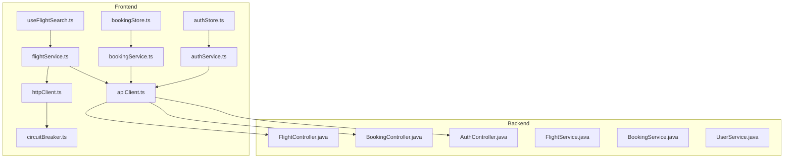
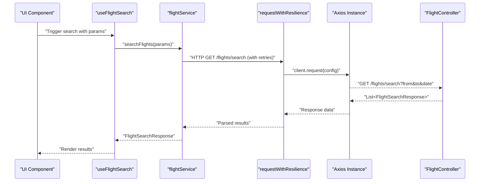
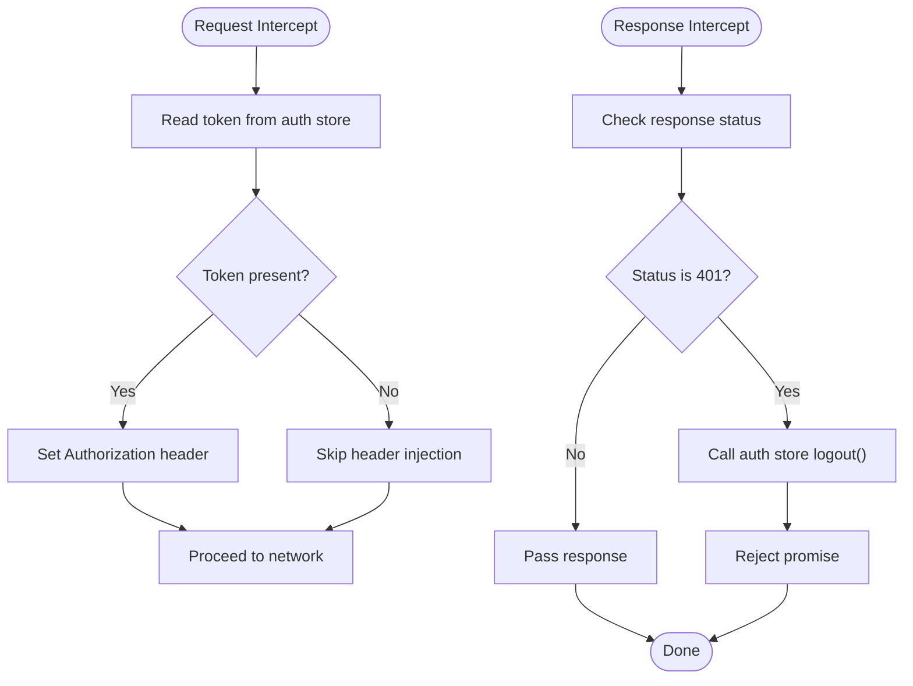
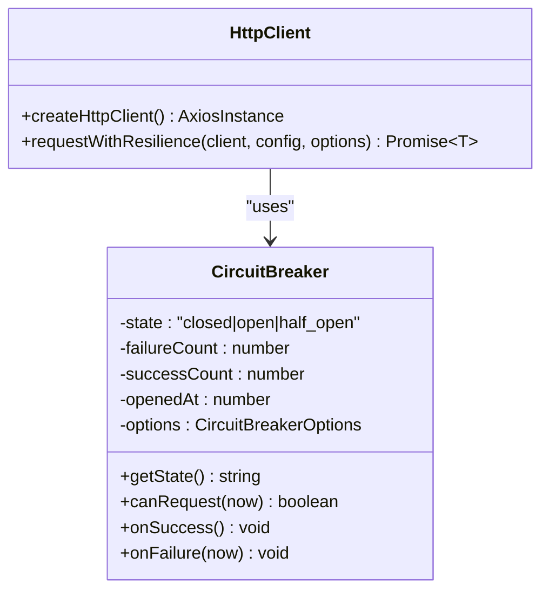
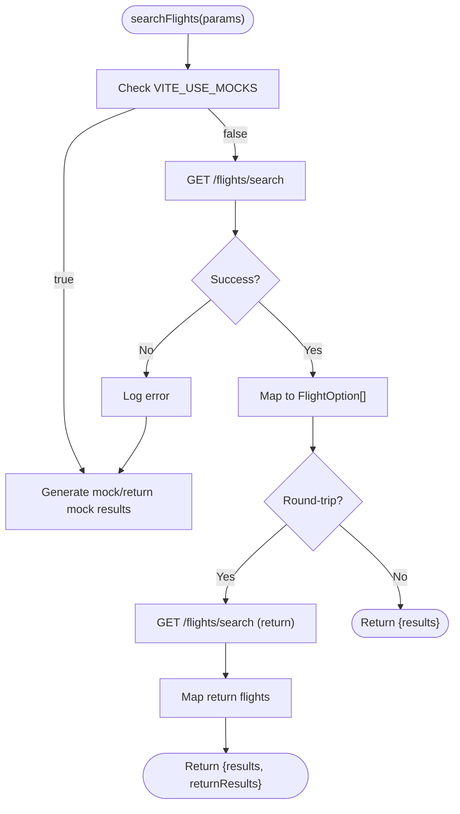
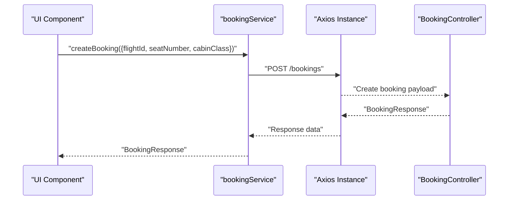
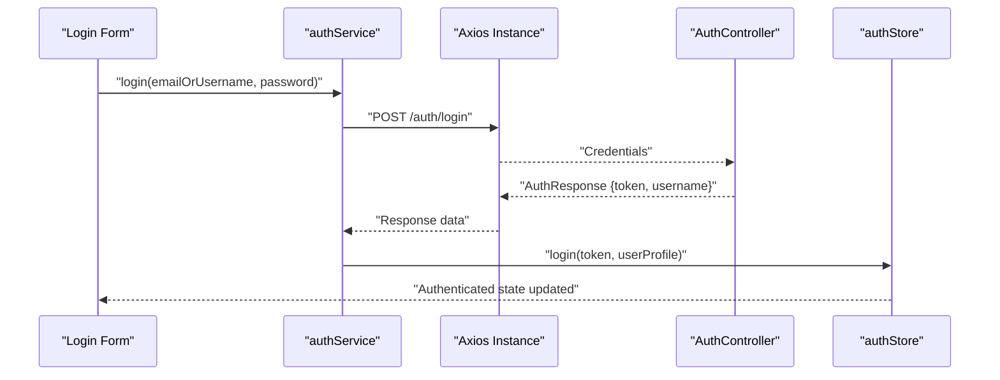
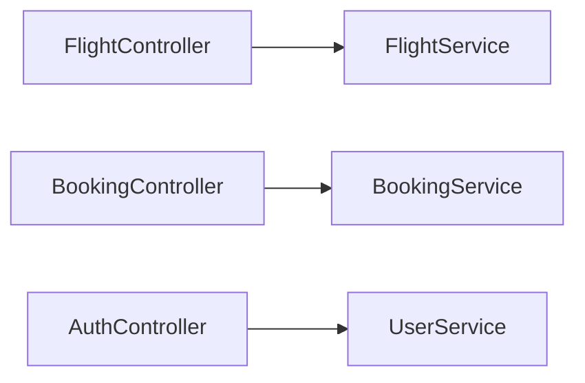
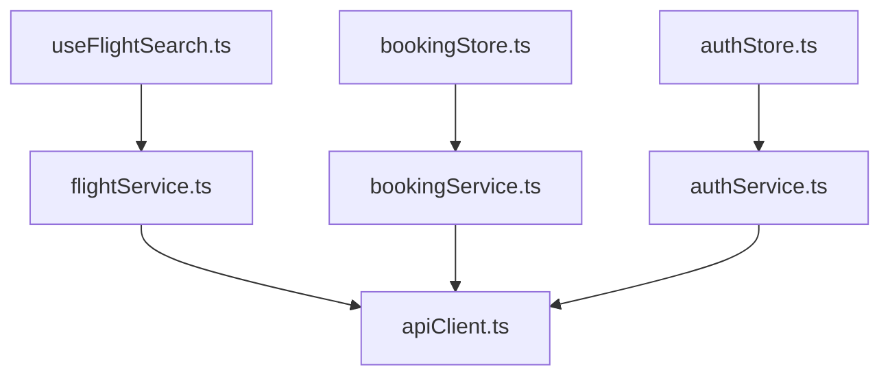
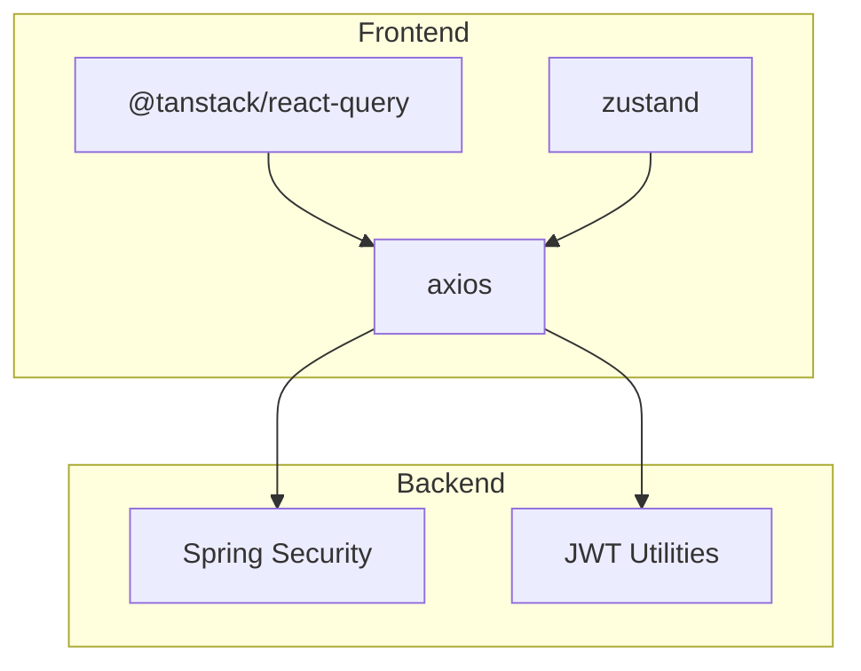

# API Integration Layer

<cite>
**Referenced Files in This Document**
- [apiClient.ts](file://skyflow-pro/src/services/api/apiClient.ts)
- [httpClient.ts](file://skyflow-pro/src/services/api/httpClient.ts)
- [circuitBreaker.ts](file://skyflow-pro/src/services/api/circuitBreaker.ts)
- [flightService.ts](file://skyflow-pro/src/services/flights/flightService.ts)
- [bookingService.ts](file://skyflow-pro/src/services/bookings/bookingService.ts)
- [authService.ts](file://skyflow-pro/src/services/auth/authService.ts)
- [AuthController.java](file://backend-server/src/main/java/com/skyflow/controller/AuthController.java)
- [FlightController.java](file://backend-server/src/main/java/com/skyflow/controller/FlightController.java)
- [BookingController.java](file://backend-server/src/main/java/com/skyflow/controller/BookingController.java)
- [FlightService.java](file://backend-server/src/main/java/com/skyflow/service/FlightService.java)
- [BookingService.java](file://backend-server/src/main/java/com/skyflow/service/BookingService.java)
- [UserService.java](file://backend-server/src/main/java/com/skyflow/service/UserService.java)
- [authStore.ts](file://skyflow-pro/src/stores/authStore.ts)
- [bookingStore.ts](file://skyflow-pro/src/stores/bookingStore.ts)
- [mockSearchResults.ts](file://skyflow-pro/src/mocks/mockSearchResults.ts)
- [flightGenerator.ts](file://skyflow-pro/src/services/flights/flightGenerator.ts)
- [useFlightSearch.ts](file://skyflow-pro/src/hooks/useFlightSearch.ts)
- [package.json](file://skyflow-pro/package.json)
</cite>

## Table of Contents
1. [Introduction](#introduction)
2. [Project Structure](#project-structure)
3. [Core Components](#core-components)
4. [Architecture Overview](#architecture-overview)
5. [Detailed Component Analysis](#detailed-component-analysis)
6. [Dependency Analysis](#dependency-analysis)
7. [Performance Considerations](#performance-considerations)
8. [Troubleshooting Guide](#troubleshooting-guide)
9. [Conclusion](#conclusion)
10. [Appendices](#appendices)

## Introduction
This document describes the API integration architecture and service layer for the frontend React application. It covers the axios-based HTTP client configuration, request/response interceptors, and error handling strategies. It also documents service abstractions for flights, bookings, and user management, along with authentication token handling, retry mechanisms, and circuit breaker patterns. The document includes examples of API service usage, mock data integration, offline fallback strategies, API versioning considerations, rate limiting, performance optimization techniques, testing strategies, and integration patterns with frontend state management.

## Project Structure
The API integration layer is primarily implemented in the frontend under skyflow-pro/src/services and skyflow-pro/src/stores. The backend exposes REST endpoints under backend-server/src/main/java/com/skyflow/controller. The frontend integrates with React Query for caching and state, Zustand for local state, and axios for HTTP requests.

**Diagram sources**
- [flightService.ts:1-128](file://skyflow-pro/src/services/flights/flightService.ts#L1-L128)
- [bookingService.ts:1-39](file://skyflow-pro/src/services/bookings/bookingService.ts#L1-L39)
- [authService.ts:1-38](file://skyflow-pro/src/services/auth/authService.ts#L1-L38)
- [apiClient.ts:1-38](file://skyflow-pro/src/services/api/apiClient.ts#L1-L38)
- [httpClient.ts:1-82](file://skyflow-pro/src/services/api/httpClient.ts#L1-L82)
- [circuitBreaker.ts:1-62](file://skyflow-pro/src/services/api/circuitBreaker.ts#L1-L62)
- [authStore.ts:1-123](file://skyflow-pro/src/stores/authStore.ts#L1-L123)
- [bookingStore.ts:1-115](file://skyflow-pro/src/stores/bookingStore.ts#L1-L115)
- [useFlightSearch.ts:1-12](file://skyflow-pro/src/hooks/useFlightSearch.ts#L1-L12)
- [FlightController.java:1-50](file://backend-server/src/main/java/com/skyflow/controller/FlightController.java#L1-L50)
- [BookingController.java:1-89](file://backend-server/src/main/java/com/skyflow/controller/BookingController.java#L1-L89)
- [AuthController.java:1-58](file://backend-server/src/main/java/com/skyflow/controller/AuthController.java#L1-L58)
- [FlightService.java:1-206](file://backend-server/src/main/java/com/skyflow/service/FlightService.java#L1-L206)
- [BookingService.java:1-148](file://backend-server/src/main/java/com/skyflow/service/BookingService.java#L1-L148)
- [UserService.java:1-42](file://backend-server/src/main/java/com/skyflow/service/UserService.java#L1-L42)

**Section sources**
- [flightService.ts:1-128](file://skyflow-pro/src/services/flights/flightService.ts#L1-L128)
- [bookingService.ts:1-39](file://skyflow-pro/src/services/bookings/bookingService.ts#L1-L39)
- [authService.ts:1-38](file://skyflow-pro/src/services/auth/authService.ts#L1-L38)
- [apiClient.ts:1-38](file://skyflow-pro/src/services/api/apiClient.ts#L1-L38)
- [httpClient.ts:1-82](file://skyflow-pro/src/services/api/httpClient.ts#L1-L82)
- [circuitBreaker.ts:1-62](file://skyflow-pro/src/services/api/circuitBreaker.ts#L1-L62)
- [authStore.ts:1-123](file://skyflow-pro/src/stores/authStore.ts#L1-L123)
- [bookingStore.ts:1-115](file://skyflow-pro/src/stores/bookingStore.ts#L1-L115)
- [useFlightSearch.ts:1-12](file://skyflow-pro/src/hooks/useFlightSearch.ts#L1-L12)
- [FlightController.java:1-50](file://backend-server/src/main/java/com/skyflow/controller/FlightController.java#L1-L50)
- [BookingController.java:1-89](file://backend-server/src/main/java/com/skyflow/controller/BookingController.java#L1-L89)
- [AuthController.java:1-58](file://backend-server/src/main/java/com/skyflow/controller/AuthController.java#L1-L58)
- [FlightService.java:1-206](file://backend-server/src/main/java/com/skyflow/service/FlightService.java#L1-L206)
- [BookingService.java:1-148](file://backend-server/src/main/java/com/skyflow/service/BookingService.java#L1-L148)
- [UserService.java:1-42](file://backend-server/src/main/java/com/skyflow/service/UserService.java#L1-L42)

## Core Components
- HTTP client configuration and interceptors:
  - Central axios instance with base URL and JSON headers.
  - Request interceptor injects Authorization header from Zustand auth store.
  - Response interceptor handles 401 Unauthorized by triggering logout.
- Resilient HTTP client with retry and circuit breaker:
  - Exponential backoff with jitter and capped delay.
  - Circuit breaker with configurable thresholds and open timeout.
  - Fallback handler support for offline or degraded scenarios.
- Service abstractions:
  - Flight search service with mock fallback and backend integration.
  - Booking service for creation, retrieval, and cancellation.
  - Authentication service for login and registration.
- Frontend state management:
  - Auth store persists token and user profile.
  - Booking store manages loading, errors, and offline booking generation.
  - React Query hook for caching and invalidation of flight search queries.
- Mock data and generators:
  - Static mock search results and dynamic flight generator for realistic data.

**Section sources**
- [apiClient.ts:1-38](file://skyflow-pro/src/services/api/apiClient.ts#L1-L38)
- [httpClient.ts:1-82](file://skyflow-pro/src/services/api/httpClient.ts#L1-L82)
- [circuitBreaker.ts:1-62](file://skyflow-pro/src/services/api/circuitBreaker.ts#L1-L62)
- [flightService.ts:1-128](file://skyflow-pro/src/services/flights/flightService.ts#L1-L128)
- [bookingService.ts:1-39](file://skyflow-pro/src/services/bookings/bookingService.ts#L1-L39)
- [authService.ts:1-38](file://skyflow-pro/src/services/auth/authService.ts#L1-L38)
- [authStore.ts:1-123](file://skyflow-pro/src/stores/authStore.ts#L1-L123)
- [bookingStore.ts:1-115](file://skyflow-pro/src/stores/bookingStore.ts#L1-L115)
- [useFlightSearch.ts:1-12](file://skyflow-pro/src/hooks/useFlightSearch.ts#L1-L12)
- [mockSearchResults.ts:1-313](file://skyflow-pro/src/mocks/mockSearchResults.ts#L1-L313)
- [flightGenerator.ts:1-325](file://skyflow-pro/src/services/flights/flightGenerator.ts#L1-L325)

## Architecture Overview
The frontend API layer composes a resilient HTTP client with interceptors and a circuit breaker. Services encapsulate domain operations and integrate with React Query and Zustand. The backend exposes REST endpoints secured by Spring Security and JWT utilities.

**Diagram sources**
- [useFlightSearch.ts:1-12](file://skyflow-pro/src/hooks/useFlightSearch.ts#L1-L12)
- [flightService.ts:1-128](file://skyflow-pro/src/services/flights/flightService.ts#L1-L128)
- [httpClient.ts:52-80](file://skyflow-pro/src/services/api/httpClient.ts#L52-L80)
- [FlightController.java:29-35](file://backend-server/src/main/java/com/skyflow/controller/FlightController.java#L29-L35)

**Section sources**
- [flightService.ts:31-125](file://skyflow-pro/src/services/flights/flightService.ts#L31-L125)
- [httpClient.ts:52-80](file://skyflow-pro/src/services/api/httpClient.ts#L52-L80)
- [FlightController.java:29-35](file://backend-server/src/main/java/com/skyflow/controller/FlightController.java#L29-L35)

## Detailed Component Analysis

### HTTP Client and Interceptors
- Base configuration:
  - Base URL from environment variable with sensible default.
  - JSON content-type header.
- Request interceptor:
  - Reads token from Zustand auth store and attaches Authorization header.
- Response interceptor:
  - On 401 Unauthorized, triggers logout via auth store.

**Diagram sources**
- [apiClient.ts:11-35](file://skyflow-pro/src/services/api/apiClient.ts#L11-L35)
- [authStore.ts:61-68](file://skyflow-pro/src/stores/authStore.ts#L61-L68)

**Section sources**
- [apiClient.ts:4-35](file://skyflow-pro/src/services/api/apiClient.ts#L4-L35)
- [authStore.ts:30-89](file://skyflow-pro/src/stores/authStore.ts#L30-L89)

### Resilient HTTP Client and Circuit Breaker
- Resilient request options:
  - retries: number of attempts.
  - breakerKey: identifies a breaker instance per endpoint or resource.
  - fallback: optional function invoked when circuit is open or retries exhausted.
- Backoff strategy:
  - Exponential backoff with jitter and cap.
- Circuit breaker:
  - States: closed, open, half_open.
  - Thresholds: failureThreshold and successThreshold.
  - Open timeout controls half-open probing.

**Diagram sources**
- [circuitBreaker.ts:9-60](file://skyflow-pro/src/services/api/circuitBreaker.ts#L9-L60)
- [httpClient.ts:37-80](file://skyflow-pro/src/services/api/httpClient.ts#L37-L80)

**Section sources**
- [httpClient.ts:17-80](file://skyflow-pro/src/services/api/httpClient.ts#L17-L80)
- [circuitBreaker.ts:1-62](file://skyflow-pro/src/services/api/circuitBreaker.ts#L1-L62)

### Flight Service
- Responsibilities:
  - Build query parameters and call backend search endpoint.
  - Map backend DTOs to frontend FlightOption model.
  - Support round-trip search by issuing two requests.
  - Fallback to mock data or generated results when backend fails or mock mode is enabled.
- Mock integration:
  - Environment flag toggles mock usage.
  - Static mock list and dynamic generator provide realistic alternatives.

**Diagram sources**
- [flightService.ts:31-125](file://skyflow-pro/src/services/flights/flightService.ts#L31-L125)
- [mockSearchResults.ts:1-313](file://skyflow-pro/src/mocks/mockSearchResults.ts#L1-L313)
- [flightGenerator.ts:274-324](file://skyflow-pro/src/services/flights/flightGenerator.ts#L274-L324)

**Section sources**
- [flightService.ts:31-125](file://skyflow-pro/src/services/flights/flightService.ts#L31-L125)
- [mockSearchResults.ts:1-313](file://skyflow-pro/src/mocks/mockSearchResults.ts#L1-L313)
- [flightGenerator.ts:1-325](file://skyflow-pro/src/services/flights/flightGenerator.ts#L1-L325)

### Booking Service
- Endpoints:
  - POST /bookings with flightId, seatNumber, seatClass.
  - GET /bookings/my-bookings.
  - POST /bookings/cancel/{id}.
- Payload mapping:
  - Maps frontend cabinClass to backend seatClass.
- Error handling:
  - Propagates backend errors to caller for UI display.

**Diagram sources**
- [bookingService.ts:19-37](file://skyflow-pro/src/services/bookings/bookingService.ts#L19-L37)
- [BookingController.java:21-70](file://backend-server/src/main/java/com/skyflow/controller/BookingController.java#L21-L70)

**Section sources**
- [bookingService.ts:1-39](file://skyflow-pro/src/services/bookings/bookingService.ts#L1-L39)
- [BookingController.java:21-87](file://backend-server/src/main/java/com/skyflow/controller/BookingController.java#L21-L87)

### Authentication Service
- Login:
  - Posts credentials to /auth/login.
  - Extracts token and constructs user profile.
  - Invokes auth store login to persist token and user info.
- Registration:
  - Posts to /auth/register.
- Profile:
  - Optional synchronization method placeholder.

**Diagram sources**
- [authService.ts:12-28](file://skyflow-pro/src/services/auth/authService.ts#L12-L28)
- [AuthController.java:29-40](file://backend-server/src/main/java/com/skyflow/controller/AuthController.java#L29-L40)
- [authStore.ts:53-58](file://skyflow-pro/src/stores/authStore.ts#L53-L58)

**Section sources**
- [authService.ts:1-38](file://skyflow-pro/src/services/auth/authService.ts#L1-L38)
- [AuthController.java:29-56](file://backend-server/src/main/java/com/skyflow/controller/AuthController.java#L29-L56)
- [authStore.ts:30-89](file://skyflow-pro/src/stores/authStore.ts#L30-L89)

### Backend Controllers and Services
- FlightController:
  - GET /flights/search delegates to FlightService.
  - GET /flights/{id}/fare-breakdown computes fare breakdown.
- BookingController:
  - POST /bookings validates payload and delegates to BookingService.
  - GET /bookings/my-bookings lists user bookings.
  - POST /bookings/cancel/{id} cancels booking.
- FlightService (backend):
  - Maps database entities to DTOs, applies class multipliers, seat charges, and surge pricing.
- BookingService (backend):
  - Creates bookings, updates seat availability, calculates total amounts, and emits notifications.

**Diagram sources**
- [FlightController.java:29-48](file://backend-server/src/main/java/com/skyflow/controller/FlightController.java#L29-L48)
- [BookingController.java:21-87](file://backend-server/src/main/java/com/skyflow/controller/BookingController.java#L21-L87)
- [FlightService.java:68-102](file://backend-server/src/main/java/com/skyflow/service/FlightService.java#L68-L102)
- [BookingService.java:43-98](file://backend-server/src/main/java/com/skyflow/service/BookingService.java#L43-L98)
- [UserService.java:19-40](file://backend-server/src/main/java/com/skyflow/service/UserService.java#L19-L40)

**Section sources**
- [FlightController.java:1-50](file://backend-server/src/main/java/com/skyflow/controller/FlightController.java#L1-L50)
- [BookingController.java:1-89](file://backend-server/src/main/java/com/skyflow/controller/BookingController.java#L1-L89)
- [FlightService.java:1-206](file://backend-server/src/main/java/com/skyflow/service/FlightService.java#L1-L206)
- [BookingService.java:1-148](file://backend-server/src/main/java/com/skyflow/service/BookingService.java#L1-L148)
- [UserService.java:1-42](file://backend-server/src/main/java/com/skyflow/service/UserService.java#L1-L42)

### Frontend State Management Integration
- Auth store:
  - Persists token and user profile to local storage.
  - Provides login/logout actions and booking history management.
- Booking store:
  - Integrates with bookingService for create/fetch/cancel.
  - Supports offline booking generation with deterministic PNR.
  - Manages loading and error states.
- React Query:
  - useFlightSearch caches search results keyed by parameters.
  - Enables automatic refetching and background updates.

**Diagram sources**
- [authStore.ts:45-89](file://skyflow-pro/src/stores/authStore.ts#L45-L89)
- [bookingStore.ts:43-113](file://skyflow-pro/src/stores/bookingStore.ts#L43-L113)
- [useFlightSearch.ts:4-9](file://skyflow-pro/src/hooks/useFlightSearch.ts#L4-L9)
- [flightService.ts:31-125](file://skyflow-pro/src/services/flights/flightService.ts#L31-L125)
- [bookingService.ts:19-37](file://skyflow-pro/src/services/bookings/bookingService.ts#L19-L37)
- [authService.ts:12-28](file://skyflow-pro/src/services/auth/authService.ts#L12-L28)
- [apiClient.ts:11-35](file://skyflow-pro/src/services/api/apiClient.ts#L11-L35)

**Section sources**
- [authStore.ts:1-123](file://skyflow-pro/src/stores/authStore.ts#L1-L123)
- [bookingStore.ts:1-115](file://skyflow-pro/src/stores/bookingStore.ts#L1-L115)
- [useFlightSearch.ts:1-12](file://skyflow-pro/src/hooks/useFlightSearch.ts#L1-L12)
- [flightService.ts:31-125](file://skyflow-pro/src/services/flights/flightService.ts#L31-L125)
- [bookingService.ts:1-39](file://skyflow-pro/src/services/bookings/bookingService.ts#L1-L39)
- [authService.ts:1-38](file://skyflow-pro/src/services/auth/authService.ts#L1-L38)
- [apiClient.ts:1-38](file://skyflow-pro/src/services/api/apiClient.ts#L1-L38)

## Dependency Analysis
- Frontend dependencies:
  - axios for HTTP requests.
  - @tanstack/react-query for caching and background fetching.
  - zustand for local state management.
- Backend dependencies:
  - Spring Security for authentication and authorization.
  - JWT utilities for token generation and validation.

**Diagram sources**
- [package.json:15-23](file://skyflow-pro/package.json#L15-L23)
- [AuthController.java:6-27](file://backend-server/src/main/java/com/skyflow/controller/AuthController.java#L6-L27)

**Section sources**
- [package.json:1-46](file://skyflow-pro/package.json#L1-L46)
- [AuthController.java:1-58](file://backend-server/src/main/java/com/skyflow/controller/AuthController.java#L1-L58)

## Performance Considerations
- Caching:
  - React Query cache keys include search parameters to avoid redundant requests.
- Retry and backoff:
  - Exponential backoff with jitter reduces thundering herd and improves recovery.
- Circuit breaker:
  - Prevents cascading failures by isolating failing endpoints.
- Timeout:
  - Axios timeout configured to fail fast on slow networks.
- Offline fallback:
  - Mock and generated data reduce perceived latency and improve resilience.
- Rate limiting:
  - Implement client-side throttling or queueing for high-frequency operations.
- API versioning:
  - Use a versioned base URL or Accept-Version header to manage breaking changes.
- Compression and gzip:
  - Enable compression on the backend to reduce payload sizes.

[No sources needed since this section provides general guidance]

## Troubleshooting Guide
- 401 Unauthorized:
  - The response interceptor triggers logout automatically. Verify token validity and refresh logic.
- Network timeouts:
  - Increase axios timeout or enable retry with backoff for transient failures.
- Circuit breaker open:
  - Monitor breaker state and adjust thresholds. Consider providing meaningful fallback UI.
- Booking failures:
  - Backend returns explicit messages for missing fields, invalid IDs, and availability issues. Surface these to the user.
- Mock vs. real data:
  - Toggle VITE_USE_MOCKS to compare behavior and isolate backend issues.

**Section sources**
- [apiClient.ts:25-35](file://skyflow-pro/src/services/api/apiClient.ts#L25-L35)
- [httpClient.ts:52-80](file://skyflow-pro/src/services/api/httpClient.ts#L52-L80)
- [circuitBreaker.ts:24-36](file://skyflow-pro/src/services/api/circuitBreaker.ts#L24-L36)
- [BookingController.java:33-69](file://backend-server/src/main/java/com/skyflow/controller/BookingController.java#L33-L69)

## Conclusion
The API integration layer combines a robust axios client with interceptors, a resilient HTTP client featuring retry and circuit breaker logic, and cohesive service abstractions for flights, bookings, and authentication. Frontend state management via Zustand and React Query ensures efficient caching, offline capabilities, and responsive UX. The backend provides secure, well-structured endpoints with clear error handling and business logic for flight search and booking workflows.

[No sources needed since this section summarizes without analyzing specific files]

## Appendices

### API Endpoints and Contracts
- Authentication
  - POST /auth/login: Expects username/password; returns token and user info.
  - POST /auth/register: Expects user registration data.
- Flights
  - GET /flights/search: Query params from, to, date; returns list of flights.
  - GET /flights/{id}/fare-breakdown: Query params class, seatType; returns fare breakdown.
- Bookings
  - POST /bookings: Payload includes flightId, seatNumber, seatClass.
  - GET /bookings/my-bookings: Returns user’s bookings.
  - POST /bookings/cancel/{id}: Cancels a booking.

**Section sources**
- [AuthController.java:29-56](file://backend-server/src/main/java/com/skyflow/controller/AuthController.java#L29-L56)
- [FlightController.java:29-48](file://backend-server/src/main/java/com/skyflow/controller/FlightController.java#L29-L48)
- [BookingController.java:21-87](file://backend-server/src/main/java/com/skyflow/controller/BookingController.java#L21-L87)

### Testing Strategies
- Unit tests:
  - Test service functions in isolation using mocked axios instances.
  - Validate retry and circuit breaker behavior with controlled failure scenarios.
- Integration tests:
  - Use Vitest with jsdom and React Testing Library to test hooks and components.
  - Mock backend endpoints to validate UI behavior under various responses.
- End-to-end tests:
  - Run against a staging backend to validate full flows including authentication and booking.

**Section sources**
- [package.json:11-13](file://skyflow-pro/package.json#L11-L13)