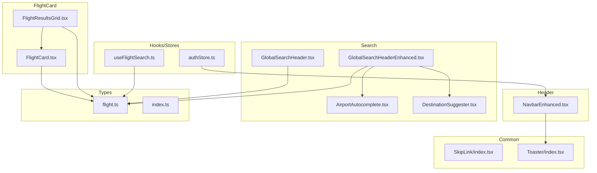
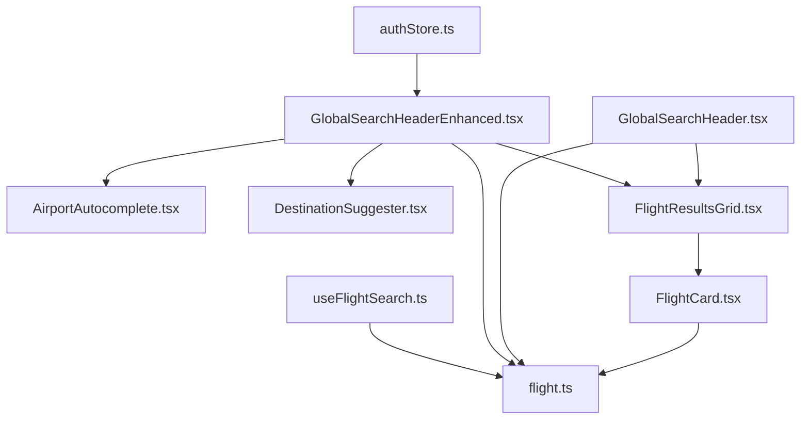
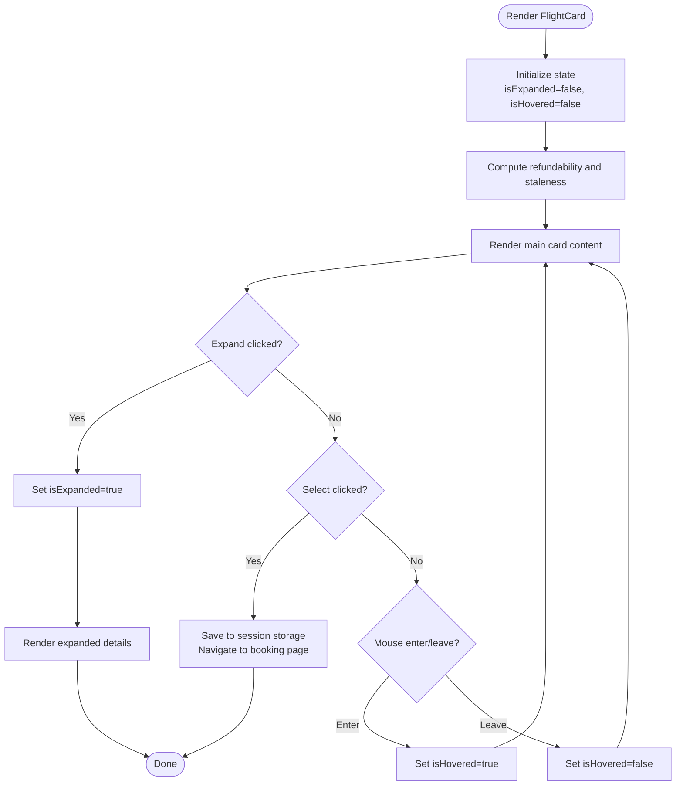
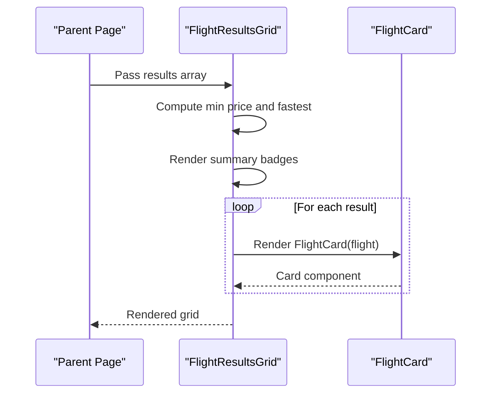
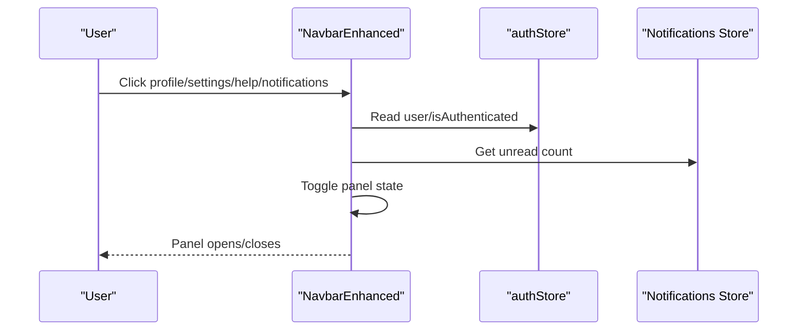
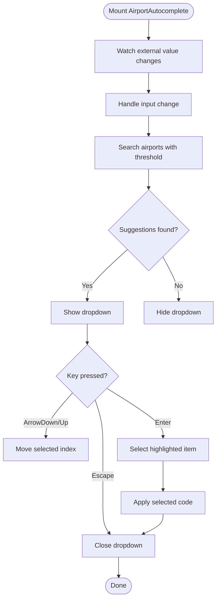
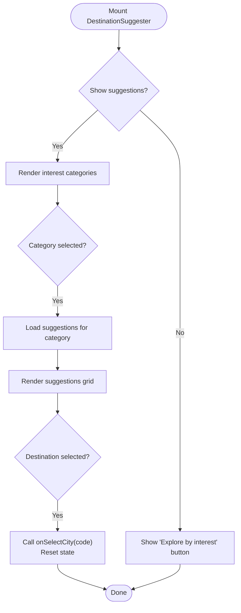
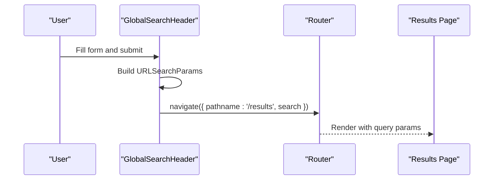
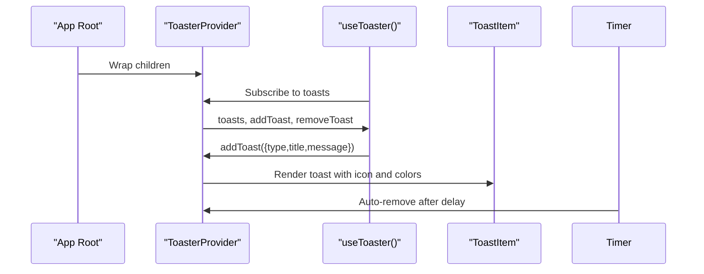
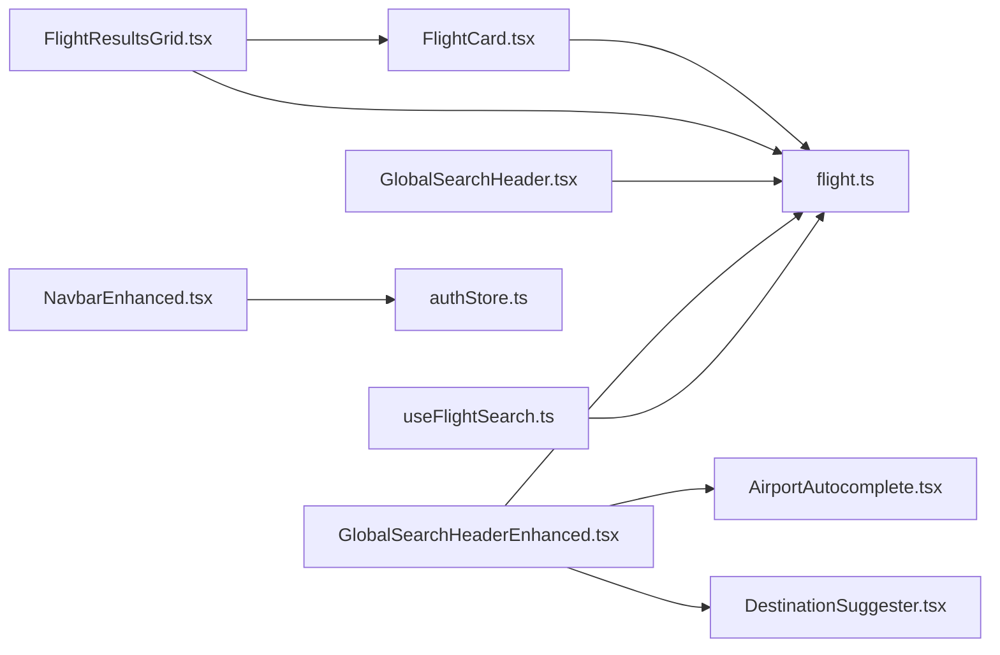

# Component Library

<cite>
**Referenced Files in This Document**
- [FlightCard.tsx](file://skyflow-pro/src/components/FlightCard/FlightCard.tsx)
- [FlightResultsGrid.tsx](file://skyflow-pro/src/components/FlightCard/FlightResultsGrid.tsx)
- [NavbarEnhanced.tsx](file://skyflow-pro/src/components/Header/NavbarEnhanced.tsx)
- [AirportAutocomplete.tsx](file://skyflow-pro/src/components/features/flights/search/AirportAutocomplete.tsx)
- [DestinationSuggester.tsx](file://skyflow-pro/src/components/features/flights/search/DestinationSuggester.tsx)
- [GlobalSearchHeader.tsx](file://skyflow-pro/src/components/features/flights/search/GlobalSearchHeader.tsx)
- [GlobalSearchHeaderEnhanced.tsx](file://skyflow-pro/src/components/features/flights/search/GlobalSearchHeaderEnhanced.tsx)
- [SkipLink/index.tsx](file://skyflow-pro/src/components/common/SkipLink/index.tsx)
- [Toaster/index.tsx](file://skyflow-pro/src/components/common/Toaster/index.tsx)
- [flight.ts](file://skyflow-pro/src/types/flight.ts)
- [index.ts](file://skyflow-pro/src/types/index.ts)
- [useFlightSearch.ts](file://skyflow-pro/src/hooks/useFlightSearch.ts)
- [authStore.ts](file://skyflow-pro/src/stores/authStore.ts)
- [index.ts (FlightCard)](file://skyflow-pro/src/components/FlightCard/index.ts)
- [index.ts (Header)](file://skyflow-pro/src/components/Header/index.tsx)
- [index.ts (Search)](file://skyflow-pro/src/components/features/flights/search/index.ts)
</cite>

## Table of Contents
1. [Introduction](#introduction)
2. [Project Structure](#project-structure)
3. [Core Components](#core-components)
4. [Architecture Overview](#architecture-overview)
5. [Detailed Component Analysis](#detailed-component-analysis)
6. [Dependency Analysis](#dependency-analysis)
7. [Performance Considerations](#performance-considerations)
8. [Troubleshooting Guide](#troubleshooting-guide)
9. [Conclusion](#conclusion)
10. [Appendices](#appendices)

## Introduction
This document describes the React component library used in the SkyFlow Pro application. It focuses on reusable UI components including FlightCard, FlightResultsGrid, NavbarEnhanced, and search components such as AirportAutocomplete, DestinationSuggester, and the GlobalSearchHeader variants. The documentation explains component props, TypeScript interfaces, composition patterns, styling with Tailwind CSS, accessibility features, lifecycle and state management integration, performance techniques, and testing strategies.

## Project Structure
The component library is organized by feature and shared concerns:
- FlightCard: reusable card for displaying flight options and selection actions
- FlightResultsGrid: container for rendering multiple FlightCard instances and summary metrics
- Header/Navbar: navigation and user controls
- Features/flights/search: search UI including forms, autocompletion, and suggestions
- Common: accessibility and feedback utilities (SkipLink, Toaster)
- Types: shared TypeScript interfaces for flights and related data
- Hooks and Stores: state management integration for search and auth

**Diagram sources**
- [FlightCard.tsx:30-262](file://skyflow-pro/src/components/FlightCard/FlightCard.tsx#L30-L262)
- [FlightResultsGrid.tsx:9-109](file://skyflow-pro/src/components/FlightCard/FlightResultsGrid.tsx#L9-L109)
- [NavbarEnhanced.tsx:17-119](file://skyflow-pro/src/components/Header/NavbarEnhanced.tsx#L17-L119)
- [AirportAutocomplete.tsx:21-205](file://skyflow-pro/src/components/features/flights/search/AirportAutocomplete.tsx#L21-L205)
- [DestinationSuggester.tsx:10-112](file://skyflow-pro/src/components/features/flights/search/DestinationSuggester.tsx#L10-L112)
- [GlobalSearchHeader.tsx:27-277](file://skyflow-pro/src/components/features/flights/search/GlobalSearchHeader.tsx#L27-L277)
- [GlobalSearchHeaderEnhanced.tsx:35-274](file://skyflow-pro/src/components/features/flights/search/GlobalSearchHeaderEnhanced.tsx#L35-L274)
- [SkipLink/index.tsx:1-12](file://skyflow-pro/src/components/common/SkipLink/index.tsx#L1-L12)
- [Toaster/index.tsx:91-125](file://skyflow-pro/src/components/common/Toaster/index.tsx#L91-L125)
- [flight.ts:1-58](file://skyflow-pro/src/types/flight.ts#L1-L58)
- [index.ts:1-2](file://skyflow-pro/src/types/index.ts#L1-L2)
- [useFlightSearch.ts:4-10](file://skyflow-pro/src/hooks/useFlightSearch.ts#L4-L10)
- [authStore.ts:45-90](file://skyflow-pro/src/stores/authStore.ts#L45-L90)

**Section sources**
- [index.ts (FlightCard):1-3](file://skyflow-pro/src/components/FlightCard/index.ts#L1-L3)
- [index.ts (Header):5-6](file://skyflow-pro/src/components/Header/index.tsx#L5-L6)
- [index.ts (Search):1-5](file://skyflow-pro/src/components/features/flights/search/index.ts#L1-L5)

## Core Components
This section documents the primary components and their responsibilities, props, and usage patterns.

- FlightCard
  - Purpose: Render a single flight option with pricing, duration, stops, and expandable details. Handles selection and session storage.
  - Props: flight (FlightOption)
  - Key behaviors: Hover effects, expand/collapse details, selection routing, refundability badges, stale price indicators.
  - Styling: Tailwind classes for gradients, borders, and responsive layouts; hover and ring transitions.
  - Accessibility: Buttons use explicit types; interactive elements have appropriate roles and labels.
  - Lifecycle: Uses local state for expansion and hover; navigates on select.

- FlightResultsGrid
  - Purpose: Container for multiple FlightCard instances, summary highlights (best price/fastest), and empty-state messaging.
  - Props: results (FlightOption[])
  - Key behaviors: Computes min price and fastest flight; renders recommended badges; animates cards with staggered delays.
  - Styling: Glass-like containers, badges, and responsive grids.
  - Accessibility: Section labeled for screen readers; recommended badges are keyboard navigable.

- NavbarEnhanced
  - Purpose: Application header with branding, navigation links, theme toggle, notifications, help panel, profile modal, and settings panel.
  - Props: none
  - Key behaviors: Mobile menu toggle, unread notifications count, panel open/close state, integration with auth store and notification store.
  - Styling: Glass effect, gradient accents, responsive layout, active link highlighting.
  - Accessibility: Proper ARIA attributes for panels and toggles; keyboard navigation support.

- AirportAutocomplete
  - Purpose: Intelligent airport/city code input with suggestions, keyboard navigation, and click-outside dismissal.
  - Props: value, onChange, label, placeholder, required, icon
  - Key behaviors: Debounced search, arrow-key navigation, Enter to select, Escape to close, clear button.
  - Styling: Input with trailing icon and clear button; suggestion list with hover states.
  - Accessibility: Combobox pattern with aria-* attributes; listbox and option roles.

- DestinationSuggester
  - Purpose: Interest-driven destination suggestions with category filtering and selection.
  - Props: onSelectCity, className
  - Key behaviors: Toggle visibility, category selection, suggestion grid, immediate selection closes component.
  - Styling: Animated reveal, category chips, suggestion cards with hover effects.
  - Accessibility: Focus management and clear labeling.

- GlobalSearchHeader and GlobalSearchHeaderEnhanced
  - Purpose: Flight search form with trip type, locations, dates, passengers, cabin class, flexible dates, and submission.
  - Props: none (managed internally)
  - Key behaviors: Form state updates, swap locations, flexible date strip integration, route navigation with query params.
  - Enhancements in Enhanced variant: AirportAutocomplete for from/to, DestinationSuggester, and expanded cabin class support.
  - Styling: Responsive grid layout, glass containers, button states, and helper messaging.
  - Accessibility: Descriptive labels, ARIA roles, and helper text for transparency.

- SkipLink
  - Purpose: Accessible “skip to main content” link for keyboard navigation.
  - Props: none
  - Styling: Visually hidden until focused.

- Toaster
  - Purpose: Global toast notifications with provider and consumer hooks.
  - Props: children for provider wrapping
  - Key behaviors: Add/remove toasts, auto-dismiss, type-specific styling and icons.
  - Styling: Fixed positioning, backdrop blur, and color-coded themes.

**Section sources**
- [FlightCard.tsx:6-262](file://skyflow-pro/src/components/FlightCard/FlightCard.tsx#L6-L262)
- [FlightResultsGrid.tsx:5-109](file://skyflow-pro/src/components/FlightCard/FlightResultsGrid.tsx#L5-L109)
- [NavbarEnhanced.tsx:17-119](file://skyflow-pro/src/components/Header/NavbarEnhanced.tsx#L17-L119)
- [AirportAutocomplete.tsx:12-205](file://skyflow-pro/src/components/features/flights/search/AirportAutocomplete.tsx#L12-L205)
- [DestinationSuggester.tsx:5-112](file://skyflow-pro/src/components/features/flights/search/DestinationSuggester.tsx#L5-L112)
- [GlobalSearchHeader.tsx:9-277](file://skyflow-pro/src/components/features/flights/search/GlobalSearchHeader.tsx#L9-L277)
- [GlobalSearchHeaderEnhanced.tsx:24-274](file://skyflow-pro/src/components/features/flights/search/GlobalSearchHeaderEnhanced.tsx#L24-L274)
- [SkipLink/index.tsx:1-12](file://skyflow-pro/src/components/common/SkipLink/index.tsx#L1-L12)
- [Toaster/index.tsx:14-125](file://skyflow-pro/src/components/common/Toaster/index.tsx#L14-L125)

## Architecture Overview
The component library integrates UI components with typed data models, state management, and services:
- Flight-related data is modeled by FlightOption and related interfaces.
- Search components compose smaller UI elements (inputs, buttons, lists).
- State is managed via React Query for search, Zustand for auth, and React local state for UI toggles.
- Styling relies on Tailwind utilities with consistent color scales and glass effects.

**Diagram sources**
- [GlobalSearchHeader.tsx:27-277](file://skyflow-pro/src/components/features/flights/search/GlobalSearchHeader.tsx#L27-L277)
- [GlobalSearchHeaderEnhanced.tsx:35-274](file://skyflow-pro/src/components/features/flights/search/GlobalSearchHeaderEnhanced.tsx#L35-L274)
- [AirportAutocomplete.tsx:21-205](file://skyflow-pro/src/components/features/flights/search/AirportAutocomplete.tsx#L21-L205)
- [DestinationSuggester.tsx:10-112](file://skyflow-pro/src/components/features/flights/search/DestinationSuggester.tsx#L10-L112)
- [FlightResultsGrid.tsx:9-109](file://skyflow-pro/src/components/FlightCard/FlightResultsGrid.tsx#L9-L109)
- [FlightCard.tsx:30-262](file://skyflow-pro/src/components/FlightCard/FlightCard.tsx#L30-L262)
- [flight.ts:42-56](file://skyflow-pro/src/types/flight.ts#L42-L56)
- [useFlightSearch.ts:4-10](file://skyflow-pro/src/hooks/useFlightSearch.ts#L4-L10)
- [authStore.ts:45-90](file://skyflow-pro/src/stores/authStore.ts#L45-L90)

## Detailed Component Analysis

### FlightCard
- Purpose: Single flight option presentation with selection and detailed pricing.
- Props: flight (FlightOption)
- State: isExpanded (boolean), isHovered (boolean)
- Behavior: Calculates refundability classification, determines staleness, formats currency and durations, handles selection via navigation and session storage.
- Composition: Renders nested details when expanded; integrates icons and badges for policy and environmental impact.
- Accessibility: Interactive elements use explicit button types; hover and focus states improve usability.

**Diagram sources**
- [FlightCard.tsx:30-47](file://skyflow-pro/src/components/FlightCard/FlightCard.tsx#L30-L47)
- [FlightCard.tsx:150-165](file://skyflow-pro/src/components/FlightCard/FlightCard.tsx#L150-L165)
- [FlightCard.tsx:185-259](file://skyflow-pro/src/components/FlightCard/FlightCard.tsx#L185-L259)

**Section sources**
- [FlightCard.tsx:6-262](file://skyflow-pro/src/components/FlightCard/FlightCard.tsx#L6-L262)
- [flight.ts:42-56](file://skyflow-pro/src/types/flight.ts#L42-L56)

### FlightResultsGrid
- Purpose: Grid container for multiple FlightCard instances with summary highlights.
- Props: results (FlightOption[])
- Behavior: Empty-state handling, computes min price and fastest flight, renders recommended badges, and animates cards.
- Composition: Delegates individual flight rendering to FlightCard.

**Diagram sources**
- [FlightResultsGrid.tsx:9-96](file://skyflow-pro/src/components/FlightCard/FlightResultsGrid.tsx#L9-L96)
- [FlightCard.tsx:30-262](file://skyflow-pro/src/components/FlightCard/FlightCard.tsx#L30-L262)

**Section sources**
- [FlightResultsGrid.tsx:5-109](file://skyflow-pro/src/components/FlightCard/FlightResultsGrid.tsx#L5-L109)
- [flight.ts:42-56](file://skyflow-pro/src/types/flight.ts#L42-L56)

### NavbarEnhanced
- Purpose: Application header with navigation, theme toggle, notifications, help, profile, and settings.
- Props: none
- State: Mobile menu, panel open states, location tracking.
- Integration: Uses auth store for user and authentication status; uses notification store for unread count.
- Composition: Renders panels conditionally and manages their open/close state.

**Diagram sources**
- [NavbarEnhanced.tsx:17-119](file://skyflow-pro/src/components/Header/NavbarEnhanced.tsx#L17-L119)
- [authStore.ts:45-90](file://skyflow-pro/src/stores/authStore.ts#L45-L90)

**Section sources**
- [NavbarEnhanced.tsx:17-119](file://skyflow-pro/src/components/Header/NavbarEnhanced.tsx#L17-L119)
- [authStore.ts:45-90](file://skyflow-pro/src/stores/authStore.ts#L45-L90)

### AirportAutocomplete
- Purpose: Location input with intelligent suggestions and keyboard navigation.
- Props: value, onChange, label, placeholder, required, icon
- State: isOpen, inputValue, suggestions, selectedIndex
- Behavior: Filters suggestions, handles keyboard events, supports click-outside closing, clear input.
- Accessibility: Combobox pattern with aria-* attributes; listbox and option roles.

**Diagram sources**
- [AirportAutocomplete.tsx:21-120](file://skyflow-pro/src/components/features/flights/search/AirportAutocomplete.tsx#L21-L120)
- [AirportAutocomplete.tsx:168-202](file://skyflow-pro/src/components/features/flights/search/AirportAutocomplete.tsx#L168-L202)

**Section sources**
- [AirportAutocomplete.tsx:12-205](file://skyflow-pro/src/components/features/flights/search/AirportAutocomplete.tsx#L12-L205)

### DestinationSuggester
- Purpose: Interest-based destination suggestions with category filtering.
- Props: onSelectCity, className
- State: selectedInterest, suggestions, isVisible
- Behavior: Toggles visibility, filters suggestions by category, applies selection and resets state.

**Diagram sources**
- [DestinationSuggester.tsx:10-27](file://skyflow-pro/src/components/features/flights/search/DestinationSuggester.tsx#L10-L27)
- [DestinationSuggester.tsx:40-110](file://skyflow-pro/src/components/features/flights/search/DestinationSuggester.tsx#L40-L110)

**Section sources**
- [DestinationSuggester.tsx:5-112](file://skyflow-pro/src/components/features/flights/search/DestinationSuggester.tsx#L5-L112)

### GlobalSearchHeader and GlobalSearchHeaderEnhanced
- Purpose: Search form for flights with trip type, locations, dates, passengers, cabin class, and flexible dates.
- Props: none (internal state)
- State: Form fields, search status, flexible day range.
- Behavior: Swap locations, compute query params, navigate to results page, integrate flexible date strip.
- Enhanced variant adds AirportAutocomplete and DestinationSuggester, plus expanded cabin class support.

**Diagram sources**
- [GlobalSearchHeader.tsx:52-72](file://skyflow-pro/src/components/features/flights/search/GlobalSearchHeader.tsx#L52-L72)
- [GlobalSearchHeaderEnhanced.tsx:60-80](file://skyflow-pro/src/components/features/flights/search/GlobalSearchHeaderEnhanced.tsx#L60-L80)

**Section sources**
- [GlobalSearchHeader.tsx:9-277](file://skyflow-pro/src/components/features/flights/search/GlobalSearchHeader.tsx#L9-L277)
- [GlobalSearchHeaderEnhanced.tsx:24-274](file://skyflow-pro/src/components/features/flights/search/GlobalSearchHeaderEnhanced.tsx#L24-L274)

### SkipLink and Toaster
- SkipLink: Provides a keyboard-accessible way to skip to main content.
- Toaster: Provider and hook-based toast notifications with auto-dismiss and type-specific styling.

**Diagram sources**
- [Toaster/index.tsx:91-125](file://skyflow-pro/src/components/common/Toaster/index.tsx#L91-L125)

**Section sources**
- [SkipLink/index.tsx:1-12](file://skyflow-pro/src/components/common/SkipLink/index.tsx#L1-L12)
- [Toaster/index.tsx:14-125](file://skyflow-pro/src/components/common/Toaster/index.tsx#L14-L125)

## Dependency Analysis
- FlightCard depends on:
  - FlightOption and related types from types/flight.ts
  - Navigation via react-router-dom
  - Icons from lucide-react
- FlightResultsGrid composes FlightCard and uses FlightOption
- GlobalSearchHeader variants depend on:
  - FlexDateStrip (calendar feature)
  - AirportAutocomplete and DestinationSuggester (search features)
  - Types from types/flight.ts
- NavbarEnhanced integrates:
  - authStore for user state
  - Notification store for unread counts
  - ThemeToggle, HelpPanel, NotificationPanel, ProfileModal, SettingsPanel
- State and services:
  - useFlightSearch integrates with FlightService via React Query
  - authStore persists to localStorage

**Diagram sources**
- [FlightCard.tsx:3-4](file://skyflow-pro/src/components/FlightCard/FlightCard.tsx#L3-L4)
- [FlightResultsGrid.tsx:1-3](file://skyflow-pro/src/components/FlightCard/FlightResultsGrid.tsx#L1-L3)
- [GlobalSearchHeader.tsx:1-4](file://skyflow-pro/src/components/features/flights/search/GlobalSearchHeader.tsx#L1-L4)
- [GlobalSearchHeaderEnhanced.tsx:12-17](file://skyflow-pro/src/components/features/flights/search/GlobalSearchHeaderEnhanced.tsx#L12-L17)
- [AirportAutocomplete.tsx:8-10](file://skyflow-pro/src/components/features/flights/search/AirportAutocomplete.tsx#L8-L10)
- [DestinationSuggester.tsx:1-2](file://skyflow-pro/src/components/features/flights/search/DestinationSuggester.tsx#L1-L2)
- [NavbarEnhanced.tsx:8-15](file://skyflow-pro/src/components/Header/NavbarEnhanced.tsx#L8-L15)
- [authStore.ts:8-9](file://skyflow-pro/src/stores/authStore.ts#L8-L9)
- [useFlightSearch.ts:1-2](file://skyflow-pro/src/hooks/useFlightSearch.ts#L1-L2)
- [flight.ts:1-58](file://skyflow-pro/src/types/flight.ts#L1-L58)

**Section sources**
- [flight.ts:1-58](file://skyflow-pro/src/types/flight.ts#L1-L58)
- [useFlightSearch.ts:4-10](file://skyflow-pro/src/hooks/useFlightSearch.ts#L4-L10)
- [authStore.ts:45-90](file://skyflow-pro/src/stores/authStore.ts#L45-L90)

## Performance Considerations
- Rendering optimization
  - FlightResultsGrid animates cards with staggered delays; consider virtualization for very large result sets.
  - Avoid unnecessary re-renders by memoizing derived values (e.g., min price, fastest) when results change.
- State and caching
  - useFlightSearch enables queries only when required fields are present; ensure params normalization to prevent redundant requests.
  - Persist auth state to reduce login churn; avoid frequent re-fetches for static data.
- Styling and bundles
  - Prefer Tailwind utilities for consistency; avoid excessive nesting to keep CSS minimal.
  - Group related components under feature folders to enable tree-shaking.
- Accessibility and UX
  - Keep keyboard navigation smooth; defer heavy computations to idle callbacks when possible.
  - Debounce input handlers (already implemented in AirportAutocomplete) to limit re-computation.

## Troubleshooting Guide
- FlightCard shows stale pricing
  - Staleness is computed from lastUpdated; if prices appear outdated, verify backend timestamps and polling intervals.
  - Check session storage usage for selection persistence.
- Search form not submitting
  - Ensure required fields (from, to, date) are populated; verify query param construction and navigation.
- Autocomplete suggestions not appearing
  - Confirm minimum input length threshold and that searchAirports returns results.
  - Verify click-outside handler does not conflict with parent overlays.
- Notifications badge not updating
  - Ensure unread count calculation is invoked and state updates propagate to NavbarEnhanced.
- Toasts not dismissing
  - Confirm auto-dismiss timers and context provider wraps the app root.

**Section sources**
- [FlightCard.tsx:38-42](file://skyflow-pro/src/components/FlightCard/FlightCard.tsx#L38-L42)
- [GlobalSearchHeader.tsx:52-72](file://skyflow-pro/src/components/features/flights/search/GlobalSearchHeader.tsx#L52-L72)
- [AirportAutocomplete.tsx:36-46](file://skyflow-pro/src/components/features/flights/search/AirportAutocomplete.tsx#L36-L46)
- [NavbarEnhanced.tsx:24-26](file://skyflow-pro/src/components/Header/NavbarEnhanced.tsx#L24-L26)
- [Toaster/index.tsx:94-104](file://skyflow-pro/src/components/common/Toaster/index.tsx#L94-L104)

## Conclusion
The component library provides a cohesive set of reusable UI elements for flight search and display, integrated with typed data models, state management, and accessibility best practices. FlightCard and FlightResultsGrid encapsulate flight presentation and selection, while NavbarEnhanced centralizes navigation and user controls. Search components offer robust, accessible, and extensible forms with autocompletion and suggestions. Consistent styling with Tailwind and thoughtful state management yield a maintainable and performant UI surface.

## Appendices

### TypeScript Interfaces and Usage Patterns
- FlightOption and related types define the shape of flight data used across components.
- useFlightSearch standardizes fetching and caching of search results.
- authStore provides a persistent, scoped store for user and booking history.

**Section sources**
- [flight.ts:1-58](file://skyflow-pro/src/types/flight.ts#L1-L58)
- [index.ts:1-2](file://skyflow-pro/src/types/index.ts#L1-L2)
- [useFlightSearch.ts:4-10](file://skyflow-pro/src/hooks/useFlightSearch.ts#L4-L10)
- [authStore.ts:30-90](file://skyflow-pro/src/stores/authStore.ts#L30-L90)

### Component Index Exports
- FlightCard exports: FlightCard, FlightResultsGrid
- Header exports: NavbarEnhanced, Navbar
- Search exports: GlobalSearchHeader, GlobalSearchHeaderEnhanced, AirportAutocomplete, DestinationSuggester

**Section sources**
- [index.ts (FlightCard):1-3](file://skyflow-pro/src/components/FlightCard/index.ts#L1-L3)
- [index.ts (Header):5-6](file://skyflow-pro/src/components/Header/index.tsx#L5-L6)
- [index.ts (Search):1-5](file://skyflow-pro/src/components/features/flights/search/index.ts#L1-L5)