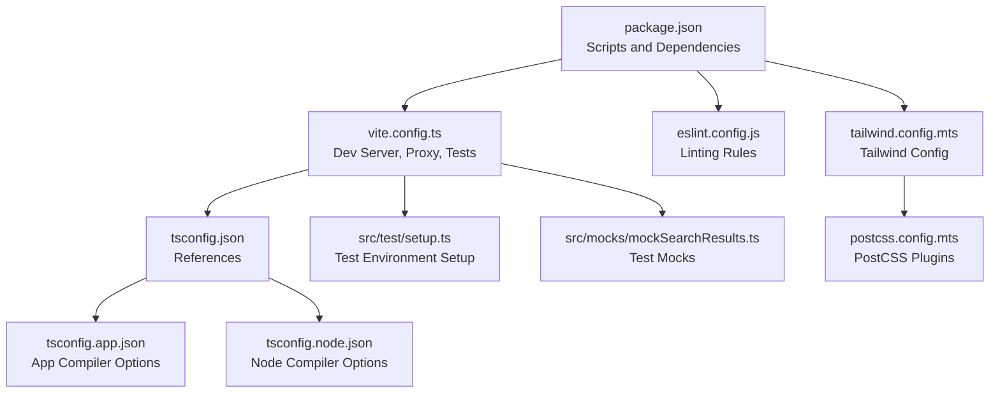
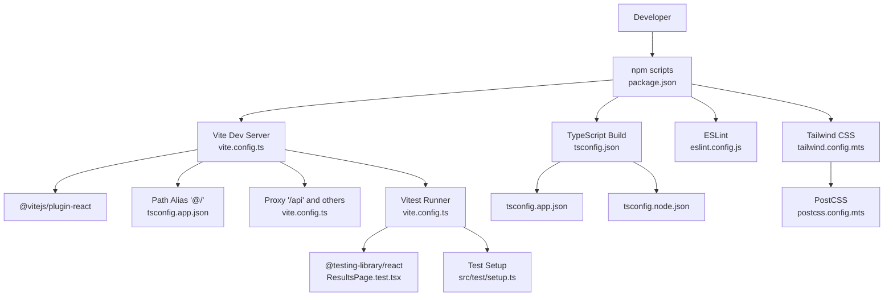
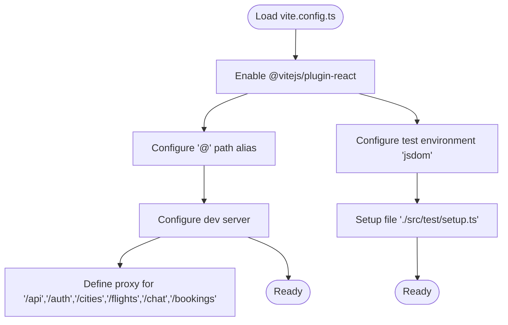
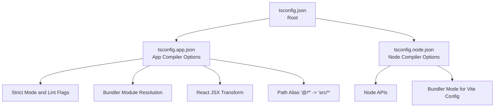
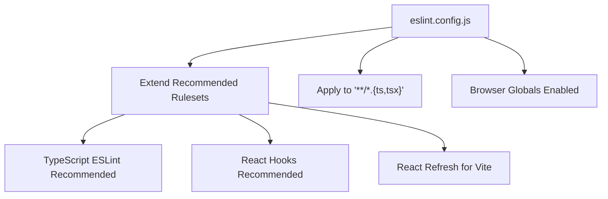
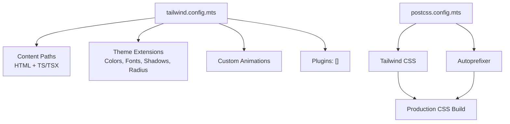
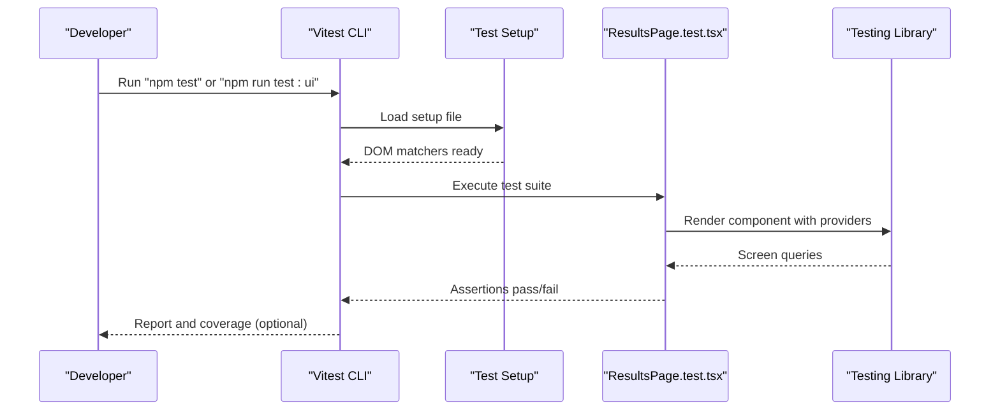
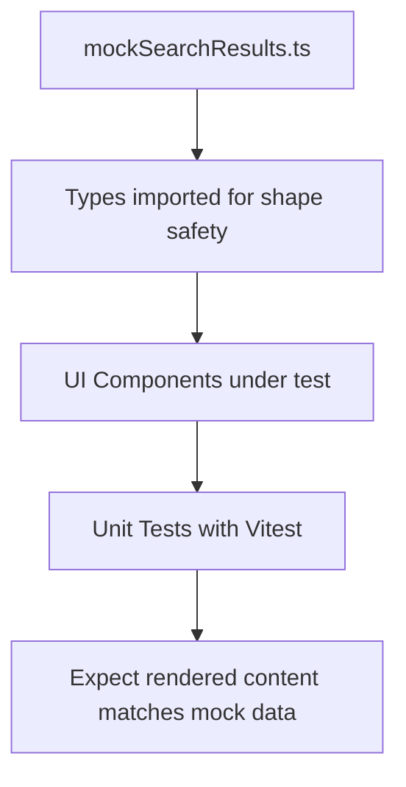
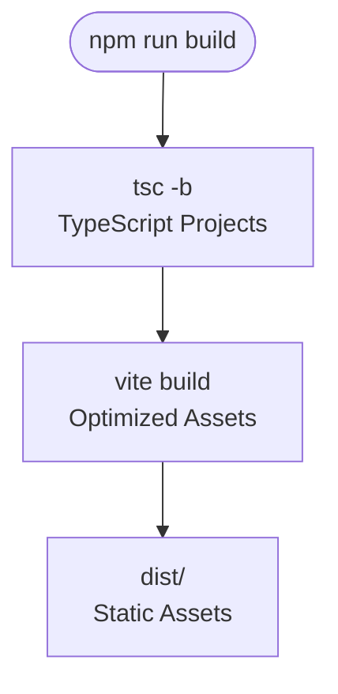
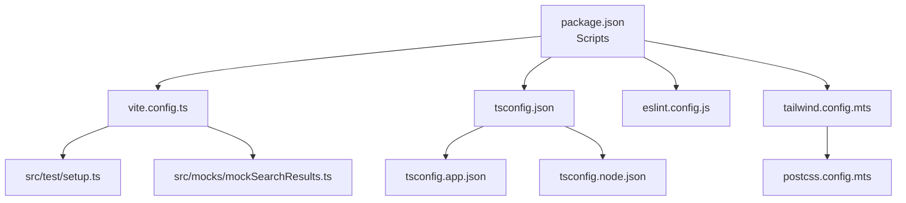

# Development Workflow

<cite>
**Referenced Files in This Document**
- [vite.config.ts](file://skyflow-pro/vite.config.ts)
- [package.json](file://skyflow-pro/package.json)
- [tsconfig.json](file://skyflow-pro/tsconfig.json)
- [tsconfig.app.json](file://skyflow-pro/tsconfig.app.json)
- [tsconfig.node.json](file://skyflow-pro/tsconfig.node.json)
- [eslint.config.js](file://skyflow-pro/eslint.config.js)
- [tailwind.config.mts](file://skyflow-pro/tailwind.config.mts)
- [postcss.config.mts](file://skyflow-pro/postcss.config.mts)
- [setup.ts](file://skyflow-pro/src/test/setup.ts)
- [ResultsPage.test.tsx](file://skyflow-pro/src/pages/FlightResults/ResultsPage.test.tsx)
- [mockSearchResults.ts](file://skyflow-pro/src/mocks/mockSearchResults.ts)
</cite>

## Table of Contents
1. [Introduction](#introduction)
2. [Project Structure](#project-structure)
3. [Core Components](#core-components)
4. [Architecture Overview](#architecture-overview)
5. [Detailed Component Analysis](#detailed-component-analysis)
6. [Dependency Analysis](#dependency-analysis)
7. [Performance Considerations](#performance-considerations)
8. [Troubleshooting Guide](#troubleshooting-guide)
9. [Conclusion](#conclusion)
10. [Appendices](#appendices)

## Introduction
This document explains the development environment and build workflow for the React frontend project. It covers Vite configuration, TypeScript compilation settings, ESLint integration, development server setup, hot module replacement, asset optimization, testing with Vitest, mock setup, and test utilities. It also provides guidance on build optimization, environment variables, deployment preparation, code quality tools, pre-commit hooks, continuous integration, debugging techniques, performance profiling, and development best practices for React applications.

## Project Structure
The frontend project is organized around a modern React + TypeScript stack with Vite as the bundler and dev server. Key configuration files define the build pipeline, linting rules, styling pipeline, and testing harness. The project uses path aliases for clean imports and Tailwind CSS with PostCSS for styling.

**Diagram sources**
- [package.json:1-46](file://skyflow-pro/package.json#L1-L46)
- [vite.config.ts:1-53](file://skyflow-pro/vite.config.ts#L1-L53)
- [tsconfig.json:1-8](file://skyflow-pro/tsconfig.json#L1-L8)
- [tsconfig.app.json:1-41](file://skyflow-pro/tsconfig.app.json#L1-L41)
- [tsconfig.node.json:1-27](file://skyflow-pro/tsconfig.node.json#L1-L27)
- [eslint.config.js:1-24](file://skyflow-pro/eslint.config.js#L1-L24)
- [tailwind.config.mts:1-124](file://skyflow-pro/tailwind.config.mts#L1-L124)
- [postcss.config.mts:1-8](file://skyflow-pro/postcss.config.mts#L1-L8)
- [setup.ts:1-3](file://skyflow-pro/src/test/setup.ts#L1-L3)
- [mockSearchResults.ts:1-313](file://skyflow-pro/src/mocks/mockSearchResults.ts#L1-L313)

**Section sources**
- [package.json:1-46](file://skyflow-pro/package.json#L1-L46)
- [vite.config.ts:1-53](file://skyflow-pro/vite.config.ts#L1-L53)
- [tsconfig.json:1-8](file://skyflow-pro/tsconfig.json#L1-L8)
- [tsconfig.app.json:1-41](file://skyflow-pro/tsconfig.app.json#L1-L41)
- [tsconfig.node.json:1-27](file://skyflow-pro/tsconfig.node.json#L1-L27)
- [eslint.config.js:1-24](file://skyflow-pro/eslint.config.js#L1-L24)
- [tailwind.config.mts:1-124](file://skyflow-pro/tailwind.config.mts#L1-L124)
- [postcss.config.mts:1-8](file://skyflow-pro/postcss.config.mts#L1-L8)
- [setup.ts:1-3](file://skyflow-pro/src/test/setup.ts#L1-L3)
- [mockSearchResults.ts:1-313](file://skyflow-pro/src/mocks/mockSearchResults.ts#L1-L313)

## Core Components
- Vite configuration defines the React plugin, path alias resolution, development server with API proxy, and Vitest environment for tests.
- TypeScript configuration splits app and node compiler options into separate files for strictness and bundler compatibility.
- ESLint configuration enforces recommended rules for TypeScript, React Hooks, and React Refresh within Vite.
- Tailwind CSS and PostCSS configure design tokens, animations, and autoprefixing for production-ready CSS.
- Test setup initializes DOM testing utilities for Vitest and React Testing Library.

**Section sources**
- [vite.config.ts:7-52](file://skyflow-pro/vite.config.ts#L7-L52)
- [tsconfig.app.json:2-36](file://skyflow-pro/tsconfig.app.json#L2-L36)
- [tsconfig.node.json:2-25](file://skyflow-pro/tsconfig.node.json#L2-L25)
- [eslint.config.js:8-23](file://skyflow-pro/eslint.config.js#L8-L23)
- [tailwind.config.mts:3-121](file://skyflow-pro/tailwind.config.mts#L3-L121)
- [postcss.config.mts:1-7](file://skyflow-pro/postcss.config.mts#L1-L7)
- [setup.ts:1-3](file://skyflow-pro/src/test/setup.ts#L1-L3)

## Architecture Overview
The development workflow integrates Vite’s fast dev server, TypeScript compilation, ESLint checks, Tailwind CSS preprocessing, and Vitest for unit testing. The proxy configuration allows seamless API communication during local development.

**Diagram sources**
- [package.json:6-14](file://skyflow-pro/package.json#L6-L14)
- [vite.config.ts:7-52](file://skyflow-pro/vite.config.ts#L7-L52)
- [tsconfig.json:3-6](file://skyflow-pro/tsconfig.json#L3-L6)
- [tsconfig.app.json:32-36](file://skyflow-pro/tsconfig.app.json#L32-L36)
- [ResultsPage.test.tsx:1-27](file://skyflow-pro/src/pages/FlightResults/ResultsPage.test.tsx#L1-L27)
- [setup.ts:1-3](file://skyflow-pro/src/test/setup.ts#L1-L3)
- [eslint.config.js:8-23](file://skyflow-pro/eslint.config.js#L8-L23)
- [tailwind.config.mts:3-5](file://skyflow-pro/tailwind.config.mts#L3-L5)
- [postcss.config.mts:1-7](file://skyflow-pro/postcss.config.mts#L1-L7)

## Detailed Component Analysis

### Vite Configuration
- Plugin: React Fast Refresh and JSX transform.
- Path alias: '@' resolves to the src directory for concise imports.
- Development server: Local proxy routes API prefixes to the backend server.
- Test environment: jsdom with a setup file for DOM testing utilities.

**Diagram sources**
- [vite.config.ts:7-52](file://skyflow-pro/vite.config.ts#L7-L52)
- [setup.ts:1-3](file://skyflow-pro/src/test/setup.ts#L1-L3)

**Section sources**
- [vite.config.ts:7-52](file://skyflow-pro/vite.config.ts#L7-L52)

### TypeScript Compilation Settings
- Root references two tsconfig files for app and node environments.
- App tsconfig sets ES target, DOM libs, bundler module resolution, JSX transform, strictness, and path alias.
- Node tsconfig targets Node APIs and enables bundler mode for Vite config.

**Diagram sources**
- [tsconfig.json:3-6](file://skyflow-pro/tsconfig.json#L3-L6)
- [tsconfig.app.json:2-36](file://skyflow-pro/tsconfig.app.json#L2-L36)
- [tsconfig.node.json:2-25](file://skyflow-pro/tsconfig.node.json#L2-L25)

**Section sources**
- [tsconfig.json:1-8](file://skyflow-pro/tsconfig.json#L1-L8)
- [tsconfig.app.json:1-41](file://skyflow-pro/tsconfig.app.json#L1-L41)
- [tsconfig.node.json:1-27](file://skyflow-pro/tsconfig.node.json#L1-L27)

### ESLint Integration
- Uses flat config with recommended rules for JavaScript, TypeScript, React Hooks, and React Refresh under Vite.
- Ignores the dist folder and applies rules to TS/TSX files.
- Language options set ECMAScript version and browser globals.

**Diagram sources**
- [eslint.config.js:8-23](file://skyflow-pro/eslint.config.js#L8-L23)

**Section sources**
- [eslint.config.js:1-24](file://skyflow-pro/eslint.config.js#L1-L24)

### Tailwind CSS and PostCSS
- Tailwind content scans HTML and TS/TSX sources for class usage.
- Dark mode strategy via class-based toggling.
- Extensive color palette, typography, shadows, border radius, animations, and backdrop blur.
- PostCSS pipeline includes Tailwind and Autoprefixer.

**Diagram sources**
- [tailwind.config.mts:3-121](file://skyflow-pro/tailwind.config.mts#L3-L121)
- [postcss.config.mts:1-7](file://skyflow-pro/postcss.config.mts#L1-L7)

**Section sources**
- [tailwind.config.mts:1-124](file://skyflow-pro/tailwind.config.mts#L1-L124)
- [postcss.config.mts:1-8](file://skyflow-pro/postcss.config.mts#L1-L8)

### Testing with Vitest
- Scripts: dev, build, lint, preview, test, test:ui, coverage.
- Test environment configured to jsdom with a setup file importing DOM matchers.
- Example test demonstrates rendering a page with React Query and Router providers, asserting URL-derived content.

**Diagram sources**
- [package.json:6-14](file://skyflow-pro/package.json#L6-L14)
- [setup.ts:1-3](file://skyflow-pro/src/test/setup.ts#L1-L3)
- [ResultsPage.test.tsx:1-27](file://skyflow-pro/src/pages/FlightResults/ResultsPage.test.tsx#L1-L27)

**Section sources**
- [package.json:6-14](file://skyflow-pro/package.json#L6-L14)
- [setup.ts:1-3](file://skyflow-pro/src/test/setup.ts#L1-L3)
- [ResultsPage.test.tsx:1-27](file://skyflow-pro/src/pages/FlightResults/ResultsPage.test.tsx#L1-L27)

### Mock Setup and Utilities
- Centralized mock data for flight search results to support deterministic UI testing.
- Mocks enable isolated testing of components without live API dependencies.

**Diagram sources**
- [mockSearchResults.ts:1-313](file://skyflow-pro/src/mocks/mockSearchResults.ts#L1-L313)

**Section sources**
- [mockSearchResults.ts:1-313](file://skyflow-pro/src/mocks/mockSearchResults.ts#L1-L313)

### Build Optimization and Deployment Preparation
- Build command compiles TypeScript projects and runs Vite to produce optimized assets.
- Production builds leverage Vite’s bundling, minification, and asset optimization.
- Environment variables can be injected via Vite’s process environment handling; define them in your runtime environment or a .env file recognized by Vite.

**Diagram sources**
- [package.json:8](file://skyflow-pro/package.json#L8)
- [vite.config.ts:7-52](file://skyflow-pro/vite.config.ts#L7-L52)

**Section sources**
- [package.json:8](file://skyflow-pro/package.json#L8)

### Development Best Practices
- Keep TypeScript strict and linting enabled to catch errors early.
- Use path aliases consistently for maintainable imports.
- Prefer centralized mock data for predictable UI tests.
- Leverage React Query defaults and provider setup in tests to avoid network flakiness.
- Configure ESLint with React Hooks and React Refresh rules for Vite to align with modern React development.

**Section sources**
- [tsconfig.app.json:24-29](file://skyflow-pro/tsconfig.app.json#L24-L29)
- [eslint.config.js:12-17](file://skyflow-pro/eslint.config.js#L12-L17)
- [ResultsPage.test.tsx:7-19](file://skyflow-pro/src/pages/FlightResults/ResultsPage.test.tsx#L7-L19)

## Dependency Analysis
The project’s npm scripts orchestrate Vite, TypeScript, ESLint, Vitest, and Tailwind CSS. Vite consumes the React plugin and test configuration, while TypeScript compilation is coordinated via the root tsconfig references.

**Diagram sources**
- [package.json:6-14](file://skyflow-pro/package.json#L6-L14)
- [tsconfig.json:3-6](file://skyflow-pro/tsconfig.json#L3-L6)
- [tsconfig.app.json:32-36](file://skyflow-pro/tsconfig.app.json#L32-L36)
- [tsconfig.node.json:25](file://skyflow-pro/tsconfig.node.json#L25)
- [eslint.config.js:8-23](file://skyflow-pro/eslint.config.js#L8-L23)
- [tailwind.config.mts:3-5](file://skyflow-pro/tailwind.config.mts#L3-L5)
- [postcss.config.mts:1-7](file://skyflow-pro/postcss.config.mts#L1-L7)
- [vite.config.ts:7-52](file://skyflow-pro/vite.config.ts#L7-L52)
- [setup.ts:1-3](file://skyflow-pro/src/test/setup.ts#L1-L3)
- [mockSearchResults.ts:1-313](file://skyflow-pro/src/mocks/mockSearchResults.ts#L1-L313)

**Section sources**
- [package.json:6-14](file://skyflow-pro/package.json#L6-L14)
- [tsconfig.json:3-6](file://skyflow-pro/tsconfig.json#L3-L6)
- [vite.config.ts:7-52](file://skyflow-pro/vite.config.ts#L7-L52)

## Performance Considerations
- Use Vite’s built-in code splitting and lazy loading for route-based chunks.
- Enable tree-shaking by avoiding unused imports and keeping strict TypeScript settings.
- Optimize Tailwind CSS by purging unused classes in production builds.
- Minimize heavy computations in render paths; leverage React Query caching and selective re-renders.
- Monitor bundle size with Vite’s built-in analyzer plugin if added to the future.

## Troubleshooting Guide
- Proxy failures: Verify backend server is running on the configured target host/port and CORS settings allow origin changes.
- Test environment issues: Ensure jsdom is selected and the setup file is loaded; confirm DOM matchers are imported.
- Path alias errors: Confirm tsconfig app paths match the Vite alias configuration.
- Lint errors: Align code style with the recommended rulesets and disable only when necessary.
- Tailwind utilities missing: Ensure content globs include all relevant files and rebuild after changes.

**Section sources**
- [vite.config.ts:14-47](file://skyflow-pro/vite.config.ts#L14-L47)
- [setup.ts:1-3](file://skyflow-pro/src/test/setup.ts#L1-L3)
- [tsconfig.app.json:32-36](file://skyflow-pro/tsconfig.app.json#L32-L36)
- [eslint.config.js:12-17](file://skyflow-pro/eslint.config.js#L12-L17)
- [tailwind.config.mts:5](file://skyflow-pro/tailwind.config.mts#L5)

## Conclusion
The project establishes a robust development workflow centered on Vite, TypeScript, ESLint, Tailwind CSS, and Vitest. The configuration emphasizes developer productivity with hot reloading, strict type checking, linting, and reliable tests. Following the outlined practices ensures consistent builds, maintainable code, and smooth collaboration.

## Appendices
- Pre-commit hooks: Integrate Husky and lint-staged to run ESLint and tests before commits.
- Continuous Integration: Add GitHub Actions to run lint, test, and build on pull requests and pushes.
- Debugging: Use React Developer Tools, Vitest UI, and browser devtools breakpoints.
- Performance Profiling: Use React Profiler and Vite’s built-in metrics to identify bottlenecks.