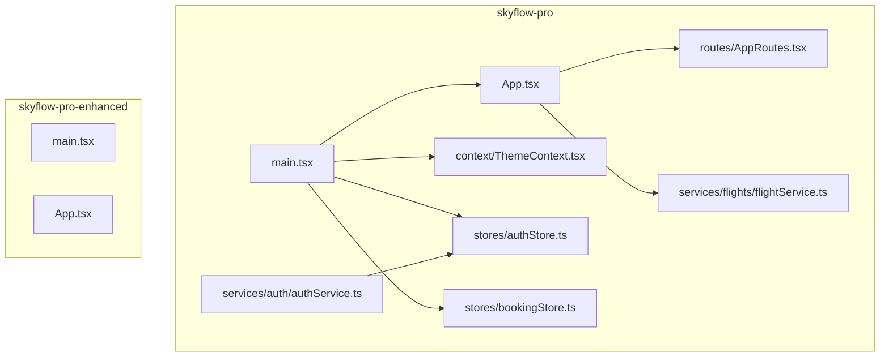
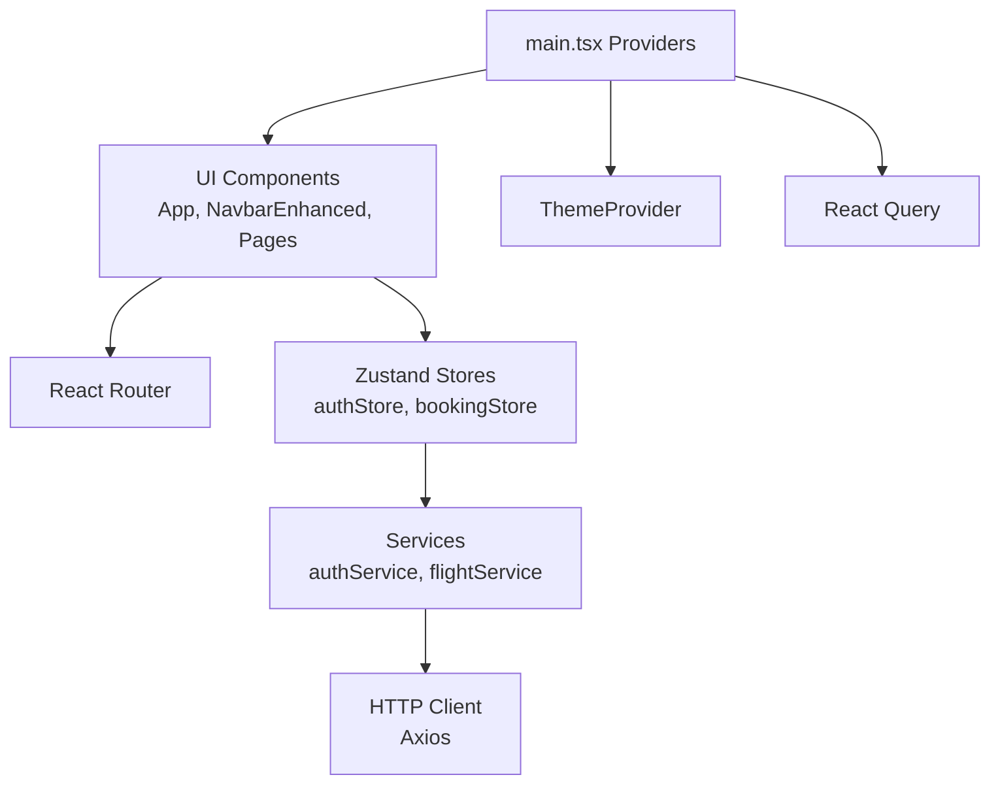
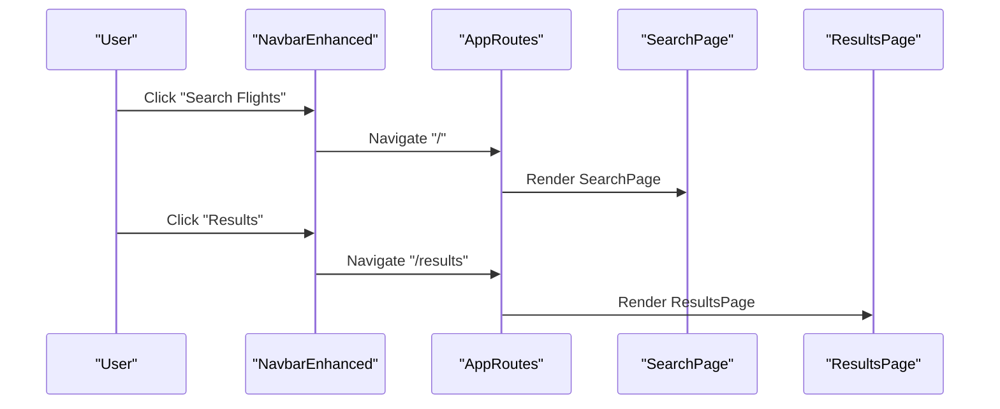
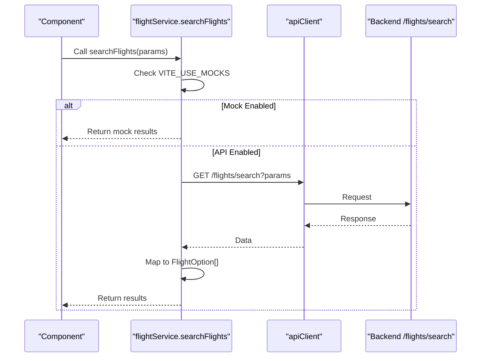
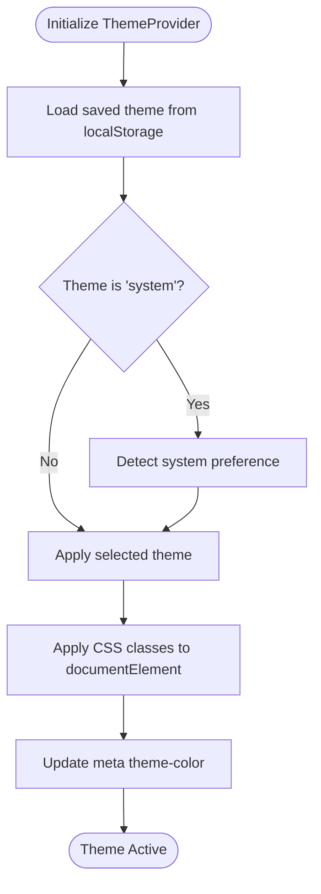
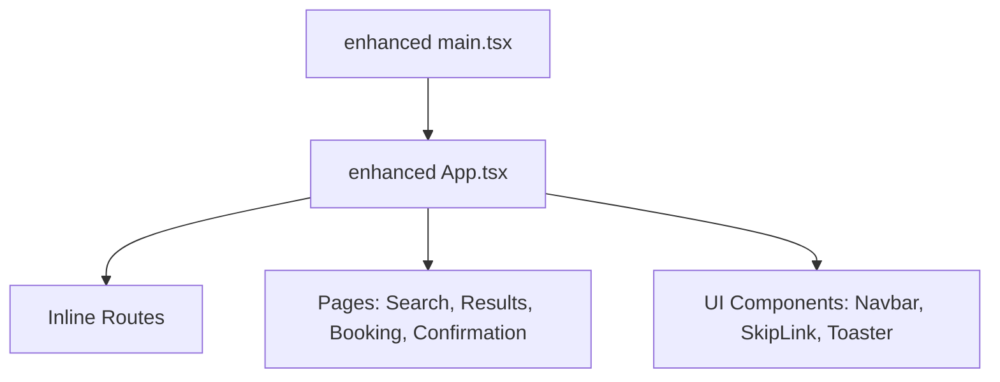
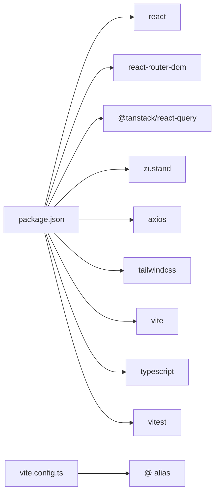

# Frontend Architecture

<cite>
**Referenced Files in This Document**
- [skyflow-pro/src/App.tsx](file://skyflow-pro/src/App.tsx)
- [skyflow-pro/src/main.tsx](file://skyflow-pro/src/main.tsx)
- [skyflow-pro/src/routes/AppRoutes.tsx](file://skyflow-pro/src/routes/AppRoutes.tsx)
- [skyflow-pro/src/stores/index.ts](file://skyflow-pro/src/stores/index.ts)
- [skyflow-pro/src/stores/authStore.ts](file://skyflow-pro/src/stores/authStore.ts)
- [skyflow-pro/src/stores/bookingStore.ts](file://skyflow-pro/src/stores/bookingStore.ts)
- [skyflow-pro/src/services/auth/authService.ts](file://skyflow-pro/src/services/auth/authService.ts)
- [skyflow-pro/src/services/flights/flightService.ts](file://skyflow-pro/src/services/flights/flightService.ts)
- [skyflow-pro/vite.config.ts](file://skyflow-pro/vite.config.ts)
- [skyflow-pro/package.json](file://skyflow-pro/package.json)
- [skyflow-pro/src/context/ThemeContext.tsx](file://skyflow-pro/src/context/ThemeContext.tsx)
- [skyflow-pro/src/components/Header/NavbarEnhanced.tsx](file://skyflow-pro/src/components/Header/NavbarEnhanced.tsx)
- [skyflow-pro-enhanced/src/App.tsx](file://skyflow-pro-enhanced/src/App.tsx)
- [skyflow-pro-enhanced/src/main.tsx](file://skyflow-pro-enhanced/src/main.tsx)
- [skyflow-pro-enhanced/package.json](file://skyflow-pro-enhanced/package.json)
</cite>

## Table of Contents
1. [Introduction](#introduction)
2. [Project Structure](#project-structure)
3. [Core Components](#core-components)
4. [Architecture Overview](#architecture-overview)
5. [Detailed Component Analysis](#detailed-component-analysis)
6. [Dependency Analysis](#dependency-analysis)
7. [Performance Considerations](#performance-considerations)
8. [Troubleshooting Guide](#troubleshooting-guide)
9. [Conclusion](#conclusion)
10. [Appendices](#appendices)

## Introduction
This document describes the frontend architecture of the React/Vite-based SkyFlow Pro application. It covers component hierarchy, state management with Zustand stores, routing configuration, TypeScript implementation, component organization, and the design system using Tailwind CSS. It also documents the service layer architecture, API integration patterns, and mock data usage, along with build configuration, development workflow, and deployment setup. Finally, it compares the enhanced frontend structure in skyflow-pro-enhanced and highlights component reusability patterns, performance optimization, responsive design, and accessibility considerations.

## Project Structure
The frontend is organized into two primary workspaces:
- skyflow-pro: The original, feature-rich implementation with a comprehensive component library, stores, services, and routing.
- skyflow-pro-enhanced: A streamlined, focused version emphasizing reusable UI components, cleaner pages, and simplified service wiring.

Key structural elements:
- Entry points: main.tsx bootstraps providers (React Query, Router, Theme, Toaster) and renders App.tsx.
- Routing: AppRoutes.tsx centralizes route definitions for Search, Results, Booking, and Confirmation pages.
- Stores: Zustand stores manage authentication, booking state, and notifications with localStorage persistence.
- Services: Axios-based API clients integrate with backend endpoints; mock fallbacks are supported via environment flags.
- Theming: ThemeProvider applies light/dark/system themes and persists preferences.
- UI Components: Feature-specific components under components/, pages/, and services/.



**Diagram sources**
- [skyflow-pro/src/main.tsx:1-33](file://skyflow-pro/src/main.tsx#L1-L33)
- [skyflow-pro/src/App.tsx:1-18](file://skyflow-pro/src/App.tsx#L1-L18)
- [skyflow-pro/src/routes/AppRoutes.tsx:1-23](file://skyflow-pro/src/routes/AppRoutes.tsx#L1-L23)
- [skyflow-pro/src/context/ThemeContext.tsx:1-89](file://skyflow-pro/src/context/ThemeContext.tsx#L1-L89)
- [skyflow-pro/src/stores/authStore.ts:1-123](file://skyflow-pro/src/stores/authStore.ts#L1-L123)
- [skyflow-pro/src/stores/bookingStore.ts:1-115](file://skyflow-pro/src/stores/bookingStore.ts#L1-L115)
- [skyflow-pro/src/services/flights/flightService.ts:1-128](file://skyflow-pro/src/services/flights/flightService.ts#L1-L128)
- [skyflow-pro/src/services/auth/authService.ts:1-38](file://skyflow-pro/src/services/auth/authService.ts#L1-L38)
- [skyflow-pro-enhanced/src/main.tsx:1-30](file://skyflow-pro-enhanced/src/main.tsx#L1-L30)
- [skyflow-pro-enhanced/src/App.tsx:1-28](file://skyflow-pro-enhanced/src/App.tsx#L1-L28)

**Section sources**
- [skyflow-pro/src/main.tsx:1-33](file://skyflow-pro/src/main.tsx#L1-L33)
- [skyflow-pro/src/App.tsx:1-18](file://skyflow-pro/src/App.tsx#L1-L18)
- [skyflow-pro/src/routes/AppRoutes.tsx:1-23](file://skyflow-pro/src/routes/AppRoutes.tsx#L1-L23)
- [skyflow-pro/src/context/ThemeContext.tsx:1-89](file://skyflow-pro/src/context/ThemeContext.tsx#L1-L89)
- [skyflow-pro/src/stores/authStore.ts:1-123](file://skyflow-pro/src/stores/authStore.ts#L1-L123)
- [skyflow-pro/src/stores/bookingStore.ts:1-115](file://skyflow-pro/src/stores/bookingStore.ts#L1-L115)
- [skyflow-pro/src/services/flights/flightService.ts:1-128](file://skyflow-pro/src/services/flights/flightService.ts#L1-L128)
- [skyflow-pro/src/services/auth/authService.ts:1-38](file://skyflow-pro/src/services/auth/authService.ts#L1-L38)
- [skyflow-pro-enhanced/src/main.tsx:1-30](file://skyflow-pro-enhanced/src/main.tsx#L1-L30)
- [skyflow-pro-enhanced/src/App.tsx:1-28](file://skyflow-pro-enhanced/src/App.tsx#L1-L28)

## Core Components
- Application shell: App.tsx composes SkipLink, NavbarEnhanced, AppRoutes, and Toaster.
- Root provider: main.tsx wires React Query, Router, ThemeProvider, and ToasterProvider around the app.
- Routing: AppRoutes.tsx defines routes for Search, Results, Booking, and Confirmation pages with wildcard redirect to home.
- Stores: authStore manages user profile, token, authentication state, and booking history with localStorage persistence; bookingStore handles fetching, adding, cancelling, and local demo bookings with API fallbacks.
- Services: flightService integrates with backend /flights/search and maps results to frontend types; supports mock generation via VITE_USE_MOCKS; authService integrates with /auth endpoints and updates the auth store.
- Theming: ThemeProvider reads system preference or user choice, persists to localStorage, and applies CSS classes to documentElement.

**Section sources**
- [skyflow-pro/src/App.tsx:1-18](file://skyflow-pro/src/App.tsx#L1-L18)
- [skyflow-pro/src/main.tsx:1-33](file://skyflow-pro/src/main.tsx#L1-L33)
- [skyflow-pro/src/routes/AppRoutes.tsx:1-23](file://skyflow-pro/src/routes/AppRoutes.tsx#L1-L23)
- [skyflow-pro/src/stores/authStore.ts:1-123](file://skyflow-pro/src/stores/authStore.ts#L1-L123)
- [skyflow-pro/src/stores/bookingStore.ts:1-115](file://skyflow-pro/src/stores/bookingStore.ts#L1-L115)
- [skyflow-pro/src/services/flights/flightService.ts:1-128](file://skyflow-pro/src/services/flights/flightService.ts#L1-L128)
- [skyflow-pro/src/services/auth/authService.ts:1-38](file://skyflow-pro/src/services/auth/authService.ts#L1-L38)
- [skyflow-pro/src/context/ThemeContext.tsx:1-89](file://skyflow-pro/src/context/ThemeContext.tsx#L1-L89)

## Architecture Overview
The frontend follows a layered architecture:
- Presentation Layer: React components (App, NavbarEnhanced, pages) render UI and orchestrate user interactions.
- State Management: Zustand stores encapsulate domain state and side effects, persisted to localStorage.
- Service Layer: Axios-based services abstract API communication and provide mock fallbacks.
- Routing: React Router v6 manages navigation and route parameters.
- Providers: React Query manages caching and background synchronization; ThemeProvider controls theme.



**Diagram sources**
- [skyflow-pro/src/main.tsx:1-33](file://skyflow-pro/src/main.tsx#L1-L33)
- [skyflow-pro/src/App.tsx:1-18](file://skyflow-pro/src/App.tsx#L1-L18)
- [skyflow-pro/src/stores/authStore.ts:1-123](file://skyflow-pro/src/stores/authStore.ts#L1-L123)
- [skyflow-pro/src/stores/bookingStore.ts:1-115](file://skyflow-pro/src/stores/bookingStore.ts#L1-L115)
- [skyflow-pro/src/services/auth/authService.ts:1-38](file://skyflow-pro/src/services/auth/authService.ts#L1-L38)
- [skyflow-pro/src/services/flights/flightService.ts:1-128](file://skyflow-pro/src/services/flights/flightService.ts#L1-L128)
- [skyflow-pro/src/context/ThemeContext.tsx:1-89](file://skyflow-pro/src/context/ThemeContext.tsx#L1-L89)

## Detailed Component Analysis

### State Management with Zustand
- Auth Store: Manages user profile, token, authentication state, and booking history. Provides actions to login, logout, update profile, add booking, and set booking history. Persisted to localStorage with a dedicated storage key.
- Booking Store: Manages bookings, loading/error states, and exposes async actions to fetch, add, and cancel bookings. Includes a local demo booking generator and PNR generation function. Integrates with bookingService and falls back to local state when API fails.

```mermaid
classDiagram
class AuthStore {
+UserProfile user
+string token
+boolean isAuthenticated
+BookingHistoryItem[] bookingHistory
+login(token, user) void
+logout() void
+updateProfile(updates) void
+addBooking(booking) void
+setBookingHistory(history) void
}
class BookingStore {
+Booking[] bookings
+boolean isLoading
+string error
+fetchBookings() Promise~void~
+addBooking(flightId, seatNumber, cabinClass) Promise~Booking~
+addDemoBooking(flight, passenger, seatNumber) { pnr }
+cancelBooking(id) Promise~void~
+getBookingById(id) Booking
}
AuthStore <.. BookingStore : "consumes user context"
```

**Diagram sources**
- [skyflow-pro/src/stores/authStore.ts:1-123](file://skyflow-pro/src/stores/authStore.ts#L1-L123)
- [skyflow-pro/src/stores/bookingStore.ts:1-115](file://skyflow-pro/src/stores/bookingStore.ts#L1-L115)

**Section sources**
- [skyflow-pro/src/stores/authStore.ts:1-123](file://skyflow-pro/src/stores/authStore.ts#L1-L123)
- [skyflow-pro/src/stores/bookingStore.ts:1-115](file://skyflow-pro/src/stores/bookingStore.ts#L1-L115)
- [skyflow-pro/src/stores/index.ts:1-8](file://skyflow-pro/src/stores/index.ts#L1-L8)

### Routing Configuration
- Centralized routes: AppRoutes.tsx defines "/" (SearchPage), "/results" (ResultsPage), "/booking/:flightId" (BookingPage), "/confirmation/:bookingId" (ConfirmationPage), and a wildcard redirect to "/".
- Navigation: NavbarEnhanced provides links to Search and Results; mobile menu toggles and responsive behavior.



**Diagram sources**
- [skyflow-pro/src/components/Header/NavbarEnhanced.tsx:1-120](file://skyflow-pro/src/components/Header/NavbarEnhanced.tsx#L1-L120)
- [skyflow-pro/src/routes/AppRoutes.tsx:1-23](file://skyflow-pro/src/routes/AppRoutes.tsx#L1-L23)

**Section sources**
- [skyflow-pro/src/routes/AppRoutes.tsx:1-23](file://skyflow-pro/src/routes/AppRoutes.tsx#L1-L23)
- [skyflow-pro/src/components/Header/NavbarEnhanced.tsx:1-120](file://skyflow-pro/src/components/Header/NavbarEnhanced.tsx#L1-L120)

### Service Layer and API Integration
- Flight Service: Implements searchFlights with backend integration and mock fallback. Converts cabin classes to backend values and maps responses to frontend FlightOption types. Supports round-trip search and graceful degradation to mock data when API fails.
- Auth Service: Calls /auth endpoints and updates Zustand auth store with token and user profile.
- HTTP Client: Axios-based client configured in services/api (referenced by services) with centralized proxy configuration in Vite.



**Diagram sources**
- [skyflow-pro/src/services/flights/flightService.ts:1-128](file://skyflow-pro/src/services/flights/flightService.ts#L1-L128)

**Section sources**
- [skyflow-pro/src/services/flights/flightService.ts:1-128](file://skyflow-pro/src/services/flights/flightService.ts#L1-L128)
- [skyflow-pro/src/services/auth/authService.ts:1-38](file://skyflow-pro/src/services/auth/authService.ts#L1-L38)
- [skyflow-pro/vite.config.ts:1-53](file://skyflow-pro/vite.config.ts#L1-L53)

### Theme and Design System
- ThemeProvider: Manages theme selection (light, dark, system), persists to localStorage, and applies CSS classes to documentElement. Updates meta theme-color accordingly.
- Tailwind CSS: Utility-first CSS framework integrated via Vite and PostCSS; color tokens and responsive utilities are used across components.



**Diagram sources**
- [skyflow-pro/src/context/ThemeContext.tsx:1-89](file://skyflow-pro/src/context/ThemeContext.tsx#L1-L89)

**Section sources**
- [skyflow-pro/src/context/ThemeContext.tsx:1-89](file://skyflow-pro/src/context/ThemeContext.tsx#L1-L89)

### Enhanced Frontend Structure (skyflow-pro-enhanced)
- Simplified composition: App.tsx directly defines routes and renders UI components without centralized routes module.
- Minimal providers: main.tsx wires QueryClient, Router, and ToasterProvider; ThemeProvider is omitted, relying on simpler theming.
- Component reusability: UI components (Navbar, SkipLink, Toaster) are placed under components/ui for reuse across pages.



**Diagram sources**
- [skyflow-pro-enhanced/src/main.tsx:1-30](file://skyflow-pro-enhanced/src/main.tsx#L1-L30)
- [skyflow-pro-enhanced/src/App.tsx:1-28](file://skyflow-pro-enhanced/src/App.tsx#L1-L28)

**Section sources**
- [skyflow-pro-enhanced/src/main.tsx:1-30](file://skyflow-pro-enhanced/src/main.tsx#L1-L30)
- [skyflow-pro-enhanced/src/App.tsx:1-28](file://skyflow-pro-enhanced/src/App.tsx#L1-L28)

## Dependency Analysis
- Core libraries: React, React Router, React Query, Zustand, Axios, Tailwind CSS, Vite.
- Build and testing: TypeScript, ESLint, Vitest, PostCSS, autoprefixer.
- Aliasing: Vite resolves @ to src for clean imports across modules.



**Diagram sources**
- [skyflow-pro/package.json:1-46](file://skyflow-pro/package.json#L1-L46)
- [skyflow-pro-enhanced/package.json:1-46](file://skyflow-pro-enhanced/package.json#L1-L46)
- [skyflow-pro/vite.config.ts:1-53](file://skyflow-pro/vite.config.ts#L1-L53)

**Section sources**
- [skyflow-pro/package.json:1-46](file://skyflow-pro/package.json#L1-L46)
- [skyflow-pro-enhanced/package.json:1-46](file://skyflow-pro-enhanced/package.json#L1-L46)
- [skyflow-pro/vite.config.ts:1-53](file://skyflow-pro/vite.config.ts#L1-L53)

## Performance Considerations
- React Query defaults: retry attempts, disabled window focus refetch, and short staleTime reduce unnecessary network calls and improve responsiveness.
- Zustand persistence: LocalStorage-backed stores minimize server round trips for user and booking state during initial loads.
- Mock fallbacks: Environment-controlled mock mode reduces API dependency during development and provides deterministic results.
- Component-level rendering: NavbarEnhanced uses conditional panels and memoization-friendly state to avoid heavy re-renders.
- Build pipeline: Vite’s dev server and optimized production builds minimize bundle sizes and enable fast HMR.

[No sources needed since this section provides general guidance]

## Troubleshooting Guide
- API connectivity: Verify Vite proxy configuration for /api, /auth, /flights, /bookings, and /chat targets. Confirm backend availability at http://localhost:8081.
- Mock mode: Set VITE_USE_MOCKS=true to bypass backend and use mock data generators in flightService.
- Authentication: Ensure authService.login updates the auth store and persists token/user profile. Check localStorage keys for theme and auth persistence.
- Theme issues: Confirm ThemeProvider is mounted and localStorage key exists. Verify meta theme-color updates.
- Routing errors: Ensure AppRoutes matches actual page paths and wildcard redirects to "/".
- Testing: Run tests with Vitest and coverage to validate components and services.

**Section sources**
- [skyflow-pro/vite.config.ts:1-53](file://skyflow-pro/vite.config.ts#L1-L53)
- [skyflow-pro/src/services/flights/flightService.ts:1-128](file://skyflow-pro/src/services/flights/flightService.ts#L1-L128)
- [skyflow-pro/src/services/auth/authService.ts:1-38](file://skyflow-pro/src/services/auth/authService.ts#L1-L38)
- [skyflow-pro/src/context/ThemeContext.tsx:1-89](file://skyflow-pro/src/context/ThemeContext.tsx#L1-L89)
- [skyflow-pro/src/routes/AppRoutes.tsx:1-23](file://skyflow-pro/src/routes/AppRoutes.tsx#L1-L23)

## Conclusion
The SkyFlow Pro frontend employs a clean, modular architecture leveraging React, React Router, Zustand, and React Query. State is centralized in lightweight stores with persistence, services abstract API integration with robust fallbacks, and routing is centralized for maintainability. The enhanced frontend streamlines component composition and focuses on reusable UI elements. The design system relies on Tailwind utilities, while theme management ensures consistent appearance across light/dark/system modes. Development and testing workflows are supported by Vite, TypeScript, and Vitest, enabling rapid iteration and reliable quality assurance.

[No sources needed since this section summarizes without analyzing specific files]

## Appendices

### Build Configuration and Development Workflow
- Scripts: dev, build, lint, preview, test, test:ui, coverage.
- Dev server: Proxy routes to backend; environment-driven mock mode.
- Type checking: TypeScript configuration files for app and node environments.
- Styling: Tailwind CSS with PostCSS and autoprefixer.

**Section sources**
- [skyflow-pro/package.json:1-46](file://skyflow-pro/package.json#L1-L46)
- [skyflow-pro/vite.config.ts:1-53](file://skyflow-pro/vite.config.ts#L1-L53)
- [skyflow-pro/tsconfig.app.json:1-200](file://skyflow-pro/tsconfig.app.json#L1-L200)
- [skyflow-pro/tsconfig.node.json:1-200](file://skyflow-pro/tsconfig.node.json#L1-L200)

### Accessibility and Responsive Design Notes
- SkipLink improves keyboard navigation.
- Semantic HTML and aria-labels in interactive elements (buttons, menus).
- Responsive breakpoints and mobile-first design using Tailwind utilities.
- Focus management and visible focus indicators in interactive components.

[No sources needed since this section provides general guidance]