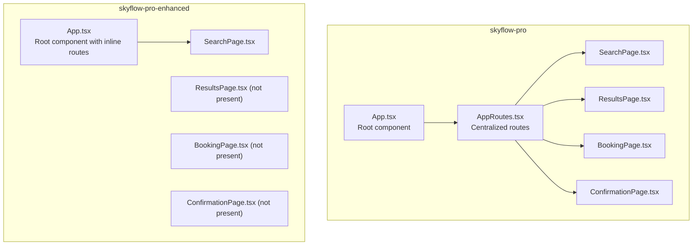
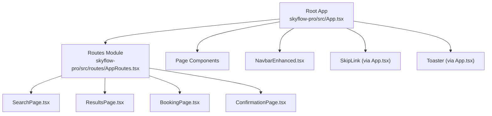
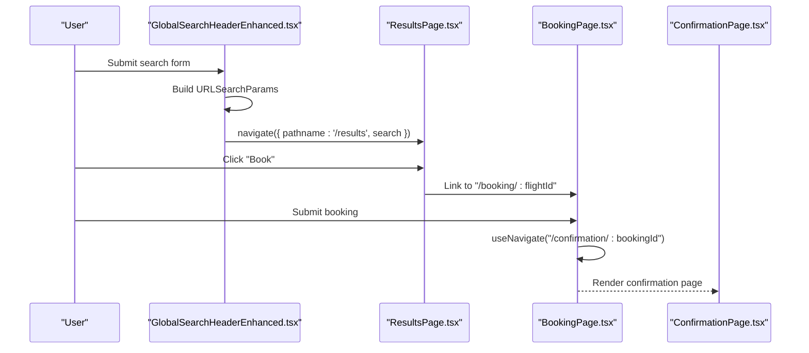
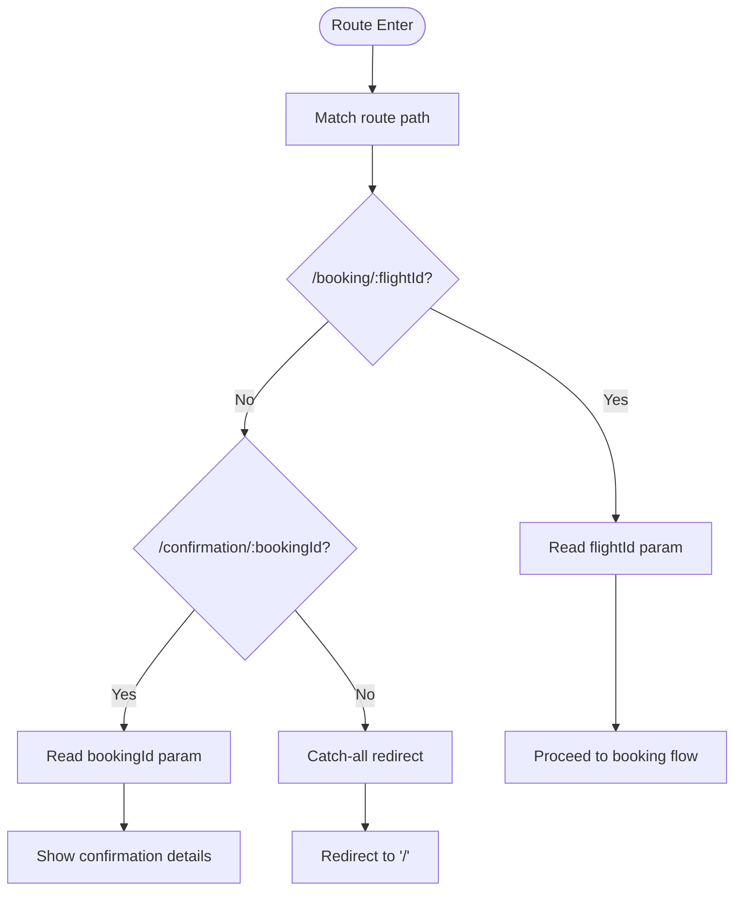
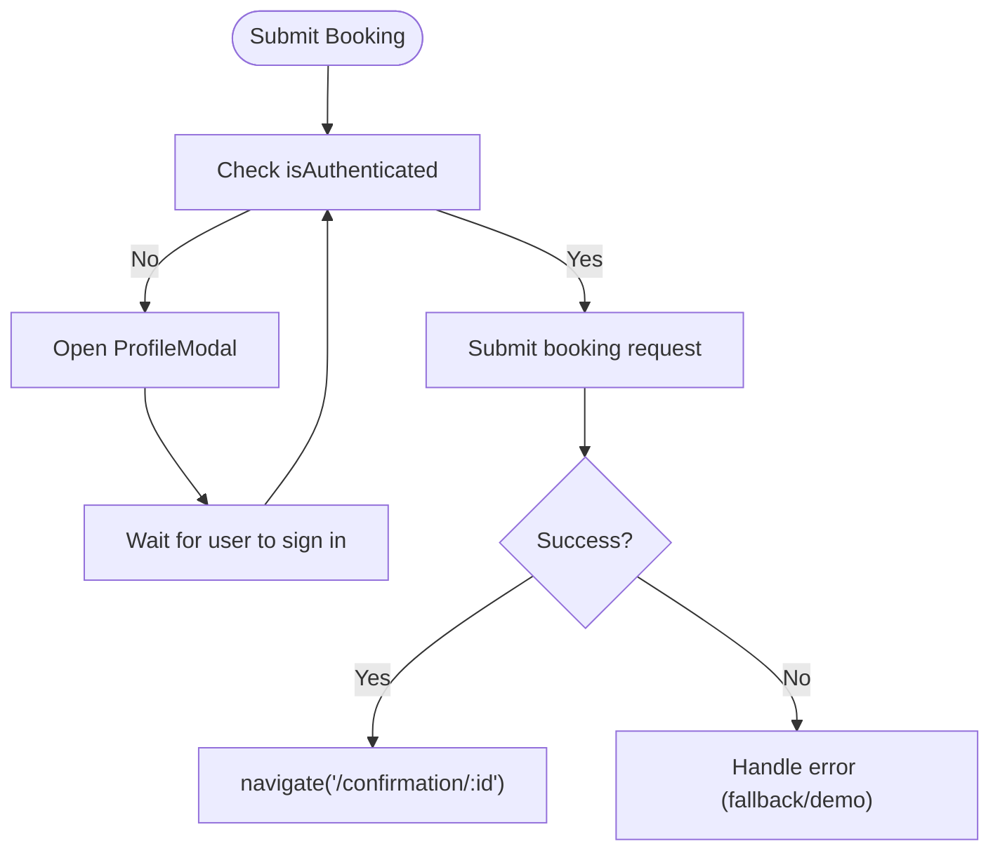
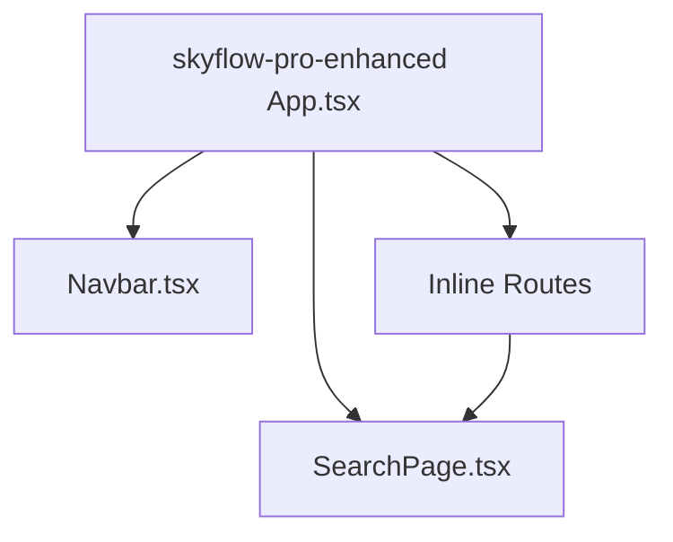
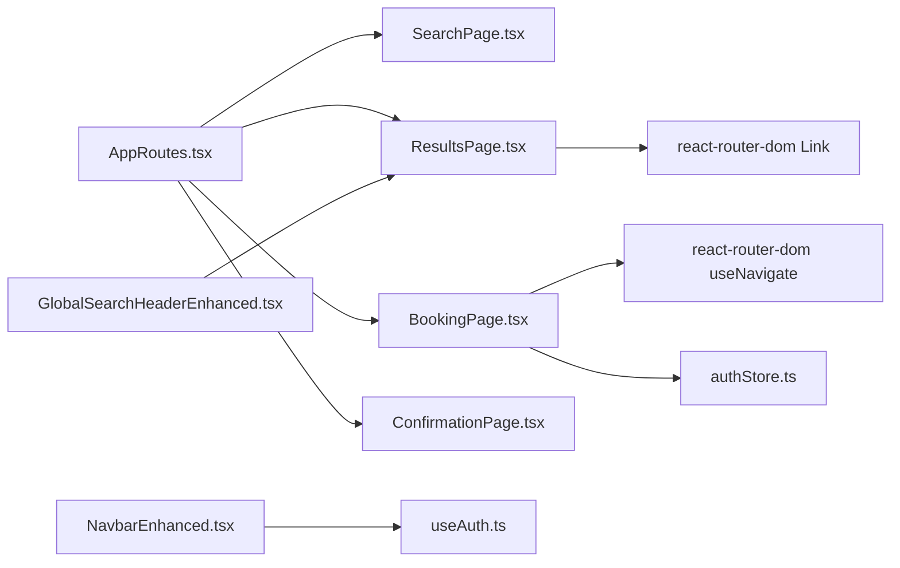

# Routing and Navigation

<cite>
**Referenced Files in This Document**
- [App.tsx](file://skyflow-pro/src/App.tsx)
- [AppRoutes.tsx](file://skyflow-pro/src/routes/AppRoutes.tsx)
- [App.tsx](file://skyflow-pro-enhanced/src/App.tsx)
- [SearchPage.tsx](file://skyflow-pro/src/pages/SearchFlights/SearchPage.tsx)
- [ResultsPage.tsx](file://skyflow-pro/src/pages/FlightResults/ResultsPage.tsx)
- [BookingPage.tsx](file://skyflow-pro/src/pages/Booking/BookingPage.tsx)
- [ConfirmationPage.tsx](file://skyflow-pro/src/pages/BookingConfirmation/ConfirmationPage.tsx)
- [SearchPage.tsx](file://skyflow-pro-enhanced/src/pages/SearchPage.tsx)
- [NavbarEnhanced.tsx](file://skyflow-pro/src/components/Header/NavbarEnhanced.tsx)
- [Navbar.tsx](file://skyflow-pro-enhanced/src/components/ui/Navbar.tsx)
- [GlobalSearchHeaderEnhanced.tsx](file://skyflow-pro/src/components/features/flights/search/GlobalSearchHeaderEnhanced.tsx)
- [GlobalSearchHeader.tsx](file://skyflow-pro-enhanced/src/components/global-search/GlobalSearchHeader.tsx)
- [authStore.ts](file://skyflow-pro/src/stores/authStore.ts)
- [useAuth.ts](file://skyflow-pro/src/hooks/useAuth.ts)
- [httpClient.ts](file://skyflow-pro-enhanced/src/services/httpClient.ts)
</cite>

## Table of Contents
1. [Introduction](#introduction)
2. [Project Structure](#project-structure)
3. [Core Components](#core-components)
4. [Architecture Overview](#architecture-overview)
5. [Detailed Component Analysis](#detailed-component-analysis)
6. [Dependency Analysis](#dependency-analysis)
7. [Performance Considerations](#performance-considerations)
8. [Troubleshooting Guide](#troubleshooting-guide)
9. [Conclusion](#conclusion)
10. [Appendices](#appendices)

## Introduction
This document explains the React Router DOM configuration and navigation system used in the SkyFlow Pro applications. It covers route definitions, dynamic routing with parameters, programmatic navigation, navigation guards, route protection for authenticated users, and enhancements introduced in the skyflow-pro-enhanced variant. It also documents patterns for lazy loading, breadcrumbs, SEO and meta tag management, accessibility in navigation, best practices, and common pitfalls.

## Project Structure
The routing system is implemented in two variants:
- skyflow-pro: A feature-rich client with centralized route definitions and a dedicated routes module.
- skyflow-pro-enhanced: A streamlined client with route definitions embedded directly in the root App component.

Both variants define four primary routes:
- Home: Search flights
- Results: Display flight search results
- Booking: Passenger and payment form with dynamic parameter flightId
- Confirmation: Booking confirmation page with dynamic parameter bookingId
- Catch-all: Redirect to home for unmatched paths

**Diagram sources**
- [App.tsx:1-18](file://skyflow-pro/src/App.tsx#L1-L18)
- [AppRoutes.tsx:1-23](file://skyflow-pro/src/routes/AppRoutes.tsx#L1-L23)
- [App.tsx:1-28](file://skyflow-pro-enhanced/src/App.tsx#L1-L28)

**Section sources**
- [App.tsx:1-18](file://skyflow-pro/src/App.tsx#L1-L18)
- [AppRoutes.tsx:1-23](file://skyflow-pro/src/routes/AppRoutes.tsx#L1-L23)
- [App.tsx:1-28](file://skyflow-pro-enhanced/src/App.tsx#L1-L28)

## Core Components
- Route definitions: Centralized in skyflow-pro via AppRoutes.tsx; embedded in skyflow-pro-enhanced’s App.tsx.
- Programmatic navigation: Implemented using react-router-dom’s useNavigate and useSearchParams hooks.
- Dynamic routing: Two routes use path parameters: /booking/:flightId and /confirmation/:bookingId.
- Navigation guards and protection: Authentication state is checked in the booking flow; unauthenticated users are prompted to sign in before proceeding.
- Nested routing pattern: The App component wraps Routes with shared UI elements (header, skip link, toaster), enabling a nested layout around routed views.
- Enhanced routing structure in skyflow-pro-enhanced: Simplified route nesting with a minimal App wrapper and a single Navbar component.

**Section sources**
- [AppRoutes.tsx:12-22](file://skyflow-pro/src/routes/AppRoutes.tsx#L12-L22)
- [App.tsx:10-25](file://skyflow-pro-enhanced/src/App.tsx#L10-L25)
- [BookingPage.tsx:94-104](file://skyflow-pro/src/pages/Booking/BookingPage.tsx#L94-L104)
- [authStore.ts:30-40](file://skyflow-pro/src/stores/authStore.ts#L30-L40)

## Architecture Overview
The routing architecture follows a simple, layered pattern:
- Root component renders shared UI (navigation bar, skip link, toaster).
- Routes render page components.
- Page components orchestrate navigation and data fetching.

**Diagram sources**
- [App.tsx:6-14](file://skyflow-pro/src/App.tsx#L6-L14)
- [AppRoutes.tsx:12-22](file://skyflow-pro/src/routes/AppRoutes.tsx#L12-L22)
- [NavbarEnhanced.tsx:17-31](file://skyflow-pro/src/components/Header/NavbarEnhanced.tsx#L17-L31)

## Detailed Component Analysis

### Route Definitions and Programmatic Navigation
- skyflow-pro centralizes routes in AppRoutes.tsx, returning a Routes tree with four routes plus a catch-all redirect.
- skyflow-pro-enhanced embeds routes directly in App.tsx for simplicity.
- Programmatic navigation is used extensively:
  - GlobalSearchHeaderEnhanced.tsx builds URLSearchParams and navigates to /results with query parameters.
  - ResultsPage.tsx uses Link to navigate back to the search form.
  - BookingPage.tsx uses useNavigate to move to the confirmation route after successful booking.
  - ConfirmationPage.tsx uses Link to return to the home page.

**Diagram sources**
- [GlobalSearchHeaderEnhanced.tsx:60-80](file://skyflow-pro/src/components/features/flights/search/GlobalSearchHeaderEnhanced.tsx#L60-L80)
- [ResultsPage.tsx:122-128](file://skyflow-pro/src/pages/FlightResults/ResultsPage.tsx#L122-L128)
- [BookingPage.tsx:118-118](file://skyflow-pro/src/pages/Booking/BookingPage.tsx#L118-L118)
- [ConfirmationPage.tsx:28-41](file://skyflow-pro/src/pages/BookingConfirmation/ConfirmationPage.tsx#L28-L41)

**Section sources**
- [AppRoutes.tsx:12-22](file://skyflow-pro/src/routes/AppRoutes.tsx#L12-L22)
- [App.tsx:15-21](file://skyflow-pro-enhanced/src/App.tsx#L15-L21)
- [GlobalSearchHeaderEnhanced.tsx:60-80](file://skyflow-pro/src/components/features/flights/search/GlobalSearchHeaderEnhanced.tsx#L60-L80)
- [ResultsPage.tsx:122-128](file://skyflow-pro/src/pages/FlightResults/ResultsPage.tsx#L122-L128)
- [BookingPage.tsx:118-118](file://skyflow-pro/src/pages/Booking/BookingPage.tsx#L118-L118)
- [ConfirmationPage.tsx:28-41](file://skyflow-pro/src/pages/BookingConfirmation/ConfirmationPage.tsx#L28-L41)

### Dynamic Routing with Parameters
- /booking/:flightId: The booking page reads the flightId parameter and uses it to process the booking.
- /confirmation/:bookingId: The confirmation page reads the bookingId parameter to display booking details.
- Parameter extraction and usage occur via useParams in both pages.

**Diagram sources**
- [BookingPage.tsx:32-34](file://skyflow-pro/src/pages/Booking/BookingPage.tsx#L32-L34)
- [ConfirmationPage.tsx:28-28](file://skyflow-pro/src/pages/BookingConfirmation/ConfirmationPage.tsx#L28-L28)
- [AppRoutes.tsx:17-19](file://skyflow-pro/src/routes/AppRoutes.tsx#L17-L19)

**Section sources**
- [BookingPage.tsx:32-34](file://skyflow-pro/src/pages/Booking/BookingPage.tsx#L32-L34)
- [ConfirmationPage.tsx:28-28](file://skyflow-pro/src/pages/BookingConfirmation/ConfirmationPage.tsx#L28-L28)
- [AppRoutes.tsx:17-19](file://skyflow-pro/src/routes/AppRoutes.tsx#L17-L19)

### Navigation Guards and Route Protection
- Authentication state is managed in authStore.ts with Zustand and persisted to localStorage.
- The booking flow checks isAuthenticated; if false, it prompts the user to sign in via a modal rather than blocking navigation.
- useAuth is re-exported via a dedicated hook for consistent consumption.

**Diagram sources**
- [BookingPage.tsx:94-104](file://skyflow-pro/src/pages/Booking/BookingPage.tsx#L94-L104)
- [authStore.ts:30-40](file://skyflow-pro/src/stores/authStore.ts#L30-L40)
- [useAuth.ts:1-7](file://skyflow-pro/src/hooks/useAuth.ts#L1-L7)

**Section sources**
- [authStore.ts:30-40](file://skyflow-pro/src/stores/authStore.ts#L30-L40)
- [BookingPage.tsx:94-104](file://skyflow-pro/src/pages/Booking/BookingPage.tsx#L94-L104)
- [useAuth.ts:1-7](file://skyflow-pro/src/hooks/useAuth.ts#L1-L7)

### Enhanced Routing Structure in skyflow-pro-enhanced
- Simplified App.tsx with inline routes and a lightweight Navbar component.
- SearchPage.tsx provides the landing experience with a global search header.
- The enhanced variant does not include ResultsPage.tsx, BookingPage.tsx, or ConfirmationPage.tsx, indicating a reduced scope focused on search and basic navigation.

**Diagram sources**
- [App.tsx:10-25](file://skyflow-pro-enhanced/src/App.tsx#L10-L25)
- [Navbar.tsx:5-13](file://skyflow-pro-enhanced/src/components/ui/Navbar.tsx#L5-L13)
- [SearchPage.tsx:43-88](file://skyflow-pro-enhanced/src/pages/SearchPage.tsx#L43-L88)

**Section sources**
- [App.tsx:10-25](file://skyflow-pro-enhanced/src/App.tsx#L10-L25)
- [Navbar.tsx:5-13](file://skyflow-pro-enhanced/src/components/ui/Navbar.tsx#L5-L13)
- [SearchPage.tsx:43-88](file://skyflow-pro-enhanced/src/pages/SearchPage.tsx#L43-L88)

### Component-Based Routing Patterns
- Shared UI: Both variants wrap Routes with a common header (NavbarEnhanced.tsx in skyflow-pro, Navbar.tsx in enhanced) and a skip link/toaster for accessibility and UX.
- Page composition: Each route maps to a dedicated page component that encapsulates its own navigation and data logic.
- Search-to-results flow: The search form component constructs query parameters and navigates to the results route, demonstrating declarative routing with programmatic navigation.

**Section sources**
- [NavbarEnhanced.tsx:17-31](file://skyflow-pro/src/components/Header/NavbarEnhanced.tsx#L17-L31)
- [Navbar.tsx:5-13](file://skyflow-pro-enhanced/src/components/ui/Navbar.tsx#L5-L13)
- [GlobalSearchHeaderEnhanced.tsx:60-80](file://skyflow-pro/src/components/features/flights/search/GlobalSearchHeaderEnhanced.tsx#L60-L80)

### Lazy Loading Strategies
- Current implementation: Routes are imported statically at the top of the routes module or App component.
- Recommended approach: Use React.lazy and Suspense to split bundles by route/page. For example, lazily import ResultsPage, BookingPage, and ConfirmationPage to reduce initial bundle size.
- Benefits: Faster initial load, improved LCP and FID metrics, especially for larger applications.

[No sources needed since this section provides general guidance]

### Breadcrumb Navigation
- Current implementation: No explicit breadcrumb component is present in the routing layer.
- Recommendation: Introduce a breadcrumb component that derives path segments from the current location and renders links to parent routes. Use location state or a mapping of routes to labels to generate accurate breadcrumbs.

[No sources needed since this section provides general guidance]

### SEO Considerations and Meta Tags Management
- Current implementation: No dedicated meta tag management is visible in the routing layer.
- Recommendations:
  - Use a meta tag management library (e.g., react-helmet) to set page titles, descriptions, and canonical URLs per route.
  - Define route-specific metadata in page components and render it conditionally.
  - Ensure server-side rendering or pre-rendering is configured for critical pages to improve SEO visibility.

[No sources needed since this section provides general guidance]

### Accessibility in Navigation
- Skip link: Present in both App components to improve keyboard navigation.
- Active link indicators: NavbarEnhanced.tsx and Navbar.tsx highlight active links based on location.
- ARIA attributes: Search forms and buttons include aria-labels and aria-describedby for assistive technologies.
- Focus management: Ensure focus is programmatically returned to meaningful elements after navigation.

**Section sources**
- [App.tsx:9-9](file://skyflow-pro/src/App.tsx#L9-L9)
- [App.tsx:13-13](file://skyflow-pro-enhanced/src/App.tsx#L13-L13)
- [NavbarEnhanced.tsx:53-56](file://skyflow-pro/src/components/Header/NavbarEnhanced.tsx#L53-L56)
- [Navbar.tsx:37-46](file://skyflow-pro-enhanced/src/components/ui/Navbar.tsx#L37-L46)

## Dependency Analysis
- Route-to-page dependencies:
  - AppRoutes.tsx depends on page components for each route.
  - App.tsx (enhanced) depends on Navbar and page components directly.
- Navigation dependencies:
  - GlobalSearchHeaderEnhanced.tsx depends on react-router-dom’s useNavigate and URLSearchParams.
  - ResultsPage.tsx and BookingPage.tsx depend on Link and useNavigate respectively.
- State dependencies:
  - BookingPage.tsx depends on authStore.ts for authentication state.
  - NavbarEnhanced.tsx consumes useAuth for profile and unread notifications.

**Diagram sources**
- [AppRoutes.tsx:6-10](file://skyflow-pro/src/routes/AppRoutes.tsx#L6-L10)
- [GlobalSearchHeaderEnhanced.tsx:14-14](file://skyflow-pro/src/components/features/flights/search/GlobalSearchHeaderEnhanced.tsx#L14-L14)
- [ResultsPage.tsx:1-2](file://skyflow-pro/src/pages/FlightResults/ResultsPage.tsx#L1-L2)
- [BookingPage.tsx:2-2](file://skyflow-pro/src/pages/Booking/BookingPage.tsx#L2-L2)
- [authStore.ts:30-40](file://skyflow-pro/src/stores/authStore.ts#L30-L40)
- [NavbarEnhanced.tsx:9-10](file://skyflow-pro/src/components/Header/NavbarEnhanced.tsx#L9-L10)

**Section sources**
- [AppRoutes.tsx:6-10](file://skyflow-pro/src/routes/AppRoutes.tsx#L6-L10)
- [GlobalSearchHeaderEnhanced.tsx:14-14](file://skyflow-pro/src/components/features/flights/search/GlobalSearchHeaderEnhanced.tsx#L14-L14)
- [ResultsPage.tsx:1-2](file://skyflow-pro/src/pages/FlightResults/ResultsPage.tsx#L1-L2)
- [BookingPage.tsx:2-2](file://skyflow-pro/src/pages/Booking/BookingPage.tsx#L2-L2)
- [authStore.ts:30-40](file://skyflow-pro/src/stores/authStore.ts#L30-L40)
- [NavbarEnhanced.tsx:9-10](file://skyflow-pro/src/components/Header/NavbarEnhanced.tsx#L9-L10)

## Performance Considerations
- Bundle size: Consider lazy loading route components to reduce initial payload.
- Navigation performance: Avoid unnecessary re-renders by memoizing derived values (e.g., URL parameters) and using shallow routing state.
- Network resilience: The enhanced httpClient.ts demonstrates retry/backoff and circuit breaker patterns that can be leveraged during navigation-dependent data fetches.

**Section sources**
- [httpClient.ts:37-82](file://skyflow-pro-enhanced/src/services/httpClient.ts#L37-L82)

## Troubleshooting Guide
- Unexpected redirects to home:
  - Verify catch-all route configuration and ensure correct path precedence.
- Dynamic parameter mismatches:
  - Confirm parameter names in routes match useParams usage in page components.
- Authentication guard not working:
  - Ensure useAuth is properly initialized and persisted; verify state updates on login/logout.
- Navigation errors:
  - Check for typos in route paths and ensure Link and useNavigate are used consistently.

**Section sources**
- [AppRoutes.tsx:19-19](file://skyflow-pro/src/routes/AppRoutes.tsx#L19-L19)
- [BookingPage.tsx:32-34](file://skyflow-pro/src/pages/Booking/BookingPage.tsx#L32-L34)
- [authStore.ts:45-90](file://skyflow-pro/src/stores/authStore.ts#L45-L90)

## Conclusion
The SkyFlow Pro applications implement a clean, layered routing architecture centered on React Router DOM. Routes are either centralized (skyflow-pro) or embedded (skyflow-pro-enhanced), with robust programmatic navigation and dynamic parameter handling. Authentication is enforced at the booking stage using a state store, and the UI remains accessible and responsive. Extending the system with lazy loading, breadcrumbs, and meta tag management will further improve performance, SEO, and user experience.

## Appendices

### Best Practices and Common Pitfalls
- Best practices:
  - Centralize route definitions for maintainability (skyflow-pro approach).
  - Use programmatic navigation for dynamic flows and Link for static navigation.
  - Guard sensitive flows with authentication state checks.
  - Implement lazy loading for large route components.
  - Add breadcrumbs and meta tags for better UX and SEO.
- Common pitfalls:
  - Forgetting catch-all redirects leading to blank screens.
  - Mismatched parameter names causing runtime errors.
  - Overlooking accessibility attributes in navigation elements.
  - Not accounting for network failures during navigation-dependent requests.

[No sources needed since this section provides general guidance]