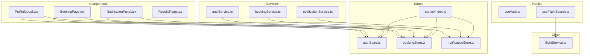
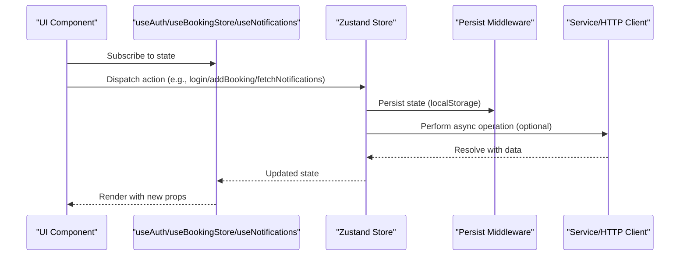
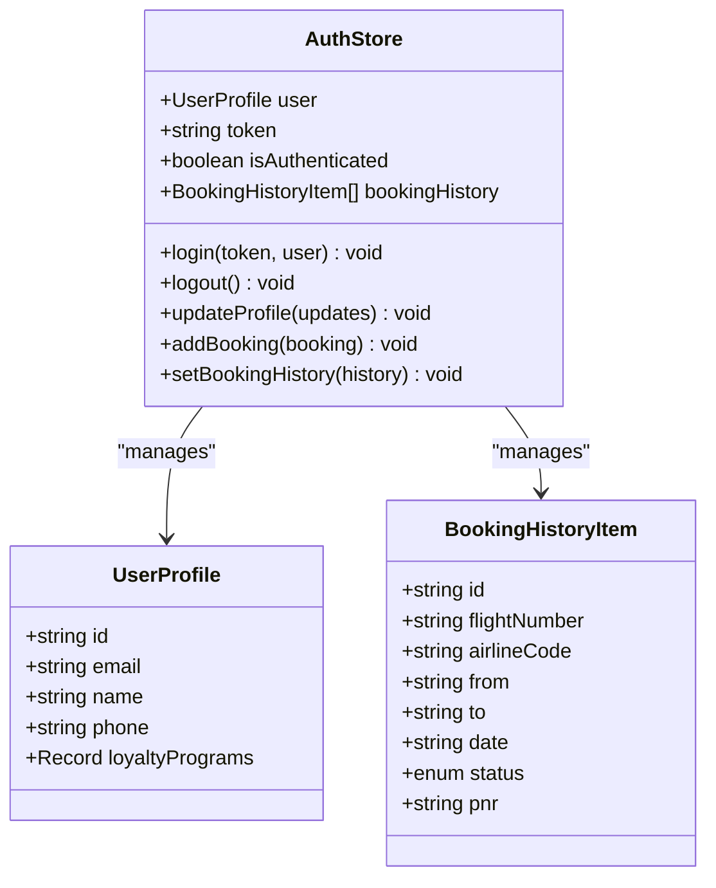
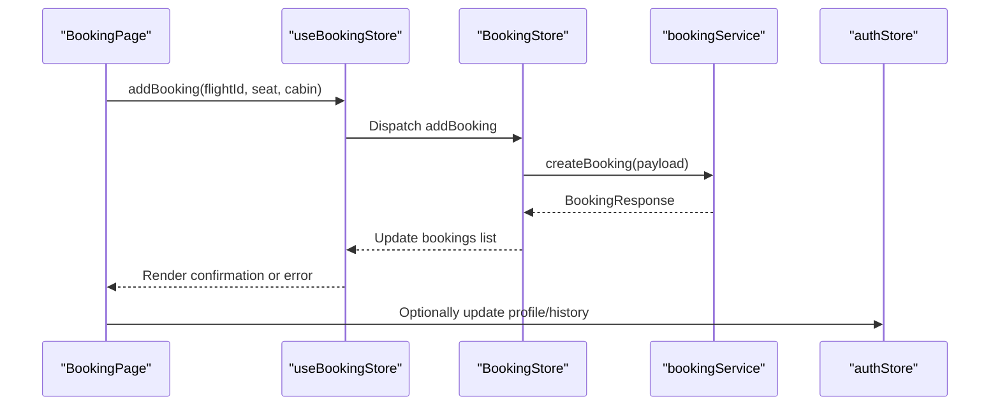
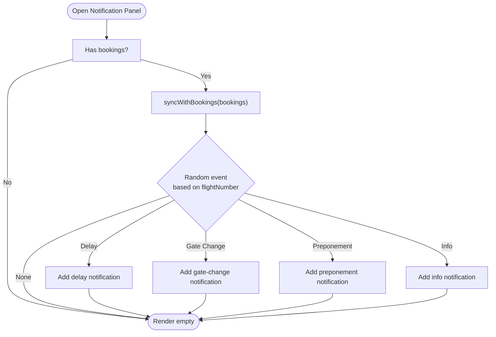
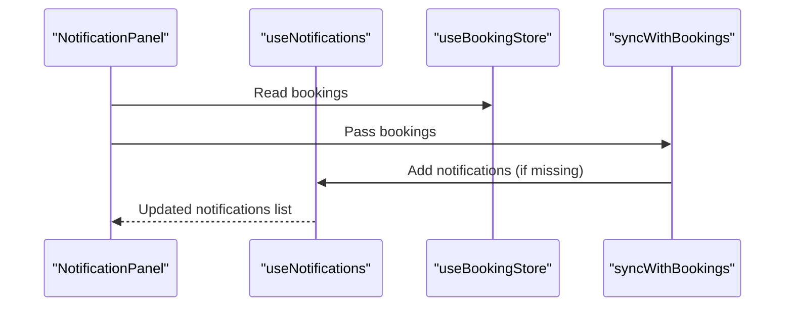
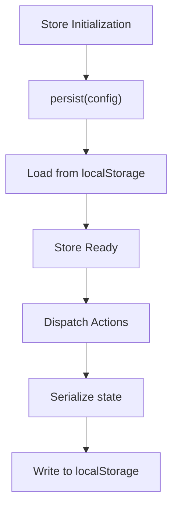
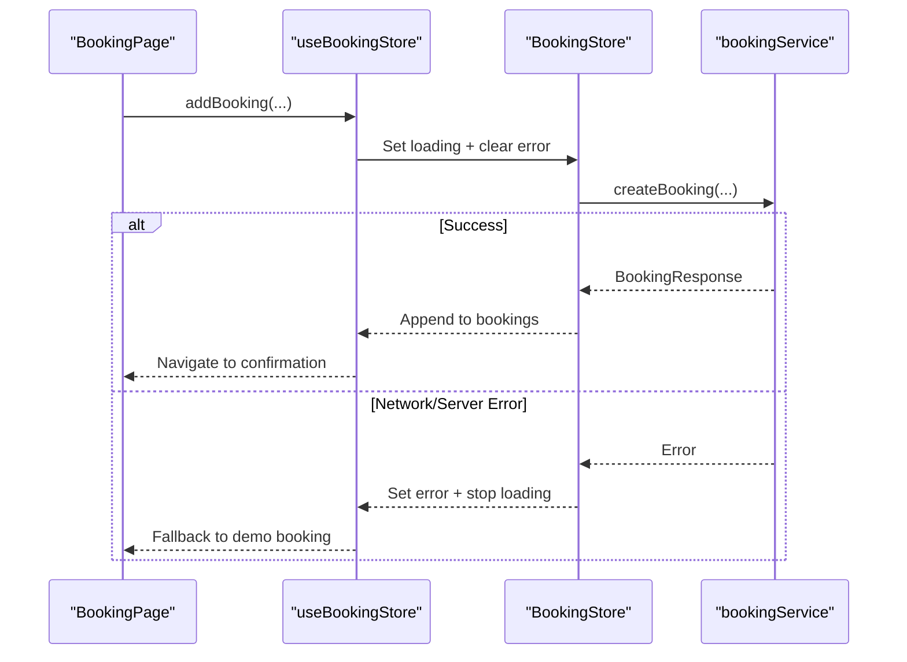
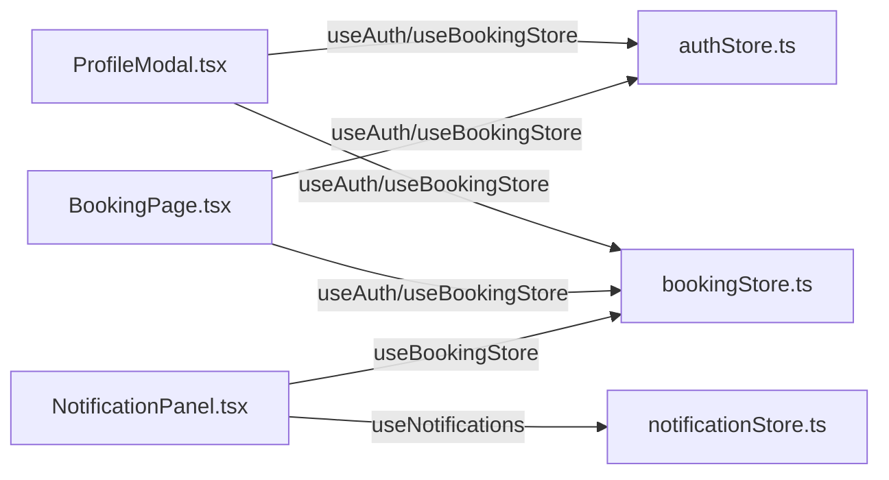
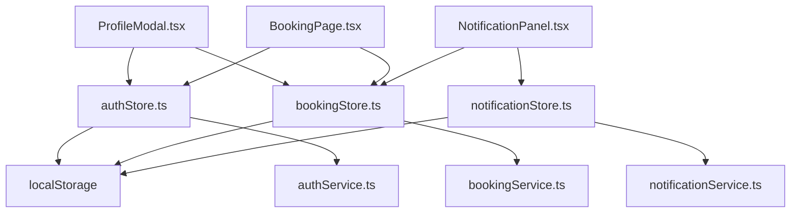

# State Management

<cite>
**Referenced Files in This Document**
- [authStore.ts](file://skyflow-pro/src/stores/authStore.ts)
- [bookingStore.ts](file://skyflow-pro/src/stores/bookingStore.ts)
- [notificationStore.ts](file://skyflow-pro/src/stores/notificationStore.ts)
- [index.ts](file://skyflow-pro/src/stores/index.ts)
- [authService.ts](file://skyflow-pro/src/services/auth/authService.ts)
- [bookingService.ts](file://skyflow-pro/src/services/bookings/bookingService.ts)
- [notificationService.ts](file://skyflow-pro/src/services/notifications/notificationService.ts)
- [ProfileModal.tsx](file://skyflow-pro/src/components/features/auth/ProfileModal.tsx)
- [BookingPage.tsx](file://skyflow-pro/src/pages/Booking/BookingPage.tsx)
- [NotificationPanel.tsx](file://skyflow-pro/src/components/features/notifications/NotificationPanel.tsx)
- [ResultsPage.tsx](file://skyflow-pro/src/pages/FlightResults/ResultsPage.tsx)
- [useAuth.ts](file://skyflow-pro/src/hooks/useAuth.ts)
- [useFlightSearch.ts](file://skyflow-pro/src/hooks/useFlightSearch.ts)
- [flightService.ts](file://skyflow-pro/src/services/flights/flightService.ts)
</cite>

## Table of Contents
1. [Introduction](#introduction)
2. [Project Structure](#project-structure)
3. [Core Components](#core-components)
4. [Architecture Overview](#architecture-overview)
5. [Detailed Component Analysis](#detailed-component-analysis)
6. [Dependency Analysis](#dependency-analysis)
7. [Performance Considerations](#performance-considerations)
8. [Troubleshooting Guide](#troubleshooting-guide)
9. [Conclusion](#conclusion)
10. [Appendices](#appendices)

## Introduction
This document explains the Zustand-based state management system used in the frontend. It covers the store architecture, state slices for authentication, booking, and notifications, along with actions, selectors, middleware integration, persistence strategies, async state updates, and cross-store communication patterns. It also includes practical usage examples in components, subscription patterns, debugging techniques, normalization and caching strategies, performance optimization for large datasets, and best practices for organizing and testing stateful components.

## Project Structure
The state management is organized around four primary Zustand stores located under the stores directory. Each store encapsulates a domain slice (authentication, bookings, notifications) and exposes typed hooks for consumption by components. Services integrate with APIs and trigger state updates via store actions. Components subscribe to stores and orchestrate user flows.

**Diagram sources**
- [authStore.ts:1-123](file://skyflow-pro/src/stores/authStore.ts#L1-L123)
- [bookingStore.ts:1-115](file://skyflow-pro/src/stores/bookingStore.ts#L1-L115)
- [notificationStore.ts:1-233](file://skyflow-pro/src/stores/notificationStore.ts#L1-L233)
- [index.ts:1-8](file://skyflow-pro/src/stores/index.ts#L1-L8)
- [authService.ts:1-38](file://skyflow-pro/src/services/auth/authService.ts#L1-L38)
- [bookingService.ts:1-39](file://skyflow-pro/src/services/bookings/bookingService.ts#L1-L39)
- [notificationService.ts:1-22](file://skyflow-pro/src/services/notifications/notificationService.ts#L1-L22)
- [ProfileModal.tsx:1-257](file://skyflow-pro/src/components/features/auth/ProfileModal.tsx#L1-L257)
- [BookingPage.tsx:1-559](file://skyflow-pro/src/pages/Booking/BookingPage.tsx#L1-L559)
- [NotificationPanel.tsx:1-228](file://skyflow-pro/src/components/features/notifications/NotificationPanel.tsx#L1-L228)
- [ResultsPage.tsx:1-366](file://skyflow-pro/src/pages/FlightResults/ResultsPage.tsx#L1-L366)
- [useAuth.ts:1-7](file://skyflow-pro/src/hooks/useAuth.ts#L1-L7)
- [useFlightSearch.ts:1-12](file://skyflow-pro/src/hooks/useFlightSearch.ts#L1-L12)
- [flightService.ts:1-128](file://skyflow-pro/src/services/flights/flightService.ts#L1-L128)

**Section sources**
- [authStore.ts:1-123](file://skyflow-pro/src/stores/authStore.ts#L1-L123)
- [bookingStore.ts:1-115](file://skyflow-pro/src/stores/bookingStore.ts#L1-L115)
- [notificationStore.ts:1-233](file://skyflow-pro/src/stores/notificationStore.ts#L1-L233)
- [index.ts:1-8](file://skyflow-pro/src/stores/index.ts#L1-L8)

## Core Components
- Authentication Store (authStore): Manages user profile, JWT token, authentication state, and booking history. Integrates with localStorage via Zustand’s persist middleware.
- Booking Store (bookingStore): Manages user bookings, loading/error states, and async operations (fetch, create, cancel). Persists to localStorage.
- Notification Store (notificationStore): Manages flight-related notifications, pagination-style limits, read/unread state, and helpers to generate notifications for flights.

Key exports are re-exposed via a central index to simplify imports across the app.

**Section sources**
- [authStore.ts:30-90](file://skyflow-pro/src/stores/authStore.ts#L30-L90)
- [bookingStore.ts:31-114](file://skyflow-pro/src/stores/bookingStore.ts#L31-L114)
- [notificationStore.ts:28-117](file://skyflow-pro/src/stores/notificationStore.ts#L28-L117)
- [index.ts:1-8](file://skyflow-pro/src/stores/index.ts#L1-L8)

## Architecture Overview
Zustand stores are thin, focused slices of state with actions that mutate state synchronously or asynchronously. Middleware (persist) persists state to localStorage. Services encapsulate API calls and invoke store actions. Components subscribe to stores via hooks and render derived UI.

**Diagram sources**
- [authStore.ts:45-90](file://skyflow-pro/src/stores/authStore.ts#L45-L90)
- [bookingStore.ts:43-114](file://skyflow-pro/src/stores/bookingStore.ts#L43-L114)
- [notificationStore.ts:43-117](file://skyflow-pro/src/stores/notificationStore.ts#L43-L117)
- [authService.ts:12-37](file://skyflow-pro/src/services/auth/authService.ts#L12-L37)
- [bookingService.ts:19-38](file://skyflow-pro/src/services/bookings/bookingService.ts#L19-L38)
- [notificationService.ts:11-21](file://skyflow-pro/src/services/notifications/notificationService.ts#L11-L21)

## Detailed Component Analysis

### Authentication Store
- Responsibilities: Holds user profile, JWT token, authentication flag, and booking history. Provides actions to log in/out, update profile, and append booking history.
- Persistence: Uses persist middleware with a dedicated storage key.
- Cross-store usage: Exposed via the central index; consumed by ProfileModal and BookingPage.

**Diagram sources**
- [authStore.ts:11-40](file://skyflow-pro/src/stores/authStore.ts#L11-L40)

**Section sources**
- [authStore.ts:30-90](file://skyflow-pro/src/stores/authStore.ts#L30-L90)
- [authStore.ts:95-123](file://skyflow-pro/src/stores/authStore.ts#L95-L123)

### Booking Store
- Responsibilities: Manages bookings array, loading/error flags, and async operations (fetch, create, cancel). Generates a demo booking when backend is unavailable.
- Persistence: Uses persist middleware with a dedicated storage key.
- Integration: Uses bookingService for network calls; integrates with ProfileModal and BookingPage.

**Diagram sources**
- [bookingStore.ts:43-114](file://skyflow-pro/src/stores/bookingStore.ts#L43-L114)
- [bookingService.ts:19-38](file://skyflow-pro/src/services/bookings/bookingService.ts#L19-L38)
- [BookingPage.tsx:94-154](file://skyflow-pro/src/pages/Booking/BookingPage.tsx#L94-L154)

**Section sources**
- [bookingStore.ts:31-114](file://skyflow-pro/src/stores/bookingStore.ts#L31-L114)
- [bookingService.ts:19-38](file://skyflow-pro/src/services/bookings/bookingService.ts#L19-L38)
- [BookingPage.tsx:94-154](file://skyflow-pro/src/pages/Booking/BookingPage.tsx#L94-L154)

### Notification Store
- Responsibilities: Manages notifications with type, priority, read state, and action-required flags. Provides helpers to generate notifications for delays, gate changes, preponements, and info messages. Includes a synchronization helper to align notifications with user bookings.
- Persistence: Uses persist middleware with a dedicated storage key.
- Integration: Consumed by NotificationPanel; synchronized with bookings via a helper.

**Diagram sources**
- [notificationStore.ts:183-232](file://skyflow-pro/src/stores/notificationStore.ts#L183-L232)
- [NotificationPanel.tsx:34-43](file://skyflow-pro/src/components/features/notifications/NotificationPanel.tsx#L34-L43)

**Section sources**
- [notificationStore.ts:28-117](file://skyflow-pro/src/stores/notificationStore.ts#L28-L117)
- [notificationStore.ts:183-232](file://skyflow-pro/src/stores/notificationStore.ts#L183-L232)
- [NotificationPanel.tsx:34-43](file://skyflow-pro/src/components/features/notifications/NotificationPanel.tsx#L34-L43)

### Cross-Store Communication Patterns
- Notification synchronization with bookings: The NotificationPanel triggers a helper that inspects existing bookings and generates relevant notifications for flights not yet represented.
- Authentication and bookings: ProfileModal reads both authentication and booking state to display recent bookings and user info.

**Diagram sources**
- [NotificationPanel.tsx:34-43](file://skyflow-pro/src/components/features/notifications/NotificationPanel.tsx#L34-L43)
- [notificationStore.ts:183-232](file://skyflow-pro/src/stores/notificationStore.ts#L183-L232)

**Section sources**
- [NotificationPanel.tsx:34-43](file://skyflow-pro/src/components/features/notifications/NotificationPanel.tsx#L34-L43)
- [authStore.ts:19-40](file://skyflow-pro/src/stores/authStore.ts#L19-L40)

### Middleware Integration and Persistence Strategies
- Persist middleware: Each store uses Zustand’s persist to serialize state to localStorage with a unique storage key, enabling persistence across browser sessions.
- Storage keys: Separate keys per store to avoid collisions and enable targeted clearing.

**Diagram sources**
- [authStore.ts:46-89](file://skyflow-pro/src/stores/authStore.ts#L46-L89)
- [bookingStore.ts:44-113](file://skyflow-pro/src/stores/bookingStore.ts#L44-L113)
- [notificationStore.ts:44-116](file://skyflow-pro/src/stores/notificationStore.ts#L44-L116)

**Section sources**
- [authStore.ts:86-89](file://skyflow-pro/src/stores/authStore.ts#L86-L89)
- [bookingStore.ts:110-113](file://skyflow-pro/src/stores/bookingStore.ts#L110-L113)
- [notificationStore.ts:113-116](file://skyflow-pro/src/stores/notificationStore.ts#L113-L116)

### Async State Updates and Error Handling
- Booking store manages loading and error flags during async operations and surfaces errors to components.
- Fallback behavior: When backend is unavailable, BookingPage falls back to generating a demo booking and navigates to the confirmation page.

**Diagram sources**
- [bookingStore.ts:50-106](file://skyflow-pro/src/stores/bookingStore.ts#L50-L106)
- [BookingPage.tsx:98-154](file://skyflow-pro/src/pages/Booking/BookingPage.tsx#L98-L154)

**Section sources**
- [bookingStore.ts:50-106](file://skyflow-pro/src/stores/bookingStore.ts#L50-L106)
- [BookingPage.tsx:98-154](file://skyflow-pro/src/pages/Booking/BookingPage.tsx#L98-L154)

### Store Usage in Components and Subscription Patterns
- ProfileModal subscribes to both auth and booking stores to display user info and recent bookings.
- BookingPage subscribes to booking and auth stores to drive the booking flow and enforce authentication gating.
- NotificationPanel subscribes to the notification store and reads bookings to synchronize notifications.

**Diagram sources**
- [ProfileModal.tsx:19-49](file://skyflow-pro/src/components/features/auth/ProfileModal.tsx#L19-L49)
- [BookingPage.tsx:5-96](file://skyflow-pro/src/pages/Booking/BookingPage.tsx#L5-L96)
- [NotificationPanel.tsx:34-43](file://skyflow-pro/src/components/features/notifications/NotificationPanel.tsx#L34-L43)

**Section sources**
- [ProfileModal.tsx:19-49](file://skyflow-pro/src/components/features/auth/ProfileModal.tsx#L19-L49)
- [BookingPage.tsx:5-96](file://skyflow-pro/src/pages/Booking/BookingPage.tsx#L5-L96)
- [NotificationPanel.tsx:34-43](file://skyflow-pro/src/components/features/notifications/NotificationPanel.tsx#L34-L43)

### Selectors and Derived State
- Components compute derived UI state from store data (e.g., unread counts, recent bookings, formatted totals).
- Example selectors:
  - Unread count: Count of notifications where read is false.
  - Recent bookings: Slice of bookings for display.
  - Formatted totals: Currency formatting for prices.

**Section sources**
- [notificationStore.ts:109-111](file://skyflow-pro/src/stores/notificationStore.ts#L109-L111)
- [ProfileModal.tsx:119-160](file://skyflow-pro/src/components/features/auth/ProfileModal.tsx#L119-L160)
- [BookingPage.tsx:25-29](file://skyflow-pro/src/pages/Booking/BookingPage.tsx#L25-L29)

### State Normalization, Caching, and Large Dataset Optimization
- Current state: Stores maintain arrays of entities without explicit normalization. Notifications are capped to a small fixed size.
- Recommendations:
  - Normalize entities: Convert arrays to maps keyed by id for O(1) lookups and to deduplicate entries.
  - Pagination/Limits: Apply pagination or time-based eviction for notifications and bookings.
  - Memoization: Use useMemo/useCallback in components to prevent unnecessary re-renders.
  - Virtualization: For long lists (e.g., notifications), use virtualized lists to reduce DOM nodes.
  - Selective subscriptions: Subscribe to only the slices needed by a component.

**Section sources**
- [notificationStore.ts:80-82](file://skyflow-pro/src/stores/notificationStore.ts#L80-L82)

### Best Practices for Store Organization and Testing
- Store organization:
  - Keep stores single-purpose and colocated with domain logic.
  - Export typed hooks from a central index for consistent imports.
  - Encapsulate async logic in services; keep stores synchronous.
- Testing:
  - Unit tests for store actions: Mock services, dispatch actions, assert state transitions.
  - Component tests: Wrap components with store mocks, simulate user interactions, assert rendered state and side effects.
  - Service tests: Verify API payloads and error handling paths.

**Section sources**
- [index.ts:1-8](file://skyflow-pro/src/stores/index.ts#L1-L8)
- [authService.ts:12-37](file://skyflow-pro/src/services/auth/authService.ts#L12-L37)
- [bookingService.ts:19-38](file://skyflow-pro/src/services/bookings/bookingService.ts#L19-L38)
- [notificationService.ts:11-21](file://skyflow-pro/src/services/notifications/notificationService.ts#L11-L21)

## Dependency Analysis
- Stores depend on:
  - Persist middleware for persistence.
  - Services for async operations.
  - Components for subscriptions and rendering.
- Cross-cutting dependencies:
  - Notification store depends on booking store for synchronization.
  - Auth store is used by components for authentication gating and profile display.

**Diagram sources**
- [authStore.ts:46-89](file://skyflow-pro/src/stores/authStore.ts#L46-L89)
- [bookingStore.ts:44-113](file://skyflow-pro/src/stores/bookingStore.ts#L44-L113)
- [notificationStore.ts:44-116](file://skyflow-pro/src/stores/notificationStore.ts#L44-L116)
- [authService.ts:12-37](file://skyflow-pro/src/services/auth/authService.ts#L12-L37)
- [bookingService.ts:19-38](file://skyflow-pro/src/services/bookings/bookingService.ts#L19-L38)
- [notificationService.ts:11-21](file://skyflow-pro/src/services/notifications/notificationService.ts#L11-L21)
- [ProfileModal.tsx:19-49](file://skyflow-pro/src/components/features/auth/ProfileModal.tsx#L19-L49)
- [BookingPage.tsx:5-96](file://skyflow-pro/src/pages/Booking/BookingPage.tsx#L5-L96)
- [NotificationPanel.tsx:34-43](file://skyflow-pro/src/components/features/notifications/NotificationPanel.tsx#L34-L43)

**Section sources**
- [authStore.ts:46-89](file://skyflow-pro/src/stores/authStore.ts#L46-L89)
- [bookingStore.ts:44-113](file://skyflow-pro/src/stores/bookingStore.ts#L44-L113)
- [notificationStore.ts:44-116](file://skyflow-pro/src/stores/notificationStore.ts#L44-L116)

## Performance Considerations
- Prefer normalized state for large datasets to minimize re-renders and improve lookup performance.
- Limit notification lists and booking lists to reasonable sizes; evict older items.
- Use memoization and selective subscriptions to avoid unnecessary renders.
- Debounce or batch frequent updates (e.g., real-time notification generation) to reduce churn.
- Virtualize long lists in UI to limit DOM footprint.

## Troubleshooting Guide
- State not persisting:
  - Verify persist configuration and storage keys for each store.
  - Check browser localStorage availability and quota.
- Asynchronous errors:
  - Inspect store loading/error flags and surface user-friendly messages.
  - Implement fallback flows (e.g., demo booking) when backend is unavailable.
- Cross-store synchronization:
  - Ensure the synchronization helper runs after bookings are loaded.
  - Avoid duplicate notifications by checking existing ids before adding.

**Section sources**
- [bookingStore.ts:50-106](file://skyflow-pro/src/stores/bookingStore.ts#L50-L106)
- [notificationStore.ts:183-232](file://skyflow-pro/src/stores/notificationStore.ts#L183-L232)

## Conclusion
The Zustand-based state management system cleanly separates concerns across authentication, booking, and notifications domains. With persist middleware, async operations are encapsulated in services, and components subscribe to only the state they need. By adopting normalization, pagination, and selective subscriptions, the system can scale to larger datasets while maintaining responsiveness and developer ergonomics.

## Appendices

### API Definitions and Service Contracts
- Authentication
  - login: Posts credentials, receives token, and invokes store login action.
- Booking
  - createBooking: Posts flightId, seatNumber, cabinClass; returns BookingResponse.
  - getMyBookings: Returns array of BookingResponse.
  - cancelBooking: Posts cancel endpoint with booking id.
- Notifications
  - getNotifications: Returns array of Notification.

**Section sources**
- [authService.ts:12-37](file://skyflow-pro/src/services/auth/authService.ts#L12-L37)
- [bookingService.ts:19-38](file://skyflow-pro/src/services/bookings/bookingService.ts#L19-L38)
- [notificationService.ts:11-21](file://skyflow-pro/src/services/notifications/notificationService.ts#L11-L21)

### Hooks and Utilities
- Centralized hooks export:
  - useAuth, useBookingStore, useNotifications.
- Additional hooks:
  - useFlightSearch: TanStack Query hook for flight search.

**Section sources**
- [index.ts:1-8](file://skyflow-pro/src/stores/index.ts#L1-L8)
- [useAuth.ts:1-7](file://skyflow-pro/src/hooks/useAuth.ts#L1-L7)
- [useFlightSearch.ts:1-12](file://skyflow-pro/src/hooks/useFlightSearch.ts#L1-L12)