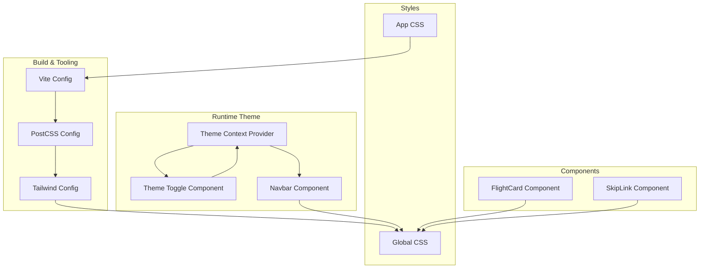
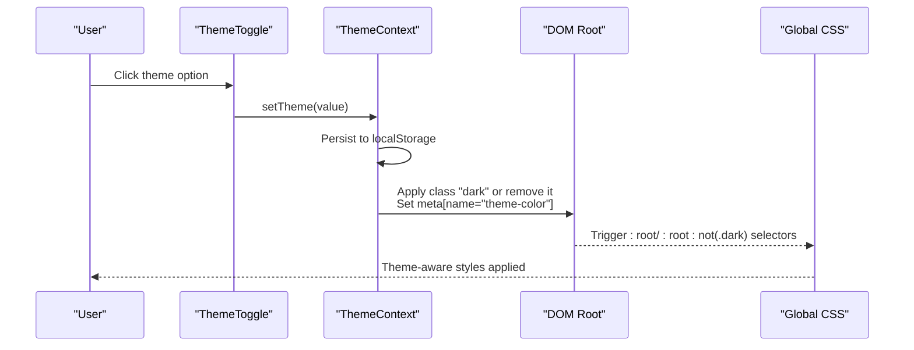
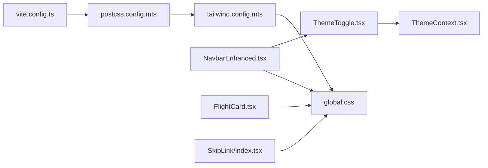

# UI Design System

<cite>
**Referenced Files in This Document**
- [tailwind.config.mts](file://skyflow-pro/tailwind.config.mts)
- [postcss.config.mts](file://skyflow-pro/postcss.config.mts)
- [global.css](file://skyflow-pro/src/styles/global.css)
- [App.css](file://skyflow-pro/src/App.css)
- [ThemeContext.tsx](file://skyflow-pro/src/context/ThemeContext.tsx)
- [ThemeToggle.tsx](file://skyflow-pro/src/components/features/theme/ThemeToggle.tsx)
- [NavbarEnhanced.tsx](file://skyflow-pro/src/components/Header/NavbarEnhanced.tsx)
- [SkipLink/index.tsx](file://skyflow-pro/src/components/common/SkipLink/index.tsx)
- [FlightCard.tsx](file://skyflow-pro/src/components/FlightCard/FlightCard.tsx)
- [package.json](file://skyflow-pro/package.json)
- [vite.config.ts](file://skyflow-pro/vite.config.ts)
</cite>

## Table of Contents
1. [Introduction](#introduction)
2. [Project Structure](#project-structure)
3. [Core Components](#core-components)
4. [Architecture Overview](#architecture-overview)
5. [Detailed Component Analysis](#detailed-component-analysis)
6. [Dependency Analysis](#dependency-analysis)
7. [Performance Considerations](#performance-considerations)
8. [Troubleshooting Guide](#troubleshooting-guide)
9. [Conclusion](#conclusion)
10. [Appendices](#appendices)

## Introduction
This document describes the design system and styling architecture of the frontend application. It covers Tailwind CSS configuration, custom utility classes, responsive design patterns, theme context implementation, dark/light mode switching, color scheme management, component styling approaches, accessibility compliance, cross-browser compatibility, and performance optimization. It also documents design tokens, spacing systems, typography hierarchy, and best practices for evolving the design system.

## Project Structure
The styling system is organized around:
- Tailwind CSS configuration extending design tokens (colors, fonts, shadows, radii, animations, backdrop blur)
- PostCSS pipeline enabling Tailwind and vendor prefixing
- Global CSS for base styles, theme-aware gradients, glassmorphism, animations, and utilities
- React components leveraging Tailwind utilities and custom CSS classes
- Theme provider managing persisted theme selection and DOM application

**Diagram sources**
- [vite.config.ts:1-53](file://skyflow-pro/vite.config.ts#L1-L53)
- [postcss.config.mts:1-8](file://skyflow-pro/postcss.config.mts#L1-L8)
- [tailwind.config.mts:1-124](file://skyflow-pro/tailwind.config.mts#L1-L124)
- [global.css:1-291](file://skyflow-pro/src/styles/global.css#L1-L291)
- [App.css:1-43](file://skyflow-pro/src/App.css#L1-L43)
- [ThemeContext.tsx:1-89](file://skyflow-pro/src/context/ThemeContext.tsx#L1-L89)
- [ThemeToggle.tsx:1-39](file://skyflow-pro/src/components/features/theme/ThemeToggle.tsx#L1-L39)
- [NavbarEnhanced.tsx:1-120](file://skyflow-pro/src/components/Header/NavbarEnhanced.tsx#L1-L120)
- [SkipLink/index.tsx:1-12](file://skyflow-pro/src/components/common/SkipLink/index.tsx#L1-L12)
- [FlightCard.tsx:1-263](file://skyflow-pro/src/components/FlightCard/FlightCard.tsx#L1-L263)

**Section sources**
- [tailwind.config.mts:1-124](file://skyflow-pro/tailwind.config.mts#L1-L124)
- [postcss.config.mts:1-8](file://skyflow-pro/postcss.config.mts#L1-L8)
- [global.css:1-291](file://skyflow-pro/src/styles/global.css#L1-L291)
- [App.css:1-43](file://skyflow-pro/src/App.css#L1-L43)
- [ThemeContext.tsx:1-89](file://skyflow-pro/src/context/ThemeContext.tsx#L1-L89)
- [ThemeToggle.tsx:1-39](file://skyflow-pro/src/components/features/theme/ThemeToggle.tsx#L1-L39)
- [NavbarEnhanced.tsx:1-120](file://skyflow-pro/src/components/Header/NavbarEnhanced.tsx#L1-L120)
- [SkipLink/index.tsx:1-12](file://skyflow-pro/src/components/common/SkipLink/index.tsx#L1-L12)
- [FlightCard.tsx:1-263](file://skyflow-pro/src/components/FlightCard/FlightCard.tsx#L1-L263)
- [vite.config.ts:1-53](file://skyflow-pro/vite.config.ts#L1-L53)

## Core Components
- Tailwind configuration extends colors, fonts, shadows, border radii, animations, and backdrop blur. It enables class-based dark mode and scans TS/TSX sources for usage.
- Global CSS defines theme-aware gradients, glassmorphism, animations, base typography, and reusable utility classes (buttons, inputs, cards, tooltips, progress bars).
- Theme context manages persisted theme selection, resolves system preference, applies DOM classes and meta theme color, and updates on system preference changes.
- Theme toggle component exposes light/dark/system toggles and reflects current selection.
- Navbar demonstrates theme-aware UI, glass effects, navigation links, and responsive behavior.
- FlightCard showcases dense, interactive flight cards with badges, gradients, and expandable details.

**Section sources**
- [tailwind.config.mts:1-124](file://skyflow-pro/tailwind.config.mts#L1-L124)
- [global.css:1-291](file://skyflow-pro/src/styles/global.css#L1-L291)
- [ThemeContext.tsx:1-89](file://skyflow-pro/src/context/ThemeContext.tsx#L1-L89)
- [ThemeToggle.tsx:1-39](file://skyflow-pro/src/components/features/theme/ThemeToggle.tsx#L1-L39)
- [NavbarEnhanced.tsx:1-120](file://skyflow-pro/src/components/Header/NavbarEnhanced.tsx#L1-L120)
- [FlightCard.tsx:1-263](file://skyflow-pro/src/components/FlightCard/FlightCard.tsx#L1-L263)

## Architecture Overview
The design system architecture integrates build-time CSS generation with runtime theme management:

**Diagram sources**
- [ThemeToggle.tsx:1-39](file://skyflow-pro/src/components/features/theme/ThemeToggle.tsx#L1-L39)
- [ThemeContext.tsx:1-89](file://skyflow-pro/src/context/ThemeContext.tsx#L1-L89)
- [global.css:1-291](file://skyflow-pro/src/styles/global.css#L1-L291)

## Detailed Component Analysis

### Tailwind Configuration and Design Tokens
- Colors: Named palette (navy, sky, slate, emerald, amber, purple, pink) plus semantic aliases. Used across components for backgrounds, borders, and accents.
- Typography: Inter as the primary font stack; consistent across components.
- Shadows: Soft card and glow variants for visual emphasis.
- Border radius: Extended sizes (xl, 2xl, 3xl) for modern UI elements.
- Animations: Floating, shimmer, pulse glow, gradient shift, fade-in, slide transitions, scale-in, slow spin, and falling effects.
- Backdrop blur: Extra small blur for glass-like overlays.
- Dark mode: Class-based strategy targeting html/root element.

Best practices:
- Prefer named colors and semantic tokens for consistency.
- Use consistent border radius and shadow scales across components.
- Keep animation durations and easing uniform for coherent motion.

**Section sources**
- [tailwind.config.mts:1-124](file://skyflow-pro/tailwind.config.mts#L1-L124)

### Theme Context and Dark/Light Mode
- Theme states: light, dark, system.
- Resolution: If system is selected, reads OS preference; otherwise uses explicit theme.
- Persistence: Theme stored in localStorage and restored on mount.
- DOM application: Adds/removes class "dark" on html element and sets meta theme-color accordingly.
- System listener: Subscribes to prefers-color-scheme media query changes and updates resolved theme.

Accessibility and UX:
- Updates meta theme-color to align with system/browser expectations.
- Uses color-scheme property on :root to guide UA rendering.

**Section sources**
- [ThemeContext.tsx:1-89](file://skyflow-pro/src/context/ThemeContext.tsx#L1-L89)

### Theme Toggle Component
- Renders three options: light, dark, system.
- Uses Lucide icons for affordance.
- Highlights active selection with gradient background and subtle shadow.
- Integrates with ThemeContext via useTheme hook.

Responsive behavior:
- Compact inline-flex layout; text labels hidden on small screens.

**Section sources**
- [ThemeToggle.tsx:1-39](file://skyflow-pro/src/components/features/theme/ThemeToggle.tsx#L1-L39)

### Global Styles and Utilities
- Base styles: Inter font stack, smooth scrolling, min-height roots.
- Theme-aware gradients: :root and :root:not(.dark) define primary/card/glass gradients.
- Body backgrounds: Radial gradients per theme for ambient visuals.
- Animations: Keyframes and convenience classes (.animate-*).
- Glassmorphism: .glass and .glass-light with backdrop blur and themed borders.
- Buttons: .btn-primary and .btn-secondary with transitions and shadows.
- Inputs: .input-premium with focus states and placeholder styling.
- Cards and badges: Hover transforms, glow utilities, skeleton loaders.
- Progress and tooltip: Focused, accessible components.
- Selection and focus ring: Consistent focus-visible styling.
- Print styles: Separate print media rules for content-only printing.

Accessibility:
- Focus ring utility for keyboard navigation.
- Skip link component for keyboard-only navigation to main content.
- Color-scheme applied to :root for proper contrast and UA handling.

**Section sources**
- [global.css:1-291](file://skyflow-pro/src/styles/global.css#L1-L291)
- [SkipLink/index.tsx:1-12](file://skyflow-pro/src/components/common/SkipLink/index.tsx#L1-L12)

### Component Styling Approaches
- FlightCard: Uses Tailwind utilities for layout, gradients, borders, and hover states; custom badge classes for refundability; expandable details panel with animation classes.
- Navbar: Glass effect, navigation links with active states, responsive mobile menu, and theme toggle integration.
- App.css: Legacy base styles for demo app; minimal usage in current design system.

Encapsulation strategies:
- Prefer component-scoped Tailwind classes and shared utilities from global.css.
- Avoid CSS-in-JS for this project; rely on Tailwind utilities and global CSS for cross-component consistency.

**Section sources**
- [FlightCard.tsx:1-263](file://skyflow-pro/src/components/FlightCard/FlightCard.tsx#L1-L263)
- [NavbarEnhanced.tsx:1-120](file://skyflow-pro/src/components/Header/NavbarEnhanced.tsx#L1-L120)
- [App.css:1-43](file://skyflow-pro/src/App.css#L1-L43)

### Responsive Design Patterns
- Breakpoints: Use of sm, md, lg, xl variants in components and layouts.
- Mobile-first: Collapsed mobile menu with animated entrance; responsive grid for details panels.
- Adaptive UI: Navigation links adjust for screen size; buttons and paddings scale appropriately.

**Section sources**
- [NavbarEnhanced.tsx:1-120](file://skyflow-pro/src/components/Header/NavbarEnhanced.tsx#L1-L120)
- [FlightCard.tsx:1-263](file://skyflow-pro/src/components/FlightCard/FlightCard.tsx#L1-L263)

### Accessibility Compliance
- Focus management: Focus ring utility and skip link for keyboard navigation.
- Color scheme: color-scheme applied to :root to improve UA rendering.
- Contrast: Theme-aware color tokens and sufficient contrast in hover/focus states.
- ARIA: Theme toggle uses aria-pressed and aria-label attributes.

Recommendations:
- Ensure all interactive elements have visible focus states.
- Verify color contrast ratios meet WCAG guidelines under both themes.
- Add ARIA roles and labels where dynamic content is revealed.

**Section sources**
- [global.css:1-291](file://skyflow-pro/src/styles/global.css#L1-L291)
- [SkipLink/index.tsx:1-12](file://skyflow-pro/src/components/common/SkipLink/index.tsx#L1-L12)
- [ThemeToggle.tsx:1-39](file://skyflow-pro/src/components/features/theme/ThemeToggle.tsx#L1-L39)

### Cross-Browser Compatibility
- PostCSS autoprefixer ensures vendor prefixes for animations, transforms, and backdrop filters.
- WebKit-specific backdrop-filter properties are included for Safari support.
- Scrollbar styling uses WebKit pseudo-elements for consistent appearance across supported browsers.

**Section sources**
- [postcss.config.mts:1-8](file://skyflow-pro/postcss.config.mts#L1-L8)
- [global.css:1-291](file://skyflow-pro/src/styles/global.css#L1-L291)

### Performance Considerations
- Build-time CSS generation: Tailwind purges unused classes based on configured content globs.
- Minimal runtime JS: Theme context uses localStorage and media queries efficiently.
- Animation performance: Hardware-accelerated properties (transform, opacity) used in animations.
- Bundle size: Tailwind and PostCSS included as dev dependencies; production builds optimize CSS.

Recommendations:
- Keep content globs precise to avoid shipping unused utilities.
- Prefer transform/opacity for animations; avoid layout-affecting properties.
- Use lazy loading for images and heavy components.

**Section sources**
- [tailwind.config.mts:1-124](file://skyflow-pro/tailwind.config.mts#L1-L124)
- [postcss.config.mts:1-8](file://skyflow-pro/postcss.config.mts#L1-L8)
- [package.json:1-46](file://skyflow-pro/package.json#L1-L46)

## Dependency Analysis

**Diagram sources**
- [tailwind.config.mts:1-124](file://skyflow-pro/tailwind.config.mts#L1-L124)
- [postcss.config.mts:1-8](file://skyflow-pro/postcss.config.mts#L1-L8)
- [global.css:1-291](file://skyflow-pro/src/styles/global.css#L1-L291)
- [ThemeToggle.tsx:1-39](file://skyflow-pro/src/components/features/theme/ThemeToggle.tsx#L1-L39)
- [ThemeContext.tsx:1-89](file://skyflow-pro/src/context/ThemeContext.tsx#L1-L89)
- [NavbarEnhanced.tsx:1-120](file://skyflow-pro/src/components/Header/NavbarEnhanced.tsx#L1-L120)
- [FlightCard.tsx:1-263](file://skyflow-pro/src/components/FlightCard/FlightCard.tsx#L1-L263)
- [SkipLink/index.tsx:1-12](file://skyflow-pro/src/components/common/SkipLink/index.tsx#L1-L12)
- [vite.config.ts:1-53](file://skyflow-pro/vite.config.ts#L1-L53)

**Section sources**
- [tailwind.config.mts:1-124](file://skyflow-pro/tailwind.config.mts#L1-L124)
- [postcss.config.mts:1-8](file://skyflow-pro/postcss.config.mts#L1-L8)
- [global.css:1-291](file://skyflow-pro/src/styles/global.css#L1-L291)
- [ThemeToggle.tsx:1-39](file://skyflow-pro/src/components/features/theme/ThemeToggle.tsx#L1-L39)
- [ThemeContext.tsx:1-89](file://skyflow-pro/src/context/ThemeContext.tsx#L1-L89)
- [NavbarEnhanced.tsx:1-120](file://skyflow-pro/src/components/Header/NavbarEnhanced.tsx#L1-L120)
- [FlightCard.tsx:1-263](file://skyflow-pro/src/components/FlightCard/FlightCard.tsx#L1-L263)
- [SkipLink/index.tsx:1-12](file://skyflow-pro/src/components/common/SkipLink/index.tsx#L1-L12)
- [vite.config.ts:1-53](file://skyflow-pro/vite.config.ts#L1-L53)

## Performance Considerations
- Tailwind purging: Configure content globs to scan only relevant files to minimize CSS size.
- Animation efficiency: Prefer transform and opacity for smooth 60fps animations.
- CSS delivery: Ensure global.css is bundled and minified in production.
- Theme switching: Avoid unnecessary reflows by toggling a single class on the root element.

[No sources needed since this section provides general guidance]

## Troubleshooting Guide
- Theme not applying: Verify class "dark" is present on html element and meta theme-color is set.
- Animations not playing: Confirm keyframes are defined and .animate-* classes are applied.
- Glass effect missing: Ensure backdrop-filter support and appropriate theme conditions.
- Scrollbar styling inconsistent: Check WebKit pseudo-element support and theme overrides.
- Build errors: Validate Tailwind and PostCSS versions and plugin configurations.

**Section sources**
- [ThemeContext.tsx:1-89](file://skyflow-pro/src/context/ThemeContext.tsx#L1-L89)
- [global.css:1-291](file://skyflow-pro/src/styles/global.css#L1-L291)
- [postcss.config.mts:1-8](file://skyflow-pro/postcss.config.mts#L1-L8)

## Conclusion
The design system combines Tailwind’s utility-first approach with a robust theme context for seamless dark/light mode experiences. Global CSS provides theme-aware gradients, glassmorphism, and reusable utilities, while components consistently apply design tokens and responsive patterns. By maintaining a clear separation of concerns—configuration, runtime theme management, and component styling—the system remains maintainable, accessible, and performant.

[No sources needed since this section summarizes without analyzing specific files]

## Appendices

### Design Tokens Reference
- Colors: Named palette (navy, sky, slate, emerald, amber, purple, pink) and semantic aliases.
- Typography: Inter font stack; consistent across components.
- Spacing: Use Tailwind’s default spacing scale with custom utilities where needed.
- Radii: Extended sizes (xl, 2xl, 3xl) for modern UI elements.
- Shadows: Soft card and glow variants for depth and emphasis.
- Animations: Predefined keyframes and convenience classes for motion.

**Section sources**
- [tailwind.config.mts:1-124](file://skyflow-pro/tailwind.config.mts#L1-L124)
- [global.css:1-291](file://skyflow-pro/src/styles/global.css#L1-L291)

### Component Styling Best Practices
- Prefer Tailwind utilities for layout and styling; use global CSS for shared utilities and animations.
- Keep component classes scoped and predictable; avoid deep nesting.
- Use semantic tokens (colors, radii, shadows) consistently across components.
- Test responsive behavior across breakpoints and ensure mobile-first design.
- Maintain accessibility by preserving focus states and color contrast.

**Section sources**
- [FlightCard.tsx:1-263](file://skyflow-pro/src/components/FlightCard/FlightCard.tsx#L1-L263)
- [NavbarEnhanced.tsx:1-120](file://skyflow-pro/src/components/Header/NavbarEnhanced.tsx#L1-L120)
- [global.css:1-291](file://skyflow-pro/src/styles/global.css#L1-L291)