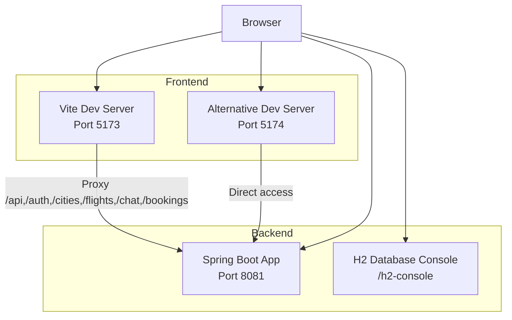

# Getting Started

<cite>
**Referenced Files in This Document**
- [run-all.bat](file://run-all.bat)
- [start-all.bat](file://start-all.bat)
- [run-backend.bat](file://run-backend.bat)
- [README-SETUP.md](file://README-SETUP.md)
- [CONNECTION-GUIDE.md](file://CONNECTION-GUIDE.md)
- [backend-server README.md](file://backend-server/README.md)
- [skyflow-pro README.md](file://skyflow-pro/README.md)
- [skyflow-pro QUICK_START.md](file://skyflow-pro/QUICK_START.md)
- [backend-server pom.xml](file://backend-server/pom.xml)
- [backend-server application.yml](file://backend-server/src/main/resources/application.yml)
- [skyflow-pro vite.config.ts](file://skyflow-pro/vite.config.ts)
- [skyflow-pro package.json](file://skyflow-pro/package.json)
- [skyflow-pro .env.example](file://skyflow-pro/.env.example)
- [connection-test.html](file://connection-test.html)
</cite>

## Table of Contents
1. [Introduction](#introduction)
2. [Project Structure](#project-structure)
3. [Prerequisites](#prerequisites)
4. [Two Startup Options](#two-startup-options)
5. [Step-by-Step Installation](#step-by-step-installation)
6. [.env Configuration and API Connections](#env-configuration-and-api-connections)
7. [Verification and Access](#verification-and-access)
8. [Troubleshooting](#troubleshooting)
9. [System Requirements and Compatibility](#system-requirements-and-compatibility)
10. [Conclusion](#conclusion)

## Introduction
This guide helps you install and run SkyFlow Pro locally with both backend and frontend components. It covers prerequisites, two startup approaches (single-command and manual), configuration, verification, and troubleshooting.

## Project Structure
SkyFlow Pro consists of:
- Backend: Spring Boot application with H2 in-memory database and JWT authentication
- Frontend: React + Vite application with proxy configuration to the backend
- Scripts: Windows batch files to launch both servers

**Diagram sources**
- [CONNECTION-GUIDE.md:55-75](file://CONNECTION-GUIDE.md#L55-L75)
- [skyflow-pro vite.config.ts:14-47](file://skyflow-pro/vite.config.ts#L14-L47)
- [backend-server application.yml:19-20](file://backend-server/src/main/resources/application.yml#L19-L20)

**Section sources**
- [README-SETUP.md:24-30](file://README-SETUP.md#L24-L30)
- [CONNECTION-GUIDE.md:55-75](file://CONNECTION-GUIDE.md#L55-L75)

## Prerequisites
- Java 17+ (required for local Maven builds)
- Maven wrapper included in the backend project
- Node.js 18+ (required for frontend development)
- Git (recommended to clone and manage the repository)
- Windows OS (scripts are Windows batch files)

Notes:
- The backend’s Maven configuration targets Java 17.
- The frontend requires Node 18+ as per its package metadata.

**Section sources**
- [backend-server pom.xml:16-18](file://backend-server/pom.xml#L16-L18)
- [skyflow-pro package.json:1-46](file://skyflow-pro/package.json#L1-L46)

## Two Startup Options
Choose one of the following approaches to start SkyFlow Pro.

### Option 1: Single-Command Startup (Recommended)
Double-click the launcher script to start both backend and frontend automatically.

- Launchers:
  - [run-all.bat:1-16](file://run-all.bat#L1-L16)
  - [start-all.bat:1-49](file://start-all.bat#L1-L49)

What it does:
- Starts backend on port 8081
- Waits for backend readiness
- Starts frontend on port 5173

Ports:
- Backend: http://localhost:8081
- Frontend: http://localhost:5173
- Alternative frontend dev server: http://localhost:5174

**Section sources**
- [run-all.bat:1-16](file://run-all.bat#L1-L16)
- [start-all.bat:14-32](file://start-all.bat#L14-L32)
- [README-SETUP.md:24-28](file://README-SETUP.md#L24-L28)
- [CONNECTION-GUIDE.md:55-59](file://CONNECTION-GUIDE.md#L55-L59)

### Option 2: Manual Two-Terminal Approach
Start backend and frontend in separate terminals.

- Backend:
  - Navigate to backend-server and run the Maven wrapper to start Spring Boot
  - [run-backend.bat:1-4](file://run-backend.bat#L1-L4)
  - Or run Maven wrapper directly from the backend directory

- Frontend:
  - Navigate to skyflow-pro and run the frontend dev server
  - [skyflow-pro README.md:7-14](file://skyflow-pro/README.md#L7-L14)

Ports:
- Backend: http://localhost:8081
- Frontend: http://localhost:5173

**Section sources**
- [run-backend.bat:1-4](file://run-backend.bat#L1-L4)
- [skyflow-pro README.md:7-14](file://skyflow-pro/README.md#L7-L14)
- [README-SETUP.md:12-22](file://README-SETUP.md#L12-L22)

## Step-by-Step Installation
Follow these steps to install and run SkyFlow Pro.

### Backend Installation
1. Open a terminal in the backend-server directory.
2. Start the backend using the Maven wrapper:
   - [run-backend.bat:1-4](file://run-backend.bat#L1-L4)
   - Or run Maven wrapper directly from the backend directory

What you get:
- Spring Boot application running on port 8081
- H2 in-memory database with console at /h2-console

**Section sources**
- [run-backend.bat:1-4](file://run-backend.bat#L1-L4)
- [backend-server README.md:11-27](file://backend-server/README.md#L11-L27)

### Frontend Installation
1. Open a terminal in the skyflow-pro directory.
2. Install dependencies:
   - [skyflow-pro README.md:9-12](file://skyflow-pro/README.md#L9-L12)
3. Start the frontend dev server:
   - [skyflow-pro README.md:9-12](file://skyflow-pro/README.md#L9-L12)

Ports:
- Frontend: http://localhost:5173
- Alternative dev server: http://localhost:5174

**Section sources**
- [skyflow-pro README.md:7-14](file://skyflow-pro/README.md#L7-L14)

## .env Configuration and API Connections
Configure the frontend to connect to the backend.

### .env Setup
- Create a .env file in skyflow-pro using the example:
  - [skyflow-pro .env.example:1-6](file://skyflow-pro/.env.example#L1-L6)
- Key settings:
  - VITE_API_BASE_URL: http://localhost:8081
  - VITE_USE_MOCKS: false (use real backend)

### Frontend Proxy Configuration
- Vite proxy forwards API routes to the backend:
  - [skyflow-pro vite.config.ts:14-47](file://skyflow-pro/vite.config.ts#L14-L47)
- Routes proxied:
  - /api, /auth, /cities, /flights, /chat, /bookings

### Backend Configuration
- Port and database:
  - [backend-server application.yml:19-20](file://backend-server/src/main/resources/application.yml#L19-L20)
- JWT configuration:
  - [backend-server application.yml:26-29](file://backend-server/src/main/resources/application.yml#L26-L29)

**Section sources**
- [skyflow-pro .env.example:1-6](file://skyflow-pro/.env.example#L1-L6)
- [skyflow-pro vite.config.ts:14-47](file://skyflow-pro/vite.config.ts#L14-L47)
- [backend-server application.yml:19-29](file://backend-server/src/main/resources/application.yml#L19-L29)

## Verification and Access
After starting both servers, verify connectivity and access the application.

### Access URLs
- Frontend: http://localhost:5173
- Alternative frontend dev server: http://localhost:5174
- Backend API base: http://localhost:8081
- H2 Console: http://localhost:8081/h2-console

### Connection Test Page
- Use the built-in connection tester to validate:
  - Backend availability
  - Frontend servers
  - API endpoints
  - Database connection
- [connection-test.html:1-311](file://connection-test.html#L1-L311)

### Example API Calls
- Cities endpoint: http://localhost:8081/cities
- Flight search: http://localhost:8081/flights/search?from=MIA&to=NYC&departDate=YYYY-MM-DD&passengers=1
- Auth health: http://localhost:8081/auth/health

**Section sources**
- [README-SETUP.md:24-29](file://README-SETUP.md#L24-L29)
- [CONNECTION-GUIDE.md:55-75](file://CONNECTION-GUIDE.md#L55-L75)
- [connection-test.html:170-186](file://connection-test.html#L170-L186)

## Troubleshooting
Common startup and connectivity issues with resolutions.

### Backend Not Responding
- Confirm Java process is running and port 8081 is free
- Restart backend from the backend-server directory
- Check logs in the terminal running Maven

**Section sources**
- [CONNECTION-GUIDE.md:168-171](file://CONNECTION-GUIDE.md#L168-L171)

### Frontend Not Loading
- Confirm Node process is running and port 5173 is free
- Reinstall dependencies if needed
- Restart frontend from the skyflow-pro directory

**Section sources**
- [CONNECTION-GUIDE.md:173-176](file://CONNECTION-GUIDE.md#L173-L176)

### CORS Errors
- Ensure the frontend proxy is configured to forward API requests to the backend
- Verify proxy entries in Vite config
- Check browser console for specific CORS error messages

**Section sources**
- [CONNECTION-GUIDE.md:178-181](file://CONNECTION-GUIDE.md#L178-L181)
- [skyflow-pro vite.config.ts:14-47](file://skyflow-pro/vite.config.ts#L14-L47)

### Authentication Issues
- Ensure JWT tokens are sent in Authorization headers as Bearer tokens
- Verify user registration and credentials
- Check token expiration (1 day)

**Section sources**
- [CONNECTION-GUIDE.md:183-186](file://CONNECTION-GUIDE.md#L183-L186)

### Port Conflicts
- Backend runs on port 8081 by default
- Frontend runs on port 5173 by default
- If ports are in use, adjust configurations accordingly

**Section sources**
- [backend-server application.yml:19-20](file://backend-server/src/main/resources/application.yml#L19-L20)
- [skyflow-pro vite.config.ts:14-47](file://skyflow-pro/vite.config.ts#L14-L47)

## System Requirements and Compatibility
- Backend
  - Java 17+ (as defined by Maven properties)
  - Maven wrapper included
  - Spring Boot application with H2 database

- Frontend
  - Node.js 18+ (as defined by package metadata)
  - React + Vite + TypeScript
  - Uses Axios and Zustand for state management

- Operating System
  - Windows (batch scripts provided)

- Network
  - Ports 8081 (backend), 5173 (frontend), 5174 (alternative frontend)

**Section sources**
- [backend-server pom.xml:16-18](file://backend-server/pom.xml#L16-L18)
- [skyflow-pro package.json:1-46](file://skyflow-pro/package.json#L1-L46)
- [CONNECTION-GUIDE.md:55-59](file://CONNECTION-GUIDE.md#L55-L59)

## Conclusion
You now have two reliable ways to start SkyFlow Pro locally: a single-command launcher or a manual two-terminal approach. Configure the frontend’s .env and proxy settings, verify connectivity with the provided tester, and refer to the troubleshooting section for quick fixes. Enjoy building and exploring the SkyFlow Pro application!