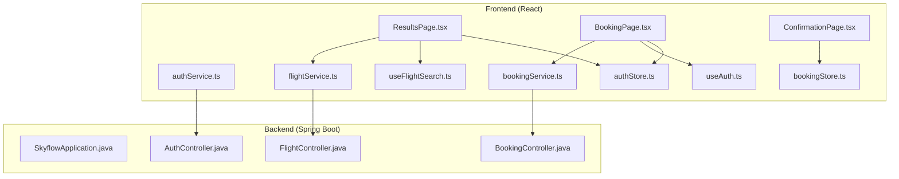
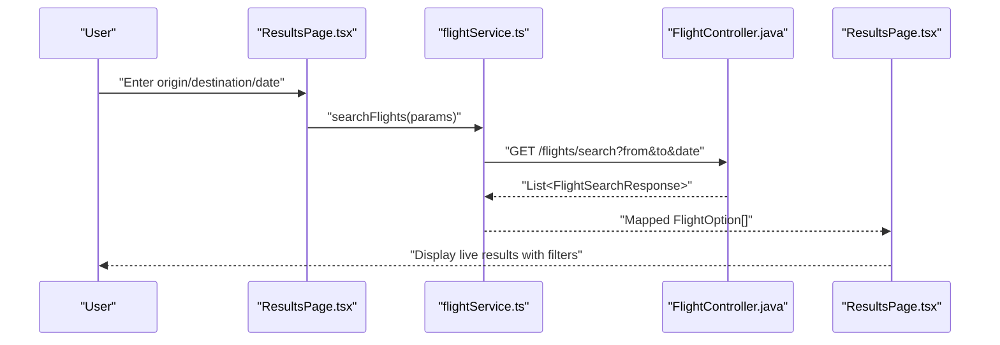
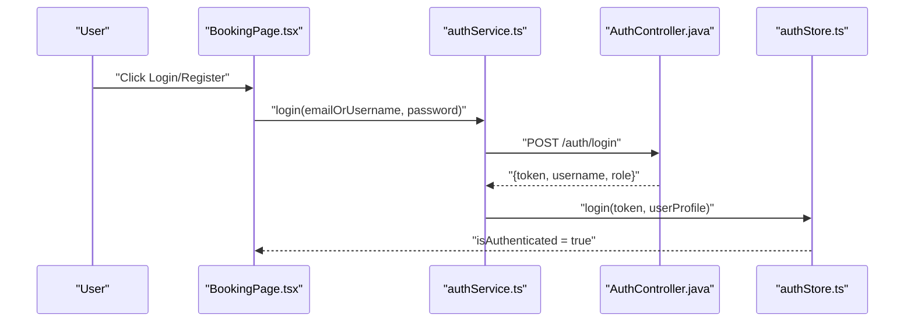
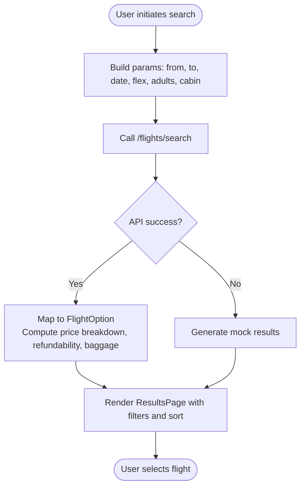
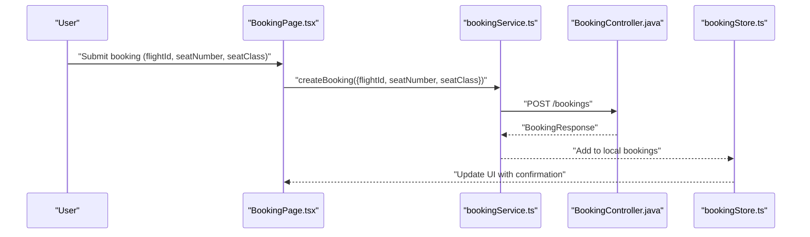
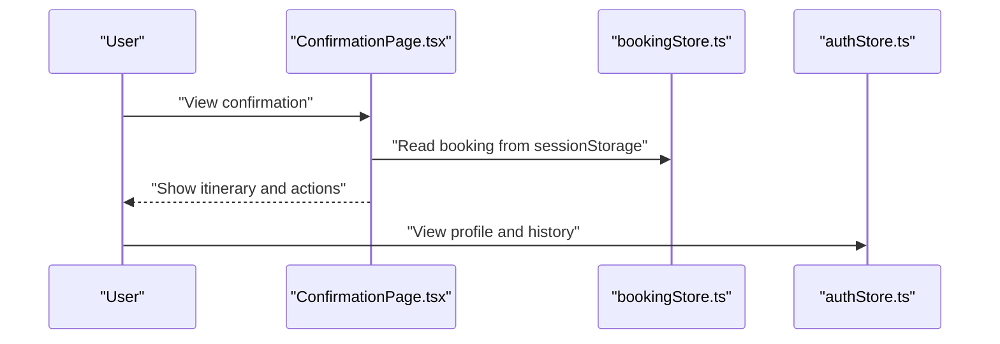
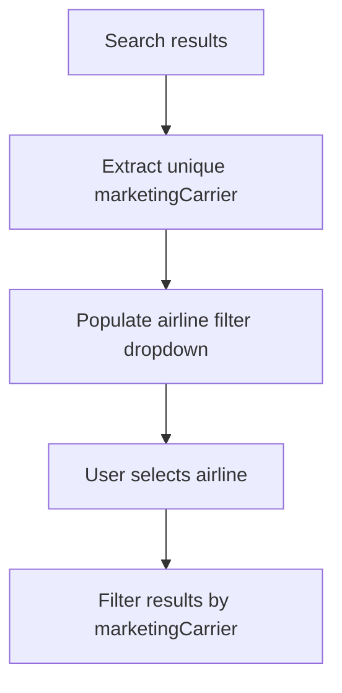
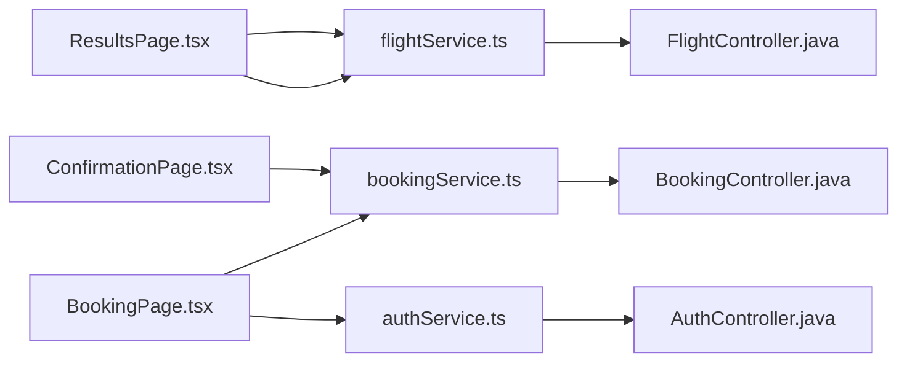

# Core Features

<cite>
**Referenced Files in This Document**
- [SkyflowApplication.java](file://backend-server/src/main/java/com/skyflow/SkyflowApplication.java)
- [AuthController.java](file://backend-server/src/main/java/com/skyflow/controller/AuthController.java)
- [FlightController.java](file://backend-server/src/main/java/com/skyflow/controller/FlightController.java)
- [BookingController.java](file://backend-server/src/main/java/com/skyflow/controller/BookingController.java)
- [ResultsPage.tsx](file://skyflow-pro/src/pages/FlightResults/ResultsPage.tsx)
- [BookingPage.tsx](file://skyflow-pro/src/pages/Booking/BookingPage.tsx)
- [ConfirmationPage.tsx](file://skyflow-pro/src/pages/BookingConfirmation/ConfirmationPage.tsx)
- [authService.ts](file://skyflow-pro/src/services/auth/authService.ts)
- [bookingService.ts](file://skyflow-pro/src/services/bookings/bookingService.ts)
- [flightService.ts](file://skyflow-pro/src/services/flights/flightService.ts)
- [authStore.ts](file://skyflow-pro/src/stores/authStore.ts)
- [bookingStore.ts](file://skyflow-pro/src/stores/bookingStore.ts)
- [useAuth.ts](file://skyflow-pro/src/hooks/useAuth.ts)
- [useFlightSearch.ts](file://skyflow-pro/src/hooks/useFlightSearch.ts)
</cite>

## Table of Contents
1. [Introduction](#introduction)
2. [Project Structure](#project-structure)
3. [Core Components](#core-components)
4. [Architecture Overview](#architecture-overview)
5. [Detailed Component Analysis](#detailed-component-analysis)
6. [Dependency Analysis](#dependency-analysis)
7. [Performance Considerations](#performance-considerations)
8. [Troubleshooting Guide](#troubleshooting-guide)
9. [Conclusion](#conclusion)

## Introduction
This document describes the core user-facing features of SkyFlow Pro with a focus on user authentication and registration, flight search with real-time pricing and availability, seat selection and booking management, booking confirmation and history tracking, and multi-airline support. It explains each feature’s functionality, user workflows, business value, and how they integrate to deliver a complete booking experience. Unique capabilities such as proprietary airline detection and dynamic pricing signals are highlighted.

## Project Structure
SkyFlow Pro consists of:
- A Spring Boot backend exposing REST APIs for authentication, flight search, and booking management.
- A React/TanStack Query-based frontend that orchestrates user interactions, integrates with backend services, and manages local state for authentication and bookings.

**Diagram sources**
- [SkyflowApplication.java:1-14](file://backend-server/src/main/java/com/skyflow/SkyflowApplication.java#L1-L14)
- [AuthController.java:1-58](file://backend-server/src/main/java/com/skyflow/controller/AuthController.java#L1-L58)
- [FlightController.java:1-50](file://backend-server/src/main/java/com/skyflow/controller/FlightController.java#L1-L50)
- [BookingController.java:1-89](file://backend-server/src/main/java/com/skyflow/controller/BookingController.java#L1-L89)
- [ResultsPage.tsx:1-366](file://skyflow-pro/src/pages/FlightResults/ResultsPage.tsx#L1-L366)
- [BookingPage.tsx:1-559](file://skyflow-pro/src/pages/Booking/BookingPage.tsx#L1-L559)
- [ConfirmationPage.tsx:1-277](file://skyflow-pro/src/pages/BookingConfirmation/ConfirmationPage.tsx#L1-L277)
- [authService.ts:1-38](file://skyflow-pro/src/services/auth/authService.ts#L1-L38)
- [bookingService.ts:1-39](file://skyflow-pro/src/services/bookings/bookingService.ts#L1-L39)
- [flightService.ts:1-128](file://skyflow-pro/src/services/flights/flightService.ts#L1-L128)
- [authStore.ts:1-123](file://skyflow-pro/src/stores/authStore.ts#L1-L123)
- [bookingStore.ts:1-115](file://skyflow-pro/src/stores/bookingStore.ts#L1-L115)
- [useAuth.ts:1-7](file://skyflow-pro/src/hooks/useAuth.ts#L1-L7)
- [useFlightSearch.ts:1-12](file://skyflow-pro/src/hooks/useFlightSearch.ts#L1-L12)

**Section sources**
- [SkyflowApplication.java:1-14](file://backend-server/src/main/java/com/skyflow/SkyflowApplication.java#L1-L14)
- [ResultsPage.tsx:1-366](file://skyflow-pro/src/pages/FlightResults/ResultsPage.tsx#L1-L366)
- [BookingPage.tsx:1-559](file://skyflow-pro/src/pages/Booking/BookingPage.tsx#L1-L559)
- [ConfirmationPage.tsx:1-277](file://skyflow-pro/src/pages/BookingConfirmation/ConfirmationPage.tsx#L1-L277)

## Core Components
- Authentication and Registration: REST endpoints for login and registration, JWT-based security, and frontend auth service/store integration.
- Flight Search: REST endpoint for searching flights and a frontend service that maps backend results to UI models, including proprietary airline detection and pricing metadata.
- Booking Management: REST endpoint for creating bookings, cancellation, and retrieving user bookings; frontend booking store and service manage local state and API calls.
- Booking Confirmation and History: Dedicated confirmation page and booking history store to track past and current bookings.
- Multi-Airline Support: Frontend surfaces multiple marketing carriers and allows filtering by airline; backend exposes flight search across carriers.

**Section sources**
- [AuthController.java:1-58](file://backend-server/src/main/java/com/skyflow/controller/AuthController.java#L1-L58)
- [FlightController.java:1-50](file://backend-server/src/main/java/com/skyflow/controller/FlightController.java#L1-L50)
- [BookingController.java:1-89](file://backend-server/src/main/java/com/skyflow/controller/BookingController.java#L1-L89)
- [authService.ts:1-38](file://skyflow-pro/src/services/auth/authService.ts#L1-L38)
- [bookingService.ts:1-39](file://skyflow-pro/src/services/bookings/bookingService.ts#L1-L39)
- [flightService.ts:1-128](file://skyflow-pro/src/services/flights/flightService.ts#L1-L128)
- [authStore.ts:1-123](file://skyflow-pro/src/stores/authStore.ts#L1-L123)
- [bookingStore.ts:1-115](file://skyflow-pro/src/stores/bookingStore.ts#L1-L115)

## Architecture Overview
The system follows a client-server pattern:
- Frontend pages orchestrate user actions (search, book, confirm) and delegate to services.
- Services call backend REST endpoints and manage local state via stores.
- Controllers expose endpoints for authentication, flight search, and booking operations.

**Diagram sources**
- [ResultsPage.tsx:1-366](file://skyflow-pro/src/pages/FlightResults/ResultsPage.tsx#L1-L366)
- [flightService.ts:1-128](file://skyflow-pro/src/services/flights/flightService.ts#L1-L128)
- [FlightController.java:1-50](file://backend-server/src/main/java/com/skyflow/controller/FlightController.java#L1-L50)

**Section sources**
- [ResultsPage.tsx:1-366](file://skyflow-pro/src/pages/FlightResults/ResultsPage.tsx#L1-L366)
- [flightService.ts:1-128](file://skyflow-pro/src/services/flights/flightService.ts#L1-L128)
- [FlightController.java:1-50](file://backend-server/src/main/java/com/skyflow/controller/FlightController.java#L1-L50)

## Detailed Component Analysis

### Authentication and Registration
- Backend endpoints:
  - POST /auth/login: Authenticates credentials and returns a JWT and user info.
  - POST /auth/register: Registers a new user with hashed password and default role.
- Frontend integration:
  - authService.ts posts credentials to backend and updates the auth store with token and user profile.
  - useAuth.ts re-exports the Zustand store for consistent hook usage.
- Business value:
  - Secure user onboarding and access to personalized features like booking history.

**Diagram sources**
- [BookingPage.tsx:1-559](file://skyflow-pro/src/pages/Booking/BookingPage.tsx#L1-L559)
- [authService.ts:1-38](file://skyflow-pro/src/services/auth/authService.ts#L1-L38)
- [AuthController.java:1-58](file://backend-server/src/main/java/com/skyflow/controller/AuthController.java#L1-L58)
- [authStore.ts:1-123](file://skyflow-pro/src/stores/authStore.ts#L1-L123)

**Section sources**
- [AuthController.java:1-58](file://backend-server/src/main/java/com/skyflow/controller/AuthController.java#L1-L58)
- [authService.ts:1-38](file://skyflow-pro/src/services/auth/authService.ts#L1-L38)
- [authStore.ts:1-123](file://skyflow-pro/src/stores/authStore.ts#L1-L123)
- [useAuth.ts:1-7](file://skyflow-pro/src/hooks/useAuth.ts#L1-L7)

### Flight Search with Real-Time Pricing and Availability
- Backend:
  - GET /flights/search: Returns live flight options for a given route and date.
  - GET /flights/{id}/fare-breakdown: Provides fare breakdown for a flight and cabin class.
- Frontend:
  - useFlightSearch.ts integrates TanStack Query to fetch and cache results.
  - ResultsPage.tsx renders live results, supports flexible date windows, sorting, and filters (stops, airline, departure time, price).
  - flightService.ts maps backend responses to FlightOption, computes derived fields (refundability, baggage policy, scarcity), and handles round-trip search.
- Proprietary airline detection:
  - flightService.ts reads isProprietary flags from backend data to compute refundability score, baggage allowance, and messaging.

**Diagram sources**
- [ResultsPage.tsx:1-366](file://skyflow-pro/src/pages/FlightResults/ResultsPage.tsx#L1-L366)
- [flightService.ts:1-128](file://skyflow-pro/src/services/flights/flightService.ts#L1-L128)
- [FlightController.java:1-50](file://backend-server/src/main/java/com/skyflow/controller/FlightController.java#L1-L50)

**Section sources**
- [FlightController.java:1-50](file://backend-server/src/main/java/com/skyflow/controller/FlightController.java#L1-L50)
- [ResultsPage.tsx:1-366](file://skyflow-pro/src/pages/FlightResults/ResultsPage.tsx#L1-L366)
- [flightService.ts:1-128](file://skyflow-pro/src/services/flights/flightService.ts#L1-L128)
- [useFlightSearch.ts:1-12](file://skyflow-pro/src/hooks/useFlightSearch.ts#L1-L12)

### Seat Selection and Booking Management
- Backend:
  - POST /bookings: Creates a booking for an authenticated user, validating required fields and seat availability.
  - GET /bookings/my-bookings: Lists user’s bookings.
  - POST /bookings/cancel/{id}: Cancels a booking.
- Frontend:
  - bookingService.ts encapsulates booking API calls.
  - bookingStore.ts manages local booking state, including fetching, creating, cancelling, and generating demo bookings when the backend is unavailable.
  - BookingPage.tsx implements a 3-step checkout (passenger details, payment, review) and triggers booking submission.

**Diagram sources**
- [BookingPage.tsx:1-559](file://skyflow-pro/src/pages/Booking/BookingPage.tsx#L1-L559)
- [bookingService.ts:1-39](file://skyflow-pro/src/services/bookings/bookingService.ts#L1-L39)
- [BookingController.java:1-89](file://backend-server/src/main/java/com/skyflow/controller/BookingController.java#L1-L89)
- [bookingStore.ts:1-115](file://skyflow-pro/src/stores/bookingStore.ts#L1-L115)

**Section sources**
- [BookingController.java:1-89](file://backend-server/src/main/java/com/skyflow/controller/BookingController.java#L1-L89)
- [bookingService.ts:1-39](file://skyflow-pro/src/services/bookings/bookingService.ts#L1-L39)
- [bookingStore.ts:1-115](file://skyflow-pro/src/stores/bookingStore.ts#L1-L115)
- [BookingPage.tsx:1-559](file://skyflow-pro/src/pages/Booking/BookingPage.tsx#L1-L559)

### Booking Confirmation and History Tracking
- Confirmation:
  - ConfirmationPage.tsx displays booking details, passenger info, and e-ticket actions (download/print/share).
  - Uses sessionStorage to persist confirmation data for offline/demo scenarios.
- History:
  - bookingStore.ts maintains booking history and exposes helpers to add and update entries.
  - authStore.ts persists user profile and booking history to localStorage for continuity.

**Diagram sources**
- [ConfirmationPage.tsx:1-277](file://skyflow-pro/src/pages/BookingConfirmation/ConfirmationPage.tsx#L1-L277)
- [bookingStore.ts:1-115](file://skyflow-pro/src/stores/bookingStore.ts#L1-L115)
- [authStore.ts:1-123](file://skyflow-pro/src/stores/authStore.ts#L1-L123)

**Section sources**
- [ConfirmationPage.tsx:1-277](file://skyflow-pro/src/pages/BookingConfirmation/ConfirmationPage.tsx#L1-L277)
- [bookingStore.ts:1-115](file://skyflow-pro/src/stores/bookingStore.ts#L1-L115)
- [authStore.ts:1-123](file://skyflow-pro/src/stores/authStore.ts#L1-L123)

### Multi-Airline Support
- Frontend:
  - ResultsPage.tsx extracts unique marketing carriers from search results and populates airline filters.
  - flightService.ts maps backend data to FlightOption, preserving marketingCarrier and related metadata.
- Business value:
  - Enables users to compare and filter by multiple carriers, enhancing choice and transparency.

**Diagram sources**
- [ResultsPage.tsx:1-366](file://skyflow-pro/src/pages/FlightResults/ResultsPage.tsx#L1-L366)
- [flightService.ts:1-128](file://skyflow-pro/src/services/flights/flightService.ts#L1-L128)

**Section sources**
- [ResultsPage.tsx:1-366](file://skyflow-pro/src/pages/FlightResults/ResultsPage.tsx#L1-L366)
- [flightService.ts:1-128](file://skyflow-pro/src/services/flights/flightService.ts#L1-L128)

## Dependency Analysis
- Frontend depends on:
  - Services for API communication (authService, bookingService, flightService).
  - Stores for state persistence (authStore, bookingStore).
  - Hooks for reactive queries (useAuth, useFlightSearch).
- Backend depends on:
  - Controllers to expose endpoints for authentication, flights, and bookings.
- Integration points:
  - JWT tokens from AuthController are used by protected endpoints in BookingController.
  - flightService.ts consumes FlightController endpoints; bookingService.ts consumes BookingController endpoints.

**Diagram sources**
- [ResultsPage.tsx:1-366](file://skyflow-pro/src/pages/FlightResults/ResultsPage.tsx#L1-L366)
- [flightService.ts:1-128](file://skyflow-pro/src/services/flights/flightService.ts#L1-L128)
- [FlightController.java:1-50](file://backend-server/src/main/java/com/skyflow/controller/FlightController.java#L1-L50)
- [BookingPage.tsx:1-559](file://skyflow-pro/src/pages/Booking/BookingPage.tsx#L1-L559)
- [bookingService.ts:1-39](file://skyflow-pro/src/services/bookings/bookingService.ts#L1-L39)
- [BookingController.java:1-89](file://backend-server/src/main/java/com/skyflow/controller/BookingController.java#L1-L89)
- [authService.ts:1-38](file://skyflow-pro/src/services/auth/authService.ts#L1-L38)
- [AuthController.java:1-58](file://backend-server/src/main/java/com/skyflow/controller/AuthController.java#L1-L58)
- [ConfirmationPage.tsx:1-277](file://skyflow-pro/src/pages/BookingConfirmation/ConfirmationPage.tsx#L1-L277)

**Section sources**
- [ResultsPage.tsx:1-366](file://skyflow-pro/src/pages/FlightResults/ResultsPage.tsx#L1-L366)
- [BookingPage.tsx:1-559](file://skyflow-pro/src/pages/Booking/BookingPage.tsx#L1-L559)
- [ConfirmationPage.tsx:1-277](file://skyflow-pro/src/pages/BookingConfirmation/ConfirmationPage.tsx#L1-L277)
- [flightService.ts:1-128](file://skyflow-pro/src/services/flights/flightService.ts#L1-L128)
- [bookingService.ts:1-39](file://skyflow-pro/src/services/bookings/bookingService.ts#L1-L39)
- [authService.ts:1-38](file://skyflow-pro/src/services/auth/authService.ts#L1-L38)
- [FlightController.java:1-50](file://backend-server/src/main/java/com/skyflow/controller/FlightController.java#L1-L50)
- [BookingController.java:1-89](file://backend-server/src/main/java/com/skyflow/controller/BookingController.java#L1-L89)
- [AuthController.java:1-58](file://backend-server/src/main/java/com/skyflow/controller/AuthController.java#L1-L58)

## Performance Considerations
- Caching and retries:
  - useFlightSearch.ts leverages TanStack Query for caching and refetching, reducing redundant network calls.
- Mock fallback:
  - flightService.ts falls back to deterministic mock results when the backend is unavailable, ensuring a responsive UI.
- Local state persistence:
  - authStore.ts and bookingStore.ts persist state to localStorage, minimizing repeated network requests and improving perceived performance.

[No sources needed since this section provides general guidance]

## Troubleshooting Guide
- Authentication failures:
  - Verify credentials and ensure the user exists. Check backend logs for authentication errors.
- Booking creation errors:
  - Validate required fields (flightId, seatNumber, seatClass). Confirm seat availability and that the user is authenticated.
- Network issues:
  - flightService.ts and bookingService.ts include fallbacks to mock data or local demo bookings when the backend is unreachable.
- UI state resets:
  - Ensure localStorage is enabled and not blocked by browser privacy settings.

**Section sources**
- [BookingController.java:1-89](file://backend-server/src/main/java/com/skyflow/controller/BookingController.java#L1-L89)
- [bookingService.ts:1-39](file://skyflow-pro/src/services/bookings/bookingService.ts#L1-L39)
- [flightService.ts:1-128](file://skyflow-pro/src/services/flights/flightService.ts#L1-L128)
- [bookingStore.ts:1-115](file://skyflow-pro/src/stores/bookingStore.ts#L1-L115)

## Conclusion
SkyFlow Pro delivers a cohesive booking experience by combining secure authentication, live flight search with rich metadata, robust booking management, and a polished confirmation/history workflow. Multi-airline support and intelligent pricing signals enhance user choice and trust. The frontend’s reactive architecture and backend’s REST APIs work together to provide a scalable, user-friendly solution.