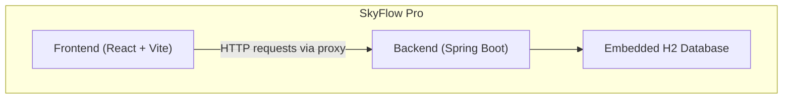
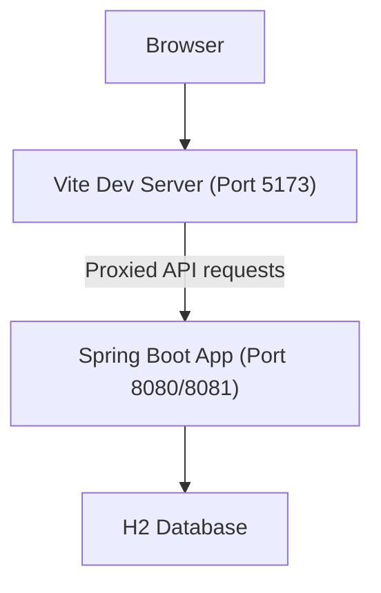

# Getting Started

<cite>
**Referenced Files in This Document**
- [README-SETUP.md](file://README-SETUP.md)
- [CONNECTION-GUIDE.md](file://CONNECTION-GUIDE.md)
- [start-all.bat](file://start-all.bat)
- [run-all.bat](file://run-all.bat)
- [run-backend.bat](file://run-backend.bat)
- [backend-server/pom.xml](file://backend-server/pom.xml)
- [backend-server/src/main/resources/application.yml](file://backend-server/src/main/resources/application.yml)
- [backend-server/src/main/java/com/skyflow/config/SecurityConfig.java](file://backend-server/src/main/java/com/skyflow/config/SecurityConfig.java)
- [backend-server/Dockerfile](file://backend-server/Dockerfile)
- [backend-server/docker-compose.yml](file://backend-server/docker-compose.yml)
- [backend-server/src/main/java/com/skyflow/controller/AuthController.java](file://backend-server/src/main/java/com/skyflow/controller/AuthController.java)
- [backend-server/src/main/java/com/skyflow/common/DataSeeder.java](file://backend-server/src/main/java/com/skyflow/common/DataSeeder.java)
- [skyflow-pro/package.json](file://skyflow-pro/package.json)
- [skyflow-pro/vite.config.ts](file://skyflow-pro/vite.config.ts)
</cite>

## Table of Contents
1. [Introduction](#introduction)
2. [Project Structure](#project-structure)
3. [Prerequisites and System Requirements](#prerequisites-and-system-requirements)
4. [Installation and Environment Setup](#installation-and-environment-setup)
5. [Running the Application Locally](#running-the-application-locally)
6. [Development Workflow](#development-workflow)
7. [Initial Login Credentials and First-Time User Experience](#initial-login-credentials-and-first-time-user-experience)
8. [Verification and Access Points](#verification-and-access-points)
9. [Troubleshooting Guide](#troubleshooting-guide)
10. [Architecture Overview](#architecture-overview)
11. [Conclusion](#conclusion)

## Introduction
SkyFlow Pro is a full-stack airline reservation system featuring a React-based frontend and a Spring Boot backend. It includes flight search and booking, user authentication, real-time chat support, payment simulation, and integrated database connectivity. This guide walks you through installing prerequisites, setting up the environment, launching the system using provided scripts, understanding the development workflow, verifying the installation, and completing the first-time user experience.

## Project Structure
The repository is organized into:
- backend-server: Spring Boot application with Java 17, Maven, and embedded H2 database configuration
- skyflow-pro: React + Vite frontend with proxy configuration for API routing
- Utility scripts for launching backend and frontend servers

**Diagram sources**
- [backend-server/src/main/resources/application.yml:1-30](file://backend-server/src/main/resources/application.yml#L1-L30)
- [skyflow-pro/vite.config.ts:14-47](file://skyflow-pro/vite.config.ts#L14-L47)

**Section sources**
- [README-SETUP.md:1-91](file://README-SETUP.md#L1-L91)
- [CONNECTION-GUIDE.md:1-221](file://CONNECTION-GUIDE.md#L1-L221)

## Prerequisites and System Requirements
- Java 17 or later
- Node.js 18 or later
- Apache Maven (bundled wrapper used by the backend)
- Windows operating system (scripts are batch files)

Notes:
- The backend requires Java 17 as defined in the Maven configuration.
- The frontend uses Node.js 18+ as indicated by the package manager and toolchain versions.

**Section sources**
- [backend-server/pom.xml:16-18](file://backend-server/pom.xml#L16-L18)
- [skyflow-pro/package.json:1-46](file://skyflow-pro/package.json#L1-L46)

## Installation and Environment Setup
Follow these steps to prepare your environment:

1. Install Java 17+
   - Verify installation: java -version
2. Install Node.js 18+
   - Verify installation: node -v
3. Confirm Maven availability
   - The backend uses the Maven wrapper; no manual Maven installation is required for local runs
4. Clone or download the repository to your machine

Optional: Prepare Docker environment (for containerized deployment)
- Build and run with Docker Compose to use PostgreSQL instead of H2
- Backend Dockerfile and compose configuration are provided

**Section sources**
- [backend-server/pom.xml:16-18](file://backend-server/pom.xml#L16-L18)
- [backend-server/Dockerfile:1-11](file://backend-server/Dockerfile#L1-L11)
- [backend-server/docker-compose.yml:1-36](file://backend-server/docker-compose.yml#L1-L36)

## Running the Application Locally
Choose one of the following approaches:

Option A: Use the launcher script (recommended)
- Double-click start-all.bat to install frontend dependencies (if missing), start the backend in a new window, wait for initialization, then start the frontend in another window

Option B: Manual start
- Backend: Open a terminal in the backend-server directory and run the Maven wrapper command to launch the Spring Boot application
- Frontend: Open a terminal in the skyflow-pro directory and run the Vite development server

Notes:
- The backend script launches on port 8081, but the runtime configuration and guide indicate port 8080; confirm which port is actually used during startup
- The frontend runs on port 5173 by default

**Section sources**
- [README-SETUP.md:7-28](file://README-SETUP.md#L7-L28)
- [start-all.bat:1-49](file://start-all.bat#L1-L49)
- [run-all.bat:1-16](file://run-all.bat#L1-L16)
- [run-backend.bat:1-4](file://run-backend.bat#L1-L4)
- [CONNECTION-GUIDE.md:50-54](file://CONNECTION-GUIDE.md#L50-L54)

## Development Workflow
- Frontend development server (Vite) proxies API requests to the backend
- Backend exposes REST endpoints secured with JWT and CORS configured for development
- The frontend configuration defines proxy targets for routes under /api, /auth, /cities, /flights, /chat, and /bookings

Key points:
- Proxy configuration ensures seamless communication between frontend and backend during development
- CORS is enabled for all origins to support local development

**Section sources**
- [CONNECTION-GUIDE.md:22-36](file://CONNECTION-GUIDE.md#L22-L36)
- [skyflow-pro/vite.config.ts:14-47](file://skyflow-pro/vite.config.ts#L14-L47)
- [backend-server/src/main/java/com/skyflow/config/SecurityConfig.java:69-79](file://backend-server/src/main/java/com/skyflow/config/SecurityConfig.java#L69-L79)

## Initial Login Credentials and First-Time User Experience
- Pre-seeded users are created on first run:
  - Username: user
  - Password: password
  - Role: USER
  - Additional admin user exists with username admin and password admin
- On first launch, the backend seeds users, airlines, cities, and flights to populate the system for immediate testing

First-time actions:
- Open the frontend at http://localhost:5173
- Register a new user or log in with the pre-seeded credentials
- Search for flights, book a flight, and explore the application features

**Section sources**
- [backend-server/src/main/java/com/skyflow/common/DataSeeder.java:37-53](file://backend-server/src/main/java/com/skyflow/common/DataSeeder.java#L37-L53)
- [backend-server/src/main/java/com/skyflow/controller/AuthController.java:29-56](file://backend-server/src/main/java/com/skyflow/controller/AuthController.java#L29-L56)

## Verification and Access Points
After starting both servers, verify the setup using the following endpoints and tools:

- Frontend: http://localhost:5173
- Backend API: http://localhost:8080 (or 8081 depending on runtime)
- H2 Database Console: http://localhost:8080/h2-console
- Connection test page: Open connection-test.html in your browser

Manual checks:
- Use curl commands to test endpoints such as cities, flight search, user registration, and login
- Confirm CORS is functioning and JWT tokens are returned upon login

**Section sources**
- [README-SETUP.md:24-29](file://README-SETUP.md#L24-L29)
- [CONNECTION-GUIDE.md:55-75](file://CONNECTION-GUIDE.md#L55-L75)
- [CONNECTION-GUIDE.md:117-164](file://CONNECTION-GUIDE.md#L117-L164)

## Troubleshooting Guide
Common issues and resolutions:

- Backend not responding
  - Check if a Java process is running and inspect port usage
  - Restart the backend by running the Maven wrapper command in the backend-server directory

- Frontend not loading
  - Check if a Node process is running and inspect port usage
  - Restart the frontend by running the Vite development server in the skyflow-pro directory

- CORS errors
  - Ensure the frontend origin is allowed by the backend CORS configuration
  - Verify the proxy configuration in the frontend’s Vite configuration

- Authentication issues
  - Confirm JWT tokens are included in the Authorization header as Bearer tokens
  - Verify user registration and credentials; tokens expire after 24 hours

- Port conflicts
  - If port 8081 or 5173 is in use, adjust the backend port or frontend port accordingly

**Section sources**
- [CONNECTION-GUIDE.md:166-187](file://CONNECTION-GUIDE.md#L166-L187)

## Architecture Overview
The system consists of a React frontend and a Spring Boot backend with an H2 database. The frontend proxies API requests to the backend, and the backend enforces JWT-based authentication with CORS enabled for development.

**Diagram sources**
- [CONNECTION-GUIDE.md:55-75](file://CONNECTION-GUIDE.md#L55-L75)
- [skyflow-pro/vite.config.ts:14-47](file://skyflow-pro/vite.config.ts#L14-L47)
- [backend-server/src/main/resources/application.yml:1-30](file://backend-server/src/main/resources/application.yml#L1-L30)

## Conclusion
You are now ready to use SkyFlow Pro. Start both backend and frontend using the provided scripts, verify the setup via the connection test page, log in with the initial credentials, and begin exploring the full range of features including flight search, booking, and user management.