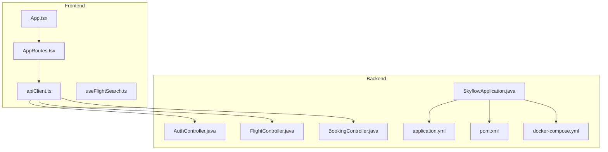
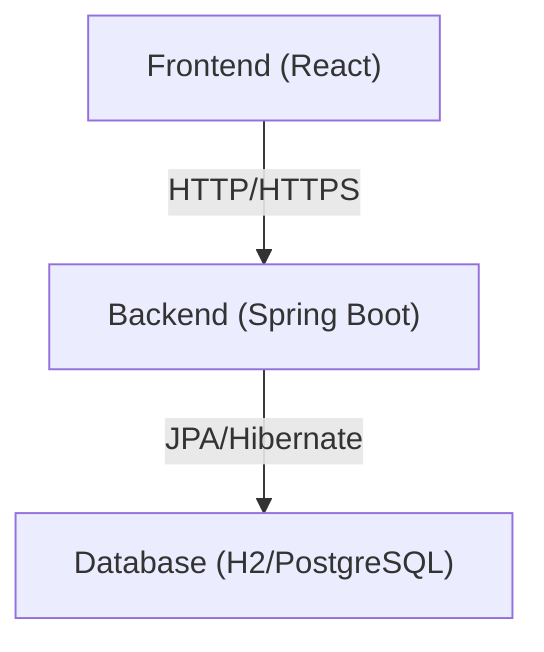
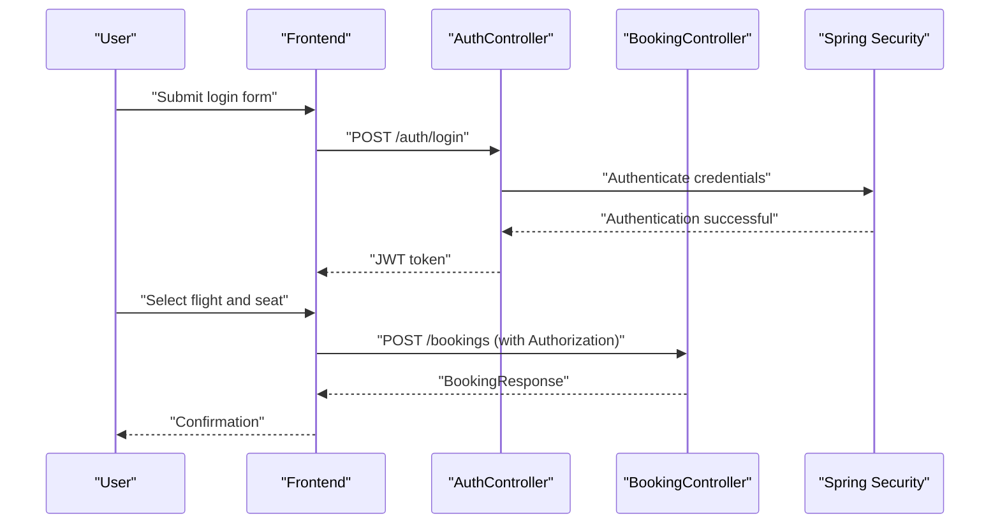
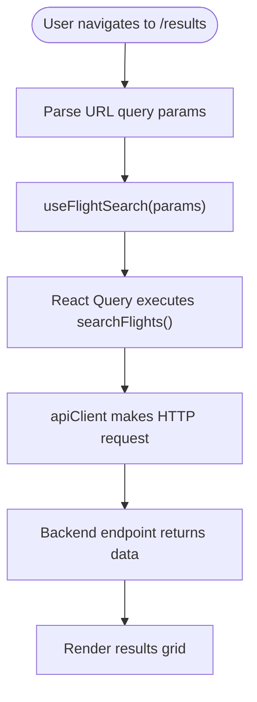
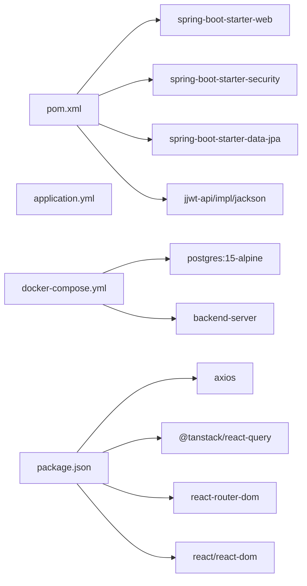

# Project Overview

<cite>
**Referenced Files in This Document**
- [SkyflowApplication.java](file://backend-server/src/main/java/com/skyflow/SkyflowApplication.java)
- [AuthController.java](file://backend-server/src/main/java/com/skyflow/controller/AuthController.java)
- [FlightController.java](file://backend-server/src/main/java/com/skyflow/controller/FlightController.java)
- [BookingController.java](file://backend-server/src/main/java/com/skyflow/controller/BookingController.java)
- [application.yml](file://backend-server/src/main/resources/application.yml)
- [pom.xml](file://backend-server/pom.xml)
- [docker-compose.yml](file://backend-server/docker-compose.yml)
- [README.md (Backend)](file://backend-server/README.md)
- [README.md (Frontend)](file://skyflow-pro/README.md)
- [App.tsx](file://skyflow-pro/src/App.tsx)
- [AppRoutes.tsx](file://skyflow-pro/src/routes/AppRoutes.tsx)
- [apiClient.ts](file://skyflow-pro/src/services/api/apiClient.ts)
- [useFlightSearch.ts](file://skyflow-pro/src/hooks/useFlightSearch.ts)
- [CONNECTION-GUIDE.md](file://CONNECTION-GUIDE.md)
</cite>

## Table of Contents
1. [Introduction](#introduction)
2. [Project Structure](#project-structure)
3. [Core Components](#core-components)
4. [Architecture Overview](#architecture-overview)
5. [Detailed Component Analysis](#detailed-component-analysis)
6. [Dependency Analysis](#dependency-analysis)
7. [Performance Considerations](#performance-considerations)
8. [Troubleshooting Guide](#troubleshooting-guide)
9. [Conclusion](#conclusion)

## Introduction
SkyFlow Pro is a full-stack airline reservation system designed to deliver a seamless flight search and booking experience. It combines a modern React-based frontend with a robust Spring Boot backend, enabling real-time flight discovery, user authentication, seat selection, and end-to-end booking management. The system emphasizes a clean separation of concerns, with the backend exposing RESTful APIs secured by JWT and the frontend orchestrating user interactions and state through a responsive UI.

Target audience and use cases:
- Travelers seeking convenient flight search and booking
- Administrators needing oversight of bookings and notifications
- Developers building scalable, testable full-stack applications with modern toolchains

## Project Structure
SkyFlow Pro is organized as a dual-application project:
- Backend: Spring Boot application providing APIs for authentication, flight search, seat pricing, and booking management
- Frontend: React application with TypeScript, Vite, and Tailwind for a fast, accessible user interface
- Integration: Frontend proxies API calls to the backend during development and authenticates users via JWT tokens

**Diagram sources**
- [SkyflowApplication.java:1-14](file://backend-server/src/main/java/com/skyflow/SkyflowApplication.java#L1-L14)
- [AuthController.java:1-58](file://backend-server/src/main/java/com/skyflow/controller/AuthController.java#L1-L58)
- [FlightController.java:1-50](file://backend-server/src/main/java/com/skyflow/controller/FlightController.java#L1-L50)
- [BookingController.java:1-89](file://backend-server/src/main/java/com/skyflow/controller/BookingController.java#L1-L89)
- [application.yml:1-30](file://backend-server/src/main/resources/application.yml#L1-L30)
- [pom.xml:1-165](file://backend-server/pom.xml#L1-L165)
- [docker-compose.yml:1-36](file://backend-server/docker-compose.yml#L1-L36)
- [App.tsx:1-18](file://skyflow-pro/src/App.tsx#L1-L18)
- [AppRoutes.tsx:1-23](file://skyflow-pro/src/routes/AppRoutes.tsx#L1-L23)
- [apiClient.ts:1-38](file://skyflow-pro/src/services/api/apiClient.ts#L1-L38)
- [useFlightSearch.ts:1-12](file://skyflow-pro/src/hooks/useFlightSearch.ts#L1-L12)

**Section sources**
- [README.md (Backend):1-78](file://backend-server/README.md#L1-L78)
- [README.md (Frontend):1-118](file://skyflow-pro/README.md#L1-L118)
- [CONNECTION-GUIDE.md:1-221](file://CONNECTION-GUIDE.md#L1-L221)

## Core Components
- Backend entry point and configuration:
  - Application bootstrap and Spring Boot auto-configuration
  - Database and JWT configuration for development and containerized deployment
- Controllers:
  - Authentication: user registration and login with JWT generation
  - Flight search: city listing and flight search with fare breakdown
  - Booking: creation, retrieval, and cancellation with validation and error handling
- Frontend:
  - Routing: centralized route definitions for landing, results, booking, and confirmation
  - API client: Axios-based client with automatic JWT injection and 401 handling
  - Search hook: React Query-powered flight search with enabled conditions

Key capabilities:
- Real-time flight search and pricing breakdown
- Secure user authentication and session management
- Seat selection and booking lifecycle management
- Notification and support chat endpoints

**Section sources**
- [SkyflowApplication.java:1-14](file://backend-server/src/main/java/com/skyflow/SkyflowApplication.java#L1-L14)
- [AuthController.java:1-58](file://backend-server/src/main/java/com/skyflow/controller/AuthController.java#L1-L58)
- [FlightController.java:1-50](file://backend-server/src/main/java/com/skyflow/controller/FlightController.java#L1-L50)
- [BookingController.java:1-89](file://backend-server/src/main/java/com/skyflow/controller/BookingController.java#L1-L89)
- [application.yml:1-30](file://backend-server/src/main/resources/application.yml#L1-L30)
- [App.tsx:1-18](file://skyflow-pro/src/App.tsx#L1-L18)
- [AppRoutes.tsx:1-23](file://skyflow-pro/src/routes/AppRoutes.tsx#L1-L23)
- [apiClient.ts:1-38](file://skyflow-pro/src/services/api/apiClient.ts#L1-L38)
- [useFlightSearch.ts:1-12](file://skyflow-pro/src/hooks/useFlightSearch.ts#L1-L12)

## Architecture Overview
SkyFlow Pro follows a layered architecture:
- Presentation layer (React): UI components, routing, and state management
- API layer (Spring Boot): REST endpoints for authentication, flights, and bookings
- Persistence layer: H2 in-memory database during development; containerized PostgreSQL in Docker Compose
- Security layer: Spring Security with JWT-based authentication and CORS configuration

**Diagram sources**
- [application.yml:1-30](file://backend-server/src/main/resources/application.yml#L1-L30)
- [docker-compose.yml:1-36](file://backend-server/docker-compose.yml#L1-L36)
- [pom.xml:74-137](file://backend-server/pom.xml#L74-L137)

## Detailed Component Analysis

### Backend API Endpoints
- Authentication
  - POST /auth/register: Registers a new user
  - POST /auth/login: Authenticates and returns a JWT token
- Flights
  - GET /cities: Lists cities, optionally filtered by tag
  - GET /flights/search: Searches flights by origin, destination, and date
  - GET /flights/{id}/fare-breakdown: Retrieves fare breakdown by seat class and type
- Bookings
  - POST /bookings: Creates a booking with flightId, seatNumber, and seatClass
  - GET /bookings/my-bookings: Lists current user’s bookings
  - POST /bookings/cancel/{id}: Cancels a booking by ID

**Diagram sources**
- [AuthController.java:29-40](file://backend-server/src/main/java/com/skyflow/controller/AuthController.java#L29-L40)
- [BookingController.java:21-70](file://backend-server/src/main/java/com/skyflow/controller/BookingController.java#L21-L70)

**Section sources**
- [README.md (Backend):40-62](file://backend-server/README.md#L40-L62)
- [AuthController.java:1-58](file://backend-server/src/main/java/com/skyflow/controller/AuthController.java#L1-L58)
- [FlightController.java:1-50](file://backend-server/src/main/java/com/skyflow/controller/FlightController.java#L1-L50)
- [BookingController.java:1-89](file://backend-server/src/main/java/com/skyflow/controller/BookingController.java#L1-L89)

### Frontend Routing and API Integration
- Routing: Centralized routes for search, results, booking, and confirmation pages
- API client: Axios client configured with base URL and JWT interceptor for protected endpoints
- Search hook: React Query integration to fetch and cache search results

**Diagram sources**
- [AppRoutes.tsx:12-22](file://skyflow-pro/src/routes/AppRoutes.tsx#L12-L22)
- [useFlightSearch.ts:4-10](file://skyflow-pro/src/hooks/useFlightSearch.ts#L4-L10)
- [apiClient.ts:4-38](file://skyflow-pro/src/services/api/apiClient.ts#L4-L38)

**Section sources**
- [AppRoutes.tsx:1-23](file://skyflow-pro/src/routes/AppRoutes.tsx#L1-L23)
- [apiClient.ts:1-38](file://skyflow-pro/src/services/api/apiClient.ts#L1-L38)
- [useFlightSearch.ts:1-12](file://skyflow-pro/src/hooks/useFlightSearch.ts#L1-L12)

### Technology Choices and Design Philosophy
- Backend
  - Spring Boot for rapid development and production-grade features
  - JPA/Hibernate for ORM and data persistence
  - Spring Security with JWT for authentication and authorization
  - H2 for development and PostgreSQL via Docker Compose for containerized environments
- Frontend
  - React with TypeScript for type safety and component modularity
  - Vite for fast builds and HMR
  - Tailwind CSS for utility-first styling
  - React Router for declarative routing
  - React Query for caching and optimistic updates
  - Zustand for lightweight state management

**Section sources**
- [pom.xml:74-137](file://backend-server/pom.xml#L74-L137)
- [application.yml:1-30](file://backend-server/src/main/resources/application.yml#L1-L30)
- [docker-compose.yml:1-36](file://backend-server/docker-compose.yml#L1-L36)
- [README.md (Frontend):1-118](file://skyflow-pro/README.md#L1-L118)

## Dependency Analysis
- Backend dependencies include Spring Web, Security, Data JPA, validation, and JWT libraries
- Frontend dependencies include React, React Router, Axios, React Query, and Tailwind
- Docker Compose defines a network and volumes for backend and database services

**Diagram sources**
- [pom.xml:74-137](file://backend-server/pom.xml#L74-L137)
- [application.yml:1-30](file://backend-server/src/main/resources/application.yml#L1-L30)
- [docker-compose.yml:1-36](file://backend-server/docker-compose.yml#L1-L36)
- [package.json:1-46](file://skyflow-pro/package.json#L1-L46)

**Section sources**
- [pom.xml:1-165](file://backend-server/pom.xml#L1-L165)
- [package.json:1-46](file://skyflow-pro/package.json#L1-L46)
- [docker-compose.yml:1-36](file://backend-server/docker-compose.yml#L1-L36)

## Performance Considerations
- Frontend
  - React Query caching reduces redundant network calls and improves perceived performance
  - Vite’s optimized bundling and HMR enhance developer experience
- Backend
  - Containerized PostgreSQL in Docker Compose supports scalable deployments
  - JWT-based stateless authentication avoids server-side session overhead
- Recommendations
  - Implement pagination for large datasets
  - Use optimistic updates for booking confirmations
  - Add circuit breaker patterns for resilience (already present in frontend services)

[No sources needed since this section provides general guidance]

## Troubleshooting Guide
Common issues and resolutions:
- Backend not responding
  - Confirm Java process is running and port 8080 is free
  - Restart backend using Maven wrapper
- Frontend not loading
  - Confirm Node process is running and port 5173 is free
  - Restart frontend using npm scripts
- CORS errors
  - Ensure backend CORS configuration permits frontend origin
  - Verify Vite proxy configuration for API routes
- Authentication failures
  - Verify JWT token presence in Authorization header
  - Confirm user registration and credentials

**Section sources**
- [CONNECTION-GUIDE.md:166-187](file://CONNECTION-GUIDE.md#L166-L187)

## Conclusion
SkyFlow Pro demonstrates a cohesive full-stack design that balances developer productivity with user experience. The backend provides a secure, extensible API surface, while the frontend delivers a responsive, accessible interface. Together, they form a complete solution for flight search and booking, with clear separation of concerns, modern tooling, and practical integration patterns.

[No sources needed since this section summarizes without analyzing specific files]