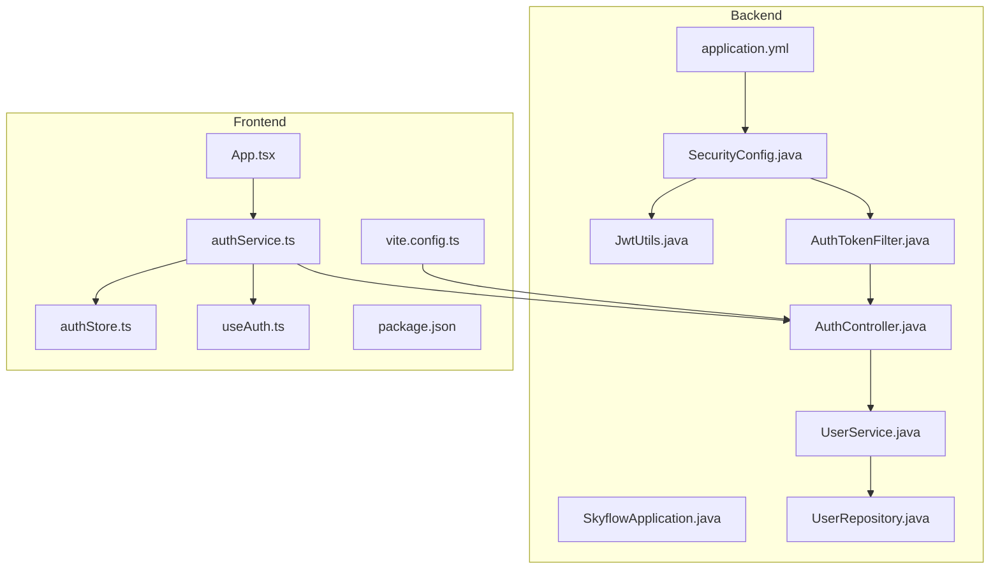
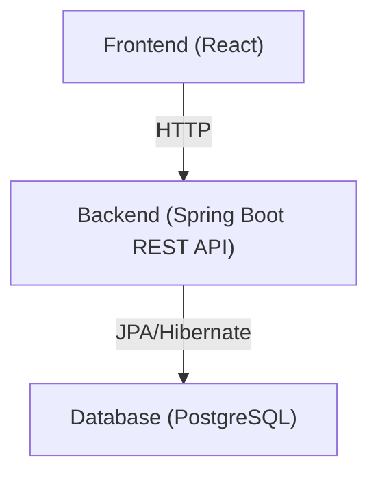
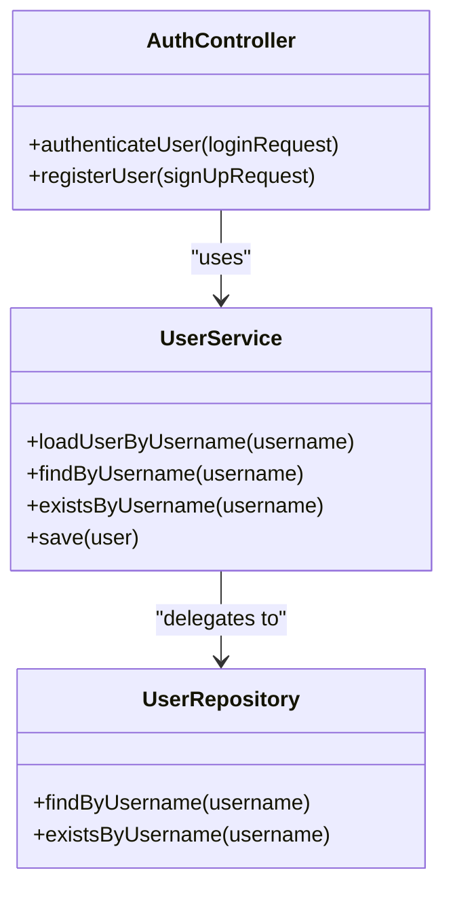
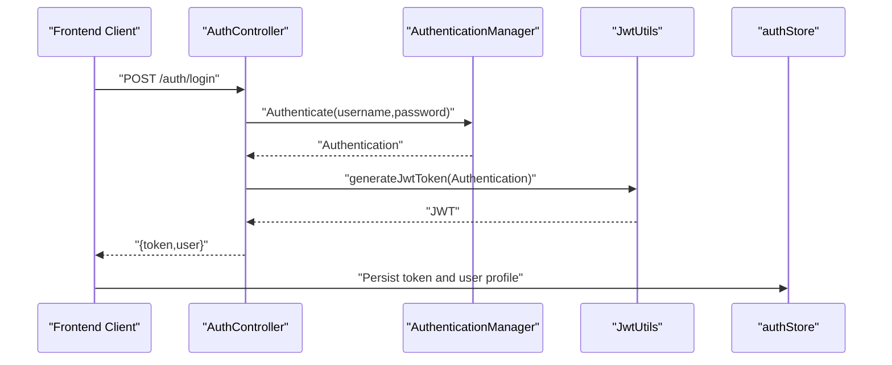
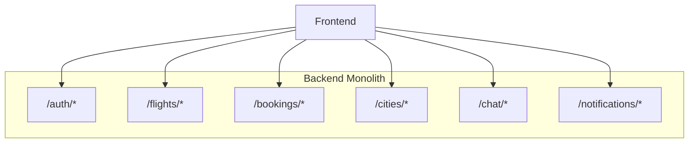
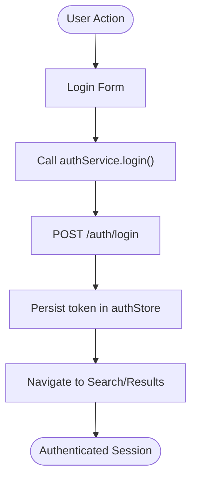
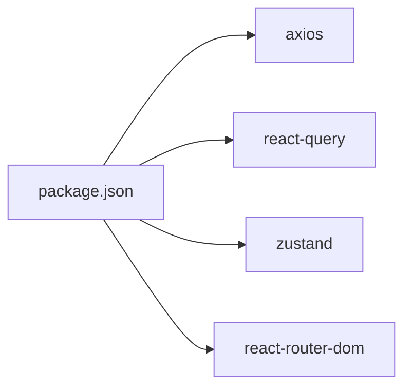
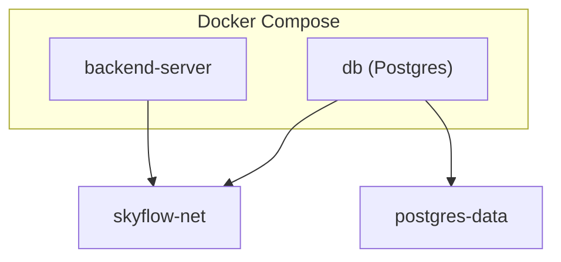

# System Architecture

<cite>
**Referenced Files in This Document**
- [SkyflowApplication.java](file://backend-server/src/main/java/com/skyflow/SkyflowApplication.java)
- [application.yml](file://backend-server/src/main/resources/application.yml)
- [SecurityConfig.java](file://backend-server/src/main/java/com/skyflow/config/SecurityConfig.java)
- [JwtUtils.java](file://backend-server/src/main/java/com/skyflow/security/JwtUtils.java)
- [AuthTokenFilter.java](file://backend-server/src/main/java/com/skyflow/security/AuthTokenFilter.java)
- [AuthController.java](file://backend-server/src/main/java/com/skyflow/controller/AuthController.java)
- [UserService.java](file://backend-server/src/main/java/com/skyflow/service/UserService.java)
- [UserRepository.java](file://backend-server/src/main/java/com/skyflow/repository/UserRepository.java)
- [Dockerfile](file://backend-server/Dockerfile)
- [docker-compose.yml](file://backend-server/docker-compose.yml)
- [App.tsx](file://skyflow-pro/src/App.tsx)
- [authService.ts](file://skyflow-pro/src/services/auth/authService.ts)
- [authStore.ts](file://skyflow-pro/src/stores/authStore.ts)
- [useAuth.ts](file://skyflow-pro/src/hooks/useAuth.ts)
- [vite.config.ts](file://skyflow-pro/vite.config.ts)
- [package.json](file://skyflow-pro/package.json)
</cite>

## Table of Contents
1. [Introduction](#introduction)
2. [Project Structure](#project-structure)
3. [Core Components](#core-components)
4. [Architecture Overview](#architecture-overview)
5. [Detailed Component Analysis](#detailed-component-analysis)
6. [Dependency Analysis](#dependency-analysis)
7. [Performance Considerations](#performance-considerations)
8. [Troubleshooting Guide](#troubleshooting-guide)
9. [Conclusion](#conclusion)
10. [Appendices](#appendices)

## Introduction
This document describes the SkyFlow Pro system architecture, focusing on the separation between the backend REST API and the frontend React application, layered architecture, microservices-like design within a single application, JWT-based authentication, stateless design, system boundaries, component interactions, deployment with Docker, and operational considerations for development and production.

## Project Structure
SkyFlow Pro is organized into two primary parts:
- Backend REST API: Spring Boot application exposing HTTP endpoints for authentication, flights, bookings, cities, chat, and notifications.
- Frontend Application: React application built with Vite, TypeScript, and modern client-side state management.

High-level structure:
- Backend: Java, Spring Boot, JPA/Hibernate, PostgreSQL (via docker-compose), JWT-based security, stateless design.
- Frontend: React 18, Vite, React Router, TanStack React Query, Zustand for state, Axios for HTTP requests.

**Diagram sources**
- [SkyflowApplication.java:1-14](file://backend-server/src/main/java/com/skyflow/SkyflowApplication.java#L1-L14)
- [application.yml:1-30](file://backend-server/src/main/resources/application.yml#L1-L30)
- [SecurityConfig.java:1-81](file://backend-server/src/main/java/com/skyflow/config/SecurityConfig.java#L1-L81)
- [JwtUtils.java:1-53](file://backend-server/src/main/java/com/skyflow/security/JwtUtils.java#L1-L53)
- [AuthTokenFilter.java](file://backend-server/src/main/java/com/skyflow/security/AuthTokenFilter.java)
- [AuthController.java:1-58](file://backend-server/src/main/java/com/skyflow/controller/AuthController.java#L1-L58)
- [UserService.java:1-42](file://backend-server/src/main/java/com/skyflow/service/UserService.java#L1-L42)
- [UserRepository.java:1-12](file://backend-server/src/main/java/com/skyflow/repository/UserRepository.java#L1-L12)
- [App.tsx:1-18](file://skyflow-pro/src/App.tsx#L1-L18)
- [authService.ts:1-38](file://skyflow-pro/src/services/auth/authService.ts#L1-L38)
- [authStore.ts:1-123](file://skyflow-pro/src/stores/authStore.ts#L1-L123)
- [useAuth.ts:1-7](file://skyflow-pro/src/hooks/useAuth.ts#L1-L7)
- [vite.config.ts:1-53](file://skyflow-pro/vite.config.ts#L1-L53)
- [package.json:1-46](file://skyflow-pro/package.json#L1-L46)

**Section sources**
- [SkyflowApplication.java:1-14](file://backend-server/src/main/java/com/skyflow/SkyflowApplication.java#L1-L14)
- [application.yml:1-30](file://backend-server/src/main/resources/application.yml#L1-L30)
- [App.tsx:1-18](file://skyflow-pro/src/App.tsx#L1-L18)
- [package.json:1-46](file://skyflow-pro/package.json#L1-L46)

## Core Components
- Backend REST API
  - Entry point and Spring Boot configuration.
  - Security configuration enabling stateless authentication and CORS.
  - JWT utilities for token generation and validation.
  - Auth controller handling login and registration.
  - User service and repository implementing user management.
- Frontend React Application
  - Root component orchestrating navigation and routes.
  - Authentication service interacting with backend auth endpoints.
  - Zustand store managing authentication state and profile.
  - Vite proxy routing to backend endpoints during development.

**Section sources**
- [SkyflowApplication.java:1-14](file://backend-server/src/main/java/com/skyflow/SkyflowApplication.java#L1-L14)
- [SecurityConfig.java:1-81](file://backend-server/src/main/java/com/skyflow/config/SecurityConfig.java#L1-L81)
- [JwtUtils.java:1-53](file://backend-server/src/main/java/com/skyflow/security/JwtUtils.java#L1-L53)
- [AuthController.java:1-58](file://backend-server/src/main/java/com/skyflow/controller/AuthController.java#L1-L58)
- [UserService.java:1-42](file://backend-server/src/main/java/com/skyflow/service/UserService.java#L1-L42)
- [UserRepository.java:1-12](file://backend-server/src/main/java/com/skyflow/repository/UserRepository.java#L1-L12)
- [App.tsx:1-18](file://skyflow-pro/src/App.tsx#L1-L18)
- [authService.ts:1-38](file://skyflow-pro/src/services/auth/authService.ts#L1-L38)
- [authStore.ts:1-123](file://skyflow-pro/src/stores/authStore.ts#L1-L123)
- [vite.config.ts:1-53](file://skyflow-pro/vite.config.ts#L1-L53)

## Architecture Overview
SkyFlow Pro follows a layered architecture:
- Presentation Layer (Frontend): React components, services, and stores.
- Business Logic Layer (Backend): Controllers, Services, and domain logic.
- Data Access Layer (Backend): Repositories and JPA/Hibernate.

The backend enforces stateless authentication via JWT and exposes REST endpoints. The frontend proxies API calls to the backend during development and persists tokens locally for stateless sessions.

**Diagram sources**
- [AuthController.java:1-58](file://backend-server/src/main/java/com/skyflow/controller/AuthController.java#L1-L58)
- [UserService.java:1-42](file://backend-server/src/main/java/com/skyflow/service/UserService.java#L1-L42)
- [UserRepository.java:1-12](file://backend-server/src/main/java/com/skyflow/repository/UserRepository.java#L1-L12)
- [application.yml:1-30](file://backend-server/src/main/resources/application.yml#L1-L30)

## Detailed Component Analysis

### Backend REST API Layered Architecture
- Presentation: Controllers expose endpoints under base paths such as /auth, /flights, /cities, /bookings, /chat, and /notifications.
- Business Logic: Services encapsulate use-case logic and coordinate repositories.
- Data Access: JPA repositories provide CRUD operations over entities.

**Diagram sources**
- [AuthController.java:1-58](file://backend-server/src/main/java/com/skyflow/controller/AuthController.java#L1-L58)
- [UserService.java:1-42](file://backend-server/src/main/java/com/skyflow/service/UserService.java#L1-L42)
- [UserRepository.java:1-12](file://backend-server/src/main/java/com/skyflow/repository/UserRepository.java#L1-L12)

**Section sources**
- [AuthController.java:1-58](file://backend-server/src/main/java/com/skyflow/controller/AuthController.java#L1-L58)
- [UserService.java:1-42](file://backend-server/src/main/java/com/skyflow/service/UserService.java#L1-L42)
- [UserRepository.java:1-12](file://backend-server/src/main/java/com/skyflow/repository/UserRepository.java#L1-L12)

### JWT-Based Stateless Authentication Flow
The system uses stateless JWT authentication:
- Clients send credentials to /auth/login.
- Backend authenticates via AuthenticationManager and issues a signed JWT.
- Frontend stores the token and includes it in Authorization headers for protected endpoints.
- Backend validates tokens using AuthTokenFilter and JwtUtils.

**Diagram sources**
- [AuthController.java:1-58](file://backend-server/src/main/java/com/skyflow/controller/AuthController.java#L1-L58)
- [JwtUtils.java:1-53](file://backend-server/src/main/java/com/skyflow/security/JwtUtils.java#L1-L53)
- [authService.ts:1-38](file://skyflow-pro/src/services/auth/authService.ts#L1-L38)
- [authStore.ts:1-123](file://skyflow-pro/src/stores/authStore.ts#L1-L123)

**Section sources**
- [SecurityConfig.java:1-81](file://backend-server/src/main/java/com/skyflow/config/SecurityConfig.java#L1-L81)
- [JwtUtils.java:1-53](file://backend-server/src/main/java/com/skyflow/security/JwtUtils.java#L1-L53)
- [AuthTokenFilter.java](file://backend-server/src/main/java/com/skyflow/security/AuthTokenFilter.java)
- [AuthController.java:1-58](file://backend-server/src/main/java/com/skyflow/controller/AuthController.java#L1-L58)
- [authService.ts:1-38](file://skyflow-pro/src/services/auth/authService.ts#L1-L38)
- [authStore.ts:1-123](file://skyflow-pro/src/stores/authStore.ts#L1-L123)

### Microservices-Like Design Within a Single Application
Although implemented as a monolith, the backend exhibits microservices-like separation:
- Clear endpoint namespaces (/auth, /flights, /bookings, /cities, /chat, /notifications).
- Separation of concerns across controllers, services, and repositories.
- Stateless design enables horizontal scaling and independent deployment of backend and frontend.

**Diagram sources**
- [AuthController.java:1-58](file://backend-server/src/main/java/com/skyflow/controller/AuthController.java#L1-L58)
- [application.yml:1-30](file://backend-server/src/main/resources/application.yml#L1-L30)

**Section sources**
- [application.yml:1-30](file://backend-server/src/main/resources/application.yml#L1-L30)

### Frontend React Application
- Root component integrates navigation and routing.
- Authentication service communicates with backend auth endpoints.
- Zustand store manages user profile, token, and booking history with persistence.
- Vite dev server proxies API paths to the backend for seamless development.

**Diagram sources**
- [App.tsx:1-18](file://skyflow-pro/src/App.tsx#L1-L18)
- [authService.ts:1-38](file://skyflow-pro/src/services/auth/authService.ts#L1-L38)
- [authStore.ts:1-123](file://skyflow-pro/src/stores/authStore.ts#L1-L123)
- [vite.config.ts:1-53](file://skyflow-pro/vite.config.ts#L1-L53)

**Section sources**
- [App.tsx:1-18](file://skyflow-pro/src/App.tsx#L1-L18)
- [authService.ts:1-38](file://skyflow-pro/src/services/auth/authService.ts#L1-L38)
- [authStore.ts:1-123](file://skyflow-pro/src/stores/authStore.ts#L1-L123)
- [useAuth.ts:1-7](file://skyflow-pro/src/hooks/useAuth.ts#L1-L7)
- [vite.config.ts:1-53](file://skyflow-pro/vite.config.ts#L1-L53)
- [package.json:1-46](file://skyflow-pro/package.json#L1-L46)

## Dependency Analysis
- Backend dependencies
  - Spring Security for stateless authentication and CORS.
  - JPA/Hibernate for data persistence.
  - H2 console enabled for development; PostgreSQL configured via docker-compose.
  - JWT utilities for token signing and verification.
- Frontend dependencies
  - React Query for caching and data fetching.
  - Axios for HTTP requests.
  - Zustand for local state and persistence.
  - Vite for build tooling and proxy configuration.

**Diagram sources**
- [package.json:1-46](file://skyflow-pro/package.json#L1-L46)

**Section sources**
- [package.json:1-46](file://skyflow-pro/package.json#L1-L46)

## Performance Considerations
- Stateless design
  - No server-side session storage reduces memory footprint and simplifies scaling.
- Token-based authentication
  - Eliminates server-side session lookups; validation relies on symmetric key verification.
- Caching and retries
  - React Query provides client-side caching; consider adding optimistic updates and invalidation strategies.
  - HTTP client supports retry and circuit breaker patterns (configured via services).
- Database tuning
  - Use connection pooling and appropriate DDL auto settings per environment.
  - Indexes on frequently queried columns (e.g., usernames) improve lookup performance.
- Network optimization
  - Enable compression and minimize payload sizes.
  - Batch related requests where feasible.

[No sources needed since this section provides general guidance]

## Troubleshooting Guide
- Authentication failures
  - Verify JWT secret and expiration settings align across backend and frontend.
  - Confirm AuthTokenFilter is applied and SecurityConfig permits unauthenticated access to /auth endpoints.
- CORS errors
  - Ensure allowed origins, methods, and headers are configured for development and production.
- Database connectivity
  - Check datasource URL, credentials, and container network mapping in docker-compose.
- Frontend proxy issues
  - Validate Vite proxy targets match backend port and base paths.

**Section sources**
- [SecurityConfig.java:1-81](file://backend-server/src/main/java/com/skyflow/config/SecurityConfig.java#L1-L81)
- [application.yml:1-30](file://backend-server/src/main/resources/application.yml#L1-L30)
- [docker-compose.yml:1-36](file://backend-server/docker-compose.yml#L1-L36)
- [vite.config.ts:1-53](file://skyflow-pro/vite.config.ts#L1-L53)

## Conclusion
SkyFlow Pro employs a clean separation between a stateless Spring Boot backend and a modern React frontend. The backend’s layered architecture and JWT-based authentication enable scalable, maintainable operations. The frontend leverages contemporary libraries for robust state management and efficient data fetching. Docker configurations support reproducible development and production deployments.

[No sources needed since this section summarizes without analyzing specific files]

## Appendices

### Deployment Architecture
- Backend containerization
  - Multi-stage Docker build produces a minimal JRE runtime image.
- Orchestration
  - docker-compose defines backend and database services, environment variables, and volume mounts.
- Ports and networking
  - Backend exposed on port 8080; database on 5432; internal service communication via container network.

**Diagram sources**
- [Dockerfile:1-11](file://backend-server/Dockerfile#L1-L11)
- [docker-compose.yml:1-36](file://backend-server/docker-compose.yml#L1-L36)

**Section sources**
- [Dockerfile:1-11](file://backend-server/Dockerfile#L1-L11)
- [docker-compose.yml:1-36](file://backend-server/docker-compose.yml#L1-L36)

### Environment Configuration
- Development
  - Vite proxy routes API calls to backend port 8081 during local development.
  - H2 console enabled for quick database inspection.
- Production
  - PostgreSQL configured via environment variables.
  - JWT secret and expiration configured via application.yml.

**Section sources**
- [vite.config.ts:1-53](file://skyflow-pro/vite.config.ts#L1-L53)
- [application.yml:1-30](file://backend-server/src/main/resources/application.yml#L1-L30)