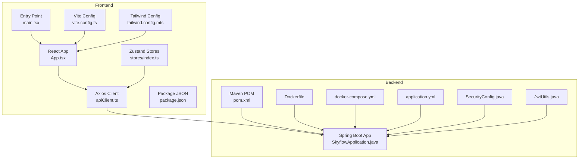
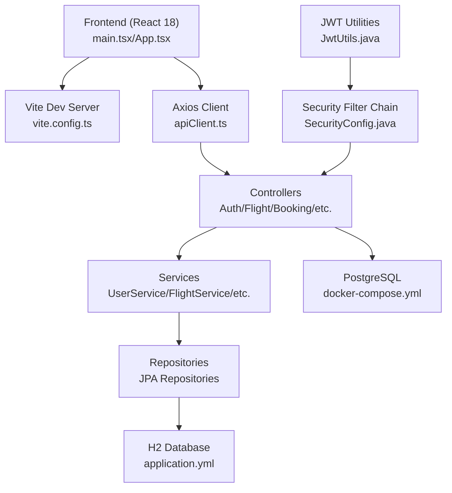
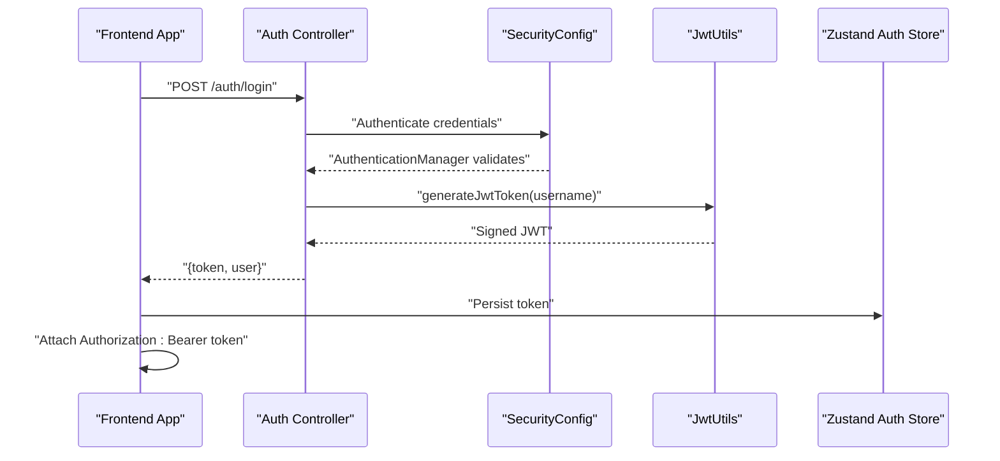
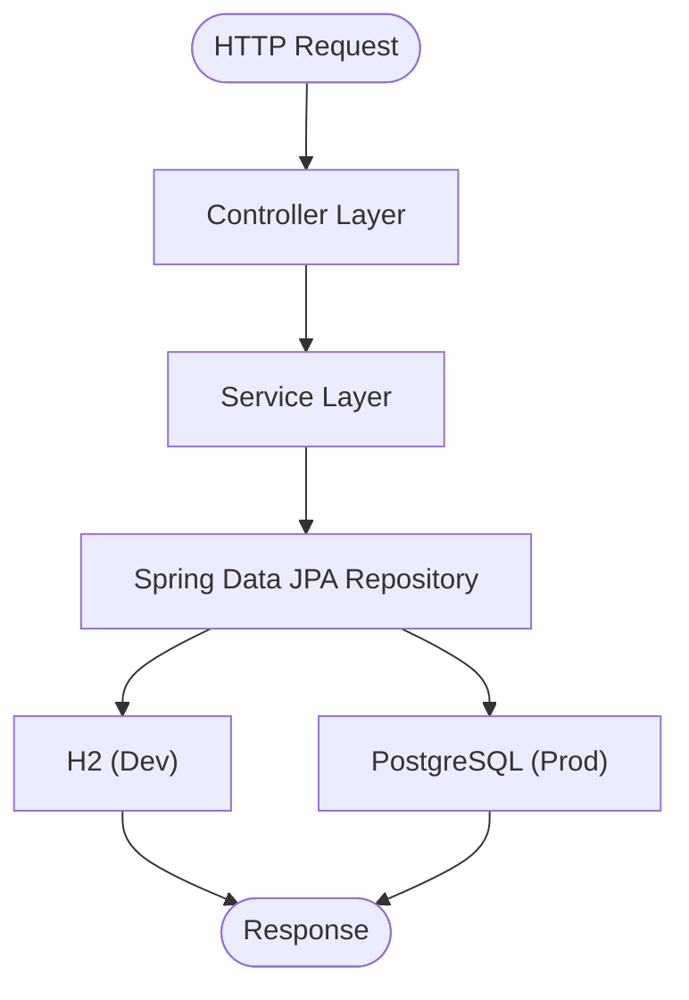
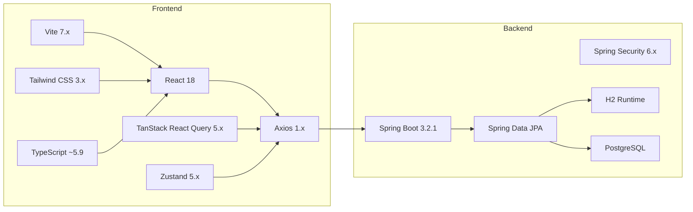

# Technology Stack

<cite>
**Referenced Files in This Document**
- [pom.xml](file://backend-server/pom.xml)
- [application.yml](file://backend-server/src/main/resources/application.yml)
- [SkyflowApplication.java](file://backend-server/src/main/java/com/skyflow/SkyflowApplication.java)
- [SecurityConfig.java](file://backend-server/src/main/java/com/skyflow/config/SecurityConfig.java)
- [JwtUtils.java](file://backend-server/src/main/java/com/skyflow/security/JwtUtils.java)
- [Dockerfile](file://backend-server/Dockerfile)
- [docker-compose.yml](file://backend-server/docker-compose.yml)
- [package.json](file://skyflow-pro/package.json)
- [vite.config.ts](file://skyflow-pro/vite.config.ts)
- [tailwind.config.mts](file://skyflow-pro/tailwind.config.mts)
- [apiClient.ts](file://skyflow-pro/src/services/api/apiClient.ts)
- [index.ts](file://skyflow-pro/src/stores/index.ts)
- [App.tsx](file://skyflow-pro/src/App.tsx)
- [main.tsx](file://skyflow-pro/src/main.tsx)
- [tsconfig.json](file://skyflow-pro/tsconfig.json)
</cite>

## Table of Contents
1. [Introduction](#introduction)
2. [Project Structure](#project-structure)
3. [Core Components](#core-components)
4. [Architecture Overview](#architecture-overview)
5. [Detailed Component Analysis](#detailed-component-analysis)
6. [Dependency Analysis](#dependency-analysis)
7. [Performance Considerations](#performance-considerations)
8. [Troubleshooting Guide](#troubleshooting-guide)
9. [Conclusion](#conclusion)

## Introduction
This document provides a comprehensive technology stack overview for SkyFlow Pro. It covers the backend built with Java 17+ and Spring Boot 3.2.1, including Spring Security, Spring Data JPA, PostgreSQL/H2 database, and JWT authentication. On the frontend, it documents React 18, TypeScript, Vite, Tailwind CSS, Zustand state management, and Axios HTTP client. It also explains the rationale behind technology choices, version compatibility requirements, development tools configuration, build tools, dependency management, and deployment technologies.

## Project Structure
SkyFlow Pro follows a clear separation of concerns:
- Backend: Spring Boot application under backend-server with Maven for dependency management and packaging.
- Frontend: React 18 single-page application under skyflow-pro using Vite for development and build tooling.
- Deployment: Docker images and docker-compose orchestration for local and containerized environments.

**Diagram sources**
- [SkyflowApplication.java:1-14](file://backend-server/src/main/java/com/skyflow/SkyflowApplication.java#L1-L14)
- [SecurityConfig.java:1-81](file://backend-server/src/main/java/com/skyflow/config/SecurityConfig.java#L1-L81)
- [JwtUtils.java:1-53](file://backend-server/src/main/java/com/skyflow/security/JwtUtils.java#L1-L53)
- [application.yml:1-30](file://backend-server/src/main/resources/application.yml#L1-L30)
- [pom.xml:1-165](file://backend-server/pom.xml#L1-L165)
- [Dockerfile:1-11](file://backend-server/Dockerfile#L1-L11)
- [docker-compose.yml:1-36](file://backend-server/docker-compose.yml#L1-L36)
- [App.tsx:1-18](file://skyflow-pro/src/App.tsx#L1-L18)
- [main.tsx:1-33](file://skyflow-pro/src/main.tsx#L1-L33)
- [vite.config.ts:1-53](file://skyflow-pro/vite.config.ts#L1-L53)
- [tailwind.config.mts:1-124](file://skyflow-pro/tailwind.config.mts#L1-L124)
- [apiClient.ts:1-38](file://skyflow-pro/src/services/api/apiClient.ts#L1-L38)
- [index.ts:1-8](file://skyflow-pro/src/stores/index.ts#L1-L8)
- [package.json:1-46](file://skyflow-pro/package.json#L1-L46)

**Section sources**
- [SkyflowApplication.java:1-14](file://backend-server/src/main/java/com/skyflow/SkyflowApplication.java#L1-L14)
- [pom.xml:1-165](file://backend-server/pom.xml#L1-L165)
- [application.yml:1-30](file://backend-server/src/main/resources/application.yml#L1-L30)
- [Dockerfile:1-11](file://backend-server/Dockerfile#L1-L11)
- [docker-compose.yml:1-36](file://backend-server/docker-compose.yml#L1-L36)
- [App.tsx:1-18](file://skyflow-pro/src/App.tsx#L1-L18)
- [main.tsx:1-33](file://skyflow-pro/src/main.tsx#L1-L33)
- [vite.config.ts:1-53](file://skyflow-pro/vite.config.ts#L1-L53)
- [tailwind.config.mts:1-124](file://skyflow-pro/tailwind.config.mts#L1-L124)
- [apiClient.ts:1-38](file://skyflow-pro/src/services/api/apiClient.ts#L1-L38)
- [index.ts:1-8](file://skyflow-pro/src/stores/index.ts#L1-L8)
- [package.json:1-46](file://skyflow-pro/package.json#L1-L46)

## Core Components
- Backend runtime and framework
  - Java 17+ runtime and Maven build tooling
  - Spring Boot 3.2.1 parent starter
  - Spring Web MVC, Security, Data JPA, Validation starters
  - Lombok for concise POJOs
  - JWT libraries for token-based authentication
- Databases
  - H2 in-memory database for development and testing
  - PostgreSQL for production via docker-compose
- Security
  - Spring Security with stateless session policy
  - BCrypt password encoder
  - JWT utilities for token generation and validation
- Frontend runtime and framework
  - React 18 with TypeScript
  - Vite for dev server and bundling
  - Tailwind CSS for styling
  - Zustand for lightweight state management
  - Axios for HTTP requests with interceptors
  - TanStack React Query for caching and data fetching
- Build and deployment
  - Maven for backend builds
  - Vite for frontend builds
  - Docker and docker-compose for containerization

**Section sources**
- [pom.xml:16-18](file://backend-server/pom.xml#L16-L18)
- [pom.xml:74-137](file://backend-server/pom.xml#L74-L137)
- [application.yml:1-30](file://backend-server/src/main/resources/application.yml#L1-L30)
- [SecurityConfig.java:1-81](file://backend-server/src/main/java/com/skyflow/config/SecurityConfig.java#L1-L81)
- [JwtUtils.java:1-53](file://backend-server/src/main/java/com/skyflow/security/JwtUtils.java#L1-L53)
- [package.json:1-46](file://skyflow-pro/package.json#L1-L46)
- [vite.config.ts:1-53](file://skyflow-pro/vite.config.ts#L1-L53)
- [tailwind.config.mts:1-124](file://skyflow-pro/tailwind.config.mts#L1-L124)
- [apiClient.ts:1-38](file://skyflow-pro/src/services/api/apiClient.ts#L1-L38)
- [index.ts:1-8](file://skyflow-pro/src/stores/index.ts#L1-L8)
- [main.tsx:1-33](file://skyflow-pro/src/main.tsx#L1-L33)

## Architecture Overview
SkyFlow Pro uses a classic client-server architecture:
- The React frontend communicates with the Spring Boot backend via HTTP endpoints proxied during development.
- The backend exposes REST endpoints secured by Spring Security and validates JWT tokens.
- Data persistence is handled by Spring Data JPA with Hibernate, using H2 in development and PostgreSQL in production.

**Diagram sources**
- [main.tsx:1-33](file://skyflow-pro/src/main.tsx#L1-L33)
- [App.tsx:1-18](file://skyflow-pro/src/App.tsx#L1-L18)
- [vite.config.ts:1-53](file://skyflow-pro/vite.config.ts#L1-L53)
- [apiClient.ts:1-38](file://skyflow-pro/src/services/api/apiClient.ts#L1-L38)
- [SecurityConfig.java:1-81](file://backend-server/src/main/java/com/skyflow/config/SecurityConfig.java#L1-L81)
- [JwtUtils.java:1-53](file://backend-server/src/main/java/com/skyflow/security/JwtUtils.java#L1-L53)
- [application.yml:1-30](file://backend-server/src/main/resources/application.yml#L1-L30)
- [docker-compose.yml:1-36](file://backend-server/docker-compose.yml#L1-L36)

## Detailed Component Analysis

### Backend Technologies
- Java 17+ and Spring Boot 3.2.1
  - Java version set to 17 in Maven properties and enforced by compiler plugin.
  - Spring Boot parent version 3.2.1 ensures aligned dependency versions.
- Spring ecosystem
  - Web MVC, Security, Data JPA, Validation starters included.
  - Security configured with stateless sessions, permissive CORS, and method-level security enabled.
  - JWT utilities manage token signing, parsing, and validation using HS256.
- Databases
  - H2 in-memory database configured for development with console enabled.
  - docker-compose defines a PostgreSQL service for production-like environments.
- Build and packaging
  - Maven compiler plugin enforces Java 17.
  - Spring Boot Maven plugin used for packaging executable JARs.
- Containerization
  - Multi-stage Docker build using Eclipse Temurin 17 JDK for building and Alpine JRE for runtime.

**Section sources**
- [pom.xml:16-18](file://backend-server/pom.xml#L16-L18)
- [pom.xml:139-162](file://backend-server/pom.xml#L139-L162)
- [SecurityConfig.java:1-81](file://backend-server/src/main/java/com/skyflow/config/SecurityConfig.java#L1-L81)
- [JwtUtils.java:1-53](file://backend-server/src/main/java/com/skyflow/security/JwtUtils.java#L1-L53)
- [application.yml:1-30](file://backend-server/src/main/resources/application.yml#L1-L30)
- [Dockerfile:1-11](file://backend-server/Dockerfile#L1-L11)
- [docker-compose.yml:1-36](file://backend-server/docker-compose.yml#L1-L36)

### Frontend Technologies
- React 18 with TypeScript
  - TypeScript configuration split across app and node configs.
  - Strict mode enabled at the application root.
- Vite
  - Development server with proxy rules for backend endpoints (/api, /auth, /cities, /flights, /chat, /bookings).
  - Test environment configured with jsdom and setup files.
- Styling with Tailwind CSS
  - Custom color palette, font families, shadows, border radii, animations, and backdrop blur effects.
- State Management with Zustand
  - Centralized stores exported via a single index for auth, booking, and notifications.
- HTTP Client with Axios
  - Base URL configurable via environment variable.
  - Request interceptor attaches Authorization header when a token exists.
  - Response interceptor handles 401 Unauthorized by triggering logout.
- Data Fetching with TanStack React Query
  - QueryClient configured with retry, refetch behavior, and stale time defaults.

**Section sources**
- [tsconfig.json:1-8](file://skyflow-pro/tsconfig.json#L1-L8)
- [vite.config.ts:1-53](file://skyflow-pro/vite.config.ts#L1-L53)
- [tailwind.config.mts:1-124](file://skyflow-pro/tailwind.config.mts#L1-L124)
- [index.ts:1-8](file://skyflow-pro/src/stores/index.ts#L1-L8)
- [apiClient.ts:1-38](file://skyflow-pro/src/services/api/apiClient.ts#L1-L38)
- [main.tsx:1-33](file://skyflow-pro/src/main.tsx#L1-L33)
- [package.json:1-46](file://skyflow-pro/package.json#L1-L46)

### JWT Authentication Flow

**Diagram sources**
- [SecurityConfig.java:1-81](file://backend-server/src/main/java/com/skyflow/config/SecurityConfig.java#L1-L81)
- [JwtUtils.java:1-53](file://backend-server/src/main/java/com/skyflow/security/JwtUtils.java#L1-L53)
- [apiClient.ts:1-38](file://skyflow-pro/src/services/api/apiClient.ts#L1-L38)

### Data Persistence Flow

**Diagram sources**
- [application.yml:1-30](file://backend-server/src/main/resources/application.yml#L1-L30)
- [docker-compose.yml:1-36](file://backend-server/docker-compose.yml#L1-L36)

## Dependency Analysis
- Backend dependency alignment
  - Spring Boot 3.2.1 parent manages Spring Framework, Spring Security, Tomcat, Jackson, AssertJ versions.
  - Explicit dependencyManagement blocks ensure consistent versions across modules.
- Frontend dependency alignment
  - React 18, TypeScript ~5.9, Vite 7.x, Tailwind CSS 3.x, Axios 1.x, Zustand 5.x, React Router DOM 6.x, TanStack React Query 5.x.
- Inter-service communication
  - Frontend proxies API paths to the backend development server (port 8081).
  - Production uses environment-specific base URLs.

**Diagram sources**
- [pom.xml:20-73](file://backend-server/pom.xml#L20-L73)
- [package.json:1-46](file://skyflow-pro/package.json#L1-L46)
- [vite.config.ts:1-53](file://skyflow-pro/vite.config.ts#L1-L53)

**Section sources**
- [pom.xml:20-73](file://backend-server/pom.xml#L20-L73)
- [package.json:1-46](file://skyflow-pro/package.json#L1-L46)
- [vite.config.ts:1-53](file://skyflow-pro/vite.config.ts#L1-L53)

## Performance Considerations
- Backend
  - Stateless JWT reduces server-side session overhead.
  - H2 in-memory database is fast but volatile; PostgreSQL is recommended for production throughput and durability.
  - Spring Data JPA repositories should leverage proper indexing and pagination for large datasets.
- Frontend
  - TanStack React Query caching reduces redundant network calls; tune staleTime and refetchOnWindowFocus based on UX needs.
  - Vite’s fast refresh and optimized bundling improve development iteration speed.
  - Tailwind CSS utility-first approach keeps styles maintainable; avoid excessive customizations to reduce bundle size.

## Troubleshooting Guide
- Backend
  - Ensure Java 17+ is installed and JAVA_HOME is configured for Maven builds.
  - Verify application.yml database properties match runtime environment variables.
  - Confirm Spring Security stateless configuration aligns with JWT usage.
- Frontend
  - Check Vite proxy configuration matches backend port and endpoint prefixes.
  - Validate environment variables for base API URL and ensure they are present during build.
  - Inspect Axios interceptors for Authorization header injection and 401 handling behavior.
- Containers
  - Confirm docker-compose services are reachable on expected ports and volumes are mounted correctly.
  - Review PostgreSQL credentials and database initialization scripts if schema issues occur.

**Section sources**
- [application.yml:1-30](file://backend-server/src/main/resources/application.yml#L1-L30)
- [SecurityConfig.java:1-81](file://backend-server/src/main/java/com/skyflow/config/SecurityConfig.java#L1-L81)
- [vite.config.ts:1-53](file://skyflow-pro/vite.config.ts#L1-L53)
- [apiClient.ts:1-38](file://skyflow-pro/src/services/api/apiClient.ts#L1-L38)
- [docker-compose.yml:1-36](file://backend-server/docker-compose.yml#L1-L36)

## Conclusion
SkyFlow Pro leverages modern, robust technologies for both backend and frontend:
- Backend: Java 17+, Spring Boot 3.2.1, Spring Security, Spring Data JPA, and JWT authentication with flexible database targets (H2/PostgreSQL).
- Frontend: React 18 with TypeScript, Vite, Tailwind CSS, Zustand, Axios, and TanStack React Query.
The stack emphasizes developer productivity, scalability, and maintainability, with clear separation of concerns and containerized deployment support.