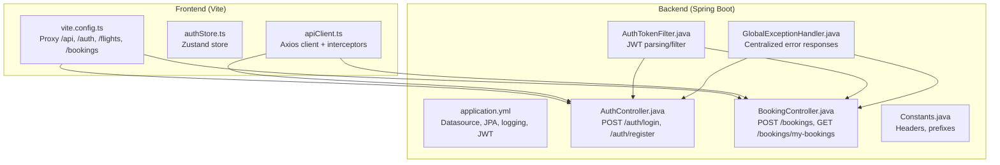
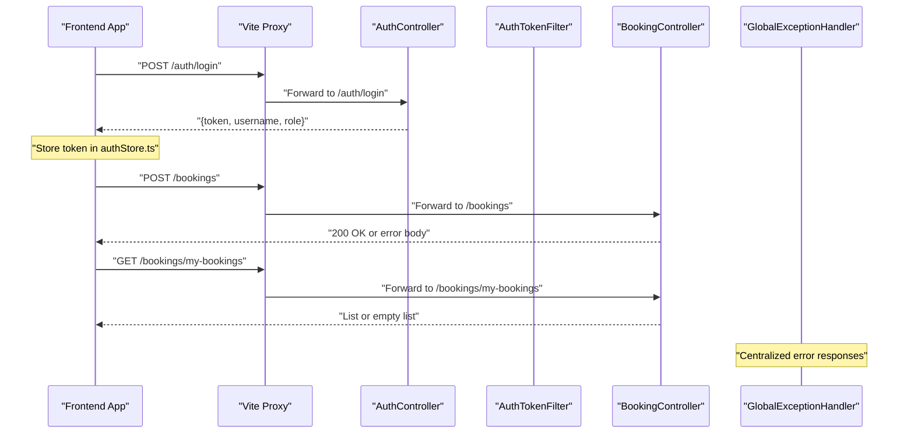
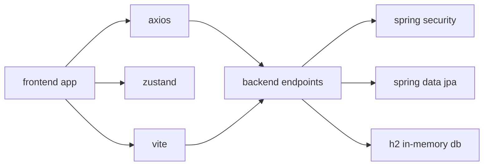

# Troubleshooting & FAQ

<cite>
**Referenced Files in This Document**
- [application.yml](file://backend-server/src/main/resources/application.yml)
- [GlobalExceptionHandler.java](file://backend-server/src/main/java/com/heyflow/exception/GlobalExceptionHandler.java)
- [BadRequestException.java](file://backend-server/src/main/java/com/heyflow/exception/BadRequestException.java)
- [ResourceNotFoundException.java](file://backend-server/src/main/java/com/heyflow/exception/ResourceNotFoundException.java)
- [UnauthorizedException.java](file://backend-server/src/main/java/com/heyflow/exception/UnauthorizedException.java)
- [AuthController.java](file://backend-server/src/main/java/com/heyflow/controller/AuthController.java)
- [BookingController.java](file://backend-server/src/main/java/com/heyflow/controller/BookingController.java)
- [BookingService.java](file://backend-server/src/main/java/com/heyflow/service/BookingService.java)
- [AuthTokenFilter.java](file://backend-server/src/main/java/com/heyflow/security/AuthTokenFilter.java)
- [Constants.java](file://backend-server/src/main/java/com/heyflow/util/Constants.java)
- [apiClient.ts](file://skyflow-pro/src/services/api/apiClient.ts)
- [circuitBreaker.ts](file://skyflow-pro/src/services/api/circuitBreaker.ts)
- [authStore.ts](file://skyflow-pro/src/stores/authStore.ts)
- [vite.config.ts](file://skyflow-pro/vite.config.ts)
- [package.json](file://skyflow-pro/package.json)
</cite>

## Table of Contents
1. [Introduction](#introduction)
2. [Project Structure](#project-structure)
3. [Core Components](#core-components)
4. [Architecture Overview](#architecture-overview)
5. [Detailed Component Analysis](#detailed-component-analysis)
6. [Dependency Analysis](#dependency-analysis)
7. [Performance Considerations](#performance-considerations)
8. [Troubleshooting Guide](#troubleshooting-guide)
9. [Conclusion](#conclusion)
10. [Appendices](#appendices)

## Introduction
This document provides comprehensive troubleshooting guidance for SkyFlow Pro, covering installation, setup, and operational issues across the backend (Spring Boot) and frontend (React + Vite). It focuses on diagnosing and resolving database connection problems, API connectivity issues, frontend build errors, authentication failures, booking processing errors, and performance bottlenecks. It also includes debugging techniques, log analysis methods, diagnostic procedures, frequently asked questions, error codes and resolutions, and security considerations.

## Project Structure
SkyFlow Pro consists of:
- Backend server built with Spring Boot and H2 in-memory database by default.
- Frontend built with React, TypeScript, Vite, and Zustand for state management.
- Proxy configuration in Vite to route API calls to the backend.
- Centralized exception handling and JWT-based authentication filters.

**Diagram sources**
- [application.yml:1-30](file://backend-server/src/main/resources/application.yml#L1-L30)
- [GlobalExceptionHandler.java:1-55](file://backend-server/src/main/java/com/heyflow/exception/GlobalExceptionHandler.java#L1-L55)
- [AuthController.java:1-58](file://backend-server/src/main/java/com/heyflow/controller/AuthController.java#L1-L58)
- [BookingController.java:1-89](file://backend-server/src/main/java/com/heyflow/controller/BookingController.java#L1-L89)
- [AuthTokenFilter.java:1-62](file://backend-server/src/main/java/com/heyflow/security/AuthTokenFilter.java#L1-L62)
- [Constants.java:1-17](file://backend-server/src/main/java/com/heyflow/util/Constants.java#L1-L17)
- [apiClient.ts:1-38](file://skyflow-pro/src/services/api/apiClient.ts#L1-L38)
- [vite.config.ts:1-53](file://skyflow-pro/vite.config.ts#L1-L53)
- [authStore.ts:1-123](file://skyflow-pro/src/stores/authStore.ts#L1-L123)

**Section sources**
- [application.yml:1-30](file://backend-server/src/main/resources/application.yml#L1-L30)
- [vite.config.ts:1-53](file://skyflow-pro/vite.config.ts#L1-L53)
- [package.json:1-46](file://skyflow-pro/package.json#L1-L46)

## Core Components
- Backend configuration and environment variables for database, JPA, logging, and JWT.
- Centralized exception handling returning structured error responses.
- Authentication endpoints and JWT filter for protecting endpoints.
- Booking endpoints with strict validation and transactional processing.
- Frontend Axios client with automatic JWT injection and 401 auto-logout.
- Vite proxy mapping frontend routes to backend endpoints.
- Zustand store for authentication state and local persistence.

**Section sources**
- [application.yml:1-30](file://backend-server/src/main/resources/application.yml#L1-L30)
- [GlobalExceptionHandler.java:1-55](file://backend-server/src/main/java/com/heyflow/exception/GlobalExceptionHandler.java#L1-L55)
- [AuthController.java:1-58](file://backend-server/src/main/java/com/heyflow/controller/AuthController.java#L1-L58)
- [BookingController.java:1-89](file://backend-server/src/main/java/com/heyflow/controller/BookingController.java#L1-L89)
- [AuthTokenFilter.java:1-62](file://backend-server/src/main/java/com/heyflow/security/AuthTokenFilter.java#L1-L62)
- [apiClient.ts:1-38](file://skyflow-pro/src/services/api/apiClient.ts#L1-L38)
- [vite.config.ts:1-53](file://skyflow-pro/vite.config.ts#L1-L53)
- [authStore.ts:1-123](file://skyflow-pro/src/stores/authStore.ts#L1-L123)

## Architecture Overview
End-to-end request flow for authentication and booking:

**Diagram sources**
- [AuthController.java:1-58](file://backend-server/src/main/java/com/heyflow/controller/AuthController.java#L1-L58)
- [BookingController.java:1-89](file://backend-server/src/main/java/com/heyflow/controller/BookingController.java#L1-L89)
- [GlobalExceptionHandler.java:1-55](file://backend-server/src/main/java/com/heyflow/exception/GlobalExceptionHandler.java#L1-L55)
- [AuthTokenFilter.java:1-62](file://backend-server/src/main/java/com/heyflow/security/AuthTokenFilter.java#L1-L62)
- [vite.config.ts:1-53](file://skyflow-pro/vite.config.ts#L1-L53)

## Detailed Component Analysis

### Backend Configuration and Environment Variables
- Datasource defaults to an in-memory H2 database with console enabled.
- JPA settings include DDL auto mode and SQL logging.
- Logging level for Spring Security is configured.
- JWT secret and expiration are defined.

Common issues:
- Incorrect JDBC URL or credentials lead to startup failures.
- Port conflicts prevent the backend from starting.
- Misconfigured JWT secret/expiry causes authentication failures.

Resolution steps:
- Verify environment variables for datasource and JWT.
- Change server.port if 8081 is in use.
- Confirm database platform dialect matches the chosen database.

**Section sources**
- [application.yml:1-30](file://backend-server/src/main/resources/application.yml#L1-L30)

### Centralized Exception Handling
- Catches resource-not-found, bad-request, unauthorized, and general exceptions.
- Returns structured JSON with timestamp, status, error, message, and path.

Common issues:
- Unhandled runtime exceptions return generic internal server error.
- Missing request validation leads to bad requests.

Resolution steps:
- Inspect logs for stack traces.
- Ensure custom exceptions are thrown for validation failures.
- Review request payloads for missing fields.

**Section sources**
- [GlobalExceptionHandler.java:1-55](file://backend-server/src/main/java/com/heyflow/exception/GlobalExceptionHandler.java#L1-L55)
- [BadRequestException.java:1-16](file://backend-server/src/main/java/com/heyflow/exception/BadRequestException.java#L1-L16)
- [ResourceNotFoundException.java:1-16](file://backend-server/src/main/java/com/heyflow/exception/ResourceNotFoundException.java#L1-L16)
- [UnauthorizedException.java:1-16](file://backend-server/src/main/java/com/heyflow/exception/UnauthorizedException.java#L1-L16)

### Authentication Flow and JWT Filter
- Login endpoint authenticates via AuthenticationManager and returns a JWT.
- JWT filter parses Authorization header and sets SecurityContext.
- Frontend Axios interceptor attaches Bearer token automatically.

Common issues:
- Missing or malformed Authorization header.
- Expired or invalid JWT.
- UserDetailsService load failure.

Resolution steps:
- Confirm Authorization header format and token validity.
- Verify JWT secret and expiry align with backend configuration.
- Check user existence and credentials.

**Section sources**
- [AuthController.java:1-58](file://backend-server/src/main/java/com/heyflow/controller/AuthController.java#L1-L58)
- [AuthTokenFilter.java:1-62](file://backend-server/src/main/java/com/heyflow/security/AuthTokenFilter.java#L1-L62)
- [Constants.java:1-17](file://backend-server/src/main/java/com/heyflow/util/Constants.java#L1-L17)
- [apiClient.ts:1-38](file://skyflow-pro/src/services/api/apiClient.ts#L1-L38)

### Booking Processing Logic
- Validates presence and type of flightId, seatNumber, seatClass.
- Transactionally checks seat availability, updates seat/booked flag, reduces available seats, creates booking, and sends notifications.
- Handles unauthorized cancellation attempts.

Common issues:
- Invalid flightId or non-numeric values.
- Seat already booked or invalid seat class.
- Missing authentication for booking endpoints.

Resolution steps:
- Ensure flightId originates from search results.
- Verify seatNumber and seatClass are non-empty.
- Authenticate before invoking booking endpoints.

**Section sources**
- [BookingController.java:1-89](file://backend-server/src/main/java/com/heyflow/controller/BookingController.java#L1-L89)
- [BookingService.java:1-148](file://backend-server/src/main/java/com/heyflow/service/BookingService.java#L1-L148)

### Frontend API Client and Proxy
- Axios client with base URL and Authorization header injection.
- Vite proxy forwards /api, /auth, /flights, /bookings to backend.
- Zustand store persists auth state locally.

Common issues:
- Proxy target mismatch or CORS errors.
- Missing token causing 401 responses.
- Build failures due to missing dependencies.

Resolution steps:
- Confirm VITE_API_BASE_URL and proxy targets.
- Ensure token is present in auth store before requests.
- Install dependencies and rebuild if needed.

**Section sources**
- [apiClient.ts:1-38](file://skyflow-pro/src/services/api/apiClient.ts#L1-L38)
- [vite.config.ts:1-53](file://skyflow-pro/vite.config.ts#L1-L53)
- [authStore.ts:1-123](file://skyflow-pro/src/stores/authStore.ts#L1-L123)
- [package.json:1-46](file://skyflow-pro/package.json#L1-L46)

### Circuit Breaker Pattern
- Tracks failure/success counts and transitions between closed/open/half-open states.
- Can be integrated around external calls to prevent cascading failures.

Common issues:
- Circuit remains open due to sustained failures.
- Misconfigured thresholds lead to premature opening.

Resolution steps:
- Adjust thresholds and timeouts based on observed failure rates.
- Monitor state transitions and reset after recovery.

**Section sources**
- [circuitBreaker.ts:1-62](file://skyflow-pro/src/services/api/circuitBreaker.ts#L1-L62)

## Dependency Analysis
- Frontend depends on Axios for HTTP, Zustand for state, and Vite for dev/build.
- Backend depends on Spring Security, Spring Data JPA, and H2 for development.
- Proxy and API client must align on base URLs and headers.

**Diagram sources**
- [package.json:1-46](file://skyflow-pro/package.json#L1-L46)
- [vite.config.ts:1-53](file://skyflow-pro/vite.config.ts#L1-L53)
- [apiClient.ts:1-38](file://skyflow-pro/src/services/api/apiClient.ts#L1-L38)
- [application.yml:1-30](file://backend-server/src/main/resources/application.yml#L1-L30)

**Section sources**
- [package.json:1-46](file://skyflow-pro/package.json#L1-L46)
- [application.yml:1-30](file://backend-server/src/main/resources/application.yml#L1-L30)

## Performance Considerations
- Enable SQL logging to identify slow queries; adjust JPA DDL and dialect as needed.
- Use transaction boundaries carefully to avoid long-running transactions.
- Monitor frontend network requests and reduce unnecessary re-renders.
- Consider caching for read-heavy endpoints (e.g., flights) and invalidate on changes.
- Tune JVM heap and garbage collection for production deployments.

[No sources needed since this section provides general guidance]

## Troubleshooting Guide

### Installation and Setup
Symptoms:
- Backend fails to start with database-related errors.
- Frontend build fails due to missing dependencies.

Resolutions:
- Backend: Set SPRING_DATASOURCE_URL, SPRING_DATASOURCE_USERNAME, SPRING_DATASOURCE_PASSWORD, SPRING_DATASOURCE_DRIVER, SPRING_JPA_HIBERNATE_DDL_AUTO, and JWT secret/expiry via environment variables.
- Frontend: Run dependency install and rebuild; confirm VITE_API_BASE_URL and proxy targets.

**Section sources**
- [application.yml:1-30](file://backend-server/src/main/resources/application.yml#L1-L30)
- [package.json:1-46](file://skyflow-pro/package.json#L1-L46)
- [vite.config.ts:1-53](file://skyflow-pro/vite.config.ts#L1-L53)

### Database Connection Problems
Symptoms:
- Application startup fails with database connection refused or invalid credentials.
- H2 console not accessible.

Resolutions:
- Verify JDBC URL and credentials; ensure the database is reachable.
- Confirm H2 console path and enabled flag.
- For production, switch to a persistent database and configure dialect accordingly.

**Section sources**
- [application.yml:1-30](file://backend-server/src/main/resources/application.yml#L1-L30)

### API Connectivity Issues
Symptoms:
- Frontend receives 404/403/401 when calling backend endpoints.
- Proxy does not forward requests.

Resolutions:
- Confirm Vite proxy targets match backend ports and paths (/api, /auth, /flights, /bookings).
- Ensure backend server is running on the expected port.
- Check Authorization header presence for protected endpoints.

**Section sources**
- [vite.config.ts:1-53](file://skyflow-pro/vite.config.ts#L1-L53)
- [apiClient.ts:1-38](file://skyflow-pro/src/services/api/apiClient.ts#L1-L38)
- [Constants.java:1-17](file://backend-server/src/main/java/com/heyflow/util/Constants.java#L1-L17)

### Frontend Build Errors
Symptoms:
- Build fails with module resolution or missing types.
- Tests fail due to environment setup.

Resolutions:
- Install dependencies and retry build.
- Ensure TypeScript and ESLint configurations are consistent.
- Configure Vitest environment and setup files.

**Section sources**
- [package.json:1-46](file://skyflow-pro/package.json#L1-L46)
- [vite.config.ts:1-53](file://skyflow-pro/vite.config.ts#L1-L53)

### Authentication Failures
Symptoms:
- Login succeeds but subsequent requests return 401.
- Auto-logout occurs unexpectedly.

Resolutions:
- Verify JWT secret and expiry match backend configuration.
- Ensure Authorization header is attached by the Axios interceptor.
- Confirm user exists and credentials are correct.

**Section sources**
- [AuthController.java:1-58](file://backend-server/src/main/java/com/heyflow/controller/AuthController.java#L1-L58)
- [AuthTokenFilter.java:1-62](file://backend-server/src/main/java/com/heyflow/security/AuthTokenFilter.java#L1-L62)
- [apiClient.ts:1-38](file://skyflow-pro/src/services/api/apiClient.ts#L1-L38)
- [authStore.ts:1-123](file://skyflow-pro/src/stores/authStore.ts#L1-L123)

### Booking Processing Errors
Symptoms:
- Bad request due to missing fields or invalid flightId.
- Internal server error during booking or cancellation.

Resolutions:
- Ensure payload includes flightId, seatNumber, seatClass.
- Validate flightId comes from search results.
- Check seat availability and class values.
- For cancellations, ensure the authenticated user owns the booking.

**Section sources**
- [BookingController.java:1-89](file://backend-server/src/main/java/com/heyflow/controller/BookingController.java#L1-L89)
- [BookingService.java:1-148](file://backend-server/src/main/java/com/heyflow/service/BookingService.java#L1-L148)

### Performance Issues
Symptoms:
- Slow response times for search or booking.
- High CPU/memory usage.

Resolutions:
- Enable SQL logging and optimize queries.
- Reduce transaction scope and batch updates where possible.
- Use caching for read-heavy endpoints and invalidate on write.
- Scale horizontally and tune JVM settings for production.

**Section sources**
- [application.yml:1-30](file://backend-server/src/main/resources/application.yml#L1-L30)

### Debugging Techniques and Log Analysis
Techniques:
- Inspect centralized error responses for timestamps, statuses, and messages.
- Review Spring Security logs for authentication events.
- Capture frontend network requests and response bodies.
- Use H2 console to inspect persisted data.

**Section sources**
- [GlobalExceptionHandler.java:1-55](file://backend-server/src/main/java/com/heyflow/exception/GlobalExceptionHandler.java#L1-L55)
- [application.yml:1-30](file://backend-server/src/main/resources/application.yml#L1-L30)
- [apiClient.ts:1-38](file://skyflow-pro/src/services/api/apiClient.ts#L1-L38)

### Diagnostic Procedures
Procedures:
- Verify environment variables for backend configuration.
- Test endpoints individually with curl or Postman.
- Confirm JWT lifecycle and expiration.
- Validate seat and flight data integrity.

**Section sources**
- [application.yml:1-30](file://backend-server/src/main/resources/application.yml#L1-L30)
- [AuthController.java:1-58](file://backend-server/src/main/java/com/heyflow/controller/AuthController.java#L1-L58)
- [BookingService.java:1-148](file://backend-server/src/main/java/com/heyflow/service/BookingService.java#L1-L148)

### Frequently Asked Questions

Q: What are the system requirements?
- Backend: Java-based Spring Boot application with Maven wrapper support.
- Frontend: Node.js and npm/yarn for dependency management and Vite toolchain.
- Database: H2 in-memory by default; production requires a persistent database.

Q: How do I configure the database?
- Set SPRING_DATASOURCE_URL, SPRING_DATASOURCE_USERNAME, SPRING_DATASOURCE_PASSWORD, and SPRING_DATASOURCE_DRIVER.
- Choose appropriate JPA DDL and database platform dialect.

Q: Why am I getting 401 Unauthorized?
- Missing Authorization header or invalid/expired JWT.
- Ensure the frontend attaches the Bearer token and the backend validates it.

Q: How do I enable the H2 console?
- Confirm h2.console.enabled and h2.console.path in configuration.

Q: How do I change the backend port?
- Modify server.port in configuration.

Q: How do I integrate a production database?
- Switch to a supported database, update JDBC URL and driver, and set dialect accordingly.

**Section sources**
- [application.yml:1-30](file://backend-server/src/main/resources/application.yml#L1-L30)
- [apiClient.ts:1-38](file://skyflow-pro/src/services/api/apiClient.ts#L1-L38)
- [vite.config.ts:1-53](file://skyflow-pro/vite.config.ts#L1-L53)

### Error Codes and Meanings

- 400 Bad Request
  - Cause: Missing or invalid request fields (e.g., flightId, seatNumber, seatClass).
  - Resolution: Validate payload and ensure numeric flightId and non-empty seat fields.

- 401 Unauthorized
  - Cause: Missing or invalid JWT; authentication failed.
  - Resolution: Re-authenticate and ensure Authorization header is present.

- 404 Not Found
  - Cause: Resource not found (e.g., user, flight).
  - Resolution: Verify identifiers and existence in the database.

- 500 Internal Server Error
  - Cause: Unexpected exception; check logs for stack traces.
  - Resolution: Fix underlying issue and ensure proper exception handling.

**Section sources**
- [GlobalExceptionHandler.java:1-55](file://backend-server/src/main/java/com/heyflow/exception/GlobalExceptionHandler.java#L1-L55)
- [BadRequestException.java:1-16](file://backend-server/src/main/java/com/heyflow/exception/BadRequestException.java#L1-L16)
- [ResourceNotFoundException.java:1-16](file://backend-server/src/main/java/com/heyflow/exception/ResourceNotFoundException.java#L1-L16)
- [UnauthorizedException.java:1-16](file://backend-server/src/main/java/com/heyflow/exception/UnauthorizedException.java#L1-L16)
- [BookingController.java:1-89](file://backend-server/src/main/java/com/heyflow/controller/BookingController.java#L1-L89)

### Security Considerations
- JWT secret and expiry must be strong and consistent across environments.
- Use HTTPS in production and secure cookies if applicable.
- Validate and sanitize all inputs to prevent injection attacks.
- Limit exposed endpoints and enforce RBAC where needed.
- Keep dependencies updated and scan for vulnerabilities.

**Section sources**
- [application.yml:1-30](file://backend-server/src/main/resources/application.yml#L1-L30)
- [AuthTokenFilter.java:1-62](file://backend-server/src/main/java/com/heyflow/security/AuthTokenFilter.java#L1-L62)

## Conclusion
By following this guide, you can systematically diagnose and resolve common issues in SkyFlow Pro. Focus on environment configuration, authentication flow, API connectivity, and error handling. Use the provided diagnostics and logging techniques to pinpoint problems quickly and apply the recommended resolutions.

## Appendices

### Quick Checklist
- Backend: Confirm datasource, JWT, and port settings.
- Frontend: Install dependencies, set base URL, and verify proxy.
- Authentication: Ensure tokens are attached and validated.
- Booking: Validate payload and seat availability.
- Logs: Review centralized error responses and Spring Security logs.

[No sources needed since this section provides general guidance]